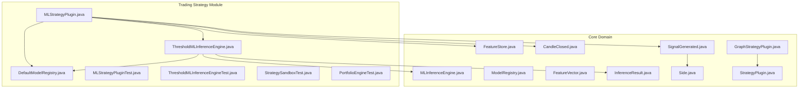
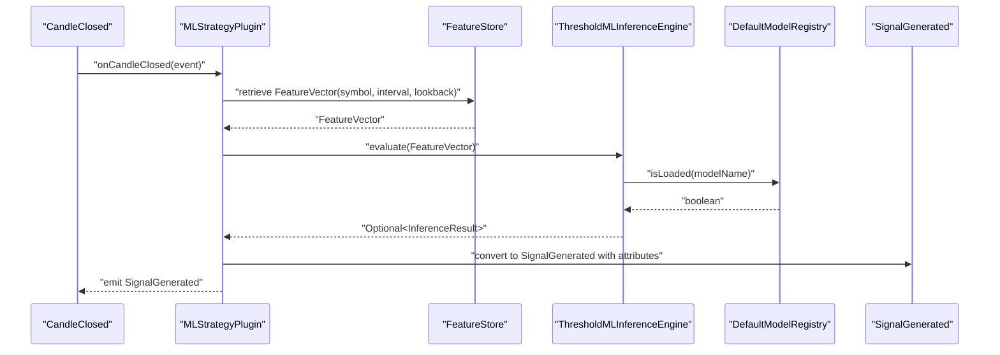
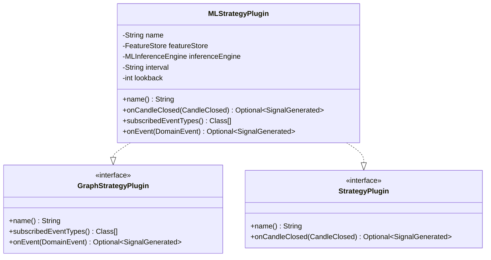
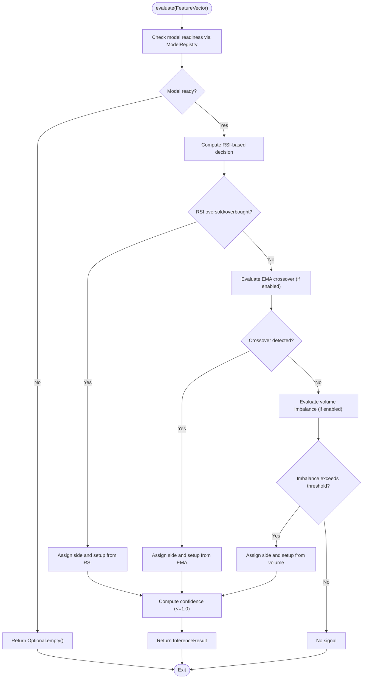
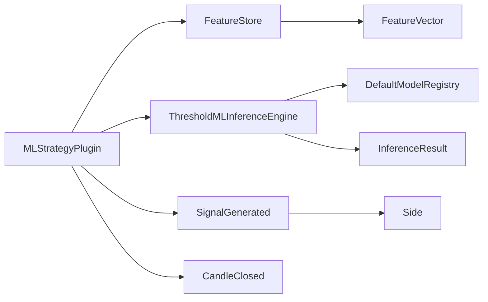

# Machine Learning Strategy Integration

<cite>
**Referenced Files in This Document**
- [MLStrategyPlugin.java](file://trading/strategy/src/main/java/com/tradej/strategy/ml/MLStrategyPlugin.java)
- [ThresholdMLInferenceEngine.java](file://trading/strategy/src/main/java/com/tradej/strategy/ml/ThresholdMLInferenceEngine.java)
- [DefaultModelRegistry.java](file://trading/strategy/src/main/java/com/tradej/strategy/ml/DefaultModelRegistry.java)
- [MLStrategyPluginTest.java](file://trading/strategy/src/test/java/com/tradej/strategy/ml/MLStrategyPluginTest.java)
- [ThresholdMLInferenceEngineTest.java](file://trading/strategy/src/test/java/com/tradej/strategy/ml/ThresholdMLInferenceEngineTest.java)
- [StrategySandboxTest.java](file://trading/strategy/src/test/java/com/tradej/strategy/service/StrategySandboxTest.java)
- [PortfolioEngineTest.java](file://trading/strategy/src/test/java/com/tradej/strategy/portfolio/PortfolioEngineTest.java)
- [GraphStrategyPlugin.java](file://trading/strategy/src/main/java/com/tradej/strategy/api/GraphStrategyPlugin.java)
- [StrategyPlugin.java](file://trading/strategy/src/main/java/com/tradej/strategy/api/StrategyPlugin.java)
- [MLInferenceEngine.java](file://core/src/main/java/com/tradej/core/domain/port/MLInferenceEngine.java)
- [ModelRegistry.java](file://core/src/main/java/com/tradej/core/domain/port/ModelRegistry.java)
- [FeatureStore.java](file://core/src/main/java/com/tradej/core/domain/port/FeatureStore.java)
- [FeatureVector.java](file://core/src/main/java/com/tradej/core/domain/model/FeatureVector.java)
- [InferenceResult.java](file://core/src/main/java/com/tradej/core/domain/model/InferenceResult.java)
- [CandleClosed.java](file://core/src/main/java/com/tradej/core/domain/model/CandleClosed.java)
- [SignalGenerated.java](file://core/src/main/java/com/tradej/core/domain/model/SignalGenerated.java)
- [Side.java](file://core/src/main/java/com/tradej/core/domain/value/Side.java)
- [ARCHITECTURE_REPORT.md](file://docs/ARCHITECTURE_REPORT.md)
</cite>

## Table of Contents
1. [Introduction](#introduction)
2. [Project Structure](#project-structure)
3. [Core Components](#core-components)
4. [Architecture Overview](#architecture-overview)
5. [Detailed Component Analysis](#detailed-component-analysis)
6. [Dependency Analysis](#dependency-analysis)
7. [Performance Considerations](#performance-considerations)
8. [Troubleshooting Guide](#troubleshooting-guide)
9. [Conclusion](#conclusion)
10. [Appendices](#appendices)

## Introduction
This document explains the Machine Learning Strategy Integration built around the MLStrategyPlugin architecture. It covers how machine learning models are integrated into trading strategies, how inference decisions are made via ThresholdMLInferenceEngine, and how models are managed through DefaultModelRegistry. The document also details training workflows, inference pipelines, performance monitoring, model versioning, A/B testing, real-time inference strategies, validation, drift detection, and adaptive strategy modification based on ML insights.

## Project Structure
The ML integration resides primarily under the trading/strategy module, with supporting domain models and ports in the core module. The key files include:
- MLStrategyPlugin: Bridges ML inference into the strategy execution pipeline
- ThresholdMLInferenceEngine: Threshold-based inference engine for rule-driven ML decisions
- DefaultModelRegistry: In-memory model registry for development and demo scenarios
- Tests validating plugin behavior, inference rules, and sandbox integration

**Diagram sources**
- [MLStrategyPlugin.java:41-97](file://trading/strategy/src/main/java/com/tradej/strategy/ml/MLStrategyPlugin.java#L41-L97)
- [ThresholdMLInferenceEngine.java:26-42](file://trading/strategy/src/main/java/com/tradej/strategy/ml/ThresholdMLInferenceEngine.java#L26-L42)
- [DefaultModelRegistry.java:21-56](file://trading/strategy/src/main/java/com/tradej/strategy/ml/DefaultModelRegistry.java#L21-L56)
- [MLInferenceEngine.java](file://core/src/main/java/com/tradej/core/domain/port/MLInferenceEngine.java)
- [ModelRegistry.java](file://core/src/main/java/com/tradej/core/domain/port/ModelRegistry.java)
- [FeatureStore.java](file://core/src/main/java/com/tradej/core/domain/port/FeatureStore.java)
- [FeatureVector.java](file://core/src/main/java/com/tradej/core/domain/model/FeatureVector.java)
- [InferenceResult.java](file://core/src/main/java/com/tradej/core/domain/model/InferenceResult.java)
- [CandleClosed.java](file://core/src/main/java/com/tradej/core/domain/model/CandleClosed.java)
- [SignalGenerated.java](file://core/src/main/java/com/tradej/core/domain/model/SignalGenerated.java)
- [Side.java](file://core/src/main/java/com/tradej/core/domain/value/Side.java)
- [GraphStrategyPlugin.java](file://trading/strategy/src/main/java/com/tradej/strategy/api/GraphStrategyPlugin.java)
- [StrategyPlugin.java](file://trading/strategy/src/main/java/com/tradej/strategy/api/StrategyPlugin.java)

**Section sources**
- [MLStrategyPlugin.java:16-97](file://trading/strategy/src/main/java/com/tradej/strategy/ml/MLStrategyPlugin.java#L16-L97)
- [ThresholdMLInferenceEngine.java:13-42](file://trading/strategy/src/main/java/com/tradej/strategy/ml/ThresholdMLInferenceEngine.java#L13-L42)
- [DefaultModelRegistry.java:11-56](file://trading/strategy/src/main/java/com/tradej/strategy/ml/DefaultModelRegistry.java#L11-L56)

## Core Components
- MLStrategyPlugin: Adapts ML inference into both legacy and graph strategy sandboxes, transforming CandleClosed events into SignalGenerated signals via FeatureVector retrieval and MLInferenceEngine evaluation.
- ThresholdMLInferenceEngine: Implements MLInferenceEngine with configurable threshold rules for RSI, EMA crossovers, and volume imbalance, producing InferenceResult with confidence and setup metadata.
- DefaultModelRegistry: Provides an in-memory model registry for development/demo, pre-loading models and reporting readiness for inference.

Key responsibilities:
- Feature acquisition and inference orchestration
- Threshold-based decision logic with confidence scoring
- Model availability verification and logging
- Signal generation with attributes for downstream risk processing

**Section sources**
- [MLStrategyPlugin.java:41-97](file://trading/strategy/src/main/java/com/tradej/strategy/ml/MLStrategyPlugin.java#L41-L97)
- [ThresholdMLInferenceEngine.java:26-42](file://trading/strategy/src/main/java/com/tradej/strategy/ml/ThresholdMLInferenceEngine.java#L26-L42)
- [DefaultModelRegistry.java:21-56](file://trading/strategy/src/main/java/com/tradej/strategy/ml/DefaultModelRegistry.java#L21-L56)

## Architecture Overview
The ML integration follows a layered architecture:
- Strategy Plugin Layer: MLStrategyPlugin integrates with StrategySandbox and GraphStrategySandbox
- Inference Engine Layer: ThresholdMLInferenceEngine evaluates FeatureVector inputs
- Model Registry Layer: DefaultModelRegistry manages model readiness
- Domain Models: FeatureVector, InferenceResult, CandleClosed, SignalGenerated, Side

**Diagram sources**
- [MLStrategyPlugin.java:78-97](file://trading/strategy/src/main/java/com/tradej/strategy/ml/MLStrategyPlugin.java#L78-L97)
- [ThresholdMLInferenceEngine.java:44-50](file://trading/strategy/src/main/java/com/tradej/strategy/ml/ThresholdMLInferenceEngine.java#L44-L50)
- [DefaultModelRegistry.java:47-50](file://trading/strategy/src/main/java/com/tradej/strategy/ml/DefaultModelRegistry.java#L47-L50)
- [FeatureStore.java](file://core/src/main/java/com/tradej/core/domain/port/FeatureStore.java)
- [FeatureVector.java](file://core/src/main/java/com/tradej/core/domain/model/FeatureVector.java)
- [InferenceResult.java](file://core/src/main/java/com/tradej/core/domain/model/InferenceResult.java)
- [SignalGenerated.java](file://core/src/main/java/com/tradej/core/domain/model/SignalGenerated.java)

## Detailed Component Analysis

### MLStrategyPlugin
Responsibilities:
- Bridge ML inference into strategy execution
- Retrieve FeatureVector on CandleClosed events
- Convert InferenceResult to SignalGenerated
- Support both legacy StrategyPlugin and GraphStrategyPlugin interfaces

Processing logic:
- Validates event type and delegates to evaluateCandle
- Retrieves features from FeatureStore
- Calls MLInferenceEngine to produce InferenceResult
- Emits SignalGenerated with side, setup, and attributes (confidence, model name, quantity)

**Diagram sources**
- [MLStrategyPlugin.java:41-97](file://trading/strategy/src/main/java/com/tradej/strategy/ml/MLStrategyPlugin.java#L41-L97)
- [GraphStrategyPlugin.java](file://trading/strategy/src/main/java/com/tradej/strategy/api/GraphStrategyPlugin.java)
- [StrategyPlugin.java](file://trading/strategy/src/main/java/com/tradej/strategy/api/StrategyPlugin.java)

**Section sources**
- [MLStrategyPlugin.java:41-97](file://trading/strategy/src/main/java/com/tradej/strategy/ml/MLStrategyPlugin.java#L41-L97)
- [MLStrategyPluginTest.java:104-135](file://trading/strategy/src/test/java/com/tradej/strategy/ml/MLStrategyPluginTest.java#L104-L135)

### ThresholdMLInferenceEngine
Responsibilities:
- Evaluate FeatureVector inputs against configurable thresholds
- Produce InferenceResult with side, setup, and confidence
- Verify model readiness via ModelRegistry

Decision logic:
- Checks model readiness before inference
- Applies RSI oversold/overbought thresholds
- Optionally applies EMA crossover conditions
- Optionally applies volume imbalance conditions
- Caps confidence at 1.0 and ensures positivity

**Diagram sources**
- [ThresholdMLInferenceEngine.java:44-167](file://trading/strategy/src/main/java/com/tradej/strategy/ml/ThresholdMLInferenceEngine.java#L44-L167)
- [ModelRegistry.java](file://core/src/main/java/com/tradej/core/domain/port/ModelRegistry.java)
- [InferenceResult.java](file://core/src/main/java/com/tradej/core/domain/model/InferenceResult.java)

**Section sources**
- [ThresholdMLInferenceEngine.java:13-183](file://trading/strategy/src/main/java/com/tradej/strategy/ml/ThresholdMLInferenceEngine.java#L13-L183)
- [ThresholdMLInferenceEngineTest.java:32-300](file://trading/strategy/src/test/java/com/tradej/strategy/ml/ThresholdMLInferenceEngineTest.java#L32-L300)

### DefaultModelRegistry
Responsibilities:
- Pre-load models at construction time for development/demo
- Report model availability and readiness
- Log model loading status

Behavior:
- Stores loaded models in concurrent set
- Returns available models list
- Supports eager loading simulation

**Section sources**
- [DefaultModelRegistry.java:11-56](file://trading/strategy/src/main/java/com/tradej/strategy/ml/DefaultModelRegistry.java#L11-L56)

### Integration with Strategy Sandboxes
MLStrategyPlugin participates in both legacy StrategySandbox and GraphStrategySandbox:
- Legacy: StrategyPlugin.onCandleClosed triggers inference
- Graph: GraphStrategyPlugin.onEvent filters CandleClosed and triggers inference
- Tests confirm non-CandleClosed events are ignored in legacy sandbox

**Section sources**
- [StrategySandboxTest.java:39-183](file://trading/strategy/src/test/java/com/tradej/strategy/service/StrategySandboxTest.java#L39-L183)
- [MLStrategyPlugin.java:78-97](file://trading/strategy/src/main/java/com/tradej/strategy/ml/MLStrategyPlugin.java#L78-L97)

## Dependency Analysis
The ML integration exhibits clean separation of concerns:
- MLStrategyPlugin depends on FeatureStore, MLInferenceEngine, and ModelRegistry
- ThresholdMLInferenceEngine depends on ModelRegistry and FeatureVector
- DefaultModelRegistry provides model readiness abstraction
- Domain models (FeatureVector, InferenceResult, CandleClosed, SignalGenerated, Side) define the data contract

**Diagram sources**
- [MLStrategyPlugin.java:46-47](file://trading/strategy/src/main/java/com/tradej/strategy/ml/MLStrategyPlugin.java#L46-L47)
- [ThresholdMLInferenceEngine.java:30-31](file://trading/strategy/src/main/java/com/tradej/strategy/ml/ThresholdMLInferenceEngine.java#L30-L31)
- [DefaultModelRegistry.java:25-26](file://trading/strategy/src/main/java/com/tradej/strategy/ml/DefaultModelRegistry.java#L25-L26)
- [FeatureVector.java](file://core/src/main/java/com/tradej/core/domain/model/FeatureVector.java)
- [InferenceResult.java](file://core/src/main/java/com/tradej/core/domain/model/InferenceResult.java)
- [CandleClosed.java](file://core/src/main/java/com/tradej/core/domain/model/CandleClosed.java)
- [SignalGenerated.java](file://core/src/main/java/com/tradej/core/domain/model/SignalGenerated.java)
- [Side.java](file://core/src/main/java/com/tradej/core/domain/value/Side.java)

**Section sources**
- [MLStrategyPlugin.java:41-97](file://trading/strategy/src/main/java/com/tradej/strategy/ml/MLStrategyPlugin.java#L41-L97)
- [ThresholdMLInferenceEngine.java:26-42](file://trading/strategy/src/main/java/com/tradej/strategy/ml/ThresholdMLInferenceEngine.java#L26-L42)
- [DefaultModelRegistry.java:21-56](file://trading/strategy/src/main/java/com/tradej/strategy/ml/DefaultModelRegistry.java#L21-L56)

## Performance Considerations
- Inference latency: Threshold-based evaluation is lightweight; ensure FeatureStore queries are efficient and cached where appropriate
- Concurrency: DefaultModelRegistry uses concurrent structures; ensure model loading and readiness checks are fast
- Confidence computation: Keep calculations vectorized and avoid unnecessary allocations
- Event filtering: MLStrategyPlugin only processes CandleClosed events, reducing unnecessary inference overhead
- Batch processing: Consider aggregating multiple candles before inference for higher throughput

## Troubleshooting Guide
Common issues and resolutions:
- Model not loaded: ThresholdMLInferenceEngine logs a warning and skips inference when the model is not ready; verify DefaultModelRegistry.loadModel or switch to a production-ready ModelRegistry implementation
- No signal generated: Ensure FeatureVector contains valid features and thresholds are configured appropriately; confirm plugin name and interval match the FeatureStore expectations
- Incorrect side or setup: Review ThresholdConfig settings for RSI, EMA, and volume thresholds; validate Side mapping in SignalGenerated conversion
- Sandbox integration: Confirm CandleClosed events are reaching the plugin; legacy sandbox ignores non-CandleClosed events

Validation and tests:
- MLStrategyPluginTest verifies signal attributes including confidence, setup, model name, and quantity
- ThresholdMLInferenceEngineTest validates RSI, EMA, and volume-based signals with confidence bounds
- StrategySandboxTest confirms plugin behavior and event filtering
- PortfolioEngineTest demonstrates downstream portfolio effects after signal emission

**Section sources**
- [ThresholdMLInferenceEngine.java:46-50](file://trading/strategy/src/main/java/com/tradej/strategy/ml/ThresholdMLInferenceEngine.java#L46-L50)
- [MLStrategyPluginTest.java:104-135](file://trading/strategy/src/test/java/com/tradej/strategy/ml/MLStrategyPluginTest.java#L104-L135)
- [ThresholdMLInferenceEngineTest.java:32-300](file://trading/strategy/src/test/java/com/tradej/strategy/ml/ThresholdMLInferenceEngineTest.java#L32-L300)
- [StrategySandboxTest.java:39-183](file://trading/strategy/src/test/java/com/tradej/strategy/service/StrategySandboxTest.java#L39-L183)
- [PortfolioEngineTest.java:347-377](file://trading/strategy/src/test/java/com/tradej/strategy/portfolio/PortfolioEngineTest.java#L347-L377)

## Conclusion
The ML Strategy Integration provides a robust, configurable framework for incorporating machine learning models into trading strategies. MLStrategyPlugin seamlessly bridges ML inference into the execution pipeline, ThresholdMLInferenceEngine offers threshold-based decision logic with confidence scoring, and DefaultModelRegistry supports development and demo scenarios. The architecture supports real-time inference, model validation, and downstream portfolio risk processing, laying the groundwork for advanced capabilities such as model versioning, A/B testing, and drift detection.

## Appendices

### Model Training Workflows
- Dataset preparation: Use historical FeatureVectors from FeatureStore to train models offline
- Model selection: Compare threshold configurations and external ML models using backtesting
- Validation: Validate on out-of-sample periods and stress scenarios
- Deployment: Integrate trained models via a production ModelRegistry implementation

### Inference Pipelines
- Real-time: CandleClosed events trigger FeatureVector retrieval and inference
- Batch: Aggregate multiple candles for throughput optimization
- Async: Offload inference to separate threads or queues for low-latency response

### Performance Monitoring
- Track inference latency per symbol and model
- Monitor signal frequency and win rate by setup type
- Observe portfolio impact and PnL attribution per model

### Model Versioning and A/B Testing
- Versioned models: Tag models (e.g., mean-reversion-v1, mean-reversion-v2) in DefaultModelRegistry and switch via ThresholdConfig
- A/B testing: Route subsets of symbols to different model versions; compare performance metrics and adjust allocation dynamically

### Real-Time Inference Strategies
- Adaptive thresholds: Adjust RSI and volume thresholds based on market regimes
- Ensemble signals: Combine multiple models or setups for higher confidence
- Risk-aware sizing: Use model confidence to scale position sizes

### Examples and References
- ML model integration: See MLStrategyPlugin usage in tests and sandbox integration
- Threshold configuration: Review ThresholdConfig fields for RSI, EMA, and volume parameters
- Model registry usage: Initialize DefaultModelRegistry with model names and load models before inference

**Section sources**
- [MLStrategyPluginTest.java:104-135](file://trading/strategy/src/test/java/com/tradej/strategy/ml/MLStrategyPluginTest.java#L104-L135)
- [ThresholdMLInferenceEngineTest.java:32-300](file://trading/strategy/src/test/java/com/tradej/strategy/ml/ThresholdMLInferenceEngineTest.java#L32-L300)
- [DefaultModelRegistry.java:21-56](file://trading/strategy/src/main/java/com/tradej/strategy/ml/DefaultModelRegistry.java#L21-L56)
- [ARCHITECTURE_REPORT.md:1112-1165](file://docs/ARCHITECTURE_REPORT.md#L1112-L1165)