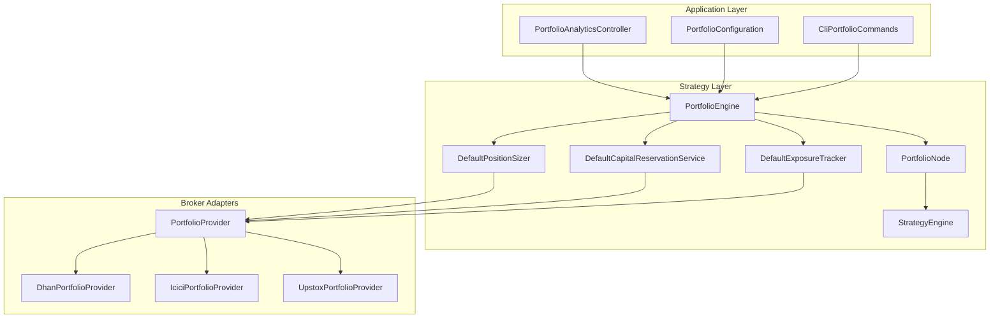
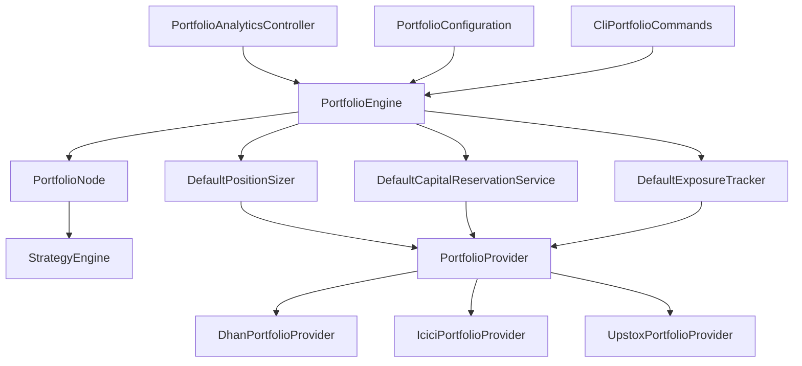
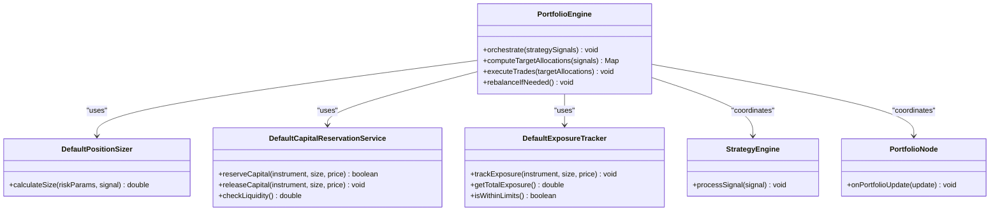
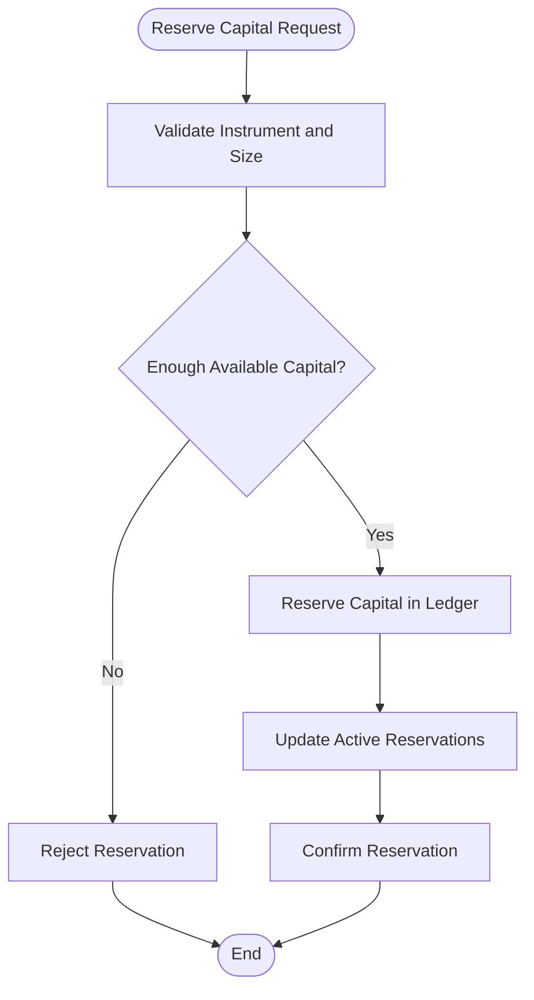
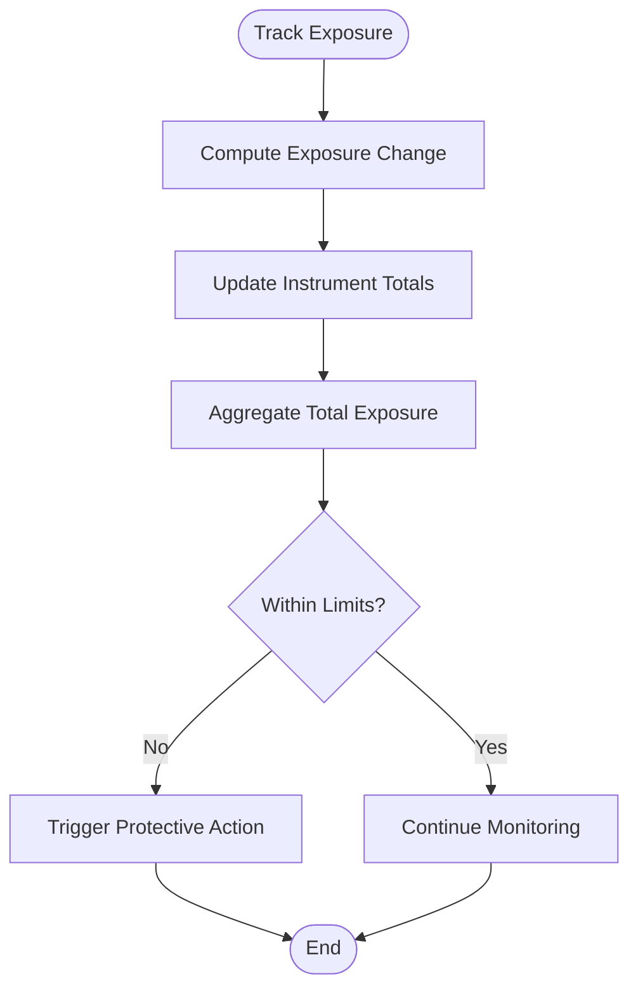
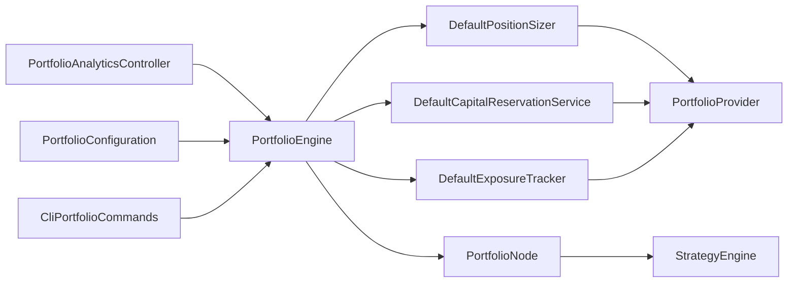

# Portfolio Management

<cite>
**Referenced Files in This Document**
- [PortfolioEngine.java](file://trading/strategy/src/main/java/com/tradej/strategy/portfolio/PortfolioEngine.java)
- [DefaultCapitalReservationService.java](file://trading/strategy/src/main/java/com/tradej/strategy/portfolio/DefaultCapitalReservationService.java)
- [DefaultExposureTracker.java](file://trading/strategy/src/main/java/com/tradej/strategy/portfolio/DefaultExposureTracker.java)
- [ExposureTracker.java](file://trading/strategy/src/main/java/com/tradej/strategy/portfolio/ExposureTracker.java)
- [DefaultPositionSizer.java](file://trading/strategy/src/main/java/com/tradej/strategy/position/DefaultPositionSizer.java)
- [PortfolioProvider.java](file://broker/api/src/main/java/com/tradej/broker/api/port/PortfolioProvider.java)
- [DhanPortfolioProvider.java](file://broker/dhan/src/main/java/com/tradej/broker/dhan/adapter/DhanPortfolioProvider.java)
- [IciciPortfolioProvider.java](file://broker/icici/src/main/java/com/tradej/broker/icici/adapter/IciciPortfolioProvider.java)
- [UpstoxPortfolioProvider.java](file://broker/upstox/src/main/java/com/tradej/broker/upstox/adapter/UpstoxPortfolioProvider.java)
- [PortfolioNode.java](file://trading/strategy/src/main/java/com/tradej/strategy/node/PortfolioNode.java)
- [StrategyEngine.java](file://trading/strategy/src/main/java/com/tradej/strategy/service/StrategyEngine.java)
- [PortfolioAnalyticsController.java](file://app/src/main/java/com/tradej/app/api/PortfolioAnalyticsController.java)
- [PortfolioConfiguration.java](file://app/src/main/java/com/tradej/app/config/PortfolioConfiguration.java)
- [CliPortfolioCommands.java](file://cli/src/main/java/com/tradej/cli/command/CliPortfolioCommands.java)
- [PortfolioEngineTest.java](file://trading/strategy/src/test/java/com/tradej/strategy/portfolio/PortfolioEngineTest.java)
- [PortfolioEngineStressTest.java](file://trading/strategy/src/test/java/com/tradej/strategy/portfolio/PortfolioEngineStressTest.java)
- [CapitalReservationServiceTest.java](file://trading/strategy/src/test/java/com/tradej/strategy/portfolio/CapitalReservationServiceTest.java)
- [ExposureTrackerTest.java](file://trading/strategy/src/test/java/com/tradej/strategy/portfolio/ExposureTrackerTest.java)
</cite>

## Table of Contents
1. [Introduction](#introduction)
2. [Project Structure](#project-structure)
3. [Core Components](#core-components)
4. [Architecture Overview](#architecture-overview)
5. [Detailed Component Analysis](#detailed-component-analysis)
6. [Dependency Analysis](#dependency-analysis)
7. [Performance Considerations](#performance-considerations)
8. [Troubleshooting Guide](#troubleshooting-guide)
9. [Conclusion](#conclusion)
10. [Appendices](#appendices)

## Introduction
This document provides comprehensive documentation for the Portfolio Management system within the TradeJ platform. It focuses on the PortfolioEngine's role in managing portfolio allocations, position sizing, and capital reservation, alongside the DefaultCapitalReservationService for liquidity management and the DefaultExposureTracker for risk monitoring. It also explains the ExposureTracker interface and its implementations, covers position sizing algorithms, capital allocation strategies, and risk management integration, and includes examples of portfolio configuration, position sizing calculations, and exposure tracking patterns. Finally, it addresses portfolio rebalancing, margin requirements, and performance attribution within the strategy framework.

## Project Structure
The Portfolio Management system spans several modules:
- Strategy module: Core portfolio orchestration, position sizing, and exposure tracking
- Broker adapters: Portfolio data providers for Dhan, ICICI, and Upstox
- Application layer: Controllers and configuration for portfolio analytics and CLI commands
- Tests: Coverage for PortfolioEngine, capital reservation, and exposure tracker

**Diagram sources**
- [PortfolioEngine.java:1-200](file://trading/strategy/src/main/java/com/tradej/strategy/portfolio/PortfolioEngine.java#L1-L200)
- [DefaultCapitalReservationService.java:1-200](file://trading/strategy/src/main/java/com/tradej/strategy/portfolio/DefaultCapitalReservationService.java#L1-L200)
- [DefaultExposureTracker.java:1-200](file://trading/strategy/src/main/java/com/tradej/strategy/portfolio/DefaultExposureTracker.java#L1-L200)
- [DefaultPositionSizer.java:1-200](file://trading/strategy/src/main/java/com/tradej/strategy/position/DefaultPositionSizer.java#L1-L200)
- [PortfolioProvider.java:1-200](file://broker/api/src/main/java/com/tradej/broker/api/port/PortfolioProvider.java#L1-L200)
- [DhanPortfolioProvider.java:1-200](file://broker/dhan/src/main/java/com/tradej/broker/dhan/adapter/DhanPortfolioProvider.java#L1-L200)
- [IciciPortfolioProvider.java:1-200](file://broker/icici/src/main/java/com/tradej/broker/icici/adapter/IciciPortfolioProvider.java#L1-L200)
- [UpstoxPortfolioProvider.java:1-200](file://broker/upstox/src/main/java/com/tradej/broker/upstox/adapter/UpstoxPortfolioProvider.java#L1-L200)
- [PortfolioNode.java:1-200](file://trading/strategy/src/main/java/com/tradej/strategy/node/PortfolioNode.java#L1-L200)
- [StrategyEngine.java:1-200](file://trading/strategy/src/main/java/com/tradej/strategy/service/StrategyEngine.java#L1-L200)
- [PortfolioAnalyticsController.java:1-200](file://app/src/main/java/com/tradej/app/api/PortfolioAnalyticsController.java#L1-L200)
- [PortfolioConfiguration.java:1-200](file://app/src/main/java/com/tradej/app/config/PortfolioConfiguration.java#L1-L200)
- [CliPortfolioCommands.java:1-200](file://cli/src/main/java/com/tradej/cli/command/CliPortfolioCommands.java#L1-L200)

**Section sources**
- [PortfolioEngine.java:1-200](file://trading/strategy/src/main/java/com/tradej/strategy/portfolio/PortfolioEngine.java#L1-L200)
- [PortfolioProvider.java:1-200](file://broker/api/src/main/java/com/tradej/broker/api/port/PortfolioProvider.java#L1-L200)

## Core Components
This section documents the primary building blocks of the Portfolio Management system.

- PortfolioEngine: Central orchestrator for portfolio operations, integrating position sizing, capital reservation, and exposure tracking. It coordinates with the StrategyEngine and PortfolioNode to execute trades and manage risk.
- DefaultCapitalReservationService: Manages liquidity and capital availability by reserving funds for pending orders and positions, ensuring sufficient capital for new entries and maintaining margin buffers.
- DefaultExposureTracker: Tracks portfolio exposure across instruments and strategies, enforcing limits and providing real-time risk signals.
- ExposureTracker interface: Defines the contract for exposure tracking implementations, enabling pluggable risk monitoring strategies.
- DefaultPositionSizer: Implements position sizing algorithms to compute order sizes based on volatility, account risk capacity, and strategy signals.

**Section sources**
- [PortfolioEngine.java:1-200](file://trading/strategy/src/main/java/com/tradej/strategy/portfolio/PortfolioEngine.java#L1-L200)
- [DefaultCapitalReservationService.java:1-200](file://trading/strategy/src/main/java/com/tradej/strategy/portfolio/DefaultCapitalReservationService.java#L1-L200)
- [DefaultExposureTracker.java:1-200](file://trading/strategy/src/main/java/com/tradej/strategy/portfolio/DefaultExposureTracker.java#L1-L200)
- [ExposureTracker.java:1-200](file://trading/strategy/src/main/java/com/tradej/strategy/portfolio/ExposureTracker.java#L1-L200)
- [DefaultPositionSizer.java:1-200](file://trading/strategy/src/main/java/com/tradej/strategy/position/DefaultPositionSizer.java#L1-L200)

## Architecture Overview
The Portfolio Management system follows a layered architecture:
- Strategy layer: Contains PortfolioEngine, DefaultPositionSizer, DefaultCapitalReservationService, and DefaultExposureTracker
- Broker adapters: Provide portfolio data via PortfolioProvider implementations for Dhan, ICICI, and Upstox
- Application layer: Exposes portfolio analytics and CLI commands for configuration and control
- Tests: Validate core functionality under normal and stress conditions

**Diagram sources**
- [PortfolioEngine.java:1-200](file://trading/strategy/src/main/java/com/tradej/strategy/portfolio/PortfolioEngine.java#L1-L200)
- [DefaultPositionSizer.java:1-200](file://trading/strategy/src/main/java/com/tradej/strategy/position/DefaultPositionSizer.java#L1-L200)
- [DefaultCapitalReservationService.java:1-200](file://trading/strategy/src/main/java/com/tradej/strategy/portfolio/DefaultCapitalReservationService.java#L1-L200)
- [DefaultExposureTracker.java:1-200](file://trading/strategy/src/main/java/com/tradej/strategy/portfolio/DefaultExposureTracker.java#L1-L200)
- [PortfolioProvider.java:1-200](file://broker/api/src/main/java/com/tradej/broker/api/port/PortfolioProvider.java#L1-L200)
- [DhanPortfolioProvider.java:1-200](file://broker/dhan/src/main/java/com/tradej/broker/dhan/adapter/DhanPortfolioProvider.java#L1-L200)
- [IciciPortfolioProvider.java:1-200](file://broker/icici/src/main/java/com/tradej/broker/icici/adapter/IciciPortfolioProvider.java#L1-L200)
- [UpstoxPortfolioProvider.java:1-200](file://broker/upstox/src/main/java/com/tradej/broker/upstox/adapter/UpstoxPortfolioProvider.java#L1-L200)
- [PortfolioAnalyticsController.java:1-200](file://app/src/main/java/com/tradej/app/api/PortfolioAnalyticsController.java#L1-L200)
- [PortfolioConfiguration.java:1-200](file://app/src/main/java/com/tradej/app/config/PortfolioConfiguration.java#L1-L200)
- [CliPortfolioCommands.java:1-200](file://cli/src/main/java/com/tradej/cli/command/CliPortfolioCommands.java#L1-L200)

## Detailed Component Analysis

### PortfolioEngine
PortfolioEngine is the central orchestrator responsible for:
- Integrating position sizing decisions with capital reservation and exposure tracking
- Coordinating with StrategyEngine and PortfolioNode to execute trades and maintain risk controls
- Managing portfolio allocations and ensuring compliance with risk limits

Key responsibilities:
- Receive strategy signals and compute target exposures
- Apply DefaultPositionSizer to derive order sizes
- Reserve capital via DefaultCapitalReservationService to prevent over-allocations
- Monitor and enforce exposure limits using DefaultExposureTracker
- Update portfolio state and notify downstream components

**Diagram sources**
- [PortfolioEngine.java:1-200](file://trading/strategy/src/main/java/com/tradej/strategy/portfolio/PortfolioEngine.java#L1-L200)
- [DefaultPositionSizer.java:1-200](file://trading/strategy/src/main/java/com/tradej/strategy/position/DefaultPositionSizer.java#L1-L200)
- [DefaultCapitalReservationService.java:1-200](file://trading/strategy/src/main/java/com/tradej/strategy/portfolio/DefaultCapitalReservationService.java#L1-L200)
- [DefaultExposureTracker.java:1-200](file://trading/strategy/src/main/java/com/tradej/strategy/portfolio/DefaultExposureTracker.java#L1-L200)
- [StrategyEngine.java:1-200](file://trading/strategy/src/main/java/com/tradej/strategy/service/StrategyEngine.java#L1-L200)
- [PortfolioNode.java:1-200](file://trading/strategy/src/main/java/com/tradej/strategy/node/PortfolioNode.java#L1-L200)

**Section sources**
- [PortfolioEngine.java:1-200](file://trading/strategy/src/main/java/com/tradej/strategy/portfolio/PortfolioEngine.java#L1-L200)

### DefaultCapitalReservationService
DefaultCapitalReservationService manages liquidity and capital reservation:
- Reserves capital for pending orders and positions to prevent over-allocations
- Releases reserved capital upon order execution or cancellation
- Provides liquidity checks to ensure sufficient funds for new entries

Operational flow:
- On order placement, reserve capital for the instrument and size
- On execution or cancellation, release reserved capital
- Periodically reconcile reservations against actual holdings

**Diagram sources**
- [DefaultCapitalReservationService.java:1-200](file://trading/strategy/src/main/java/com/tradej/strategy/portfolio/DefaultCapitalReservationService.java#L1-L200)

**Section sources**
- [DefaultCapitalReservationService.java:1-200](file://trading/strategy/src/main/java/com/tradej/strategy/portfolio/DefaultCapitalReservationService.java#L1-L200)
- [CapitalReservationServiceTest.java:1-200](file://trading/strategy/src/test/java/com/tradej/strategy/portfolio/CapitalReservationServiceTest.java#L1-L200)

### DefaultExposureTracker
DefaultExposureTracker monitors portfolio exposure:
- Tracks exposure per instrument and across strategies
- Enforces predefined exposure limits
- Emits alerts or triggers protective actions when limits are breached

Tracking process:
- On each trade, update exposure for the affected instruments
- Aggregate exposures to compute total portfolio exposure
- Compare against configured thresholds and take action if exceeded

**Diagram sources**
- [DefaultExposureTracker.java:1-200](file://trading/strategy/src/main/java/com/tradej/strategy/portfolio/DefaultExposureTracker.java#L1-L200)

**Section sources**
- [DefaultExposureTracker.java:1-200](file://trading/strategy/src/main/java/com/tradej/strategy/portfolio/DefaultExposureTracker.java#L1-L200)
- [ExposureTrackerTest.java:1-200](file://trading/strategy/src/test/java/com/tradej/strategy/portfolio/ExposureTrackerTest.java#L1-L200)

### ExposureTracker Interface
ExposureTracker defines the contract for exposure tracking implementations:
- Methods to track exposure, retrieve totals, and check limit compliance
- Enables pluggable implementations tailored to different risk models

Implementation pattern:
- DefaultExposureTracker provides a baseline implementation
- Other implementations can extend or replace behavior while adhering to the interface

**Section sources**
- [ExposureTracker.java:1-200](file://trading/strategy/src/main/java/com/tradej/strategy/portfolio/ExposureTracker.java#L1-L200)
- [DefaultExposureTracker.java:1-200](file://trading/strategy/src/main/java/com/tradej/strategy/portfolio/DefaultExposureTracker.java#L1-L200)

### DefaultPositionSizer
DefaultPositionSizer computes order sizes based on:
- Volatility estimates and risk capacity
- Strategy signals and desired position weights
- Account leverage and margin constraints

Calculation approach:
- Derive position size from risk-adjusted inputs and signal strength
- Ensure sizes respect minimum lot sizes and exchange constraints

**Section sources**
- [DefaultPositionSizer.java:1-200](file://trading/strategy/src/main/java/com/tradej/strategy/position/DefaultPositionSizer.java#L1-L200)

### Broker Portfolio Providers
Portfolio data is sourced through PortfolioProvider implementations:
- DhanPortfolioProvider, IciciPortfolioProvider, and UpstoxPortfolioProvider integrate with respective broker APIs
- They supply current holdings, prices, and margin details used by PortfolioEngine

Integration highlights:
- Unified interface for portfolio queries across brokers
- Real-time updates through streaming or REST clients

**Section sources**
- [PortfolioProvider.java:1-200](file://broker/api/src/main/java/com/tradej/broker/api/port/PortfolioProvider.java#L1-L200)
- [DhanPortfolioProvider.java:1-200](file://broker/dhan/src/main/java/com/tradej/broker/dhan/adapter/DhanPortfolioProvider.java#L1-L200)
- [IciciPortfolioProvider.java:1-200](file://broker/icici/src/main/java/com/tradej/broker/icici/adapter/IciciPortfolioProvider.java#L1-L200)
- [UpstoxPortfolioProvider.java:1-200](file://broker/upstox/src/main/java/com/tradej/broker/upstox/adapter/UpstoxPortfolioProvider.java#L1-L200)

### Application Integration
- PortfolioAnalyticsController exposes endpoints for portfolio analytics and monitoring
- PortfolioConfiguration provides system-wide portfolio settings
- CliPortfolioCommands enable CLI-driven portfolio operations and diagnostics

**Section sources**
- [PortfolioAnalyticsController.java:1-200](file://app/src/main/java/com/tradej/app/api/PortfolioAnalyticsController.java#L1-L200)
- [PortfolioConfiguration.java:1-200](file://app/src/main/java/com/tradej/app/config/PortfolioConfiguration.java#L1-L200)
- [CliPortfolioCommands.java:1-200](file://cli/src/main/java/com/tradej/cli/command/CliPortfolioCommands.java#L1-L200)

## Dependency Analysis
The Portfolio Management system exhibits clear layering and separation of concerns:
- Strategy layer depends on position sizing, capital reservation, and exposure tracking
- Broker adapters provide portfolio data to the strategy layer
- Application layer consumes strategy outputs for analytics and CLI operations
- Tests validate individual components and integrated workflows

**Diagram sources**
- [PortfolioEngine.java:1-200](file://trading/strategy/src/main/java/com/tradej/strategy/portfolio/PortfolioEngine.java#L1-L200)
- [DefaultPositionSizer.java:1-200](file://trading/strategy/src/main/java/com/tradej/strategy/position/DefaultPositionSizer.java#L1-L200)
- [DefaultCapitalReservationService.java:1-200](file://trading/strategy/src/main/java/com/tradej/strategy/portfolio/DefaultCapitalReservationService.java#L1-L200)
- [DefaultExposureTracker.java:1-200](file://trading/strategy/src/main/java/com/tradej/strategy/portfolio/DefaultExposureTracker.java#L1-L200)
- [PortfolioProvider.java:1-200](file://broker/api/src/main/java/com/tradej/broker/api/port/PortfolioProvider.java#L1-L200)
- [PortfolioNode.java:1-200](file://trading/strategy/src/main/java/com/tradej/strategy/node/PortfolioNode.java#L1-L200)
- [StrategyEngine.java:1-200](file://trading/strategy/src/main/java/com/tradej/strategy/service/StrategyEngine.java#L1-L200)
- [PortfolioAnalyticsController.java:1-200](file://app/src/main/java/com/tradej/app/api/PortfolioAnalyticsController.java#L1-L200)
- [PortfolioConfiguration.java:1-200](file://app/src/main/java/com/tradej/app/config/PortfolioConfiguration.java#L1-L200)
- [CliPortfolioCommands.java:1-200](file://cli/src/main/java/com/tradej/cli/command/CliPortfolioCommands.java#L1-L200)

**Section sources**
- [PortfolioEngine.java:1-200](file://trading/strategy/src/main/java/com/tradej/strategy/portfolio/PortfolioEngine.java#L1-L200)
- [DefaultPositionSizer.java:1-200](file://trading/strategy/src/main/java/com/tradej/strategy/position/DefaultPositionSizer.java#L1-L200)
- [DefaultCapitalReservationService.java:1-200](file://trading/strategy/src/main/java/com/tradej/strategy/portfolio/DefaultCapitalReservationService.java#L1-L200)
- [DefaultExposureTracker.java:1-200](file://trading/strategy/src/main/java/com/tradej/strategy/portfolio/DefaultExposureTracker.java#L1-L200)
- [PortfolioProvider.java:1-200](file://broker/api/src/main/java/com/tradej/broker/api/port/PortfolioProvider.java#L1-L200)
- [PortfolioNode.java:1-200](file://trading/strategy/src/main/java/com/tradej/strategy/node/PortfolioNode.java#L1-L200)
- [StrategyEngine.java:1-200](file://trading/strategy/src/main/java/com/tradej/strategy/service/StrategyEngine.java#L1-L200)
- [PortfolioAnalyticsController.java:1-200](file://app/src/main/java/com/tradej/app/api/PortfolioAnalyticsController.java#L1-L200)
- [PortfolioConfiguration.java:1-200](file://app/src/main/java/com/tradej/app/config/PortfolioConfiguration.java#L1-L200)
- [CliPortfolioCommands.java:1-200](file://cli/src/main/java/com/tradej/cli/command/CliPortfolioCommands.java#L1-L200)

## Performance Considerations
- Minimize latency in capital reservation and exposure tracking by batching updates and using efficient data structures
- Optimize position sizing calculations to avoid recomputation when inputs remain unchanged
- Ensure broker provider calls are cached or rate-limited to prevent unnecessary network overhead
- Use asynchronous processing for non-critical tasks to maintain responsiveness during market events

## Troubleshooting Guide
Common issues and resolutions:
- Capital reservation failures: Verify available liquidity and ensure reservations are released after order completion
- Exposure breaches: Review configured limits and adjust position sizing or reduce exposure concentration
- Position sizing anomalies: Check volatility inputs and risk capacity assumptions
- Broker data inconsistencies: Confirm provider connectivity and handle transient errors gracefully

Validation references:
- PortfolioEngine tests cover normal operation and edge cases
- Stress tests evaluate performance under load
- Capital reservation and exposure tracker tests validate correctness and resilience

**Section sources**
- [PortfolioEngineTest.java:1-200](file://trading/strategy/src/test/java/com/tradej/strategy/portfolio/PortfolioEngineTest.java#L1-L200)
- [PortfolioEngineStressTest.java:1-200](file://trading/strategy/src/test/java/com/tradej/strategy/portfolio/PortfolioEngineStressTest.java#L1-L200)
- [CapitalReservationServiceTest.java:1-200](file://trading/strategy/src/test/java/com/tradej/strategy/portfolio/CapitalReservationServiceTest.java#L1-L200)
- [ExposureTrackerTest.java:1-200](file://trading/strategy/src/test/java/com/tradej/strategy/portfolio/ExposureTrackerTest.java#L1-L200)

## Conclusion
The Portfolio Management system integrates position sizing, capital reservation, and exposure tracking to deliver robust portfolio operations. PortfolioEngine orchestrates these capabilities, while DefaultCapitalReservationService and DefaultExposureTracker provide essential liquidity and risk controls. The system's modular design enables broker integration and supports performance monitoring and CLI operations. Proper configuration and validation ensure reliable performance across market conditions.

## Appendices

### Portfolio Configuration Examples
- Configure risk capacity and leverage parameters for DefaultPositionSizer
- Set exposure limits per instrument and strategy in DefaultExposureTracker
- Define capital reservation policies and liquidity thresholds in DefaultCapitalReservationService
- Wire PortfolioProvider implementations for the target brokers

**Section sources**
- [PortfolioConfiguration.java:1-200](file://app/src/main/java/com/tradej/app/config/PortfolioConfiguration.java#L1-L200)
- [DefaultPositionSizer.java:1-200](file://trading/strategy/src/main/java/com/tradej/strategy/position/DefaultPositionSizer.java#L1-L200)
- [DefaultExposureTracker.java:1-200](file://trading/strategy/src/main/java/com/tradej/strategy/portfolio/DefaultExposureTracker.java#L1-L200)
- [DefaultCapitalReservationService.java:1-200](file://trading/strategy/src/main/java/com/tradej/strategy/portfolio/DefaultCapitalReservationService.java#L1-L200)

### Position Sizing Calculation Patterns
- Use volatility-adjusted inputs and risk capacity to compute order sizes
- Align position sizes with strategy signals and desired portfolio weights
- Respect exchange constraints and minimum lot sizes

**Section sources**
- [DefaultPositionSizer.java:1-200](file://trading/strategy/src/main/java/com/tradej/strategy/position/DefaultPositionSizer.java#L1-L200)

### Exposure Tracking Patterns
- Track per-instrument exposure and aggregate totals
- Enforce limits and trigger protective actions on breaches
- Integrate with PortfolioEngine for automated risk management

**Section sources**
- [DefaultExposureTracker.java:1-200](file://trading/strategy/src/main/java/com/tradej/strategy/portfolio/DefaultExposureTracker.java#L1-L200)
- [ExposureTracker.java:1-200](file://trading/strategy/src/main/java/com/tradej/strategy/portfolio/ExposureTracker.java#L1-L200)

### Portfolio Rebalancing and Margin Requirements
- Rebalancing: Adjust positions to align with target allocations derived from strategy signals
- Margin requirements: Factor broker-specific margins and account equity into capital reservation decisions

**Section sources**
- [PortfolioEngine.java:1-200](file://trading/strategy/src/main/java/com/tradej/strategy/portfolio/PortfolioEngine.java#L1-L200)
- [DefaultCapitalReservationService.java:1-200](file://trading/strategy/src/main/java/com/tradej/strategy/portfolio/DefaultCapitalReservationService.java#L1-L200)
- [PortfolioProvider.java:1-200](file://broker/api/src/main/java/com/tradej/broker/api/port/PortfolioProvider.java#L1-L200)

### Performance Attribution within Strategy Framework
- Attribute PnL to strategy signals, timing, and execution quality
- Monitor turnover and slippage impacts on performance
- Use analytics endpoints and CLI commands for attribution reporting

**Section sources**
- [PortfolioAnalyticsController.java:1-200](file://app/src/main/java/com/tradej/app/api/PortfolioAnalyticsController.java#L1-L200)
- [CliPortfolioCommands.java:1-200](file://cli/src/main/java/com/tradej/cli/command/CliPortfolioCommands.java#L1-L200)