# Strategy Engine

<cite>
**Referenced Files in This Document**
- [StrategyEngine.java](file://trading/strategy/src/main/java/com/tradej/strategy/service/StrategyEngine.java)
- [StrategyNode.java](file://trading/strategy/src/main/java/com/tradej/strategy/node/StrategyNode.java)
- [IndicatorEngine.java](file://trading/indicators/src/main/java/com/tradej/indicators/IndicatorEngine.java)
- [StrategyPlugin.java](file://trading/strategy/src/main/java/com/tradej/strategy/api/StrategyPlugin.java)
- [GraphStrategyPlugin.java](file://trading/strategy/src/main/java/com/tradej/strategy/api/GraphStrategyPlugin.java)
- [StrategyPluginAdapter.java](file://trading/strategy/src/main/java/com/tradej/strategy/api/StrategyPluginAdapter.java)
- [MLStrategyPlugin.java](file://trading/strategy/src/main/java/com/tradej/strategy/ml/MLStrategyPlugin.java)
- [ThresholdMLInferenceEngine.java](file://trading/strategy/src/main/java/com/tradej/strategy/ml/ThresholdMLInferenceEngine.java)
- [DefaultModelRegistry.java](file://trading/strategy/src/main/java/com/tradej/strategy/ml/DefaultModelRegistry.java)
- [PortfolioEngine.java](file://trading/strategy/src/main/java/com/tradej/strategy/portfolio/PortfolioEngine.java)
- [CapitalReservationService.java](file://trading/strategy/src/main/java/com/tradej/strategy/portfolio/CapitalReservationService.java)
- [DefaultCapitalReservationService.java](file://trading/strategy/src/main/java/com/tradej/strategy/portfolio/DefaultCapitalReservationService.java)
- [ExposureTracker.java](file://trading/strategy/src/main/java/com/tradej/strategy/portfolio/ExposureTracker.java)
- [DefaultExposureTracker.java](file://trading/strategy/src/main/java/com/tradej/strategy/portfolio/DefaultExposureTracker.java)
- [DefaultPositionSizer.java](file://trading/strategy/src/main/java/com/tradej/strategy/position/DefaultPositionSizer.java)
- [CandleAggregationService.java](file://trading/strategy/src/main/java/com/tradej/strategy/service/CandleAggregationService.java)
- [StrategySandbox.java](file://trading/strategy/src/main/java/com/tradej/strategy/service/StrategySandbox.java)
- [GraphStrategySandbox.java](file://trading/strategy/src/main/java/com/tradej/strategy/service/GraphStrategySandbox.java)
- [DepthImbalanceStrategy.java](file://trading/strategy/src/main/java/com/tradej/strategy/example/DepthImbalanceStrategy.java)
- [TickPriceChangeStrategy.java](file://trading/strategy/src/main/java/com/tradej/strategy/example/TickPriceChangeStrategy.java)
- [OptionsContextStrategyPlugin.java](file://trading/strategy/src/main/java/com/tradej/strategy/plugin/OptionsContextStrategyPlugin.java)
- [CandleNode.java](file://trading/strategy/src/main/java/com/tradej/strategy/node/CandleNode.java)
- [PortfolioNode.java](file://trading/strategy/src/main/java/com/tradej/strategy/node/PortfolioNode.java)
- [StrategyConfiguration.java](file://app/src/main/java/com/tradej/app/config/StrategyConfiguration.java)
- [StrategyError.java](file://core/src/main/java/com/tradej/core/domain/event/StrategyError.java)
- [StrategyLabService.java](file://research/lab/src/main/java/com/tradej/research/lab/StrategyLabService.java)
- [StrategyConfig.java](file://research/core/src/main/java/com/tradej/research/core/StrategyConfig.java)
- [IndicatorEngineTest.java](file://trading/indicators/src/test/java/com/tradej/indicators/IndicatorEngineTest.java)
- [PortfolioEngineTest.java](file://trading/strategy/src/test/java/com/tradej/strategy/portfolio/PortfolioEngineTest.java)
- [GraphStrategySandboxTest.java](file://trading/strategy/src/test/java/com/tradej/strategy/service/GraphStrategySandboxTest.java)
- [MLStrategyPluginTest.java](file://trading/strategy/src/test/java/com/tradej/strategy/ml/MLStrategyPluginTest.java)
</cite>

## Table of Contents
1. [Introduction](#introduction)
2. [Project Structure](#project-structure)
3. [Core Components](#core-components)
4. [Architecture Overview](#architecture-overview)
5. [Detailed Component Analysis](#detailed-component-analysis)
6. [Dependency Analysis](#dependency-analysis)
7. [Performance Considerations](#performance-considerations)
8. [Troubleshooting Guide](#troubleshooting-guide)
9. [Conclusion](#conclusion)
10. [Appendices](#appendices)

## Introduction
This document describes the Strategy Engine architecture, focusing on the pluggable strategy framework, indicator engine implementation, and portfolio management capabilities. It explains how StrategyEngine orchestrates StrategyNode processing and portfolio allocation, documents the technical indicator framework, strategy plugin architecture, and machine learning integration. It also covers strategy development patterns, parameter optimization, performance monitoring, sandbox environments, backtesting integration, and lifecycle management. Practical examples of custom strategy implementation and indicator usage patterns are included.

## Project Structure
The Strategy Engine spans several modules:
- trading/strategy: Strategy orchestration, plugins, portfolio, ML inference, sandboxes, and example strategies
- trading/indicators: Indicator engine and reusable indicator implementations
- research: Strategy lab and research configurations for experimentation
- runtime: Disruptor handlers and hot-path runtime integrations
- app: Application configuration and strategy-related runtime settings

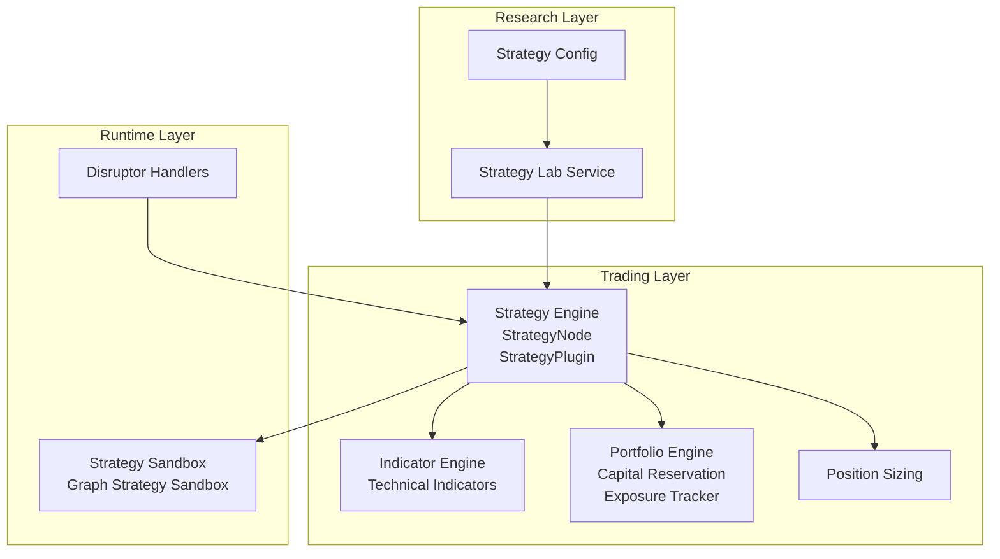

**Diagram sources**
- [StrategyEngine.java](file://trading/strategy/src/main/java/com/tradej/strategy/service/StrategyEngine.java)
- [StrategyNode.java](file://trading/strategy/src/main/java/com/tradej/strategy/node/StrategyNode.java)
- [IndicatorEngine.java](file://trading/indicators/src/main/java/com/tradej/indicators/IndicatorEngine.java)
- [PortfolioEngine.java](file://trading/strategy/src/main/java/com/tradej/strategy/portfolio/PortfolioEngine.java)
- [StrategySandbox.java](file://trading/strategy/src/main/java/com/tradej/strategy/service/StrategySandbox.java)
- [GraphStrategySandbox.java](file://trading/strategy/src/main/java/com/tradej/strategy/service/GraphStrategySandbox.java)
- [StrategyLabService.java](file://research/lab/src/main/java/com/tradej/research/lab/StrategyLabService.java)
- [StrategyConfig.java](file://research/core/src/main/java/com/tradej/research/core/StrategyConfig.java)
- [GraphStrategyDisruptorHandler.java](file://runtime/disruptor/src/main/java/com/tradej/disruptor/config/GraphStrategyDisruptorHandler.java)

**Section sources**
- [StrategyEngine.java](file://trading/strategy/src/main/java/com/tradej/strategy/service/StrategyEngine.java)
- [IndicatorEngine.java](file://trading/indicators/src/main/java/com/tradej/indicators/IndicatorEngine.java)
- [PortfolioEngine.java](file://trading/strategy/src/main/java/com/tradej/strategy/portfolio/PortfolioEngine.java)
- [StrategySandbox.java](file://trading/strategy/src/main/java/com/tradej/strategy/service/StrategySandbox.java)
- [GraphStrategySandbox.java](file://trading/strategy/src/main/java/com/tradej/strategy/service/GraphStrategySandbox.java)
- [StrategyLabService.java](file://research/lab/src/main/java/com/tradej/research/lab/StrategyLabService.java)
- [StrategyConfig.java](file://research/core/src/main/java/com/tradej/research/core/StrategyConfig.java)

## Core Components
- StrategyEngine: Central orchestrator for strategy execution, managing StrategyNode instances, coordinating indicator updates, and driving portfolio decisions.
- StrategyNode: Pluggable node representing a strategy unit with inputs/outputs, lifecycle hooks, and execution semantics.
- IndicatorEngine: Provides a unified interface for computing and caching technical indicators across instruments/timeframes.
- PortfolioEngine: Manages capital allocation, exposure limits, and position sizing across strategies and instruments.
- StrategyPlugin family: Extensible plugin interfaces for integrating strategies, including graph-based plugins and ML-enabled plugins.
- StrategySandbox and GraphStrategySandbox: Controlled environments for strategy testing, replay, and isolation.
- MLStrategyPlugin and ThresholdMLInferenceEngine: Machine learning integration enabling threshold-based inference within strategies.
- Example strategies: DepthImbalanceStrategy and TickPriceChangeStrategy demonstrate practical usage patterns.

**Section sources**
- [StrategyEngine.java](file://trading/strategy/src/main/java/com/tradej/strategy/service/StrategyEngine.java)
- [StrategyNode.java](file://trading/strategy/src/main/java/com/tradej/strategy/node/StrategyNode.java)
- [IndicatorEngine.java](file://trading/indicators/src/main/java/com/tradej/indicators/IndicatorEngine.java)
- [PortfolioEngine.java](file://trading/strategy/src/main/java/com/tradej/strategy/portfolio/PortfolioEngine.java)
- [StrategyPlugin.java](file://trading/strategy/src/main/java/com/tradej/strategy/api/StrategyPlugin.java)
- [MLStrategyPlugin.java](file://trading/strategy/src/main/java/com/tradej/strategy/ml/MLStrategyPlugin.java)
- [ThresholdMLInferenceEngine.java](file://trading/strategy/src/main/java/com/tradej/strategy/ml/ThresholdMLInferenceEngine.java)
- [StrategySandbox.java](file://trading/strategy/src/main/java/com/tradej/strategy/service/StrategySandbox.java)
- [GraphStrategySandbox.java](file://trading/strategy/src/main/java/com/tradej/strategy/service/GraphStrategySandbox.java)
- [DepthImbalanceStrategy.java](file://trading/strategy/src/main/java/com/tradej/strategy/example/DepthImbalanceStrategy.java)
- [TickPriceChangeStrategy.java](file://trading/strategy/src/main/java/com/tradej/strategy/example/TickPriceChangeStrategy.java)

## Architecture Overview
The Strategy Engine architecture integrates pluggable strategies, technical indicators, portfolio management, and ML inference into a cohesive runtime. The diagram below maps the primary components and their interactions.

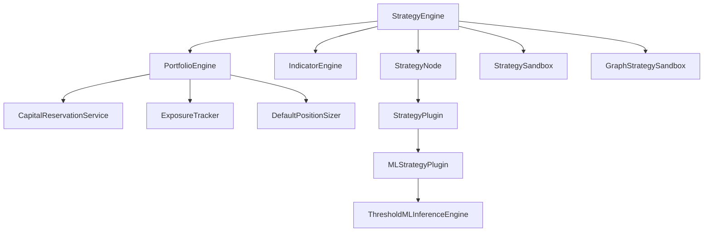

**Diagram sources**
- [StrategyEngine.java](file://trading/strategy/src/main/java/com/tradej/strategy/service/StrategyEngine.java)
- [StrategyNode.java](file://trading/strategy/src/main/java/com/tradej/strategy/node/StrategyNode.java)
- [IndicatorEngine.java](file://trading/indicators/src/main/java/com/tradej/indicators/IndicatorEngine.java)
- [PortfolioEngine.java](file://trading/strategy/src/main/java/com/tradej/strategy/portfolio/PortfolioEngine.java)
- [CapitalReservationService.java](file://trading/strategy/src/main/java/com/tradej/strategy/portfolio/CapitalReservationService.java)
- [DefaultCapitalReservationService.java](file://trading/strategy/src/main/java/com/tradej/strategy/portfolio/DefaultCapitalReservationService.java)
- [ExposureTracker.java](file://trading/strategy/src/main/java/com/tradej/strategy/portfolio/ExposureTracker.java)
- [DefaultExposureTracker.java](file://trading/strategy/src/main/java/com/tradej/strategy/portfolio/DefaultExposureTracker.java)
- [DefaultPositionSizer.java](file://trading/strategy/src/main/java/com/tradej/strategy/position/DefaultPositionSizer.java)
- [StrategyPlugin.java](file://trading/strategy/src/main/java/com/tradej/strategy/api/StrategyPlugin.java)
- [MLStrategyPlugin.java](file://trading/strategy/src/main/java/com/tradej/strategy/ml/MLStrategyPlugin.java)
- [ThresholdMLInferenceEngine.java](file://trading/strategy/src/main/java/com/tradej/strategy/ml/ThresholdMLInferenceEngine.java)
- [StrategySandbox.java](file://trading/strategy/src/main/java/com/tradej/strategy/service/StrategySandbox.java)
- [GraphStrategySandbox.java](file://trading/strategy/src/main/java/com/tradej/strategy/service/GraphStrategySandbox.java)

## Detailed Component Analysis

### StrategyEngine Orchestration
StrategyEngine coordinates strategy lifecycle, node execution, and resource management. It integrates indicator updates, portfolio decisions, and sandbox execution contexts. It manages node scheduling, error propagation, and performance monitoring.

Key responsibilities:
- Initialize and manage StrategyNode instances
- Drive indicator computations via IndicatorEngine
- Apply portfolio constraints and position sizing
- Route signals to execution and monitoring systems
- Provide error reporting and recovery hooks

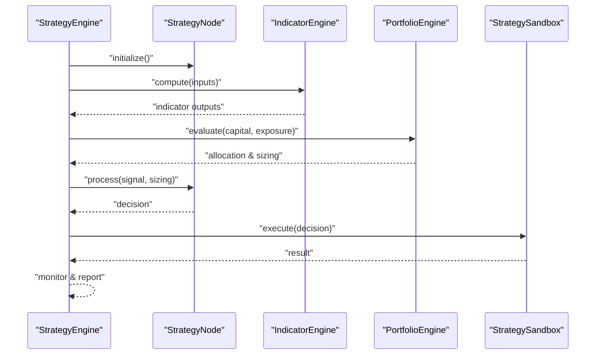

**Diagram sources**
- [StrategyEngine.java](file://trading/strategy/src/main/java/com/tradej/strategy/service/StrategyEngine.java)
- [StrategyNode.java](file://trading/strategy/src/main/java/com/tradej/strategy/node/StrategyNode.java)
- [IndicatorEngine.java](file://trading/indicators/src/main/java/com/tradej/indicators/IndicatorEngine.java)
- [PortfolioEngine.java](file://trading/strategy/src/main/java/com/tradej/strategy/portfolio/PortfolioEngine.java)
- [StrategySandbox.java](file://trading/strategy/src/main/java/com/tradej/strategy/service/StrategySandbox.java)

**Section sources**
- [StrategyEngine.java](file://trading/strategy/src/main/java/com/tradej/strategy/service/StrategyEngine.java)

### StrategyNode Processing
StrategyNode encapsulates a single strategy unit with pluggable behavior. It consumes market data and indicators, applies strategy logic, and produces actionable signals. Nodes can be chained and orchestrated by StrategyEngine.

Processing flow:
- Input aggregation from market data and indicator outputs
- Strategy-specific evaluation
- Output emission for portfolio and execution

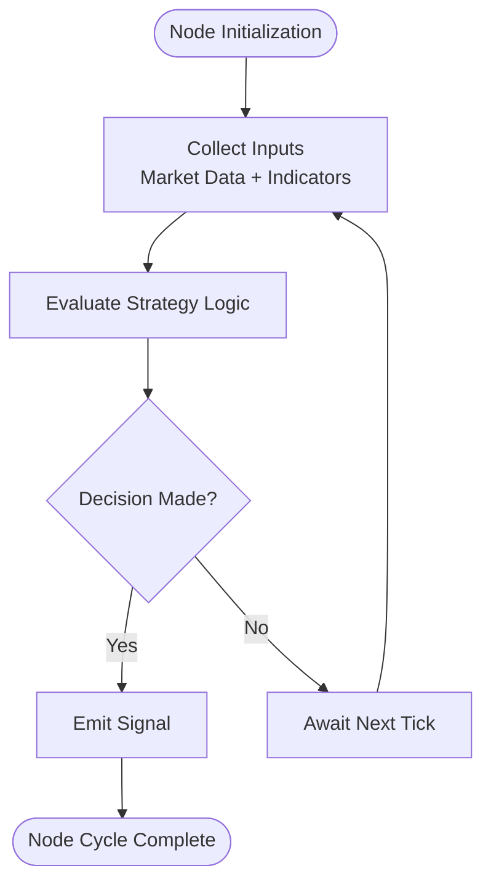

**Diagram sources**
- [StrategyNode.java](file://trading/strategy/src/main/java/com/tradej/strategy/node/StrategyNode.java)
- [IndicatorEngine.java](file://trading/indicators/src/main/java/com/tradej/indicators/IndicatorEngine.java)

**Section sources**
- [StrategyNode.java](file://trading/strategy/src/main/java/com/tradej/strategy/node/StrategyNode.java)

### Indicator Engine Implementation
IndicatorEngine provides a unified interface for computing technical indicators. It supports caching, resampling, and multi-timeframe operations. Strategies consume indicator outputs through StrategyNode.

Capabilities:
- Compute and cache indicator values per instrument/timeframe
- Support for rolling windows and smoothing
- Integration with candle aggregation service

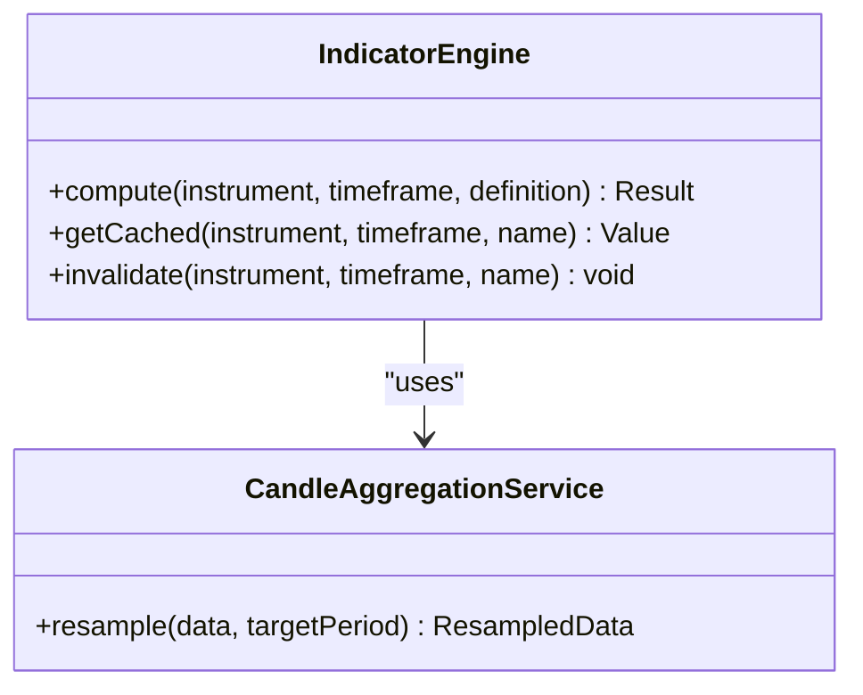

**Diagram sources**
- [IndicatorEngine.java](file://trading/indicators/src/main/java/com/tradej/indicators/IndicatorEngine.java)
- [CandleAggregationService.java](file://trading/strategy/src/main/java/com/tradej/strategy/service/CandleAggregationService.java)

**Section sources**
- [IndicatorEngine.java](file://trading/indicators/src/main/java/com/tradej/indicators/IndicatorEngine.java)
- [CandleAggregationService.java](file://trading/strategy/src/main/java/com/tradej/strategy/service/CandleAggregationService.java)

### Portfolio Management Capabilities
PortfolioEngine manages capital allocation, exposure tracking, and position sizing. It collaborates with CapitalReservationService and ExposureTracker to enforce risk constraints.

Key components:
- PortfolioEngine: Top-level engine for allocation and sizing
- CapitalReservationService: Reserves capital against pending orders and exposures
- ExposureTracker: Tracks current and potential exposure per instrument/strategy
- DefaultPositionSizer: Applies sizing rules based on volatility, account risk, and signal strength

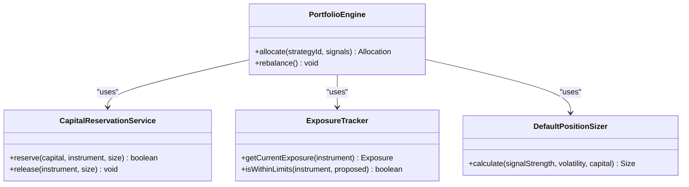

**Diagram sources**
- [PortfolioEngine.java](file://trading/strategy/src/main/java/com/tradej/strategy/portfolio/PortfolioEngine.java)
- [CapitalReservationService.java](file://trading/strategy/src/main/java/com/tradej/strategy/portfolio/CapitalReservationService.java)
- [DefaultCapitalReservationService.java](file://trading/strategy/src/main/java/com/tradej/strategy/portfolio/DefaultCapitalReservationService.java)
- [ExposureTracker.java](file://trading/strategy/src/main/java/com/tradej/strategy/portfolio/ExposureTracker.java)
- [DefaultExposureTracker.java](file://trading/strategy/src/main/java/com/tradej/strategy/portfolio/DefaultExposureTracker.java)
- [DefaultPositionSizer.java](file://trading/strategy/src/main/java/com/tradej/strategy/position/DefaultPositionSizer.java)

**Section sources**
- [PortfolioEngine.java](file://trading/strategy/src/main/java/com/tradej/strategy/portfolio/PortfolioEngine.java)
- [CapitalReservationService.java](file://trading/strategy/src/main/java/com/tradej/strategy/portfolio/CapitalReservationService.java)
- [ExposureTracker.java](file://trading/strategy/src/main/java/com/tradej/strategy/portfolio/ExposureTracker.java)
- [DefaultPositionSizer.java](file://trading/strategy/src/main/java/com/tradej/strategy/position/DefaultPositionSizer.java)

### Strategy Plugin Architecture
The StrategyPlugin family enables extensibility and modular strategy logic:
- StrategyPlugin: Base plugin contract for strategy integration
- GraphStrategyPlugin: Graph-based strategy plugin supporting DAG execution
- StrategyPluginAdapter: Adapter for legacy or external strategy implementations
- MLStrategyPlugin: Integrates ML inference into strategies via ThresholdMLInferenceEngine
- OptionsContextStrategyPlugin: Strategy plugin tailored for options market context

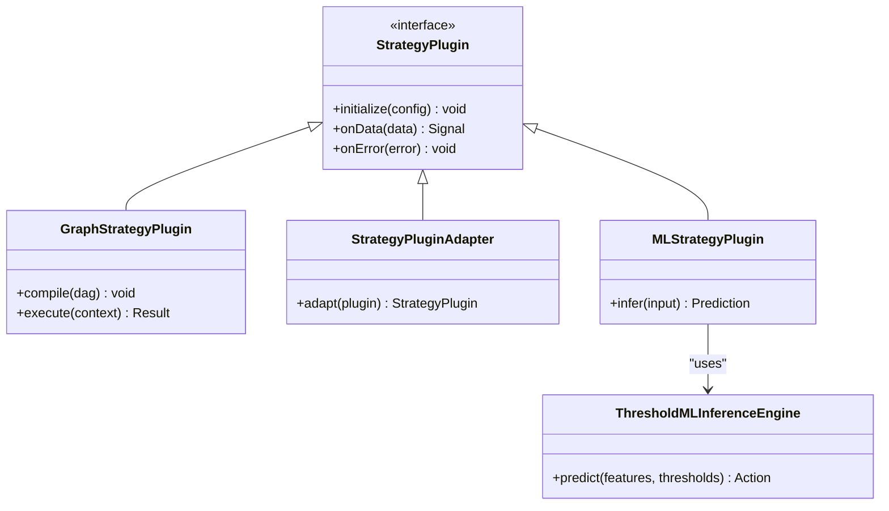

**Diagram sources**
- [StrategyPlugin.java](file://trading/strategy/src/main/java/com/tradej/strategy/api/StrategyPlugin.java)
- [GraphStrategyPlugin.java](file://trading/strategy/src/main/java/com/tradej/strategy/api/GraphStrategyPlugin.java)
- [StrategyPluginAdapter.java](file://trading/strategy/src/main/java/com/tradej/strategy/api/StrategyPluginAdapter.java)
- [MLStrategyPlugin.java](file://trading/strategy/src/main/java/com/tradej/strategy/ml/MLStrategyPlugin.java)
- [ThresholdMLInferenceEngine.java](file://trading/strategy/src/main/java/com/tradej/strategy/ml/ThresholdMLInferenceEngine.java)

**Section sources**
- [StrategyPlugin.java](file://trading/strategy/src/main/java/com/tradej/strategy/api/StrategyPlugin.java)
- [GraphStrategyPlugin.java](file://trading/strategy/src/main/java/com/tradej/strategy/api/GraphStrategyPlugin.java)
- [StrategyPluginAdapter.java](file://trading/strategy/src/main/java/com/tradej/strategy/api/StrategyPluginAdapter.java)
- [MLStrategyPlugin.java](file://trading/strategy/src/main/java/com/tradej/strategy/ml/MLStrategyPlugin.java)
- [ThresholdMLInferenceEngine.java](file://trading/strategy/src/main/java/com/tradej/strategy/ml/ThresholdMLInferenceEngine.java)

### Machine Learning Integration
MLStrategyPlugin leverages ThresholdMLInferenceEngine to transform feature vectors into actionable strategy decisions. It integrates with the broader StrategyEngine and StrategyNode pipeline.

Integration highlights:
- Feature ingestion and preprocessing
- Threshold-based inference for buy/sell/hold decisions
- Model registry and versioning support

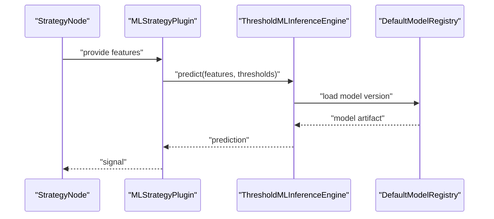

**Diagram sources**
- [MLStrategyPlugin.java](file://trading/strategy/src/main/java/com/tradej/strategy/ml/MLStrategyPlugin.java)
- [ThresholdMLInferenceEngine.java](file://trading/strategy/src/main/java/com/tradej/strategy/ml/ThresholdMLInferenceEngine.java)
- [DefaultModelRegistry.java](file://trading/strategy/src/main/java/com/tradej/strategy/ml/DefaultModelRegistry.java)

**Section sources**
- [MLStrategyPlugin.java](file://trading/strategy/src/main/java/com/tradej/strategy/ml/MLStrategyPlugin.java)
- [ThresholdMLInferenceEngine.java](file://trading/strategy/src/main/java/com/tradej/strategy/ml/ThresholdMLInferenceEngine.java)
- [DefaultModelRegistry.java](file://trading/strategy/src/main/java/com/tradej/strategy/ml/DefaultModelRegistry.java)

### Strategy Sandbox Environments
StrategySandbox and GraphStrategySandbox provide isolated environments for strategy testing and replay. They enable controlled execution, deterministic replay, and performance profiling without affecting live operations.

Features:
- Deterministic replay of market data and events
- Isolation of strategy execution from production systems
- Performance monitoring and logging hooks

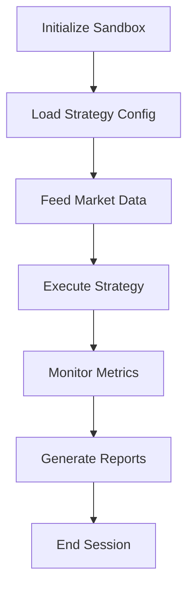

**Diagram sources**
- [StrategySandbox.java](file://trading/strategy/src/main/java/com/tradej/strategy/service/StrategySandbox.java)
- [GraphStrategySandbox.java](file://trading/strategy/src/main/java/com/tradej/strategy/service/GraphStrategySandbox.java)

**Section sources**
- [StrategySandbox.java](file://trading/strategy/src/main/java/com/tradej/strategy/service/StrategySandbox.java)
- [GraphStrategySandbox.java](file://trading/strategy/src/main/java/com/tradej/strategy/service/GraphStrategySandbox.java)

### Backtesting Integration
Backtesting is integrated through sandbox environments and replay orchestration. StrategyLabService and StrategyConfig support research-grade backtesting workflows, enabling parameter sweeps and performance comparisons.

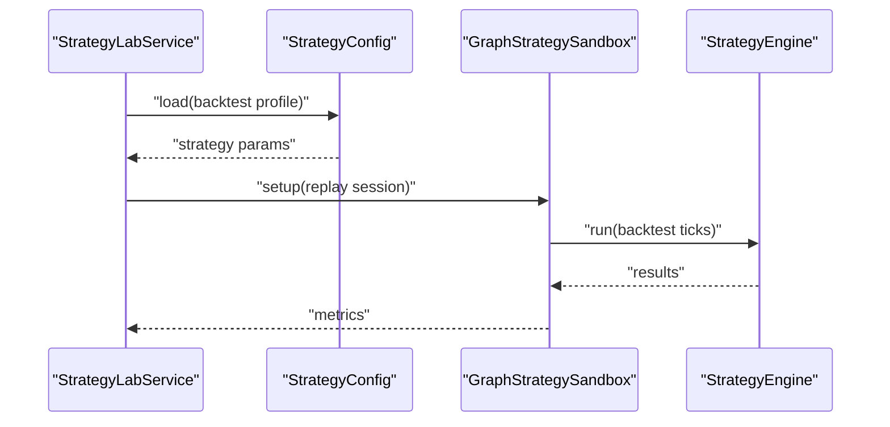

**Diagram sources**
- [StrategyLabService.java](file://research/lab/src/main/java/com/tradej/research/lab/StrategyLabService.java)
- [StrategyConfig.java](file://research/core/src/main/java/com/tradej/research/core/StrategyConfig.java)
- [GraphStrategySandbox.java](file://trading/strategy/src/main/java/com/tradej/strategy/service/GraphStrategySandbox.java)
- [StrategyEngine.java](file://trading/strategy/src/main/java/com/tradej/strategy/service/StrategyEngine.java)

**Section sources**
- [StrategyLabService.java](file://research/lab/src/main/java/com/tradej/research/lab/StrategyLabService.java)
- [StrategyConfig.java](file://research/core/src/main/java/com/tradej/research/core/StrategyConfig.java)

### Strategy Lifecycle Management
Lifecycle stages:
- Initialization: Load configuration, register plugins, initialize indicator caches
- Running: Process market data, compute indicators, evaluate strategies, apply portfolio rules
- Monitoring: Track performance, errors, and resource usage
- Shutdown: Release reservations, persist state, and clean up resources

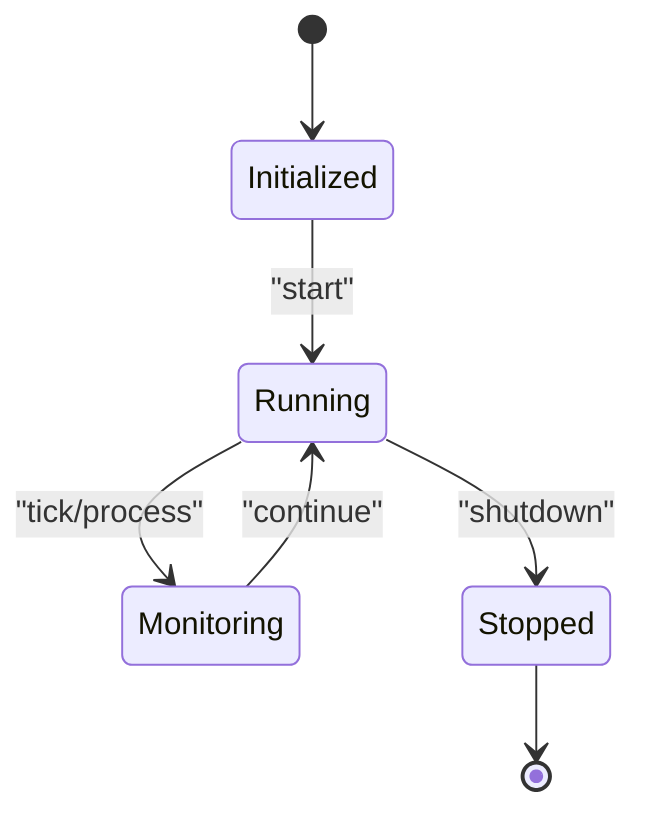

**Diagram sources**
- [StrategyEngine.java](file://trading/strategy/src/main/java/com/tradej/strategy/service/StrategyEngine.java)
- [StrategyNode.java](file://trading/strategy/src/main/java/com/tradej/strategy/node/StrategyNode.java)

**Section sources**
- [StrategyEngine.java](file://trading/strategy/src/main/java/com/tradej/strategy/service/StrategyEngine.java)

### Examples of Custom Strategy Implementation
Two example strategies illustrate common patterns:
- DepthImbalanceStrategy: Uses order book depth imbalances to generate entries
- TickPriceChangeStrategy: Uses recent tick price changes to trigger signals

Implementation patterns:
- Subscribe to relevant market data feeds
- Compute required indicators
- Define entry/exit conditions
- Emit signals to StrategyNode for portfolio processing

**Section sources**
- [DepthImbalanceStrategy.java](file://trading/strategy/src/main/java/com/tradej/strategy/example/DepthImbalanceStrategy.java)
- [TickPriceChangeStrategy.java](file://trading/strategy/src/main/java/com/tradej/strategy/example/TickPriceChangeStrategy.java)

## Dependency Analysis
The Strategy Engine exhibits strong cohesion within its module and clear separation of concerns across domains. Dependencies are primarily unidirectional: StrategyEngine depends on StrategyNode, IndicatorEngine, PortfolioEngine, and Sandbox; PortfolioEngine depends on CapitalReservationService, ExposureTracker, and Position Sizer; ML components depend on ThresholdMLInferenceEngine and DefaultModelRegistry.

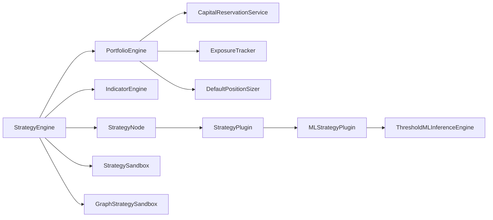

**Diagram sources**
- [StrategyEngine.java](file://trading/strategy/src/main/java/com/tradej/strategy/service/StrategyEngine.java)
- [StrategyNode.java](file://trading/strategy/src/main/java/com/tradej/strategy/node/StrategyNode.java)
- [IndicatorEngine.java](file://trading/indicators/src/main/java/com/tradej/indicators/IndicatorEngine.java)
- [PortfolioEngine.java](file://trading/strategy/src/main/java/com/tradej/strategy/portfolio/PortfolioEngine.java)
- [CapitalReservationService.java](file://trading/strategy/src/main/java/com/tradej/strategy/portfolio/CapitalReservationService.java)
- [ExposureTracker.java](file://trading/strategy/src/main/java/com/tradej/strategy/portfolio/ExposureTracker.java)
- [DefaultPositionSizer.java](file://trading/strategy/src/main/java/com/tradej/strategy/position/DefaultPositionSizer.java)
- [StrategyPlugin.java](file://trading/strategy/src/main/java/com/tradej/strategy/api/StrategyPlugin.java)
- [MLStrategyPlugin.java](file://trading/strategy/src/main/java/com/tradej/strategy/ml/MLStrategyPlugin.java)
- [ThresholdMLInferenceEngine.java](file://trading/strategy/src/main/java/com/tradej/strategy/ml/ThresholdMLInferenceEngine.java)
- [StrategySandbox.java](file://trading/strategy/src/main/java/com/tradej/strategy/service/StrategySandbox.java)
- [GraphStrategySandbox.java](file://trading/strategy/src/main/java/com/tradej/strategy/service/GraphStrategySandbox.java)

**Section sources**
- [StrategyEngine.java](file://trading/strategy/src/main/java/com/tradej/strategy/service/StrategyEngine.java)
- [StrategyNode.java](file://trading/strategy/src/main/java/com/tradej/strategy/node/StrategyNode.java)
- [PortfolioEngine.java](file://trading/strategy/src/main/java/com/tradej/strategy/portfolio/PortfolioEngine.java)

## Performance Considerations
- Indicator caching: Reuse computed indicator values to avoid redundant calculations
- Batch processing: Group strategy evaluations to reduce overhead
- Asynchronous execution: Offload heavy computations to dedicated threads or disruptors
- Memory management: Limit indicator window sizes and cache lifetimes
- Position sizing: Use volatility-adjusted sizing to balance risk and reward

[No sources needed since this section provides general guidance]

## Troubleshooting Guide
Common issues and resolutions:
- Strategy errors: StrategyError events capture failures during strategy execution; inspect error context and stack traces
- Indicator computation failures: Verify indicator definitions and input data availability
- Portfolio constraint violations: Review exposure limits and capital reservation status
- Sandbox execution anomalies: Confirm deterministic replay configuration and data ordering

Monitoring and diagnostics:
- StrategyEngine logs and metrics
- IndicatorEngine cache hit rates
- PortfolioEngine allocation reports
- Sandbox execution timelines

**Section sources**
- [StrategyError.java](file://core/src/main/java/com/tradej/core/domain/event/StrategyError.java)
- [StrategyEngine.java](file://trading/strategy/src/main/java/com/tradej/strategy/service/StrategyEngine.java)
- [PortfolioEngineTest.java](file://trading/strategy/src/test/java/com/tradej/strategy/portfolio/PortfolioEngineTest.java)
- [GraphStrategySandboxTest.java](file://trading/strategy/src/test/java/com/tradej/strategy/service/GraphStrategySandboxTest.java)
- [MLStrategyPluginTest.java](file://trading/strategy/src/test/java/com/tradej/strategy/ml/MLStrategyPluginTest.java)

## Conclusion
The Strategy Engine provides a robust, extensible framework for building and operating trading strategies. Its pluggable architecture, integrated indicator engine, and comprehensive portfolio management enable scalable and maintainable strategy development. With sandbox environments, ML integration, and research-grade backtesting, teams can iterate quickly while maintaining safety and performance.

[No sources needed since this section summarizes without analyzing specific files]

## Appendices

### Strategy Development Patterns
- Modular StrategyNode design for testability and reuse
- Indicator-driven decision logic with explicit caching
- Portfolio-centric position sizing and risk controls
- Plugin-based extensibility for ML and options-specific logic

**Section sources**
- [StrategyNode.java](file://trading/strategy/src/main/java/com/tradej/strategy/node/StrategyNode.java)
- [IndicatorEngine.java](file://trading/indicators/src/main/java/com/tradej/indicators/IndicatorEngine.java)
- [PortfolioEngine.java](file://trading/strategy/src/main/java/com/tradej/strategy/portfolio/PortfolioEngine.java)
- [StrategyPlugin.java](file://trading/strategy/src/main/java/com/tradej/strategy/api/StrategyPlugin.java)

### Parameter Optimization
- Grid search and random sampling within StrategyLabService
- Objective functions aligned with risk-adjusted returns
- Out-of-sample validation via sandbox replay

**Section sources**
- [StrategyLabService.java](file://research/lab/src/main/java/com/tradej/research/lab/StrategyLabService.java)
- [StrategyConfig.java](file://research/core/src/main/java/com/tradej/research/core/StrategyConfig.java)

### Application Configuration
- StrategyConfiguration defines runtime profiles and environment-specific settings
- Integration with broker and gateway profiles for live and sandbox modes

**Section sources**
- [StrategyConfiguration.java](file://app/src/main/java/com/tradej/app/config/StrategyConfiguration.java)