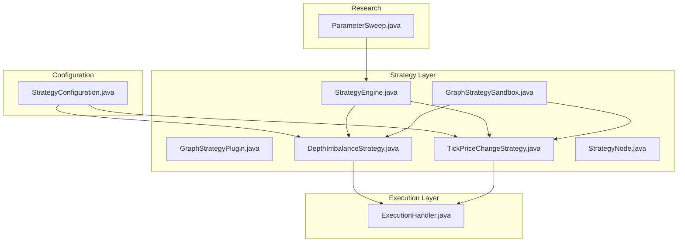
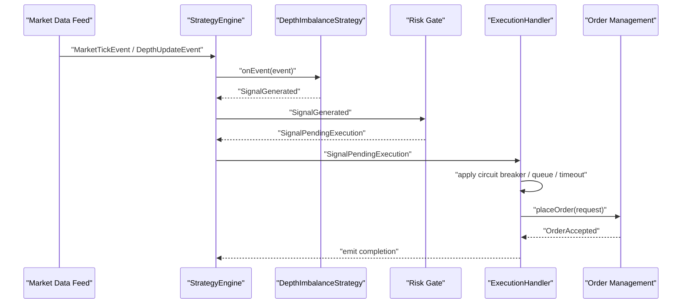
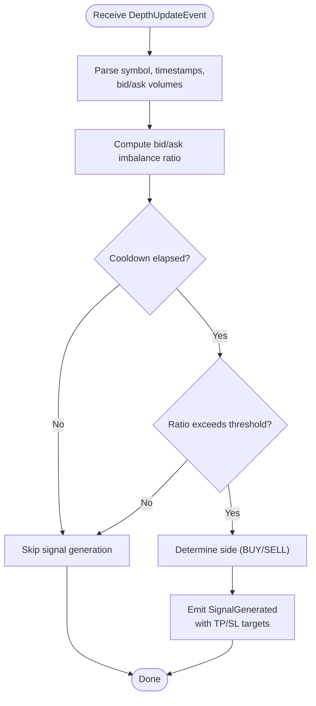
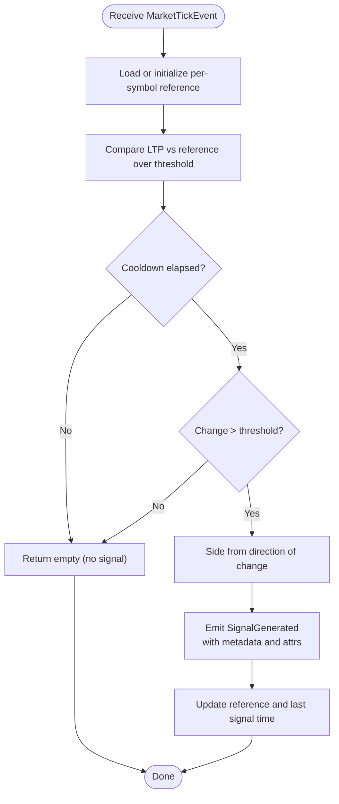
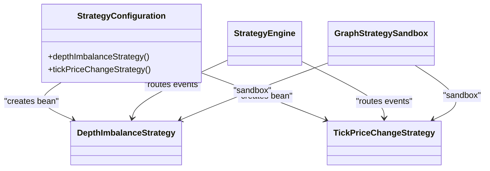
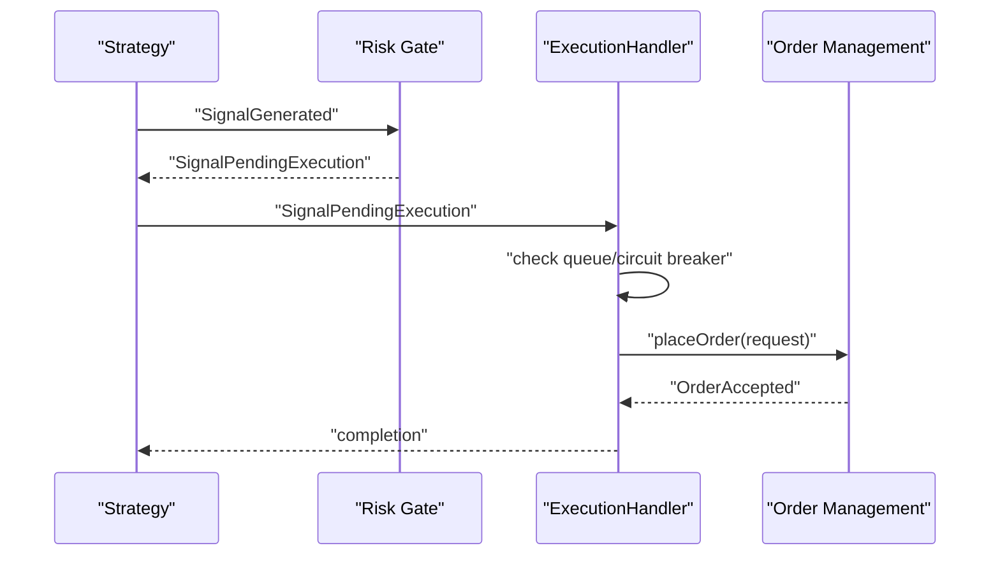
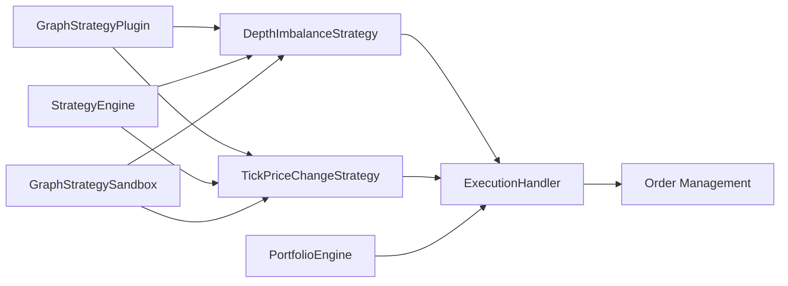

# Strategy Examples and Patterns

<cite>
**Referenced Files in This Document**
- [DepthImbalanceStrategy.java](file://trading/strategy/src/main/java/com/tradej/strategy/example/DepthImbalanceStrategy.java)
- [TickPriceChangeStrategy.java](file://trading/strategy/src/main/java/com/tradej/strategy/example/TickPriceChangeStrategy.java)
- [StrategyConfiguration.java](file://app/src/main/java/com/tradej/app/config/StrategyConfiguration.java)
- [GraphStrategyPlugin.java](file://trading/strategy/src/main/java/com/tradej/strategy/api/GraphStrategyPlugin.java)
- [StrategyEngine.java](file://trading/strategy/src/main/java/com/tradej/strategy/service/StrategyEngine.java)
- [GraphStrategySandbox.java](file://trading/strategy/src/main/java/com/tradej/strategy/service/GraphStrategySandbox.java)
- [StrategyNode.java](file://trading/strategy/src/main/java/com/tradej/strategy/node/StrategyNode.java)
- [ExecutionHandler.java](file://trading/execution/src/main/java/com/tradej/execution/service/ExecutionHandler.java)
- [ExecutionHandlerUnitTest.java](file://trading/execution/src/test/java/com/tradej/execution/service/ExecutionHandlerUnitTest.java)
- [PortfolioEngineTest.java](file://trading/strategy/src/test/java/com/tradej/strategy/portfolio/PortfolioEngineTest.java)
- [PIPELINE_DESIGN.md](file://docs/PIPELINE_DESIGN.md)
- [ARCHITECTURE_EVOLUTION_PIPELINE_OS.md](file://docs/archive/ARCHITECTURE_EVOLUTION_PIPELINE_OS.md)
- [ParameterSweep.java](file://research/lab/src/main/java/com/tradej/research/lab/ParameterSweep.java)
- [ParameterSweepTest.java](file://research/lab/src/test/java/com/tradej/research/lab/ParameterSweepTest.java)
- [ResearchPanel.tsx](file://docs/archive/frontend/src/components/ResearchPanel.tsx)
- [TRADE_J_ARCHITECTURE_REVIEW.md](file://plans/TRADE_J_ARCHITECTURE_REVIEW.md)
</cite>

## Table of Contents
1. [Introduction](#introduction)
2. [Project Structure](#project-structure)
3. [Core Components](#core-components)
4. [Architecture Overview](#architecture-overview)
5. [Detailed Component Analysis](#detailed-component-analysis)
6. [Dependency Analysis](#dependency-analysis)
7. [Performance Considerations](#performance-considerations)
8. [Troubleshooting Guide](#troubleshooting-guide)
9. [Conclusion](#conclusion)
10. [Appendices](#appendices)

## Introduction
This document explains practical strategy examples and development patterns in the trading system. It focuses on two concrete implementations:
- DepthImbalanceStrategy: Detects imbalances in market depth to generate momentum signals.
- TickPriceChangeStrategy: Identifies rapid tick-level price changes to generate short-term signals.

It also covers common strategy development patterns, parameterization and configuration, testing approaches, strategy composition, signal generation, execution logic, performance optimization, memory management, and scalability considerations for production deployment.

## Project Structure
The strategy subsystem is organized around:
- Strategy APIs and plugins that define the contract for event-driven strategies.
- Example strategies that demonstrate real-world patterns.
- Strategy engine and sandbox for runtime orchestration.
- Execution pipeline and risk gates that transform signals into orders.
- Research tools for parameter sweeps and backtesting.

**Diagram sources**
- [GraphStrategyPlugin.java](file://trading/strategy/src/main/java/com/tradej/strategy/api/GraphStrategyPlugin.java)
- [DepthImbalanceStrategy.java](file://trading/strategy/src/main/java/com/tradej/strategy/example/DepthImbalanceStrategy.java)
- [TickPriceChangeStrategy.java](file://trading/strategy/src/main/java/com/tradej/strategy/example/TickPriceChangeStrategy.java)
- [StrategyEngine.java](file://trading/strategy/src/main/java/com/tradej/strategy/service/StrategyEngine.java)
- [GraphStrategySandbox.java](file://trading/strategy/src/main/java/com/tradej/strategy/service/GraphStrategySandbox.java)
- [StrategyNode.java](file://trading/strategy/src/main/java/com/tradej/strategy/node/StrategyNode.java)
- [ExecutionHandler.java](file://trading/execution/src/main/java/com/tradej/execution/service/ExecutionHandler.java)
- [StrategyConfiguration.java](file://app/src/main/java/com/tradej/app/config/StrategyConfiguration.java)
- [ParameterSweep.java](file://research/lab/src/main/java/com/tradej/research/lab/ParameterSweep.java)

**Section sources**
- [StrategyConfiguration.java](file://app/src/main/java/com/tradej/app/config/StrategyConfiguration.java)
- [PIPELINE_DESIGN.md](file://docs/PIPELINE_DESIGN.md)

## Core Components
- GraphStrategyPlugin: Defines the event-driven strategy contract, including subscribed events, lifecycle hooks, and signal emission.
- StrategyEngine: Orchestrates strategy instances, manages subscriptions, and routes events to strategies.
- GraphStrategySandbox: Provides a controlled environment for strategy development and testing.
- StrategyNode: Bridges strategies into the pipeline graph.
- ExecutionHandler: Translates approved signals into orders, enforcing circuit breakers, timeouts, and queue capacity.

Key responsibilities:
- Event subscription and dispatch
- Per-symbol state management
- Signal generation with metadata and attributes
- Execution gating and order placement

**Section sources**
- [GraphStrategyPlugin.java](file://trading/strategy/src/main/java/com/tradej/strategy/api/GraphStrategyPlugin.java)
- [StrategyEngine.java](file://trading/strategy/src/main/java/com/tradej/strategy/service/StrategyEngine.java)
- [GraphStrategySandbox.java](file://trading/strategy/src/main/java/com/tradej/strategy/service/GraphStrategySandbox.java)
- [StrategyNode.java](file://trading/strategy/src/main/java/com/tradej/strategy/node/StrategyNode.java)
- [ExecutionHandler.java](file://trading/execution/src/main/java/com/tradej/execution/service/ExecutionHandler.java)

## Architecture Overview
The system follows a topological pipeline where strategies generate signals that pass through risk checks and execution gates before reaching order management systems.

**Diagram sources**
- [StrategyEngine.java](file://trading/strategy/src/main/java/com/tradej/strategy/service/StrategyEngine.java)
- [DepthImbalanceStrategy.java](file://trading/strategy/src/main/java/com/tradej/strategy/example/DepthImbalanceStrategy.java)
- [ExecutionHandler.java](file://trading/execution/src/main/java/com/tradej/execution/service/ExecutionHandler.java)
- [PIPELINE_DESIGN.md](file://docs/PIPELINE_DESIGN.md)
- [ARCHITECTURE_EVOLUTION_PIPELINE_OS.md](file://docs/archive/ARCHITECTURE_EVOLUTION_PIPELINE_OS.md)

## Detailed Component Analysis

### DepthImbalanceStrategy
Purpose:
- Detects imbalances between bid and ask depth volumes to anticipate directional moves.

Implementation highlights:
- Subscribes to depth update events.
- Maintains per-symbol state for imbalance ratio and last signal time.
- Applies a cooldown to avoid repeated signals.
- Emits BUY or SELL signals with take-profit and stop-loss targets derived from fixed fractions.

**Diagram sources**
- [DepthImbalanceStrategy.java](file://trading/strategy/src/main/java/com/tradej/strategy/example/DepthImbalanceStrategy.java)

**Section sources**
- [DepthImbalanceStrategy.java](file://trading/strategy/src/main/java/com/tradej/strategy/example/DepthImbalanceStrategy.java)

### TickPriceChangeStrategy
Purpose:
- Captures rapid tick-level price movements to generate short-term momentum signals.

Implementation highlights:
- Subscribes to tick events.
- Tracks a rolling reference price per symbol and enforces a cooldown.
- Compares absolute price change against a configured threshold (in paisa).
- Emits signals with side-dependent TP/SL targets and descriptive labels.

**Diagram sources**
- [TickPriceChangeStrategy.java](file://trading/strategy/src/main/java/com/tradej/strategy/example/TickPriceChangeStrategy.java)

**Section sources**
- [TickPriceChangeStrategy.java](file://trading/strategy/src/main/java/com/tradej/strategy/example/TickPriceChangeStrategy.java)

### Strategy Configuration and Composition
- Strategies are instantiated via Spring beans in the application configuration.
- Both DepthImbalanceStrategy and TickPriceChangeStrategy are registered as beans with explicit names and parameters.
- StrategyEngine and GraphStrategySandbox manage lifecycle and event routing.

**Diagram sources**
- [StrategyConfiguration.java](file://app/src/main/java/com/tradej/app/config/StrategyConfiguration.java)
- [StrategyEngine.java](file://trading/strategy/src/main/java/com/tradej/strategy/service/StrategyEngine.java)
- [GraphStrategySandbox.java](file://trading/strategy/src/main/java/com/tradej/strategy/service/GraphStrategySandbox.java)
- [DepthImbalanceStrategy.java](file://trading/strategy/src/main/java/com/tradej/strategy/example/DepthImbalanceStrategy.java)
- [TickPriceChangeStrategy.java](file://trading/strategy/src/main/java/com/tradej/strategy/example/TickPriceChangeStrategy.java)

**Section sources**
- [StrategyConfiguration.java](file://app/src/main/java/com/tradej/app/config/StrategyConfiguration.java)
- [StrategyEngine.java](file://trading/strategy/src/main/java/com/tradej/strategy/service/StrategyEngine.java)
- [GraphStrategySandbox.java](file://trading/strategy/src/main/java/com/tradej/strategy/service/GraphStrategySandbox.java)

### Execution Logic and Signal Flow
- Approved signals propagate through risk gates and are transformed into order placement requests.
- ExecutionHandler applies circuit breakers, enforces queue capacity, and handles timeouts.
- Tests validate suppression behavior under timeout conditions.

**Diagram sources**
- [ExecutionHandler.java](file://trading/execution/src/main/java/com/tradej/execution/service/ExecutionHandler.java)
- [PIPELINE_DESIGN.md](file://docs/PIPELINE_DESIGN.md)

**Section sources**
- [ExecutionHandler.java](file://trading/execution/src/main/java/com/tradej/execution/service/ExecutionHandler.java)
- [ExecutionHandlerUnitTest.java](file://trading/execution/src/test/java/com/tradej/execution/service/ExecutionHandlerUnitTest.java)

## Dependency Analysis
- Strategies depend on core domain events and the GraphStrategyPlugin contract.
- StrategyEngine orchestrates strategy instances and event routing.
- ExecutionHandler depends on OrderManagementService, circuit breakers, identity registry, and dead-letter queue.
- PortfolioEngine tracks capital usage per strategy and aggregates exposure.

**Diagram sources**
- [GraphStrategyPlugin.java](file://trading/strategy/src/main/java/com/tradej/strategy/api/GraphStrategyPlugin.java)
- [DepthImbalanceStrategy.java](file://trading/strategy/src/main/java/com/tradej/strategy/example/DepthImbalanceStrategy.java)
- [TickPriceChangeStrategy.java](file://trading/strategy/src/main/java/com/tradej/strategy/example/TickPriceChangeStrategy.java)
- [StrategyEngine.java](file://trading/strategy/src/main/java/com/tradej/strategy/service/StrategyEngine.java)
- [GraphStrategySandbox.java](file://trading/strategy/src/main/java/com/tradej/strategy/service/GraphStrategySandbox.java)
- [ExecutionHandler.java](file://trading/execution/src/main/java/com/tradej/execution/service/ExecutionHandler.java)

**Section sources**
- [PortfolioEngineTest.java](file://trading/strategy/src/test/java/com/tradej/strategy/portfolio/PortfolioEngineTest.java)

## Performance Considerations
- Event-driven strategies should minimize allocations and use concurrent state structures to handle high-frequency ticks.
- Cooldown mechanisms prevent signal spam and reduce execution pressure.
- ExecutionHandler queue capacity and order placement timeouts protect the system from overload.
- Research lab supports parameter sweeps to tune thresholds efficiently.

Recommendations:
- Prefer primitive wrappers and compact per-symbol state records.
- Use lock-free maps for symbol states.
- Tune cooldown and thresholds to balance responsiveness and drawdown.
- Monitor queue depths and adjust capacity based on observed throughput.

**Section sources**
- [DepthImbalanceStrategy.java](file://trading/strategy/src/main/java/com/tradej/strategy/example/DepthImbalanceStrategy.java)
- [TickPriceChangeStrategy.java](file://trading/strategy/src/main/java/com/tradej/strategy/example/TickPriceChangeStrategy.java)
- [ExecutionHandler.java](file://trading/execution/src/main/java/com/tradej/execution/service/ExecutionHandler.java)
- [ParameterSweep.java](file://research/lab/src/main/java/com/tradej/research/lab/ParameterSweep.java)

## Troubleshooting Guide
Common issues and techniques:
- Signals suppressed due to queue overflow or timeouts: verify ExecutionHandler queue capacity and order placement latency.
- Strategy not emitting signals: confirm subscribed event types and per-symbol state initialization.
- Capital allocation anomalies: validate PortfolioEngine behavior across multiple strategies and symbols.
- Refactoring insight: ExecutionHandler mixes domain logic with infrastructure; consider separating order placement policy for testability.

Debugging steps:
- Enable strategy lifecycle logs (start/stop).
- Inspect signal metadata and attributes for correctness.
- Validate event timestamps and exchange timestamps.
- Use sandbox environments to reproduce issues in isolation.

**Section sources**
- [ExecutionHandlerUnitTest.java](file://trading/execution/src/test/java/com/tradej/execution/service/ExecutionHandlerUnitTest.java)
- [PortfolioEngineTest.java](file://trading/strategy/src/test/java/com/tradej/strategy/portfolio/PortfolioEngineTest.java)
- [TRADE_J_ARCHITECTURE_REVIEW.md](file://plans/TRADE_J_ARCHITECTURE_REVIEW.md)

## Conclusion
The strategy subsystem demonstrates robust patterns for event-driven trading:
- Clear contracts via GraphStrategyPlugin
- Practical examples with depth and tick-based logic
- Controlled lifecycle and sandboxing
- Integrated risk gates and execution handling
- Research-grade parameter sweep capabilities

Adopting these patterns ensures maintainable, testable, and scalable strategies suitable for production deployment.

## Appendices

### Strategy Development Patterns and Best Practices
- Subscribe to the narrowest event type necessary (ticks vs depth vs candles).
- Keep per-symbol state minimal and immutable after updates.
- Use cooldowns to avoid over-trading and reduce execution costs.
- Encode signal metadata and attributes for downstream analytics.
- Validate pipeline topology and gate presence before deploying strategies.

### Parameterization and Configuration Management
- Configure strategies via Spring beans with explicit names and parameters.
- Use research tools to sweep parameter grids and select optimal configurations.
- Store configuration hashes for reproducibility and auditability.

**Section sources**
- [StrategyConfiguration.java](file://app/src/main/java/com/tradej/app/config/StrategyConfiguration.java)
- [ParameterSweep.java](file://research/lab/src/main/java/com/tradej/research/lab/ParameterSweep.java)
- [ParameterSweepTest.java](file://research/lab/src/test/java/com/tradej/research/lab/ParameterSweepTest.java)
- [ResearchPanel.tsx](file://docs/archive/frontend/src/components/ResearchPanel.tsx)

### Strategy Composition Patterns
- Compose multiple strategies in the pipeline; each emits signals independently.
- Use portfolio capital reservation to enforce per-strategy budgets.
- Aggregate exposure across strategies for risk management.

**Section sources**
- [PIPELINE_DESIGN.md](file://docs/PIPELINE_DESIGN.md)
- [PortfolioEngineTest.java](file://trading/strategy/src/test/java/com/tradej/strategy/portfolio/PortfolioEngineTest.java)

### Step-by-Step Strategy Development Guide
1. Define the event subscription and signal semantics.
2. Implement state management per symbol.
3. Add lifecycle hooks (start/stop) and logging.
4. Wire the strategy as a Spring bean.
5. Sandbox and test in isolation.
6. Integrate into the pipeline and validate topology.
7. Sweep parameters and backtest performance.
8. Deploy with monitoring and alerting.

[No sources needed since this section provides general guidance]