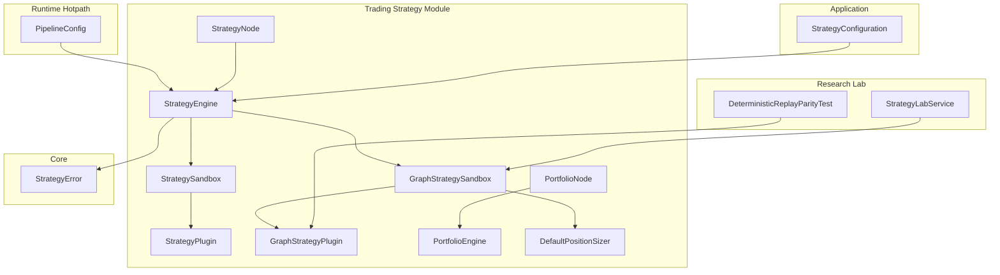
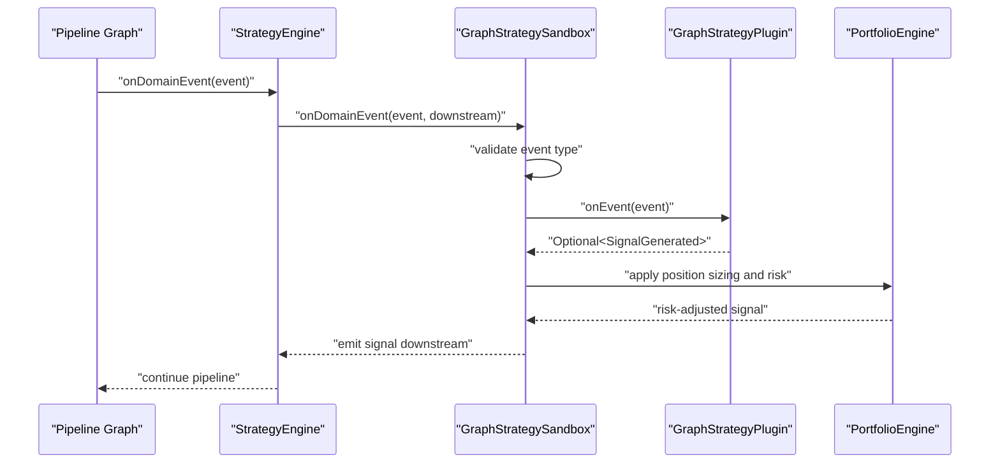
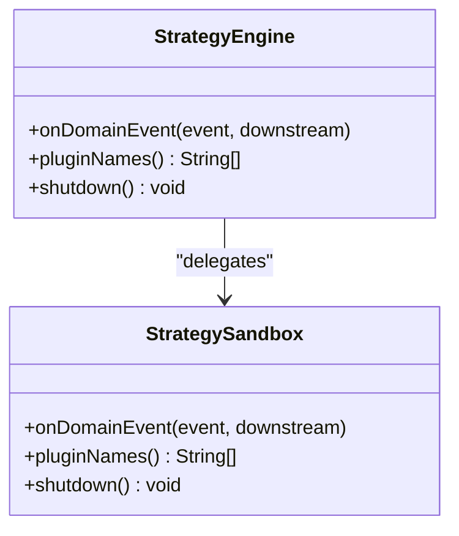
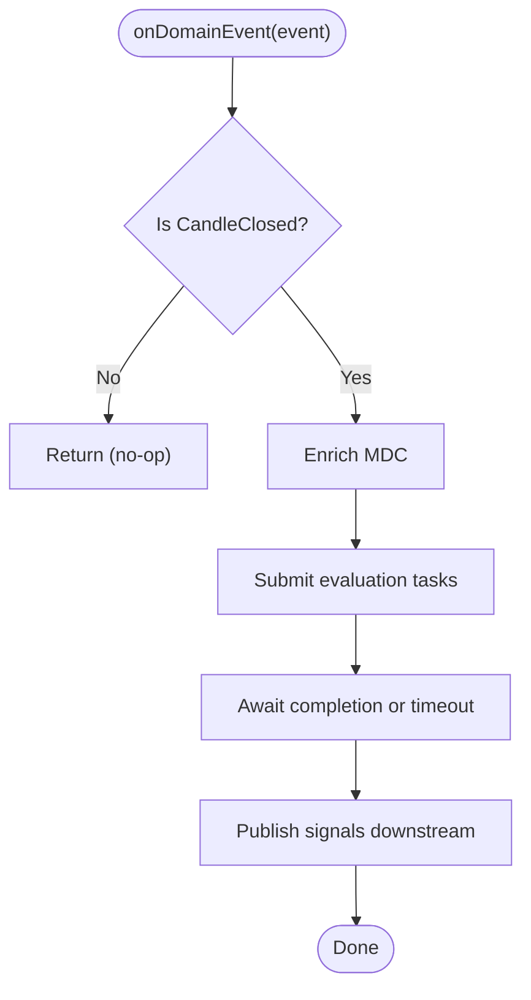
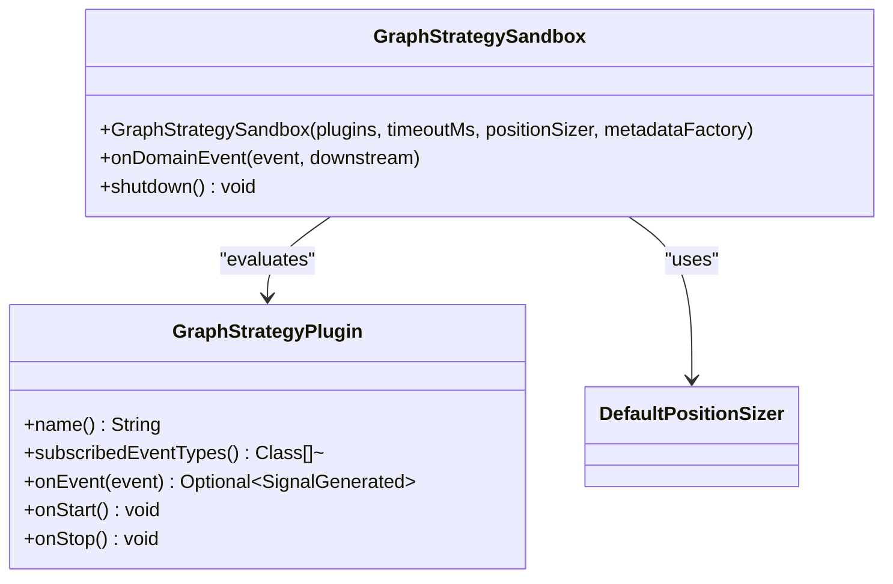
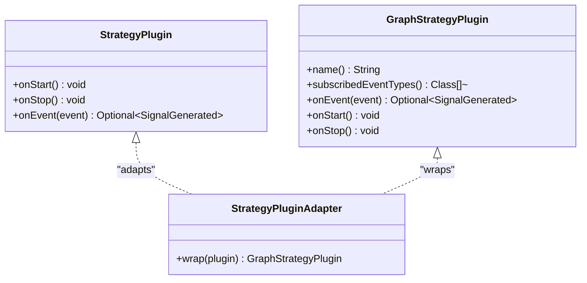
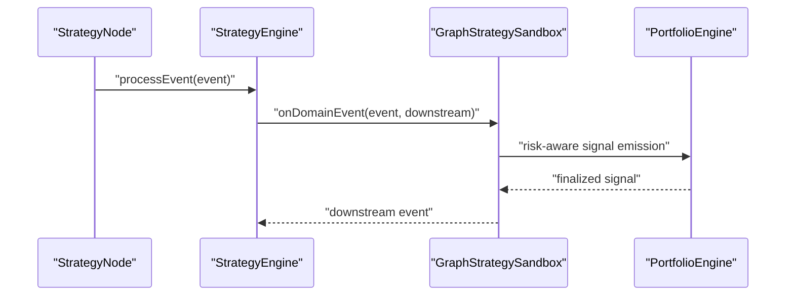
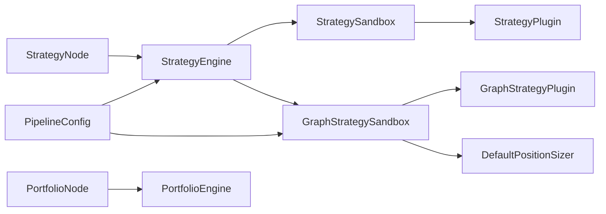

# Strategy Orchestration

<cite>
**Referenced Files in This Document**
- [StrategyEngine.java](file://trading/strategy/src/main/java/com/tradej/strategy/service/StrategyEngine.java)
- [StrategySandbox.java](file://trading/strategy/src/main/java/com/tradej/strategy/service/StrategySandbox.java)
- [GraphStrategySandbox.java](file://trading/strategy/src/main/java/com/tradej/strategy/service/GraphStrategySandbox.java)
- [StrategyPlugin.java](file://trading/strategy/src/main/java/com/tradej/strategy/api/StrategyPlugin.java)
- [GraphStrategyPlugin.java](file://trading/strategy/src/main/java/com/tradej/strategy/api/GraphStrategyPlugin.java)
- [StrategyPluginAdapter.java](file://trading/strategy/src/main/java/com/tradej/strategy/api/StrategyPluginAdapter.java)
- [StrategyNode.java](file://trading/strategy/src/main/java/com/tradej/strategy/node/StrategyNode.java)
- [PortfolioNode.java](file://trading/strategy/src/main/java/com/tradej/strategy/node/PortfolioNode.java)
- [PortfolioEngine.java](file://trading/strategy/src/main/java/com/tradej/strategy/portfolio/PortfolioEngine.java)
- [DefaultPositionSizer.java](file://trading/strategy/src/main/java/com/tradej/strategy/position/DefaultPositionSizer.java)
- [MLStrategyPlugin.java](file://trading/strategy/src/main/java/com/tradej/strategy/ml/MLStrategyPlugin.java)
- [ThresholdMLInferenceEngine.java](file://trading/strategy/src/main/java/com/tradej/strategy/ml/ThresholdMLInferenceEngine.java)
- [OptionsContextStrategyPlugin.java](file://trading/strategy/src/main/java/com/tradej/strategy/plugin/OptionsContextStrategyPlugin.java)
- [StrategyConfiguration.java](file://app/src/main/java/com/tradej/app/config/StrategyConfiguration.java)
- [PipelineConfig.java](file://runtime/hotpath/src/main/java/com/tradej/hotpath/PipelineConfig.java)
- [StrategyError.java](file://core/src/main/java/com/tradej/core/domain/event/StrategyError.java)
- [StrategyLabService.java](file://research/lab/src/main/java/com/tradej/research/lab/StrategyLabService.java)
- [DeterministicReplayParityTest.java](file://research/lab/src/test/java/com/tradej/research/parity/DeterministicReplayParityTest.java)
</cite>

## Table of Contents
1. [Introduction](#introduction)
2. [Project Structure](#project-structure)
3. [Core Components](#core-components)
4. [Architecture Overview](#architecture-overview)
5. [Detailed Component Analysis](#detailed-component-analysis)
6. [Dependency Analysis](#dependency-analysis)
7. [Performance Considerations](#performance-considerations)
8. [Troubleshooting Guide](#troubleshooting-guide)
9. [Conclusion](#conclusion)

## Introduction
This document describes the Strategy Orchestration system responsible for registering, isolating, and executing trading strategies within the Trade-J platform. It covers the StrategyEngine orchestrator, the StrategySandbox and GraphStrategySandbox environments for safe evaluation, the StrategyPlugin and GraphStrategyPlugin interfaces, and how strategies integrate with the broader pipeline system. It also documents initialization, parameter injection, state management, isolation, resource management, and performance monitoring.

## Project Structure
The Strategy Orchestration system spans several modules:
- trading/strategy: Core strategy APIs, sandbox environments, engines, nodes, portfolio management, and example plugins
- runtime/hotpath: Pipeline configuration that wires StrategyEngine into the hot-path execution graph
- research/lab: Strategy lab services and parity tests demonstrating sandbox usage and deterministic replay
- app: Application configuration that exposes StrategyEngine as a managed bean
- core: Domain events including StrategyError for error propagation

**Diagram sources**
- [StrategyEngine.java](file://trading/strategy/src/main/java/com/tradej/strategy/service/StrategyEngine.java)
- [StrategySandbox.java](file://trading/strategy/src/main/java/com/tradej/strategy/service/StrategySandbox.java)
- [GraphStrategySandbox.java](file://trading/strategy/src/main/java/com/tradej/strategy/service/GraphStrategySandbox.java)
- [StrategyPlugin.java](file://trading/strategy/src/main/java/com/tradej/strategy/api/StrategyPlugin.java)
- [GraphStrategyPlugin.java](file://trading/strategy/src/main/java/com/tradej/strategy/api/GraphStrategyPlugin.java)
- [StrategyNode.java](file://trading/strategy/src/main/java/com/tradej/strategy/node/StrategyNode.java)
- [PortfolioNode.java](file://trading/strategy/src/main/java/com/tradej/strategy/node/PortfolioNode.java)
- [PortfolioEngine.java](file://trading/strategy/src/main/java/com/tradej/strategy/portfolio/PortfolioEngine.java)
- [DefaultPositionSizer.java](file://trading/strategy/src/main/java/com/tradej/strategy/position/DefaultPositionSizer.java)
- [PipelineConfig.java](file://runtime/hotpath/src/main/java/com/tradej/hotpath/PipelineConfig.java)
- [StrategyLabService.java](file://research/lab/src/main/java/com/tradej/research/lab/StrategyLabService.java)
- [DeterministicReplayParityTest.java](file://research/lab/src/test/java/com/tradej/research/parity/DeterministicReplayParityTest.java)
- [StrategyConfiguration.java](file://app/src/main/java/com/tradej/app/config/StrategyConfiguration.java)
- [StrategyError.java](file://core/src/main/java/com/tradej/core/domain/event/StrategyError.java)

**Section sources**
- [StrategyEngine.java](file://trading/strategy/src/main/java/com/tradej/strategy/service/StrategyEngine.java)
- [StrategySandbox.java](file://trading/strategy/src/main/java/com/tradej/strategy/service/StrategySandbox.java)
- [GraphStrategySandbox.java](file://trading/strategy/src/main/java/com/tradej/strategy/service/GraphStrategySandbox.java)
- [StrategyPlugin.java](file://trading/strategy/src/main/java/com/tradej/strategy/api/StrategyPlugin.java)
- [GraphStrategyPlugin.java](file://trading/strategy/src/main/java/com/tradej/strategy/api/GraphStrategyPlugin.java)
- [StrategyNode.java](file://trading/strategy/src/main/java/com/tradej/strategy/node/StrategyNode.java)
- [PortfolioNode.java](file://trading/strategy/src/main/java/com/tradej/strategy/node/PortfolioNode.java)
- [PortfolioEngine.java](file://trading/strategy/src/main/java/com/tradej/strategy/portfolio/PortfolioEngine.java)
- [DefaultPositionSizer.java](file://trading/strategy/src/main/java/com/tradej/strategy/position/DefaultPositionSizer.java)
- [PipelineConfig.java](file://runtime/hotpath/src/main/java/com/tradej/hotpath/PipelineConfig.java)
- [StrategyLabService.java](file://research/lab/src/main/java/com/tradej/research/lab/StrategyLabService.java)
- [DeterministicReplayParityTest.java](file://research/lab/src/test/java/com/tradej/research/parity/DeterministicReplayParityTest.java)
- [StrategyConfiguration.java](file://app/src/main/java/com/tradej/app/config/StrategyConfiguration.java)
- [StrategyError.java](file://core/src/main/java/com/tradej/core/domain/event/StrategyError.java)

## Core Components
- StrategyEngine: Central orchestrator that delegates event processing to StrategySandbox and exposes plugin metadata and lifecycle controls.
- StrategySandbox: Non-blocking, isolated environment for evaluating StrategyPlugin instances against domain events (primarily CandleClosed).
- GraphStrategySandbox: Specialized sandbox for GraphStrategyPlugin that enforces timeouts, supports position sizing, and integrates with the pipeline graph.
- StrategyPlugin and GraphStrategyPlugin: Interfaces defining strategy behavior, lifecycle hooks, and event evaluation.
- StrategyNode and PortfolioNode: Pipeline nodes that integrate StrategyEngine and PortfolioEngine into the runtime graph.
- PortfolioEngine and DefaultPositionSizer: Portfolio-level capital allocation and position sizing for risk-aware strategy execution.
- StrategyConfiguration: Application-level wiring of StrategyEngine as a managed bean.
- PipelineConfig: Runtime configuration that injects StrategyEngine and GraphStrategySandbox into the hot-path pipeline.

**Section sources**
- [StrategyEngine.java](file://trading/strategy/src/main/java/com/tradej/strategy/service/StrategyEngine.java)
- [StrategySandbox.java](file://trading/strategy/src/main/java/com/tradej/strategy/service/StrategySandbox.java)
- [GraphStrategySandbox.java](file://trading/strategy/src/main/java/com/tradej/strategy/service/GraphStrategySandbox.java)
- [StrategyPlugin.java](file://trading/strategy/src/main/java/com/tradej/strategy/api/StrategyPlugin.java)
- [GraphStrategyPlugin.java](file://trading/strategy/src/main/java/com/tradej/strategy/api/GraphStrategyPlugin.java)
- [StrategyNode.java](file://trading/strategy/src/main/java/com/tradej/strategy/node/StrategyNode.java)
- [PortfolioNode.java](file://trading/strategy/src/main/java/com/tradej/strategy/node/PortfolioNode.java)
- [PortfolioEngine.java](file://trading/strategy/src/main/java/com/tradej/strategy/portfolio/PortfolioEngine.java)
- [DefaultPositionSizer.java](file://trading/strategy/src/main/java/com/tradej/strategy/position/DefaultPositionSizer.java)
- [StrategyConfiguration.java](file://app/src/main/java/com/tradej/app/config/StrategyConfiguration.java)
- [PipelineConfig.java](file://runtime/hotpath/src/main/java/com/tradej/hotpath/PipelineConfig.java)

## Architecture Overview
The Strategy Orchestration system sits at the intersection of the pipeline graph and strategy execution. StrategyEngine coordinates strategy lifecycle and delegates event evaluation to StrategySandbox or GraphStrategySandbox depending on the plugin type. GraphStrategySandbox is integrated into the hot-path pipeline via PipelineConfig, while StrategySandbox is used for non-blocking, isolated evaluation.

**Diagram sources**
- [StrategyEngine.java](file://trading/strategy/src/main/java/com/tradej/strategy/service/StrategyEngine.java)
- [GraphStrategySandbox.java](file://trading/strategy/src/main/java/com/tradej/strategy/service/GraphStrategySandbox.java)
- [GraphStrategyPlugin.java](file://trading/strategy/src/main/java/com/tradej/strategy/api/GraphStrategyPlugin.java)
- [PortfolioEngine.java](file://trading/strategy/src/main/java/com/tradej/strategy/portfolio/PortfolioEngine.java)
- [PipelineConfig.java](file://runtime/hotpath/src/main/java/com/tradej/hotpath/PipelineConfig.java)

## Detailed Component Analysis

### StrategyEngine
Role:
- Delegates event processing to StrategySandbox
- Exposes plugin names and lifecycle control
- Provides graceful shutdown hook

Key behaviors:
- Event forwarding to sandbox
- Plugin name enumeration
- Shutdown delegation to sandbox

**Diagram sources**
- [StrategyEngine.java](file://trading/strategy/src/main/java/com/tradej/strategy/service/StrategyEngine.java)
- [StrategySandbox.java](file://trading/strategy/src/main/java/com/tradej/strategy/service/StrategySandbox.java)

**Section sources**
- [StrategyEngine.java](file://trading/strategy/src/main/java/com/tradej/strategy/service/StrategyEngine.java)

### StrategySandbox
Role:
- Non-blocking evaluation of StrategyPlugin against domain events
- Filters to CandleClosed events
- Virtual thread per task execution model
- Aggregates plugin names and exposes shutdown

Initialization and lifecycle:
- Loads plugins via ServiceLoader
- Supports explicit plugin list and timeout configuration
- Uses PositionSizer for sizing decisions

**Diagram sources**
- [StrategySandbox.java](file://trading/strategy/src/main/java/com/tradej/strategy/service/StrategySandbox.java)

**Section sources**
- [StrategySandbox.java](file://trading/strategy/src/main/java/com/tradej/strategy/service/StrategySandbox.java)

### GraphStrategySandbox
Role:
- Specialized sandbox for GraphStrategyPlugin
- Enforces configurable timeout
- Integrates with PositionSizer and EventMetadataFactory
- Designed for hot-path pipeline integration

Initialization and lifecycle:
- Accepts GraphStrategyPlugin list and EventMetadataFactory
- Uses virtual threads for evaluation
- Emits signals downstream after risk-aware sizing

**Diagram sources**
- [GraphStrategySandbox.java](file://trading/strategy/src/main/java/com/tradej/strategy/service/GraphStrategySandbox.java)
- [GraphStrategyPlugin.java](file://trading/strategy/src/main/java/com/tradej/strategy/api/GraphStrategyPlugin.java)
- [DefaultPositionSizer.java](file://trading/strategy/src/main/java/com/tradej/strategy/position/DefaultPositionSizer.java)

**Section sources**
- [GraphStrategySandbox.java](file://trading/strategy/src/main/java/com/tradej/strategy/service/GraphStrategySandbox.java)
- [GraphStrategyPlugin.java](file://trading/strategy/src/main/java/com/tradej/strategy/api/GraphStrategyPlugin.java)
- [DefaultPositionSizer.java](file://trading/strategy/src/main/java/com/tradej/strategy/position/DefaultPositionSizer.java)

### StrategyPlugin and GraphStrategyPlugin Interfaces
- StrategyPlugin: Defines lifecycle hooks (onStart/onStop) and evaluation method for domain events.
- GraphStrategyPlugin: Extends StrategyPlugin with explicit subscribed event types and a typed onEvent method returning a signal.

Implementation patterns:
- StrategyPluginAdapter: Adapter pattern to convert legacy StrategyPlugin implementations to GraphStrategyPlugin when needed.
- Example implementations: DepthImbalanceStrategy, TickPriceChangeStrategy, MLStrategyPlugin, OptionsContextStrategyPlugin.

**Diagram sources**
- [StrategyPlugin.java](file://trading/strategy/src/main/java/com/tradej/strategy/api/StrategyPlugin.java)
- [GraphStrategyPlugin.java](file://trading/strategy/src/main/java/com/tradej/strategy/api/GraphStrategyPlugin.java)
- [StrategyPluginAdapter.java](file://trading/strategy/src/main/java/com/tradej/strategy/api/StrategyPluginAdapter.java)

**Section sources**
- [StrategyPlugin.java](file://trading/strategy/src/main/java/com/tradej/strategy/api/StrategyPlugin.java)
- [GraphStrategyPlugin.java](file://trading/strategy/src/main/java/com/tradej/strategy/api/GraphStrategyPlugin.java)
- [StrategyPluginAdapter.java](file://trading/strategy/src/main/java/com/tradej/strategy/api/StrategyPluginAdapter.java)

### StrategyNode and PortfolioNode Integration
- StrategyNode: Wraps StrategyEngine to participate in the pipeline graph, forwarding domain events to the engine.
- PortfolioNode: Wraps PortfolioEngine to enforce capital allocation and exposure limits across strategies.

**Diagram sources**
- [StrategyNode.java](file://trading/strategy/src/main/java/com/tradej/strategy/node/StrategyNode.java)
- [StrategyEngine.java](file://trading/strategy/src/main/java/com/tradej/strategy/service/StrategyEngine.java)
- [GraphStrategySandbox.java](file://trading/strategy/src/main/java/com/tradej/strategy/service/GraphStrategySandbox.java)
- [PortfolioEngine.java](file://trading/strategy/src/main/java/com/tradej/strategy/portfolio/PortfolioEngine.java)

**Section sources**
- [StrategyNode.java](file://trading/strategy/src/main/java/com/tradej/strategy/node/StrategyNode.java)
- [PortfolioNode.java](file://trading/strategy/src/main/java/com/tradej/strategy/node/PortfolioNode.java)
- [PortfolioEngine.java](file://trading/strategy/src/main/java/com/tradej/strategy/portfolio/PortfolioEngine.java)

### PortfolioEngine and Position Sizing
- PortfolioEngine: Manages capital reservation and exposure tracking across strategies and symbols.
- DefaultPositionSizer: Provides default sizing logic used by sandboxes to translate signals into risk-aware orders.

Key capabilities:
- Strategy-scoped capital usage tracking
- Net position aggregation across strategies
- Exposure limits enforcement

**Section sources**
- [PortfolioEngine.java](file://trading/strategy/src/main/java/com/tradej/strategy/portfolio/PortfolioEngine.java)
- [DefaultPositionSizer.java](file://trading/strategy/src/main/java/com/tradej/strategy/position/DefaultPositionSizer.java)

### Strategy Registration and Lifecycle Management
- StrategyEngine exposes plugin names for discovery.
- GraphStrategyPlugin provides onStart/onStop hooks for initialization and cleanup.
- StrategySandbox loads plugins via ServiceLoader and supports explicit plugin lists.
- Application wiring via StrategyConfiguration makes StrategyEngine available as a managed bean.

**Section sources**
- [StrategyEngine.java](file://trading/strategy/src/main/java/com/tradej/strategy/service/StrategyEngine.java)
- [GraphStrategyPlugin.java](file://trading/strategy/src/main/java/com/tradej/strategy/api/GraphStrategyPlugin.java)
- [StrategySandbox.java](file://trading/strategy/src/main/java/com/tradej/strategy/service/StrategySandbox.java)
- [StrategyConfiguration.java](file://app/src/main/java/com/tradej/app/config/StrategyConfiguration.java)

### Parameter Injection and State Management
- GraphStrategySandbox constructor accepts EventMetadataFactory and PositionSizer, enabling parameterized behavior.
- GraphStrategyPlugin onStart/onStop allow stateful strategies to initialize and persist state during lifecycle transitions.
- StrategySandbox supports timeout configuration and virtual thread execution for isolation.

**Section sources**
- [GraphStrategySandbox.java](file://trading/strategy/src/main/java/com/tradej/strategy/service/GraphStrategySandbox.java)
- [GraphStrategyPlugin.java](file://trading/strategy/src/main/java/com/tradej/strategy/api/GraphStrategyPlugin.java)
- [StrategySandbox.java](file://trading/strategy/src/main/java/com/tradej/strategy/service/StrategySandbox.java)

### Sandbox Usage Patterns and Examples
- StrategyLabService demonstrates how to construct and evaluate GraphStrategyPlugin instances in a controlled environment.
- DeterministicReplayParityTest shows a minimal GraphStrategyPlugin implementation used for parity validation.

**Section sources**
- [StrategyLabService.java](file://research/lab/src/main/java/com/tradej/research/lab/StrategyLabService.java)
- [DeterministicReplayParityTest.java](file://research/lab/src/test/java/com/tradej/research/parity/DeterministicReplayParityTest.java)

## Dependency Analysis
The Strategy Orchestration system exhibits clear separation of concerns:
- StrategyEngine depends on StrategySandbox and GraphStrategySandbox
- GraphStrategySandbox depends on GraphStrategyPlugin and PortfolioEngine
- StrategySandbox depends on StrategyPlugin and PositionSizer
- PipelineConfig integrates StrategyEngine and GraphStrategySandbox into the hot-path runtime

**Diagram sources**
- [StrategyEngine.java](file://trading/strategy/src/main/java/com/tradej/strategy/service/StrategyEngine.java)
- [StrategySandbox.java](file://trading/strategy/src/main/java/com/tradej/strategy/service/StrategySandbox.java)
- [GraphStrategySandbox.java](file://trading/strategy/src/main/java/com/tradej/strategy/service/GraphStrategySandbox.java)
- [StrategyPlugin.java](file://trading/strategy/src/main/java/com/tradej/strategy/api/StrategyPlugin.java)
- [GraphStrategyPlugin.java](file://trading/strategy/src/main/java/com/tradej/strategy/api/GraphStrategyPlugin.java)
- [DefaultPositionSizer.java](file://trading/strategy/src/main/java/com/tradej/strategy/position/DefaultPositionSizer.java)
- [PipelineConfig.java](file://runtime/hotpath/src/main/java/com/tradej/hotpath/PipelineConfig.java)
- [StrategyNode.java](file://trading/strategy/src/main/java/com/tradej/strategy/node/StrategyNode.java)
- [PortfolioNode.java](file://trading/strategy/src/main/java/com/tradej/strategy/node/PortfolioNode.java)
- [PortfolioEngine.java](file://trading/strategy/src/main/java/com/tradej/strategy/portfolio/PortfolioEngine.java)

**Section sources**
- [StrategyEngine.java](file://trading/strategy/src/main/java/com/tradej/strategy/service/StrategyEngine.java)
- [StrategySandbox.java](file://trading/strategy/src/main/java/com/tradej/strategy/service/StrategySandbox.java)
- [GraphStrategySandbox.java](file://trading/strategy/src/main/java/com/tradej/strategy/service/GraphStrategySandbox.java)
- [StrategyPlugin.java](file://trading/strategy/src/main/java/com/tradej/strategy/api/StrategyPlugin.java)
- [GraphStrategyPlugin.java](file://trading/strategy/src/main/java/com/tradej/strategy/api/GraphStrategyPlugin.java)
- [DefaultPositionSizer.java](file://trading/strategy/src/main/java/com/tradej/strategy/position/DefaultPositionSizer.java)
- [PipelineConfig.java](file://runtime/hotpath/src/main/java/com/tradej/hotpath/PipelineConfig.java)
- [StrategyNode.java](file://trading/strategy/src/main/java/com/tradej/strategy/node/StrategyNode.java)
- [PortfolioNode.java](file://trading/strategy/src/main/java/com/tradej/strategy/node/PortfolioNode.java)
- [PortfolioEngine.java](file://trading/strategy/src/main/java/com/tradej/strategy/portfolio/PortfolioEngine.java)

## Performance Considerations
- Virtual threads: StrategySandbox and GraphStrategySandbox use virtual thread executors to minimize overhead and improve concurrency.
- Timeouts: GraphStrategySandbox enforces a configurable timeout to prevent stalls in the hot path.
- Position sizing: DefaultPositionSizer ensures risk-aware order sizing, reducing adverse selection and slippage impact.
- Event filtering: StrategySandbox processes only CandleClosed events to reduce unnecessary evaluations.
- Pipeline integration: PipelineConfig ensures StrategyEngine and GraphStrategySandbox are wired into the hot path with proper stage timings and dead-letter queue handling.

[No sources needed since this section provides general guidance]

## Troubleshooting Guide
Common issues and remedies:
- Strategy not triggering: Verify GraphStrategyPlugin subscribedEventTypes includes the event type and that onEvent returns a signal when conditions are met.
- Timeout exceeded: Increase GraphStrategySandbox timeout or optimize strategy logic to complete evaluation within budget.
- Resource leaks: Ensure GraphStrategyPlugin onStart allocates and onStop releases resources; StrategyEngine shutdown triggers sandbox shutdown.
- Risk errors: Confirm PortfolioEngine exposure limits and capital reservations align with strategy intent; review StrategyError events for diagnostics.

**Section sources**
- [GraphStrategyPlugin.java](file://trading/strategy/src/main/java/com/tradej/strategy/api/GraphStrategyPlugin.java)
- [GraphStrategySandbox.java](file://trading/strategy/src/main/java/com/tradej/strategy/service/GraphStrategySandbox.java)
- [StrategyError.java](file://core/src/main/java/com/tradej/core/domain/event/StrategyError.java)

## Conclusion
The Strategy Orchestration system provides a robust, isolated, and scalable framework for developing and executing trading strategies. StrategyEngine coordinates lifecycle and execution, StrategySandbox and GraphStrategySandbox offer safe evaluation environments, and the integration with PortfolioEngine ensures risk-aware execution. The modular design, combined with virtual threads, timeouts, and pipeline integration, delivers strong isolation, resource management, and performance characteristics suitable for production trading systems.