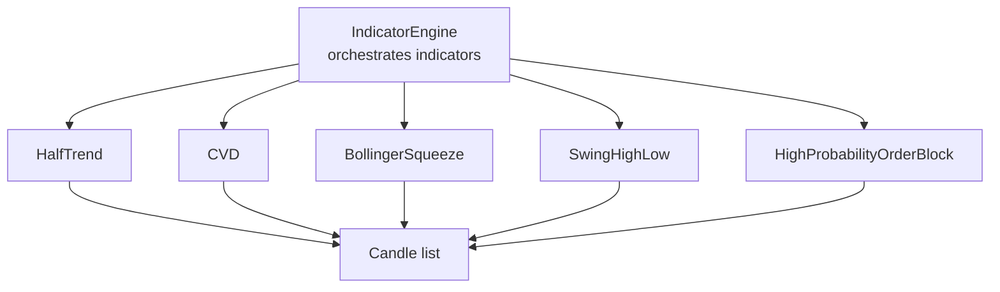
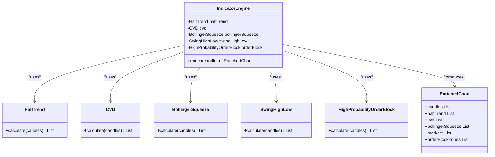
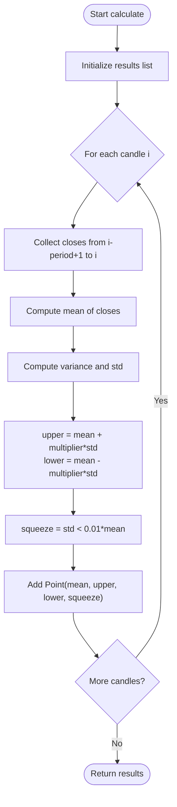
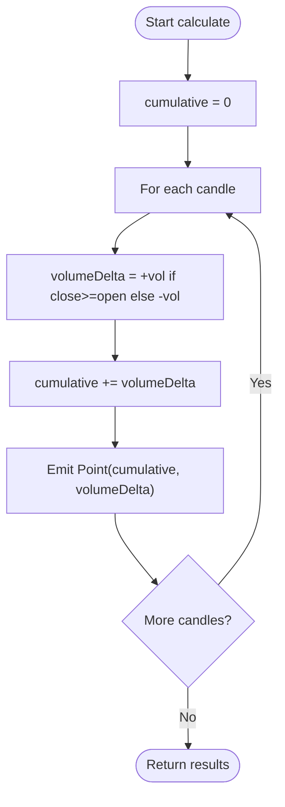
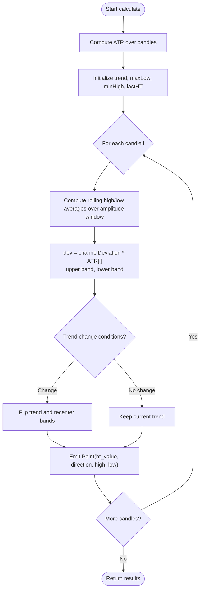
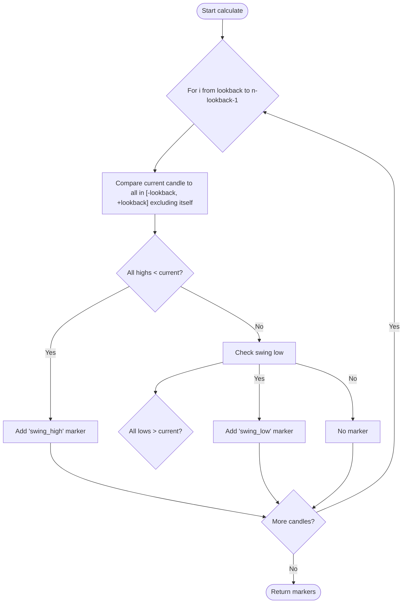
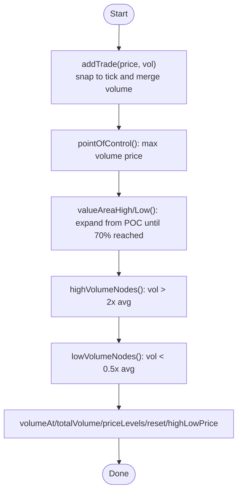
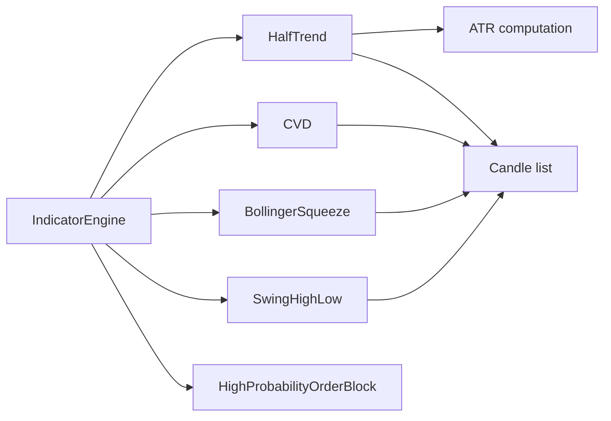

# Technical Indicator Framework

<cite>
**Referenced Files in This Document**
- [IndicatorEngine.java](file://trading/indicators/src/main/java/com/tradej/indicators/IndicatorEngine.java)
- [BollingerSqueeze.java](file://trading/indicators/src/main/java/com/tradej/indicators/BollingerSqueeze.java)
- [CVD.java](file://trading/indicators/src/main/java/com/tradej/indicators/CVD.java)
- [HalfTrend.java](file://trading/indicators/src/main/java/com/tradej/indicators/HalfTrend.java)
- [SwingHighLow.java](file://trading/indicators/src/main/java/com/tradej/indicators/SwingHighLow.java)
- [VolumeProfile.java](file://trading/indicators/src/main/java/com/tradej/indicators/VolumeProfile.java)
- [IndicatorEngineTest.java](file://trading/indicators/src/test/java/com/tradej/indicators/IndicatorEngineTest.java)
</cite>

## Table of Contents
1. [Introduction](#introduction)
2. [Project Structure](#project-structure)
3. [Core Components](#core-components)
4. [Architecture Overview](#architecture-overview)
5. [Detailed Component Analysis](#detailed-component-analysis)
6. [Dependency Analysis](#dependency-analysis)
7. [Performance Considerations](#performance-considerations)
8. [Troubleshooting Guide](#troubleshooting-guide)
9. [Conclusion](#conclusion)
10. [Appendices](#appendices)

## Introduction
This document describes the Technical Indicator Framework used to compute and chain market indicators from OHLCV (Open, High, Low, Close, Volume) candles. It focuses on the IndicatorEngine architecture, the implementation of key indicators (BollingerSqueeze, CVD, HalfTrend, SwingHighLow, VolumeProfile), and practical guidance for building custom indicators, combining them, validating results, and integrating with a strategy engine.

## Project Structure
The indicator framework resides under the trading/indicators module. The primary entry point is IndicatorEngine, which orchestrates multiple indicator calculators and returns a unified enriched chart result. Individual indicators encapsulate their own calculation logic and expose typed results.

**Diagram sources**
- [IndicatorEngine.java:32-41](file://trading/indicators/src/main/java/com/tradej/indicators/IndicatorEngine.java#L32-L41)
- [HalfTrend.java:27-101](file://trading/indicators/src/main/java/com/tradej/indicators/HalfTrend.java#L27-L101)
- [CVD.java:13-24](file://trading/indicators/src/main/java/com/tradej/indicators/CVD.java#L13-L24)
- [BollingerSqueeze.java:25-48](file://trading/indicators/src/main/java/com/tradej/indicators/BollingerSqueeze.java#L25-L48)
- [SwingHighLow.java:23-47](file://trading/indicators/src/main/java/com/tradej/indicators/SwingHighLow.java#L23-L47)

**Section sources**
- [IndicatorEngine.java:1-53](file://trading/indicators/src/main/java/com/tradej/indicators/IndicatorEngine.java#L1-L53)

## Core Components
- IndicatorEngine: Central orchestrator that initializes and invokes indicator calculators, returning an EnrichedChart with aligned per-candle indicator series.
- Indicator calculators: Each indicator exposes a calculate(List<Candle>) method and returns a typed list of points/markers suitable for downstream consumption.
- EnrichedChart: Immutable record aggregating the original candles and all computed indicator series.

Key responsibilities:
- Parameterized construction for configurable indicators (e.g., periods, multipliers).
- Consistent output alignment with input candles.
- Lightweight, functional-style calculations without external dependencies.

**Section sources**
- [IndicatorEngine.java:7-51](file://trading/indicators/src/main/java/com/tradej/indicators/IndicatorEngine.java#L7-L51)

## Architecture Overview
The IndicatorEngine follows a composition pattern: it holds instances of each indicator and delegates calculation to them. The engine ensures all indicator series are computed against the same candle list and returned as a cohesive bundle.

**Diagram sources**
- [IndicatorEngine.java:7-51](file://trading/indicators/src/main/java/com/tradej/indicators/IndicatorEngine.java#L7-L51)
- [HalfTrend.java:24-25](file://trading/indicators/src/main/java/com/tradej/indicators/HalfTrend.java#L24-L25)
- [CVD.java:10](file://trading/indicators/src/main/java/com/tradej/indicators/CVD.java#L10)
- [BollingerSqueeze.java:22](file://trading/indicators/src/main/java/com/tradej/indicators/BollingerSqueeze.java#L22)
- [SwingHighLow.java:20](file://trading/indicators/src/main/java/com/tradej/indicators/SwingHighLow.java#L20)

## Detailed Component Analysis

### IndicatorEngine
- Purpose: Compose and run indicator computations in a single pass over candles.
- Construction: Supports default constructor instantiating built-in defaults and a parameterized constructor for injecting custom indicator instances.
- Output: EnrichedChart with aligned lists for each indicator series.

Processing logic:
- Invoke each indicator’s calculate method with the full candle list.
- Return a record containing the original candles plus all indicator series.

Real-time strategy integration:
- Use the EnrichedChart to feed downstream strategy decisions without recomputing shared windows.

**Section sources**
- [IndicatorEngine.java:15-30](file://trading/indicators/src/main/java/com/tradej/indicators/IndicatorEngine.java#L15-L30)
- [IndicatorEngine.java:32-41](file://trading/indicators/src/main/java/com/tradej/indicators/IndicatorEngine.java#L32-L41)
- [IndicatorEngine.java:43-51](file://trading/indicators/src/main/java/com/tradej/indicators/IndicatorEngine.java#L43-L51)

### BollingerSqueeze
- Parameters: period (default 20), stdDevMultiplier (default 2.0).
- Inputs: Close prices converted from paisa to rupees.
- Calculation window: Sliding from position i back to i - period + 1.
- Outputs: Point(middle, upper, lower, squeeze) per candle.
- Squeeze detection: Boolean derived from standard deviation being below a small fraction of the mean.

Algorithm highlights:
- Compute mean and standard deviation over the rolling window.
- Derive upper/lower bands using multiplier.
- Determine squeeze condition based on volatility threshold.

**Diagram sources**
- [BollingerSqueeze.java:25-48](file://trading/indicators/src/main/java/com/tradej/indicators/BollingerSqueeze.java#L25-L48)

**Section sources**
- [BollingerSqueeze.java:8-23](file://trading/indicators/src/main/java/com/tradej/indicators/BollingerSqueeze.java#L8-L23)
- [BollingerSqueeze.java:25-48](file://trading/indicators/src/main/java/com/tradej/indicators/BollingerSqueeze.java#L25-L48)

### CVD (Cumulative Volume Delta)
- Parameters: None (no configuration).
- Inputs: Each candle contributes a signed volume delta based on close vs open.
- Calculation: For each candle, compute volumeDelta (positive if close >= open, else negative), then accumulate to produce cumulative delta.
- Output: Point(cumulative, volumeDelta) per candle.

**Diagram sources**
- [CVD.java:13-24](file://trading/indicators/src/main/java/com/tradej/indicators/CVD.java#L13-L24)

**Section sources**
- [CVD.java:8-25](file://trading/indicators/src/main/java/com/tradej/indicators/CVD.java#L8-L25)

### HalfTrend
- Parameters: amplitude (default 2), channelDeviation (default 2), atrPeriod (default 100).
- Inputs: Uses ATR-derived channel bands around rolling high/low averages.
- Calculation:
  - Precompute ATR over the candle series.
  - Track trend direction and dynamic channel thresholds.
  - Update channel highs/lows based on rolling averages and ATR deviations.
  - Emit Point(value, direction, high, low) per candle.

**Diagram sources**
- [HalfTrend.java:27-101](file://trading/indicators/src/main/java/com/tradej/indicators/HalfTrend.java#L27-L101)
- [HalfTrend.java:103-136](file://trading/indicators/src/main/java/com/tradej/indicators/HalfTrend.java#L103-L136)

**Section sources**
- [HalfTrend.java:8-25](file://trading/indicators/src/main/java/com/tradej/indicators/HalfTrend.java#L8-L25)
- [HalfTrend.java:27-101](file://trading/indicators/src/main/java/com/tradej/indicators/HalfTrend.java#L27-L101)
- [HalfTrend.java:103-136](file://trading/indicators/src/main/java/com/tradej/indicators/HalfTrend.java#L103-L136)

### SwingHighLow
- Parameters: lookback (default 5).
- Inputs: Candle high/low prices.
- Calculation: For each candle within valid bounds, compare neighbors within [-lookback, +lookback] to detect local peaks/troughs.
- Output: Marker(type, timeMs, price) where type is "swing_high" or "swing_low".

**Diagram sources**
- [SwingHighLow.java:23-47](file://trading/indicators/src/main/java/com/tradej/indicators/SwingHighLow.java#L23-L47)

**Section sources**
- [SwingHighLow.java:8-21](file://trading/indicators/src/main/java/com/tradej/indicators/SwingHighLow.java#L8-L21)
- [SwingHighLow.java:23-47](file://trading/indicators/src/main/java/com/tradej/indicators/SwingHighLow.java#L23-L47)

### VolumeProfile
- Parameters: tickSizePaisa (constructor).
- Inputs: Trades represented as pricePaisa and volume pairs.
- Features:
  - Add trades with automatic tick snapping.
  - Compute Point of Control (POC).
  - Compute Value Area High/Low (covering 70% of volume around POC).
  - Identify High/Low Volume Nodes (HVN/LVN) via thresholds.
  - Utility queries: volumeAt, totalVolume, priceLevelCount, high/lowPrice, reset, priceLevels.

**Diagram sources**
- [VolumeProfile.java:42-103](file://trading/indicators/src/main/java/com/tradej/indicators/VolumeProfile.java#L42-L103)
- [VolumeProfile.java:161-191](file://trading/indicators/src/main/java/com/tradej/indicators/VolumeProfile.java#L161-L191)

**Section sources**
- [VolumeProfile.java:26-36](file://trading/indicators/src/main/java/com/tradej/indicators/VolumeProfile.java#L26-L36)
- [VolumeProfile.java:53-103](file://trading/indicators/src/main/java/com/tradej/indicators/VolumeProfile.java#L53-L103)
- [VolumeProfile.java:161-191](file://trading/indicators/src/main/java/com/tradej/indicators/VolumeProfile.java#L161-L191)

## Dependency Analysis
- Internal dependencies:
  - IndicatorEngine depends on each indicator implementation.
  - HalfTrend internally computes ATR prior to calculating trend bands.
  - All indicators operate on the same input candle list and return per-candle outputs aligned by index.
- External dependencies:
  - Core Candle domain model is used for OHLCV and time fields.
- Cohesion and coupling:
  - Indicators are cohesive units with clear input/output contracts.
  - Engine acts as a coordinator with low coupling to individual indicator internals.

**Diagram sources**
- [IndicatorEngine.java:32-41](file://trading/indicators/src/main/java/com/tradej/indicators/IndicatorEngine.java#L32-L41)
- [HalfTrend.java:103-136](file://trading/indicators/src/main/java/com/tradej/indicators/HalfTrend.java#L103-L136)

**Section sources**
- [IndicatorEngine.java:9-13](file://trading/indicators/src/main/java/com/tradej/indicators/IndicatorEngine.java#L9-L13)
- [HalfTrend.java:103-136](file://trading/indicators/src/main/java/com/tradej/indicators/HalfTrend.java#L103-L136)

## Performance Considerations
- Complexity:
  - BollingerSqueeze: O(n * period) for sliding window statistics.
  - CVD: O(n) cumulative pass.
  - HalfTrend: O(n * amplitude) for rolling averages plus O(n) ATR; dominated by ATR smoothing.
  - SwingHighLow: O(n * lookback^2) in worst-case comparisons.
  - VolumeProfile: O(log m) per addTrade due to TreeMap operations; batch updates recommended.
- Optimization opportunities:
  - Replace per-candle loops with rolling accumulators for means/variances.
  - Pre-allocate result lists to avoid repeated resizing.
  - Use streaming aggregations for ATR and rolling stats.
  - Cache intermediate values when processing multiple indicators on the same dataset.
- Memory:
  - Results are materialized per candle; consider lazy evaluation or chunking for very long series.

[No sources needed since this section provides general guidance]

## Troubleshooting Guide
- Validation:
  - Unit tests confirm that EnrichedChart contains non-empty indicator series aligned with input candles.
  - Verify that indicator outputs are non-null and match candle length.
- Common issues:
  - Empty candle list: Some indicators return empty results; ensure preconditions are met.
  - Parameter sensitivity: Adjust periods and multipliers to reduce false signals.
  - Tick sizing: For VolumeProfile, ensure tickSizePaisa matches exchange tick conventions.
- Testing methodologies:
  - Use synthetic candle sequences with known patterns to assert expected marker positions or band states.
  - Compare outputs across multiple timeframes to validate consistency.
  - Benchmark performance on large datasets and monitor memory footprint.

**Section sources**
- [IndicatorEngineTest.java:14-27](file://trading/indicators/src/test/java/com/tradej/indicators/IndicatorEngineTest.java#L14-L27)

## Conclusion
The Technical Indicator Framework provides a clean, extensible foundation for computing and chaining market indicators. IndicatorEngine centralizes orchestration, while individual indicators encapsulate focused logic with configurable parameters. The design supports real-time processing, integrates cleanly with strategy engines, and offers clear extension points for custom indicators.

[No sources needed since this section summarizes without analyzing specific files]

## Appendices

### Indicator Output Formats
- BollingerSqueeze: Point(middle, upper, lower, squeeze)
- CVD: Point(cumulative, volumeDelta)
- HalfTrend: Point(value, direction, high, low)
- SwingHighLow: Marker(type ∈ {"swing_high","swing_low"}, timeMs, price)
- VolumeProfile: Aggregated statistics and collections (POC, VA bounds, HVN/LVN)

**Section sources**
- [BollingerSqueeze.java:22](file://trading/indicators/src/main/java/com/tradej/indicators/BollingerSqueeze.java#L22)
- [CVD.java:10](file://trading/indicators/src/main/java/com/tradej/indicators/CVD.java#L10)
- [HalfTrend.java:24](file://trading/indicators/src/main/java/com/tradej/indicators/HalfTrend.java#L24)
- [SwingHighLow.java:20](file://trading/indicators/src/main/java/com/tradej/indicators/SwingHighLow.java#L20)
- [VolumeProfile.java:53-103](file://trading/indicators/src/main/java/com/tradej/indicators/VolumeProfile.java#L53-L103)

### Real-Time Calculation Strategies
- Stream processing: Feed IndicatorEngine with incremental candle updates; maintain a rolling window buffer.
- Indicator chaining: Use EnrichedChart outputs as inputs to subsequent indicators (e.g., HalfTrend bands to filter entries).
- Dependency management: Ensure shared windows (e.g., ATR) are computed once and reused across indicators.

[No sources needed since this section provides general guidance]