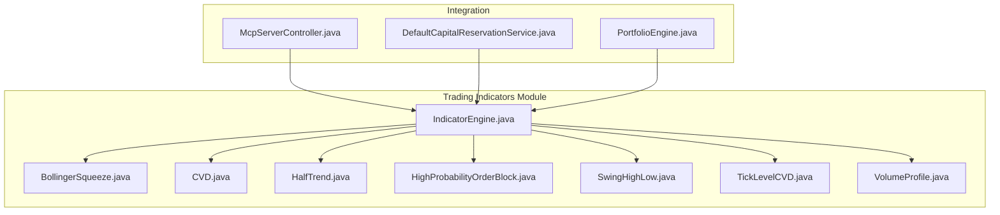
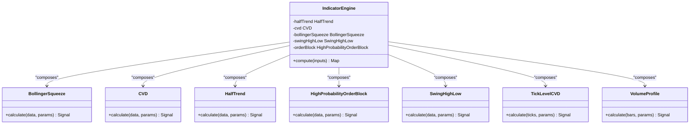
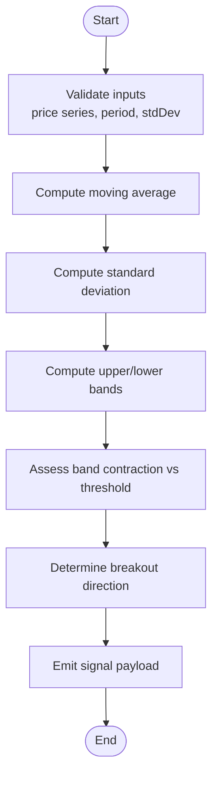
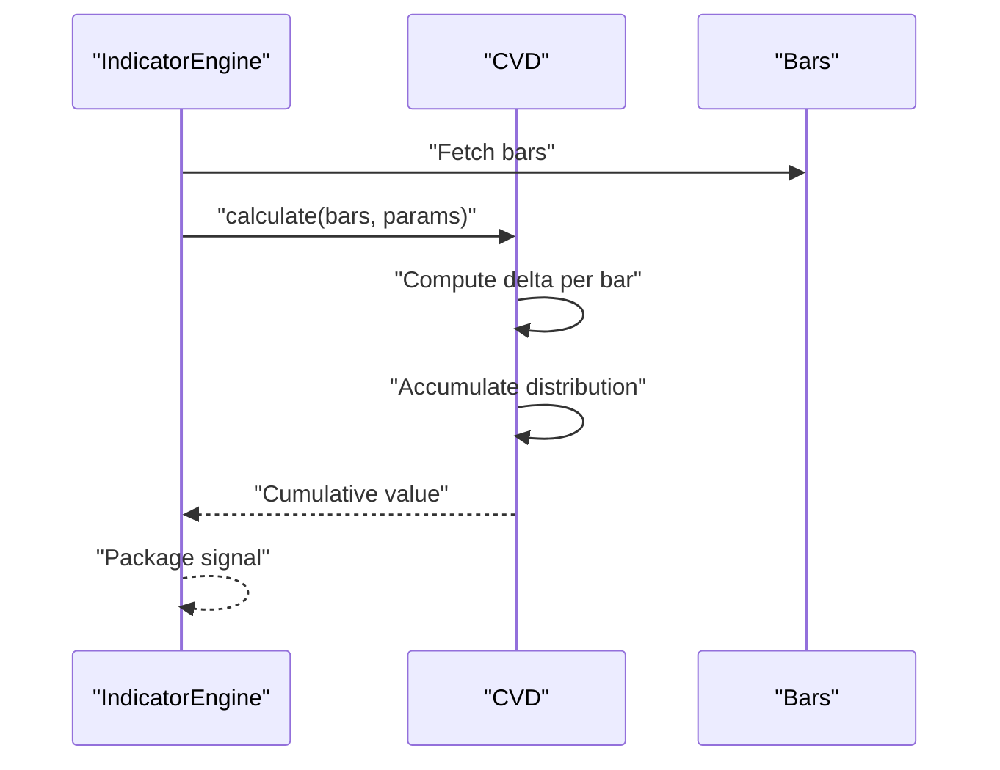
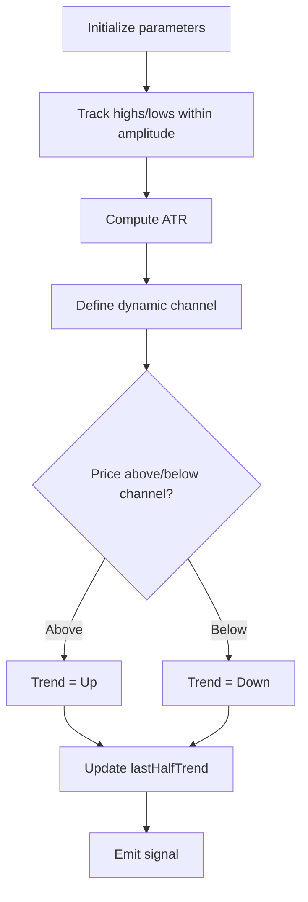
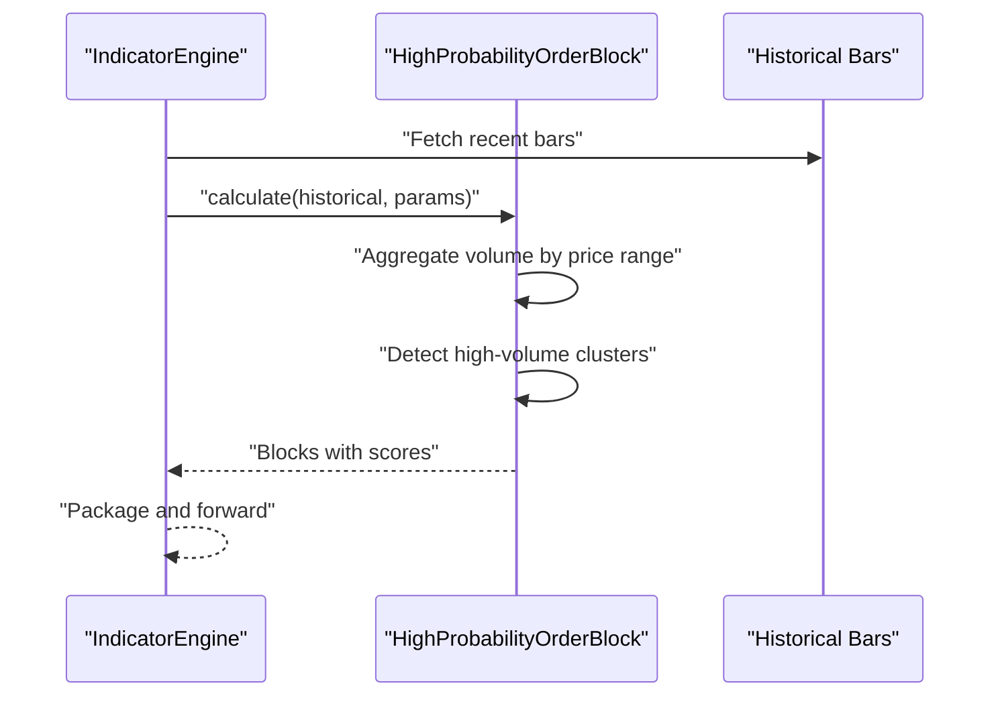
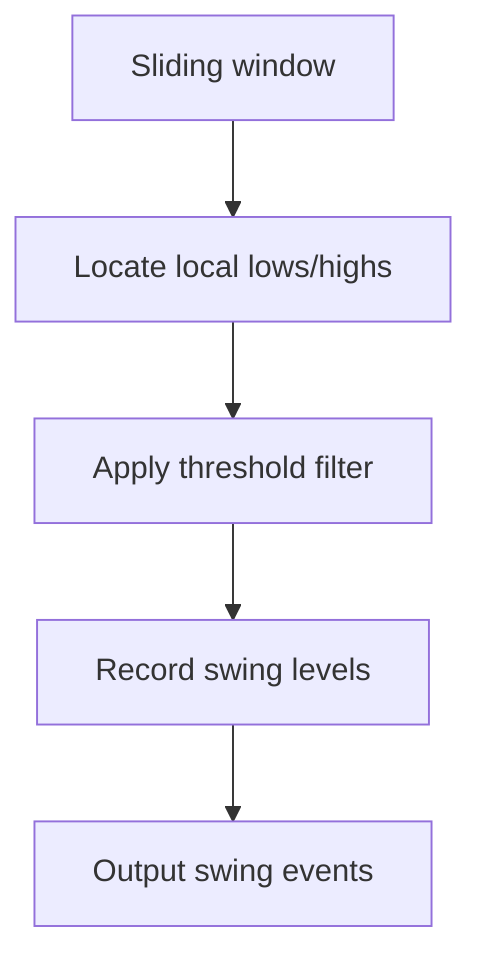
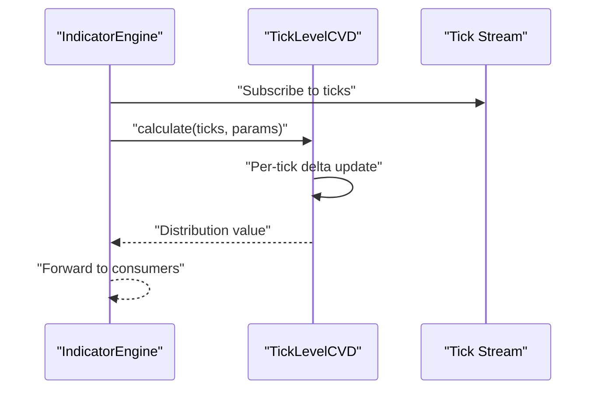
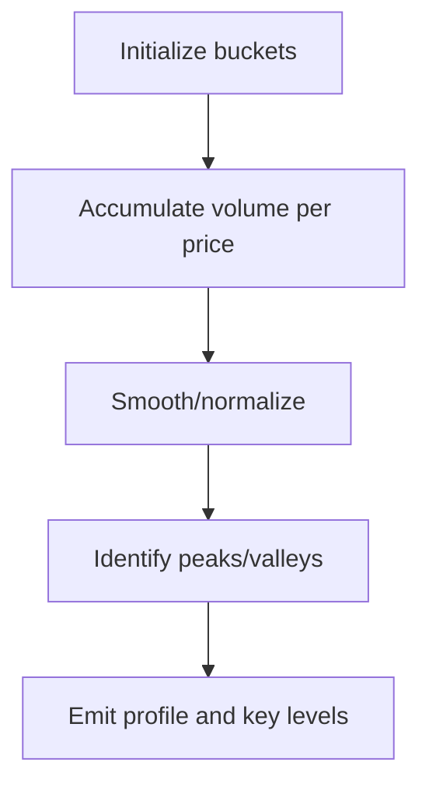
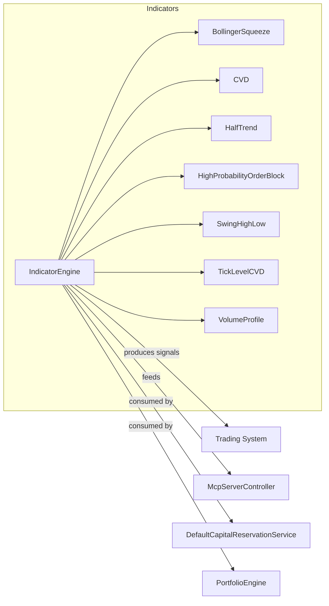

# Indicator Engine

<cite>
**Referenced Files in This Document**
- [IndicatorEngine.java](file://trading/indicators/src/main/java/com/tradej/indicators/IndicatorEngine.java)
- [BollingerSqueeze.java](file://trading/indicators/src/main/java/com/tradej/indicators/BollingerSqueeze.java)
- [CVD.java](file://trading/indicators/src/main/java/com/tradej/indicators/CVD.java)
- [HalfTrend.java](file://trading/indicators/src/main/java/com/tradej/indicators/HalfTrend.java)
- [HighProbabilityOrderBlock.java](file://trading/indicators/src/main/java/com/tradej/indicators/HighProbabilityOrderBlock.java)
- [SwingHighLow.java](file://trading/indicators/src/main/java/com/tradej/indicators/SwingHighLow.java)
- [TickLevelCVD.java](file://trading/indicators/src/main/java/com/tradej/indicators/TickLevelCVD.java)
- [VolumeProfile.java](file://trading/indicators/src/main/java/com/tradej/indicators/VolumeProfile.java)
- [IndicatorEngineTest.java](file://trading/indicators/src/test/java/com/tradej/indicators/IndicatorEngineTest.java)
- [McpServerController.java](file://mcp-server/src/main/java/com/tradej/mcp/McpServerController.java)
- [DefaultCapitalReservationService.java](file://trading/strategy/src/main/java/com/tradej/strategy/portfolio/DefaultCapitalReservationService.java)
- [PortfolioEngine.java](file://trading/strategy/src/main/java/com/tradej/strategy/portfolio/PortfolioEngine.java)
</cite>

## Table of Contents
1. [Introduction](#introduction)
2. [Project Structure](#project-structure)
3. [Core Components](#core-components)
4. [Architecture Overview](#architecture-overview)
5. [Detailed Component Analysis](#detailed-component-analysis)
6. [Dependency Analysis](#dependency-analysis)
7. [Performance Considerations](#performance-considerations)
8. [Troubleshooting Guide](#troubleshooting-guide)
9. [Conclusion](#conclusion)
10. [Appendices](#appendices)

## Introduction
This document describes the Indicator Engine system responsible for computing market indicators and generating signals used by the trading system. It covers the indicator calculation framework, algorithm implementations, and signal generation processes. The documented indicators include Bollinger Squeeze, CVD (Cumulative Volume Distribution), HalfTrend, High Probability Order Block, Swing High/Low detection, Tick Level CVD, and Volume Profile. The guide explains calculation pipelines, input requirements, parameter configurations, output formats, performance optimizations, caching strategies, real-time capabilities, usage examples in strategies, and integration patterns with the broader trading stack.

## Project Structure
The Indicator Engine resides under the trading/indicators module and exposes a central orchestrator that composes multiple indicator implementations. Tests validate end-to-end behavior and integration points with the broader system.

**Diagram sources**
- [IndicatorEngine.java](file://trading/indicators/src/main/java/com/tradej/indicators/IndicatorEngine.java)
- [BollingerSqueeze.java](file://trading/indicators/src/main/java/com/tradej/indicators/BollingerSqueeze.java)
- [CVD.java](file://trading/indicators/src/main/java/com/tradej/indicators/CVD.java)
- [HalfTrend.java](file://trading/indicators/src/main/java/com/tradej/indicators/HalfTrend.java)
- [HighProbabilityOrderBlock.java](file://trading/indicators/src/main/java/com/tradej/indicators/HighProbabilityOrderBlock.java)
- [SwingHighLow.java](file://trading/indicators/src/main/java/com/tradej/indicators/SwingHighLow.java)
- [TickLevelCVD.java](file://trading/indicators/src/main/java/com/tradej/indicators/TickLevelCVD.java)
- [VolumeProfile.java](file://trading/indicators/src/main/java/com/tradej/indicators/VolumeProfile.java)
- [McpServerController.java](file://mcp-server/src/main/java/com/tradej/mcp/McpServerController.java)
- [DefaultCapitalReservationService.java](file://trading/strategy/src/main/java/com/tradej/strategy/portfolio/DefaultCapitalReservationService.java)
- [PortfolioEngine.java](file://trading/strategy/src/main/java/com/tradej/strategy/portfolio/PortfolioEngine.java)

**Section sources**
- [IndicatorEngine.java](file://trading/indicators/src/main/java/com/tradej/indicators/IndicatorEngine.java)
- [IndicatorEngineTest.java](file://trading/indicators/src/test/java/com/tradej/indicators/IndicatorEngineTest.java)

## Core Components
- IndicatorEngine: Central orchestrator that initializes and coordinates indicator computations. It aggregates outputs and prepares signals for downstream systems.
- Individual Indicators: Specialized implementations for Bollinger Squeeze, CVD, HalfTrend, High Probability Order Block, Swing High/Low, Tick Level CVD, and Volume Profile.

Key responsibilities:
- Input normalization and validation
- Parameter-driven computation
- Output formatting aligned with trading system expectations
- Real-time and batch processing readiness

**Section sources**
- [IndicatorEngine.java](file://trading/indicators/src/main/java/com/tradej/indicators/IndicatorEngine.java)

## Architecture Overview
The Indicator Engine follows a modular composition pattern. Each indicator encapsulates its own algorithm and maintains internal state as needed. The engine exposes a unified interface to feed market data and receive computed signals.

**Diagram sources**
- [IndicatorEngine.java](file://trading/indicators/src/main/java/com/tradej/indicators/IndicatorEngine.java)
- [BollingerSqueeze.java](file://trading/indicators/src/main/java/com/tradej/indicators/BollingerSqueeze.java)
- [CVD.java](file://trading/indicators/src/main/java/com/tradej/indicators/CVD.java)
- [HalfTrend.java](file://trading/indicators/src/main/java/com/tradej/indicators/HalfTrend.java)
- [HighProbabilityOrderBlock.java](file://trading/indicators/src/main/java/com/tradej/indicators/HighProbabilityOrderBlock.java)
- [SwingHighLow.java](file://trading/indicators/src/main/java/com/tradej/indicators/SwingHighLow.java)
- [TickLevelCVD.java](file://trading/indicators/src/main/java/com/tradej/indicators/TickLevelCVD.java)
- [VolumeProfile.java](file://trading/indicators/src/main/java/com/tradej/indicators/VolumeProfile.java)

## Detailed Component Analysis

### IndicatorEngine
- Purpose: Compose and orchestrate indicator computations; aggregate results into a unified signal payload.
- Initialization: Creates instances of core indicators with default or configured parameters.
- Compute flow: Accepts market data inputs, invokes each indicator’s calculate method, and consolidates outputs.
- Output: Returns a structured map suitable for downstream consumption (e.g., signal emission, portfolio allocation).

Integration touchpoints:
- Exposed via MCP server for external queries.
- Consumed by portfolio and capital reservation services for position sizing and risk control.

**Section sources**
- [IndicatorEngine.java](file://trading/indicators/src/main/java/com/tradej/indicators/IndicatorEngine.java)
- [McpServerController.java](file://mcp-server/src/main/java/com/tradej/mcp/McpServerController.java)

### Bollinger Squeeze
- Algorithm focus: Detects tightening of price bands relative to a moving average, signaling potential breakout.
- Inputs: Price series (typically OHLC), period, standard deviation multiplier.
- Parameters: Period and standard deviation multiplier.
- Outputs: Boolean squeeze condition and directional bias.
- Real-time capability: Sliding window updates; efficient incremental recomputation recommended.

**Diagram sources**
- [BollingerSqueeze.java](file://trading/indicators/src/main/java/com/tradej/indicators/BollingerSqueeze.java)

**Section sources**
- [BollingerSqueeze.java](file://trading/indicators/src/main/java/com/tradej/indicators/BollingerSqueeze.java)

### CVD (Cumulative Volume Distribution)
- Algorithm focus: Tracks buying/selling pressure by cumulative volume delta relative to price movement.
- Inputs: Bars with close, volume; optional baseline initialization.
- Parameters: Optional baseline or normalization settings.
- Outputs: Continuous cumulative distribution value indicating accumulation/distribution.
- Real-time capability: Incremental updates per bar; suitable for streaming.

**Diagram sources**
- [IndicatorEngine.java](file://trading/indicators/src/main/java/com/tradej/indicators/IndicatorEngine.java)
- [CVD.java](file://trading/indicators/src/main/java/com/tradej/indicators/CVD.java)

**Section sources**
- [CVD.java](file://trading/indicators/src/main/java/com/tradej/indicators/CVD.java)

### HalfTrend
- Algorithm focus: Channel-based trend identification using amplitude and ATR smoothing.
- Inputs: Close prices, amplitude, channel deviation, ATR period.
- Parameters: Amplitude, channel deviation, ATR period.
- Outputs: Trend direction and channel boundaries.
- Real-time capability: Sliding updates; minimal memory footprint.

**Diagram sources**
- [HalfTrend.java](file://trading/indicators/src/main/java/com/tradej/indicators/HalfTrend.java)

**Section sources**
- [HalfTrend.java](file://trading/indicators/src/main/java/com/tradej/indicators/HalfTrend.java)

### High Probability Order Block
- Algorithm focus: Identifies zones of significant past order flow or liquidity concentration.
- Inputs: Historical price and volume profile.
- Parameters: Lookback window, volume threshold, aggregation level.
- Outputs: Detected blocks with strength metrics and timestamps.
- Real-time capability: Batch-based detection; periodic recomputation during session.

**Diagram sources**
- [IndicatorEngine.java](file://trading/indicators/src/main/java/com/tradej/indicators/IndicatorEngine.java)
- [HighProbabilityOrderBlock.java](file://trading/indicators/src/main/java/com/tradej/indicators/HighProbabilityOrderBlock.java)

**Section sources**
- [HighProbabilityOrderBlock.java](file://trading/indicators/src/main/java/com/tradej/indicators/HighProbabilityOrderBlock.java)

### Swing High/Low Detection
- Algorithm focus: Local extreme identification using rolling windows and threshold filtering.
- Inputs: High, low series; lookback and filter parameters.
- Parameters: Lookback period, minimum swing distance.
- Outputs: Timestamped swing levels and trend transitions.
- Real-time capability: Efficient sliding window maintenance.

**Diagram sources**
- [SwingHighLow.java](file://trading/indicators/src/main/java/com/tradej/indicators/SwingHighLow.java)

**Section sources**
- [SwingHighLow.java](file://trading/indicators/src/main/java/com/tradej/indicators/SwingHighLow.java)

### Tick Level CVD
- Algorithm focus: Fine-grained distribution using tick-by-tick data.
- Inputs: Tick stream (price, size).
- Parameters: Tick aggregation window, baseline initialization.
- Outputs: Continuous distribution value at tick frequency.
- Real-time capability: Streaming aggregation; buffer-based updates.

**Diagram sources**
- [IndicatorEngine.java](file://trading/indicators/src/main/java/com/tradej/indicators/IndicatorEngine.java)
- [TickLevelCVD.java](file://trading/indicators/src/main/java/com/tradej/indicators/TickLevelCVD.java)

**Section sources**
- [TickLevelCVD.java](file://trading/indicators/src/main/java/com/tradej/indicators/TickLevelCVD.java)

### Volume Profile
- Algorithm focus: Builds price-volume distribution across a configurable range.
- Inputs: Bars or ticks; price range and bucket size.
- Parameters: Range bounds, bucket width, smoothing.
- Outputs: Volume-weighted profile with peaks and valleys.
- Real-time capability: Incremental rebucketing; suitable for live sessions.

**Diagram sources**
- [VolumeProfile.java](file://trading/indicators/src/main/java/com/tradej/indicators/VolumeProfile.java)

**Section sources**
- [VolumeProfile.java](file://trading/indicators/src/main/java/com/tradej/indicators/VolumeProfile.java)

## Dependency Analysis
The Indicator Engine composes multiple indicators and integrates with the broader trading system for signal emission and capital management.

**Diagram sources**
- [IndicatorEngine.java](file://trading/indicators/src/main/java/com/tradej/indicators/IndicatorEngine.java)
- [McpServerController.java](file://mcp-server/src/main/java/com/tradej/mcp/McpServerController.java)
- [DefaultCapitalReservationService.java](file://trading/strategy/src/main/java/com/tradej/strategy/portfolio/DefaultCapitalReservationService.java)
- [PortfolioEngine.java](file://trading/strategy/src/main/java/com/tradej/strategy/portfolio/PortfolioEngine.java)

**Section sources**
- [IndicatorEngine.java](file://trading/indicators/src/main/java/com/tradej/indicators/IndicatorEngine.java)
- [DefaultCapitalReservationService.java](file://trading/strategy/src/main/java/com/tradej/strategy/portfolio/DefaultCapitalReservationService.java)
- [PortfolioEngine.java](file://trading/strategy/src/main/java/com/tradej/strategy/portfolio/PortfolioEngine.java)

## Performance Considerations
- Streaming updates: Prefer incremental recomputation for indicators operating on rolling windows (e.g., HalfTrend, CVD).
- Memory efficiency: Maintain bounded buffers for sliding windows; evict stale entries promptly.
- Parallelism: Separate independent indicator computations where safe; coordinate shared state carefully.
- Caching: Cache derived constants (e.g., normalization factors) and reuse across updates.
- Real-time readiness: Use lock-free or low-contention data structures for high-frequency updates.
- Batch vs. stream: Use batch mode for historical calibration; switch to streaming for live sessions.

## Troubleshooting Guide
Common issues and resolutions:
- Missing or invalid inputs: Validate price series length and presence of required fields before invoking indicators.
- Parameter misconfiguration: Ensure periods and thresholds are within expected ranges; log warnings for out-of-bounds values.
- Signal desynchronization: Align indicator timestamps with the market data feed; handle late or missing ticks gracefully.
- Resource exhaustion: Monitor memory usage for sliding windows and buffers; apply backpressure if needed.
- Integration parity: Verify signal payloads match expected schemas consumed by downstream services.

**Section sources**
- [IndicatorEngineTest.java](file://trading/indicators/src/test/java/com/tradej/indicators/IndicatorEngineTest.java)

## Conclusion
The Indicator Engine provides a cohesive framework for computing and aggregating market indicators. Its modular design enables flexible composition, robust real-time operation, and seamless integration with portfolio and capital management services. By adhering to the outlined performance and integration practices, teams can reliably deploy indicators in both backtesting and live trading environments.

## Appendices

### Indicator Inputs and Outputs Reference
- Bollinger Squeeze
  - Inputs: OHLC series, period, stdDev multiplier
  - Output: Squeeze condition and breakout bias
- CVD
  - Inputs: Bars with close and volume
  - Output: Cumulative distribution value
- HalfTrend
  - Inputs: Close series, amplitude, channelDeviation, atrPeriod
  - Output: Trend direction and channel boundary
- High Probability Order Block
  - Inputs: Historical bars
  - Output: Blocks with strength metrics
- Swing High/Low
  - Inputs: High/Low series, lookback and threshold
  - Output: Timestamped swing levels
- Tick Level CVD
  - Inputs: Tick stream (price, size)
  - Output: Per-tick distribution value
- Volume Profile
  - Inputs: Bars or ticks, price range and bucket size
  - Output: Volume-weighted profile and key levels

### Example Strategy Usage Patterns
- Trend-following entry: Combine HalfTrend trend with Bollinger Squeeze breakout confirmation.
- Momentum filter: Use CVD or Tick Level CVD to confirm accumulation/distribution before entering.
- Reversal setup: Pair Swing High/Low with Volume Profile to identify confluence zones.
- Order block trades: Enter near detected High Probability Order Blocks with appropriate stop placement.

### Integration Guidelines
- Signal emission: Emit standardized signals with attributes for strategy name, quantity, entry price, SL/TP, and confidence.
- Capital management: Use portfolio and capital reservation services to enforce per-strategy and total exposure limits.
- Real-time ingestion: Ensure low-latency data pipelines feeding indicator computations; maintain buffer sizes for bursty feeds.