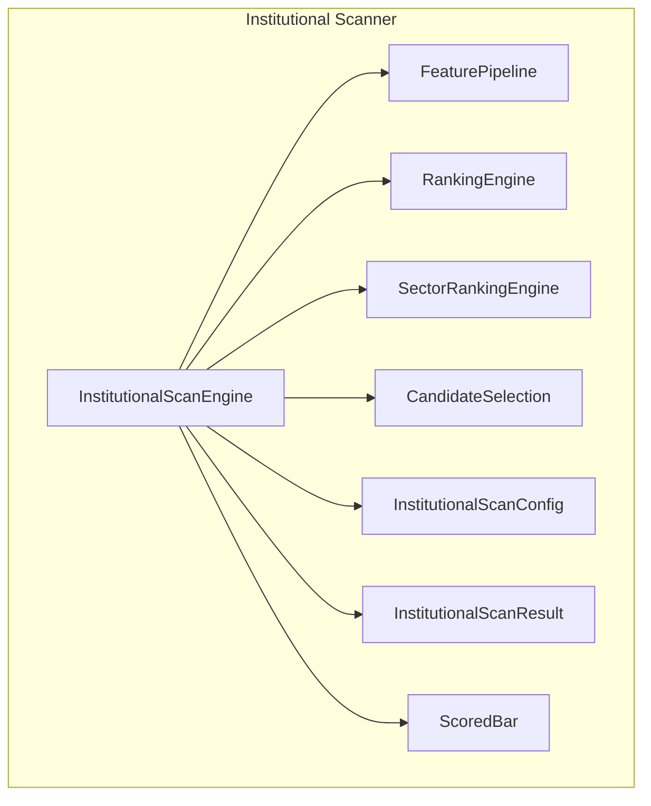
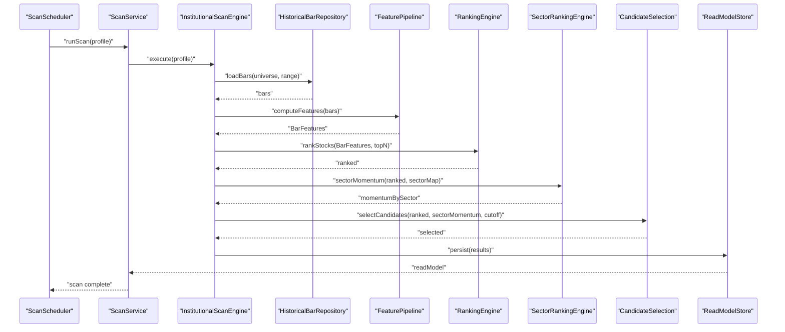
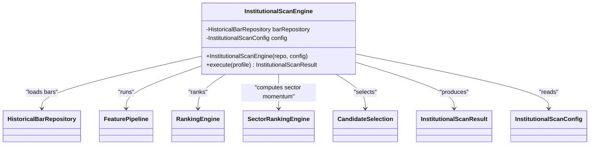
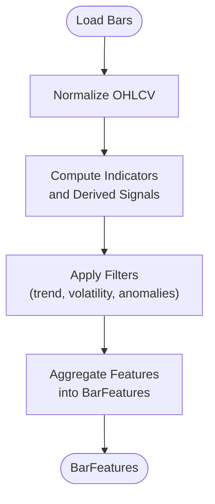
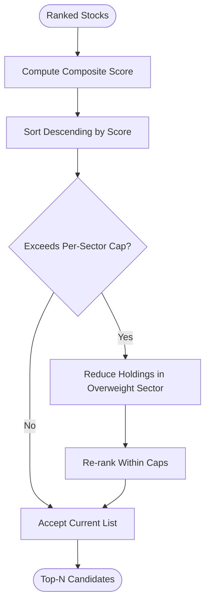
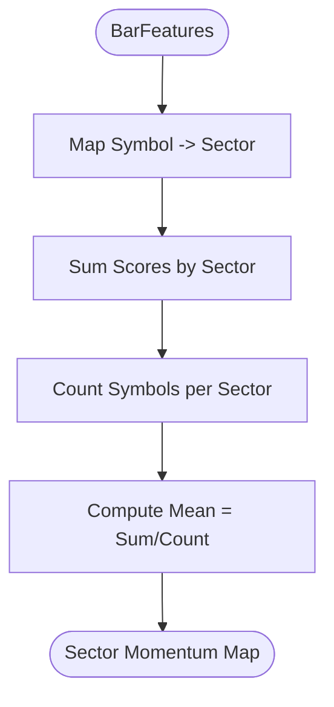
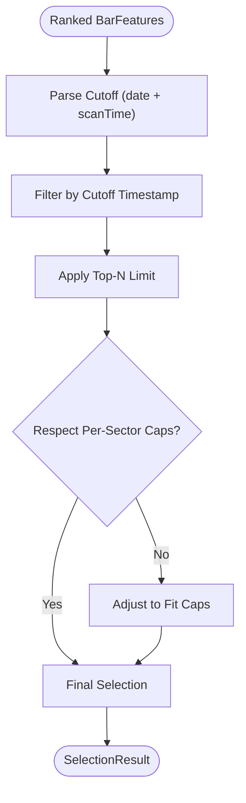
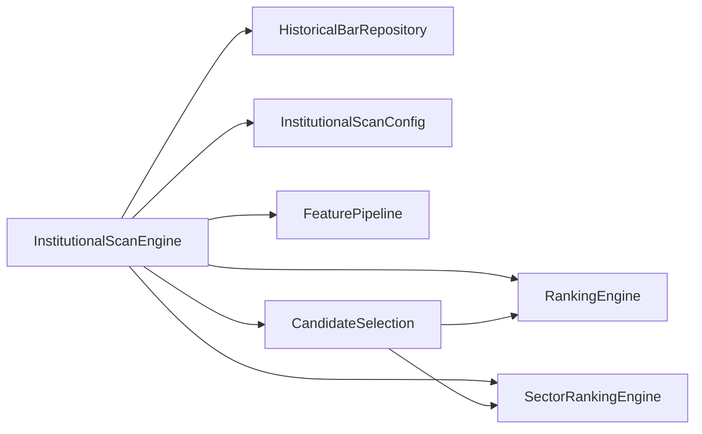

# Institutional Scanner

<cite>
**Referenced Files in This Document**
- [InstitutionalScanEngine.java](file://trading/institutional-scanner/src/main/java/com/tradej/institutional/InstitutionalScanEngine.java)
- [FeaturePipeline.java](file://trading/institutional-scanner/src/main/java/com/tradej/institutional/features/FeaturePipeline.java)
- [RankingEngine.java](file://trading/institutional-scanner/src/main/java/com/tradej/institutional/ranking/RankingEngine.java)
- [SectorRankingEngine.java](file://trading/institutional-scanner/src/main/java/com/tradej/institutional/sector/SectorRankingEngine.java)
- [CandidateSelection.java](file://trading/institutional-scanner/src/main/java/com/tradej/institutional/selection/CandidateSelection.java)
- [InstitutionalScanConfig.java](file://trading/institutional-scanner/src/main/java/com/tradej/institutional/model/InstitutionalScanConfig.java)
- [InstitutionalScanResult.java](file://trading/institutional-scanner/src/main/java/com/tradej/institutional/model/InstitutionalScanResult.java)
- [ScoredBar.java](file://trading/institutional-scanner/src/main/java/com/tradej/institutional/model/ScoredBar.java)
- [ARCHITECTURE_REPORT.md](file://docs/ARCHITECTURE_REPORT.md)
- [InstitutionalScanIntegrationTest.java](file://app/src/test/java/com/tradej/app/integration/InstitutionalScanIntegrationTest.java)
- [ScanServiceInstitutionalComponentTest.java](file://app/src/test/java/com/tradej/app/scanner/ScanServiceInstitutionalComponentTest.java)
- [InstitutionalScanEngineIntegrationTest.java](file://trading/institutional-scanner/src/test/java/com/tradej/institutional/InstitutionalScanEngineIntegrationTest.java)
</cite>

## Table of Contents
1. [Introduction](#introduction)
2. [Project Structure](#project-structure)
3. [Core Components](#core-components)
4. [Architecture Overview](#architecture-overview)
5. [Detailed Component Analysis](#detailed-component-analysis)
6. [Dependency Analysis](#dependency-analysis)
7. [Performance Considerations](#performance-considerations)
8. [Troubleshooting Guide](#troubleshooting-guide)
9. [Conclusion](#conclusion)
10. [Appendices](#appendices)

## Introduction
This document describes the Institutional Scanner system: a pipeline that identifies institutional flow candidates across a large equity universe by extracting features from price action, ranking stocks by strength, and selecting top candidates subject to sector diversification constraints. It covers the scan engine architecture, feature extraction pipeline, ranking algorithms, sector ranking methodologies, candidate selection criteria, configuration system, result scoring, and integration points with market data feeds. It also outlines real-time scanning capabilities, performance optimization strategies for large universes, and practical examples of institutional scanning strategies and workflows.

## Project Structure
The Institutional Scanner resides under the trading module and is organized by functional domains:
- Engine: orchestrates scanning, feature extraction, ranking, and selection
- Features: computes bar-level features from OHLCV and derived signals
- Ranking: applies stock-level scoring and sorting
- Sector: computes sector-level momentum for diversification
- Selection: enforces top-N and per-sector limits with cutoff-time filtering
- Model: typed configuration, results, and scored bars

**Diagram sources**
- [InstitutionalScanEngine.java:1-36](file://trading/institutional-scanner/src/main/java/com/tradej/institutional/InstitutionalScanEngine.java#L1-L36)
- [FeaturePipeline.java](file://trading/institutional-scanner/src/main/java/com/tradej/institutional/features/FeaturePipeline.java)
- [RankingEngine.java](file://trading/institutional-scanner/src/main/java/com/tradej/institutional/ranking/RankingEngine.java)
- [SectorRankingEngine.java:1-31](file://trading/institutional-scanner/src/main/java/com/tradej/institutional/sector/SectorRankingEngine.java#L1-L31)
- [CandidateSelection.java:1-35](file://trading/institutional-scanner/src/main/java/com/tradej/institutional/selection/CandidateSelection.java#L1-L35)
- [InstitutionalScanConfig.java](file://trading/institutional-scanner/src/main/java/com/tradej/institutional/model/InstitutionalScanConfig.java)
- [InstitutionalScanResult.java](file://trading/institutional-scanner/src/main/java/com/tradej/institutional/model/InstitutionalScanResult.java)
- [ScoredBar.java](file://trading/institutional-scanner/src/main/java/com/tradej/institutional/model/ScoredBar.java)

**Section sources**
- [InstitutionalScanEngine.java:1-36](file://trading/institutional-scanner/src/main/java/com/tradej/institutional/InstitutionalScanEngine.java#L1-L36)
- [ARCHITECTURE_REPORT.md:1249-1261](file://docs/ARCHITECTURE_REPORT.md#L1249-L1261)

## Core Components
- InstitutionalScanEngine: central orchestrator that loads historical bars, runs feature extraction, applies ranking, and performs candidate selection. It integrates with a HistoricalBarRepository and respects InstitutionalScanConfig.
- FeaturePipeline: computes bar-level features from OHLCV and derived signals (e.g., opening drive, volatility, trend filters).
- RankingEngine: ranks stocks by composite scores and enforces per-sector caps during selection.
- SectorRankingEngine: aggregates individual stock scores by sector to derive sector momentum for diversification.
- CandidateSelection: selects top-N candidates respecting cutoff timestamps and per-sector limits.
- Models: InstitutionalScanConfig defines scan parameters; InstitutionalScanResult and ScoredBar represent outputs.

**Section sources**
- [InstitutionalScanEngine.java:1-36](file://trading/institutional-scanner/src/main/java/com/tradej/institutional/InstitutionalScanEngine.java#L1-L36)
- [FeaturePipeline.java](file://trading/institutional-scanner/src/main/java/com/tradej/institutional/features/FeaturePipeline.java)
- [RankingEngine.java](file://trading/institutional-scanner/src/main/java/com/tradej/institutional/ranking/RankingEngine.java)
- [SectorRankingEngine.java:1-31](file://trading/institutional-scanner/src/main/java/com/tradej/institutional/sector/SectorRankingEngine.java#L1-L31)
- [CandidateSelection.java:1-35](file://trading/institutional-scanner/src/main/java/com/tradej/institutional/selection/CandidateSelection.java#L1-L35)
- [InstitutionalScanConfig.java](file://trading/institutional-scanner/src/main/java/com/tradej/institutional/model/InstitutionalScanConfig.java)
- [InstitutionalScanResult.java](file://trading/institutional-scanner/src/main/java/com/tradej/institutional/model/InstitutionalScanResult.java)
- [ScoredBar.java](file://trading/institutional-scanner/src/main/java/com/tradej/institutional/model/ScoredBar.java)

## Architecture Overview
The Institutional Scanner follows a staged pipeline: load bars, extract features, rank stocks, compute sector momentum, select candidates, and persist/read results.

**Diagram sources**
- [ARCHITECTURE_REPORT.md:1249-1261](file://docs/ARCHITECTURE_REPORT.md#L1249-L1261)
- [InstitutionalScanEngine.java:1-36](file://trading/institutional-scanner/src/main/java/com/tradej/institutional/InstitutionalScanEngine.java#L1-L36)
- [FeaturePipeline.java](file://trading/institutional-scanner/src/main/java/com/tradej/institutional/features/FeaturePipeline.java)
- [RankingEngine.java](file://trading/institutional-scanner/src/main/java/com/tradej/institutional/ranking/RankingEngine.java)
- [SectorRankingEngine.java:1-31](file://trading/institutional-scanner/src/main/java/com/tradej/institutional/sector/SectorRankingEngine.java#L1-L31)
- [CandidateSelection.java:1-35](file://trading/institutional-scanner/src/main/java/com/tradej/institutional/selection/CandidateSelection.java#L1-L35)

## Detailed Component Analysis

### InstitutionalScanEngine
Responsibilities:
- Load historical bars for the target universe
- Drive feature extraction pipeline
- Apply ranking and sector momentum computation
- Perform candidate selection with cutoff and per-sector constraints
- Produce InstitutionalScanResult for downstream consumption

Key behaviors:
- Accepts a HistoricalBarRepository and InstitutionalScanConfig
- Orchestrates the end-to-end scan lifecycle
- Streams BarFeatures to ranking and selection stages

**Diagram sources**
- [InstitutionalScanEngine.java:1-36](file://trading/institutional-scanner/src/main/java/com/tradej/institutional/InstitutionalScanEngine.java#L1-L36)

**Section sources**
- [InstitutionalScanEngine.java:1-36](file://trading/institutional-scanner/src/main/java/com/tradej/institutional/InstitutionalScanEngine.java#L1-L36)

### FeaturePipeline
Responsibilities:
- Compute bar-level features from OHLCV series
- Derive signals such as opening drive strength, volatility filters, trend confirmations, and anomaly detectors
- Output structured BarFeatures consumable by ranking engines

Processing logic:
- Iterates over bars per symbol
- Applies indicator computations and signal filters
- Aggregates features into a normalized form

**Diagram sources**
- [FeaturePipeline.java](file://trading/institutional-scanner/src/main/java/com/tradej/institutional/features/FeaturePipeline.java)

**Section sources**
- [FeaturePipeline.java](file://trading/institutional-scanner/src/main/java/com/tradej/institutional/features/FeaturePipeline.java)

### RankingEngine
Responsibilities:
- Rank stocks by composite score derived from BarFeatures
- Enforce per-sector caps during selection to avoid concentration risk
- Support top-N selection constrained by sector weights

Processing logic:
- Accepts BarFeatures and top-N limit
- Computes per-stock score (e.g., weighted combination of opening drive, momentum, and filters)
- Sorts by descending score and truncates to top-N
- Respects per-sector maximums when building final list

**Diagram sources**
- [RankingEngine.java](file://trading/institutional-scanner/src/main/java/com/tradej/institutional/ranking/RankingEngine.java)
- [CandidateSelection.java:1-35](file://trading/institutional-scanner/src/main/java/com/tradej/institutional/selection/CandidateSelection.java#L1-L35)

**Section sources**
- [RankingEngine.java](file://trading/institutional-scanner/src/main/java/com/tradej/institutional/ranking/RankingEngine.java)
- [CandidateSelection.java:1-35](file://trading/institutional-scanner/src/main/java/com/tradej/institutional/selection/CandidateSelection.java#L1-L35)

### SectorRankingEngine
Responsibilities:
- Aggregate individual stock scores by sector
- Compute sector-level momentum as average score per sector
- Provide sector weights for diversification during candidate selection

Processing logic:
- Maps symbols to sectors via industryMap
- Sums opening drive scores per sector and divides by count to get mean
- Returns momentum map keyed by sector

**Diagram sources**
- [SectorRankingEngine.java:1-31](file://trading/institutional-scanner/src/main/java/com/tradej/institutional/sector/SectorRankingEngine.java#L1-L31)

**Section sources**
- [SectorRankingEngine.java:1-31](file://trading/institutional-scanner/src/main/java/com/tradej/institutional/sector/SectorRankingEngine.java#L1-L31)

### CandidateSelection
Responsibilities:
- Parse cutoff timestamp from date and scanTime
- Filter ranked candidates to those observed at or before cutoff
- Enforce top-N and per-sector limits
- Return SelectionResult with selected candidates

Processing logic:
- Uses RankingEngine to produce initial ranked list
- Converts date+time to cutoff Instant
- Selects candidates whose observation time <= cutoff
- Applies per-sector cap and top-N constraints

**Diagram sources**
- [CandidateSelection.java:1-35](file://trading/institutional-scanner/src/main/java/com/tradej/institutional/selection/CandidateSelection.java#L1-L35)

**Section sources**
- [CandidateSelection.java:1-35](file://trading/institutional-scanner/src/main/java/com/tradej/institutional/selection/CandidateSelection.java#L1-L35)

### InstitutionalScanConfig and Results
- InstitutionalScanConfig: defines scan parameters such as universe, time range, feature sets, ranking thresholds, and selection constraints (top-N, per-sector caps).
- InstitutionalScanResult: encapsulates the scan output, including selected candidates and metadata.
- ScoredBar: represents a single symbol’s scored observation with timestamp and attributes.

**Section sources**
- [InstitutionalScanConfig.java](file://trading/institutional-scanner/src/main/java/com/tradej/institutional/model/InstitutionalScanConfig.java)
- [InstitutionalScanResult.java](file://trading/institutional-scanner/src/main/java/com/tradej/institutional/model/InstitutionalScanResult.java)
- [ScoredBar.java](file://trading/institutional-scanner/src/main/java/com/tradej/institutional/model/ScoredBar.java)

## Dependency Analysis
The Institutional Scanner exhibits clean separation of concerns:
- Engine depends on repositories and configuration
- FeaturePipeline is self-contained and stateless
- RankingEngine and SectorRankingEngine operate on normalized BarFeatures
- CandidateSelection composes RankingEngine and sector maps

**Diagram sources**
- [InstitutionalScanEngine.java:1-36](file://trading/institutional-scanner/src/main/java/com/tradej/institutional/InstitutionalScanEngine.java#L1-L36)
- [CandidateSelection.java:1-35](file://trading/institutional-scanner/src/main/java/com/tradej/institutional/selection/CandidateSelection.java#L1-L35)

**Section sources**
- [InstitutionalScanEngine.java:1-36](file://trading/institutional-scanner/src/main/java/com/tradej/institutional/InstitutionalScanEngine.java#L1-L36)
- [CandidateSelection.java:1-35](file://trading/institutional-scanner/src/main/java/com/tradej/institutional/selection/CandidateSelection.java#L1-L35)

## Performance Considerations
- Large universe optimization:
  - Batch loading bars from HistoricalBarRepository to minimize round-trips
  - Stream BarFeatures and apply ranking/selection in-memory to reduce IO overhead
  - Use capped per-sector lists to bound selection cost
- Indicator efficiency:
  - Prefer vectorized or rolling-window computations in FeaturePipeline
  - Cache sector mappings and pre-compute sector counts where feasible
- Memory footprint:
  - Avoid retaining unnecessary intermediate structures after selection
  - Use primitive collections and compact representations for BarFeatures
- Parallelism:
  - Consider parallel feature computation per symbol if the underlying data source supports it
- Real-time scanning:
  - Align scan cadence with market calendar and liquidity windows
  - Persist results to a fast read model for immediate retrieval

[No sources needed since this section provides general guidance]

## Troubleshooting Guide
Common issues and remedies:
- Empty or insufficient candidates:
  - Verify scan cutoff time and date alignment with market hours
  - Adjust top-N and per-sector caps to ensure diversity
- Sector imbalance:
  - Review sectorMap accuracy and update sectorRankingEngine inputs
  - Increase per-sector caps or expand top-N to include underrepresented sectors
- Slow scans:
  - Confirm batch sizes and window lengths in InstitutionalScanConfig
  - Optimize FeaturePipeline computations and reduce redundant recalculations
- Data gaps:
  - Validate HistoricalBarRepository coverage for the target universe
  - Re-run scans for missing dates or adjust date range

**Section sources**
- [InstitutionalScanEngine.java:1-36](file://trading/institutional-scanner/src/main/java/com/tradej/institutional/InstitutionalScanEngine.java#L1-L36)
- [CandidateSelection.java:1-35](file://trading/institutional-scanner/src/main/java/com/tradej/institutional/selection/CandidateSelection.java#L1-L35)

## Conclusion
The Institutional Scanner provides a modular, extensible framework for institutional flow discovery. By separating concerns across feature extraction, ranking, sector aggregation, and selection, it enables robust candidate generation at scale. With proper configuration, performance tuning, and integration with market data feeds, it supports both scheduled and real-time scanning workflows.

[No sources needed since this section summarizes without analyzing specific files]

## Appendices

### Institutional Flow Detection Mechanisms
- Opening drive strength: measures early-day pressure/supply and initial directional bias
- Volatility filters: screens for normalizing range and reducing noise
- Trend filters: confirms intraday momentum alignment with higher timeframe trends
- Anomaly detectors: flags unusual volume or price spikes indicative of institutional participation

**Section sources**
- [FeaturePipeline.java](file://trading/institutional-scanner/src/main/java/com/tradej/institutional/features/FeaturePipeline.java)

### Sector Ranking Methodologies
- Compute sector momentum as average of opening drive scores across constituents
- Use sector counts to normalize and compare across sectors of different sizes
- Apply sector weights to diversify selection and avoid overconcentration

**Section sources**
- [SectorRankingEngine.java:1-31](file://trading/institutional-scanner/src/main/java/com/tradej/institutional/sector/SectorRankingEngine.java#L1-L31)

### Candidate Selection Criteria
- Top-N constraint ensures a manageable list size
- Per-sector caps prevent dominance by a single sector
- Cutoff-time filtering aligns selections with the intended scan time window

**Section sources**
- [CandidateSelection.java:1-35](file://trading/institutional-scanner/src/main/java/com/tradej/institutional/selection/CandidateSelection.java#L1-L35)

### Scan Configuration System
- Universe selection: define symbols or indices to scan
- Time range: set lookback windows and scan intervals
- Feature toggles: enable/disable specific indicators and filters
- Ranking thresholds: minimum score and filter thresholds
- Selection parameters: top-N and per-sector limits

**Section sources**
- [InstitutionalScanConfig.java](file://trading/institutional-scanner/src/main/java/com/tradej/institutional/model/InstitutionalScanConfig.java)

### Result Scoring and Performance Ranking
- Composite score: weighted aggregation of derived signals
- Normalization: z-score or percentile scaling to compare across instruments
- Performance ranking: sort by score and compute rank percentiles for reporting

**Section sources**
- [RankingEngine.java](file://trading/institutional-scanner/src/main/java/com/tradej/institutional/ranking/RankingEngine.java)

### Market Flow Analysis Techniques
- Volume profile analysis: detect accumulation/distribution around key levels
- Order book depth: assess liquidity and potential price impact
- Volume-weighted average price (VWAP): compare price action against fair value
- Institutional order clustering: identify unusual order patterns in depth or time series

[No sources needed since this section provides general guidance]

### Screening Workflows
- Baseline scan: run daily baseline with standard features and ranking
- Sector rotation scan: compute sector momentum and re-rank within leading sectors
- Watchlist scan: focus on predefined symbols with tighter filters
- Rebalancing scan: enforce per-sector caps and rotate out underperformers

[No sources needed since this section provides general guidance]

### Real-Time Scanning and Data Feed Integration
- Align scan schedule with exchange sessions and liquidity peaks
- Subscribe to real-time feeds for recent bars and trigger incremental scans
- Persist results to a read model for low-latency retrieval and dashboard updates

**Section sources**
- [ARCHITECTURE_REPORT.md:1249-1261](file://docs/ARCHITECTURE_REPORT.md#L1249-L1261)

### Examples of Institutional Scanning Strategies
- Momentum + volume: emphasize strong price moves with elevated volume
- Breakout + filter: screen breakouts with trend and volatility filters
- Sector rotation: favor sectors with positive momentum and breadth
- Diversified top-N: ensure representation across sectors while preserving top score

[No sources needed since this section provides general guidance]

### Custom Ranking Criteria Development
- Define feature importance weights for composite scoring
- Add anomaly or regime filters to reduce false positives
- Backtest candidate lists to refine thresholds and improve hit rates

[No sources needed since this section provides general guidance]

### Sector Analysis Workflows
- Compute sector momentum monthly/weekly to inform macro positioning
- Rotate into leaders and out of laggards based on momentum rankings
- Monitor sector correlations to avoid simultaneous weakness across sectors

[No sources needed since this section provides general guidance