# Options Analytics

<cite>
**Referenced Files in This Document**
- [OptionsAnalyticsController.java](file://app/src/main/java/com/tradej/app/api/OptionsAnalyticsController.java)
- [BlackScholesCalculator.java](file://trading/options-analytics/src/main/java/com/tradej/options/calculator/BlackScholesCalculator.java)
- [IVSolver.java](file://trading/options-analytics/src/main/java/com/tradej/options/calculator/IVSolver.java)
- [MaxPainCalculator.java](file://trading/options-analytics/src/main/java/com/tradej/options/calculator/MaxPainCalculator.java)
- [OptionChainRegistry.java](file://trading/options-analytics/src/main/java/com/tradej/options/greeks/OptionChainRegistry.java)
- [OptionsAnalyticsCache.java](file://trading/options-analytics/src/main/java/com/tradej/options/greeks/OptionsAnalyticsCache.java)
- [VolatilitySurfaceBuilder.java](file://trading/options-analytics/src/main/java/com/tradej/options/surface/VolatilitySurfaceBuilder.java)
- [GreeksCalcNode.java](file://trading/options-analytics/src/main/java/com/tradej/options/node/GreeksCalcNode.java)
- [OptionStrikeResolver.java](file://trading/options-analytics/src/main/java/com/tradej/options/service/OptionStrikeResolver.java)
- [DhanOptionChainClient.java](file://broker/dhan/src/main/java/com/tradej/broker/dhan/options/DhanOptionChainClient.java)
- [DhanOptionChainResponseMapper.java](file://broker/dhan/src/main/java/com/tradej/broker/dhan/options/DhanOptionChainResponseMapper.java)
- [StrikeSelectionSupport.java](file://broker/dhan/src/main/java/com/tradej/broker/dhan/options/StrikeSelectionSupport.java)
- [OptionExpiryCache.java](file://broker/dhan/src/main/java/com/tradej/broker/dhan/options/OptionExpiryCache.java)
</cite>

## Table of Contents
1. [Introduction](#introduction)
2. [Project Structure](#project-structure)
3. [Core Components](#core-components)
4. [Architecture Overview](#architecture-overview)
5. [Detailed Component Analysis](#detailed-component-analysis)
6. [Dependency Analysis](#dependency-analysis)
7. [Performance Considerations](#performance-considerations)
8. [Troubleshooting Guide](#troubleshooting-guide)
9. [Conclusion](#conclusion)
10. [Appendices](#appendices)

## Introduction
This document describes the Options Analytics system, focusing on the Black-Scholes calculator, implied volatility solving, max pain computations, Greeks analytics, option chain registry, caching mechanisms, volatility surface construction, strike selection, options pricing models, risk assessments, real-time analytics processing, performance optimization, and market data feed integration. It also provides examples of strategy analysis, Greeks monitoring, and volatility surface visualization.

## Project Structure
The Options Analytics module is organized around calculators, analytics caches, surface builders, and nodes that process option chain data. Market data integration is provided via broker adapters (e.g., Dhan) that supply option chains and supporting utilities for strike selection and expiries.

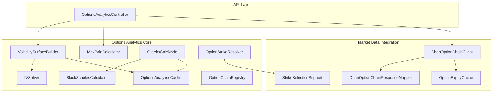

**Diagram sources**
- [OptionsAnalyticsController.java:1-68](file://app/src/main/java/com/tradej/app/api/OptionsAnalyticsController.java#L1-68)
- [BlackScholesCalculator.java:1-40](file://trading/options-analytics/src/main/java/com/tradej/options/calculator/BlackScholesCalculator.java#L1-40)
- [IVSolver.java:1-200](file://trading/options-analytics/src/main/java/com/tradej/options/calculator/IVSolver.java#L1-L200)
- [MaxPainCalculator.java:1-200](file://trading/options-analytics/src/main/java/com/tradej/options/calculator/MaxPainCalculator.java#L1-L200)
- [VolatilitySurfaceBuilder.java:1-200](file://trading/options-analytics/src/main/java/com/tradej/options/surface/VolatilitySurfaceBuilder.java#L1-L200)
- [OptionsAnalyticsCache.java:1-120](file://trading/options-analytics/src/main/java/com/tradej/options/greeks/OptionsAnalyticsCache.java#L1-L120)
- [OptionChainRegistry.java:1-200](file://trading/options-analytics/src/main/java/com/tradej/options/greeks/OptionChainRegistry.java#L1-L200)
- [GreeksCalcNode.java:1-200](file://trading/options-analytics/src/main/java/com/tradej/options/node/GreeksCalcNode.java#L1-L200)
- [OptionStrikeResolver.java:1-200](file://trading/options-analytics/src/main/java/com/tradej/options/service/OptionStrikeResolver.java#L1-L200)
- [DhanOptionChainClient.java:1-200](file://broker/dhan/src/main/java/com/tradej/broker/dhan/options/DhanOptionChainClient.java#L1-L200)
- [DhanOptionChainResponseMapper.java:1-200](file://broker/dhan/src/main/java/com/tradej/broker/dhan/options/DhanOptionChainResponseMapper.java#L1-L200)
- [StrikeSelectionSupport.java:1-200](file://broker/dhan/src/main/java/com/tradej/broker/dhan/options/StrikeSelectionSupport.java#L1-L200)
- [OptionExpiryCache.java:1-200](file://broker/dhan/src/main/java/com/tradej/broker/dhan/options/OptionExpiryCache.java#L1-L200)

**Section sources**
- [OptionsAnalyticsController.java:1-68](file://app/src/main/java/com/tradej/app/api/OptionsAnalyticsController.java#L1-68)
- [VolatilitySurfaceBuilder.java:1-200](file://trading/options-analytics/src/main/java/com/tradej/options/surface/VolatilitySurfaceBuilder.java#L1-L200)

## Core Components
- Black-Scholes Calculator: Computes theoretical price and Greeks (delta, gamma, theta, vega) for European options given spot, strike, time to expiry, volatility, and risk-free rate.
- Implied Volatility Solver: Iteratively solves for IV from market prices using numerical methods.
- Max Pain Calculator: Computes strike level with highest collective open interest extrinsic pain.
- Option Chain Registry: Maintains registry of option instruments and metadata for analytics.
- Analytics Cache: High-performance in-memory cache for Greeks, aggregate gamma exposure, and IV surfaces.
- Volatility Surface Builder: Constructs IV surfaces per expiry/strike grid using solver and cache.
- Greeks Calculation Node: Real-time node that computes Greeks per option chain entry and updates cache.
- Strike Selection Resolver: Resolves strikes and expiries for option chains from market data providers.
- Market Data Clients: Broker adapters (e.g., Dhan) that fetch option chains, map responses, and manage expiries and strikes.

**Section sources**
- [BlackScholesCalculator.java:1-40](file://trading/options-analytics/src/main/java/com/tradej/options/calculator/BlackScholesCalculator.java#L1-L40)
- [IVSolver.java:1-200](file://trading/options-analytics/src/main/java/com/tradej/options/calculator/IVSolver.java#L1-L200)
- [MaxPainCalculator.java:1-200](file://trading/options-analytics/src/main/java/com/tradej/options/calculator/MaxPainCalculator.java#L1-L200)
- [OptionChainRegistry.java:1-200](file://trading/options-analytics/src/main/java/com/tradej/options/greeks/OptionChainRegistry.java#L1-L200)
- [OptionsAnalyticsCache.java:1-120](file://trading/options-analytics/src/main/java/com/tradej/options/greeks/OptionsAnalyticsCache.java#L1-L120)
- [VolatilitySurfaceBuilder.java:1-200](file://trading/options-analytics/src/main/java/com/tradej/options/surface/VolatilitySurfaceBuilder.java#L1-L200)
- [GreeksCalcNode.java:1-200](file://trading/options-analytics/src/main/java/com/tradej/options/node/GreeksCalcNode.java#L1-L200)
- [OptionStrikeResolver.java:1-200](file://trading/options-analytics/src/main/java/com/tradej/options/service/OptionStrikeResolver.java#L1-L200)
- [DhanOptionChainClient.java:1-200](file://broker/dhan/src/main/java/com/tradej/broker/dhan/options/DhanOptionChainClient.java#L1-L200)
- [DhanOptionChainResponseMapper.java:1-200](file://broker/dhan/src/main/java/com/tradej/broker/dhan/options/DhanOptionChainResponseMapper.java#L1-L200)
- [StrikeSelectionSupport.java:1-200](file://broker/dhan/src/main/java/com/tradej/broker/dhan/options/StrikeSelectionSupport.java#L1-L200)
- [OptionExpiryCache.java:1-200](file://broker/dhan/src/main/java/com/tradej/broker/dhan/options/OptionExpiryCache.java#L1-L200)

## Architecture Overview
The system exposes a REST endpoint to compute volatility surfaces and max pain, backed by a market data provider. Internally, Greeks are computed via a dedicated node and cached. The volatility surface builder leverages the cache and IV solver to produce per-strike IV grids.

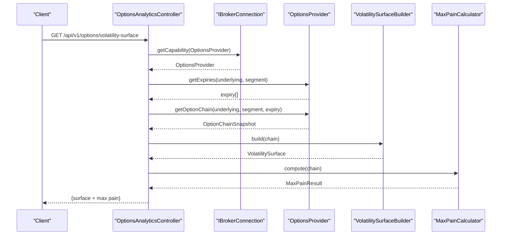

**Diagram sources**
- [OptionsAnalyticsController.java:39-67](file://app/src/main/java/com/tradej/app/api/OptionsAnalyticsController.java#L39-L67)
- [VolatilitySurfaceBuilder.java:1-200](file://trading/options-analytics/src/main/java/com/tradej/options/surface/VolatilitySurfaceBuilder.java#L1-L200)
- [MaxPainCalculator.java:1-200](file://trading/options-analytics/src/main/java/com/tradej/options/calculator/MaxPainCalculator.java#L1-L200)

## Detailed Component Analysis

### Black-Scholes Calculator
Computes theoretical price and Greeks for European options using closed-form formulas. Handles invalid inputs by returning unknown Greeks.

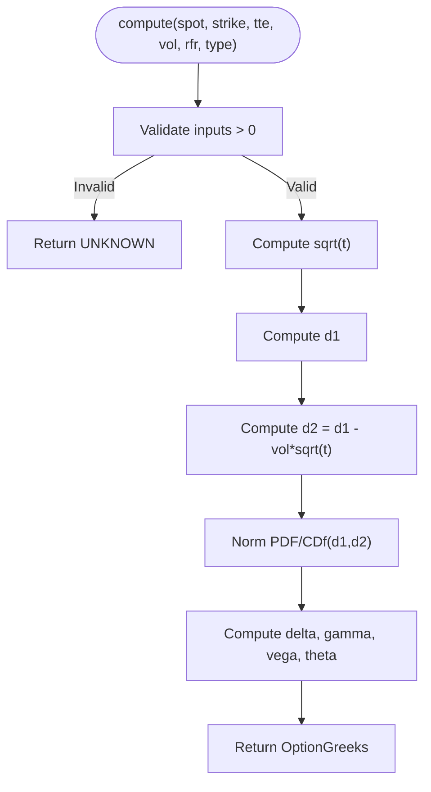

**Diagram sources**
- [BlackScholesCalculator.java:14-40](file://trading/options-analytics/src/main/java/com/tradej/options/calculator/BlackScholesCalculator.java#L14-L40)

**Section sources**
- [BlackScholesCalculator.java:1-40](file://trading/options-analytics/src/main/java/com/tradej/options/calculator/BlackScholesCalculator.java#L1-L40)

### Implied Volatility Solver
Numerically solves for implied volatility given market price, using iterative root-finding methods. Leverages Black-Scholes pricing to compute residuals and converges to IV.

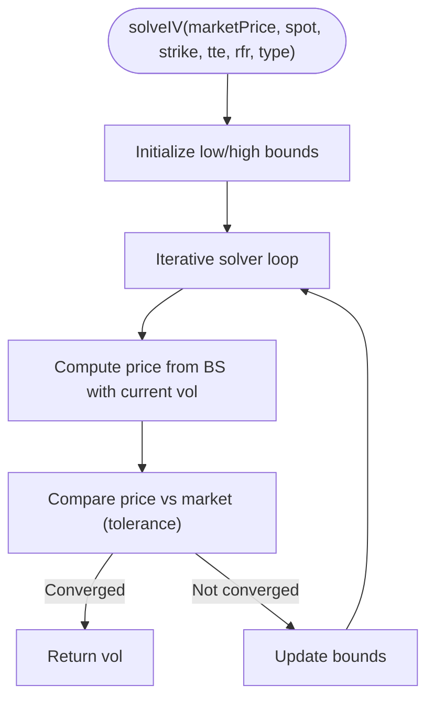

**Diagram sources**
- [IVSolver.java:1-200](file://trading/options-analytics/src/main/java/com/tradej/options/calculator/IVSolver.java#L1-L200)

**Section sources**
- [IVSolver.java:1-200](file://trading/options-analytics/src/main/java/com/tradej/options/calculator/IVSolver.java#L1-L200)

### Max Pain Calculator
Determines the strike with maximum collective extrinsic pain across call and put open interest. Aggregates across strikes to identify the max pain strike and total pain.

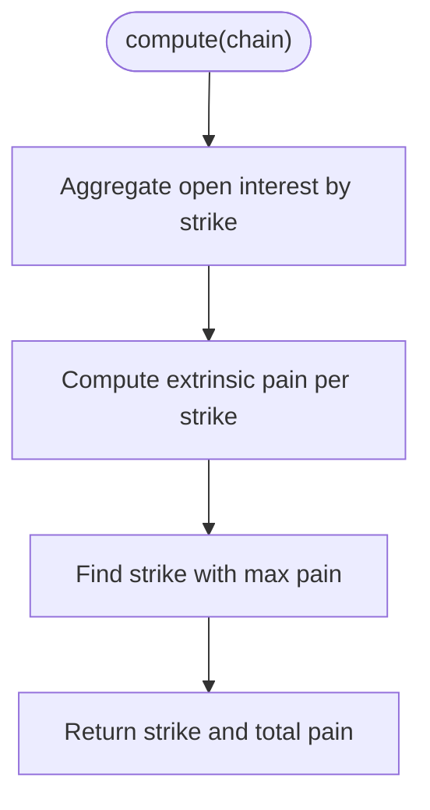

**Diagram sources**
- [MaxPainCalculator.java:1-200](file://trading/options-analytics/src/main/java/com/tradej/options/calculator/MaxPainCalculator.java#L1-L200)

**Section sources**
- [MaxPainCalculator.java:1-200](file://trading/options-analytics/src/main/java/com/tradej/options/calculator/MaxPainCalculator.java#L1-L200)

### Option Chain Registry
Maintains registry of option chain entries and related metadata for downstream analytics. Provides lookup and iteration over options.

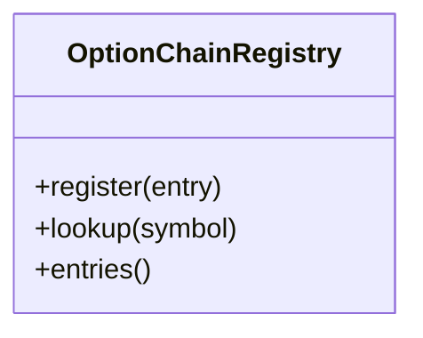

**Diagram sources**
- [OptionChainRegistry.java:1-200](file://trading/options-analytics/src/main/java/com/tradej/options/greeks/OptionChainRegistry.java#L1-L200)

**Section sources**
- [OptionChainRegistry.java:1-200](file://trading/options-analytics/src/main/java/com/tradej/options/greeks/OptionChainRegistry.java#L1-L200)

### Analytics Cache
High-performance in-memory cache for:
- Individual Greeks per option contract key
- Aggregate gamma exposure per portfolio/expiry key
- IV surface per expiry/strike grid

Uses time-based expiration and fixed-size limits for eviction.

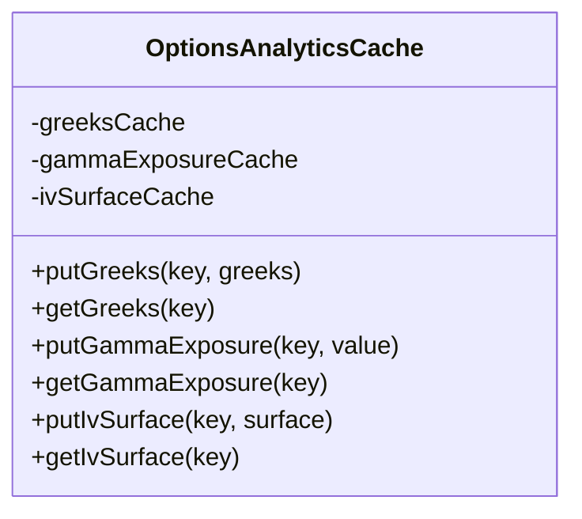

**Diagram sources**
- [OptionsAnalyticsCache.java:1-120](file://trading/options-analytics/src/main/java/com/tradej/options/greeks/OptionsAnalyticsCache.java#L1-L120)

**Section sources**
- [OptionsAnalyticsCache.java:1-120](file://trading/options-analytics/src/main/java/com/tradej/options/greeks/OptionsAnalyticsCache.java#L1-L120)

### Volatility Surface Builder
Constructs a volatility surface from an option chain snapshot:
- Uses IV solver to derive IV per option
- Caches IV surfaces for quick retrieval
- Computes risk-free rate and time-to-expiry conversions

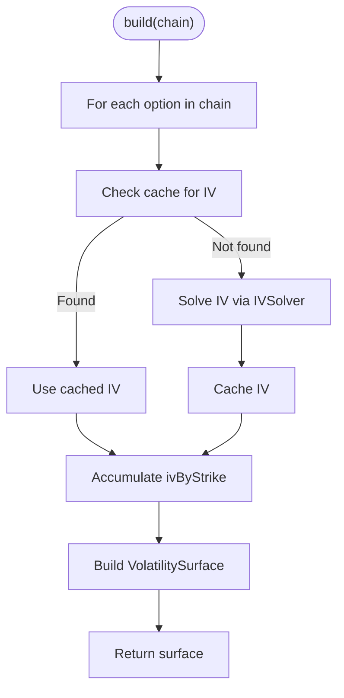

**Diagram sources**
- [VolatilitySurfaceBuilder.java:1-200](file://trading/options-analytics/src/main/java/com/tradej/options/surface/VolatilitySurfaceBuilder.java#L1-L200)
- [IVSolver.java:1-200](file://trading/options-analytics/src/main/java/com/tradej/options/calculator/IVSolver.java#L1-L200)
- [OptionsAnalyticsCache.java:1-120](file://trading/options-analytics/src/main/java/com/tradej/options/greeks/OptionsAnalyticsCache.java#L1-L120)

**Section sources**
- [VolatilitySurfaceBuilder.java:1-200](file://trading/options-analytics/src/main/java/com/tradej/options/surface/VolatilitySurfaceBuilder.java#L1-L200)

### Greeks Calculation Node
Real-time node that:
- Receives option chain snapshots
- Computes Greeks per leg using Black-Scholes
- Updates analytics cache
- Supports streaming updates for dashboards and alerts

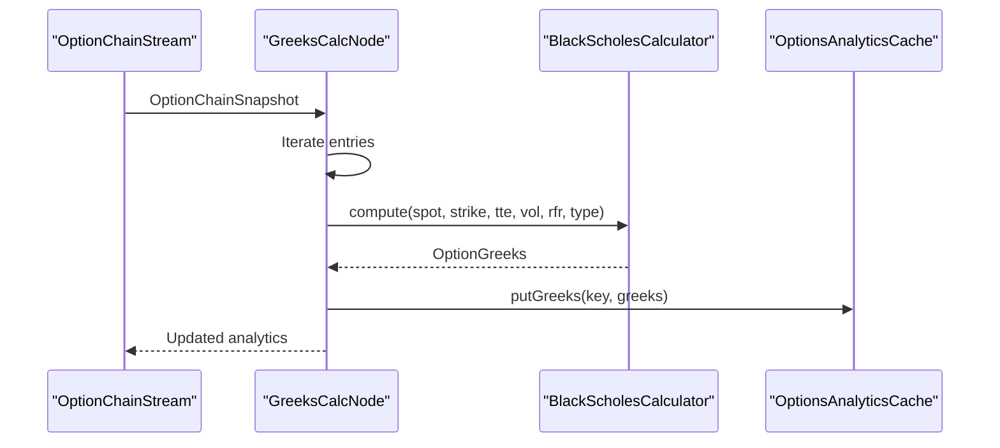

**Diagram sources**
- [GreeksCalcNode.java:1-200](file://trading/options-analytics/src/main/java/com/tradej/options/node/GreeksCalcNode.java#L1-L200)
- [BlackScholesCalculator.java:1-40](file://trading/options-analytics/src/main/java/com/tradej/options/calculator/BlackScholesCalculator.java#L1-L40)
- [OptionsAnalyticsCache.java:1-120](file://trading/options-analytics/src/main/java/com/tradej/options/greeks/OptionsAnalyticsCache.java#L1-L120)

**Section sources**
- [GreeksCalcNode.java:1-200](file://trading/options-analytics/src/main/java/com/tradej/options/node/GreeksCalcNode.java#L1-L200)

### Strike Selection and Market Data Integration
- OptionStrikeResolver orchestrates strike and expiry resolution.
- DhanOptionChainClient fetches option chains from Dhan.
- DhanOptionChainResponseMapper transforms wire responses to internal models.
- StrikeSelectionSupport and OptionExpiryCache assist in selecting appropriate strikes and expiries.

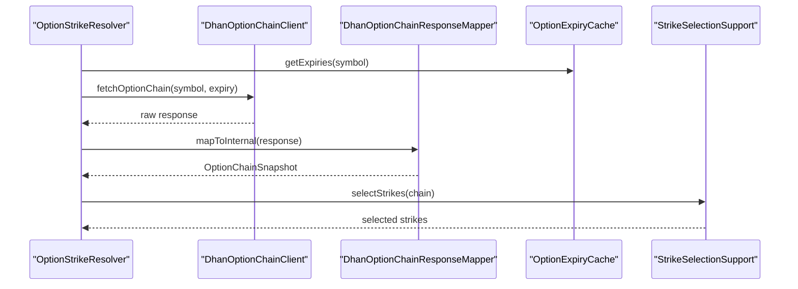

**Diagram sources**
- [OptionStrikeResolver.java:1-200](file://trading/options-analytics/src/main/java/com/tradej/options/service/OptionStrikeResolver.java#L1-L200)
- [DhanOptionChainClient.java:1-200](file://broker/dhan/src/main/java/com/tradej/broker/dhan/options/DhanOptionChainClient.java#L1-L200)
- [DhanOptionChainResponseMapper.java:1-200](file://broker/dhan/src/main/java/com/tradej/broker/dhan/options/DhanOptionChainResponseMapper.java#L1-L200)
- [OptionExpiryCache.java:1-200](file://broker/dhan/src/main/java/com/tradej/broker/dhan/options/OptionExpiryCache.java#L1-L200)
- [StrikeSelectionSupport.java:1-200](file://broker/dhan/src/main/java/com/tradej/broker/dhan/options/StrikeSelectionSupport.java#L1-L200)

**Section sources**
- [OptionStrikeResolver.java:1-200](file://trading/options-analytics/src/main/java/com/tradej/options/service/OptionStrikeResolver.java#L1-L200)
- [DhanOptionChainClient.java:1-200](file://broker/dhan/src/main/java/com/tradej/broker/dhan/options/DhanOptionChainClient.java#L1-L200)
- [DhanOptionChainResponseMapper.java:1-200](file://broker/dhan/src/main/java/com/tradej/broker/dhan/options/DhanOptionChainResponseMapper.java#L1-L200)
- [OptionExpiryCache.java:1-200](file://broker/dhan/src/main/java/com/tradej/broker/dhan/options/OptionExpiryCache.java#L1-L200)
- [StrikeSelectionSupport.java:1-200](file://broker/dhan/src/main/java/com/tradej/broker/dhan/options/StrikeSelectionSupport.java#L1-L200)

## Dependency Analysis
The system exhibits layered dependencies:
- API controller depends on market data provider and surface builder.
- Surface builder depends on IV solver and cache.
- Greeks calculation node depends on Black-Scholes calculator and cache.
- Market data clients depend on mapper and expiry/strike utilities.

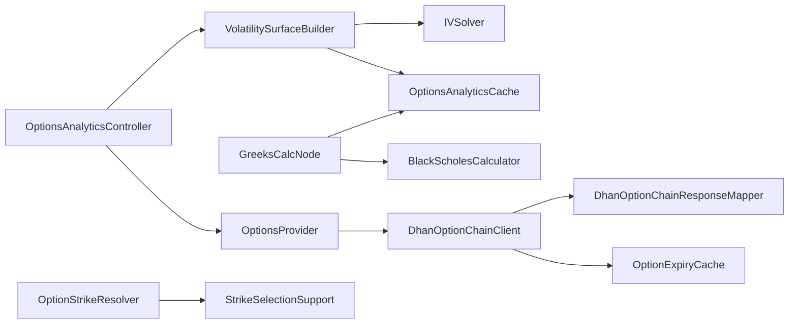

**Diagram sources**
- [OptionsAnalyticsController.java:1-68](file://app/src/main/java/com/tradej/app/api/OptionsAnalyticsController.java#L1-68)
- [VolatilitySurfaceBuilder.java:1-200](file://trading/options-analytics/src/main/java/com/tradej/options/surface/VolatilitySurfaceBuilder.java#L1-L200)
- [IVSolver.java:1-200](file://trading/options-analytics/src/main/java/com/tradej/options/calculator/IVSolver.java#L1-L200)
- [OptionsAnalyticsCache.java:1-120](file://trading/options-analytics/src/main/java/com/tradej/options/greeks/OptionsAnalyticsCache.java#L1-L120)
- [GreeksCalcNode.java:1-200](file://trading/options-analytics/src/main/java/com/tradej/options/node/GreeksCalcNode.java#L1-L200)
- [BlackScholesCalculator.java:1-40](file://trading/options-analytics/src/main/java/com/tradej/options/calculator/BlackScholesCalculator.java#L1-L40)
- [DhanOptionChainClient.java:1-200](file://broker/dhan/src/main/java/com/tradej/broker/dhan/options/DhanOptionChainClient.java#L1-L200)
- [DhanOptionChainResponseMapper.java:1-200](file://broker/dhan/src/main/java/com/tradej/broker/dhan/options/DhanOptionChainResponseMapper.java#L1-L200)
- [OptionExpiryCache.java:1-200](file://broker/dhan/src/main/java/com/tradej/broker/dhan/options/OptionExpiryCache.java#L1-L200)
- [StrikeSelectionSupport.java:1-200](file://broker/dhan/src/main/java/com/tradej/broker/dhan/options/StrikeSelectionSupport.java#L1-L200)
- [OptionStrikeResolver.java:1-200](file://trading/options-analytics/src/main/java/com/tradej/options/service/OptionStrikeResolver.java#L1-L200)

**Section sources**
- [OptionsAnalyticsController.java:1-68](file://app/src/main/java/com/tradej/app/api/OptionsAnalyticsController.java#L1-68)
- [VolatilitySurfaceBuilder.java:1-200](file://trading/options-analytics/src/main/java/com/tradej/options/surface/VolatilitySurfaceBuilder.java#L1-L200)
- [GreeksCalcNode.java:1-200](file://trading/options-analytics/src/main/java/com/tradej/options/node/GreeksCalcNode.java#L1-L200)

## Performance Considerations
- Caching Strategy: Use OptionsAnalyticsCache to avoid recomputation of Greeks and IV surfaces. Configure maximum sizes and TTL to balance freshness and memory footprint.
- Batch Processing: Process option chain snapshots in batches within the GreeksCalcNode to amortize overhead.
- Numerical Stability: Ensure IV solver convergence thresholds and bounds are tuned to reduce iterations.
- Surface Construction: Precompute and cache IV surfaces per expiry; reuse across requests.
- Real-time Streams: Use streaming nodes to update caches incrementally as market data arrives.
- Memory Footprint: Monitor cache hit rates and adjust maximum sizes for Greeks, gamma exposure, and IV surfaces.

[No sources needed since this section provides general guidance]

## Troubleshooting Guide
- Missing Options Provider: The controller returns a 503 error if the provider is unavailable. Verify broker connection capabilities.
- Invalid Inputs: Black-Scholes returns unknown Greeks for invalid parameters (non-positive inputs). Validate spot, strike, time, and volatility.
- Cache Misses: If Greeks or IV surfaces are missing, confirm cache keys and TTL; consider warming caches after startup.
- IV Solver Convergence: If IV solver fails to converge, verify market price inputs and ensure reasonable bounds.
- Max Pain Discrepancies: Confirm open interest aggregation and ensure consistent strike alignment across calls and puts.

**Section sources**
- [OptionsAnalyticsController.java:47-53](file://app/src/main/java/com/tradej/app/api/OptionsAnalyticsController.java#L47-L53)
- [BlackScholesCalculator.java:22-24](file://trading/options-analytics/src/main/java/com/tradej/options/calculator/BlackScholesCalculator.java#L22-L24)
- [OptionsAnalyticsCache.java:1-120](file://trading/options-analytics/src/main/java/com/tradej/options/greeks/OptionsAnalyticsCache.java#L1-L120)
- [IVSolver.java:1-200](file://trading/options-analytics/src/main/java/com/tradej/options/calculator/IVSolver.java#L1-L200)

## Conclusion
The Options Analytics system integrates market data ingestion, real-time Greeks computation, volatility surface construction, and max pain analytics. It leverages caching for performance and provides a REST endpoint for surface and max pain queries. Strike selection and expiry management are supported through broker integrations and resolver utilities.

[No sources needed since this section summarizes without analyzing specific files]

## Appendices

### Example Workflows

- Volatility Surface Visualization
  - Request: GET /api/v1/options/volatility-surface?underlying=NIFTY&segment=NSE_FNO
  - Response includes spot price, IV by strike, and max pain strike/total pain.
  - Use ivByStrikePaisa to render a 2D surface plot with strikes on X-axis and expiries on Y-axis.

- Greeks Monitoring Dashboard
  - Subscribe to GreeksCalcNode updates for a portfolio.
  - Track delta/gamma/vega/thetavariance over time to monitor risk exposure.

- Options Strategy Analysis
  - Build synthetic strategies (e.g., straddles, strangles) by combining Greeks across legs.
  - Monitor net gamma and vega to assess directional and volatility sensitivity.

- Real-time Analytics Processing
  - Stream option chain ticks to GreeksCalcNode.
  - Update OptionsAnalyticsCache and expose via controller endpoints.

[No sources needed since this section provides general guidance]