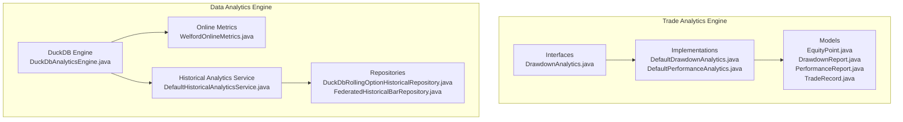
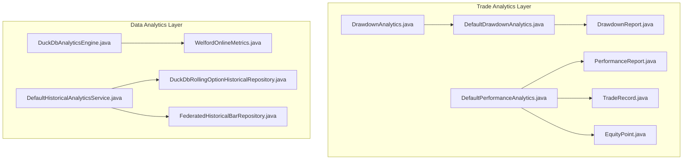
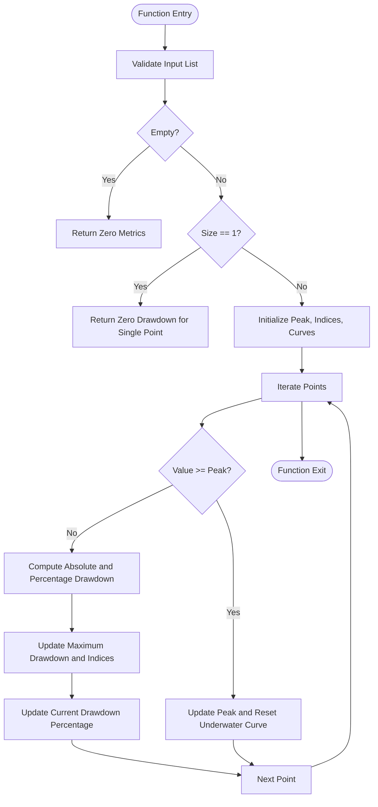
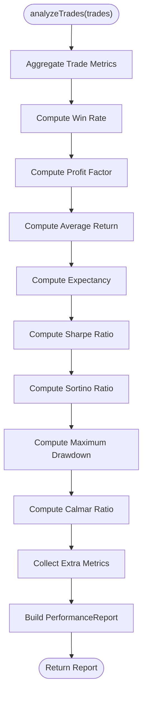
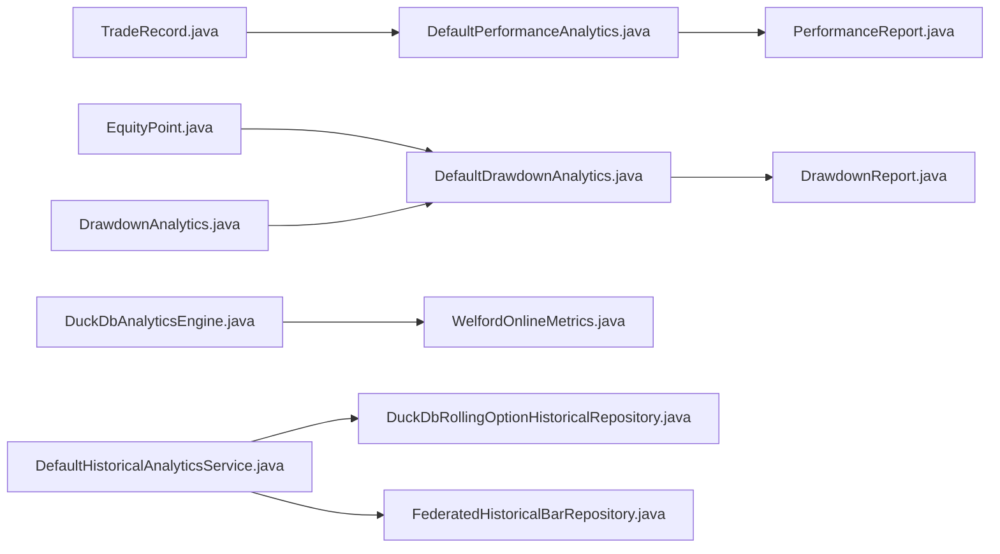

# Performance Analytics

<cite>
**Referenced Files in This Document**
- [package-info.java](file://pipeline/analytics/trade-analytics/src/main/java/com/tradej/analytics/package-info.java)
- [DrawdownAnalytics.java](file://pipeline/analytics/trade-analytics/src/main/java/com/tradej/analytics/DrawdownAnalytics.java)
- [DefaultDrawdownAnalytics.java](file://pipeline/analytics/trade-analytics/src/main/java/com/tradej/analytics/DefaultDrawdownAnalytics.java)
- [DrawdownReport.java](file://pipeline/analytics/trade-analytics/src/main/java/com/tradej/analytics/DrawdownReport.java)
- [EquityPoint.java](file://pipeline/analytics/trade-analytics/src/main/java/com/tradej/analytics/EquityPoint.java)
- [PerformanceReport.java](file://pipeline/analytics/trade-analytics/src/main/java/com/tradej/analytics/PerformanceReport.java)
- [TradeRecord.java](file://pipeline/analytics/trade-analytics/src/main/java/com/tradej/analytics/TradeRecord.java)
- [DefaultPerformanceAnalytics.java](file://pipeline/analytics/trade-analytics/src/main/java/com/tradej/analytics/DefaultPerformanceAnalytics.java)
- [DefaultDrawdownAnalyticsTest.java](file://pipeline/analytics/trade-analytics/src/test/java/com/tradej/analytics/DefaultDrawdownAnalyticsTest.java)
- [DefaultPerformanceAnalyticsTest.java](file://pipeline/analytics/trade-analytics/src/test/java/com/tradej/analytics/DefaultPerformanceAnalyticsTest.java)
- [DuckDbAnalyticsEngine.java](file://data/analytics/src/main/java/com/tradej/analytics/engine/DuckDbAnalyticsEngine.java)
- [WelfordOnlineMetrics.java](file://data/analytics/src/main/java/com/tradej/analytics/engine/WelfordOnlineMetrics.java)
- [DefaultHistoricalAnalyticsService.java](file://data/analytics/src/main/java/com/tradej/analytics/service/DefaultHistoricalAnalyticsService.java)
- [DuckDbRollingOptionHistoricalRepository.java](file://data/analytics/src/main/java/com/tradej/analytics/repository/DuckDbRollingOptionHistoricalRepository.java)
- [FederatedHistoricalBarRepository.java](file://data/analytics/src/main/java/com/tradej/analytics/repository/FederatedHistoricalBarRepository.java)
</cite>

## Table of Contents
1. [Introduction](#introduction)
2. [Project Structure](#project-structure)
3. [Core Components](#core-components)
4. [Architecture Overview](#architecture-overview)
5. [Detailed Component Analysis](#detailed-component-analysis)
6. [Dependency Analysis](#dependency-analysis)
7. [Performance Considerations](#performance-considerations)
8. [Troubleshooting Guide](#troubleshooting-guide)
9. [Conclusion](#conclusion)
10. [Appendices](#appendices)

## Introduction
This document describes the Performance Analytics system within the TradeJ platform. It focuses on performance calculation algorithms, drawdown analysis methods, and equity curve computations. It also explains trade record processing, performance reporting mechanisms, and risk metrics calculation. The system supports drawdown analytics including peak detection, recovery analysis, and maximum loss calculations, along with performance attribution analysis, Sharpe ratio calculations, and risk-adjusted return measurements. Real-time performance tracking, historical performance reconstruction, and comparative analysis capabilities are supported through modular components and extensible interfaces.

## Project Structure
The Performance Analytics system is organized into two primary areas:
- Trade Analytics Engine: Defines interfaces and core analytics models for performance and drawdown analysis.
- Data Analytics Engine: Provides DuckDB-backed implementations and services for historical analytics and rolling metrics.

**Diagram sources**
- [package-info.java:1-19](file://pipeline/analytics/trade-analytics/src/main/java/com/tradej/analytics/package-info.java#L1-L19)
- [DrawdownAnalytics.java:1-7](file://pipeline/analytics/trade-analytics/src/main/java/com/tradej/analytics/DrawdownAnalytics.java#L1-L7)
- [DefaultDrawdownAnalytics.java:1-79](file://pipeline/analytics/trade-analytics/src/main/java/com/tradej/analytics/DefaultDrawdownAnalytics.java#L1-L79)
- [DefaultPerformanceAnalytics.java:1-187](file://pipeline/analytics/trade-analytics/src/main/java/com/tradej/analytics/DefaultPerformanceAnalytics.java#L1-L187)
- [EquityPoint.java:1-200](file://pipeline/analytics/trade-analytics/src/main/java/com/tradej/analytics/EquityPoint.java#L1-L200)
- [DrawdownReport.java:1-13](file://pipeline/analytics/trade-analytics/src/main/java/com/tradej/analytics/DrawdownReport.java#L1-L13)
- [PerformanceReport.java:1-200](file://pipeline/analytics/trade-analytics/src/main/java/com/tradej/analytics/PerformanceReport.java#L1-L200)
- [TradeRecord.java:1-200](file://pipeline/analytics/trade-analytics/src/main/java/com/tradej/analytics/TradeRecord.java#L1-L200)
- [DuckDbAnalyticsEngine.java:1-200](file://data/analytics/src/main/java/com/tradej/analytics/engine/DuckDbAnalyticsEngine.java#L1-L200)
- [WelfordOnlineMetrics.java:1-200](file://data/analytics/src/main/java/com/tradej/analytics/engine/WelfordOnlineMetrics.java#L1-L200)
- [DefaultHistoricalAnalyticsService.java:1-200](file://data/analytics/src/main/java/com/tradej/analytics/service/DefaultHistoricalAnalyticsService.java#L1-L200)
- [DuckDbRollingOptionHistoricalRepository.java:1-200](file://data/analytics/src/main/java/com/tradej/analytics/repository/DuckDbRollingOptionHistoricalRepository.java#L1-L200)
- [FederatedHistoricalBarRepository.java:1-200](file://data/analytics/src/main/java/com/tradej/analytics/repository/FederatedHistoricalBarRepository.java#L1-L200)

**Section sources**
- [package-info.java:1-19](file://pipeline/analytics/trade-analytics/src/main/java/com/tradej/analytics/package-info.java#L1-L19)

## Core Components
- DrawdownAnalytics: Interface defining drawdown analysis over an equity curve.
- DefaultDrawdownAnalytics: Implementation computing drawdown statistics including peak detection, underwater curves, and maximum drawdown duration.
- EquityPoint: Immutable data holder for timestamped equity values forming an equity curve.
- DrawdownReport: Immutable summary containing maximum drawdown percentages, absolute drawdown, current drawdown, underwater curve, and maximum drawdown duration.
- TradeRecord: Domain model representing individual trades with PnL, return percentage, timestamps, and direction.
- PerformanceReport: Comprehensive performance summary including Sharpe ratio, Sortino ratio, Calmar ratio, win rate, profit factor, expectancy, and extra metrics.
- DefaultPerformanceAnalytics: Implementation computing performance metrics from TradeRecord collections, including Sharpe/Sorino ratios, maximum drawdown, and attribution metrics.

**Section sources**
- [DrawdownAnalytics.java:1-7](file://pipeline/analytics/trade-analytics/src/main/java/com/tradej/analytics/DrawdownAnalytics.java#L1-L7)
- [DefaultDrawdownAnalytics.java:1-79](file://pipeline/analytics/trade-analytics/src/main/java/com/tradej/analytics/DefaultDrawdownAnalytics.java#L1-L79)
- [EquityPoint.java:1-200](file://pipeline/analytics/trade-analytics/src/main/java/com/tradej/analytics/EquityPoint.java#L1-L200)
- [DrawdownReport.java:1-13](file://pipeline/analytics/trade-analytics/src/main/java/com/tradej/analytics/DrawdownReport.java#L1-L13)
- [TradeRecord.java:1-200](file://pipeline/analytics/trade-analytics/src/main/java/com/tradej/analytics/TradeRecord.java#L1-L200)
- [PerformanceReport.java:1-200](file://pipeline/analytics/trade-analytics/src/main/java/com/tradej/analytics/PerformanceReport.java#L1-L200)
- [DefaultPerformanceAnalytics.java:1-187](file://pipeline/analytics/trade-analytics/src/main/java/com/tradej/analytics/DefaultPerformanceAnalytics.java#L1-L187)

## Architecture Overview
The system separates concerns between trade analytics interfaces and DuckDB-backed implementations. Trade analytics define the domain models and algorithms, while the data analytics engine provides scalable storage, online metrics computation, and historical services.

**Diagram sources**
- [DrawdownAnalytics.java:1-7](file://pipeline/analytics/trade-analytics/src/main/java/com/tradej/analytics/DrawdownAnalytics.java#L1-L7)
- [DefaultDrawdownAnalytics.java:1-79](file://pipeline/analytics/trade-analytics/src/main/java/com/tradej/analytics/DefaultDrawdownAnalytics.java#L1-L79)
- [DrawdownReport.java:1-13](file://pipeline/analytics/trade-analytics/src/main/java/com/tradej/analytics/DrawdownReport.java#L1-L13)
- [EquityPoint.java:1-200](file://pipeline/analytics/trade-analytics/src/main/java/com/tradej/analytics/EquityPoint.java#L1-L200)
- [TradeRecord.java:1-200](file://pipeline/analytics/trade-analytics/src/main/java/com/tradej/analytics/TradeRecord.java#L1-L200)
- [PerformanceReport.java:1-200](file://pipeline/analytics/trade-analytics/src/main/java/com/tradej/analytics/PerformanceReport.java#L1-L200)
- [DefaultPerformanceAnalytics.java:1-187](file://pipeline/analytics/trade-analytics/src/main/java/com/tradej/analytics/DefaultPerformanceAnalytics.java#L1-L187)
- [DuckDbAnalyticsEngine.java:1-200](file://data/analytics/src/main/java/com/tradej/analytics/engine/DuckDbAnalyticsEngine.java#L1-L200)
- [WelfordOnlineMetrics.java:1-200](file://data/analytics/src/main/java/com/tradej/analytics/engine/WelfordOnlineMetrics.java#L1-L200)
- [DefaultHistoricalAnalyticsService.java:1-200](file://data/analytics/src/main/java/com/tradej/analytics/service/DefaultHistoricalAnalyticsService.java#L1-L200)
- [DuckDbRollingOptionHistoricalRepository.java:1-200](file://data/analytics/src/main/java/com/tradej/analytics/repository/DuckDbRollingOptionHistoricalRepository.java#L1-L200)
- [FederatedHistoricalBarRepository.java:1-200](file://data/analytics/src/main/java/com/tradej/analytics/repository/FederatedHistoricalBarRepository.java#L1-L200)

## Detailed Component Analysis

### Drawdown Analytics
Drawdown analysis computes the maximum drawdown percentage and absolute drawdown, tracks the underwater equity curve during drawdown periods, and measures the maximum drawdown duration. The algorithm maintains a running peak and detects drawdowns by comparing current equity to the peak.

**Diagram sources**
- [DefaultDrawdownAnalytics.java:16-79](file://pipeline/analytics/trade-analytics/src/main/java/com/tradej/analytics/DefaultDrawdownAnalytics.java#L16-L79)

Key behaviors validated by unit tests:
- Empty equity curve returns zero metrics and empty underwater curve.
- Single-point curve returns zero drawdown metrics.
- Monotonically increasing curve yields zero drawdown.
- Declining curve produces negative drawdown metrics.

**Section sources**
- [DefaultDrawdownAnalytics.java:1-79](file://pipeline/analytics/trade-analytics/src/main/java/com/tradej/analytics/DefaultDrawdownAnalytics.java#L1-L79)
- [DrawdownReport.java:1-13](file://pipeline/analytics/trade-analytics/src/main/java/com/tradej/analytics/DrawdownReport.java#L1-L13)
- [DefaultDrawdownAnalyticsTest.java:1-87](file://pipeline/analytics/trade-analytics/src/test/java/com/tradej/analytics/DefaultDrawdownAnalyticsTest.java#L1-L87)

### Performance Analytics
Performance analytics compute Sharpe ratio, Sortino ratio, Calmar ratio, win rate, profit factor, expectancy, and additional metrics from TradeRecord collections. The implementation aggregates returns, calculates means and variances, and applies risk-adjusted formulas.

**Diagram sources**
- [DefaultPerformanceAnalytics.java:35-187](file://pipeline/analytics/trade-analytics/src/main/java/com/tradej/analytics/DefaultPerformanceAnalytics.java#L35-L187)

Sharpe ratio calculation:
- Mean return computed from trade returns.
- Variance calculated across returns.
- Standard deviation derived; Sharpe = mean × sqrt(252) / stdDev.

Sortino ratio calculation:
- Downside variance computed only from negative returns.
- Downside deviation derived; Sortino = mean × sqrt(252) / downsideDev.

Maximum drawdown calculation:
- Cumulative returns computed from return percentages.
- Running peak maintained; drawdown tracked as peak − cumulative.
- Max drawdown expressed as percentage of peak.

**Section sources**
- [DefaultPerformanceAnalytics.java:35-187](file://pipeline/analytics/trade-analytics/src/main/java/com/tradej/analytics/DefaultPerformanceAnalytics.java#L35-L187)
- [DefaultPerformanceAnalyticsTest.java:94-110](file://pipeline/analytics/trade-analytics/src/test/java/com/tradej/analytics/DefaultPerformanceAnalyticsTest.java#L94-L110)

### Equity Curve Computations
EquityPoint represents timestamped equity values forming an equity curve. The drawdown analytics consume lists of EquityPoint to compute underwater curves and drawdown durations. EquityPoint supports construction with timestamp and equity value.

**Section sources**
- [EquityPoint.java:1-200](file://pipeline/analytics/trade-analytics/src/main/java/com/tradej/analytics/EquityPoint.java#L1-L200)
- [DefaultDrawdownAnalytics.java:16-79](file://pipeline/analytics/trade-analytics/src/main/java/com/tradej/analytics/DefaultDrawdownAnalytics.java#L16-L79)

### Trade Record Processing
TradeRecord encapsulates per-trade data including entry/exit prices, quantities, PnL, return percentage, timestamps, and direction. Performance analytics iterate over TradeRecord instances to derive returns, win rates, profit factors, and other metrics.

**Section sources**
- [TradeRecord.java:1-200](file://pipeline/analytics/trade-analytics/src/main/java/com/tradej/analytics/TradeRecord.java#L1-L200)
- [DefaultPerformanceAnalytics.java:35-113](file://pipeline/analytics/trade-analytics/src/main/java/com/tradej/analytics/DefaultPerformanceAnalytics.java#L35-L113)

### Performance Reporting Mechanisms
PerformanceReport consolidates all computed metrics into a single immutable report object. It includes identifiers, counts, totals, ratios, rates, factors, expectancy, extra metrics, and timestamp. This enables standardized reporting and downstream consumption.

**Section sources**
- [PerformanceReport.java:1-200](file://pipeline/analytics/trade-analytics/src/main/java/com/tradej/analytics/PerformanceReport.java#L1-L200)

### Data Analytics Engine Integration
The data analytics engine provides:
- DuckDbAnalyticsEngine: Orchestrates DuckDB-backed analytics computations.
- WelfordOnlineMetrics: Efficient online variance and mean computation suitable for streaming metrics.
- DefaultHistoricalAnalyticsService: Service layer for historical analytics operations.
- Repositories: DuckDbRollingOptionHistoricalRepository and FederatedHistoricalBarRepository for data access and federation.

These components enable scalable historical performance reconstruction and real-time analytics.

**Section sources**
- [DuckDbAnalyticsEngine.java:1-200](file://data/analytics/src/main/java/com/tradej/analytics/engine/DuckDbAnalyticsEngine.java#L1-L200)
- [WelfordOnlineMetrics.java:1-200](file://data/analytics/src/main/java/com/tradej/analytics/engine/WelfordOnlineMetrics.java#L1-L200)
- [DefaultHistoricalAnalyticsService.java:1-200](file://data/analytics/src/main/java/com/tradej/analytics/service/DefaultHistoricalAnalyticsService.java#L1-L200)
- [DuckDbRollingOptionHistoricalRepository.java:1-200](file://data/analytics/src/main/java/com/tradej/analytics/repository/DuckDbRollingOptionHistoricalRepository.java#L1-L200)
- [FederatedHistoricalBarRepository.java:1-200](file://data/analytics/src/main/java/com/tradej/analytics/repository/FederatedHistoricalBarRepository.java#L1-L200)

## Dependency Analysis
The trade analytics layer depends on domain models (TradeRecord, EquityPoint) and interfaces (DrawdownAnalytics). The data analytics layer provides the infrastructure for storage, metrics, and historical services. There is a clean separation of concerns with DuckDB-backed implementations intended to complement the trade analytics interfaces.

**Diagram sources**
- [TradeRecord.java:1-200](file://pipeline/analytics/trade-analytics/src/main/java/com/tradej/analytics/TradeRecord.java#L1-L200)
- [EquityPoint.java:1-200](file://pipeline/analytics/trade-analytics/src/main/java/com/tradej/analytics/EquityPoint.java#L1-L200)
- [DrawdownAnalytics.java:1-7](file://pipeline/analytics/trade-analytics/src/main/java/com/tradej/analytics/DrawdownAnalytics.java#L1-L7)
- [DefaultDrawdownAnalytics.java:1-79](file://pipeline/analytics/trade-analytics/src/main/java/com/tradej/analytics/DefaultDrawdownAnalytics.java#L1-L79)
- [DrawdownReport.java:1-13](file://pipeline/analytics/trade-analytics/src/main/java/com/tradej/analytics/DrawdownReport.java#L1-L13)
- [DefaultPerformanceAnalytics.java:1-187](file://pipeline/analytics/trade-analytics/src/main/java/com/tradej/analytics/DefaultPerformanceAnalytics.java#L1-L187)
- [PerformanceReport.java:1-200](file://pipeline/analytics/trade-analytics/src/main/java/com/tradej/analytics/PerformanceReport.java#L1-L200)
- [DuckDbAnalyticsEngine.java:1-200](file://data/analytics/src/main/java/com/tradej/analytics/engine/DuckDbAnalyticsEngine.java#L1-L200)
- [WelfordOnlineMetrics.java:1-200](file://data/analytics/src/main/java/com/tradej/analytics/engine/WelfordOnlineMetrics.java#L1-L200)
- [DefaultHistoricalAnalyticsService.java:1-200](file://data/analytics/src/main/java/com/tradej/analytics/service/DefaultHistoricalAnalyticsService.java#L1-L200)
- [DuckDbRollingOptionHistoricalRepository.java:1-200](file://data/analytics/src/main/java/com/tradej/analytics/repository/DuckDbRollingOptionHistoricalRepository.java#L1-L200)
- [FederatedHistoricalBarRepository.java:1-200](file://data/analytics/src/main/java/com/tradej/analytics/repository/FederatedHistoricalBarRepository.java#L1-L200)

**Section sources**
- [package-info.java:1-19](file://pipeline/analytics/trade-analytics/src/main/java/com/tradej/analytics/package-info.java#L1-L19)

## Performance Considerations
- Complexity: Drawdown analytics operate in linear time relative to the number of equity points. Performance analytics iterate over trade records once, with arithmetic complexity proportional to the number of trades.
- Numerical Precision: Uses BigDecimal with MathContext for consistent precision across calculations.
- Online Metrics: WelfordOnlineMetrics supports efficient incremental variance computation for streaming data.
- Scalability: DuckDB-backed implementations enable large-scale historical analytics and rolling computations.

[No sources needed since this section provides general guidance]

## Troubleshooting Guide
Common issues and resolutions:
- Empty or single-point equity curves: Expected to produce zero drawdown metrics; verify input data integrity.
- Monotonic equity curves: Should yield zero drawdown; confirm equity values are strictly increasing.
- Declining curves: Ensure drawdown percentages and absolute values are negative as expected.
- Sharpe/Sortino ratios: Zero standard deviations or downside deviations return zero or extreme values; validate return distributions.
- Performance report generation: Confirm TradeRecord completeness (timestamps, PnL, returns) to avoid missing metrics.

Validation references:
- Drawdown analytics unit tests covering empty, single-point, monotonic, and declining curves.
- Performance analytics unit tests validating expectancy and profit factor computation.

**Section sources**
- [DefaultDrawdownAnalyticsTest.java:1-87](file://pipeline/analytics/trade-analytics/src/test/java/com/tradej/analytics/DefaultDrawdownAnalyticsTest.java#L1-L87)
- [DefaultPerformanceAnalyticsTest.java:94-110](file://pipeline/analytics/trade-analytics/src/test/java/com/tradej/analytics/DefaultPerformanceAnalyticsTest.java#L94-L110)

## Conclusion
The Performance Analytics system provides a robust foundation for trade performance measurement, drawdown analysis, and equity curve computations. Its modular design separates domain logic from data infrastructure, enabling scalable historical analytics and real-time performance tracking. The included interfaces and implementations offer a clear path for extending custom metrics and integrating with DuckDB-backed storage and services.

[No sources needed since this section summarizes without analyzing specific files]

## Appendices

### Example Workflows
- Performance Report Generation: Build a PerformanceReport from TradeRecord collections using DefaultPerformanceAnalytics.analyzeTrades.
- Custom Metric Development: Extend PerformanceReport with additional metrics via extraMetrics and integrate with DefaultPerformanceAnalytics.
- Strategy Performance Evaluation: Use EquityPoint sequences for drawdown analysis and compare reports across strategies via shared metrics in PerformanceReport.

[No sources needed since this section provides general guidance]