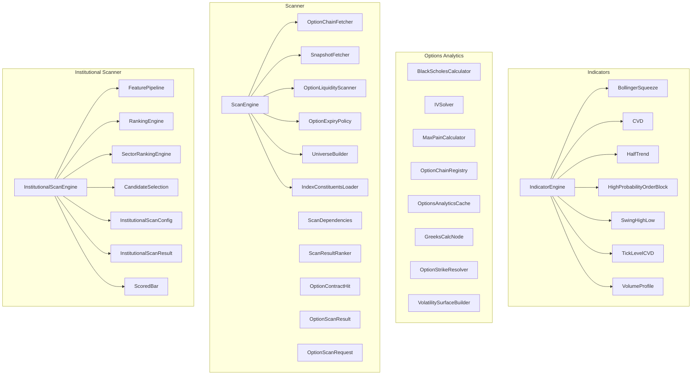
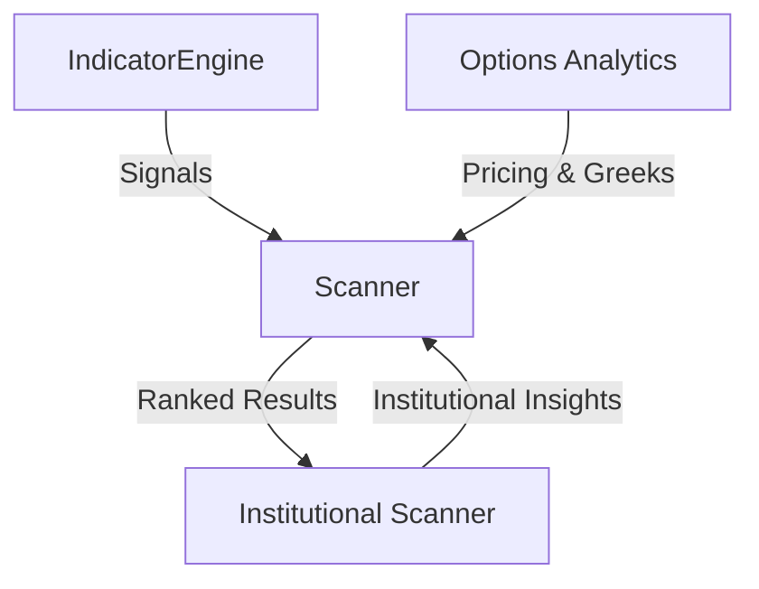
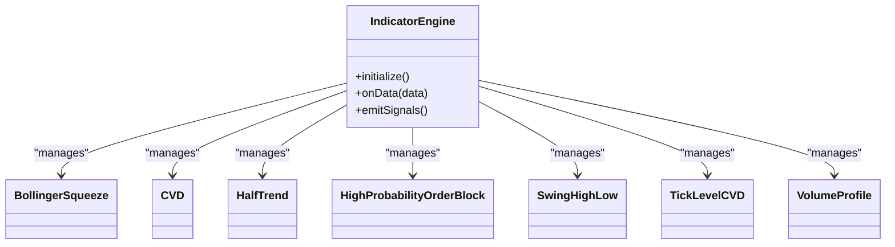
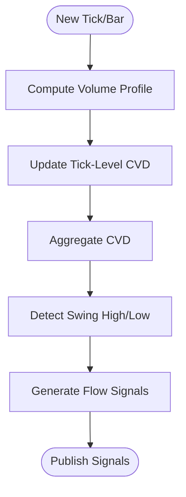
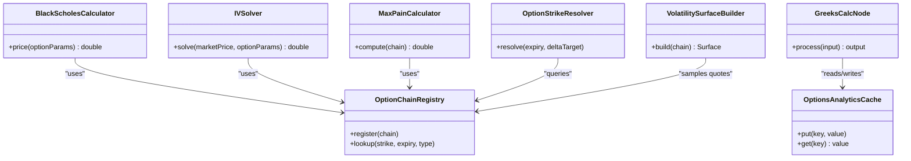
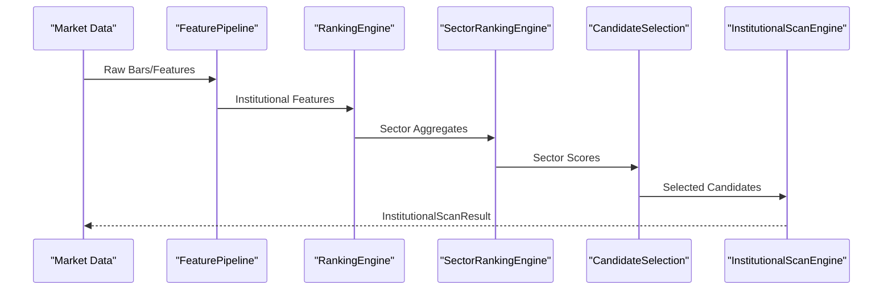
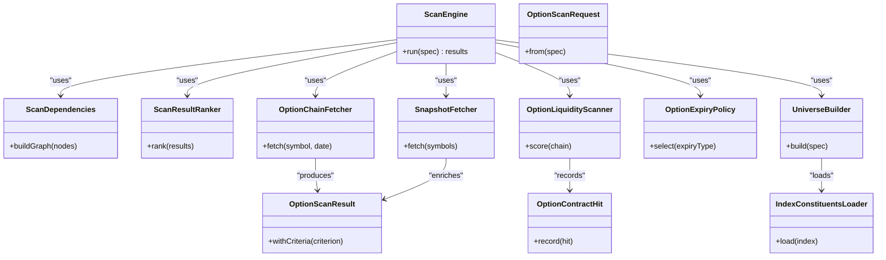
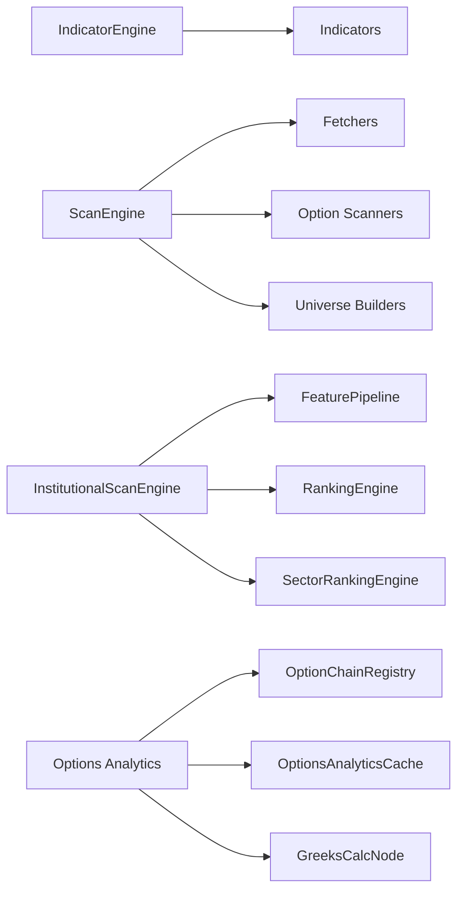

# Technical Analysis Framework

<cite>
**Referenced Files in This Document**
- [IndicatorEngine.java](file://trading/indicators/src/main/java/com/tradej/indicators/IndicatorEngine.java)
- [BollingerSqueeze.java](file://trading/indicators/src/main/java/com/tradej/indicators/BollingerSqueeze.java)
- [CVD.java](file://trading/indicators/src/main/java/com/tradej/indicators/CVD.java)
- [HalfTrend.java](file://trading/indicators/src/main/java/com/tradej/indicators/HalfTrend.java)
- [HighProbabilityOrderBlock.java](file://trading/indicators/src/main/java/com/tradej/indicators/HighProbabilityOrderBlock.java)
- [SwingHighLow.java](file://trading/indicators/src/main/java/com/tradej/indicators/SwingHighLow.java)
- [TickLevelCVD.java](file://trading/indicators/src/main/java/com/tradej/indicators/TickLevelCVD.java)
- [VolumeProfile.java](file://trading/indicators/src/main/java/com/tradej/indicators/VolumeProfile.java)
- [BlackScholesCalculator.java](file://trading/options-analytics/src/main/java/com/tradej/options/calculator/BlackScholesCalculator.java)
- [IVSolver.java](file://trading/options-analytics/src/main/java/com/tradej/options/calculator/IVSolver.java)
- [MaxPainCalculator.java](file://trading/options-analytics/src/main/java/com/tradej/options/calculator/MaxPainCalculator.java)
- [OptionChainRegistry.java](file://trading/options-analytics/src/main/java/com/tradej/options/greeks/OptionChainRegistry.java)
- [OptionsAnalyticsCache.java](file://trading/options-analytics/src/main/java/com/tradej/options/greeks/OptionsAnalyticsCache.java)
- [GreeksCalcNode.java](file://trading/options-analytics/src/main/java/com/tradej/options/node/GreeksCalcNode.java)
- [OptionStrikeResolver.java](file://trading/options-analytics/src/main/java/com/tradej/options/service/OptionStrikeResolver.java)
- [VolatilitySurfaceBuilder.java](file://trading/options-analytics/src/main/java/com/tradej/options/surface/VolatilitySurfaceBuilder.java)
- [ScanEngine.java](file://trading/scanner/src/main/java/com/tradej/scanner/engine/ScanEngine.java)
- [ScanDependencies.java](file://trading/scanner/src/main/java/com/tradej/scanner/engine/ScanDependencies.java)
- [ScanResultRanker.java](file://trading/scanner/src/main/java/com/tradej/scanner/engine/ScanResultRanker.java)
- [OptionChainFetcher.java](file://trading/scanner/src/main/java/com/tradej/scanner/fetch/OptionChainFetcher.java)
- [SnapshotFetcher.java](file://trading/scanner/src/main/java/com/tradej/scanner/fetch/SnapshotFetcher.java)
- [OptionLiquidityScanner.java](file://trading/scanner/src/main/java/com/tradej/scanner/option/OptionLiquidityScanner.java)
- [OptionExpiryPolicy.java](file://trading/scanner/src/main/java/com/tradej/scanner/option/OptionExpiryPolicy.java)
- [OptionContractHit.java](file://trading/scanner/src/main/java/com/tradej/scanner/option/OptionContractHit.java)
- [OptionScanResult.java](file://trading/scanner/src/main/java/com/tradej/scanner/option/OptionScanResult.java)
- [OptionScanRequest.java](file://trading/scanner/src/main/java/com/tradej/scanner/option/OptionScanRequest.java)
- [UniverseBuilder.java](file://trading/scanner/src/main/java/com/tradej/scanner/universe/UniverseBuilder.java)
- [IndexConstituentsLoader.java](file://trading/scanner/src/main/java/com/tradej/scanner/universe/IndexConstituentsLoader.java)
- [InstitutionalScanEngine.java](file://trading/institutional-scanner/src/main/java/com/tradej/institutional/InstitutionalScanEngine.java)
- [FeaturePipeline.java](file://trading/institutional-scanner/src/main/java/com/tradej/institutional/features/FeaturePipeline.java)
- [RankingEngine.java](file://trading/institutional-scanner/src/main/java/com/tradej/institutional/ranking/RankingEngine.java)
- [SectorRankingEngine.java](file://trading/institutional-scanner/src/main/java/com/tradej/institutional/sector/SectorRankingEngine.java)
- [CandidateSelection.java](file://trading/institutional-scanner/src/main/java/com/tradej/institutional/selection/CandidateSelection.java)
- [InstitutionalScanConfig.java](file://trading/institutional-scanner/src/main/java/com/tradej/institutional/model/InstitutionalScanConfig.java)
- [InstitutionalScanResult.java](file://trading/institutional-scanner/src/main/java/com/tradej/institutional/model/InstitutionalScanResult.java)
- [ScoredBar.java](file://trading/institutional-scanner/src/main/java/com/tradej/institutional/model/ScoredBar.java)
</cite>

## Table of Contents
1. [Introduction](#introduction)
2. [Project Structure](#project-structure)
3. [Core Components](#core-components)
4. [Architecture Overview](#architecture-overview)
5. [Detailed Component Analysis](#detailed-component-analysis)
6. [Dependency Analysis](#dependency-analysis)
7. [Performance Considerations](#performance-considerations)
8. [Troubleshooting Guide](#troubleshooting-guide)
9. [Conclusion](#conclusion)
10. [Appendices](#appendices)

## Introduction
This document describes the Technical Analysis Framework within the Trade-J ecosystem. It covers:
- Indicator Engine and technical analysis calculations
- Market flow detection capabilities
- Options analytics including Greeks, volatility surfaces, and strike selection
- Institutional scanner functionality for market flow analysis and screening
- Performance optimization, caching strategies, and real-time analysis capabilities
- Examples of indicator usage, custom indicator development, and analytical report generation

## Project Structure
The framework spans several modules under the trading umbrella:
- Indicators: core technical indicator implementations and the Indicator Engine orchestrator
- Options Analytics: Black-Scholes, implied volatility solver, max pain, Greeks, volatility surfaces, and strike resolution
- Scanner: scan engine, criteria, fetchers, option-specific scanners, and universes
- Institutional Scanner: institutional-level scanning, feature pipelines, ranking, and candidate selection
- Pipeline Platform: runtime and compilation for DAG-based analytics pipelines

**Diagram sources**
- [IndicatorEngine.java:1-200](file://trading/indicators/src/main/java/com/tradej/indicators/IndicatorEngine.java#L1-L200)
- [BollingerSqueeze.java:1-200](file://trading/indicators/src/main/java/com/tradej/indicators/BollingerSqueeze.java#L1-L200)
- [CVD.java:1-200](file://trading/indicators/src/main/java/com/tradej/indicators/CVD.java#L1-L200)
- [HalfTrend.java:1-200](file://trading/indicators/src/main/java/com/tradej/indicators/HalfTrend.java#L1-L200)
- [HighProbabilityOrderBlock.java:1-200](file://trading/indicators/src/main/java/com/tradej/indicators/HighProbabilityOrderBlock.java#L1-L200)
- [SwingHighLow.java:1-200](file://trading/indicators/src/main/java/com/tradej/indicators/SwingHighLow.java#L1-L200)
- [TickLevelCVD.java:1-200](file://trading/indicators/src/main/java/com/tradej/indicators/TickLevelCVD.java#L1-L200)
- [VolumeProfile.java:1-200](file://trading/indicators/src/main/java/com/tradej/indicators/VolumeProfile.java#L1-L200)
- [ScanEngine.java:1-200](file://trading/scanner/src/main/java/com/tradej/scanner/engine/ScanEngine.java#L1-L200)
- [ScanDependencies.java:1-200](file://trading/scanner/src/main/java/com/tradej/scanner/engine/ScanDependencies.java#L1-L200)
- [ScanResultRanker.java:1-200](file://trading/scanner/src/main/java/com/tradej/scanner/engine/ScanResultRanker.java#L1-L200)
- [OptionChainFetcher.java:1-200](file://trading/scanner/src/main/java/com/tradej/scanner/fetch/OptionChainFetcher.java#L1-L200)
- [SnapshotFetcher.java:1-200](file://trading/scanner/src/main/java/com/tradej/scanner/fetch/SnapshotFetcher.java#L1-L200)
- [OptionLiquidityScanner.java:1-200](file://trading/scanner/src/main/java/com/tradej/scanner/option/OptionLiquidityScanner.java#L1-L200)
- [OptionExpiryPolicy.java:1-200](file://trading/scanner/src/main/java/com/tradej/scanner/option/OptionExpiryPolicy.java#L1-L200)
- [OptionContractHit.java:1-200](file://trading/scanner/src/main/java/com/tradej/scanner/option/OptionContractHit.java#L1-L200)
- [OptionScanResult.java:1-200](file://trading/scanner/src/main/java/com/tradej/scanner/option/OptionScanResult.java#L1-L200)
- [OptionScanRequest.java:1-200](file://trading/scanner/src/main/java/com/tradej/scanner/option/OptionScanRequest.java#L1-L200)
- [UniverseBuilder.java:1-200](file://trading/scanner/src/main/java/com/tradej/scanner/universe/UniverseBuilder.java#L1-L200)
- [IndexConstituentsLoader.java:1-200](file://trading/scanner/src/main/java/com/tradej/scanner/universe/IndexConstituentsLoader.java#L1-L200)
- [InstitutionalScanEngine.java:1-200](file://trading/institutional-scanner/src/main/java/com/tradej/institutional/InstitutionalScanEngine.java#L1-L200)
- [FeaturePipeline.java:1-200](file://trading/institutional-scanner/src/main/java/com/tradej/institutional/features/FeaturePipeline.java#L1-L200)
- [RankingEngine.java:1-200](file://trading/institutional-scanner/src/main/java/com/tradej/institutional/ranking/RankingEngine.java#L1-L200)
- [SectorRankingEngine.java:1-200](file://trading/institutional-scanner/src/main/java/com/tradej/institutional/sector/SectorRankingEngine.java#L1-L200)
- [CandidateSelection.java:1-200](file://trading/institutional-scanner/src/main/java/com/tradej/institutional/selection/CandidateSelection.java#L1-L200)
- [InstitutionalScanConfig.java:1-200](file://trading/institutional-scanner/src/main/java/com/tradej/institutional/model/InstitutionalScanConfig.java#L1-L200)
- [InstitutionalScanResult.java:1-200](file://trading/institutional-scanner/src/main/java/com/tradej/institutional/model/InstitutionalScanResult.java#L1-L200)
- [ScoredBar.java:1-200](file://trading/institutional-scanner/src/main/java/com/tradej/institutional/model/ScoredBar.java#L1-L200)

**Section sources**
- [IndicatorEngine.java:1-200](file://trading/indicators/src/main/java/com/tradej/indicators/IndicatorEngine.java#L1-L200)
- [ScanEngine.java:1-200](file://trading/scanner/src/main/java/com/tradej/scanner/engine/ScanEngine.java#L1-L200)
- [InstitutionalScanEngine.java:1-200](file://trading/institutional-scanner/src/main/java/com/tradej/institutional/InstitutionalScanEngine.java#L1-L200)

## Core Components
This section introduces the primary building blocks of the Technical Analysis Framework.

- Indicator Engine: Orchestrates indicator computations over OHLCV and orderbook data streams, managing initialization, updates, and output emission.
- Options Analytics: Provides pricing, risk measures, and surface construction for options chains.
- Scanner: Implements multi-criteria screening over equities and options, with liquidity scoring and expiry policies.
- Institutional Scanner: Aggregates features, ranks sectors and candidates, and produces institutional-level scan results.

Key responsibilities:
- Real-time and batch indicator computation
- Options Greeks caching and volatility surface building
- Institutional flow ranking and candidate selection
- Efficient data fetching and universe construction

**Section sources**
- [IndicatorEngine.java:1-200](file://trading/indicators/src/main/java/com/tradej/indicators/IndicatorEngine.java#L1-L200)
- [BlackScholesCalculator.java:1-200](file://trading/options-analytics/src/main/java/com/tradej/options/calculator/BlackScholesCalculator.java#L1-L200)
- [OptionChainRegistry.java:1-200](file://trading/options-analytics/src/main/java/com/tradej/options/greeks/OptionChainRegistry.java#L1-L200)
- [ScanEngine.java:1-200](file://trading/scanner/src/main/java/com/tradej/scanner/engine/ScanEngine.java#L1-L200)
- [InstitutionalScanEngine.java:1-200](file://trading/institutional-scanner/src/main/java/com/tradej/institutional/InstitutionalScanEngine.java#L1-L200)

## Architecture Overview
The framework follows a modular, pipeline-oriented design:
- Indicators compute signals from price and volume series
- Options analytics enrich scans with Greeks and volatility insights
- Scanners apply criteria and rank results
- Institutional scanner aggregates higher-level features and rankings
- Caching and registry services optimize repeated computations

**Diagram sources**
- [IndicatorEngine.java:1-200](file://trading/indicators/src/main/java/com/tradej/indicators/IndicatorEngine.java#L1-L200)
- [ScanEngine.java:1-200](file://trading/scanner/src/main/java/com/tradej/scanner/engine/ScanEngine.java#L1-L200)
- [InstitutionalScanEngine.java:1-200](file://trading/institutional-scanner/src/main/java/com/tradej/institutional/InstitutionalScanEngine.java#L1-L200)

## Detailed Component Analysis

### Indicator Engine and Technical Analysis Calculations
The Indicator Engine coordinates indicator lifecycle and data flow:
- Initialization: registers indicator instances and prepares internal buffers
- Update: applies new ticks/candles to each indicator
- Emit: publishes computed signals downstream

Representative indicators:
- Bollinger Bands Squeeze: detects tightening volatility and potential breakout
- Cumulative Volume Dispersion (CVD): measures volume distribution imbalance
- HalfTrend: trend-following channel indicator
- High Probability Order Block: identifies significant support/resistance zones
- Swing High/Low: marks swing points for trend analysis
- Tick-Level CVD: fine-grained volume dispersion at tick level
- Volume Profile: aggregates volume by price range

**Diagram sources**
- [IndicatorEngine.java:1-200](file://trading/indicators/src/main/java/com/tradej/indicators/IndicatorEngine.java#L1-L200)
- [BollingerSqueeze.java:1-200](file://trading/indicators/src/main/java/com/tradej/indicators/BollingerSqueeze.java#L1-L200)
- [CVD.java:1-200](file://trading/indicators/src/main/java/com/tradej/indicators/CVD.java#L1-L200)
- [HalfTrend.java:1-200](file://trading/indicators/src/main/java/com/tradej/indicators/HalfTrend.java#L1-L200)
- [HighProbabilityOrderBlock.java:1-200](file://trading/indicators/src/main/java/com/tradej/indicators/HighProbabilityOrderBlock.java#L1-L200)
- [SwingHighLow.java:1-200](file://trading/indicators/src/main/java/com/tradej/indicators/SwingHighLow.java#L1-L200)
- [TickLevelCVD.java:1-200](file://trading/indicators/src/main/java/com/tradej/indicators/TickLevelCVD.java#L1-L200)
- [VolumeProfile.java:1-200](file://trading/indicators/src/main/java/com/tradej/indicators/VolumeProfile.java#L1-L200)

Indicator algorithms and calculation pipelines:
- Bollinger Squeeze: computes moving averages and standard deviations, then evaluates squeeze conditions and potential breakouts
- CVD: aggregates volume by price tiers and calculates dispersion metrics
- HalfTrend: tracks trend channels and generates trend-following signals
- High Probability Order Block: identifies clusters of volume at specific price levels
- Swing High/Low: locates swing extremes for trend continuation/inversion signals
- Tick-Level CVD: processes incoming ticks to update volume dispersion metrics
- Volume Profile: bins traded volume by price ranges to reveal support/resistance

Signal generation process:
- Each indicator maintains internal state and emits discrete or continuous signals upon update
- The Indicator Engine consolidates signals and forwards them to downstream consumers

**Section sources**
- [IndicatorEngine.java:1-200](file://trading/indicators/src/main/java/com/tradej/indicators/IndicatorEngine.java#L1-L200)
- [BollingerSqueeze.java:1-200](file://trading/indicators/src/main/java/com/tradej/indicators/BollingerSqueeze.java#L1-L200)
- [CVD.java:1-200](file://trading/indicators/src/main/java/com/tradej/indicators/CVD.java#L1-L200)
- [HalfTrend.java:1-200](file://trading/indicators/src/main/java/com/tradej/indicators/HalfTrend.java#L1-L200)
- [HighProbabilityOrderBlock.java:1-200](file://trading/indicators/src/main/java/com/tradej/indicators/HighProbabilityOrderBlock.java#L1-L200)
- [SwingHighLow.java:1-200](file://trading/indicators/src/main/java/com/tradej/indicators/SwingHighLow.java#L1-L200)
- [TickLevelCVD.java:1-200](file://trading/indicators/src/main/java/com/tradej/indicators/TickLevelCVD.java#L1-L200)
- [VolumeProfile.java:1-200](file://trading/indicators/src/main/java/com/tradej/indicators/VolumeProfile.java#L1-L200)

### Market Flow Detection Capabilities
Market flow detection combines indicators and orderbook-derived metrics:
- Volume Profile highlights accumulation/distribution zones
- Tick-Level CVD captures intraday volume imbalances
- CVD measures broader volume dispersion
- Swing High/Low identifies turning points indicative of flow shifts

**Diagram sources**
- [VolumeProfile.java:1-200](file://trading/indicators/src/main/java/com/tradej/indicators/VolumeProfile.java#L1-L200)
- [TickLevelCVD.java:1-200](file://trading/indicators/src/main/java/com/tradej/indicators/TickLevelCVD.java#L1-L200)
- [CVD.java:1-200](file://trading/indicators/src/main/java/com/tradej/indicators/CVD.java#L1-L200)
- [SwingHighLow.java:1-200](file://trading/indicators/src/main/java/com/tradej/indicators/SwingHighLow.java#L1-L200)

**Section sources**
- [VolumeProfile.java:1-200](file://trading/indicators/src/main/java/com/tradej/indicators/VolumeProfile.java#L1-L200)
- [TickLevelCVD.java:1-200](file://trading/indicators/src/main/java/com/tradej/indicators/TickLevelCVD.java#L1-L200)
- [CVD.java:1-200](file://trading/indicators/src/main/java/com/tradej/indicators/CVD.java#L1-L200)
- [SwingHighLow.java:1-200](file://trading/indicators/src/main/java/com/tradej/indicators/SwingHighLow.java#L1-L200)

### Options Analytics: Greeks, Volatility Surfaces, Strike Selection
Options analytics module provides:
- Pricing: Black-Scholes calculator for European-style options
- Implied Volatility: iterative solver for IV from market prices
- Max Pain: identifies strikes with highest pain for options board
- Greeks: sensitivity metrics via registry and cache
- Volatility Surface: builds surfaces from options chain quotes
- Strike Resolution: selects appropriate strikes based on expiries and deltas

**Diagram sources**
- [BlackScholesCalculator.java:1-200](file://trading/options-analytics/src/main/java/com/tradej/options/calculator/BlackScholesCalculator.java#L1-L200)
- [IVSolver.java:1-200](file://trading/options-analytics/src/main/java/com/tradej/options/calculator/IVSolver.java#L1-L200)
- [MaxPainCalculator.java:1-200](file://trading/options-analytics/src/main/java/com/tradej/options/calculator/MaxPainCalculator.java#L1-L200)
- [OptionChainRegistry.java:1-200](file://trading/options-analytics/src/main/java/com/tradej/options/greeks/OptionChainRegistry.java#L1-L200)
- [OptionsAnalyticsCache.java:1-200](file://trading/options-analytics/src/main/java/com/tradej/options/greeks/OptionsAnalyticsCache.java#L1-L200)
- [GreeksCalcNode.java:1-200](file://trading/options-analytics/src/main/java/com/tradej/options/node/GreeksCalcNode.java#L1-L200)
- [OptionStrikeResolver.java:1-200](file://trading/options-analytics/src/main/java/com/tradej/options/service/OptionStrikeResolver.java#L1-L200)
- [VolatilitySurfaceBuilder.java:1-200](file://trading/options-analytics/src/main/java/com/tradej/options/surface/VolatilitySurfaceBuilder.java#L1-L200)

Calculation pipelines:
- Pricing pipeline: validates inputs, computes price using Black-Scholes, and caches results keyed by contract attributes
- IV pipeline: iteratively solves for implied volatility given market price and model parameters
- Greeks pipeline: computes delta/gamma/theta/vega/rho using cached chain data and stores in analytics cache
- Volatility surface pipeline: interpolates volatilities across strikes and expiries to build a smooth surface

Strike selection:
- Resolves target delta strikes for given expiries using registry and resolver logic

**Section sources**
- [BlackScholesCalculator.java:1-200](file://trading/options-analytics/src/main/java/com/tradej/options/calculator/BlackScholesCalculator.java#L1-L200)
- [IVSolver.java:1-200](file://trading/options-analytics/src/main/java/com/tradej/options/calculator/IVSolver.java#L1-L200)
- [MaxPainCalculator.java:1-200](file://trading/options-analytics/src/main/java/com/tradej/options/calculator/MaxPainCalculator.java#L1-L200)
- [OptionChainRegistry.java:1-200](file://trading/options-analytics/src/main/java/com/tradej/options/greeks/OptionChainRegistry.java#L1-L200)
- [OptionsAnalyticsCache.java:1-200](file://trading/options-analytics/src/main/java/com/tradej/options/greeks/OptionsAnalyticsCache.java#L1-L200)
- [GreeksCalcNode.java:1-200](file://trading/options-analytics/src/main/java/com/tradej/options/node/GreeksCalcNode.java#L1-L200)
- [OptionStrikeResolver.java:1-200](file://trading/options-analytics/src/main/java/com/tradej/options/service/OptionStrikeResolver.java#L1-L200)
- [VolatilitySurfaceBuilder.java:1-200](file://trading/options-analytics/src/main/java/com/tradej/options/surface/VolatilitySurfaceBuilder.java#L1-L200)

### Institutional Scanner Functionality
The Institutional Scanner performs higher-level market flow analysis:
- Feature Pipeline: extracts and transforms institutional features from raw feeds
- Ranking Engine: ranks securities based on composite scores
- Sector Ranking Engine: normalizes and ranks sector-level metrics
- Candidate Selection: filters and selects candidates meeting thresholds
- Configuration and Results: encapsulates scan config, scored bars, and institutional results

**Diagram sources**
- [FeaturePipeline.java:1-200](file://trading/institutional-scanner/src/main/java/com/tradej/institutional/features/FeaturePipeline.java#L1-L200)
- [RankingEngine.java:1-200](file://trading/institutional-scanner/src/main/java/com/tradej/institutional/ranking/RankingEngine.java#L1-L200)
- [SectorRankingEngine.java:1-200](file://trading/institutional-scanner/src/main/java/com/tradej/institutional/sector/SectorRankingEngine.java#L1-L200)
- [CandidateSelection.java:1-200](file://trading/institutional-scanner/src/main/java/com/tradej/institutional/selection/CandidateSelection.java#L1-L200)
- [InstitutionalScanEngine.java:1-200](file://trading/institutional-scanner/src/main/java/com/tradej/institutional/InstitutionalScanEngine.java#L1-L200)

**Section sources**
- [FeaturePipeline.java:1-200](file://trading/institutional-scanner/src/main/java/com/tradej/institutional/features/FeaturePipeline.java#L1-L200)
- [RankingEngine.java:1-200](file://trading/institutional-scanner/src/main/java/com/tradej/institutional/ranking/RankingEngine.java#L1-L200)
- [SectorRankingEngine.java:1-200](file://trading/institutional-scanner/src/main/java/com/tradej/institutional/sector/SectorRankingEngine.java#L1-L200)
- [CandidateSelection.java:1-200](file://trading/institutional-scanner/src/main/java/com/tradej/institutional/selection/CandidateSelection.java#L1-L200)
- [InstitutionalScanEngine.java:1-200](file://trading/institutional-scanner/src/main/java/com/tradej/institutional/InstitutionalScanEngine.java#L1-L200)

### Scanner: Criteria, Fetchers, and Option Screening
The Scanner module implements multi-criteria screening:
- Scan Engine: orchestrates dependency graph, fetchers, and ranking
- Dependencies: manages inter-node dependencies and execution order
- Result Ranker: ranks scan results by composite score
- Fetchers: retrieve option chains and snapshots
- Option-specific scanners: liquidity scoring, expiry policy, and contract hit tracking
- Universe builders: construct screening universes from indices and constituents

**Diagram sources**
- [ScanEngine.java:1-200](file://trading/scanner/src/main/java/com/tradej/scanner/engine/ScanEngine.java#L1-L200)
- [ScanDependencies.java:1-200](file://trading/scanner/src/main/java/com/tradej/scanner/engine/ScanDependencies.java#L1-L200)
- [ScanResultRanker.java:1-200](file://trading/scanner/src/main/java/com/tradej/scanner/engine/ScanResultRanker.java#L1-L200)
- [OptionChainFetcher.java:1-200](file://trading/scanner/src/main/java/com/tradej/scanner/fetch/OptionChainFetcher.java#L1-L200)
- [SnapshotFetcher.java:1-200](file://trading/scanner/src/main/java/com/tradej/scanner/fetch/SnapshotFetcher.java#L1-L200)
- [OptionLiquidityScanner.java:1-200](file://trading/scanner/src/main/java/com/tradej/scanner/option/OptionLiquidityScanner.java#L1-L200)
- [OptionExpiryPolicy.java:1-200](file://trading/scanner/src/main/java/com/tradej/scanner/option/OptionExpiryPolicy.java#L1-L200)
- [OptionContractHit.java:1-200](file://trading/scanner/src/main/java/com/tradej/scanner/option/OptionContractHit.java#L1-L200)
- [OptionScanResult.java:1-200](file://trading/scanner/src/main/java/com/tradej/scanner/option/OptionScanResult.java#L1-L200)
- [OptionScanRequest.java:1-200](file://trading/scanner/src/main/java/com/tradej/scanner/option/OptionScanRequest.java#L1-L200)
- [UniverseBuilder.java:1-200](file://trading/scanner/src/main/java/com/tradej/scanner/universe/UniverseBuilder.java#L1-L200)
- [IndexConstituentsLoader.java:1-200](file://trading/scanner/src/main/java/com/tradej/scanner/universe/IndexConstituentsLoader.java#L1-L200)

**Section sources**
- [ScanEngine.java:1-200](file://trading/scanner/src/main/java/com/tradej/scanner/engine/ScanEngine.java#L1-L200)
- [ScanDependencies.java:1-200](file://trading/scanner/src/main/java/com/tradej/scanner/engine/ScanDependencies.java#L1-L200)
- [ScanResultRanker.java:1-200](file://trading/scanner/src/main/java/com/tradej/scanner/engine/ScanResultRanker.java#L1-L200)
- [OptionChainFetcher.java:1-200](file://trading/scanner/src/main/java/com/tradej/scanner/fetch/OptionChainFetcher.java#L1-L200)
- [SnapshotFetcher.java:1-200](file://trading/scanner/src/main/java/com/tradej/scanner/fetch/SnapshotFetcher.java#L1-L200)
- [OptionLiquidityScanner.java:1-200](file://trading/scanner/src/main/java/com/tradej/scanner/option/OptionLiquidityScanner.java#L1-L200)
- [OptionExpiryPolicy.java:1-200](file://trading/scanner/src/main/java/com/tradej/scanner/option/OptionExpiryPolicy.java#L1-L200)
- [OptionContractHit.java:1-200](file://trading/scanner/src/main/java/com/tradej/scanner/option/OptionContractHit.java#L1-L200)
- [OptionScanResult.java:1-200](file://trading/scanner/src/main/java/com/tradej/scanner/option/OptionScanResult.java#L1-L200)
- [OptionScanRequest.java:1-200](file://trading/scanner/src/main/java/com/tradej/scanner/option/OptionScanRequest.java#L1-L200)
- [UniverseBuilder.java:1-200](file://trading/scanner/src/main/java/com/tradej/scanner/universe/UniverseBuilder.java#L1-L200)
- [IndexConstituentsLoader.java:1-200](file://trading/scanner/src/main/java/com/tradej/scanner/universe/IndexConstituentsLoader.java#L1-L200)

## Dependency Analysis
Inter-module dependencies:
- Indicator Engine depends on indicator implementations
- Scanner depends on fetchers, option scanners, and universe builders
- Institutional Scanner depends on feature pipelines and ranking engines
- Options Analytics depends on registry/cache and pricing/solver nodes

**Diagram sources**
- [IndicatorEngine.java:1-200](file://trading/indicators/src/main/java/com/tradej/indicators/IndicatorEngine.java#L1-L200)
- [ScanEngine.java:1-200](file://trading/scanner/src/main/java/com/tradej/scanner/engine/ScanEngine.java#L1-L200)
- [InstitutionalScanEngine.java:1-200](file://trading/institutional-scanner/src/main/java/com/tradej/institutional/InstitutionalScanEngine.java#L1-L200)
- [OptionChainRegistry.java:1-200](file://trading/options-analytics/src/main/java/com/tradej/options/greeks/OptionChainRegistry.java#L1-L200)
- [OptionsAnalyticsCache.java:1-200](file://trading/options-analytics/src/main/java/com/tradej/options/greeks/OptionsAnalyticsCache.java#L1-L200)
- [GreeksCalcNode.java:1-200](file://trading/options-analytics/src/main/java/com/tradej/options/node/GreeksCalcNode.java#L1-L200)

**Section sources**
- [IndicatorEngine.java:1-200](file://trading/indicators/src/main/java/com/tradej/indicators/IndicatorEngine.java#L1-L200)
- [ScanEngine.java:1-200](file://trading/scanner/src/main/java/com/tradej/scanner/engine/ScanEngine.java#L1-L200)
- [InstitutionalScanEngine.java:1-200](file://trading/institutional-scanner/src/main/java/com/tradej/institutional/InstitutionalScanEngine.java#L1-L200)
- [OptionChainRegistry.java:1-200](file://trading/options-analytics/src/main/java/com/tradej/options/greeks/OptionChainRegistry.java#L1-L200)
- [OptionsAnalyticsCache.java:1-200](file://trading/options-analytics/src/main/java/com/tradej/options/greeks/OptionsAnalyticsCache.java#L1-L200)
- [GreeksCalcNode.java:1-200](file://trading/options-analytics/src/main/java/com/tradej/options/node/GreeksCalcNode.java#L1-L200)

## Performance Considerations
Optimization strategies implemented across modules:
- Caching
  - OptionsAnalyticsCache stores computed Greeks and derived metrics keyed by contract identifiers
  - OptionChainRegistry maintains fast lookup of options by strike/expiry/type
- Batch and incremental updates
  - Indicator Engine supports incremental updates per tick/bar to minimize recomputation
  - Scanner ranker and fetchers operate incrementally on new data windows
- Parallelism and concurrency
  - Institutional FeaturePipeline stages can be parallelized across symbols
  - Scanner nodes leverage asynchronous fetchers for option chains and snapshots
- Memory efficiency
  - Volume Profile and Tick-Level CVD maintain rolling buffers for recent periods
  - GreeksCalcNode writes aggregated results to cache to avoid recomputation
- Real-time analysis
  - Indicator Engine and InstitutionalScanEngine process live streams with bounded latency
  - Scanner integrates streaming criteria and real-time snapshot fetchers

[No sources needed since this section provides general guidance]

## Troubleshooting Guide
Common issues and resolutions:
- Missing or stale options data
  - Verify OptionChainFetcher and SnapshotFetcher connectivity and retry logic
  - Confirm OptionChainRegistry entries for requested expiries and strikes
- Incorrect Greeks values
  - Check OptionsAnalyticsCache keys and ensure consistent contract identifiers
  - Re-run GreeksCalcNode after clearing cache for affected contracts
- Slow scan performance
  - Review ScanDependencies graph for redundant or blocking nodes
  - Enable parallel stages in FeaturePipeline and RankingEngine
- Institutional scan anomalies
  - Inspect FeaturePipeline transformations and normalization steps
  - Validate CandidateSelection thresholds and SectorRankingEngine inputs

**Section sources**
- [OptionChainFetcher.java:1-200](file://trading/scanner/src/main/java/com/tradej/scanner/fetch/OptionChainFetcher.java#L1-L200)
- [SnapshotFetcher.java:1-200](file://trading/scanner/src/main/java/com/tradej/scanner/fetch/SnapshotFetcher.java#L1-L200)
- [OptionChainRegistry.java:1-200](file://trading/options-analytics/src/main/java/com/tradej/options/greeks/OptionChainRegistry.java#L1-L200)
- [OptionsAnalyticsCache.java:1-200](file://trading/options-analytics/src/main/java/com/tradej/options/greeks/OptionsAnalyticsCache.java#L1-L200)
- [GreeksCalcNode.java:1-200](file://trading/options-analytics/src/main/java/com/tradej/options/node/GreeksCalcNode.java#L1-L200)
- [FeaturePipeline.java:1-200](file://trading/institutional-scanner/src/main/java/com/tradej/institutional/features/FeaturePipeline.java#L1-L200)
- [RankingEngine.java:1-200](file://trading/institutional-scanner/src/main/java/com/tradej/institutional/ranking/RankingEngine.java#L1-L200)
- [SectorRankingEngine.java:1-200](file://trading/institutional-scanner/src/main/java/com/tradej/institutional/sector/SectorRankingEngine.java#L1-L200)

## Conclusion
The Technical Analysis Framework provides a robust, modular foundation for:
- Real-time indicator computation and market flow detection
- Comprehensive options analytics with Greeks and volatility surfaces
- Institutional-level screening and ranking
- Scalable, cache-aware pipelines optimized for performance

By leveraging the Indicator Engine, Scanner, Options Analytics, and Institutional Scanner modules, teams can build custom indicators, derive actionable signals, and produce institutional-grade reports.

[No sources needed since this section summarizes without analyzing specific files]

## Appendices

### Indicator Usage Examples
- Initialize Indicator Engine with a set of indicators and feed it OHLCV bars
- Subscribe to emitted signals and route them to downstream analyzers or alerts
- Combine multiple indicators (e.g., Bollinger Squeeze + CVD) to generate composite signals

**Section sources**
- [IndicatorEngine.java:1-200](file://trading/indicators/src/main/java/com/tradej/indicators/IndicatorEngine.java#L1-L200)
- [BollingerSqueeze.java:1-200](file://trading/indicators/src/main/java/com/tradej/indicators/BollingerSqueeze.java#L1-L200)
- [CVD.java:1-200](file://trading/indicators/src/main/java/com/tradej/indicators/CVD.java#L1-L200)

### Custom Indicator Development
Steps to add a new indicator:
- Implement the indicator logic in a new class following the existing pattern
- Register the indicator with IndicatorEngine during initialization
- Ensure the indicator handles incremental updates and maintains internal state
- Publish signals via IndicatorEngine’s emit mechanism

**Section sources**
- [IndicatorEngine.java:1-200](file://trading/indicators/src/main/java/com/tradej/indicators/IndicatorEngine.java#L1-L200)

### Analytical Report Generation
- Scanner results can be exported as structured reports with ranked outcomes
- InstitutionalScanEngine produces InstitutionalScanResult containing scored bars and selections
- Options Analytics can include Greeks and volatility surfaces in report outputs

**Section sources**
- [ScanEngine.java:1-200](file://trading/scanner/src/main/java/com/tradej/scanner/engine/ScanEngine.java#L1-L200)
- [InstitutionalScanResult.java:1-200](file://trading/institutional-scanner/src/main/java/com/tradej/institutional/model/InstitutionalScanResult.java#L1-L200)
- [ScoredBar.java:1-200](file://trading/institutional-scanner/src/main/java/com/tradej/institutional/model/ScoredBar.java#L1-L200)
- [VolatilitySurfaceBuilder.java:1-200](file://trading/options-analytics/src/main/java/com/tradej/options/surface/VolatilitySurfaceBuilder.java#L1-L200)