# Trading Domain Services

<cite>
**Referenced Files in This Document**
- [OrderManagementService.java](file://trading/execution/src/main/java/com/tradej/execution/service/OrderManagementService.java)
- [OrderEventJournal.java](file://trading/execution/src/main/java/com/tradej/execution/journal/OrderEventJournal.java)
- [PositionRiskHandler.java](file://trading/execution/src/main/java/com/tradej/execution/risk/PositionRiskHandler.java)
- [MarginEnforcementHandler.java](file://trading/execution/src/main/java/com/tradej/execution/risk/MarginEnforcementHandler.java)
- [KillSwitchCoordinator.java](file://trading/execution/src/main/java/com/tradej/execution/risk/KillSwitchCoordinator.java)
- [DailyRiskResetScheduler.java](file://trading/execution/src/main/java/com/tradej/execution/risk/DailyRiskResetScheduler.java)
- [MarkToMarketRiskMonitor.java](file://trading/execution/src/main/java/com/tradej/execution/risk/MarkToMarketRiskMonitor.java)
- [PortfolioEngine.java](file://trading/strategy/src/main/java/com/tradej/strategy/portfolio/PortfolioEngine.java)
- [CapitalReservationService.java](file://trading/strategy/src/main/java/com/tradej/strategy/portfolio/CapitalReservationService.java)
- [DefaultCapitalReservationService.java](file://trading/strategy/src/main/java/com/tradej/strategy/portfolio/DefaultCapitalReservationService.java)
- [ExposureTracker.java](file://trading/strategy/src/main/java/com/tradej/strategy/portfolio/ExposureTracker.java)
- [DefaultExposureTracker.java](file://trading/strategy/src/main/java/com/tradej/strategy/portfolio/DefaultExposureTracker.java)
- [StrategyEngine.java](file://trading/strategy/src/main/java/com/tradej/strategy/service/StrategyEngine.java)
- [GraphStrategySandbox.java](file://trading/strategy/src/main/java/com/tradej/strategy/service/GraphStrategySandbox.java)
- [StrategyNode.java](file://trading/strategy/src/main/java/com/tradej/strategy/node/StrategyNode.java)
- [StrategyPlugin.java](file://trading/strategy/src/main/java/com/tradej/strategy/api/StrategyPlugin.java)
- [DefaultPositionSizer.java](file://trading/strategy/src/main/java/com/tradej/strategy/position/DefaultPositionSizer.java)
- [CandleAggregationService.java](file://trading/strategy/src/main/java/com/tradej/strategy/service/CandleAggregationService.java)
- [IndicatorEngine.java](file://trading/indicators/src/main/java/com/tradej/indicators/IndicatorEngine.java)
- [BollingerSqueeze.java](file://trading/indicators/src/main/java/com/tradej/indicators/BollingerSqueeze.java)
- [CVD.java](file://trading/indicators/src/main/java/com/tradej/indicators/CVD.java)
- [HalfTrend.java](file://trading/indicators/src/main/java/com/tradej/indicators/HalfTrend.java)
- [VolumeProfile.java](file://trading/indicators/src/main/java/com/tradej/indicators/VolumeProfile.java)
- [InstitutionalScanEngine.java](file://trading/institutional-scanner/src/main/java/com/tradej/institutional/InstitutionalScanEngine.java)
- [FeaturePipeline.java](file://trading/institutional-scanner/src/main/java/com/tradej/institutional/features/FeaturePipeline.java)
- [SectorRankingEngine.java](file://trading/institutional-scanner/src/main/java/com/tradej/institutional/ranking/SectorRankingEngine.java)
- [CandidateSelection.java](file://trading/institutional-scanner/src/main/java/com/tradej/institutional/selection/CandidateSelection.java)
- [ScanEngine.java](file://trading/scanner/src/main/java/com/tradej/scanner/engine/ScanEngine.java)
- [ScanCriterion.java](file://trading/scanner/src/main/java/com/tradej/scanner/criterion/ScanCriterion.java)
- [ScanCriterionFactory.java](file://trading/scanner/src/main/java/com/tradej/scanner/criterion/ScanCriterionFactory.java)
- [ScanCriterionRegistry.java](file://trading/scanner/src/main/java/com/tradej/scanner/criterion/ScanCriterionRegistry.java)
- [OptionLiquidityScanner.java](file://trading/scanner/src/main/java/com/tradej/scanner/option/OptionLiquidityScanner.java)
- [OptionExpiryPolicy.java](file://trading/scanner/src/main/java/com/tradej/scanner/option/OptionExpiryPolicy.java)
- [OptionSideFilter.java](file://trading/scanner/src/main/java/com/tradej/scanner/option/OptionSideFilter.java)
- [OptionContractHit.java](file://trading/scanner/src/main/java/com/tradej/scanner/option/OptionContractHit.java)
- [OptionScanResult.java](file://trading/scanner/src/main/java/com/tradej/scanner/option/OptionScanResult.java)
- [OptionScanService.java](file://app/src/main/java/com/tradej/app/scanner/OptionScanService.java)
- [ScanService.java](file://app/src/main/java/com/tradej/app/scanner/ScanService.java)
- [ScanProfileCatalog.java](file://app/src/main/java/com/tradej/app/scanner/ScanProfileCatalog.java)
- [ScanProfileMapper.java](file://app/src/main/java/com/tradej/app/scanner/ScanProfileMapper.java)
- [ScanResultStore.java](file://app/src/main/java/com/tradej/app/scanner/ScanResultStore.java)
- [ScanScheduler.java](file://app/src/main/java/com/tradej/app/scanner/ScanScheduler.java)
- [RuntimeSubscriptionManager.java](file://app/src/main/java/com/tradej/app/scanner/RuntimeSubscriptionManager.java)
- [TradingCircuitBreaker.java](file://trading/execution/src/main/java/com/tradej/execution/service/TradingCircuitBreaker.java)
- [OrderStateMachine.java](file://core/src/main/java/com/tradej/core/domain/oms/OrderStateMachine.java)
- [OrderEvent.java](file://core/src/main/java/com/tradej/core/domain/oms/OrderEvent.java)
- [OrderSubmitted.java](file://core/src/main/java/com/tradej/core/domain/oms/OrderSubmitted.java)
- [OrderPartiallyFilled.java](file://core/src/main/java/com/tradej/core/domain/oms/OrderPartiallyFilled.java)
- [OrderFullyFilled.java](file://core/src/main/java/com/tradej/core/domain/oms/OrderFullyFilled.java)
- [OrderCancelled.java](file://core/src/main/java/com/tradej/core/domain/oms/OrderCancelled.java)
- [OrderRejected.java](file://core/src/main/java/com/tradej/core/domain/oms/OrderRejected.java)
- [OrderExpired.java](file://core/src/main/java/com/tradej/core/domain/oms/OrderExpired.java)
- [CancelRequested.java](file://core/src/main/java/com/tradej/core/domain/oms/CancelRequested.java)
- [EventSourcedOrderRepository.java](file://data/persistence/src/main/java/com/tradej/persistence/oms/EventSourcedOrderRepository.java)
- [LivePnlService.java](file://trading/execution/src/main/java/com/tradej/execution/marketdata/LivePnlService.java)
- [MarketDepthOrchestrator.java](file://trading/execution/src/main/java/com/tradej/execution/marketdata/MarketDepthOrchestrator.java)
- [PnLLedger.java](file://trading/simulation/src/main/java/com/tradej/simulation/PnLLedger.java)
- [MatchingEngine.java](file://trading/simulation/src/main/java/com/tradej/simulation/MatchingEngine.java)
- [SimulatedOrderService.java](file://trading/simulation/src/main/java/com/tradej/simulation/SimulatedOrderService.java)
</cite>

## Table of Contents
1. [Introduction](#introduction)
2. [Project Structure](#project-structure)
3. [Core Components](#core-components)
4. [Architecture Overview](#architecture-overview)
5. [Detailed Component Analysis](#detailed-component-analysis)
6. [Dependency Analysis](#dependency-analysis)
7. [Performance Considerations](#performance-considerations)
8. [Troubleshooting Guide](#troubleshooting-guide)
9. [Conclusion](#conclusion)
10. [Appendices](#appendices)

## Introduction
This document describes the core trading domain services in the system, focusing on:
- Order Management System (OMS): lifecycle, state machine, and event sourcing
- Position Risk Management: margin enforcement, kill switches, and daily limits
- Strategy Engine: pluggable indicators, technical analysis, and portfolio management
- Institutional Scanner: market flow detection and screening
- Performance monitoring, risk controls, and trading circuit breakers

The goal is to provide a comprehensive yet accessible guide for both technical and non-technical readers.

## Project Structure
The trading domain spans several modules:
- trading/execution: order lifecycle, risk controls, market data, and simulation
- trading/strategy: strategy engine, portfolio management, and indicator framework
- trading/scanner and trading/institutional-scanner: screening and institutional scanning
- core: shared domain models and OMS state machine
- data/persistence: event-sourcing storage for orders
- app: application-layer scanners and orchestration

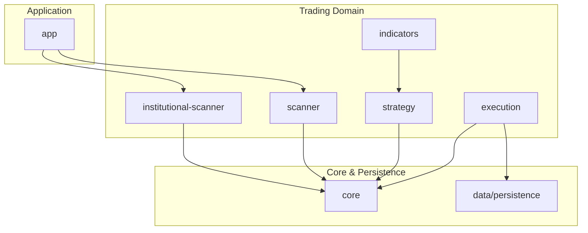

**Diagram sources**
- [OrderManagementService.java:1-308](file://trading/execution/src/main/java/com/tradej/execution/service/OrderManagementService.java#L1-L308)
- [StrategyEngine.java:1-59](file://trading/strategy/src/main/java/com/tradej/strategy/service/StrategyEngine.java#L1-L59)
- [ScanEngine.java](file://trading/scanner/src/main/java/com/tradej/scanner/engine/ScanEngine.java)
- [InstitutionalScanEngine.java:1-118](file://trading/institutional-scanner/src/main/java/com/tradej/institutional/InstitutionalScanEngine.java#L1-L118)
- [EventSourcedOrderRepository.java](file://data/persistence/src/main/java/com/tradej/persistence/oms/EventSourcedOrderRepository.java)

**Section sources**
- [OrderManagementService.java:1-308](file://trading/execution/src/main/java/com/tradej/execution/service/OrderManagementService.java#L1-L308)
- [StrategyEngine.java:1-59](file://trading/strategy/src/main/java/com/tradej/strategy/service/StrategyEngine.java#L1-L59)
- [ScanEngine.java](file://trading/scanner/src/main/java/com/tradej/scanner/engine/ScanEngine.java)
- [InstitutionalScanEngine.java:1-118](file://trading/institutional-scanner/src/main/java/com/tradej/institutional/InstitutionalScanEngine.java#L1-L118)

## Core Components
- Order Management Service: orchestrates order placement, modification, cancellation, and state transitions; persists events and rebuilds state on startup
- Position Risk Handler: enforces pre-trade risk limits, kill switches, and reconciliation halts; integrates with margin enforcement and portfolio engine
- Strategy Engine and Sandbox: evaluate strategies against events; support both legacy candle-only and graph-based multi-event plugins
- Portfolio Engine: capital reservation and exposure tracking across strategies and symbols
- Institutional Scanner: computes features, applies sector momentum adjustments, and selects candidates
- Circuit Breaker and Risk Monitors: gate trading requests and monitor mark-to-market risks

**Section sources**
- [OrderManagementService.java:1-308](file://trading/execution/src/main/java/com/tradej/execution/service/OrderManagementService.java#L1-L308)
- [PositionRiskHandler.java:1-354](file://trading/execution/src/main/java/com/tradej/execution/risk/PositionRiskHandler.java#L1-L354)
- [StrategyEngine.java:1-59](file://trading/strategy/src/main/java/com/tradej/strategy/service/StrategyEngine.java#L1-L59)
- [PortfolioEngine.java:1-313](file://trading/strategy/src/main/java/com/tradej/strategy/portfolio/PortfolioEngine.java#L1-L313)
- [InstitutionalScanEngine.java:1-118](file://trading/institutional-scanner/src/main/java/com/tradej/institutional/InstitutionalScanEngine.java#L1-L118)
- [TradingCircuitBreaker.java](file://trading/execution/src/main/java/com/tradej/execution/service/TradingCircuitBreaker.java)

## Architecture Overview
The system separates concerns across layers:
- Event-driven domain: signals, orders, trades, and lifecycle events
- Execution layer: OMS, risk, market data, and simulation
- Strategy layer: plugins, portfolio, and technical analysis
- Screening layer: scanners for options and institutions
- Persistence: event-sourced order repository

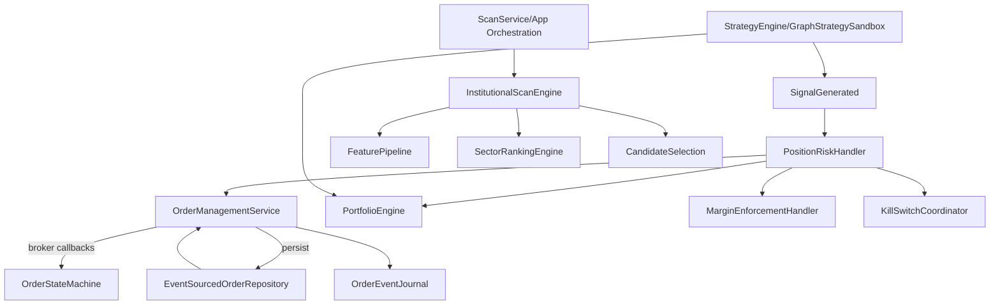

**Diagram sources**
- [OrderManagementService.java:1-308](file://trading/execution/src/main/java/com/tradej/execution/service/OrderManagementService.java#L1-L308)
- [PositionRiskHandler.java:1-354](file://trading/execution/src/main/java/com/tradej/execution/risk/PositionRiskHandler.java#L1-L354)
- [PortfolioEngine.java:1-313](file://trading/strategy/src/main/java/com/tradej/strategy/portfolio/PortfolioEngine.java#L1-L313)
- [InstitutionalScanEngine.java:1-118](file://trading/institutional-scanner/src/main/java/com/tradej/institutional/InstitutionalScanEngine.java#L1-L118)
- [EventSourcedOrderRepository.java](file://data/persistence/src/main/java/com/tradej/persistence/oms/EventSourcedOrderRepository.java)
- [OrderStateMachine.java](file://core/src/main/java/com/tradej/core/domain/oms/OrderStateMachine.java)

## Detailed Component Analysis

### Order Management System (OMS)
The OMS manages the complete order lifecycle with strict state-machine validation and event sourcing.

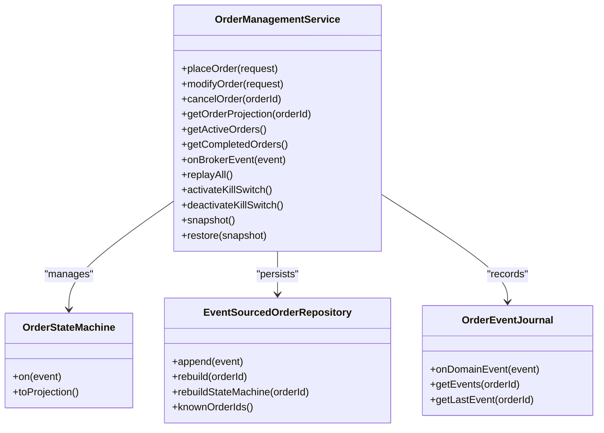

**Diagram sources**
- [OrderManagementService.java:1-308](file://trading/execution/src/main/java/com/tradej/execution/service/OrderManagementService.java#L1-L308)
- [OrderStateMachine.java](file://core/src/main/java/com/tradej/core/domain/oms/OrderStateMachine.java)
- [EventSourcedOrderRepository.java](file://data/persistence/src/main/java/com/tradej/persistence/oms/EventSourcedOrderRepository.java)
- [OrderEventJournal.java:1-96](file://trading/execution/src/main/java/com/tradej/execution/journal/OrderEventJournal.java#L1-L96)

Key behaviors:
- Place order validates circuit breaker and symbol normalization, then routes to broker or simulation
- Modify and cancel enforce state transitions and emit lifecycle events
- State machines are rebuilt from persisted events on startup
- Journal captures typed order events for audit and replay

**Section sources**
- [OrderManagementService.java:89-123](file://trading/execution/src/main/java/com/tradej/execution/service/OrderManagementService.java#L89-L123)
- [OrderManagementService.java:125-172](file://trading/execution/src/main/java/com/tradej/execution/service/OrderManagementService.java#L125-L172)
- [OrderManagementService.java:209-227](file://trading/execution/src/main/java/com/tradej/execution/service/OrderManagementService.java#L209-L227)
- [OrderEventJournal.java:65-79](file://trading/execution/src/main/java/com/tradej/execution/journal/OrderEventJournal.java#L65-L79)

### Order Lifecycle State Machine
The OMS state machine defines legal transitions and projections for order status.

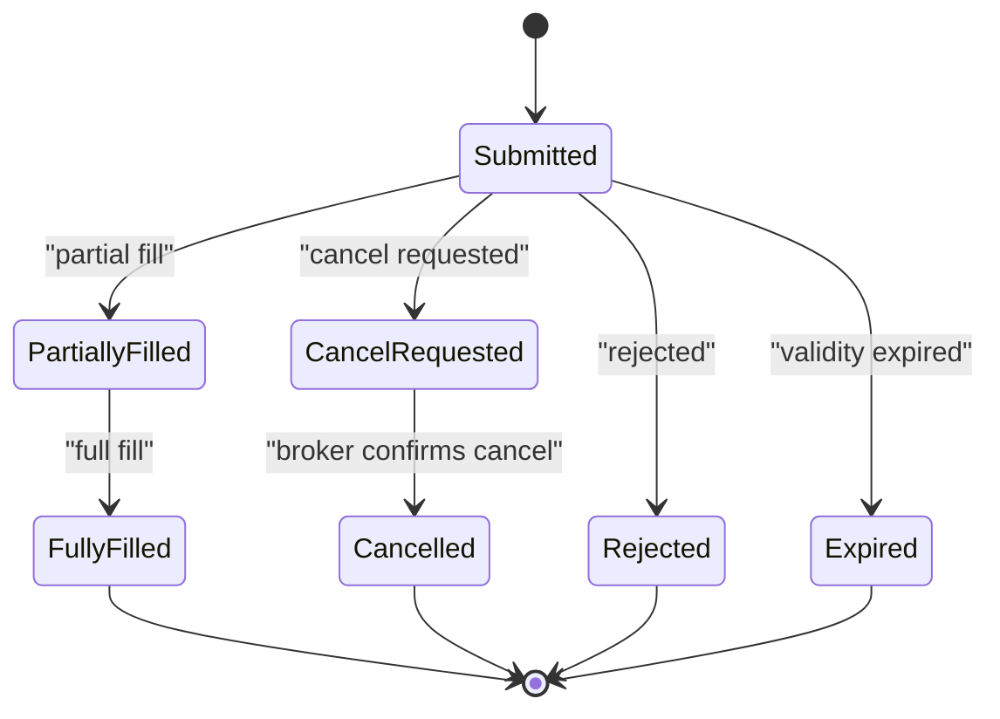

**Diagram sources**
- [OrderStateMachine.java](file://core/src/main/java/com/tradej/core/domain/oms/OrderStateMachine.java)
- [OrderEvent.java](file://core/src/main/java/com/tradej/core/domain/oms/OrderEvent.java)
- [OrderSubmitted.java](file://core/src/main/java/com/tradej/core/domain/oms/OrderSubmitted.java)
- [OrderPartiallyFilled.java](file://core/src/main/java/com/tradej/core/domain/oms/OrderPartiallyFilled.java)
- [OrderFullyFilled.java](file://core/src/main/java/com/tradej/core/domain/oms/OrderFullyFilled.java)
- [CancelRequested.java](file://core/src/main/java/com/tradej/core/domain/oms/CancelRequested.java)
- [OrderCancelled.java](file://core/src/main/java/com/tradej/core/domain/oms/OrderCancelled.java)
- [OrderRejected.java](file://core/src/main/java/com/tradej/core/domain/oms/OrderRejected.java)
- [OrderExpired.java](file://core/src/main/java/com/tradej/core/domain/oms/OrderExpired.java)

### Event Sourcing and Replay
Event sourcing ensures auditability and recovery:
- Events appended to repository on broker callbacks
- On startup, state machines are rebuilt and cached
- Snapshot/restore enables isolation and testing

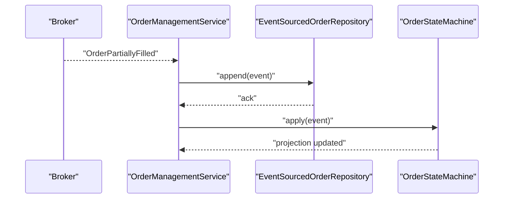

**Diagram sources**
- [OrderManagementService.java:271-287](file://trading/execution/src/main/java/com/tradej/execution/service/OrderManagementService.java#L271-L287)
- [EventSourcedOrderRepository.java](file://data/persistence/src/main/java/com/tradej/persistence/oms/EventSourcedOrderRepository.java)

**Section sources**
- [OrderManagementService.java:218-227](file://trading/execution/src/main/java/com/tradej/execution/service/OrderManagementService.java#L218-L227)
- [OrderManagementService.java:245-262](file://trading/execution/src/main/java/com/tradej/execution/service/OrderManagementService.java#L245-L262)

### Position Risk Management and Stop-Loss/Take-Profit
Position risk enforcement gates signals before order creation:
- Kill switch activation on breaches
- Consecutive loss and daily loss limits
- Open position and notional value caps
- Margin enforcement and portfolio capital/exposure checks

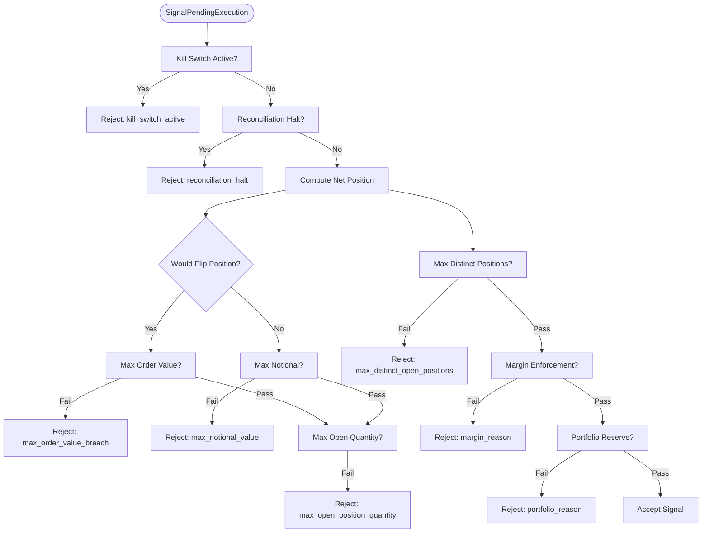

**Diagram sources**
- [PositionRiskHandler.java:203-261](file://trading/execution/src/main/java/com/tradej/execution/risk/PositionRiskHandler.java#L203-L261)
- [MarginEnforcementHandler.java](file://trading/execution/src/main/java/com/tradej/execution/risk/MarginEnforcementHandler.java)
- [PortfolioEngine.java:160-180](file://trading/strategy/src/main/java/com/tradej/strategy/portfolio/PortfolioEngine.java#L160-L180)

**Section sources**
- [PositionRiskHandler.java:141-148](file://trading/execution/src/main/java/com/tradej/execution/risk/PositionRiskHandler.java#L141-L148)
- [PositionRiskHandler.java:203-261](file://trading/execution/src/main/java/com/tradej/execution/risk/PositionRiskHandler.java#L203-L261)
- [PortfolioEngine.java:160-180](file://trading/strategy/src/main/java/com/tradej/strategy/portfolio/PortfolioEngine.java#L160-L180)

### Margin Enforcement and Kill Switch Coordination
- Margin enforcement validates order against account and product-specific requirements
- Kill switch coordinator engages/disengages trading circuitry
- Daily reset scheduler clears daily counters

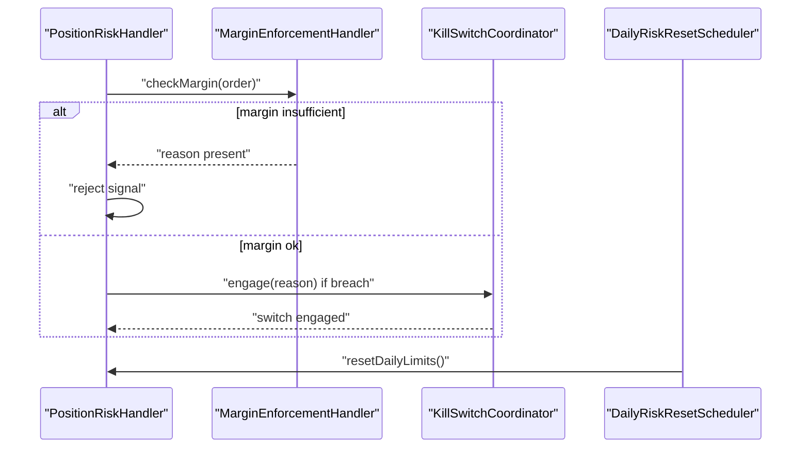

**Diagram sources**
- [PositionRiskHandler.java:242-248](file://trading/execution/src/main/java/com/tradej/execution/risk/PositionRiskHandler.java#L242-L248)
- [MarginEnforcementHandler.java](file://trading/execution/src/main/java/com/tradej/execution/risk/MarginEnforcementHandler.java)
- [KillSwitchCoordinator.java](file://trading/execution/src/main/java/com/tradej/execution/risk/KillSwitchCoordinator.java)
- [DailyRiskResetScheduler.java](file://trading/execution/src/main/java/com/tradej/execution/risk/DailyRiskResetScheduler.java)

**Section sources**
- [PositionRiskHandler.java:279-294](file://trading/execution/src/main/java/com/tradej/execution/risk/PositionRiskHandler.java#L279-L294)
- [DailyRiskResetScheduler.java](file://trading/execution/src/main/java/com/tradej/execution/risk/DailyRiskResetScheduler.java)

### Strategy Engine Architecture
The strategy engine supports two paths:
- Legacy candle-only plugins via StrategyEngine
- Graph-based plugins via GraphStrategySandbox supporting ticks, depths, candles, and ML

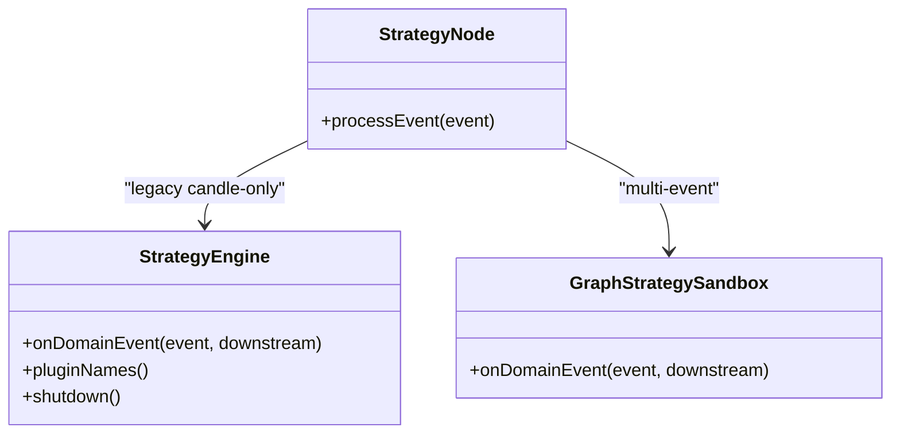

**Diagram sources**
- [StrategyEngine.java:1-59](file://trading/strategy/src/main/java/com/tradej/strategy/service/StrategyEngine.java#L1-L59)
- [GraphStrategySandbox.java](file://trading/strategy/src/main/java/com/tradej/strategy/service/GraphStrategySandbox.java)
- [StrategyNode.java:1-50](file://trading/strategy/src/main/java/com/tradej/strategy/node/StrategyNode.java#L1-L50)

**Section sources**
- [StrategyEngine.java:31-42](file://trading/strategy/src/main/java/com/tradej/strategy/service/StrategyEngine.java#L31-L42)
- [StrategyNode.java:35-48](file://trading/strategy/src/main/java/com/tradej/strategy/node/StrategyNode.java#L35-L48)

### Pluggable Indicators and Technical Analysis
The indicator framework provides reusable building blocks for technical analysis.

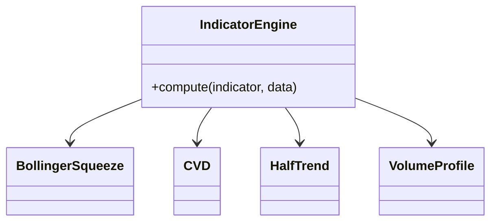

**Diagram sources**
- [IndicatorEngine.java](file://trading/indicators/src/main/java/com/tradej/indicators/IndicatorEngine.java)
- [BollingerSqueeze.java](file://trading/indicators/src/main/java/com/tradej/indicators/BollingerSqueeze.java)
- [CVD.java](file://trading/indicators/src/main/java/com/tradej/indicators/CVD.java)
- [HalfTrend.java](file://trading/indicators/src/main/java/com/tradej/indicators/HalfTrend.java)
- [VolumeProfile.java](file://trading/indicators/src/main/java/com/tradej/indicators/VolumeProfile.java)

**Section sources**
- [IndicatorEngine.java](file://trading/indicators/src/main/java/com/tradej/indicators/IndicatorEngine.java)
- [BollingerSqueeze.java](file://trading/indicators/src/main/java/com/tradej/indicators/BollingerSqueeze.java)
- [CVD.java](file://trading/indicators/src/main/java/com/tradej/indicators/CVD.java)
- [HalfTrend.java](file://tradej/indicators/src/main/java/com/tradej/indicators/HalfTrend.java)
- [VolumeProfile.java](file://trading/indicators/src/main/java/com/tradej/indicators/VolumeProfile.java)

### Portfolio Management
Portfolio engine coordinates capital reservation and exposure tracking across strategies and symbols.

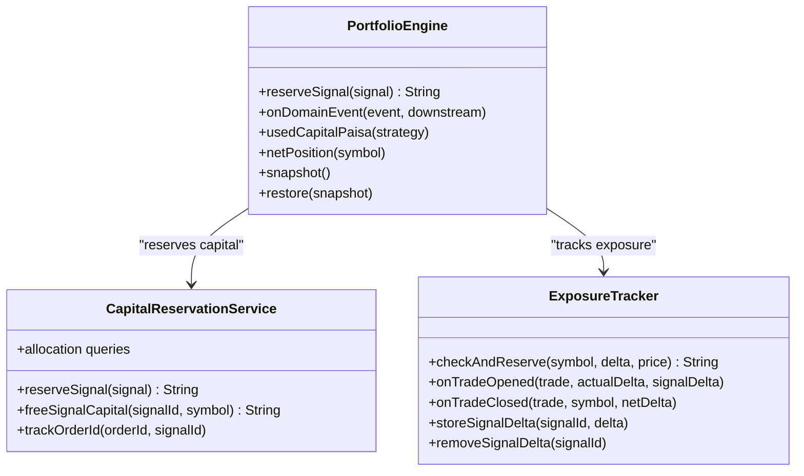

**Diagram sources**
- [PortfolioEngine.java:1-313](file://trading/strategy/src/main/java/com/tradej/strategy/portfolio/PortfolioEngine.java#L1-L313)
- [CapitalReservationService.java](file://trading/strategy/src/main/java/com/tradej/strategy/portfolio/CapitalReservationService.java)
- [DefaultCapitalReservationService.java](file://trading/strategy/src/main/java/com/tradej/strategy/portfolio/DefaultCapitalReservationService.java)
- [ExposureTracker.java](file://trading/strategy/src/main/java/com/tradej/strategy/portfolio/ExposureTracker.java)
- [DefaultExposureTracker.java](file://trading/strategy/src/main/java/com/tradej/strategy/portfolio/DefaultExposureTracker.java)

**Section sources**
- [PortfolioEngine.java:160-180](file://trading/strategy/src/main/java/com/tradej/strategy/portfolio/PortfolioEngine.java#L160-L180)
- [PortfolioEngine.java:225-267](file://trading/strategy/src/main/java/com/tradej/strategy/portfolio/PortfolioEngine.java#L225-L267)

### Institutional Scanner for Market Flow Detection
The institutional scanner computes features, applies sector momentum adjustments, and selects top candidates.

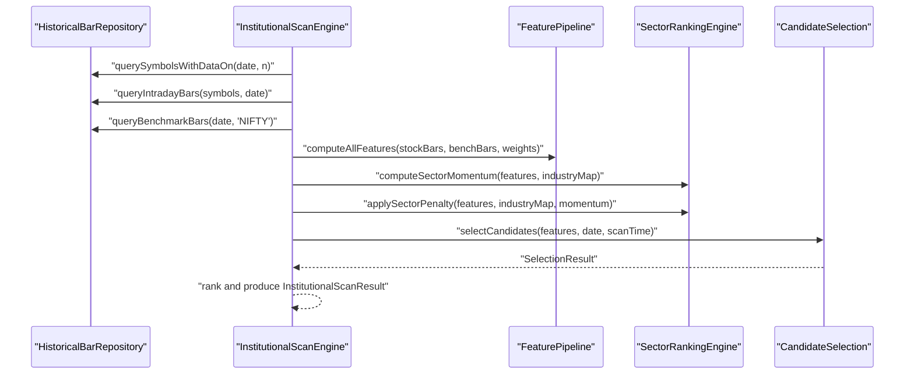

**Diagram sources**
- [InstitutionalScanEngine.java:38-116](file://trading/institutional-scanner/src/main/java/com/tradej/institutional/InstitutionalScanEngine.java#L38-L116)
- [FeaturePipeline.java](file://trading/institutional-scanner/src/main/java/com/tradej/institutional/features/FeaturePipeline.java)
- [SectorRankingEngine.java](file://trading/institutional-scanner/src/main/java/com/tradej/institutional/ranking/SectorRankingEngine.java)
- [CandidateSelection.java](file://trading/institutional-scanner/src/main/java/com/tradej/institutional/selection/CandidateSelection.java)

**Section sources**
- [InstitutionalScanEngine.java:38-116](file://trading/institutional-scanner/src/main/java/com/tradej/institutional/InstitutionalScanEngine.java#L38-L116)

### Application-Level Scanner Orchestration
Application services manage scanning profiles, scheduling, and runtime subscriptions.

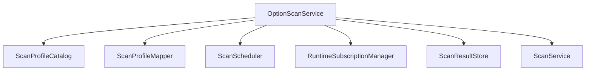

**Diagram sources**
- [OptionScanService.java](file://app/src/main/java/com/tradej/app/scanner/OptionScanService.java)
- [ScanService.java](file://app/src/main/java/com/tradej/app/scanner/ScanService.java)
- [ScanProfileCatalog.java](file://app/src/main/java/com/tradej/app/scanner/ScanProfileCatalog.java)
- [ScanProfileMapper.java](file://app/src/main/java/com/tradej/app/scanner/ScanProfileMapper.java)
- [ScanResultStore.java](file://app/src/main/java/com/tradej/app/scanner/ScanResultStore.java)
- [ScanScheduler.java](file://app/src/main/java/com/tradej/app/scanner/ScanScheduler.java)
- [RuntimeSubscriptionManager.java](file://app/src/main/java/com/tradej/app/scanner/RuntimeSubscriptionManager.java)

**Section sources**
- [OptionScanService.java](file://app/src/main/java/com/tradej/app/scanner/OptionScanService.java)
- [ScanService.java](file://app/src/main/java/com/tradej/app/scanner/ScanService.java)
- [ScanProfileCatalog.java](file://app/src/main/java/com/tradej/app/scanner/ScanProfileCatalog.java)
- [ScanProfileMapper.java](file://app/src/main/java/com/tradej/app/scanner/ScanProfileMapper.java)
- [ScanResultStore.java](file://app/src/main/java/com/tradej/app/scanner/ScanResultStore.java)
- [ScanScheduler.java](file://app/src/main/java/com/tradej/app/scanner/ScanScheduler.java)
- [RuntimeSubscriptionManager.java](file://app/src/main/java/com/tradej/app/scanner/RuntimeSubscriptionManager.java)

### Screening Criteria and Options Scanning
The scanner module provides criteria and option-specific scanning utilities.

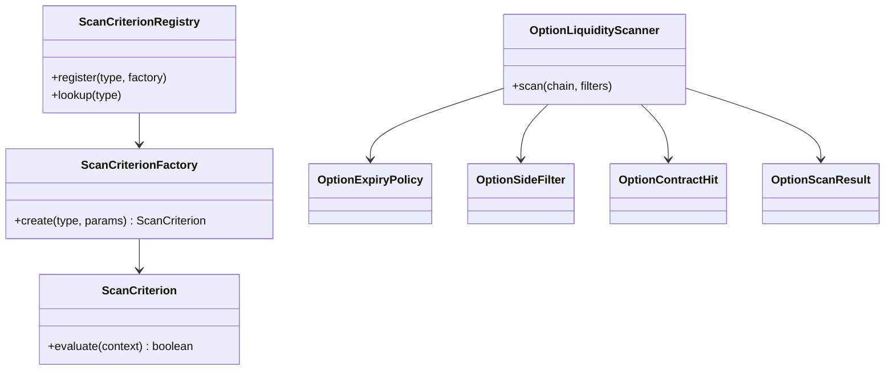

**Diagram sources**
- [ScanCriterion.java](file://trading/scanner/src/main/java/com/tradej/scanner/criterion/ScanCriterion.java)
- [ScanCriterionFactory.java](file://trading/scanner/src/main/java/com/tradej/scanner/criterion/ScanCriterionFactory.java)
- [ScanCriterionRegistry.java](file://trading/scanner/src/main/java/com/tradej/scanner/criterion/ScanCriterionRegistry.java)
- [OptionLiquidityScanner.java](file://trading/scanner/src/main/java/com/tradej/scanner/option/OptionLiquidityScanner.java)
- [OptionExpiryPolicy.java](file://trading/scanner/src/main/java/com/tradej/scanner/option/OptionExpiryPolicy.java)
- [OptionSideFilter.java](file://trading/scanner/src/main/java/com/tradej/scanner/option/OptionSideFilter.java)
- [OptionContractHit.java](file://trading/scanner/src/main/java/com/tradej/scanner/option/OptionContractHit.java)
- [OptionScanResult.java](file://trading/scanner/src/main/java/com/tradej/scanner/option/OptionScanResult.java)

**Section sources**
- [ScanEngine.java](file://trading/scanner/src/main/java/com/tradej/scanner/engine/ScanEngine.java)
- [OptionLiquidityScanner.java](file://trading/scanner/src/main/java/com/tradej/scanner/option/OptionLiquidityScanner.java)

## Dependency Analysis
Key dependencies and integration points:
- OMS depends on broker connections, event-sourced repository, and state machine
- Risk handler integrates with margin enforcement, kill switch, and portfolio engine
- Strategy engine depends on indicator framework and portfolio engine
- Institutional scanner depends on historical bar repository and ranking utilities
- Application scanner services depend on catalog and scheduling utilities

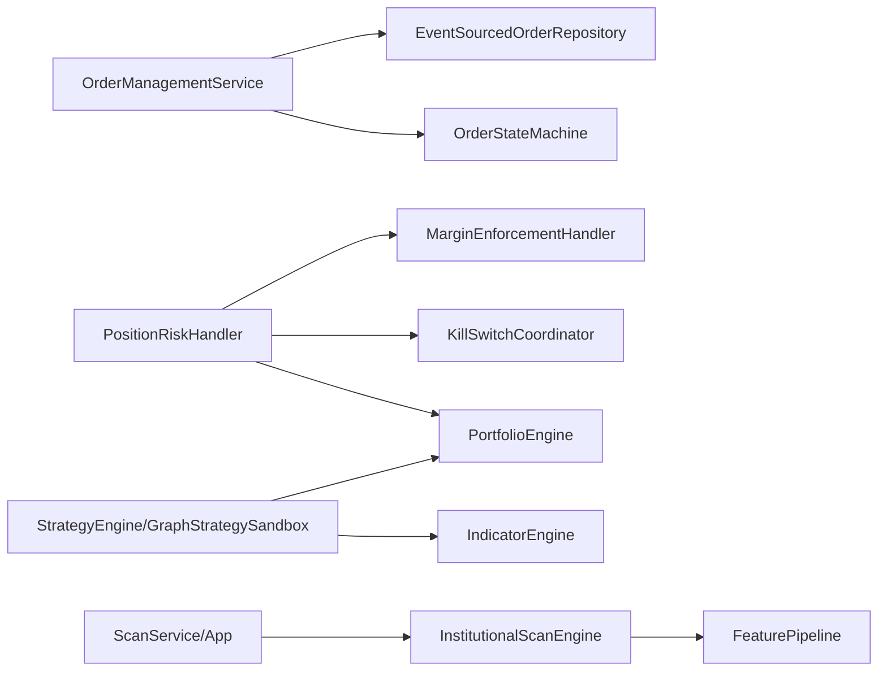

**Diagram sources**
- [OrderManagementService.java:1-308](file://trading/execution/src/main/java/com/tradej/execution/service/OrderManagementService.java#L1-L308)
- [PositionRiskHandler.java:1-354](file://trading/execution/src/main/java/com/tradej/execution/risk/PositionRiskHandler.java#L1-L354)
- [PortfolioEngine.java:1-313](file://trading/strategy/src/main/java/com/tradej/strategy/portfolio/PortfolioEngine.java#L1-L313)
- [InstitutionalScanEngine.java:1-118](file://trading/institutional-scanner/src/main/java/com/tradej/institutional/InstitutionalScanEngine.java#L1-L118)
- [ScanService.java](file://app/src/main/java/com/tradej/app/scanner/ScanService.java)

**Section sources**
- [OrderManagementService.java:48-87](file://trading/execution/src/main/java/com/tradej/execution/service/OrderManagementService.java#L48-L87)
- [PositionRiskHandler.java:37-77](file://trading/execution/src/main/java/com/tradej/execution/risk/PositionRiskHandler.java#L37-L77)
- [PortfolioEngine.java:46-57](file://trading/strategy/src/main/java/com/tradej/strategy/portfolio/PortfolioEngine.java#L46-L57)
- [InstitutionalScanEngine.java:26-32](file://trading/institutional-scanner/src/main/java/com/tradej/institutional/InstitutionalScanEngine.java#L26-L32)
- [ScanService.java](file://app/src/main/java/com/tradej/app/scanner/ScanService.java)

## Performance Considerations
- Event sourcing and state machine caching minimize repeated computation and enable fast lookups
- Strategy sandbox isolates plugin execution with virtual threads and timeouts to avoid cross-plugin contention
- Indicator computations are designed as pluggable units for reuse and parallelization
- Simulation services support low-latency order placement during development and testing
- Circuit breaker and kill switch coordination prevent cascading failures under stress

[No sources needed since this section provides general guidance]

## Troubleshooting Guide
Common issues and remedies:
- Order placement rejected: check trading circuit breaker status and symbol normalization
- State machine errors: verify event ordering and repository rebuild on startup
- Risk rejections: review kill switch activation, daily limits, and portfolio reservations
- Strategy plugin failures: inspect sandbox isolation and plugin timeouts
- Scanner mismatches: confirm scan profiles, scheduling, and subscription manager status

**Section sources**
- [OrderManagementService.java:95-97](file://trading/execution/src/main/java/com/tradej/execution/service/OrderManagementService.java#L95-L97)
- [OrderManagementService.java:218-227](file://trading/execution/src/main/java/com/tradej/execution/service/OrderManagementService.java#L218-L227)
- [PositionRiskHandler.java:212-215](file://trading/execution/src/main/java/com/tradej/execution/risk/PositionRiskHandler.java#L212-L215)
- [StrategyEngine.java:10-21](file://trading/strategy/src/main/java/com/tradej/strategy/service/StrategyEngine.java#L10-L21)
- [ScanService.java](file://app/src/main/java/com/tradej/app/scanner/ScanService.java)

## Conclusion
The trading domain services implement a robust, event-driven architecture with strong risk controls, flexible strategy evaluation, and comprehensive screening capabilities. The combination of OMS state machines, event sourcing, and portfolio-centric risk management provides reliability and transparency. The strategy engine’s dual-path design supports both traditional and advanced multi-event strategies, while the institutional scanner delivers actionable insights for market flow detection.

[No sources needed since this section summarizes without analyzing specific files]

## Appendices

### Risk Controls and Monitoring
- Mark-to-market risk monitor tracks unrealized PnL and triggers alerts
- Live PnL services and market depth orchestrators provide real-time risk telemetry
- Reconciliation schedulers and alert loggers maintain operational integrity

**Section sources**
- [MarkToMarketRiskMonitor.java](file://trading/execution/src/main/java/com/tradej/execution/risk/MarkToMarketRiskMonitor.java)
- [LivePnlService.java](file://trading/execution/src/main/java/com/tradej/execution/marketdata/LivePnlService.java)
- [MarketDepthOrchestrator.java](file://trading/execution/src/main/java/com/tradej/execution/marketdata/MarketDepthOrchestrator.java)

### Simulation and Backtesting Support
- Matching engine and simulated order service enable order lifecycle simulation
- PnL ledger tracks realized and unrealized PnL for backtesting scenarios

**Section sources**
- [MatchingEngine.java](file://trading/simulation/src/main/java/com/tradej/simulation/MatchingEngine.java)
- [SimulatedOrderService.java](file://trading/simulation/src/main/java/com/tradej/simulation/SimulatedOrderService.java)
- [PnLLedger.java](file://trading/simulation/src/main/java/com/tradej/simulation/PnLLedger.java)