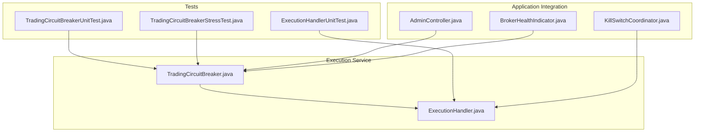
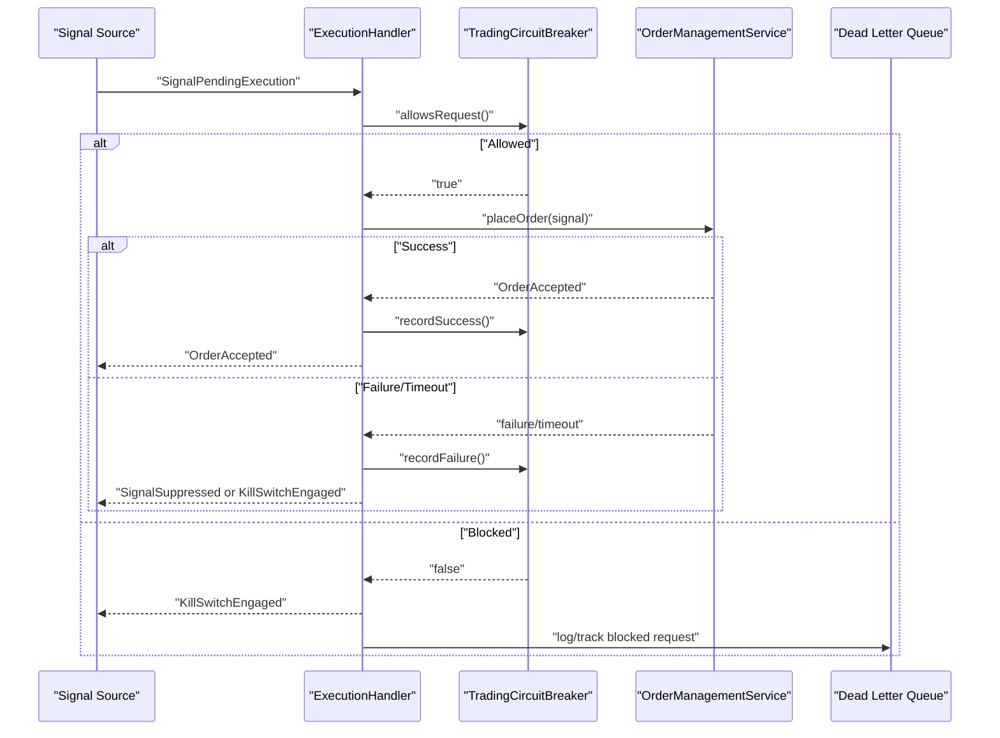
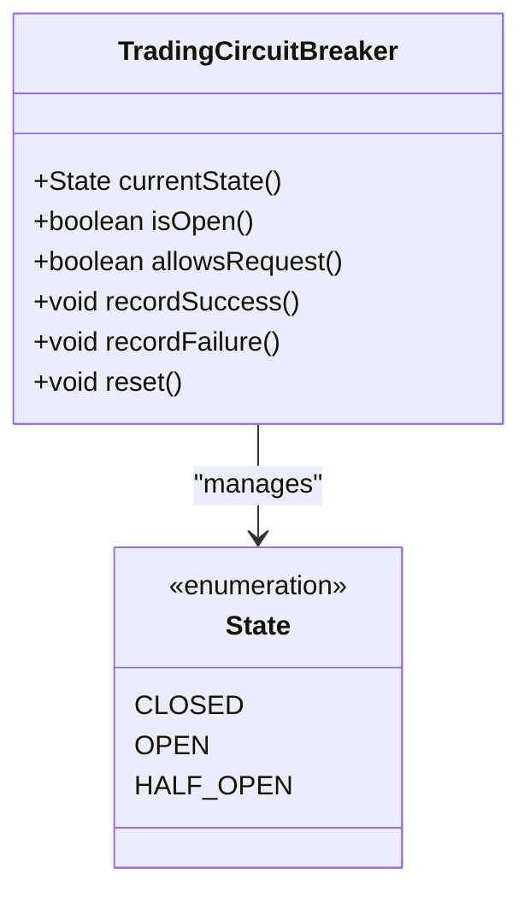
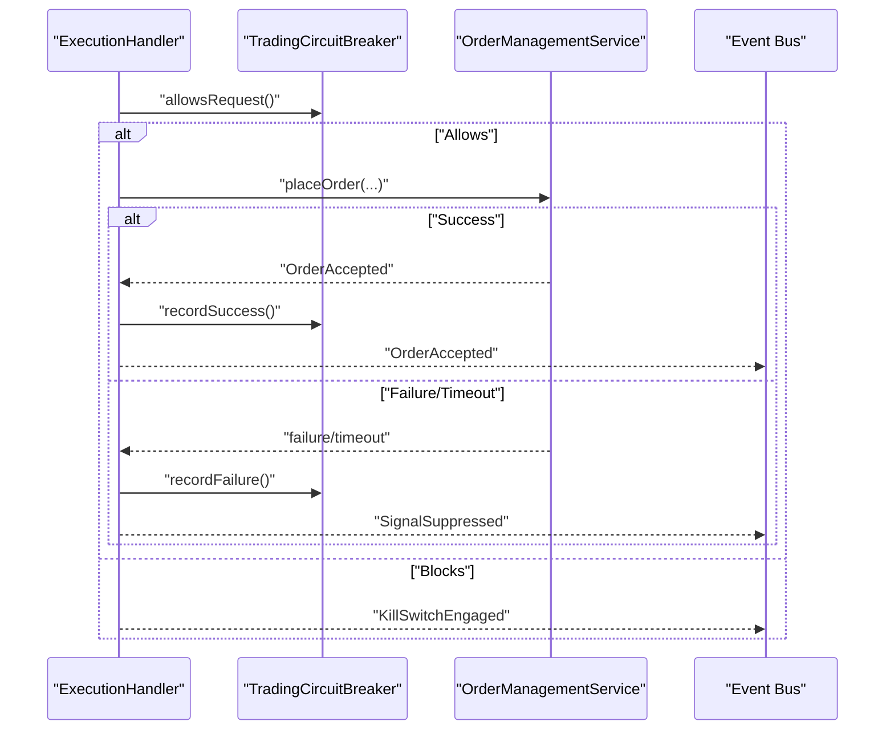
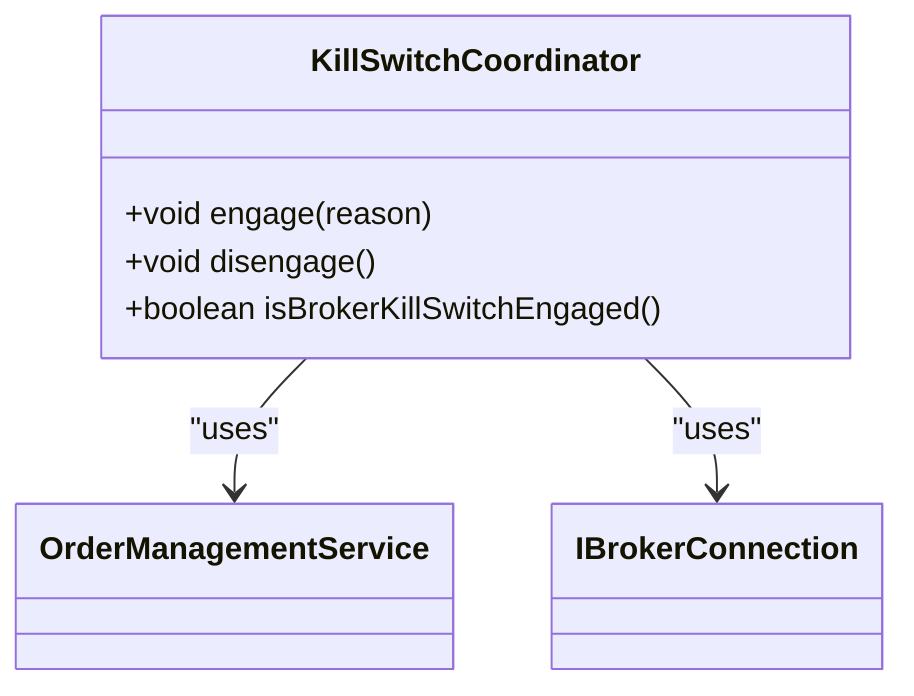
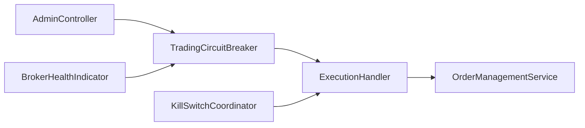

# Circuit Breaker Integration

<cite>
**Referenced Files in This Document**
- [TradingCircuitBreaker.java](file://trading/execution/src/main/java/com/tradej/execution/service/TradingCircuitBreaker.java)
- [TradingCircuitBreakerUnitTest.java](file://trading/execution/src/test/java/com/tradej/execution/service/TradingCircuitBreakerUnitTest.java)
- [TradingCircuitBreakerStressTest.java](file://trading/execution/src/test/java/com/tradej/execution/service/TradingCircuitBreakerStressTest.java)
- [ExecutionHandler.java](file://trading/execution/src/main/java/com/tradej/execution/service/ExecutionHandler.java)
- [ExecutionHandlerUnitTest.java](file://trading/execution/src/test/java/com/tradej/execution/service/ExecutionHandlerUnitTest.java)
- [KillSwitchCoordinator.java](file://trading/execution/src/main/java/com/tradej/execution/risk/KillSwitchCoordinator.java)
- [AdminController.java](file://app/src/main/java/com/tradej/app/admin/AdminController.java)
- [BrokerHealthIndicator.java](file://app/src/main/java/com/tradej/app/health/BrokerHealthIndicator.java)
- [CODE_LEVEL_REVIEW.md](file://docs/archive/CODE_LEVEL_REVIEW.md)
</cite>

## Table of Contents
1. [Introduction](#introduction)
2. [Project Structure](#project-structure)
3. [Core Components](#core-components)
4. [Architecture Overview](#architecture-overview)
5. [Detailed Component Analysis](#detailed-component-analysis)
6. [Dependency Analysis](#dependency-analysis)
7. [Performance Considerations](#performance-considerations)
8. [Troubleshooting Guide](#troubleshooting-guide)
9. [Conclusion](#conclusion)
10. [Appendices](#appendices)

## Introduction
This document explains the Circuit Breaker Integration subsystem responsible for protecting the trading execution pipeline from cascading failures. It covers the TradingCircuitBreaker three-state operation (CLOSED, OPEN, HALF_OPEN), failure detection and thresholds, automatic state transitions, backoff and probing behavior, and how the breaker integrates with order placement, signal processing, and fill reconciliation workflows. It also documents configuration options, monitoring, and operational impact on throughput.

## Project Structure
The Circuit Breaker Integration spans the execution service module and its integration points across the application:
- Core breaker implementation resides in the execution service module.
- Integration tests demonstrate breaker behavior in the order placement and fill reconciliation flows.
- Administrative and health components expose breaker state and influence kill-switch behavior.

**Diagram sources**
- [TradingCircuitBreaker.java](file://trading/execution/src/main/java/com/tradej/execution/service/TradingCircuitBreaker.java)
- [ExecutionHandler.java](file://trading/execution/src/main/java/com/tradej/execution/service/ExecutionHandler.java)
- [TradingCircuitBreakerUnitTest.java](file://trading/execution/src/test/java/com/tradej/execution/service/TradingCircuitBreakerUnitTest.java)
- [TradingCircuitBreakerStressTest.java](file://trading/execution/src/test/java/com/tradej/execution/service/TradingCircuitBreakerStressTest.java)
- [ExecutionHandlerUnitTest.java](file://trading/execution/src/test/java/com/tradej/execution/service/ExecutionHandlerUnitTest.java)
- [AdminController.java](file://app/src/main/java/com/tradej/app/admin/AdminController.java)
- [BrokerHealthIndicator.java](file://app/src/main/java/com/tradej/app/health/BrokerHealthIndicator.java)
- [KillSwitchCoordinator.java](file://trading/execution/src/main/java/com/tradej/execution/risk/KillSwitchCoordinator.java)

**Section sources**
- [TradingCircuitBreaker.java](file://trading/execution/src/main/java/com/tradej/execution/service/TradingCircuitBreaker.java)
- [ExecutionHandler.java](file://trading/execution/src/main/java/com/tradej/execution/service/ExecutionHandler.java)
- [TradingCircuitBreakerUnitTest.java](file://trading/execution/src/test/java/com/tradej/execution/service/TradingCircuitBreakerUnitTest.java)
- [TradingCircuitBreakerStressTest.java](file://trading/execution/src/test/java/com/tradej/execution/service/TradingCircuitBreakerStressTest.java)
- [ExecutionHandlerUnitTest.java](file://trading/execution/src/test/java/com/tradej/execution/service/ExecutionHandlerUnitTest.java)
- [AdminController.java](file://app/src/main/java/com/tradej/app/admin/AdminController.java)
- [BrokerHealthIndicator.java](file://app/src/main/java/com/tradej/app/health/BrokerHealthIndicator.java)
- [KillSwitchCoordinator.java](file://trading/execution/src/main/java/com/tradej/execution/risk/KillSwitchCoordinator.java)

## Core Components
- TradingCircuitBreaker: Lock-free three-state breaker with configurable failure threshold, open duration, and half-open probe limit.
- ExecutionHandler: Orchestrates signal-to-order lifecycle and integrates breaker decisions into order placement and fill reconciliation.
- KillSwitchCoordinator: Coordinates platform kill-switch activation/deactivation with broker capabilities.
- Application integrations: Admin controller and health indicator surface breaker state and kill-switch status.

Key responsibilities:
- State management: CLOSED → OPEN → HALF_OPEN → CLOSED transitions.
- Failure detection: Tracks consecutive failures and triggers OPEN state when threshold is met.
- Backoff and probing: Enforces open duration and limits concurrent HALF_OPEN probes.
- Integration: Delegates breaker decisions to ExecutionHandler and emits appropriate domain events.

**Section sources**
- [TradingCircuitBreaker.java](file://trading/execution/src/main/java/com/tradej/execution/service/TradingCircuitBreaker.java)
- [ExecutionHandler.java](file://trading/execution/src/main/java/com/tradej/execution/service/ExecutionHandler.java)
- [KillSwitchCoordinator.java](file://trading/execution/src/main/java/com/tradej/execution/risk/KillSwitchCoordinator.java)
- [AdminController.java](file://app/src/main/java/com/tradej/app/admin/AdminController.java)
- [BrokerHealthIndicator.java](file://app/src/main/java/com/tradej/app/health/BrokerHealthIndicator.java)

## Architecture Overview
The breaker sits inline with the order placement pipeline. Signals are evaluated against the breaker before placing orders. Failures during placement or timeouts update breaker state, influencing subsequent decisions until recovery.

**Diagram sources**
- [ExecutionHandler.java](file://trading/execution/src/main/java/com/tradej/execution/service/ExecutionHandler.java)
- [TradingCircuitBreaker.java](file://trading/execution/src/main/java/com/tradej/execution/service/TradingCircuitBreaker.java)
- [ExecutionHandlerUnitTest.java](file://trading/execution/src/test/java/com/tradej/execution/service/ExecutionHandlerUnitTest.java)

## Detailed Component Analysis

### TradingCircuitBreaker
The breaker maintains:
- State: CLOSED, OPEN, HALF_OPEN
- Consecutive failures counter
- Open-until timestamp for backoff
- Half-open probe counter

Behavior highlights:
- CLOSED: All requests allowed.
- OPEN: Requests blocked until open window elapses; first eligible request attempts HALF_OPEN with a single probe.
- HALF_OPEN: Allows up to maxHalfOpenProbes concurrent probes; first success transitions to CLOSED.

**Diagram sources**
- [TradingCircuitBreaker.java](file://trading/execution/src/main/java/com/tradej/execution/service/TradingCircuitBreaker.java)

Implementation notes:
- Lock-free transitions using compare-and-set semantics for state and probe counters.
- Failure threshold determines when CLOSED or HALF_OPEN transitions to OPEN.
- Open duration controls backoff window; extending on repeated failures.
- Probe concurrency capped to maxHalfOpenProbes.

Operational examples:
- Unit tests verify threshold-triggered OPEN state and recovery after cooldown.
- Stress tests validate concurrent probe limits and state integrity.

**Section sources**
- [TradingCircuitBreaker.java](file://trading/execution/src/main/java/com/tradej/execution/service/TradingCircuitBreaker.java)
- [TradingCircuitBreakerUnitTest.java](file://trading/execution/src/test/java/com/tradej/execution/service/TradingCircuitBreakerUnitTest.java)
- [TradingCircuitBreakerStressTest.java](file://trading/execution/src/test/java/com/tradej/execution/service/TradingCircuitBreakerStressTest.java)

### ExecutionHandler Integration
ExecutionHandler coordinates breaker-aware order placement:
- Queries breaker before placing orders.
- Emits domain events based on breaker state and outcomes.
- Records breaker results after successful or failed placements.

Key integration points:
- Signal acceptance: If breaker blocks, emits KillSwitchEngaged and suppresses order placement.
- Placement success: Records success and updates breaker state.
- Placement failure/timeout: Records failure and suppresses signals appropriately.

**Diagram sources**
- [ExecutionHandler.java](file://trading/execution/src/main/java/com/tradej/execution/service/ExecutionHandler.java)
- [ExecutionHandlerUnitTest.java](file://trading/execution/src/test/java/com/tradej/execution/service/ExecutionHandlerUnitTest.java)

**Section sources**
- [ExecutionHandler.java](file://trading/execution/src/main/java/com/tradej/execution/service/ExecutionHandler.java)
- [ExecutionHandlerUnitTest.java](file://trading/execution/src/test/java/com/tradej/execution/service/ExecutionHandlerUnitTest.java)

### Kill Switch Coordinator
Coordinates platform kill-switch with broker capabilities:
- Activates kill-switch via OrderManagementService or broker OrderCommand capability.
- Tracks broker kill-switch engagement state.
- Provides disengage and status queries.

**Diagram sources**
- [KillSwitchCoordinator.java](file://trading/execution/src/main/java/com/tradej/execution/risk/KillSwitchCoordinator.java)

**Section sources**
- [KillSwitchCoordinator.java](file://trading/execution/src/main/java/com/tradej/execution/risk/KillSwitchCoordinator.java)

### Administrative and Health Integration
- AdminController: Exposes access to TradingCircuitBreaker for operational control.
- BrokerHealthIndicator: Integrates breaker state into health reporting.

**Section sources**
- [AdminController.java](file://app/src/main/java/com/tradej/app/admin/AdminController.java)
- [BrokerHealthIndicator.java](file://app/src/main/java/com/tradej/app/health/BrokerHealthIndicator.java)

## Dependency Analysis
The breaker interacts with ExecutionHandler and is surfaced by administrative and health components. ExecutionHandler depends on breaker for gating order placement and on OrderManagementService for actual order submission.

**Diagram sources**
- [TradingCircuitBreaker.java](file://trading/execution/src/main/java/com/tradej/execution/service/TradingCircuitBreaker.java)
- [ExecutionHandler.java](file://trading/execution/src/main/java/com/tradej/execution/service/ExecutionHandler.java)
- [AdminController.java](file://app/src/main/java/com/tradej/app/admin/AdminController.java)
- [BrokerHealthIndicator.java](file://app/src/main/java/com/tradej/app/health/BrokerHealthIndicator.java)
- [KillSwitchCoordinator.java](file://trading/execution/src/main/java/com/tradej/execution/risk/KillSwitchCoordinator.java)

**Section sources**
- [TradingCircuitBreaker.java](file://trading/execution/src/main/java/com/tradej/execution/service/TradingCircuitBreaker.java)
- [ExecutionHandler.java](file://trading/execution/src/main/java/com/tradej/execution/service/ExecutionHandler.java)
- [AdminController.java](file://app/src/main/java/com/tradej/app/admin/AdminController.java)
- [BrokerHealthIndicator.java](file://app/src/main/java/com/tradej/app/health/BrokerHealthIndicator.java)
- [KillSwitchCoordinator.java](file://trading/execution/src/main/java/com/tradej/execution/risk/KillSwitchCoordinator.java)

## Performance Considerations
- Lock-free design: Uses atomic references and compare-and-set operations to minimize contention under high-throughput order placement.
- Probe limiting: HALF_OPEN probe concurrency is bounded to reduce load during recovery.
- Backoff window: Prevents immediate retries after failures, reducing thundering herds.
- Impact on throughput: During OPEN, throughput drops to zero; during HALF_OPEN, throughput is limited to probe capacity; during CLOSED, throughput is unbounded except for broker constraints.

[No sources needed since this section provides general guidance]

## Troubleshooting Guide
Common scenarios and resolutions:
- Breaker remains OPEN: Verify open duration elapsed and examine failure accumulation leading to OPEN state.
- HALF_OPEN probe failures: Confirm broker stability; ensure probe limit is sufficient for recovery.
- Blocking order placement: Check breaker state and ensure KillSwitchEngaged is handled by downstream components.
- Monitoring breaker state: Use administrative endpoints and health indicators to observe current state and kill-switch status.

Operational references:
- Unit and stress tests demonstrate expected breaker behavior under various conditions.
- Integration tests show breaker effects on order placement and signal suppression.

**Section sources**
- [TradingCircuitBreakerUnitTest.java](file://trading/execution/src/test/java/com/tradej/execution/service/TradingCircuitBreakerUnitTest.java)
- [TradingCircuitBreakerStressTest.java](file://trading/execution/src/test/java/com/tradej/execution/service/TradingCircuitBreakerStressTest.java)
- [ExecutionHandlerUnitTest.java](file://trading/execution/src/test/java/com/tradej/execution/service/ExecutionHandlerUnitTest.java)
- [BrokerHealthIndicator.java](file://app/src/main/java/com/tradej/app/health/BrokerHealthIndicator.java)

## Conclusion
The Circuit Breaker Integration provides robust protection for the trading execution pipeline. Its lock-free, three-state design ensures minimal contention, controlled recovery via HALF_OPEN probing, and clear operational signals through domain events and kill-switch coordination. Proper configuration of thresholds, open duration, and probe limits balances safety and throughput, while integration with order placement and reconciliation workflows maintains system reliability.

[No sources needed since this section summarizes without analyzing specific files]

## Appendices

### Configuration Options
- failureThreshold: Number of consecutive failures to trigger OPEN state.
- openDurationMs: Duration of the OPEN backoff window.
- maxHalfOpenProbes: Maximum concurrent probes allowed during HALF_OPEN recovery.

**Section sources**
- [TradingCircuitBreaker.java](file://trading/execution/src/main/java/com/tradej/execution/service/TradingCircuitBreaker.java)

### Monitoring and Observability
- Current breaker state and kill-switch status can be accessed via administrative and health components.
- Domain events emitted during breaker-triggered actions (e.g., KillSwitchEngaged, SignalSuppressed) provide audit trails.

**Section sources**
- [AdminController.java](file://app/src/main/java/com/tradej/app/admin/AdminController.java)
- [BrokerHealthIndicator.java](file://app/src/main/java/com/tradej/app/health/BrokerHealthIndicator.java)
- [ExecutionHandlerUnitTest.java](file://trading/execution/src/test/java/com/tradej/execution/service/ExecutionHandlerUnitTest.java)

### Operational Notes
- Historical review indicates prior synchronized methods causing contention; current implementation uses lock-free transitions.
- HALF_OPEN probe concurrency is enforced to prevent overload during recovery.

**Section sources**
- [CODE_LEVEL_REVIEW.md](file://docs/archive/CODE_LEVEL_REVIEW.md)
- [TradingCircuitBreaker.java](file://trading/execution/src/main/java/com/tradej/execution/service/TradingCircuitBreaker.java)