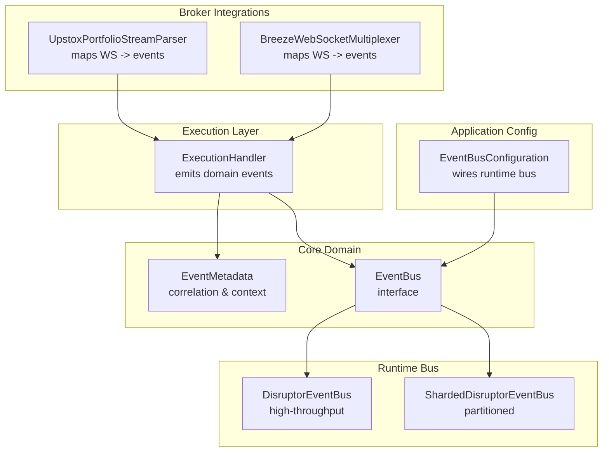
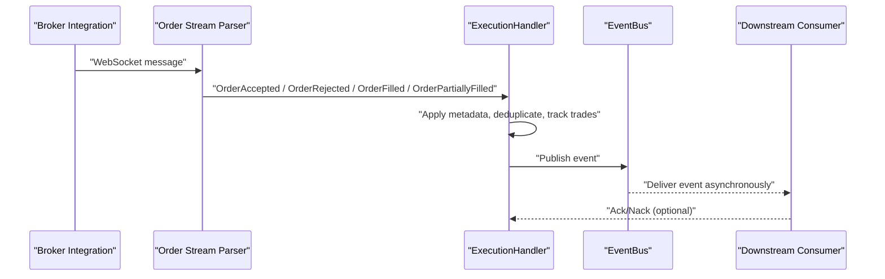
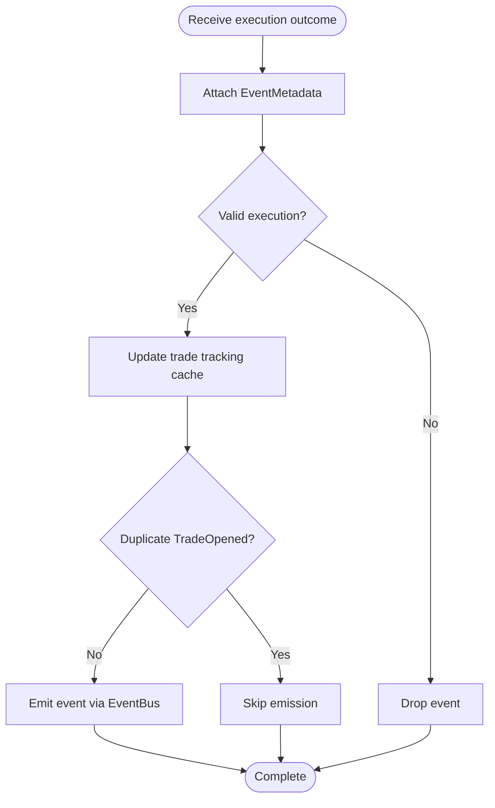
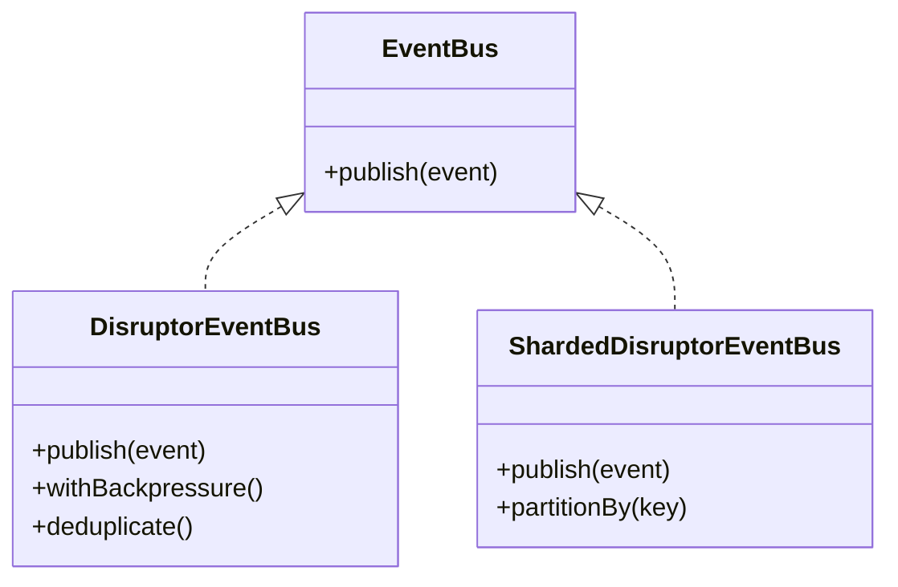
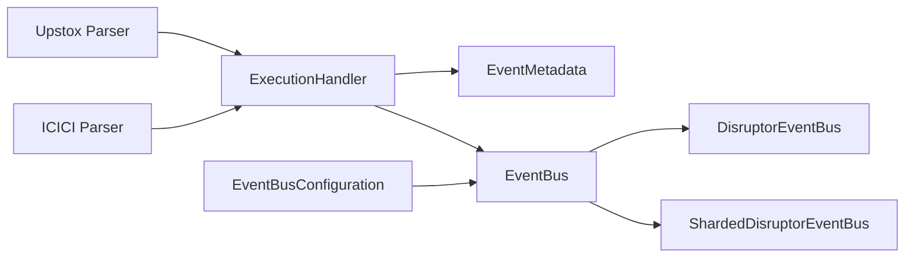

# Event Emission System

<cite>
**Referenced Files in This Document**
- [ExecutionHandler.java](file://trading/execution/src/main/java/com/tradej/execution/service/ExecutionHandler.java)
- [EventMetadata.java](file://core/src/main/java/com/tradej/core/domain/event/EventMetadata.java)
- [EventBus.java](file://core/src/main/java/com/tradej/core/domain/port/EventBus.java)
- [EventBusConfiguration.java](file://app/src/main/java/com/tradej/app/config/EventBusConfiguration.java)
- [UpstoxPortfolioStreamParser.java](file://broker/upstox/src/main/java/com/tradej/broker/upstox/websocket/UpstoxPortfolioStreamParser.java)
- [BreezeWebSocketMultiplexer.java](file://broker/icici/src/main/java/com/tradej/broker/icici/websocket/BreezeWebSocketMultiplexer.java)
- [OrderPipelineTest.java](file://runtime/hotpath/src/test/java/com/tradej/hotpath/OrderPipelineTest.java)
- [ExecutionHandlerStressTest.java](file://trading/execution/src/test/java/com/tradej/execution/service/ExecutionHandlerStressTest.java)
- [DisruptorEventBus.java](file://runtime/disruptor/src/main/java/com/tradej/disruptor/DisruptorEventBus.java)
- [ShardedDisruptorEventBus.java](file://runtime/disruptor/src/main/java/com/tradej/disruptor/ShardedDisruptorEventBus.java)
</cite>

## Table of Contents
1. [Introduction](#introduction)
2. [Project Structure](#project-structure)
3. [Core Components](#core-components)
4. [Architecture Overview](#architecture-overview)
5. [Detailed Component Analysis](#detailed-component-analysis)
6. [Dependency Analysis](#dependency-analysis)
7. [Performance Considerations](#performance-considerations)
8. [Troubleshooting Guide](#troubleshooting-guide)
9. [Conclusion](#conclusion)

## Introduction
This document describes the Event Emission System responsible for generating and routing domain events during the order and execution lifecycle. It focuses on how the ExecutionHandler emits key events—OrderAccepted, OrderRejected, OrderFilled, OrderPartiallyFilled, and TradeOpened—throughout the system. It also covers metadata handling, correlation ID management, trade tracking and duplicate prevention, synthetic trade generation for simulated environments, downstream routing, ordering guarantees, and integration with the broader event bus ecosystem.

## Project Structure
The Event Emission System spans several modules:
- Execution module: orchestrates event emission from execution outcomes
- Core domain: defines event types, metadata, and the EventBus interface
- Broker integrations: translate broker messages into domain events
- Runtime disruptor: provides high-throughput event bus implementations
- Application configuration: wires the event bus into the runtime

**Diagram sources**
- [ExecutionHandler.java](file://trading/execution/src/main/java/com/tradej/execution/service/ExecutionHandler.java)
- [EventMetadata.java](file://core/src/main/java/com/tradej/core/domain/event/EventMetadata.java)
- [EventBus.java](file://core/src/main/java/com/tradej/core/domain/port/EventBus.java)
- [UpstoxPortfolioStreamParser.java](file://broker/upstox/src/main/java/com/tradej/broker/upstox/websocket/UpstoxPortfolioStreamParser.java)
- [BreezeWebSocketMultiplexer.java](file://broker/icici/src/main/java/com/tradej/broker/icici/websocket/BreezeWebSocketMultiplexer.java)
- [DisruptorEventBus.java](file://runtime/disruptor/src/main/java/com/tradej/disruptor/DisruptorEventBus.java)
- [ShardedDisruptorEventBus.java](file://runtime/disruptor/src/main/java/com/tradej/disruptor/ShardedDisruptorEventBus.java)
- [EventBusConfiguration.java](file://app/src/main/java/com/tradej/app/config/EventBusConfiguration.java)

**Section sources**
- [ExecutionHandler.java](file://trading/execution/src/main/java/com/tradej/execution/service/ExecutionHandler.java)
- [EventBusConfiguration.java](file://app/src/main/java/com/tradej/app/config/EventBusConfiguration.java)

## Core Components
- ExecutionHandler: central emitter for execution lifecycle events; manages trade tracking and deduplication; integrates with the event bus
- EventMetadata: carries correlation IDs, timestamps, schema versions, and routing hints
- EventBus: abstraction for publishing events to downstream consumers
- Broker parsers: translate broker WebSocket messages into domain events (OrderAccepted, OrderRejected, OrderFilled, OrderPartiallyFilled)
- DisruptorEventBus and ShardedDisruptorEventBus: high-performance implementations supporting partitioning and backpressure

Key event types emitted:
- OrderAccepted: emitted when an order transitions to accepted/pending/open
- OrderRejected: emitted when an order is rejected with a reason
- OrderFilled: emitted when an order is completely filled
- OrderPartiallyFilled: emitted when an order is partially filled
- TradeOpened: emitted when a new trade position opens (including synthetic generation in simulations)

**Section sources**
- [ExecutionHandler.java](file://trading/execution/src/main/java/com/tradej/execution/service/ExecutionHandler.java)
- [EventMetadata.java](file://core/src/main/java/com/tradej/core/domain/event/EventMetadata.java)
- [EventBus.java](file://core/src/main/java/com/tradej/core/domain/port/EventBus.java)
- [UpstoxPortfolioStreamParser.java](file://broker/upstox/src/main/java/com/tradej/broker/upstox/websocket/UpstoxPortfolioStreamParser.java)
- [BreezeWebSocketMultiplexer.java](file://broker/icici/src/main/java/com/tradej/broker/icici/websocket/BreezeWebSocketMultiplexer.java)

## Architecture Overview
The system follows a publish-subscribe pattern:
- Brokers receive real-time updates and convert them into domain events
- ExecutionHandler validates, enriches with metadata, and emits events
- EventBus routes events to downstream consumers (risk, analytics, persistence, etc.)
- Disruptor-backed buses provide throughput and ordering guarantees per partition

**Diagram sources**
- [UpstoxPortfolioStreamParser.java](file://broker/upstox/src/main/java/com/tradej/broker/upstox/websocket/UpstoxPortfolioStreamParser.java)
- [BreezeWebSocketMultiplexer.java](file://broker/icici/src/main/java/com/tradej/broker/icici/websocket/BreezeWebSocketMultiplexer.java)
- [ExecutionHandler.java](file://trading/execution/src/main/java/com/tradej/execution/service/ExecutionHandler.java)
- [EventBus.java](file://core/src/main/java/com/tradej/core/domain/port/EventBus.java)

## Detailed Component Analysis

### ExecutionHandler: Event Emission Patterns
Responsibilities:
- Receive execution outcomes from broker parsers
- Enrich with EventMetadata (correlation IDs, schema version, priority)
- Track trade state and prevent duplicate TradeOpened emissions
- Emit OrderAccepted, OrderRejected, OrderFilled, OrderPartiallyFilled, and TradeOpened
- Integrate with synthetic trade generation for simulated environments

Event emission patterns:
- Metadata propagation: each event carries a root or child EventMetadata to maintain lineage
- Deduplication: maintains a cache keyed by order identifiers to avoid duplicate TradeOpened
- Trade tracking: tracks open positions and generates TradeOpened when a new leg initiates
- Synthetic generation: in sandbox/live-simulation modes, generates TradeOpened events without real broker confirmations

**Diagram sources**
- [ExecutionHandler.java](file://trading/execution/src/main/java/com/tradej/execution/service/ExecutionHandler.java)

**Section sources**
- [ExecutionHandler.java](file://trading/execution/src/main/java/com/tradej/execution/service/ExecutionHandler.java)
- [ExecutionHandlerStressTest.java](file://trading/execution/src/test/java/com/tradej/execution/service/ExecutionHandlerStressTest.java)

### EventMetadata: Correlation and Context
- Provides correlation ID for end-to-end tracing across systems
- Carries schema version and priority for routing and compatibility
- Supports hierarchical metadata for nested event relationships
- Enables downstream consumers to correlate events across order lifecycles

Usage patterns:
- Root metadata for top-level events
- Child metadata for follow-up events (e.g., TradeOpened following OrderAccepted)

**Section sources**
- [EventMetadata.java](file://core/src/main/java/com/tradej/core/domain/event/EventMetadata.java)

### Broker Parsers: Downstream Event Routing
- UpstoxPortfolioStreamParser: maps broker statuses to domain events (OPEN/PENDING → OrderAccepted; COMPLETE/FILLED → OrderFilled; PARTIALLY_FILLED → OrderPartiallyFilled; CANCELLED/CANCELED → OrderCancelled; REJECTED → OrderRejected; MODIFIED → OrderModified)
- BreezeWebSocketMultiplexer: similar mapping for ICICI broker WebSocket messages

These parsers act as the upstream producers for the event bus, ensuring consistent event semantics across brokers.

**Section sources**
- [UpstoxPortfolioStreamParser.java](file://broker/upstox/src/main/java/com/tradej/broker/upstox/websocket/UpstoxPortfolioStreamParser.java)
- [BreezeWebSocketMultiplexer.java](file://broker/icici/src/main/java/com/tradej/broker/icici/websocket/BreezeWebSocketMultiplexer.java)

### EventBus Integration: Ordering and Delivery
- EventBus interface abstracts delivery semantics
- DisruptorEventBus: high-throughput, lock-free ring buffer with ordering guarantees per partition
- ShardedDisruptorEventBus: partitions by correlation ID or order ID to preserve ordering and reduce contention
- Backpressure and deduplication supported by runtime implementations

**Diagram sources**
- [EventBus.java](file://core/src/main/java/com/tradej/core/domain/port/EventBus.java)
- [DisruptorEventBus.java](file://runtime/disruptor/src/main/java/com/tradej/disruptor/DisruptorEventBus.java)
- [ShardedDisruptorEventBus.java](file://runtime/disruptor/src/main/java/com/tradej/disruptor/ShardedDisruptorEventBus.java)

**Section sources**
- [EventBus.java](file://core/src/main/java/com/tradej/core/domain/port/EventBus.java)
- [DisruptorEventBus.java](file://runtime/disruptor/src/main/java/com/tradej/disruptor/DisruptorEventBus.java)
- [ShardedDisruptorEventBus.java](file://runtime/disruptor/src/main/java/com/tradej/disruptor/ShardedDisruptorEventBus.java)

### Trade Opened Tracking and Duplicate Prevention
Mechanism:
- Maintains a cache keyed by order identifier to detect duplicate TradeOpened emissions
- Thread-safe cache ensures atomic guard checks under concurrent load
- Prevents redundant TradeOpened events even when multiple partial fills arrive rapidly

Evidence:
- Stress tests validate cache thread-safety and size correctness under concurrent writes

**Section sources**
- [ExecutionHandler.java](file://trading/execution/src/main/java/com/tradej/execution/service/ExecutionHandler.java)
- [ExecutionHandlerStressTest.java](file://trading/execution/src/test/java/com/tradej/execution/service/ExecutionHandlerStressTest.java)

### Synthetic Trade Generation for Simulated Environments
Behavior:
- In sandbox or simulation modes, TradeOpened events can be generated synthetically
- Ensures downstream consumers receive TradeOpened even without real broker confirmations
- Maintains consistency with real execution flows for testing and replay

Note: Implementation specifics are encapsulated within the handler and environment configuration.

**Section sources**
- [ExecutionHandler.java](file://trading/execution/src/main/java/com/tradej/execution/service/ExecutionHandler.java)

### Event Filtering and Debugging
Workflows:
- Event filtering: downstream consumers can filter by event type, correlation ID, or metadata attributes
- Debugging: use CLI commands and scanners to trace event flows and inspect metadata
- Testing: OrderPipelineTest demonstrates forwarding of OrderAccepted, OrderFilled, OrderRejected, TradeOpened, TradeUpdated, and TradeClosed events

Examples:
- Forwarding OrderAccepted, OrderFilled, OrderRejected, TradeOpened, TradeUpdated, TradeClosed events through a pipeline for verification

**Section sources**
- [OrderPipelineTest.java](file://runtime/hotpath/src/test/java/com/tradej/hotpath/OrderPipelineTest.java)

## Dependency Analysis
- ExecutionHandler depends on EventMetadata for context and EventBus for delivery
- Broker parsers depend on metadata factories to construct properly enriched events
- Runtime disruptor buses depend on partitioning strategies to guarantee ordering and throughput
- Application configuration wires the chosen EventBus implementation into the runtime

**Diagram sources**
- [ExecutionHandler.java](file://trading/execution/src/main/java/com/tradej/execution/service/ExecutionHandler.java)
- [EventMetadata.java](file://core/src/main/java/com/tradej/core/domain/event/EventMetadata.java)
- [EventBus.java](file://core/src/main/java/com/tradej/core/domain/port/EventBus.java)
- [UpstoxPortfolioStreamParser.java](file://broker/upstox/src/main/java/com/tradej/broker/upstox/websocket/UpstoxPortfolioStreamParser.java)
- [BreezeWebSocketMultiplexer.java](file://broker/icici/src/main/java/com/tradej/broker/icici/websocket/BreezeWebSocketMultiplexer.java)
- [DisruptorEventBus.java](file://runtime/disruptor/src/main/java/com/tradej/disruptor/DisruptorEventBus.java)
- [ShardedDisruptorEventBus.java](file://runtime/disruptor/src/main/java/com/tradej/disruptor/ShardedDisruptorEventBus.java)
- [EventBusConfiguration.java](file://app/src/main/java/com/tradej/app/config/EventBusConfiguration.java)

**Section sources**
- [ExecutionHandler.java](file://trading/execution/src/main/java/com/tradej/execution/service/ExecutionHandler.java)
- [EventBusConfiguration.java](file://app/src/main/java/com/tradej/app/config/EventBusConfiguration.java)

## Performance Considerations
- Partitioning: use ShardedDisruptorEventBus to partition by correlation ID or order ID to preserve ordering and reduce contention
- Backpressure: DisruptorEventBus supports backpressure to protect downstream consumers during spikes
- Deduplication: runtime buses can deduplicate events to reduce load
- Concurrency: ExecutionHandler’s tradeOpened cache is thread-safe; stress tests validate atomicity under concurrent access

[No sources needed since this section provides general guidance]

## Troubleshooting Guide
Common issues and resolutions:
- Duplicate TradeOpened events: verify trade tracking cache and deduplication logic; ensure order identifiers are consistent
- Missing OrderFilled events: check broker parser mappings and status normalization; confirm event emission after partial fills
- Correlation ID mismatches: validate EventMetadata attachment at each stage; ensure root vs child metadata usage aligns with intended lineage
- Throughput bottlenecks: evaluate partitioning strategy and backpressure settings; monitor queue depths and consumer lag
- Debugging event flows: use CLI scanners and pipeline tests to trace event forwarding and validate metadata propagation

**Section sources**
- [ExecutionHandler.java](file://trading/execution/src/main/java/com/tradej/execution/service/ExecutionHandler.java)
- [ExecutionHandlerStressTest.java](file://trading/execution/src/test/java/com/tradej/execution/service/ExecutionHandlerStressTest.java)
- [OrderPipelineTest.java](file://runtime/hotpath/src/test/java/com/tradej/hotpath/OrderPipelineTest.java)

## Conclusion
The Event Emission System provides a robust, high-throughput mechanism for capturing and distributing execution lifecycle events across the platform. ExecutionHandler centralizes emission logic, metadata enrichment, and duplicate prevention, while broker parsers ensure consistent event semantics across integrations. The EventBus abstractions enable flexible routing and strong ordering guarantees, and runtime implementations scale to meet demanding trading workloads. Together, these components form a cohesive foundation for reliable event-driven orchestration.