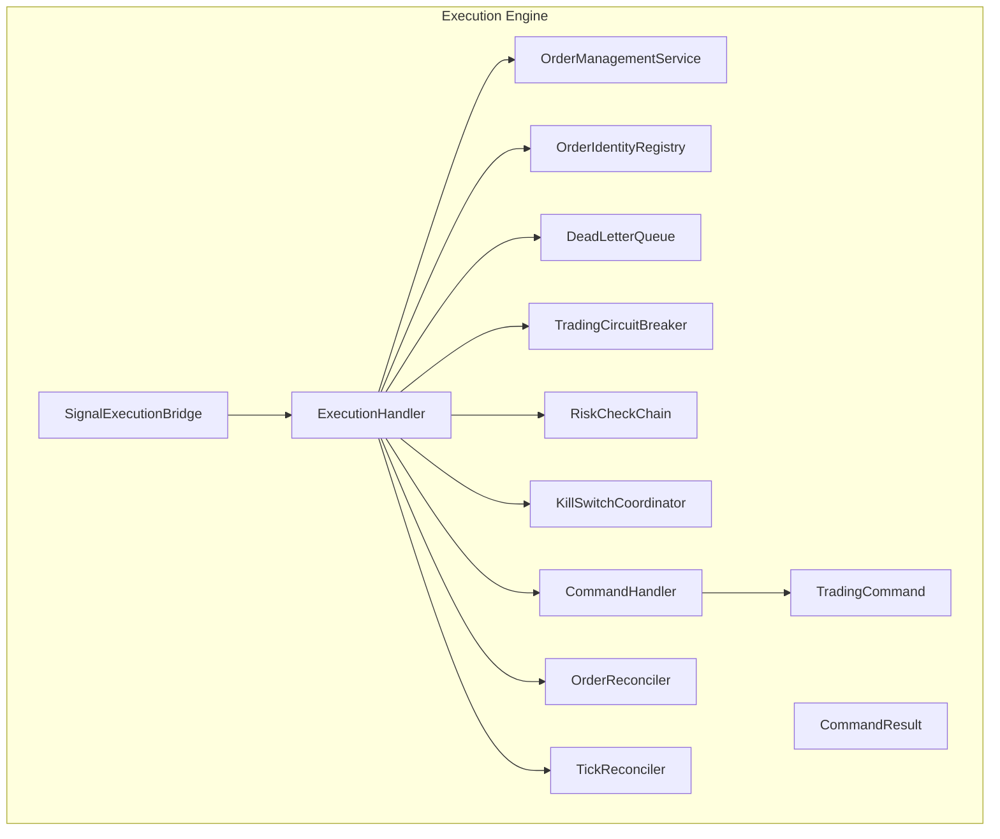
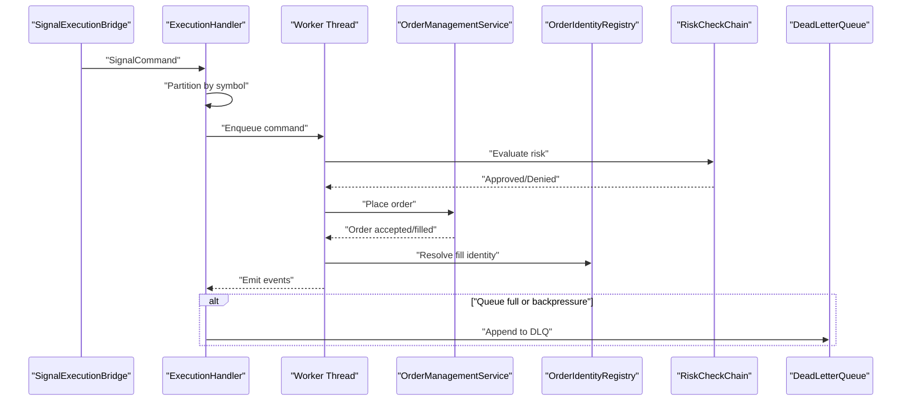
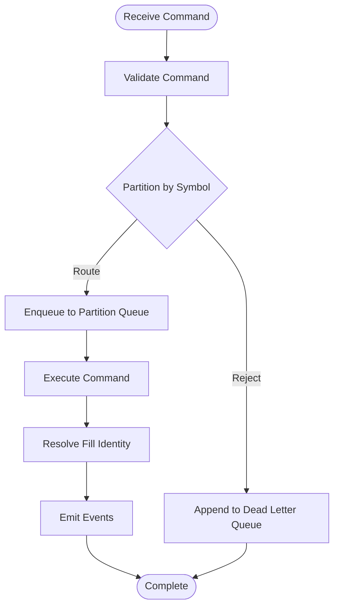
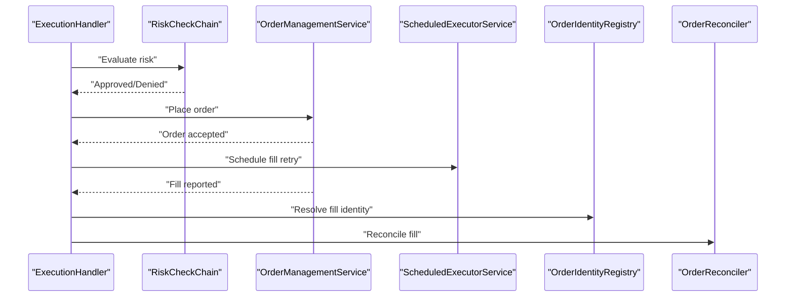
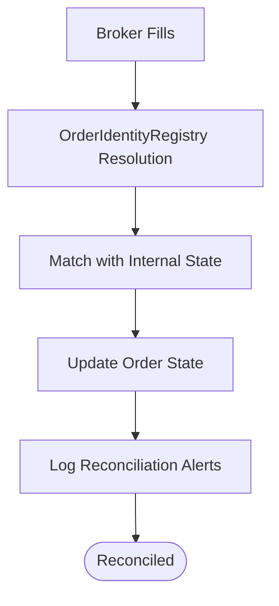
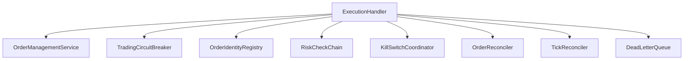

# Execution Engine

<cite>
**Referenced Files in This Document**
- [ExecutionHandler.java](file://trading/execution/src/main/java/com/tradej/execution/service/ExecutionHandler.java)
- [TradingCommand.java](file://trading/execution/src/main/java/com/tradej/execution/command/TradingCommand.java)
- [CommandHandler.java](file://trading/execution/src/main/java/com/tradej/execution/command/CommandHandler.java)
- [OrderManagementService.java](file://trading/execution/src/main/java/com/tradej/execution/service/OrderManagementService.java)
- [TradingCircuitBreaker.java](file://trading/execution/src/main/java/com/tradej/execution/service/TradingCircuitBreaker.java)
- [SignalExecutionBridge.java](file://trading/execution/src/main/java/com/tradej/execution/bridge/SignalExecutionBridge.java)
- [OrderIdentityRegistry.java](file://trading/execution/src/main/java/com/tradej/execution/identity/OrderIdentityRegistry.java)
- [DeadLetterQueue.java](file://trading/execution/src/main/java/com/tradej/execution/service/DeadLetterQueue.java)
- [ExecutionHandlerPartitioningTest.java](file://trading/execution/src/test/java/com/tradej/execution/service/ExecutionHandlerPartitioningTest.java)
- [ExecutionHandlerStressTest.java](file://trading/execution/src/test/java/com/tradej/execution/service/ExecutionHandlerStressTest.java)
- [ExecutionHandlerUnitTest.java](file://trading/execution/src/test/java/com/tradej/execution/service/ExecutionHandlerUnitTest.java)
- [OrderReconciler.java](file://trading/execution/src/main/java/com/tradej/execution/reconcile/OrderReconciler.java)
- [TickReconciler.java](file://trading/execution/src/main/java/com/tradej/execution/reconcile/TickReconciler.java)
- [RiskCheckChain.java](file://trading/execution/src/main/java/com/tradej/execution/risk/RiskCheckChain.java)
- [KillSwitchCoordinator.java](file://trading/execution/src/main/java/com/tradej/execution/risk/KillSwitchCoordinator.java)
- [REACTIVE_ADOPTION_REVIEW_2026-06-06.md](file://docs/reports/REACTIVE_ADOPTION_REVIEW_2026-06-06.md)
- [ARCHITECTURE_REVIEW_2026-06-06.md](file://docs/reports/ARCHITECTURE_REVIEW_2026-06-06.md)
- [CODE_LEVEL_REVIEW.md](file://docs/archive/CODE_LEVEL_REVIEW.md)
- [PRODUCTION_HARDENING_PLAN_2026-06-06.md](file://docs/PRODUCTION_HARDENING_PLAN_2026-06-06.md)
</cite>

## Table of Contents
1. [Introduction](#introduction)
2. [Project Structure](#project-structure)
3. [Core Components](#core-components)
4. [Architecture Overview](#architecture-overview)
5. [Detailed Component Analysis](#detailed-component-analysis)
6. [Dependency Analysis](#dependency-analysis)
7. [Performance Considerations](#performance-considerations)
8. [Troubleshooting Guide](#troubleshooting-guide)
9. [Conclusion](#conclusion)
10. [Appendices](#appendices)

## Introduction
This document describes the Execution Engine subsystem responsible for transforming trading signals into broker orders, managing execution queues, enforcing risk controls, and reconciling fills. It explains the ExecutionHandler architecture with partitioned processing, queue management, and concurrent execution. It documents the command processing pipeline for SignalCommand, FillCommand, and BrokerFillCommand, along with symbol-based routing, thread pool management, circuit breaker integration, execution queuing, and backpressure handling. It also covers signal processing workflows, order execution flows, fill reconciliation mechanisms, integration with OrderManagementService, event emission patterns, and dead letter queue handling. Finally, it provides configuration examples, performance tuning guidance, and troubleshooting steps for execution issues.

## Project Structure
The Execution Engine resides under trading/execution and includes:
- service: ExecutionHandler, OrderManagementService, TradingCircuitBreaker
- command: TradingCommand, CommandHandler, CommandResult
- bridge: SignalExecutionBridge
- identity: OrderIdentityRegistry
- reconcile: OrderReconciler, TickReconciler
- risk: RiskCheckChain, KillSwitchCoordinator
- node: OmsNode, RiskNode
- journal: OrderEventJournal
- depth: Depth analytics services
- subscription: SubscriptionCoordinator, SubscriptionManager, SubscriptionRecoveryManager
- pnl: LivePnlService
- position: EventSourcedNetPositionProvider
- readmodel: ReadModelStore

**Diagram sources**
- [ExecutionHandler.java](file://trading/execution/src/main/java/com/tradej/execution/service/ExecutionHandler.java)
- [OrderManagementService.java](file://trading/execution/src/main/java/com/tradej/execution/service/OrderManagementService.java)
- [TradingCircuitBreaker.java](file://trading/execution/src/main/java/com/tradej/execution/service/TradingCircuitBreaker.java)
- [OrderIdentityRegistry.java](file://trading/execution/src/main/java/com/tradej/execution/identity/OrderIdentityRegistry.java)
- [DeadLetterQueue.java](file://trading/execution/src/main/java/com/tradej/execution/service/DeadLetterQueue.java)
- [SignalExecutionBridge.java](file://trading/execution/src/main/java/com/tradej/execution/bridge/SignalExecutionBridge.java)
- [RiskCheckChain.java](file://trading/execution/src/main/java/com/tradej/execution/risk/RiskCheckChain.java)
- [KillSwitchCoordinator.java](file://trading/execution/src/main/java/com/tradej/execution/risk/KillSwitchCoordinator.java)
- [CommandHandler.java](file://trading/execution/src/main/java/com/tradej/execution/command/CommandHandler.java)
- [TradingCommand.java](file://trading/execution/src/main/java/com/tradej/execution/command/TradingCommand.java)
- [OrderReconciler.java](file://trading/execution/src/main/java/com/tradej/execution/reconcile/OrderReconciler.java)
- [TickReconciler.java](file://trading/execution/src/main/java/com/tradej/execution/reconcile/TickReconciler.java)

**Section sources**
- [ExecutionHandler.java](file://trading/execution/src/main/java/com/tradej/execution/service/ExecutionHandler.java)
- [OrderManagementService.java](file://trading/execution/src/main/java/com/tradej/execution/service/OrderManagementService.java)
- [TradingCircuitBreaker.java](file://trading/execution/src/main/java/com/tradej/execution/service/TradingCircuitBreaker.java)
- [OrderIdentityRegistry.java](file://trading/execution/src/main/java/com/tradej/execution/identity/OrderIdentityRegistry.java)
- [DeadLetterQueue.java](file://trading/execution/src/main/java/com/tradej/execution/service/DeadLetterQueue.java)
- [SignalExecutionBridge.java](file://trading/execution/src/main/java/com/tradej/execution/bridge/SignalExecutionBridge.java)
- [RiskCheckChain.java](file://trading/execution/src/main/java/com/tradej/execution/risk/RiskCheckChain.java)
- [KillSwitchCoordinator.java](file://trading/execution/src/main/java/com/tradej/execution/risk/KillSwitchCoordinator.java)
- [CommandHandler.java](file://trading/execution/src/main/java/com/tradej/execution/command/CommandHandler.java)
- [TradingCommand.java](file://trading/execution/src/main/java/com/tradej/execution/command/TradingCommand.java)
- [OrderReconciler.java](file://trading/execution/src/main/java/com/tradej/execution/reconcile/OrderReconciler.java)
- [TickReconciler.java](file://trading/execution/src/main/java/com/tradej/execution/reconcile/TickReconciler.java)

## Core Components
- ExecutionHandler: Central execution orchestrator with queue management, command processing, circuit breaker integration, and partitioned worker pools.
- OrderManagementService: Places broker orders and manages order lifecycle with timeouts and retries.
- TradingCircuitBreaker: Enforces execution limits and prevents overload.
- OrderIdentityRegistry: Resolves fill identity across multiple sources.
- SignalExecutionBridge: Bridges signals from the pipeline to the execution engine.
- CommandHandler and TradingCommand: Defines the command abstraction and handlers for processing.
- RiskCheckChain and KillSwitchCoordinator: Enforce risk policies and emergency stops.
- OrderReconciler and TickReconciler: Reconcile broker fills with internal state.
- DeadLetterQueue: Captures rejected or failed execution commands.

Key implementation references:
- ExecutionHandler architecture and queue behavior
- Command processing pipeline and backpressure handling
- Circuit breaker integration and timeouts
- Identity resolution and reconciliation mechanisms
- Risk enforcement and kill switch coordination

**Section sources**
- [ExecutionHandler.java](file://trading/execution/src/main/java/com/tradej/execution/service/ExecutionHandler.java)
- [OrderManagementService.java](file://trading/execution/src/main/java/com/tradej/execution/service/OrderManagementService.java)
- [TradingCircuitBreaker.java](file://trading/execution/src/main/java/com/tradej/execution/service/TradingCircuitBreaker.java)
- [OrderIdentityRegistry.java](file://trading/execution/src/main/java/com/tradej/execution/identity/OrderIdentityRegistry.java)
- [SignalExecutionBridge.java](file://trading/execution/src/main/java/com/tradej/execution/bridge/SignalExecutionBridge.java)
- [CommandHandler.java](file://trading/execution/src/main/java/com/tradej/execution/command/CommandHandler.java)
- [TradingCommand.java](file://trading/execution/src/main/java/com/tradej/execution/command/TradingCommand.java)
- [OrderReconciler.java](file://trading/execution/src/main/java/com/tradej/execution/reconcile/OrderReconciler.java)
- [TickReconciler.java](file://trading/execution/src/main/java/com/tradej/execution/reconcile/TickReconciler.java)
- [RiskCheckChain.java](file://trading/execution/src/main/java/com/tradej/execution/risk/RiskCheckChain.java)
- [KillSwitchCoordinator.java](file://trading/execution/src/main/java/com/tradej/execution/risk/KillSwitchCoordinator.java)

## Architecture Overview
The Execution Engine processes trading signals and fills through a structured pipeline:
- Signals enter via SignalExecutionBridge and are enqueued in ExecutionHandler.
- ExecutionHandler partitions work by symbol and routes commands to worker threads.
- Commands are processed sequentially per partition to maintain ordering and auditability.
- OrderManagementService places orders with timeouts and schedules fill retries.
- OrderIdentityRegistry resolves fills and prevents duplicates.
- RiskCheckChain and KillSwitchCoordinator enforce safety policies.
- OrderReconciler and TickReconciler reconcile broker fills with internal state.
- DeadLetterQueue captures overflow and failure cases.

**Diagram sources**
- [SignalExecutionBridge.java](file://trading/execution/src/main/java/com/tradej/execution/bridge/SignalExecutionBridge.java)
- [ExecutionHandler.java](file://trading/execution/src/main/java/com/tradej/execution/service/ExecutionHandler.java)
- [OrderManagementService.java](file://trading/execution/src/main/java/com/tradej/execution/service/OrderManagementService.java)
- [OrderIdentityRegistry.java](file://trading/execution/src/main/java/com/tradej/execution/identity/OrderIdentityRegistry.java)
- [RiskCheckChain.java](file://trading/execution/src/main/java/com/tradej/execution/risk/RiskCheckChain.java)
- [DeadLetterQueue.java](file://trading/execution/src/main/java/com/tradej/execution/service/DeadLetterQueue.java)

## Detailed Component Analysis

### ExecutionHandler: Partitioned Processing and Queue Management
ExecutionHandler is the central orchestrator with:
- Per-partition worker threads keyed by symbol hash.
- Bounded queues per partition to prevent head-of-line blocking.
- Circuit breaker integration to throttle execution under stress.
- Dead letter queue handling for backpressure and overflow.
- Scheduled retries for fill reconciliation.

Partitioning strategy:
- Partitions are determined by symbol.hashCode() % N, where N is the number of worker threads.
- Each partition maintains its own queue and worker thread.
- Commands are routed to the appropriate partition based on symbol.

Queue management:
- Each partition has a bounded queue to control memory and latency.
- When a queue is full, new commands are rejected and sent to the dead letter queue.
- Downstream consumers receive suppression notifications for dropped signals.

Concurrency model:
- Single-threaded per partition ensures ordering guarantees for the same symbol.
- Worker threads are scheduled via a thread pool with daemon threads to avoid blocking shutdown.

Backpressure handling:
- Rejection at ingress when partitions are saturated.
- Dead letter queue captures rejected commands for later inspection.
- Downstream suppression signals inform upstream components to reduce load.

Circuit breaker integration:
- ExecutionHandler integrates TradingCircuitBreaker to limit execution rate and detect overload conditions.
- Circuit breaker state influences whether commands are accepted or rejected.

**Section sources**
- [ExecutionHandler.java](file://trading/execution/src/main/java/com/tradej/execution/service/ExecutionHandler.java)
- [TradingCircuitBreaker.java](file://trading/execution/src/main/java/com/tradej/execution/service/TradingCircuitBreaker.java)
- [DeadLetterQueue.java](file://trading/execution/src/main/java/com/tradej/execution/service/DeadLetterQueue.java)
- [ExecutionHandlerPartitioningTest.java](file://trading/execution/src/test/java/com/tradej/execution/service/ExecutionHandlerPartitioningTest.java)
- [ExecutionHandlerStressTest.java](file://trading/execution/src/test/java/com/tradej/execution/service/ExecutionHandlerStressTest.java)
- [ExecutionHandlerUnitTest.java](file://trading/execution/src/test/java/com/tradej/execution/service/ExecutionHandlerUnitTest.java)
- [REACTIVE_ADOPTION_REVIEW_2026-06-06.md](file://docs/reports/REACTIVE_ADOPTION_REVIEW_2026-06-06.md)
- [ARCHITECTURE_REVIEW_2026-06-06.md](file://docs/reports/ARCHITECTURE_REVIEW_2026-06-06.md)
- [CODE_LEVEL_REVIEW.md](file://docs/archive/CODE_LEVEL_REVIEW.md)

### Command Processing Pipeline: SignalCommand, FillCommand, BrokerFillCommand
The command processing pipeline handles three primary command types:
- SignalCommand: Generated from incoming signals, enqueued for execution.
- FillCommand: Represents internal fill events requiring reconciliation.
- BrokerFillCommand: Represents broker-reported fills to be resolved and reconciled.

Processing logic:
- Each command is validated and routed to the appropriate partition by symbol.
- Commands are executed sequentially within a partition to preserve ordering.
- Fill identity is resolved using OrderIdentityRegistry to prevent duplicates.
- After successful execution, events are emitted and reconcilers update internal state.

**Diagram sources**
- [ExecutionHandler.java](file://trading/execution/src/main/java/com/tradej/execution/service/ExecutionHandler.java)
- [OrderIdentityRegistry.java](file://trading/execution/src/main/java/com/tradej/execution/identity/OrderIdentityRegistry.java)

**Section sources**
- [ExecutionHandler.java](file://trading/execution/src/main/java/com/tradej/execution/service/ExecutionHandler.java)
- [OrderIdentityRegistry.java](file://trading/execution/src/main/java/com/tradej/execution/identity/OrderIdentityRegistry.java)

### Order Execution Flow and Timeout Management
Order execution follows a strict flow:
- ExecutionHandler evaluates risk via RiskCheckChain and KillSwitchCoordinator.
- Approved commands trigger OrderManagementService to place orders.
- Orders are placed asynchronously with a bounded timeout.
- Fill retries are scheduled via a separate scheduler to handle broker delays.
- On completion, events are emitted and reconcilers reconcile fills.

**Diagram sources**
- [ExecutionHandler.java](file://trading/execution/src/main/java/com/tradej/execution/service/ExecutionHandler.java)
- [RiskCheckChain.java](file://trading/execution/src/main/java/com/tradej/execution/risk/RiskCheckChain.java)
- [OrderManagementService.java](file://trading/execution/src/main/java/com/tradej/execution/service/OrderManagementService.java)
- [OrderIdentityRegistry.java](file://trading/execution/src/main/java/com/tradej/execution/identity/OrderIdentityRegistry.java)
- [OrderReconciler.java](file://trading/execution/src/main/java/com/tradej/execution/reconcile/OrderReconciler.java)

**Section sources**
- [ExecutionHandler.java](file://trading/execution/src/main/java/com/tradej/execution/service/ExecutionHandler.java)
- [RiskCheckChain.java](file://trading/execution/src/main/java/com/tradej/execution/risk/RiskCheckChain.java)
- [OrderManagementService.java](file://trading/execution/src/main/java/com/tradej/execution/service/OrderManagementService.java)
- [OrderIdentityRegistry.java](file://trading/execution/src/main/java/com/tradej/execution/identity/OrderIdentityRegistry.java)
- [OrderReconciler.java](file://trading/execution/src/main/java/com/tradej/execution/reconcile/OrderReconciler.java)

### Fill Reconciliation Mechanisms
Fill reconciliation ensures internal state matches broker reports:
- OrderReconciler compares broker fills with internal order state.
- TickReconciler aligns tick-level data with order book and fills.
- OrderIdentityRegistry resolves duplicate fills and maintains uniqueness.
- Reconciliation alerts are logged for anomalies.

**Diagram sources**
- [OrderReconciler.java](file://trading/execution/src/main/java/com/tradej/execution/reconcile/OrderReconciler.java)
- [TickReconciler.java](file://trading/execution/src/main/java/com/tradej/execution/reconcile/TickReconciler.java)
- [OrderIdentityRegistry.java](file://trading/execution/src/main/java/com/tradej/execution/identity/OrderIdentityRegistry.java)

**Section sources**
- [OrderReconciler.java](file://trading/execution/src/main/java/com/tradej/execution/reconcile/OrderReconciler.java)
- [TickReconciler.java](file://trading/execution/src/main/java/com/tradej/execution/reconcile/TickReconciler.java)
- [OrderIdentityRegistry.java](file://trading/execution/src/main/java/com/tradej/execution/identity/OrderIdentityRegistry.java)

### Integration with OrderManagementService and Event Emission
- ExecutionHandler delegates order placement to OrderManagementService.
- Events are emitted upon order acceptance, partial fills, and completions.
- Event emission is coordinated to preserve ordering and auditability.
- Dead letter queue captures failures for later inspection.

**Section sources**
- [ExecutionHandler.java](file://trading/execution/src/main/java/com/tradej/execution/service/ExecutionHandler.java)
- [OrderManagementService.java](file://trading/execution/src/main/java/com/tradej/execution/service/OrderManagementService.java)
- [DeadLetterQueue.java](file://trading/execution/src/main/java/com/tradej/execution/service/DeadLetterQueue.java)

### Dead Letter Queue Handling
- When queues are full or backpressure is triggered, commands are appended to the dead letter queue.
- Downstream consumers receive suppression signals indicating dropped commands.
- DLQ entries are inspected for root cause analysis and remediation.

**Section sources**
- [ExecutionHandler.java](file://trading/execution/src/main/java/com/tradej/execution/service/ExecutionHandler.java)
- [DeadLetterQueue.java](file://trading/execution/src/main/java/com/tradej/execution/service/DeadLetterQueue.java)

## Dependency Analysis
ExecutionHandler depends on several core services and utilities:
- OrderManagementService: Places orders and manages lifecycle.
- TradingCircuitBreaker: Enforces execution limits.
- OrderIdentityRegistry: Resolves fill identity.
- RiskCheckChain and KillSwitchCoordinator: Enforce risk and emergency stops.
- OrderReconciler and TickReconciler: Reconcile fills.
- DeadLetterQueue: Capture rejected commands.

**Diagram sources**
- [ExecutionHandler.java](file://trading/execution/src/main/java/com/tradej/execution/service/ExecutionHandler.java)
- [OrderManagementService.java](file://trading/execution/src/main/java/com/tradej/execution/service/OrderManagementService.java)
- [TradingCircuitBreaker.java](file://trading/execution/src/main/java/com/tradej/execution/service/TradingCircuitBreaker.java)
- [OrderIdentityRegistry.java](file://trading/execution/src/main/java/com/tradej/execution/identity/OrderIdentityRegistry.java)
- [RiskCheckChain.java](file://trading/execution/src/main/java/com/tradej/execution/risk/RiskCheckChain.java)
- [KillSwitchCoordinator.java](file://trading/execution/src/main/java/com/tradej/execution/risk/KillSwitchCoordinator.java)
- [OrderReconciler.java](file://trading/execution/src/main/java/com/tradej/execution/reconcile/OrderReconciler.java)
- [TickReconciler.java](file://trading/execution/src/main/java/com/tradej/execution/reconcile/TickReconciler.java)
- [DeadLetterQueue.java](file://trading/execution/src/main/java/com/tradej/execution/service/DeadLetterQueue.java)

**Section sources**
- [ExecutionHandler.java](file://trading/execution/src/main/java/com/tradej/execution/service/ExecutionHandler.java)
- [OrderManagementService.java](file://trading/execution/src/main/java/com/tradej/execution/service/OrderManagementService.java)
- [TradingCircuitBreaker.java](file://trading/execution/src/main/java/com/tradej/execution/service/TradingCircuitBreaker.java)
- [OrderIdentityRegistry.java](file://trading/execution/src/main/java/com/tradej/execution/identity/OrderIdentityRegistry.java)
- [RiskCheckChain.java](file://trading/execution/src/main/java/com/tradej/execution/risk/RiskCheckChain.java)
- [KillSwitchCoordinator.java](file://trading/execution/src/main/java/com/tradej/execution/risk/KillSwitchCoordinator.java)
- [OrderReconciler.java](file://trading/execution/src/main/java/com/tradej/execution/reconcile/OrderReconciler.java)
- [TickReconciler.java](file://trading/execution/src/main/java/com/tradej/execution/reconcile/TickReconciler.java)
- [DeadLetterQueue.java](file://trading/execution/src/main/java/com/tradej/execution/service/DeadLetterQueue.java)

## Performance Considerations
- Partitioning by symbol: Use symbol.hashCode() % N to distribute load across N worker threads. This reduces contention and improves throughput during high-volume market events.
- Queue sizing: Increase partition queue capacity from the current small size to handle bursts. Consider configurable capacities to adapt to workload.
- Circuit breaker tuning: Adjust thresholds to prevent overload while maintaining responsiveness. Monitor breaker state and rejection rates.
- Timeout configuration: Tune order placement timeouts to match broker SLAs and reduce stalled queue slots.
- Backpressure strategy: Prefer rejecting at ingress and using DLQ over dropping silently. Add per-partition queue-depth metrics to guide upstream throttling.
- Concurrency model: Keep single-threaded per partition to preserve ordering. Avoid fan-out primitives that break ordering guarantees.

[No sources needed since this section provides general guidance]

## Troubleshooting Guide
Common execution issues and resolutions:
- Execution queue full: Indicates insufficient queue capacity or broker slowness. Increase queue sizes or add more partitions. Monitor DLQ for suppressed signals.
- Silent signal loss: Occurs when the queue is saturated. Implement upstream throttling and per-partition metrics to detect saturation early.
- Stalled order placement: Long-running broker operations block queue slots. Reduce timeouts or increase worker threads per partition.
- Duplicate fills: Verify OrderIdentityRegistry resolution and reconciliation logs. Ensure deduplication logic is active.
- Risk denials: Review RiskCheckChain and KillSwitchCoordinator configurations. Adjust thresholds or temporarily lift restrictions for testing.
- Reconciliation drift: Inspect OrderReconciler and TickReconciler logs. Validate broker feed and internal state alignment.

**Section sources**
- [ExecutionHandler.java](file://trading/execution/src/main/java/com/tradej/execution/service/ExecutionHandler.java)
- [OrderReconciler.java](file://trading/execution/src/main/java/com/tradej/execution/reconcile/OrderReconciler.java)
- [TickReconciler.java](file://trading/execution/src/main/java/com/tradej/execution/reconcile/TickReconciler.java)
- [OrderIdentityRegistry.java](file://trading/execution/src/main/java/com/tradej/execution/identity/OrderIdentityRegistry.java)
- [RiskCheckChain.java](file://trading/execution/src/main/java/com/tradej/execution/risk/RiskCheckChain.java)
- [KillSwitchCoordinator.java](file://trading/execution/src/main/java/com/tradej/execution/risk/KillSwitchCoordinator.java)

## Conclusion
The Execution Engine provides a robust, partitioned execution pipeline that balances throughput, ordering guarantees, and safety. By leveraging symbol-based partitioning, bounded queues, circuit breakers, and comprehensive reconciliation, it maintains reliability under stress. Tuning queue sizes, partition counts, and timeouts, combined with careful monitoring and DLQ inspection, enables effective operation in live trading environments.

[No sources needed since this section summarizes without analyzing specific files]

## Appendices

### Configuration Examples
- Partition count: Configure N worker threads for symbol partitioning.
- Queue capacity: Set per-partition queue sizes based on expected burst volumes.
- Circuit breaker thresholds: Define rate limits and detection windows.
- Timeout settings: Align order placement timeouts with broker SLAs.
- Dead letter queue retention: Configure DLQ retention and alerting policies.

**Section sources**
- [ExecutionHandler.java](file://trading/execution/src/main/java/com/tradej/execution/service/ExecutionHandler.java)
- [TradingCircuitBreaker.java](file://trading/execution/src/main/java/com/tradej/execution/service/TradingCircuitBreaker.java)
- [PRODUCTION_HARDENING_PLAN_2026-06-06.md](file://docs/PRODUCTION_HARDENING_PLAN_2026-06-06.md)

### Performance Tuning Checklist
- Confirm partition count matches symbol diversity and broker capacity.
- Validate queue capacities against observed peak throughput.
- Monitor circuit breaker state and adjust thresholds as needed.
- Measure order placement latency and tune timeouts accordingly.
- Track DLQ growth and implement upstream backpressure controls.

**Section sources**
- [ExecutionHandler.java](file://trading/execution/src/main/java/com/tradej/execution/service/ExecutionHandler.java)
- [TradingCircuitBreaker.java](file://trading/execution/src/main/java/com/tradej/execution/service/TradingCircuitBreaker.java)
- [REACTIVE_ADOPTION_REVIEW_2026-06-06.md](file://docs/reports/REACTIVE_ADOPTION_REVIEW_2026-06-06.md)
- [ARCHITECTURE_REVIEW_2026-06-06.md](file://docs/reports/ARCHITECTURE_REVIEW_2026-06-06.md)