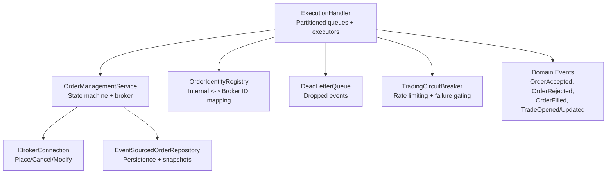
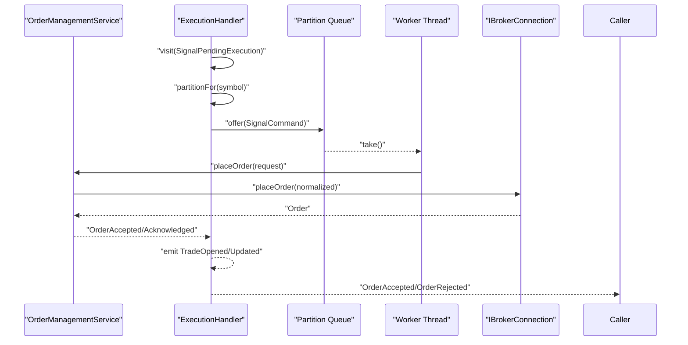
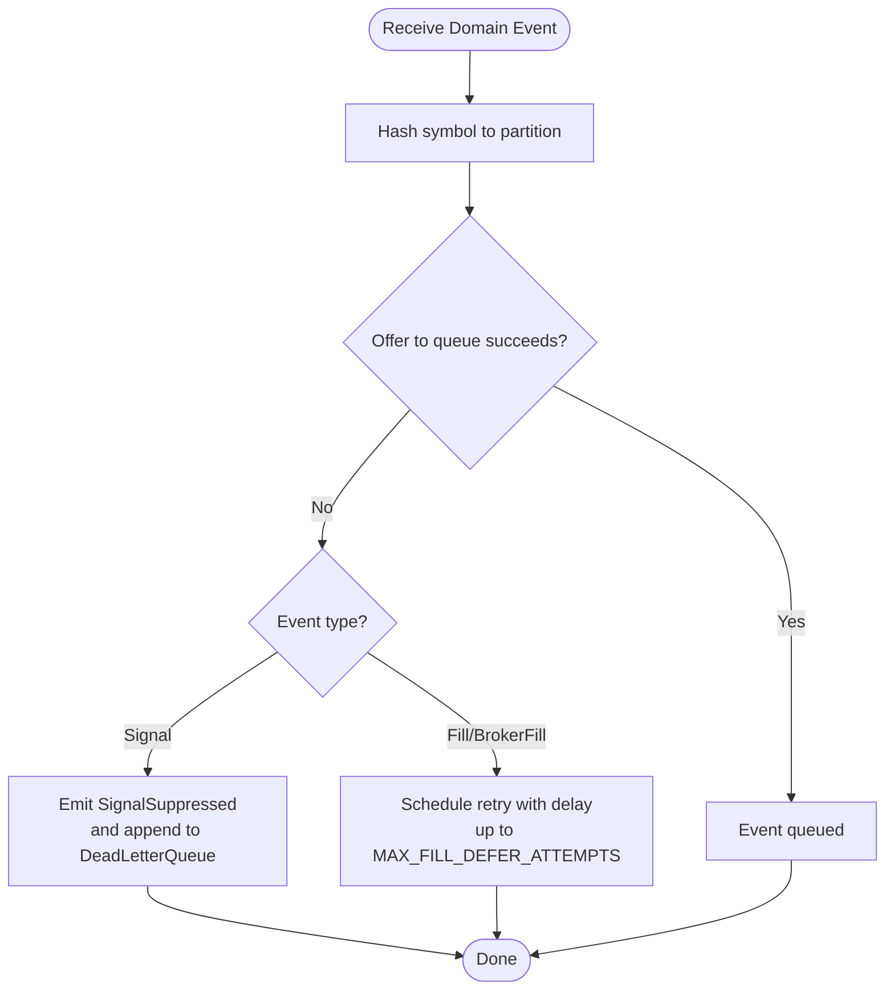
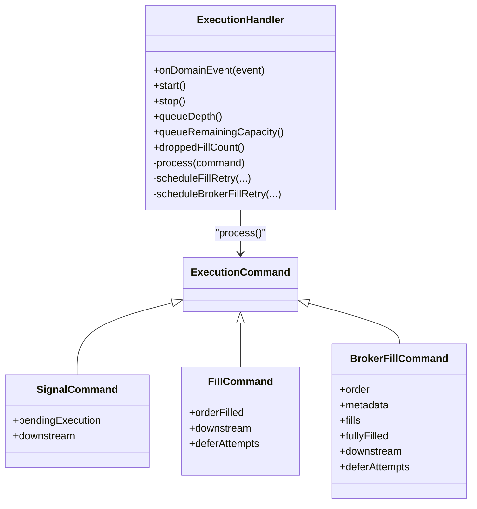
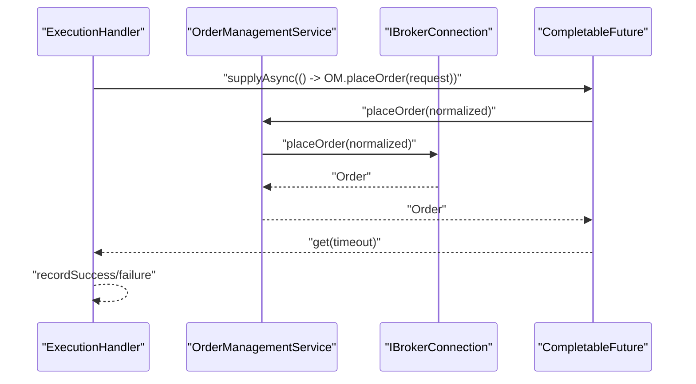
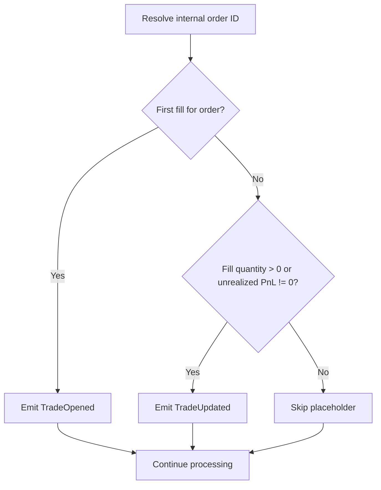
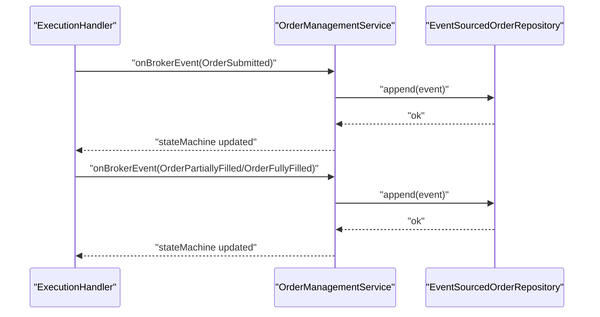
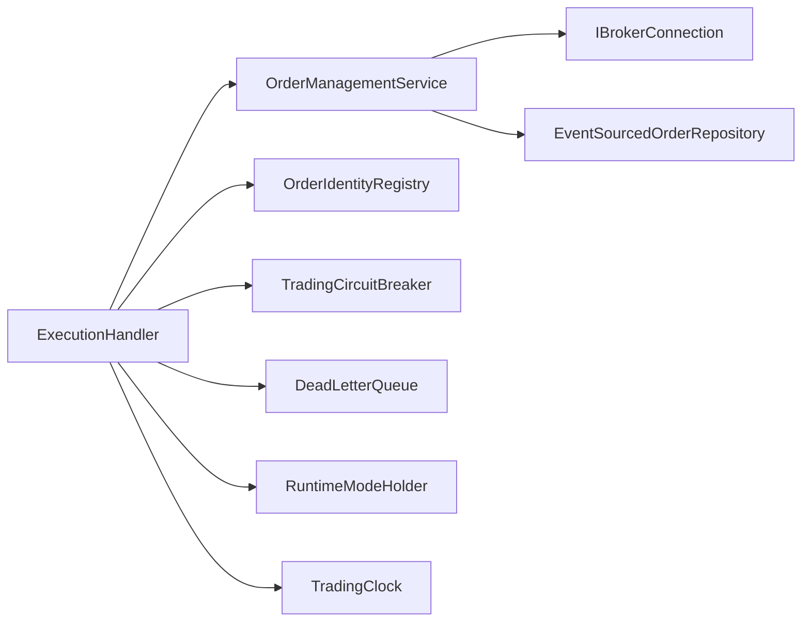

# Order Execution Processing

<cite>
**Referenced Files in This Document**
- [ExecutionHandler.java](file://trading/execution/src/main/java/com/tradej/execution/service/ExecutionHandler.java)
- [OrderManagementService.java](file://trading/execution/src/main/java/com/tradej/execution/service/OrderManagementService.java)
- [TradingCircuitBreaker.java](file://trading/execution/src/main/java/com/tradej/execution/service/TradingCircuitBreaker.java)
- [OrderIdentityRegistry.java](file://trading/execution/src/main/java/com/tradej/execution/identity/OrderIdentityRegistry.java)
- [DeadLetterQueue.java](file://tradej/core/domain/port/DeadLetterQueue.java)
- [Order.java](file://core/src/main/java/com/tradej/core/domain/model/Order.java)
- [OrderRequest.java](file://core/src/main/java/com/tradej/core/domain/model/OrderRequest.java)
- [OrderFilled.java](file://core/src/main/java/com/tradej/core/domain/event/OrderFilled.java)
- [OrderPartiallyFilled.java](file://core/src/main/java/com/tradej/core/domain/event/OrderPartiallyFilled.java)
- [OrderFullyFilled.java](file://core/src/main/java/com/tradej/core/domain/event/OrderFullyFilled.java)
- [OrderAccepted.java](file://core/src/main/java/com/tradej/core/domain/event/OrderAccepted.java)
- [OrderRejected.java](file://core/src/main/java/com/tradej/core/domain/event/OrderRejected.java)
- [SignalPendingExecution.java](file://core/src/main/java/com/tradej/core/domain/event/SignalPendingExecution.java)
- [SignalSuppressed.java](file://core/src/main/java/com/tradej/core/domain/event/SignalSuppressed.java)
- [KillSwitchEngaged.java](file://core/src/main/java/com/tradej/core/domain/event/KillSwitchEngaged.java)
- [TradeOpened.java](file://core/src/main/java/com/tradej/core/domain/event/TradeOpened.java)
- [TradeUpdated.java](file://core/src/main/java/com/tradej/core/domain/event/TradeUpdated.java)
- [IBrokerConnection.java](file://broker/api/src/main/java/com/tradej/broker/api/port/IBrokerConnection.java)
- [EventSourcedOrderRepository.java](file://persistence/oms/src/main/java/com/tradej/persistence/oms/EventSourcedOrderRepository.java)
- [TradingClock.java](file://core/src/main/java/com/tradej/core/domain/time/TradingClock.java)
- [RuntimeModeHolder.java](file://core/src/main/java/com/tradej/core/domain/runtime/RuntimeModeHolder.java)
- [FillReconciliation.java](file://core/src/main/java/com/tradej/core/domain/value/FillReconciliation.java)
</cite>

## Table of Contents
1. [Introduction](#introduction)
2. [Project Structure](#project-structure)
3. [Core Components](#core-components)
4. [Architecture Overview](#architecture-overview)
5. [Detailed Component Analysis](#detailed-component-analysis)
6. [Dependency Analysis](#dependency-analysis)
7. [Performance Considerations](#performance-considerations)
8. [Troubleshooting Guide](#troubleshooting-guide)
9. [Conclusion](#conclusion)
10. [Appendices](#appendices)

## Introduction
This document explains the Order Execution Processing subsystem with a focus on the ExecutionHandler architecture. It covers the partitioned processing model, queue management, concurrent execution, and the three execution command types: SignalCommand for incoming signals, FillCommand for broker fills, and BrokerFillCommand for comprehensive fill updates. It also documents symbol-based partitioning, thread pool management, queue capacity controls, order placement timeouts, completion stage handling, backpressure management, integration with OrderManagementService, and event emission patterns.

## Project Structure
The execution subsystem resides under trading/execution and is composed of:
- Service layer: ExecutionHandler, OrderManagementService, TradingCircuitBreaker
- Identity and registry: OrderIdentityRegistry
- Persistence and repositories: EventSourcedOrderRepository
- Domain models and events: Order, OrderRequest, OrderFilled, OrderPartiallyFilled, OrderFullyFilled, OrderAccepted, OrderRejected, SignalPendingExecution, SignalSuppressed, KillSwitchEngaged, TradeOpened, TradeUpdated
- Infrastructure: DeadLetterQueue, IBrokerConnection, TradingClock, RuntimeModeHolder, FillReconciliation

**Diagram sources**
- [ExecutionHandler.java:52-229](file://trading/execution/src/main/java/com/tradej/execution/service/ExecutionHandler.java#L52-L229)
- [OrderManagementService.java:44-87](file://trading/execution/src/main/java/com/tradej/execution/service/OrderManagementService.java#L44-L87)
- [OrderIdentityRegistry.java](file://trading/execution/src/main/java/com/tradej/execution/identity/OrderIdentityRegistry.java)
- [DeadLetterQueue.java](file://tradej/core/domain/port/DeadLetterQueue.java)
- [TradingCircuitBreaker.java](file://trading/execution/src/main/java/com/tradej/execution/service/TradingCircuitBreaker.java)
- [IBrokerConnection.java](file://broker/api/src/main/java/com/tradej/broker/api/port/IBrokerConnection.java)
- [EventSourcedOrderRepository.java](file://persistence/oms/src/main/java/com/tradej/persistence/oms/EventSourcedOrderRepository.java)

**Section sources**
- [ExecutionHandler.java:52-229](file://trading/execution/src/main/java/com/tradej/execution/service/ExecutionHandler.java#L52-L229)
- [OrderManagementService.java:44-87](file://trading/execution/src/main/java/com/tradej/execution/service/OrderManagementService.java#L44-L87)

## Core Components
- ExecutionHandler: Central orchestrator implementing DomainEventVisitor. Manages partitioned queues, single-threaded workers per partition, backpressure, retries, and event emission.
- OrderManagementService: Broker abstraction and order state machine manager. Validates lifecycle transitions, persists events, and coordinates broker interactions.
- OrderIdentityRegistry: Resolves internal order IDs to/from broker order IDs and signal correlation IDs.
- TradingCircuitBreaker: Prevents overload and protects downstream systems during failures.
- DeadLetterQueue: Captures suppressed or dropped events for diagnostics.
- Domain Events and Models: Represent order lifecycle and fills, enabling decoupled event-driven processing.

Key configuration defaults:
- Default queue capacity: 1000
- Default partition count: 4
- Default order placement timeout: 10 seconds
- Fill defer attempts and delay: governed by FillReconciliation constants

**Section sources**
- [ExecutionHandler.java:56-63](file://trading/execution/src/main/java/com/tradej/execution/service/ExecutionHandler.java#L56-L63)
- [ExecutionHandler.java:54-55](file://trading/execution/src/main/java/com/tradej/execution/service/ExecutionHandler.java#L54-L55)
- [FillReconciliation.java](file://core/src/main/java/com/tradej/core/domain/value/FillReconciliation.java)

## Architecture Overview
ExecutionHandler uses a symbol-partitioned, multi-queue, single-thread-per-partition design:
- Each symbol hashes to a partition index, ensuring same-symbol events are processed by the same executor.
- Each partition has its own bounded ArrayBlockingQueue and a dedicated single-thread executor.
- Incoming domain events are routed to the appropriate partition and enqueued as typed ExecutionCommand records.
- Workers dequeue and process commands synchronously, invoking OrderManagementService and emitting domain events.

**Diagram sources**
- [ExecutionHandler.java:317-332](file://trading/execution/src/main/java/com/tradej/execution/service/ExecutionHandler.java#L317-L332)
- [ExecutionHandler.java:491-562](file://trading/execution/src/main/java/com/tradej/execution/service/ExecutionHandler.java#L491-L562)
- [OrderManagementService.java:94-123](file://trading/execution/src/main/java/com/tradej/execution/service/OrderManagementService.java#L94-L123)
- [IBrokerConnection.java](file://broker/api/src/main/java/com/tradej/broker/api/port/IBrokerConnection.java)

## Detailed Component Analysis

### ExecutionHandler: Partitioned Processing and Backpressure
- Partitioning: Hash-based routing of symbol to partition index using absolute value of symbol hashCode modulo partitionCount.
- Queues: ArrayBlockingQueue per partition with tunable capacity; offers return false when full, triggering suppression or deferred retry.
- Executors: Single-thread executor per partition; workers run a take()-loop until shutdown.
- Backpressure: Immediate suppression with SignalSuppressed and fill defer scheduling with capped attempts and exponential-like delay via scheduled executor.
- Timeout: Order placement wrapped in CompletableFuture with bounded get(timeout) to avoid blocking workers indefinitely.
- Event emission: Uses a constructor-injected immutable downstream consumer with a ThreadLocal fallback for legacy APIs.

**Diagram sources**
- [ExecutionHandler.java:317-360](file://trading/execution/src/main/java/com/tradej/execution/service/ExecutionHandler.java#L317-L360)
- [ExecutionHandler.java:368-382](file://trading/execution/src/main/java/com/tradej/execution/service/ExecutionHandler.java#L368-L382)
- [ExecutionHandler.java:401-408](file://trading/execution/src/main/java/com/tradej/execution/service/ExecutionHandler.java#L401-L408)

**Section sources**
- [ExecutionHandler.java:362-366](file://trading/execution/src/main/java/com/tradej/execution/service/ExecutionHandler.java#L362-L366)
- [ExecutionHandler.java:317-360](file://trading/execution/src/main/java/com/tradej/execution/service/ExecutionHandler.java#L317-L360)
- [ExecutionHandler.java:368-432](file://trading/execution/src/main/java/com/tradej/execution/service/ExecutionHandler.java#L368-L432)
- [ExecutionHandler.java:663-678](file://trading/execution/src/main/java/com/tradej/execution/service/ExecutionHandler.java#L663-L678)

### Execution Commands: SignalCommand, FillCommand, BrokerFillCommand
- SignalCommand: Wraps SignalPendingExecution and downstream consumer; triggers order placement and emits OrderAccepted or OrderRejected.
- FillCommand: Wraps OrderFilled with deferAttempts; handles missing identity mapping and reconciles fill quantities against projections.
- BrokerFillCommand: Wraps Order, metadata, fills, fullyFilled flag, downstream, and deferAttempts; reconciles broker-reported fills and emits partial/filled events.

**Diagram sources**
- [ExecutionHandler.java:401-408](file://trading/execution/src/main/java/com/tradej/execution/service/ExecutionHandler.java#L401-L408)
- [ExecutionHandler.java:725-742](file://trading/execution/src/main/java/com/tradej/execution/service/ExecutionHandler.java#L725-L742)

**Section sources**
- [ExecutionHandler.java:725-742](file://trading/execution/src/main/java/com/tradej/execution/service/ExecutionHandler.java#L725-L742)

### Order Placement Timeout and Completion Stage Handling
- Place order via CompletableFuture supplied asynchronously to avoid blocking the single-threaded executor.
- get(timeout) ensures the worker does not hang; TimeoutException triggers cancellation and a runtime error.
- Circuit breaker records success or failure based on outcome.

**Diagram sources**
- [ExecutionHandler.java:663-678](file://trading/execution/src/main/java/com/tradej/execution/service/ExecutionHandler.java#L663-L678)
- [OrderManagementService.java:94-123](file://trading/execution/src/main/java/com/tradej/execution/service/OrderManagementService.java#L94-L123)

**Section sources**
- [ExecutionHandler.java:663-678](file://trading/execution/src/main/java/com/tradej/execution/service/ExecutionHandler.java#L663-L678)

### Event Emission Patterns and TradeOpened/Updated Guard
- First fill per internal order emits TradeOpened; subsequent fills emit TradeUpdated with guard to avoid zero-value placeholders.
- Synthetic OrderFilled emission occurs in simulated mode when applicable.

**Diagram sources**
- [ExecutionHandler.java:680-719](file://trading/execution/src/main/java/com/tradej/execution/service/ExecutionHandler.java#L680-L719)

**Section sources**
- [ExecutionHandler.java:680-719](file://trading/execution/src/main/java/com/tradej/execution/service/ExecutionHandler.java#L680-L719)

### Integration with OrderManagementService
- Order placement: Normalizes symbol, delegates to broker or simulated matching engine depending on runtime mode, and returns Order.
- Broker callbacks: onBrokerEvent persists and applies events to in-memory state machines; getOrderProjection provides current status for reconciliation.
- Cancellation and modification: Validates lifecycle state locally before forwarding to broker; prevents double-cancel and cancel-after-fill.

**Diagram sources**
- [OrderManagementService.java:218-295](file://trading/execution/src/main/java/com/tradej/execution/service/OrderManagementService.java#L218-L295)
- [EventSourcedOrderRepository.java](file://persistence/oms/src/main/java/com/tradej/persistence/oms/EventSourcedOrderRepository.java)

**Section sources**
- [OrderManagementService.java:94-123](file://trading/execution/src/main/java/com/tradej/execution/service/OrderManagementService.java#L94-L123)
- [OrderManagementService.java:218-295](file://trading/execution/src/main/java/com/tradej/execution/service/OrderManagementService.java#L218-L295)

## Dependency Analysis
- ExecutionHandler depends on OrderManagementService, OrderIdentityRegistry, TradingCircuitBreaker, DeadLetterQueue, RuntimeModeHolder, and TradingClock.
- OrderManagementService depends on IBrokerConnection, EventSourcedOrderRepository, SimulatedOrderService (optional), and TradingCircuitBreaker.
- Identity resolution bridges internal and broker order IDs and correlation IDs.
- DeadLetterQueue captures suppressed and dropped events for diagnostics.

**Diagram sources**
- [ExecutionHandler.java:74-87](file://trading/execution/src/main/java/com/tradej/execution/service/ExecutionHandler.java#L74-L87)
- [OrderManagementService.java:48-86](file://trading/execution/src/main/java/com/tradej/execution/service/OrderManagementService.java#L48-L86)

**Section sources**
- [ExecutionHandler.java:74-87](file://trading/execution/src/main/java/com/tradej/execution/service/ExecutionHandler.java#L74-L87)
- [OrderManagementService.java:48-86](file://trading/execution/src/main/java/com/tradej/execution/service/OrderManagementService.java#L48-L86)

## Performance Considerations
- Partition sizing: Increase partitionCount to reduce contention among symbols; ensure sufficient CPU cores and memory for per-partition queues and executors.
- Queue capacity: Tune DEFAULT_QUEUE_CAPACITY per workload; larger queues absorb bursts but increase latency and memory usage.
- Timeout tuning: Adjust DEFAULT_ORDER_PLACEMENT_TIMEOUT_MS to match broker responsiveness; shorter timeouts improve liveness but may increase retries.
- Fill defer strategy: MAX_FILL_DEFER_ATTEMPTS and FILL_DEFER_DELAY_MS balance backpressure and eventual consistency; monitor droppedFillCount.
- Circuit breaker: Use TradingCircuitBreaker to protect downstream systems under load; configure thresholds appropriately.
- Identity cache: tradeOpenedEmitted cache reduces memory footprint for emitted guards; tune size/expiry if needed.

[No sources needed since this section provides general guidance]

## Troubleshooting Guide
Common symptoms and actions:
- Execution queue full:
  - Symptom: Signals suppressed and SignalSuppressed emitted; queueDepth increases.
  - Actions: Increase queueCapacity, reduce partitionCount, or throttle upstream signals.
  - References: [ExecutionHandler.java:317-332](file://trading/execution/src/main/java/com/tradej/execution/service/ExecutionHandler.java#L317-L332)
- Fill drops after retries:
  - Symptom: Dropped fill count increments; broker fills eventually ignored.
  - Actions: Verify identity mapping, inspect broker connectivity, adjust defer attempts and delay.
  - References: [ExecutionHandler.java:368-382](file://trading/execution/src/main/java/com/tradej/execution/service/ExecutionHandler.java#L368-L382), [ExecutionHandler.java:410-432](file://trading/execution/src/main/java/com/tradej/execution/service/ExecutionHandler.java#L410-L432)
- Order placement timeout:
  - Symptom: TimeoutException logged; SignalSuppressed emitted.
  - Actions: Increase timeout, investigate broker latency, enable circuit breaker.
  - References: [ExecutionHandler.java:663-678](file://trading/execution/src/main/java/com/tradej/execution/service/ExecutionHandler.java#L663-L678)
- Zero-qty fill updates:
  - Symptom: No TradeUpdated emitted for zero fill quantity.
  - Actions: Expected behavior; ensure downstream logic handles zero-qty scenarios.
  - References: [ExecutionHandler.java:680-719](file://trading/execution/src/main/java/com/tradej/execution/service/ExecutionHandler.java#L680-L719)
- Identity resolution failures:
  - Symptom: Missing internal order ID; fill deferred or dropped.
  - Actions: Confirm OrderIdentityRegistry registration and acknowledgment; verify correlation IDs.
  - References: [ExecutionHandler.java:629-638](file://trading/execution/src/main/java/com/tradej/execution/service/ExecutionHandler.java#L629-L638), [OrderIdentityRegistry.java](file://trading/execution/src/main/java/com/tradej/execution/identity/OrderIdentityRegistry.java)

**Section sources**
- [ExecutionHandler.java:317-332](file://trading/execution/src/main/java/com/tradej/execution/service/ExecutionHandler.java#L317-L332)
- [ExecutionHandler.java:368-382](file://trading/execution/src/main/java/com/tradej/execution/service/ExecutionHandler.java#L368-L382)
- [ExecutionHandler.java:410-432](file://trading/execution/src/main/java/com/tradej/execution/service/ExecutionHandler.java#L410-L432)
- [ExecutionHandler.java:663-678](file://trading/execution/src/main/java/com/tradej/execution/service/ExecutionHandler.java#L663-L678)
- [ExecutionHandler.java:629-638](file://trading/execution/src/main/java/com/tradej/execution/service/ExecutionHandler.java#L629-L638)
- [ExecutionHandler.java:680-719](file://trading/execution/src/main/java/com/tradej/execution/service/ExecutionHandler.java#L680-L719)

## Conclusion
The ExecutionHandler implements a robust, partitioned execution pipeline that isolates symbol-specific workloads, manages backpressure, and integrates tightly with OrderManagementService for lifecycle control and event persistence. By tuning partitioning, queue capacities, timeouts, and retry policies, teams can achieve predictable throughput and resilience under real-time market conditions.

[No sources needed since this section summarizes without analyzing specific files]

## Appendices

### Execution Configuration and Tuning Parameters
- Queue capacity: DEFAULT_QUEUE_CAPACITY (default 1000)
- Partition count: DEFAULT_PARTITION_COUNT (default 4)
- Order placement timeout: DEFAULT_ORDER_PLACEMENT_TIMEOUT_MS (default 10000 ms)
- Fill defer attempts: MAX_FILL_DEFER_ATTEMPTS (from FillReconciliation)
- Fill defer delay: FILL_DEFER_DELAY_MS (from FillReconciliation)
- Downstream consumer: Constructor-injected immutable consumer; optional ThreadLocal fallback for legacy APIs

**Section sources**
- [ExecutionHandler.java:56-63](file://trading/execution/src/main/java/com/tradej/execution/service/ExecutionHandler.java#L56-L63)
- [ExecutionHandler.java:54-55](file://trading/execution/src/main/java/com/tradej/execution/service/ExecutionHandler.java#L54-L55)
- [ExecutionHandler.java:306-314](file://trading/execution/src/main/java/com/tradej/execution/service/ExecutionHandler.java#L306-L314)

### Example Workflows

#### Signal to Execution
- A SignalPendingExecution arrives and is routed to a partition based on symbol.
- The worker places the order via OrderManagementService, records success/failure in circuit breaker, and emits OrderAccepted or OrderRejected.

**Section sources**
- [ExecutionHandler.java:317-332](file://trading/execution/src/main/java/com/tradej/execution/service/ExecutionHandler.java#L317-L332)
- [ExecutionHandler.java:491-562](file://trading/execution/src/main/java/com/tradej/execution/service/ExecutionHandler.java#L491-L562)

#### Broker Fill Reconciliation
- A broker-reported OrderFilled or OrderPartiallyFilled/OrderFullyFilled is routed to the correct partition.
- The handler resolves internal order ID, reconciles quantities, and emits partial/filled events and TradeOpened/Updated.

**Section sources**
- [ExecutionHandler.java:335-360](file://trading/execution/src/main/java/com/tradej/execution/service/ExecutionHandler.java#L335-L360)
- [ExecutionHandler.java:564-627](file://trading/execution/src/main/java/com/tradej/execution/service/ExecutionHandler.java#L564-L627)