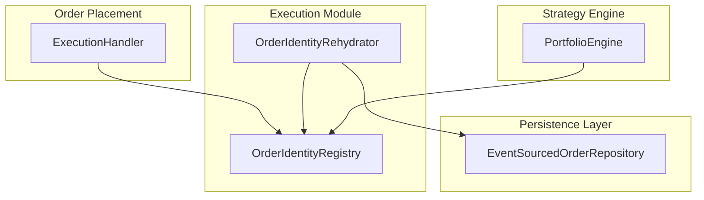
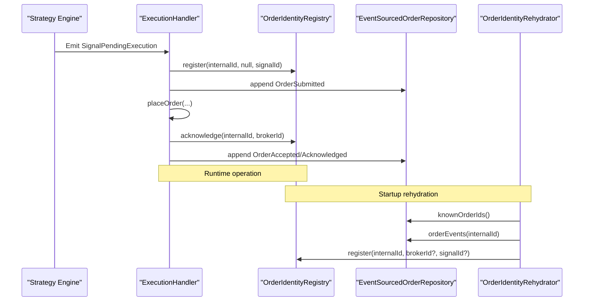
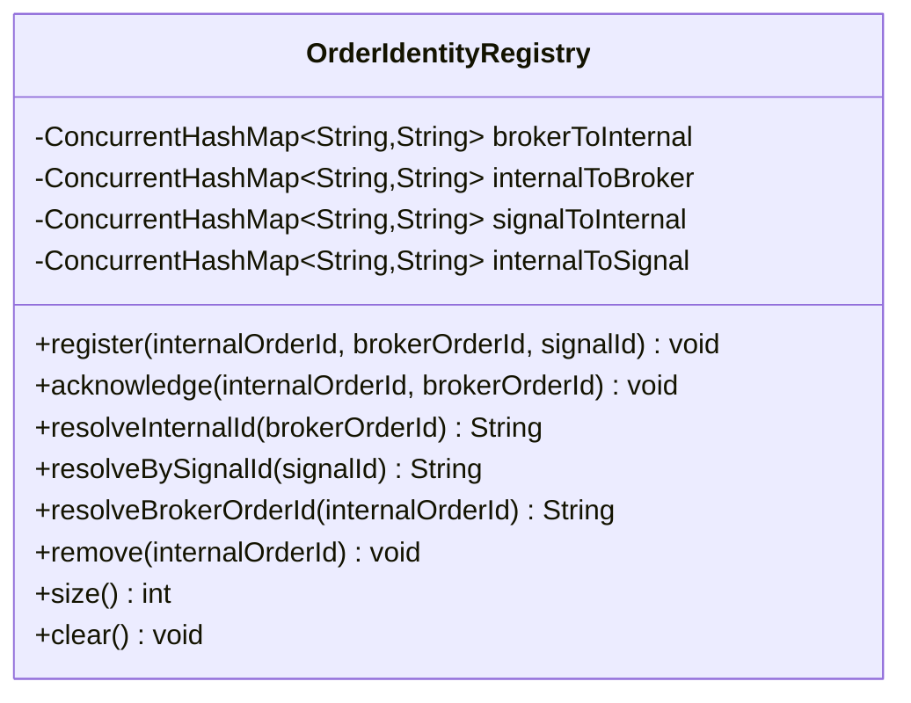
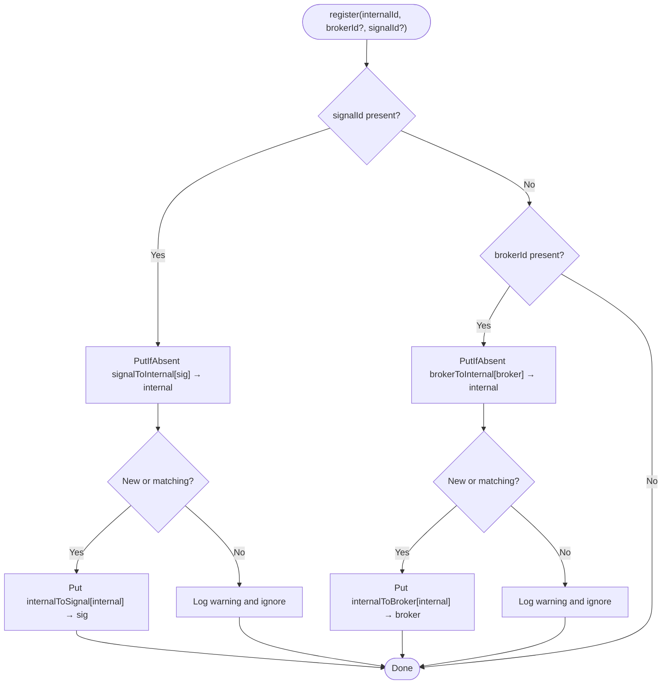
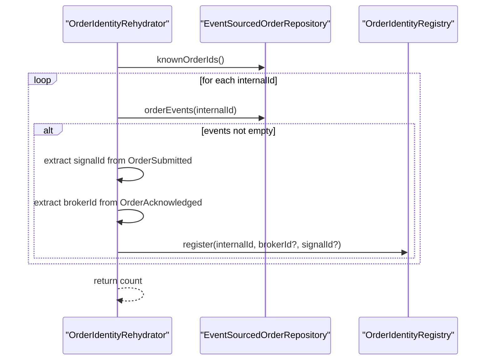
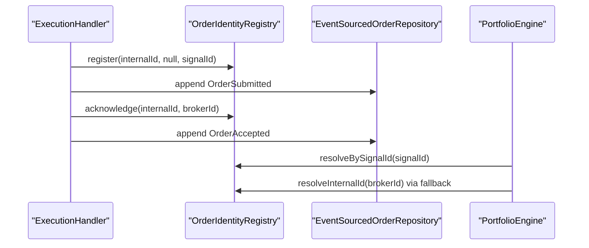
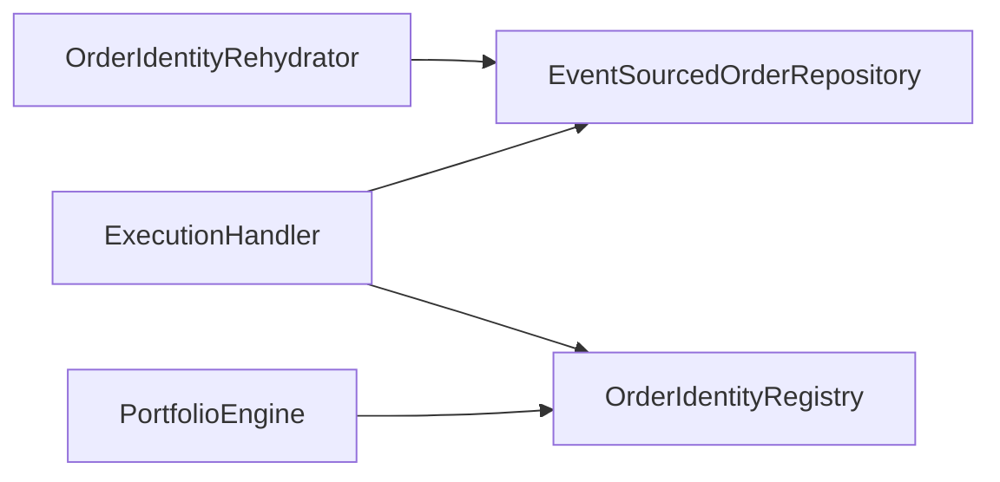

# Order Identity Management

<cite>
**Referenced Files in This Document**
- [OrderIdentityRegistry.java](file://trading/execution/src/main/java/com/tradej/execution/identity/OrderIdentityRegistry.java)
- [OrderIdentityRehydrator.java](file://trading/execution/src/main/java/com/tradej/execution/identity/OrderIdentityRehydrator.java)
- [OrderIdentityRegistryTest.java](file://trading/execution/src/test/java/com/tradej/execution/identity/OrderIdentityRegistryTest.java)
- [OrderIdentityRegistryStressTest.java](file://trading/execution/src/test/java/com/tradej/execution/identity/OrderIdentityRegistryStressTest.java)
- [OrderIdentityRehydratorTest.java](file://trading/execution/src/test/java/com/tradej/execution/identity/OrderIdentityRehydratorTest.java)
- [ExecutionHandlerUnitTest.java](file://trading/execution/src/test/java/com/tradej/execution/service/ExecutionHandlerUnitTest.java)
- [PortfolioEngineTest.java](file://trading/strategy/src/test/java/com/tradej/strategy/portfolio/PortfolioEngineTest.java)
</cite>

## Table of Contents
1. [Introduction](#introduction)
2. [Project Structure](#project-structure)
3. [Core Components](#core-components)
4. [Architecture Overview](#architecture-overview)
5. [Detailed Component Analysis](#detailed-component-analysis)
6. [Dependency Analysis](#dependency-analysis)
7. [Performance Considerations](#performance-considerations)
8. [Troubleshooting Guide](#troubleshooting-guide)
9. [Conclusion](#conclusion)
10. [Appendices](#appendices)

## Introduction
This document describes the Order Identity Management subsystem responsible for tracking internal order IDs, broker order IDs, and signal correlations. It explains the identity registration lifecycle, acknowledgment handling, conflict resolution, and recovery during restarts. It also covers identity lookup algorithms, cache management characteristics, and integration points with order placement, fill reconciliation, and event emission workflows.

## Project Structure
The Order Identity Management resides in the execution module and consists of two primary components:
- OrderIdentityRegistry: An in-memory, thread-safe registry maintaining four concurrent hash maps for bidirectional and reverse lookups.
- OrderIdentityRehydrator: A startup utility that rebuilds identity mappings from persisted OMS events.

**Diagram sources**
- [OrderIdentityRegistry.java:1-135](file://trading/execution/src/main/java/com/tradej/execution/identity/OrderIdentityRegistry.java#L1-L135)
- [OrderIdentityRehydrator.java:1-52](file://trading/execution/src/main/java/com/tradej/execution/identity/OrderIdentityRehydrator.java#L1-L52)
- [ExecutionHandlerUnitTest.java:114-149](file://trading/execution/src/test/java/com/tradej/execution/service/ExecutionHandlerUnitTest.java#L114-L149)
- [PortfolioEngineTest.java:586-613](file://trading/strategy/src/test/java/com/tradej/strategy/portfolio/PortfolioEngineTest.java#L586-L613)

**Section sources**
- [OrderIdentityRegistry.java:1-135](file://trading/execution/src/main/java/com/tradej/execution/identity/OrderIdentityRegistry.java#L1-L135)
- [OrderIdentityRehydrator.java:1-52](file://trading/execution/src/main/java/com/tradej/execution/identity/OrderIdentityRehydrator.java#L1-L52)

## Core Components
- OrderIdentityRegistry
  - Maintains four concurrent hash maps:
    - brokerOrderId → internalOrderId
    - internalOrderId → brokerOrderId
    - signalId → internalOrderId
    - internalOrderId → signalId (reverse map for O(1) removal)
  - Supports register, acknowledge, resolve, remove, size, and clear operations.
  - Provides warnings on duplicate mappings and ignores conflicting registrations.
- OrderIdentityRehydrator
  - Scans OMS aggregates for OrderSubmitted and OrderAcknowledged events.
  - Rebuilds signal and broker mappings for each internal order ID.
  - Returns the count of rehydrated identities.

**Section sources**
- [OrderIdentityRegistry.java:8-21](file://trading/execution/src/main/java/com/tradej/execution/identity/OrderIdentityRegistry.java#L8-L21)
- [OrderIdentityRegistry.java:40-82](file://trading/execution/src/main/java/com/tradej/execution/identity/OrderIdentityRegistry.java#L40-L82)
- [OrderIdentityRegistry.java:111-126](file://trading/execution/src/main/java/com/tradej/execution/identity/OrderIdentityRegistry.java#L111-L126)
- [OrderIdentityRehydrator.java:28-51](file://trading/execution/src/main/java/com/tradej/execution/identity/OrderIdentityRehydrator.java#L28-L51)

## Architecture Overview
The subsystem integrates with order placement and reconciliation as follows:
- On signal acceptance, an order is placed and registered in OMS; the registry is populated with signal mapping initially.
- When the broker acknowledges the order, the registry is updated with the broker order ID.
- During post-restart reconciliation, the rehydrator reconstructs mappings from persisted events.
- Strategy engine and reconciliation workflows rely on the registry to correlate signals and resolve internal order IDs from broker IDs.

**Diagram sources**
- [ExecutionHandlerUnitTest.java:138-149](file://trading/execution/src/test/java/com/tradej/execution/service/ExecutionHandlerUnitTest.java#L138-L149)
- [OrderIdentityRehydrator.java:28-51](file://trading/execution/src/main/java/com/tradej/execution/identity/OrderIdentityRehydrator.java#L28-L51)
- [OrderIdentityRegistry.java:40-82](file://trading/execution/src/main/java/com/tradej/execution/identity/OrderIdentityRegistry.java#L40-L82)

## Detailed Component Analysis

### OrderIdentityRegistry
Thread-safe in-memory registry with four concurrent hash maps. It supports:
- register(internalOrderId, brokerOrderId, signalId): Idempotent registration; logs warnings on duplicates and ignores conflicting registrations.
- acknowledge(internalOrderId, brokerOrderId): Completes a previously registered mapping; prevents overwriting existing broker mappings.
- resolveInternalId(brokerOrderId): Lookup by broker order ID.
- resolveBySignalId(signalId): Lookup by signal ID.
- resolveBrokerOrderId(internalOrderId): Reverse lookup to broker order ID.
- remove(internalOrderId): O(1) cleanup via reverse map.
- size(): Current number of tracked internal order IDs.
- clear(): Bulk reset.

**Diagram sources**
- [OrderIdentityRegistry.java:22-135](file://trading/execution/src/main/java/com/tradej/execution/identity/OrderIdentityRegistry.java#L22-L135)

**Section sources**
- [OrderIdentityRegistry.java:40-82](file://trading/execution/src/main/java/com/tradej/execution/identity/OrderIdentityRegistry.java#L40-L82)
- [OrderIdentityRegistry.java:89-126](file://trading/execution/src/main/java/com/tradej/execution/identity/OrderIdentityRegistry.java#L89-L126)

### Identity Registration and Acknowledgment Flow
- Initial registration accepts null brokerOrderId to establish signal-to-internal mapping.
- Acknowledgment completes the broker-to-internal mapping and maintains reverse mapping.
- Duplicate registrations are ignored with warnings; acknowledgment prevents overwriting existing broker mappings.

**Diagram sources**
- [OrderIdentityRegistry.java:40-59](file://trading/execution/src/main/java/com/tradej/execution/identity/OrderIdentityRegistry.java#L40-L59)

**Section sources**
- [OrderIdentityRegistry.java:40-82](file://trading/execution/src/main/java/com/tradej/execution/identity/OrderIdentityRegistry.java#L40-L82)

### OrderIdentityRehydrator
- Iterates all known internal order IDs from the OMS repository.
- For each order, scans events to extract correlationId (signalId) and exchangeOrderId (brokerId).
- Calls registry.register to restore mappings when either ID is available.
- Returns the total count of rehydrated mappings.

**Diagram sources**
- [OrderIdentityRehydrator.java:28-51](file://trading/execution/src/main/java/com/tradej/execution/identity/OrderIdentityRehydrator.java#L28-L51)

**Section sources**
- [OrderIdentityRehydrator.java:28-51](file://trading/execution/src/main/java/com/tradej/execution/identity/OrderIdentityRehydrator.java#L28-L51)
- [OrderIdentityRehydratorTest.java:36-46](file://trading/execution/src/test/java/com/tradej/execution/identity/OrderIdentityRehydratorTest.java#L36-L46)

### Identity Lookup Algorithms and Cache Management
- Lookup complexity:
  - resolveInternalId: O(1) average via brokerToInternal
  - resolveBySignalId: O(1) average via signalToInternal
  - resolveBrokerOrderId: O(1) average via internalToBroker
- Cache characteristics:
  - All maps are backed by ConcurrentHashMap for thread safety.
  - Reverse maps enable O(1) removal and consistent updates.
- Conflict handling:
  - putIfAbsent ensures idempotent registration.
  - Warnings logged for conflicting registrations; later acknowledgments prevent overwriting existing broker mappings.

**Section sources**
- [OrderIdentityRegistry.java:26-29](file://trading/execution/src/main/java/com/tradej/execution/identity/OrderIdentityRegistry.java#L26-L29)
- [OrderIdentityRegistry.java:40-82](file://trading/execution/src/main/java/com/tradej/execution/identity/OrderIdentityRegistry.java#L40-L82)
- [OrderIdentityRegistry.java:111-126](file://trading/execution/src/main/java/com/tradej/execution/identity/OrderIdentityRegistry.java#L111-L126)

### Integration with Order Placement, Fill Reconciliation, and Event Emission
- Order placement:
  - ExecutionHandler emits OrderAccepted/Acknowledged events and places orders.
  - Registry is updated with acknowledge to complete broker mapping.
- Fill reconciliation:
  - Post-restart fills carry broker order IDs; registry resolves internal order IDs for reconciliation.
  - Rehydrator restores mappings from persisted events.
- Event emission:
  - Strategy engine uses orderIdToSignalId fallback when orderId mapping is unavailable.

**Diagram sources**
- [ExecutionHandlerUnitTest.java:138-149](file://trading/execution/src/test/java/com/tradej/execution/service/ExecutionHandlerUnitTest.java#L138-L149)
- [PortfolioEngineTest.java:586-613](file://trading/strategy/src/test/java/com/tradej/strategy/portfolio/PortfolioEngineTest.java#L586-L613)

**Section sources**
- [ExecutionHandlerUnitTest.java:114-149](file://trading/execution/src/test/java/com/tradej/execution/service/ExecutionHandlerUnitTest.java#L114-L149)
- [PortfolioEngineTest.java:586-613](file://trading/strategy/src/test/java/com/tradej/strategy/portfolio/PortfolioEngineTest.java#L586-L613)

## Dependency Analysis
- Internal dependencies:
  - OrderIdentityRehydrator depends on EventSourcedOrderRepository for reading persisted events.
  - OrderIdentityRegistry is a pure in-memory component with no external dependencies.
- External integration points:
  - ExecutionHandler writes OrderSubmitted and OrderAcknowledged events to OMS.
  - Strategy engine reads from OrderIdentityRegistry for correlation and fallback resolution.

**Diagram sources**
- [OrderIdentityRehydrator.java:28-51](file://trading/execution/src/main/java/com/tradej/execution/identity/OrderIdentityRehydrator.java#L28-L51)
- [ExecutionHandlerUnitTest.java:138-149](file://trading/execution/src/test/java/com/tradej/execution/service/ExecutionHandlerUnitTest.java#L138-L149)
- [PortfolioEngineTest.java:586-613](file://trading/strategy/src/test/java/com/tradej/strategy/portfolio/PortfolioEngineTest.java#L586-L613)

**Section sources**
- [OrderIdentityRehydrator.java:28-51](file://trading/execution/src/main/java/com/tradej/execution/identity/OrderIdentityRehydrator.java#L28-L51)
- [OrderIdentityRegistry.java:1-135](file://trading/execution/src/main/java/com/tradej/execution/identity/OrderIdentityRegistry.java#L1-L135)

## Performance Considerations
- Concurrency:
  - All maps are ConcurrentHashMap instances, ensuring safe concurrent access without explicit locking.
- Complexity:
  - All lookups and updates are O(1) average-case.
- Memory:
  - Four concurrent hash maps scale with the number of tracked internal order IDs.
- Throughput:
  - Stress tests demonstrate robustness under high concurrency with register/remove cycles and mixed acknowledge/register races.

**Section sources**
- [OrderIdentityRegistry.java:26-29](file://trading/execution/src/main/java/com/tradej/execution/identity/OrderIdentityRegistry.java#L26-L29)
- [OrderIdentityRegistryStressTest.java:25-135](file://trading/execution/src/test/java/com/tradej/execution/identity/OrderIdentityRegistryStressTest.java#L25-L135)

## Troubleshooting Guide
Common scenarios and resolutions:
- Duplicate signal mappings:
  - Symptom: Warning logs indicating signal ID already mapped.
  - Resolution: Ensure unique signal IDs per internal order; avoid registering conflicting mappings.
- Duplicate broker acknowledgments:
  - Symptom: Warning logs preventing overwrite of existing broker mapping.
  - Resolution: Acknowledgment is idempotent; ensure only one broker order ID per internal order.
- Identity not resolvable after restart:
  - Symptom: Broker order ID cannot be resolved to internal order ID.
  - Resolution: Confirm OrderSubmitted and OrderAcknowledged events exist; verify rehydrator ran and rebuilt mappings.
- Removal leaves dangling mappings:
  - Symptom: Residual lookups after remove.
  - Resolution: Use remove with the internal order ID; reverse maps ensure cleanup of both directions.

Verification references:
- Unit tests confirm register/acknowledge/remove semantics and size accuracy.
- Stress tests validate concurrent register/remove and mixed register/acknowledge races.

**Section sources**
- [OrderIdentityRegistry.java:40-82](file://trading/execution/src/main/java/com/tradej/execution/identity/OrderIdentityRegistry.java#L40-L82)
- [OrderIdentityRegistryTest.java:12-57](file://trading/execution/src/test/java/com/tradej/execution/identity/OrderIdentityRegistryTest.java#L12-L57)
- [OrderIdentityRegistryStressTest.java:25-135](file://trading/execution/src/test/java/com/tradej/execution/identity/OrderIdentityRegistryStressTest.java#L25-L135)
- [OrderIdentityRehydratorTest.java:36-46](file://trading/execution/src/test/java/com/tradej/execution/identity/OrderIdentityRehydratorTest.java#L36-L46)

## Conclusion
The Order Identity Management subsystem provides a robust, thread-safe mechanism to correlate internal order IDs, broker order IDs, and signal IDs. Its design emphasizes idempotent registration, safe acknowledgment, and efficient O(1) lookups. The rehydrator ensures continuity across restarts by rebuilding mappings from persisted events. Integration with order placement and strategy workflows leverages both direct and fallback resolution paths for reliability.

## Appendices

### Configuration and Debugging Examples
- Configuration:
  - No explicit configuration is required for the registry or rehydrator; they operate on in-memory maps and repository-backed events.
- Debugging identity resolution:
  - Verify mappings via resolveInternalId and resolveBySignalId.
  - Confirm acknowledgment via resolveBrokerOrderId.
  - Inspect logs for warnings indicating duplicate registrations or acknowledgments.

**Section sources**
- [OrderIdentityRegistry.java:89-109](file://trading/execution/src/main/java/com/tradej/execution/identity/OrderIdentityRegistry.java#L89-L109)
- [OrderIdentityRegistryTest.java:12-57](file://trading/execution/src/test/java/com/tradej/execution/identity/OrderIdentityRegistryTest.java#L12-L57)