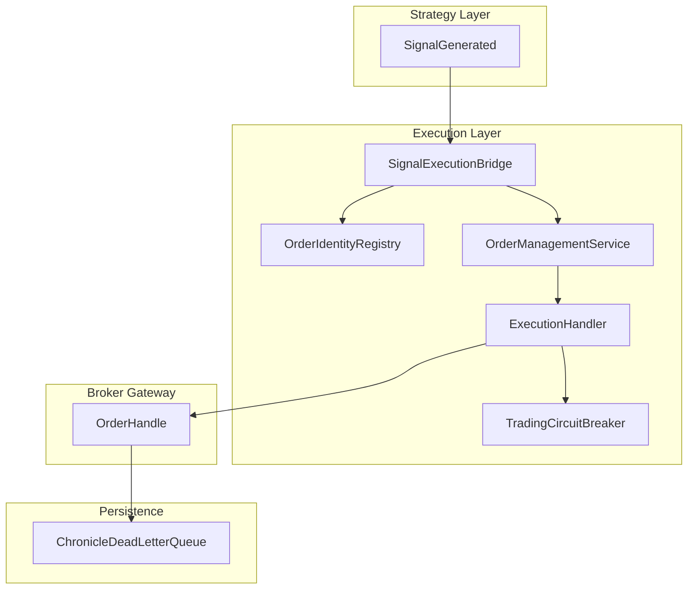
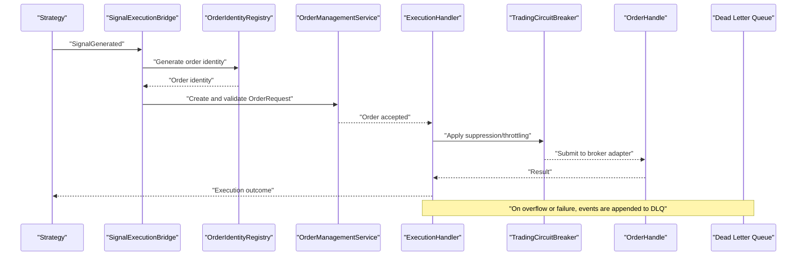
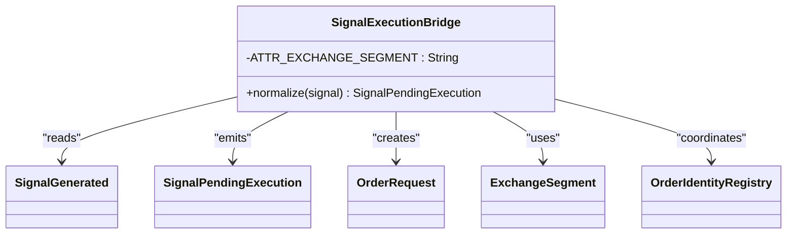
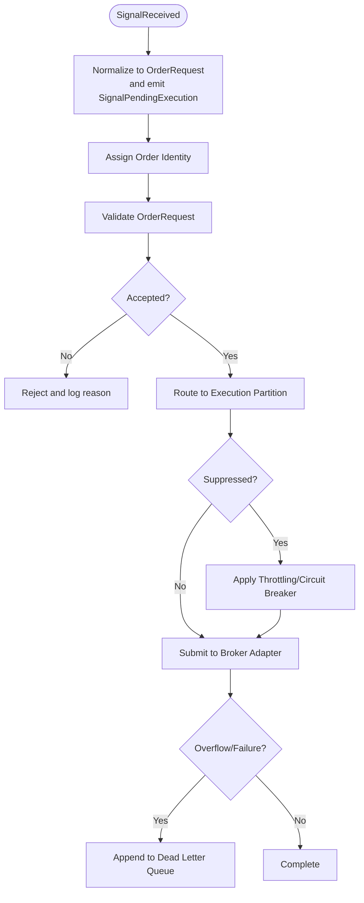
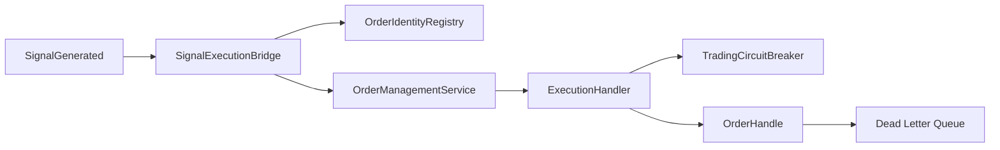

# Signal Processing Workflow

<cite>
**Referenced Files in This Document**
- [SignalExecutionBridge.java](file://trading/execution/src/main/java/com/tradej/execution/bridge/SignalExecutionBridge.java)
- [OrderIdentityRegistry.java](file://trading/execution/src/main/java/com/tradej/execution/identity/OrderIdentityRegistry.java)
- [ExecutionHandler.java](file://trading/execution/src/main/java/com/tradej/execution/service/ExecutionHandler.java)
- [TradingCommand.java](file://trading/execution/src/main/java/com/tradej/execution/command/TradingCommand.java)
- [OrderHandle.java](file://broker-gateway/src/main/java/com/tradej/brokergateway/OrderHandle.java)
- [ChronicleDeadLetterQueue.java](file://data/persistence/src/main/java/com/tradej/persistence/chronicle/ChronicleDeadLetterQueue.java)
- [OrderManagementService.java](file://trading/execution/src/main/java/com/tradej/execution/service/OrderManagementService.java)
- [TradingCircuitBreaker.java](file://trading/execution/src/main/java/com/tradej/execution/service/TradingCircuitBreaker.java)
- [PortfolioEngine.java](file://trading/strategy/src/main/java/com/tradej/strategy/portfolio/PortfolioEngine.java)
- [SignalGenerated.java](file://core/src/main/java/com/tradej/core/domain/event/SignalGenerated.java)
- [SignalPendingExecution.java](file://core/src/main/java/com/tradej/core/domain/event/SignalPendingExecution.java)
- [OrderRequest.java](file://core/src/main/java/com/tradej/core/domain/model/OrderRequest.java)
- [ExchangeSegment.java](file://core/src/main/java/com/tradej/core/domain/value/ExchangeSegment.java)
- [OrderType.java](file://core/src/main/java/com/tradej/core/domain/value/OrderType.java)
- [ProductType.java](file://core/src/main/java/com/tradej/core/domain/value/ProductType.java)
- [Side.java](file://core/src/main/java/com/tradej/core/domain/value/Side.java)
- [Validity.java](file://core/src/main/java/com/tradej/core/domain/value/Validity.java)
</cite>

## Table of Contents
1. [Introduction](#introduction)
2. [Project Structure](#project-structure)
3. [Core Components](#core-components)
4. [Architecture Overview](#architecture-overview)
5. [Detailed Component Analysis](#detailed-component-analysis)
6. [Dependency Analysis](#dependency-analysis)
7. [Performance Considerations](#performance-considerations)
8. [Troubleshooting Guide](#troubleshooting-guide)
9. [Conclusion](#conclusion)

## Introduction
This document explains the Signal Processing Workflow subsystem responsible for transforming strategy-generated signals into executable orders and routing them to appropriate execution partitions. It covers signal acceptance, order identity management, normalization into order requests, validation, submission to broker adapters, suppression mechanisms, queue overflow handling, and dead letter queue integration. It also documents the relationships among signals, order requests, and execution commands, along with configuration examples, performance monitoring, and troubleshooting guidance.

## Project Structure
The Signal Processing Workflow spans several modules:
- trading/execution: Bridges, identity registry, execution handlers, commands, and risk controls
- broker-gateway: Broker adapter orchestration and order operations
- data/persistence: Dead letter queue implementation
- core: Domain models and value objects shared across modules

**Diagram sources**
- [SignalExecutionBridge.java](file://trading/execution/src/main/java/com/tradej/execution/bridge/SignalExecutionBridge.java)
- [OrderIdentityRegistry.java](file://trading/execution/src/main/java/com/tradej/execution/identity/OrderIdentityRegistry.java)
- [OrderManagementService.java](file://trading/execution/src/main/java/com/tradej/execution/service/OrderManagementService.java)
- [ExecutionHandler.java](file://trading/execution/src/main/java/com/tradej/execution/service/ExecutionHandler.java)
- [TradingCircuitBreaker.java](file://trading/execution/src/main/java/com/tradej/execution/service/TradingCircuitBreaker.java)
- [OrderHandle.java](file://broker-gateway/src/main/java/com/tradej/brokergateway/OrderHandle.java)
- [ChronicleDeadLetterQueue.java](file://data/persistence/src/main/java/com/tradej/persistence/chronicle/ChronicleDeadLetterQueue.java)

**Section sources**
- [SignalExecutionBridge.java:1-27](file://trading/execution/src/main/java/com/tradej/execution/bridge/SignalExecutionBridge.java#L1-L27)
- [OrderIdentityRegistry.java](file://trading/execution/src/main/java/com/tradej/execution/identity/OrderIdentityRegistry.java)
- [OrderManagementService.java](file://trading/execution/src/main/java/com/tradej/execution/service/OrderManagementService.java)
- [ExecutionHandler.java](file://trading/execution/src/main/java/com/tradej/execution/service/ExecutionHandler.java)
- [TradingCircuitBreaker.java](file://trading/execution/src/main/java/com/tradej/execution/service/TradingCircuitBreaker.java)
- [OrderHandle.java:1-37](file://broker-gateway/src/main/java/com/tradej/brokergateway/OrderHandle.java#L1-L37)
- [ChronicleDeadLetterQueue.java:1-70](file://data/persistence/src/main/java/com/tradej/persistence/chronicle/ChronicleDeadLetterQueue.java#L1-L70)

## Core Components
- SignalExecutionBridge: Normalizes strategy signals into executable order requests and emits pending execution events.
- OrderIdentityRegistry: Generates and tracks order identity to prevent duplicates and enable idempotent processing.
- OrderManagementService: Validates and orchestrates order lifecycle prior to execution submission.
- ExecutionHandler: Routes validated orders to execution partitions and manages submission to broker adapters.
- TradingCircuitBreaker: Enforces suppression and throttling to protect systems under load or failure conditions.
- OrderHandle: Encapsulates order operations against broker adapters with timing and result metadata.
- ChronicleDeadLetterQueue: Captures events dropped from bounded queues for later inspection and remediation.

**Section sources**
- [SignalExecutionBridge.java:18-27](file://trading/execution/src/main/java/com/tradej/execution/bridge/SignalExecutionBridge.java#L18-L27)
- [OrderIdentityRegistry.java](file://trading/execution/src/main/java/com/tradej/execution/identity/OrderIdentityRegistry.java)
- [OrderManagementService.java](file://trading/execution/src/main/java/com/tradej/execution/service/OrderManagementService.java)
- [ExecutionHandler.java](file://trading/execution/src/main/java/com/tradej/execution/service/ExecutionHandler.java)
- [TradingCircuitBreaker.java](file://trading/execution/src/main/java/com/tradej/execution/service/TradingCircuitBreaker.java)
- [OrderHandle.java:14-37](file://broker-gateway/src/main/java/com/tradej/brokergateway/OrderHandle.java#L14-L37)
- [ChronicleDeadLetterQueue.java:16-70](file://data/persistence/src/main/java/com/tradej/persistence/chronicle/ChronicleDeadLetterQueue.java#L16-L70)

## Architecture Overview
The workflow transforms a SignalGenerated event into a normalized order request, assigns an order identity, validates and routes the order to an execution partition, and submits it to a broker adapter. Failure points are captured via a dead letter queue.

**Diagram sources**
- [SignalExecutionBridge.java:18-27](file://trading/execution/src/main/java/com/tradej/execution/bridge/SignalExecutionBridge.java#L18-L27)
- [OrderIdentityRegistry.java](file://trading/execution/src/main/java/com/tradej/execution/identity/OrderIdentityRegistry.java)
- [OrderManagementService.java](file://trading/execution/src/main/java/com/tradej/execution/service/OrderManagementService.java)
- [ExecutionHandler.java](file://trading/execution/src/main/java/com/tradej/execution/service/ExecutionHandler.java)
- [TradingCircuitBreaker.java](file://trading/execution/src/main/java/com/tradej/execution/service/TradingCircuitBreaker.java)
- [OrderHandle.java:14-37](file://broker-gateway/src/main/java/com/tradej/brokergateway/OrderHandle.java#L14-L37)
- [ChronicleDeadLetterQueue.java:32-50](file://data/persistence/src/main/java/com/tradej/persistence/chronicle/ChronicleDeadLetterQueue.java#L32-L50)

## Detailed Component Analysis

### SignalExecutionBridge
Responsibilities:
- Accepts SignalGenerated events from strategies
- Normalizes attributes into a standardized OrderRequest
- Emits SignalPendingExecution for downstream processing
- Integrates exchange segment and other domain values

Key behaviors:
- Attribute mapping for exchange segment and other fields
- Coordination with identity registry for order identity assignment
- Validation and normalization prior to order request creation

**Diagram sources**
- [SignalExecutionBridge.java:18-27](file://trading/execution/src/main/java/com/tradej/execution/bridge/SignalExecutionBridge.java#L18-L27)
- [SignalGenerated.java](file://core/src/main/java/com/tradej/core/domain/event/SignalGenerated.java)
- [SignalPendingExecution.java](file://core/src/main/java/com/tradej/core/domain/event/SignalPendingExecution.java)
- [OrderRequest.java](file://core/src/main/java/com/tradej/core/domain/model/OrderRequest.java)
- [ExchangeSegment.java](file://core/src/main/java/com/tradej/core/domain/value/ExchangeSegment.java)
- [OrderIdentityRegistry.java](file://trading/execution/src/main/java/com/tradej/execution/identity/OrderIdentityRegistry.java)

**Section sources**
- [SignalExecutionBridge.java:18-27](file://trading/execution/src/main/java/com/tradej/execution/bridge/SignalExecutionBridge.java#L18-L27)

### Order Identity Registry
Responsibilities:
- Generate unique order identities per signal
- Prevent duplicate submissions
- Support rehydration and recovery scenarios

Integration points:
- Used by SignalExecutionBridge to assign order identity during normalization
- Supports idempotent processing by ensuring consistent identity across retries

**Section sources**
- [OrderIdentityRegistry.java](file://trading/execution/src/main/java/com/tradej/execution/identity/OrderIdentityRegistry.java)

### Order Management Service
Responsibilities:
- Validate order requests derived from signals
- Enforce preconditions and constraints
- Prepare orders for execution submission

Processing logic:
- Request validation against domain rules
- Risk context enrichment
- Handoff to execution handler upon acceptance

**Section sources**
- [OrderManagementService.java](file://trading/execution/src/main/java/com/tradej/execution/service/OrderManagementService.java)

### Execution Handler
Responsibilities:
- Route accepted orders to appropriate execution partitions
- Apply suppression and throttling policies
- Submit validated orders to broker adapters via OrderHandle

Failure handling:
- Detects queue overflow and system overload
- Delegates problematic events to dead letter queue

**Section sources**
- [ExecutionHandler.java](file://trading/execution/src/main/java/com/tradej/execution/service/ExecutionHandler.java)
- [TradingCircuitBreaker.java](file://trading/execution/src/main/java/com/tradej/execution/service/TradingCircuitBreaker.java)

### Broker Adapter Integration (OrderHandle)
Responsibilities:
- Encapsulate order operations (place, modify, cancel, query)
- Provide timing and result metadata for observability
- Coordinate with broker adapters through gateway SPI

**Section sources**
- [OrderHandle.java:14-37](file://broker-gateway/src/main/java/com/tradej/brokergateway/OrderHandle.java#L14-L37)

### Dead Letter Queue Integration
Responsibilities:
- Capture events dropped from bounded queues
- Persist metadata and payload for later inspection
- Emit warnings and maintain counters

Behavior:
- Append entries with timestamp, source, event class, event ID, reason, and JSON payload
- Closeable resource for proper cleanup

**Section sources**
- [ChronicleDeadLetterQueue.java:16-70](file://data/persistence/src/main/java/com/tradej/persistence/chronicle/ChronicleDeadLetterQueue.java#L16-L70)

### Signal Suppression and Throttling
Mechanisms:
- TradingCircuitBreaker applies suppression and throttling to protect systems
- ExecutionHandler coordinates with circuit breaker to gate submissions
- Configurable thresholds and policies govern suppression windows

**Section sources**
- [TradingCircuitBreaker.java](file://trading/execution/src/main/java/com/tradej/execution/service/TradingCircuitBreaker.java)
- [ExecutionHandler.java](file://trading/execution/src/main/java/com/tradej/execution/service/ExecutionHandler.java)

### Signal-to-Order Conversion Workflow

**Diagram sources**
- [SignalExecutionBridge.java:18-27](file://trading/execution/src/main/java/com/tradej/execution/bridge/SignalExecutionBridge.java#L18-L27)
- [OrderIdentityRegistry.java](file://trading/execution/src/main/java/com/tradej/execution/identity/OrderIdentityRegistry.java)
- [OrderManagementService.java](file://trading/execution/src/main/java/com/tradej/execution/service/OrderManagementService.java)
- [ExecutionHandler.java](file://trading/execution/src/main/java/com/tradej/execution/service/ExecutionHandler.java)
- [TradingCircuitBreaker.java](file://trading/execution/src/main/java/com/tradej/execution/service/TradingCircuitBreaker.java)
- [OrderHandle.java:14-37](file://broker-gateway/src/main/java/com/tradej/brokergateway/OrderHandle.java#L14-L37)
- [ChronicleDeadLetterQueue.java:32-50](file://data/persistence/src/main/java/com/tradej/persistence/chronicle/ChronicleDeadLetterQueue.java#L32-L50)

## Dependency Analysis
The subsystem exhibits clean separation of concerns:
- SignalExecutionBridge depends on core domain models and identity registry
- OrderManagementService validates and prepares orders
- ExecutionHandler orchestrates routing and suppression
- OrderHandle encapsulates broker adapter operations
- Dead letter queue persists failures for remediation

**Diagram sources**
- [SignalExecutionBridge.java:18-27](file://trading/execution/src/main/java/com/tradej/execution/bridge/SignalExecutionBridge.java#L18-L27)
- [OrderIdentityRegistry.java](file://trading/execution/src/main/java/com/tradej/execution/identity/OrderIdentityRegistry.java)
- [OrderManagementService.java](file://trading/execution/src/main/java/com/tradej/execution/service/OrderManagementService.java)
- [ExecutionHandler.java](file://trading/execution/src/main/java/com/tradej/execution/service/ExecutionHandler.java)
- [TradingCircuitBreaker.java](file://trading/execution/src/main/java/com/tradej/execution/service/TradingCircuitBreaker.java)
- [OrderHandle.java:14-37](file://broker-gateway/src/main/java/com/tradej/brokergateway/OrderHandle.java#L14-L37)
- [ChronicleDeadLetterQueue.java:32-50](file://data/persistence/src/main/java/com/tradej/persistence/chronicle/ChronicleDeadLetterQueue.java#L32-L50)

**Section sources**
- [SignalExecutionBridge.java:18-27](file://trading/execution/src/main/java/com/tradej/execution/bridge/SignalExecutionBridge.java#L18-L27)
- [OrderIdentityRegistry.java](file://trading/execution/src/main/java/com/tradej/execution/identity/OrderIdentityRegistry.java)
- [OrderManagementService.java](file://trading/execution/src/main/java/com/tradej/execution/service/OrderManagementService.java)
- [ExecutionHandler.java](file://trading/execution/src/main/java/com/tradej/execution/service/ExecutionHandler.java)
- [TradingCircuitBreaker.java](file://trading/execution/src/main/java/com/tradej/execution/service/TradingCircuitBreaker.java)
- [OrderHandle.java:14-37](file://broker-gateway/src/main/java/com/tradej/brokergateway/OrderHandle.java#L14-L37)
- [ChronicleDeadLetterQueue.java:32-50](file://data/persistence/src/main/java/com/tradej/persistence/chronicle/ChronicleDeadLetterQueue.java#L32-L50)

## Performance Considerations
- Use OrderIdentityRegistry to avoid duplicate processing and reduce broker adapter load
- Tune TradingCircuitBreaker thresholds to balance throughput and stability
- Monitor ExecutionHandler partition utilization and adjust routing policies
- Enable dead letter queue monitoring to detect overflow and failure patterns
- Validate OrderRequest early in OrderManagementService to minimize downstream retries

## Troubleshooting Guide
Common issues and resolutions:
- Duplicate orders: Verify OrderIdentityRegistry is invoked during normalization
- Rejected orders: Inspect OrderManagementService validation logs and domain constraints
- Overflows: Check ExecutionHandler queue metrics and enable dead letter queue monitoring
- Broker failures: Review OrderHandle timing and result metadata; confirm gateway connectivity
- Suppression spikes: Adjust TradingCircuitBreaker policies and monitor suppression counters

Operational checks:
- Confirm SignalExecutionBridge emits SignalPendingExecution after identity assignment
- Validate OrderRequest fields align with ExchangeSegment, OrderType, ProductType, Side, Validity
- Ensure ChronicleDeadLetterQueue is initialized and appending entries on failures

**Section sources**
- [SignalExecutionBridge.java:18-27](file://trading/execution/src/main/java/com/tradej/execution/bridge/SignalExecutionBridge.java#L18-L27)
- [OrderIdentityRegistry.java](file://trading/execution/src/main/java/com/tradej/execution/identity/OrderIdentityRegistry.java)
- [OrderManagementService.java](file://trading/execution/src/main/java/com/tradej/execution/service/OrderManagementService.java)
- [ExecutionHandler.java](file://trading/execution/src/main/java/com/tradej/execution/service/ExecutionHandler.java)
- [TradingCircuitBreaker.java](file://trading/execution/src/main/java/com/tradej/execution/service/TradingCircuitBreaker.java)
- [OrderHandle.java:14-37](file://broker-gateway/src/main/java/com/tradej/brokergateway/OrderHandle.java#L14-L37)
- [ChronicleDeadLetterQueue.java:32-50](file://data/persistence/src/main/java/com/tradej/persistence/chronicle/ChronicleDeadLetterQueue.java#L32-L50)

## Conclusion
The Signal Processing Workflow provides a robust pipeline from strategy signals to executable orders. By normalizing signals, assigning identities, validating requests, applying suppression and throttling, and integrating with broker adapters and dead letter queues, the system ensures reliability, observability, and recoverability. Proper configuration and monitoring of each component are essential for optimal performance and troubleshooting.