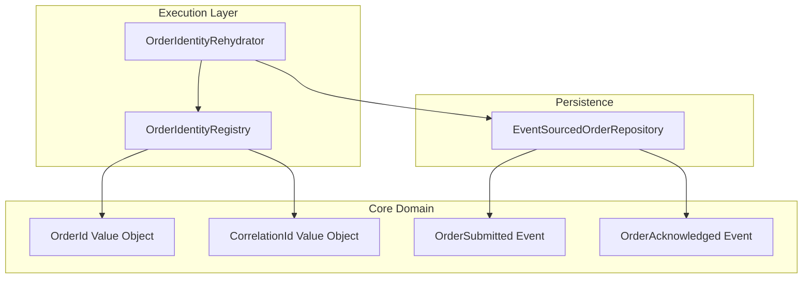
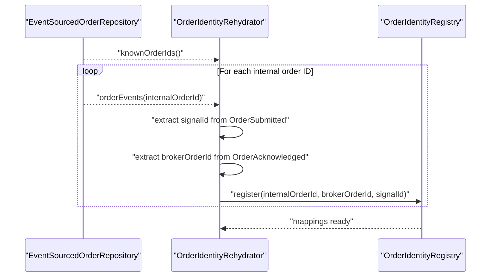
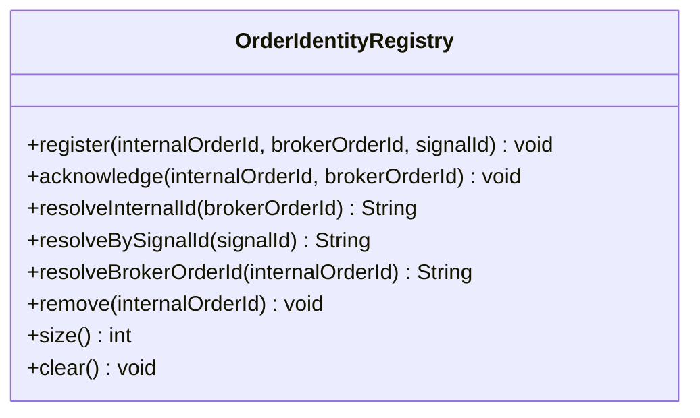
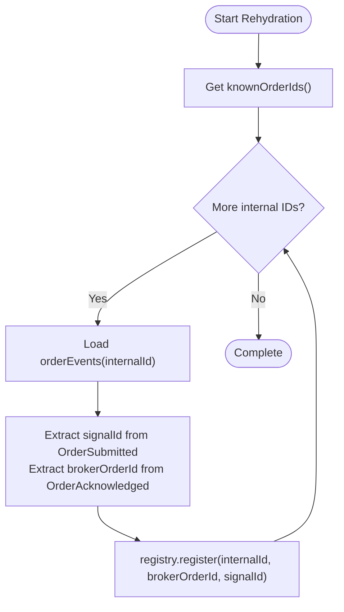
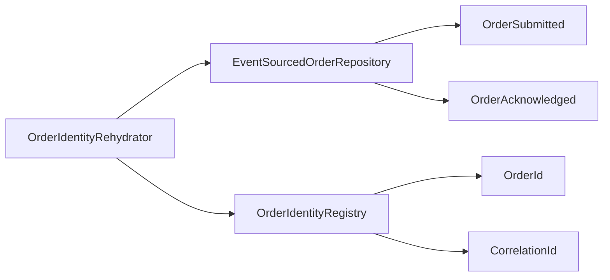

# Order Identity and Tracking

<cite>
**Referenced Files in This Document**
- [OrderIdentityRegistry.java](file://trading/execution/src/main/java/com/tradej/execution/identity/OrderIdentityRegistry.java)
- [OrderIdentityRehydrator.java](file://trading/execution/src/main/java/com/tradej/execution/identity/OrderIdentityRehydrator.java)
- [OrderId.java](file://core/src/main/java/com/tradej/core/domain/value/OrderId.java)
- [CorrelationId.java](file://core/src/main/java/com/tradej/core/domain/value/CorrelationId.java)
- [EventSourcedOrderRepository.java](file://data/persistence/src/main/java/com/tradej/persistence/oms/EventSourcedOrderRepository.java)
- [OrderSubmitted.java](file://core/src/main/java/com/tradej/core/domain/oms/OrderSubmitted.java)
- [OrderAcknowledged.java](file://core/src/main/java/com/tradej/core/domain/oms/OrderAcknowledged.java)
- [OrderIdentityRegistryTest.java](file://trading/execution/src/test/java/com/tradej/execution/identity/OrderIdentityRegistryTest.java)
- [OrderIdentityRegistryStressTest.java](file://trading/execution/src/test/java/com/tradej/execution/identity/OrderIdentityRegistryStressTest.java)
- [OrderIdentityRehydratorTest.java](file://trading/execution/src/test/java/com/tradej/execution/identity/OrderIdentityRehydratorTest.java)
</cite>

## Table of Contents
1. [Introduction](#introduction)
2. [Project Structure](#project-structure)
3. [Core Components](#core-components)
4. [Architecture Overview](#architecture-overview)
5. [Detailed Component Analysis](#detailed-component-analysis)
6. [Dependency Analysis](#dependency-analysis)
7. [Performance Considerations](#performance-considerations)
8. [Troubleshooting Guide](#troubleshooting-guide)
9. [Conclusion](#conclusion)

## Introduction
This document explains the Order Identity and Tracking system that manages order identifiers, correlation IDs, and tracking mechanisms across the trading pipeline. It covers:
- OrderIdentityRegistry: in-memory mapping of internal order IDs to broker order IDs and correlation signals
- OrderIdentityRehydrator: state restoration from persisted order journals
- OrderId value object: unique identifier generation and validation
- CorrelationId value object: correlation ID management and propagation
- Integration with order lifecycle management, state machine reconstruction, and replay systems
- Practical workflows for order tracking, identity resolution, and recovery scenarios
- Duplicate prevention, order relationships, and audit trail maintenance

## Project Structure
The Order Identity and Tracking system spans three modules:
- trading/execution: runtime identity registry and rehydration logic
- core: value objects for OrderId and CorrelationId, plus domain events
- data/persistence: event-sourced repository for order journals

**Diagram sources**
- [OrderIdentityRegistry.java:1-150](file://trading/execution/src/main/java/com/tradej/execution/identity/OrderIdentityRegistry.java#L1-L150)
- [OrderIdentityRehydrator.java:1-60](file://trading/execution/src/main/java/com/tradej/execution/identity/OrderIdentityRehydrator.java#L1-L60)
- [OrderId.java:1-200](file://core/src/main/java/com/tradej/core/domain/value/OrderId.java#L1-L200)
- [CorrelationId.java:1-200](file://core/src/main/java/com/tradej/core/domain/value/CorrelationId.java#L1-L200)
- [EventSourcedOrderRepository.java:1-300](file://data/persistence/src/main/java/com/tradej/persistence/oms/EventSourcedOrderRepository.java#L1-L300)
- [OrderSubmitted.java:1-120](file://core/src/main/java/com/tradej/core/domain/oms/OrderSubmitted.java#L1-L120)
- [OrderAcknowledged.java:1-120](file://core/src/main/java/com/tradej/core/domain/oms/OrderAcknowledged.java#L1-L120)

**Section sources**
- [OrderIdentityRegistry.java:1-150](file://trading/execution/src/main/java/com/tradej/execution/identity/OrderIdentityRegistry.java#L1-L150)
- [OrderIdentityRehydrator.java:1-60](file://trading/execution/src/main/java/com/tradej/execution/identity/OrderIdentityRehydrator.java#L1-L60)
- [OrderId.java:1-200](file://core/src/main/java/com/tradej/core/domain/value/OrderId.java#L1-L200)
- [CorrelationId.java:1-200](file://core/src/main/java/com/tradej/core/domain/value/CorrelationId.java#L1-L200)
- [EventSourcedOrderRepository.java:1-300](file://data/persistence/src/main/java/com/tradej/persistence/oms/EventSourcedOrderRepository.java#L1-L300)

## Core Components
- OrderIdentityRegistry: maintains bidirectional mappings between internal order IDs, broker order IDs, and correlation IDs. Supports registration, acknowledgment, resolution, removal, and clearing.
- OrderIdentityRehydrator: reconstructs registry state by scanning persisted order events and registering mappings derived from OrderSubmitted and OrderAcknowledged events.
- OrderId value object: encapsulates unique order identifiers with validation and generation semantics.
- CorrelationId value object: encapsulates correlation IDs used to track requests across the system.

Key responsibilities:
- Prevent duplicates by enforcing unique mappings per signal and broker ID
- Enable fast resolution of internal order IDs from external identifiers
- Support recovery and replay by rebuilding mappings from event journals
- Maintain audit trail through event sourcing

**Section sources**
- [OrderIdentityRegistry.java:31-135](file://trading/execution/src/main/java/com/tradej/execution/identity/OrderIdentityRegistry.java#L31-L135)
- [OrderIdentityRehydrator.java:28-51](file://trading/execution/src/main/java/com/tradej/execution/identity/OrderIdentityRehydrator.java#L28-L51)
- [OrderId.java:1-200](file://core/src/main/java/com/tradej/core/domain/value/OrderId.java#L1-L200)
- [CorrelationId.java:1-200](file://core/src/main/java/com/tradej/core/domain/value/CorrelationId.java#L1-L200)

## Architecture Overview
The system orchestrates identity management during order lifecycle events and supports recovery workflows.

**Diagram sources**
- [OrderIdentityRehydrator.java:28-51](file://trading/execution/src/main/java/com/tradej/execution/identity/OrderIdentityRehydrator.java#L28-L51)
- [EventSourcedOrderRepository.java:1-300](file://data/persistence/src/main/java/com/tradej/persistence/oms/EventSourcedOrderRepository.java#L1-L300)
- [OrderSubmitted.java:1-120](file://core/src/main/java/com/tradej/core/domain/oms/OrderSubmitted.java#L1-L120)
- [OrderAcknowledged.java:1-120](file://core/src/main/java/com/tradej/core/domain/oms/OrderAcknowledged.java#L1-L120)

## Detailed Component Analysis

### OrderIdentityRegistry
Responsibilities:
- Register mappings: internal orderId ↔ broker orderId ↔ signal correlationId
- Acknowledge broker order ID after receipt from exchange
- Resolve internal order ID from either broker ID or signal ID
- Remove mappings and clear registry
- Track current size for diagnostics

Concurrency and correctness:
- Uses atomic put-if-absent semantics to prevent duplicate mappings
- Warns on attempted overwrite with different internal order ID
- Removal uses reverse lookup to keep maps consistent

**Diagram sources**
- [OrderIdentityRegistry.java:31-135](file://trading/execution/src/main/java/com/tradej/execution/identity/OrderIdentityRegistry.java#L31-L135)

**Section sources**
- [OrderIdentityRegistry.java:31-135](file://trading/execution/src/main/java/com/tradej/execution/identity/OrderIdentityRegistry.java#L31-L135)
- [OrderIdentityRegistryTest.java:1-200](file://trading/execution/src/test/java/com/tradej/execution/identity/OrderIdentityRegistryTest.java#L1-L200)
- [OrderIdentityRegistryStressTest.java:1-136](file://trading/execution/src/test/java/com/tradej/execution/identity/OrderIdentityRegistryStressTest.java#L1-L136)

### OrderIdentityRehydrator
Responsibilities:
- Scan all known internal order IDs from the event-sourced repository
- For each order, collect OrderSubmitted (signalId) and OrderAcknowledged (brokerOrderId) events
- Register recovered mappings into the registry

**Diagram sources**
- [OrderIdentityRehydrator.java:28-51](file://trading/execution/src/main/java/com/tradej/execution/identity/OrderIdentityRehydrator.java#L28-L51)
- [EventSourcedOrderRepository.java:1-300](file://data/persistence/src/main/java/com/tradej/persistence/oms/EventSourcedOrderRepository.java#L1-L300)
- [OrderSubmitted.java:1-120](file://core/src/main/java/com/tradej/core/domain/oms/OrderSubmitted.java#L1-L120)
- [OrderAcknowledged.java:1-120](file://core/src/main/java/com/tradej/core/domain/oms/OrderAcknowledged.java#L1-L120)

**Section sources**
- [OrderIdentityRehydrator.java:28-51](file://trading/execution/src/main/java/com/tradej/execution/identity/OrderIdentityRehydrator.java#L28-L51)
- [OrderIdentityRehydratorTest.java:36-46](file://trading/execution/src/test/java/com/tradej/execution/identity/OrderIdentityRehydratorTest.java#L36-L46)

### OrderId Value Object
Responsibilities:
- Enforce unique identifier generation for internal order IDs
- Validate format and uniqueness constraints
- Provide equality semantics suitable for registry keys

Usage:
- Used as the primary key for order aggregates
- Returned by registry resolution methods

**Section sources**
- [OrderId.java:1-200](file://core/src/main/java/com/tradej/core/domain/value/OrderId.java#L1-L200)

### CorrelationId Value Object
Responsibilities:
- Encapsulate correlation IDs for cross-system tracing
- Propagate correlation IDs through OrderSubmitted events
- Enable identity resolution via registry by signal ID

**Section sources**
- [CorrelationId.java:1-200](file://core/src/main/java/com/tradej/core/domain/value/CorrelationId.java#L1-L200)
- [OrderSubmitted.java:1-120](file://core/src/main/java/com/tradej/core/domain/oms/OrderSubmitted.java#L1-L120)

## Dependency Analysis
The system exhibits clean separation of concerns:
- OrderIdentityRegistry depends on value objects for identity and correlation
- OrderIdentityRehydrator depends on the event-sourced repository and domain events
- Domain events carry correlation IDs and exchange order IDs for rehydration

**Diagram sources**
- [OrderIdentityRegistry.java:1-150](file://trading/execution/src/main/java/com/tradej/execution/identity/OrderIdentityRegistry.java#L1-L150)
- [OrderIdentityRehydrator.java:1-60](file://trading/execution/src/main/java/com/tradej/execution/identity/OrderIdentityRehydrator.java#L1-L60)
- [EventSourcedOrderRepository.java:1-300](file://data/persistence/src/main/java/com/tradej/persistence/oms/EventSourcedOrderRepository.java#L1-L300)
- [OrderSubmitted.java:1-120](file://core/src/main/java/com/tradej/core/domain/oms/OrderSubmitted.java#L1-L120)
- [OrderAcknowledged.java:1-120](file://core/src/main/java/com/tradej/core/domain/oms/OrderAcknowledged.java#L1-L120)

**Section sources**
- [OrderIdentityRegistry.java:1-150](file://trading/execution/src/main/java/com/tradej/execution/identity/OrderIdentityRegistry.java#L1-L150)
- [OrderIdentityRehydrator.java:1-60](file://trading/execution/src/main/java/com/tradej/execution/identity/OrderIdentityRehydrator.java#L1-L60)
- [EventSourcedOrderRepository.java:1-300](file://data/persistence/src/main/java/com/tradej/persistence/oms/EventSourcedOrderRepository.java#L1-L300)

## Performance Considerations
- Registry operations are O(1) average-case via hash maps
- Concurrency is supported through atomic put-if-absent semantics; contention is minimized by avoiding shared mutable state
- Rehydration scans all known orders; for large datasets, consider indexing or incremental rehydration strategies
- Event loading per order is bounded by event count; ensure efficient event serialization/deserialization

## Troubleshooting Guide
Common issues and resolutions:
- Duplicate mapping warnings: Indicates conflicting registrations for the same signal or broker ID; investigate duplicate submissions or acknowledgments
  - Evidence: Warning logs during register when a mapping already exists
  - Action: Validate upstream submission logic and deduplicate
- Resolution failures: resolveInternalId or resolveBySignalId returns null
  - Evidence: Tests assert null resolution
  - Action: Confirm acknowledgment flow and that OrderAcknowledged has been processed
- Registry size discrepancies: size() does not match expectations
  - Evidence: Stress tests validate size accuracy under concurrent add/remove
  - Action: Verify remove and clear operations are invoked consistently
- Rehydration gaps: missing broker or signal mappings after recovery
  - Evidence: RehydratorTest expects mappings after rehydration
  - Action: Ensure OrderSubmitted and OrderAcknowledged events exist and are readable by the repository

**Section sources**
- [OrderIdentityRegistry.java:40-58](file://trading/execution/src/main/java/com/tradej/execution/identity/OrderIdentityRegistry.java#L40-L58)
- [OrderIdentityRegistryTest.java:1-200](file://trading/execution/src/test/java/com/tradej/execution/identity/OrderIdentityRegistryTest.java#L1-L200)
- [OrderIdentityRegistryStressTest.java:25-51](file://trading/execution/src/test/java/com/tradej/execution/identity/OrderIdentityRegistryStressTest.java#L25-L51)
- [OrderIdentityRehydratorTest.java:36-46](file://trading/execution/src/test/java/com/tradej/execution/identity/OrderIdentityRehydratorTest.java#L36-L46)

## Conclusion
The Order Identity and Tracking system provides robust identity management, reliable correlation across the pipeline, and resilient recovery through event-sourced rehydration. Its design ensures:
- Prevents duplicate orders via unique mapping enforcement
- Enables fast identity resolution for tracking and reconciliation
- Supports state machine reconstruction and replay workflows
- Maintains audit trails through domain events and persistent repositories