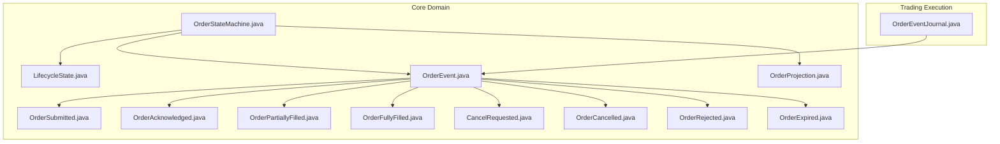
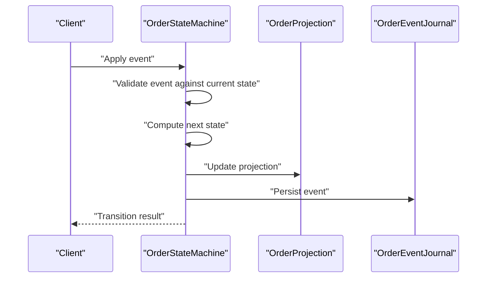
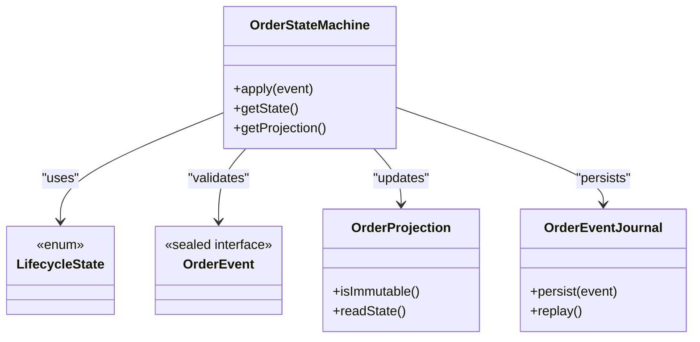

# Order Lifecycle Management

<cite>
**Referenced Files in This Document**
- [OrderStateMachine.java](file://core/src/main/java/com/tradej/core/domain/oms/OrderStateMachine.java)
- [LifecycleState.java](file://core/src/main/java/com/tradej/core/domain/oms/LifecycleState.java)
- [OrderEvent.java](file://core/src/main/java/com/tradej/core/domain/oms/OrderEvent.java)
- [OrderProjection.java](file://core/src/main/java/com/tradej/core/domain/oms/OrderProjection.java)
- [OrderSubmitted.java](file://core/src/main/java/com/tradej/core/domain/oms/OrderSubmitted.java)
- [OrderAcknowledged.java](file://core/src/main/java/com/tradej/core/domain/oms/OrderAcknowledged.java)
- [OrderPartiallyFilled.java](file://core/src/main/java/com/tradej/core/domain/oms/OrderPartiallyFilled.java)
- [OrderFullyFilled.java](file://core/src/main/java/com/tradej/core/domain/oms/OrderFullyFilled.java)
- [CancelRequested.java](file://core/src/main/java/com/tradej/core/domain/oms/CancelRequested.java)
- [OrderCancelled.java](file://core/src/main/java/com/tradej/core/domain/oms/OrderCancelled.java)
- [OrderRejected.java](file://core/src/main/java/com/tradej/core/domain/oms/OrderRejected.java)
- [OrderExpired.java](file://core/src/main/java/com/tradej/core/domain/oms/OrderExpired.java)
- [OrderEventJournal.java](file://trading/execution/src/main/java/com/tradej/execution/journal/OrderEventJournal.java)
- [OrderEventJournal$OrderEventEntry.java](file://trading/execution/src/main/java/com/tradej/execution/journal/OrderEventJournal.java)
- [OrderEventJournal$Accepted.java](file://trading/execution/src/main/java/com/tradej/execution/journal/OrderEventJournal.java)
- [OrderEventJournal$PartiallyFilled.java](file://trading/execution/src/main/java/com/tradej/execution/journal/OrderEventJournal.java)
- [OrderEventJournal$FullyFilled.java](file://trading/execution/src/main/java/com/tradej/execution/journal/OrderEventJournal.java)
- [OrderEventJournal$Cancelled.java](file://trading/execution/src/main/java/com/tradej/execution/journal/OrderEventJournal.java)
- [OrderEventJournal$Rejected.java](file://trading/execution/src/main/java/com/tradej/execution/journal/OrderEventJournal.java)
- [OrderEventJournal$Modified.java](file://trading/execution/src/main/java/com/tradej/execution/journal/OrderEventJournal.java)
- [OrderEventJournal$OrderEventEntry.java](file://trading/execution/src/main/java/com/tradej/execution/journal/OrderEventJournal.java)
- [OrderEventJournal$Accepted.java](file://trading/execution/src/main/java/com/tradej/execution/journal/OrderEventJournal.java)
- [OrderEventJournal$PartiallyFilled.java](file://trading/execution/src/main/java/com/tradej/execution/journal/OrderEventJournal.java)
- [OrderEventJournal$FullyFilled.java](file://trading/execution/src/main/java/com/tradej/execution/journal/OrderEventJournal.java)
- [OrderEventJournal$Cancelled.java](file://trading/execution/src/main/java/com/tradej/execution/journal/OrderEventJournal.java)
- [OrderEventJournal$Rejected.java](file://trading/execution/src/main/java/com/tradej/execution/journal/OrderEventJournal.java)
- [OrderEventJournal$Modified.java](file://trading/execution/src/main/java/com/tradej/execution/journal/OrderEventJournal.java)
- [OrderStateMachineTest.java](file://core/src/test/java/com/tradej/core/domain/oms/OrderStateMachineTest.java)
- [OrderStateMachinePropertyTest.java](file://core/src/test/java/com/tradej/core/domain/oms/OrderStateMachinePropertyTest.java)
- [OrderStateMachineUnitTest.java](file://core/src/test/java/com/tradej/core/domain/oms/OrderStateMachineUnitTest.java)
</cite>

## Table of Contents
1. [Introduction](#introduction)
2. [Project Structure](#project-structure)
3. [Core Components](#core-components)
4. [Architecture Overview](#architecture-overview)
5. [Detailed Component Analysis](#detailed-component-analysis)
6. [Dependency Analysis](#dependency-analysis)
7. [Performance Considerations](#performance-considerations)
8. [Troubleshooting Guide](#troubleshooting-guide)
9. [Conclusion](#conclusion)

## Introduction
This document describes the Order Lifecycle Management system in the TradeJ platform. It focuses on the OrderStateMachine implementation, the lifecycle states, the OrderEvent interface hierarchy, and the immutable OrderProjection used for consistent snapshots. It also documents state transition rules, validation logic, and thread-safety considerations derived from the codebase.

## Project Structure
The Order Lifecycle Management resides primarily under the core domain module, with supporting event journaling under trading execution and tests validating state transitions and immutability guarantees.

**Diagram sources**
- [OrderStateMachine.java](file://core/src/main/java/com/tradej/core/domain/oms/OrderStateMachine.java)
- [LifecycleState.java](file://core/src/main/java/com/tradej/core/domain/oms/LifecycleState.java)
- [OrderEvent.java](file://core/src/main/java/com/tradej/core/domain/oms/OrderEvent.java)
- [OrderProjection.java](file://core/src/main/java/com/tradej/core/domain/oms/OrderProjection.java)
- [OrderSubmitted.java](file://core/src/main/java/com/tradej/core/domain/oms/OrderSubmitted.java)
- [OrderAcknowledged.java](file://core/src/main/java/com/tradej/core/domain/oms/OrderAcknowledged.java)
- [OrderPartiallyFilled.java](file://core/src/main/java/com/tradej/core/domain/oms/OrderPartiallyFilled.java)
- [OrderFullyFilled.java](file://core/src/main/java/com/tradej/core/domain/oms/OrderFullyFilled.java)
- [CancelRequested.java](file://core/src/main/java/com/tradej/core/domain/oms/CancelRequested.java)
- [OrderCancelled.java](file://core/src/main/java/com/tradej/core/domain/oms/OrderCancelled.java)
- [OrderRejected.java](file://core/src/main/java/com/tradej/core/domain/oms/OrderRejected.java)
- [OrderExpired.java](file://core/src/main/java/com/tradej/core/domain/oms/OrderExpired.java)
- [OrderEventJournal.java](file://trading/execution/src/main/java/com/tradej/execution/journal/OrderEventJournal.java)

**Section sources**
- [OrderStateMachine.java](file://core/src/main/java/com/tradej/core/domain/oms/OrderStateMachine.java)
- [LifecycleState.java](file://core/src/main/java/com/tradej/core/domain/oms/LifecycleState.java)
- [OrderEvent.java](file://core/src/main/java/com/tradej/core/domain/oms/OrderEvent.java)
- [OrderProjection.java](file://core/src/main/java/com/tradej/core/domain/oms/OrderProjection.java)
- [OrderEventJournal.java](file://trading/execution/src/main/java/com/tradej/execution/journal/OrderEventJournal.java)

## Core Components
- OrderStateMachine: Enforces legal state transitions and validates events against current state.
- LifecycleState: Enumerates all order states from NEW through FINAL states.
- OrderEvent: Sealed interface defining the event hierarchy for lifecycle updates.
- OrderProjection: Immutable view snapshot of an order’s state for consistent reads.
- OrderEventJournal: Records and serializes order events for replay and audit.

**Section sources**
- [OrderStateMachine.java](file://core/src/main/java/com/tradej/core/domain/oms/OrderStateMachine.java)
- [LifecycleState.java](file://core/src/main/java/com/tradej/core/domain/oms/LifecycleState.java)
- [OrderEvent.java](file://core/src/main/java/com/tradej/core/domain/oms/OrderEvent.java)
- [OrderProjection.java](file://core/src/main/java/com/tradej/core/domain/oms/OrderProjection.java)
- [OrderEventJournal.java](file://trading/execution/src/main/java/com/tradej/execution/journal/OrderEventJournal.java)

## Architecture Overview
The lifecycle is driven by discrete events applied to the OrderStateMachine, which advances the order through ordered states. The immutable OrderProjection captures a consistent snapshot for external consumers. The OrderEventJournal persists events for replay and auditing.

**Diagram sources**
- [OrderStateMachine.java](file://core/src/main/java/com/tradej/core/domain/oms/OrderStateMachine.java)
- [OrderProjection.java](file://core/src/main/java/com/tradej/core/domain/oms/OrderProjection.java)
- [OrderEventJournal.java](file://trading/execution/src/main/java/com/tradej/execution/journal/OrderEventJournal.java)

## Detailed Component Analysis

### LifecycleState Enumeration
LifecycleState enumerates all order states from initial creation to final termination. These states represent canonical lifecycle stages and inform the legal transitions enforced by the OrderStateMachine.

- NEW
- SUBMITTED
- ACKNOWLEDGED
- PARTIALLY_FILLED
- FULLY_FILLED
- CANCEL_REQUESTED
- CANCELLED
- REJECTED
- EXPIRED

These states cover the full spectrum from order creation through completion or termination.

**Section sources**
- [LifecycleState.java](file://core/src/main/java/com/tradej/core/domain/oms/LifecycleState.java)

### OrderEvent Interface Hierarchy
OrderEvent is a sealed interface that defines the set of events that can alter order state. The permitted event types include:

- OrderSubmitted: Initial submission event
- OrderAcknowledged: Broker acknowledgment event
- OrderPartiallyFilled: Partial fill event
- OrderFullyFilled: Complete fill event
- CancelRequested: Request to cancel
- OrderCancelled: Cancel confirmed
- OrderRejected: Rejection event
- OrderExpired: Expiration event

Permitted subtypes are defined via the sealed interface declaration.

**Section sources**
- [OrderEvent.java](file://core/src/main/java/com/tradej/core/domain/oms/OrderEvent.java)
- [OrderSubmitted.java](file://core/src/main/java/com/tradej/core/domain/oms/OrderSubmitted.java)
- [OrderAcknowledged.java](file://core/src/main/java/com/tradej/core/domain/oms/OrderAcknowledged.java)
- [OrderPartiallyFilled.java](file://core/src/main/java/com/tradej/core/domain/oms/OrderPartiallyFilled.java)
- [OrderFullyFilled.java](file://core/src/main/java/com/tradej/core/domain/oms/OrderFullyFilled.java)
- [CancelRequested.java](file://core/src/main/java/com/tradej/core/domain/oms/CancelRequested.java)
- [OrderCancelled.java](file://core/src/main/java/com/tradej/core/domain/oms/OrderCancelled.java)
- [OrderRejected.java](file://core/src/main/java/com/tradej/core/domain/oms/OrderRejected.java)
- [OrderExpired.java](file://core/src/main/java/com/tradej/core/domain/oms/OrderExpired.java)

### OrderStateMachine Implementation
OrderStateMachine encapsulates:
- Legal state transitions
- Event validation against current state
- Projection updates
- Thread-safety considerations

Key responsibilities:
- Validate that an incoming event is legal given the current state
- Compute the next state based on the event type
- Update the immutable OrderProjection atomically
- Persist the event via the OrderEventJournal

State transition table logic
- The transition table encodes allowed transitions per event type and current state
- Validation ensures only permitted transitions occur
- Errors are raised for invalid transitions

Immutable projections
- OrderProjection is updated after each successful transition
- The projection is immutable and safe for concurrent reads

Thread-safety mechanisms
- The state machine applies transitions in a controlled manner
- Tests demonstrate concurrent access scenarios and expected outcomes

Practical examples
- Transition from NEW to SUBMITTED upon OrderSubmitted
- Transition from ACKNOWLEDGED to PARTIALLY_FILLED upon OrderPartiallyFilled
- Transition from PARTIALLY_FILLED to FULLY_FILLED upon OrderFullyFilled
- Transition from SUBMITTED to CANCELLED upon OrderCancelled (after cancellation)
- Transition from NEW to REJECTED upon OrderRejected
- Transition from SUBMITTED to EXPIRED upon OrderExpired

State rebuilding from event logs
- Events are persisted by OrderEventJournal
- The state machine can rebuild state by replaying events in order
- The immutable projection reflects the latest consistent state after replay

**Section sources**
- [OrderStateMachine.java](file://core/src/main/java/com/tradej/core/domain/oms/OrderStateMachine.java)
- [OrderEventJournal.java](file://trading/execution/src/main/java/com/tradej/execution/journal/OrderEventJournal.java)
- [OrderProjection.java](file://core/src/main/java/com/tradej/core/domain/oms/OrderProjection.java)
- [OrderStateMachineTest.java](file://core/src/test/java/com/tradej/core/domain/oms/OrderStateMachineTest.java)
- [OrderStateMachinePropertyTest.java](file://core/src/test/java/com/tradej/core/domain/oms/OrderStateMachinePropertyTest.java)
- [OrderStateMachineUnitTest.java](file://core/src/test/java/com/tradej/core/domain/oms/OrderStateMachineUnitTest.java)

### OrderProjection Immutable View
OrderProjection provides an immutable, consistent snapshot of the order state for external consumption. It is updated by the OrderStateMachine after each validated transition and is safe for concurrent readers.

- Immutable: No mutation after construction
- Consistent: Captures state at a specific point in time
- Efficient reads: Safe to share across threads without synchronization

**Section sources**
- [OrderProjection.java](file://core/src/main/java/com/tradej/core/domain/oms/OrderProjection.java)

### OrderEventJournal Persistence
OrderEventJournal records events for auditability and replay. It serializes and deserializes events, enabling reconstruction of order state from logs.

- Persists events for replay
- Supports serialization/deserialization
- Enables audit trail of all lifecycle changes

**Section sources**
- [OrderEventJournal.java](file://trading/execution/src/main/java/com/tradej/execution/journal/OrderEventJournal.java)

## Dependency Analysis
The OrderStateMachine depends on:
- LifecycleState for state definitions
- OrderEvent hierarchy for event types
- OrderProjection for immutable snapshots
- OrderEventJournal for persistence

**Diagram sources**
- [OrderStateMachine.java](file://core/src/main/java/com/tradej/core/domain/oms/OrderStateMachine.java)
- [LifecycleState.java](file://core/src/main/java/com/tradej/core/domain/oms/LifecycleState.java)
- [OrderEvent.java](file://core/src/main/java/com/tradej/core/domain/oms/OrderEvent.java)
- [OrderProjection.java](file://core/src/main/java/com/tradej/core/domain/oms/OrderProjection.java)
- [OrderEventJournal.java](file://trading/execution/src/main/java/com/tradej/execution/journal/OrderEventJournal.java)

**Section sources**
- [OrderStateMachine.java](file://core/src/main/java/com/tradej/core/domain/oms/OrderStateMachine.java)
- [LifecycleState.java](file://core/src/main/java/com/tradej/core/domain/oms/LifecycleState.java)
- [OrderEvent.java](file://core/src/main/java/com/tradej/core/domain/oms/OrderEvent.java)
- [OrderProjection.java](file://core/src/main/java/com/tradej/core/domain/oms/OrderProjection.java)
- [OrderEventJournal.java](file://trading/execution/src/main/java/com/tradej/execution/journal/OrderEventJournal.java)

## Performance Considerations
- Immutable projections reduce contention and enable lock-free reads
- Event journaling supports efficient replay and audit without modifying core state machine logic
- Concurrency tests indicate the state machine handles concurrent transitions safely

[No sources needed since this section provides general guidance]

## Troubleshooting Guide
Common issues and resolutions:
- Invalid state transitions: Ensure the event type matches the current state according to the transition table
- Event ordering problems: Rebuild state by replaying events from the OrderEventJournal in strict chronological order
- Concurrency anomalies: Verify that updates occur through the OrderStateMachine to maintain atomicity and immutability

**Section sources**
- [OrderStateMachineTest.java](file://core/src/test/java/com/tradej/core/domain/oms/OrderStateMachineTest.java)
- [OrderStateMachinePropertyTest.java](file://core/src/test/java/com/tradej/core/domain/oms/OrderStateMachinePropertyTest.java)
- [OrderStateMachineUnitTest.java](file://core/src/test/java/com/tradej/core/domain/oms/OrderStateMachineUnitTest.java)

## Conclusion
The Order Lifecycle Management system enforces strict, validated state transitions using a sealed event model and immutable projections. The OrderStateMachine centralizes validation and state advancement, while the OrderEventJournal enables reliable replay and auditing. Together, these components provide a robust, thread-safe foundation for managing order lifecycles at scale.