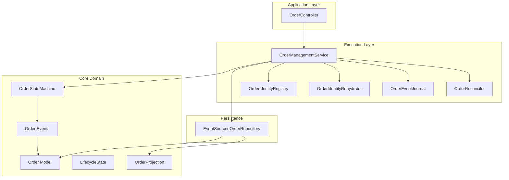
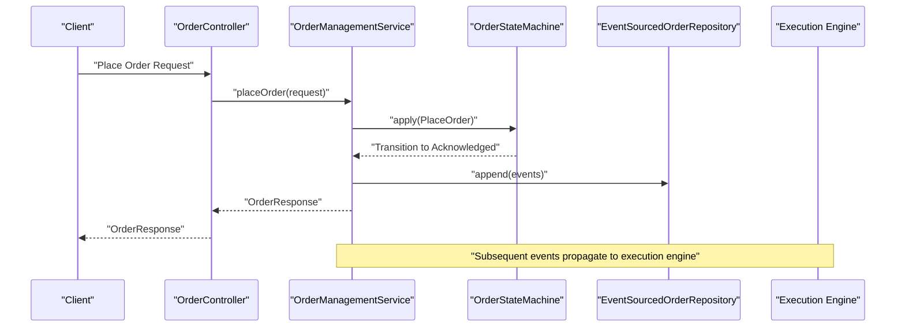
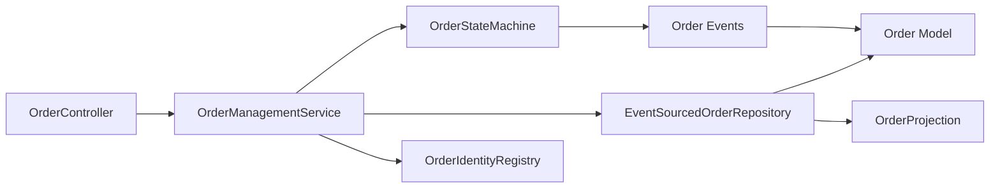

# Order Management System

<cite>
**Referenced Files in This Document**
- [OrderController.java](file://app/src/main/java/com/tradej/app/api/OrderController.java)
- [OrderManagementService.java](file://trading/execution/src/main/java/com/tradej/execution/service/OrderManagementService.java)
- [OrderStateMachine.java](file://core/src/main/java/com/tradej/core/domain/oms/OrderStateMachine.java)
- [LifecycleState.java](file://core/src/main/java/com/tradej/core/domain/oms/LifecycleState.java)
- [EventSourcedOrderRepository.java](file://data/persistence/src/main/java/com/tradej/persistence/oms/EventSourcedOrderRepository.java)
- [Order.java](file://core/src/main/java/com/tradej/core/domain/model/Order.java)
- [OrderProjection.java](file://core/src/main/java/com/tradej/core/domain/oms/OrderProjection.java)
- [OrderEvent.java](file://core/src/main/java/com/tradej/core/domain/oms/OrderEvent.java)
- [OrderAccepted.java](file://core/src/main/java/com/tradej/core/domain/event/OrderAccepted.java)
- [OrderModified.java](file://core/src/main/java/com/tradej/core/domain/event/OrderModified.java)
- [OrderCancelled.java](file://core/src/main/java/com/tradej/core/domain/event/OrderCancelled.java)
- [OrderPartiallyFilled.java](file://core/src/main/java/com/tradej/core/domain/event/OrderPartiallyFilled.java)
- [OrderFullyFilled.java](file://core/src/main/java/com/tradej/core/domain/event/OrderFullyFilled.java)
- [OrderRejected.java](file://core/src/main/java/com/tradej/core/domain/event/OrderRejected.java)
- [OrderExpired.java](file://core/src/main/java/com/tradej/core/domain/event/OrderExpired.java)
- [OrderReconciler.java](file://trading/execution/src/main/java/com/tradej/execution/reconcile/OrderReconciler.java)
- [OrderEventJournal.java](file://trading/execution/src/main/java/com/tradej/execution/journal/OrderEventJournal.java)
- [OrderIdentityRegistry.java](file://trading/execution/src/main/java/com/tradej/execution/identity/OrderIdentityRegistry.java)
- [OrderIdentityRehydrator.java](file://trading/execution/src/main/java/com/tradej/execution/identity/OrderIdentityRehydrator.java)
- [OrderReplayIntegrationTest.java](file://app/src/test/java/com/tradej/app/integration/OrderReplayIntegrationTest.java)
- [OrderControllerComponentTest.java](file://app/src/test/java/com/tradej/app/api/OrderControllerComponentTest.java)
- [OrderStateMachineTest.java](file://core/src/test/java/com/tradej/core/domain/oms/OrderStateMachineTest.java)
- [EventSourcedOrderRepositoryTest.java](file://data/persistence/src/test/java/com/tradej/persistence/oms/EventSourcedOrderRepositoryTest.java)
</cite>

## Table of Contents
1. [Introduction](#introduction)
2. [Project Structure](#project-structure)
3. [Core Components](#core-components)
4. [Architecture Overview](#architecture-overview)
5. [Detailed Component Analysis](#detailed-component-analysis)
6. [Dependency Analysis](#dependency-analysis)
7. [Performance Considerations](#performance-considerations)
8. [Troubleshooting Guide](#troubleshooting-guide)
9. [Conclusion](#conclusion)

## Introduction
This document describes the Order Management System (OMS) within the Trade-J platform. It explains the order lifecycle management architecture, the state machine implementation, and state transitions. It documents the OrderManagementService class covering order placement, modification, cancellation, and query operations. It details the OrderStateMachine with legal state transitions, event validation, and immutable projections. It covers order identity management, event sourcing via the EventSourcedOrderRepository, and order persistence mechanisms. Practical examples of order operations, state machine usage patterns, and integration with the execution engine are included, along with repository functionality, state rebuilding, and replay capabilities.

## Project Structure
The OMS spans several modules:
- Application API layer exposes order operations to clients.
- Execution layer implements the OrderManagementService and integrates with the execution engine.
- Core domain defines the order model, lifecycle states, events, and state machine.
- Persistence module implements event-sourced repositories for order state reconstruction.
- Tests validate state machine correctness, repository behavior, and end-to-end order lifecycles.

**Diagram sources**
- [OrderController.java:1-200](file://app/src/main/java/com/tradej/app/api/OrderController.java#L1-L200)
- [OrderManagementService.java:1-300](file://trading/execution/src/main/java/com/tradej/execution/service/OrderManagementService.java#L1-L300)
- [OrderStateMachine.java:1-200](file://core/src/main/java/com/tradej/core/domain/oms/OrderStateMachine.java#L1-L200)
- [EventSourcedOrderRepository.java:1-200](file://data/persistence/src/main/java/com/tradej/persistence/oms/EventSourcedOrderRepository.java#L1-L200)
- [Order.java:1-200](file://core/src/main/java/com/tradej/core/domain/model/Order.java#L1-L200)
- [OrderProjection.java:1-200](file://core/src/main/java/com/tradej/core/domain/oms/OrderProjection.java#L1-L200)
- [OrderEvent.java:1-200](file://core/src/main/java/com/tradej/core/domain/oms/OrderEvent.java#L1-L200)

**Section sources**
- [OrderController.java:1-200](file://app/src/main/java/com/tradej/app/api/OrderController.java#L1-L200)
- [OrderManagementService.java:1-300](file://trading/execution/src/main/java/com/tradej/execution/service/OrderManagementService.java#L1-L300)
- [OrderStateMachine.java:1-200](file://core/src/main/java/com/tradej/core/domain/oms/OrderStateMachine.java#L1-L200)
- [EventSourcedOrderRepository.java:1-200](file://data/persistence/src/main/java/com/tradej/persistence/oms/EventSourcedOrderRepository.java#L1-L200)
- [Order.java:1-200](file://core/src/main/java/com/tradej/core/domain/model/Order.java#L1-L200)
- [OrderProjection.java:1-200](file://core/src/main/java/com/tradej/core/domain/oms/OrderProjection.java#L1-L200)
- [OrderEvent.java:1-200](file://core/src/main/java/com/tradej/core/domain/oms/OrderEvent.java#L1-L200)

## Core Components
- OrderController: Exposes REST endpoints for placing, modifying, canceling, and querying orders.
- OrderManagementService: Orchestrates order lifecycle operations, validates requests, publishes domain events, and manages identity and persistence.
- OrderStateMachine: Encapsulates legal state transitions and event validation for order lifecycle.
- EventSourcedOrderRepository: Implements event sourcing to persist and reconstruct order state.
- Order Model and Projection: Immutable domain entities and read-side projections for queries.
- Order Identity Registry and Rehydrator: Manages order identity generation and rehydration for replay.
- Order Reconciler and Event Journal: Support reconciliation and audit trails for order events.

**Section sources**
- [OrderController.java:1-200](file://app/src/main/java/com/tradej/app/api/OrderController.java#L1-L200)
- [OrderManagementService.java:1-300](file://trading/execution/src/main/java/com/tradej/execution/service/OrderManagementService.java#L1-L300)
- [OrderStateMachine.java:1-200](file://core/src/main/java/com/tradej/core/domain/oms/OrderStateMachine.java#L1-L200)
- [EventSourcedOrderRepository.java:1-200](file://data/persistence/src/main/java/com/tradej/persistence/oms/EventSourcedOrderRepository.java#L1-L200)
- [Order.java:1-200](file://core/src/main/java/com/tradej/core/domain/model/Order.java#L1-L200)
- [OrderProjection.java:1-200](file://core/src/main/java/com/tradej/core/domain/oms/OrderProjection.java#L1-L200)
- [OrderIdentityRegistry.java:1-200](file://trading/execution/src/main/java/com/tradej/execution/identity/OrderIdentityRegistry.java#L1-L200)
- [OrderIdentityRehydrator.java:1-200](file://trading/execution/src/main/java/com/tradej/execution/identity/OrderIdentityRehydrator.java#L1-L200)
- [OrderReconciler.java:1-200](file://trading/execution/src/main/java/com/tradej/execution/reconcile/OrderReconciler.java#L1-L200)
- [OrderEventJournal.java:1-200](file://trading/execution/src/main/java/com/tradej/execution/journal/OrderEventJournal.java#L1-L200)

## Architecture Overview
The OMS follows an event-driven architecture:
- API layer receives commands and delegates to the OrderManagementService.
- The service validates inputs, generates order identifiers, applies state transitions via the OrderStateMachine, publishes domain events, persists events, and updates read models.
- Event sourcing enables state reconstruction and replay for compliance and debugging.
- The execution engine consumes published events to drive order routing and fills.

**Diagram sources**
- [OrderController.java:1-200](file://app/src/main/java/com/tradej/app/api/OrderController.java#L1-L200)
- [OrderManagementService.java:1-300](file://trading/execution/src/main/java/com/tradej/execution/service/OrderManagementService.java#L1-L300)
- [OrderStateMachine.java:1-200](file://core/src/main/java/com/tradej/core/domain/oms/OrderStateMachine.java#L1-L200)
- [EventSourcedOrderRepository.java:1-200](file://data/persistence/src/main/java/com/tradej/persistence/oms/EventSourcedOrderRepository.java#L1-L200)

## Detailed Component Analysis

### OrderManagementService
Responsibilities:
- Validate incoming order requests and transform them into domain commands.
- Generate order identifiers and manage identity registry.
- Apply state transitions using OrderStateMachine.
- Publish domain events (accepted, modified, cancelled, filled, rejected, expired).
- Persist events via EventSourcedOrderRepository.
- Provide order query projections and handle replay scenarios.

Key operations:
- Place order: Validates request, initializes state, publishes accepted event, persists, and returns response.
- Modify order: Validates modification against current state, publishes modified event, persists.
- Cancel order: Validates cancellation eligibility, publishes cancelled event, persists.
- Query order: Returns immutable projection built from persisted events.

Integration points:
- OrderStateMachine for state transitions.
- EventSourcedOrderRepository for persistence and replay.
- OrderIdentityRegistry for identifier allocation.
- OrderEventJournal for audit trail.
- OrderReconciler for discrepancy detection.

**Section sources**
- [OrderManagementService.java:1-300](file://trading/execution/src/main/java/com/tradej/execution/service/OrderManagementService.java#L1-L300)
- [OrderController.java:1-200](file://app/src/main/java/com/tradej/app/api/OrderController.java#L1-L200)
- [OrderIdentityRegistry.java:1-200](file://trading/execution/src/main/java/com/tradej/execution/identity/OrderIdentityRegistry.java#L1-L200)
- [OrderEventJournal.java:1-200](file://trading/execution/src/main/java/com/tradej/execution/journal/OrderEventJournal.java#L1-L200)
- [OrderReconciler.java:1-200](file://trading/execution/src/main/java/com/tradej/execution/reconcile/OrderReconciler.java#L1-L200)

### OrderStateMachine
Responsibilities:
- Define legal state transitions for orders.
- Validate events against current state to prevent illegal transitions.
- Produce immutable projections representing the order's current state.

States and transitions:
- LifecycleState enumerates states such as New, Acknowledged, Submitted, PartiallyFilled, FullyFilled, Cancelled, Rejected, Expired.
- Transitions are validated to ensure monotonic progression and correct preconditions (e.g., cannot cancel after fully filled).

Event validation:
- Each event type corresponds to a specific transition trigger.
- Validation ensures event applicability given the current state.

Immutable projections:
- OrderProjection captures the denormalized view for queries without exposing internal state mutation.

**Section sources**
- [OrderStateMachine.java:1-200](file://core/src/main/java/com/tradej/core/domain/oms/OrderStateMachine.java#L1-L200)
- [LifecycleState.java:1-200](file://core/src/main/java/com/tradej/core/domain/oms/LifecycleState.java#L1-L200)
- [OrderProjection.java:1-200](file://core/src/main/java/com/tradej/core/domain/oms/OrderProjection.java#L1-L200)
- [OrderEvent.java:1-200](file://core/src/main/java/com/tradej/core/domain/oms/OrderEvent.java#L1-L200)

### EventSourcedOrderRepository
Responsibilities:
- Persist order events as a sequence of immutable records.
- Rebuild order state by replaying events in order.
- Provide snapshot-like read models for efficient querying.

Capabilities:
- Append new events to the event stream.
- Retrieve event streams for a given order.
- Reconstruct order state from scratch for replay or recovery.
- Support replay sessions for regulatory and debugging needs.

**Section sources**
- [EventSourcedOrderRepository.java:1-200](file://data/persistence/src/main/java/com/tradej/persistence/oms/EventSourcedOrderRepository.java#L1-L200)
- [OrderReplayIntegrationTest.java:1-200](file://app/src/test/java/com/tradej/app/integration/OrderReplayIntegrationTest.java#L1-L200)
- [EventSourcedOrderRepositoryTest.java:1-200](file://data/persistence/src/test/java/com/tradej/persistence/oms/EventSourcedOrderRepositoryTest.java#L1-L200)

### Order Model and Projection
- Order: Immutable domain entity encapsulating order metadata and state.
- OrderProjection: Denormalized read model optimized for queries, updated by replaying events.

Usage:
- Queries return OrderProjection snapshots.
- Modifications and cancellations update the projection via event replay.

**Section sources**
- [Order.java:1-200](file://core/src/main/java/com/tradej/core/domain/model/Order.java#L1-L200)
- [OrderProjection.java:1-200](file://core/src/main/java/com/tradej/core/domain/oms/OrderProjection.java#L1-L200)

### Order Identity Management
- OrderIdentityRegistry: Centralized registry for generating and tracking order identifiers.
- OrderIdentityRehydrator: Rehydrates identifiers during replay to maintain consistency across runs.

**Section sources**
- [OrderIdentityRegistry.java:1-200](file://trading/execution/src/main/java/com/tradej/execution/identity/OrderIdentityRegistry.java#L1-L200)
- [OrderIdentityRehydrator.java:1-200](file://trading/execution/src/main/java/com/tradej/execution/identity/OrderIdentityRehydrator.java#L1-L200)

### Domain Events
- OrderAccepted, OrderModified, OrderCancelled, OrderPartiallyFilled, OrderFullyFilled, OrderRejected, OrderExpired: Events emitted during lifecycle transitions.

These events are persisted and consumed by downstream systems for execution, reconciliation, and reporting.

**Section sources**
- [OrderAccepted.java:1-200](file://core/src/main/java/com/tradej/core/domain/event/OrderAccepted.java#L1-L200)
- [OrderModified.java:1-200](file://core/src/main/java/com/tradej/core/domain/event/OrderModified.java#L1-L200)
- [OrderCancelled.java:1-200](file://core/src/main/java/com/tradej/core/domain/event/OrderCancelled.java#L1-L200)
- [OrderPartiallyFilled.java:1-200](file://core/src/main/java/com/tradej/core/domain/event/OrderPartiallyFilled.java#L1-L200)
- [OrderFullyFilled.java:1-200](file://core/src/main/java/com/tradej/core/domain/event/OrderFullyFilled.java#L1-L200)
- [OrderRejected.java:1-200](file://core/src/main/java/com/tradej/core/domain/event/OrderRejected.java#L1-L200)
- [OrderExpired.java:1-200](file://core/src/main/java/com/tradej/core/domain/event/OrderExpired.java#L1-L200)

### API and Integration Examples
- Placing an order: Controller receives request, service validates and places, state machine transitions to acknowledged, event appended, response returned.
- Modifying an order: Service validates modification against current state, publishes modified event, updates projection.
- Cancelling an order: Service checks eligibility, publishes cancelled event, persists.
- Querying an order: Service returns immutable projection derived from event replay.
- Replay integration: Tests demonstrate end-to-end replay scenarios for validation and debugging.

**Section sources**
- [OrderController.java:1-200](file://app/src/main/java/com/tradej/app/api/OrderController.java#L1-L200)
- [OrderControllerComponentTest.java:1-200](file://app/src/test/java/com/tradej/app/api/OrderControllerComponentTest.java#L1-L200)
- [OrderReplayIntegrationTest.java:1-200](file://app/src/test/java/com/tradej/app/integration/OrderReplayIntegrationTest.java#L1-L200)

## Dependency Analysis
The OMS exhibits clear layering:
- Application depends on Execution.
- Execution depends on Core domain and Persistence.
- Core domain depends on Value Objects and Events.
- Persistence depends on Core models and projections.

**Diagram sources**
- [OrderController.java:1-200](file://app/src/main/java/com/tradej/app/api/OrderController.java#L1-L200)
- [OrderManagementService.java:1-300](file://trading/execution/src/main/java/com/tradej/execution/service/OrderManagementService.java#L1-L300)
- [OrderStateMachine.java:1-200](file://core/src/main/java/com/tradej/core/domain/oms/OrderStateMachine.java#L1-L200)
- [EventSourcedOrderRepository.java:1-200](file://data/persistence/src/main/java/com/tradej/persistence/oms/EventSourcedOrderRepository.java#L1-L200)
- [Order.java:1-200](file://core/src/main/java/com/tradej/core/domain/model/Order.java#L1-L200)
- [OrderProjection.java:1-200](file://core/src/main/java/com/tradej/core/domain/oms/OrderProjection.java#L1-L200)
- [OrderEvent.java:1-200](file://core/src/main/java/com/tradej/core/domain/oms/OrderEvent.java#L1-L200)

**Section sources**
- [OrderManagementService.java:1-300](file://trading/execution/src/main/java/com/tradej/execution/service/OrderManagementService.java#L1-L300)
- [OrderStateMachine.java:1-200](file://core/src/main/java/com/tradej/core/domain/oms/OrderStateMachine.java#L1-L200)
- [EventSourcedOrderRepository.java:1-200](file://data/persistence/src/main/java/com/tradej/persistence/oms/EventSourcedOrderRepository.java#L1-L200)
- [Order.java:1-200](file://core/src/main/java/com/tradej/core/domain/model/Order.java#L1-L200)
- [OrderProjection.java:1-200](file://core/src/main/java/com/tradej/core/domain/oms/OrderProjection.java#L1-L200)
- [OrderEvent.java:1-200](file://core/src/main/java/com/tradej/core/domain/oms/OrderEvent.java#L1-L200)

## Performance Considerations
- Event sourcing: Efficient for auditability and replay but requires careful indexing and snapshotting strategies for large volumes.
- Immutable projections: Reduce write contention by updating read models asynchronously.
- Idempotency: Use OrderIdentityRegistry to avoid duplicate processing during retries.
- Batch operations: Group modifications to minimize event volume and improve throughput.
- Caching: Cache frequently accessed projections to reduce read latency.

## Troubleshooting Guide
Common issues and resolutions:
- Illegal state transitions: Validate event applicability using OrderStateMachine before applying.
- Duplicate order IDs: Ensure OrderIdentityRegistry is consulted before accepting new orders.
- Event replay inconsistencies: Verify EventSourcedOrderRepository ordering and completeness; use OrderReconciler to detect discrepancies.
- Audit gaps: Confirm OrderEventJournal entries align with emitted events.

**Section sources**
- [OrderStateMachineTest.java:1-200](file://core/src/test/java/com/tradej/core/domain/oms/OrderStateMachineTest.java#L1-L200)
- [EventSourcedOrderRepositoryTest.java:1-200](file://data/persistence/src/test/java/com/tradej/persistence/oms/EventSourcedOrderRepositoryTest.java#L1-L200)
- [OrderReconciler.java:1-200](file://trading/execution/src/main/java/com/tradej/execution/reconcile/OrderReconciler.java#L1-L200)
- [OrderEventJournal.java:1-200](file://trading/execution/src/main/java/com/tradej/execution/journal/OrderEventJournal.java#L1-L200)

## Conclusion
The OMS employs a robust, event-driven design centered on the OrderStateMachine and event sourcing. OrderManagementService orchestrates lifecycle operations, while EventSourcedOrderRepository ensures durable persistence and replay capabilities. Immutable projections and identity management further enhance reliability and auditability. Together, these components provide a scalable and maintainable foundation for order lifecycle management integrated with the execution engine.