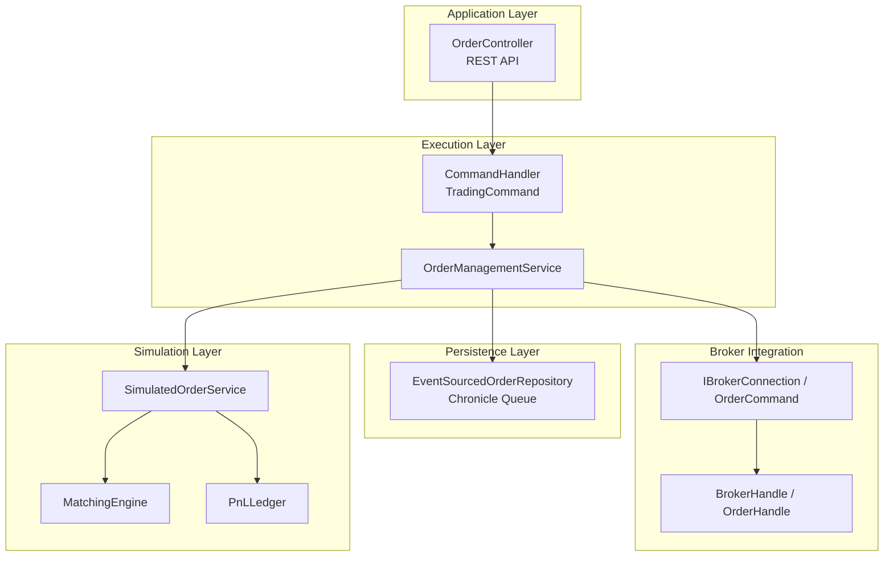
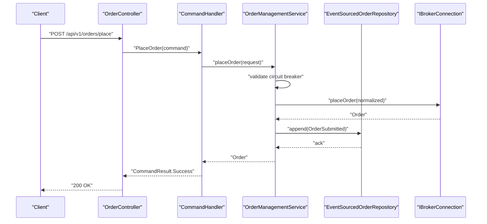
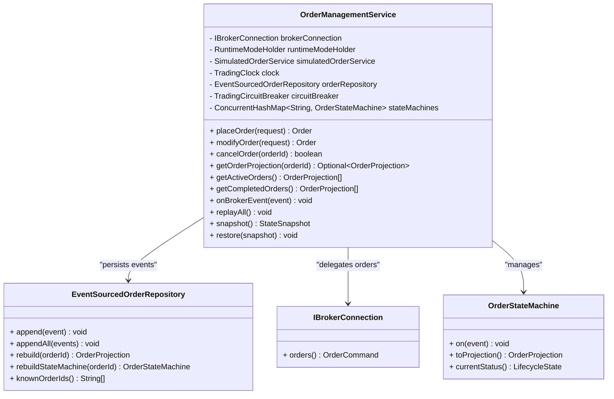
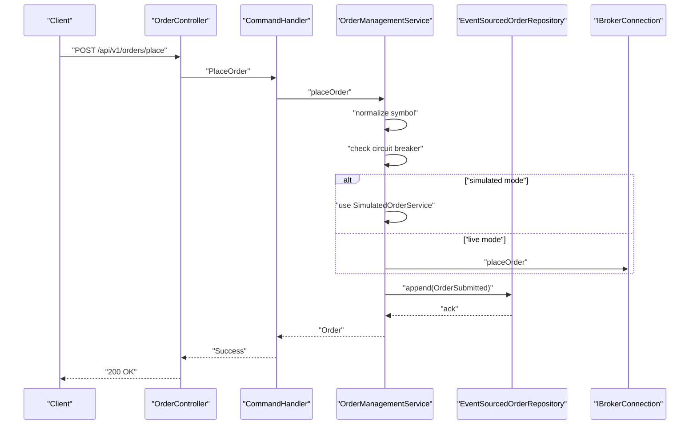
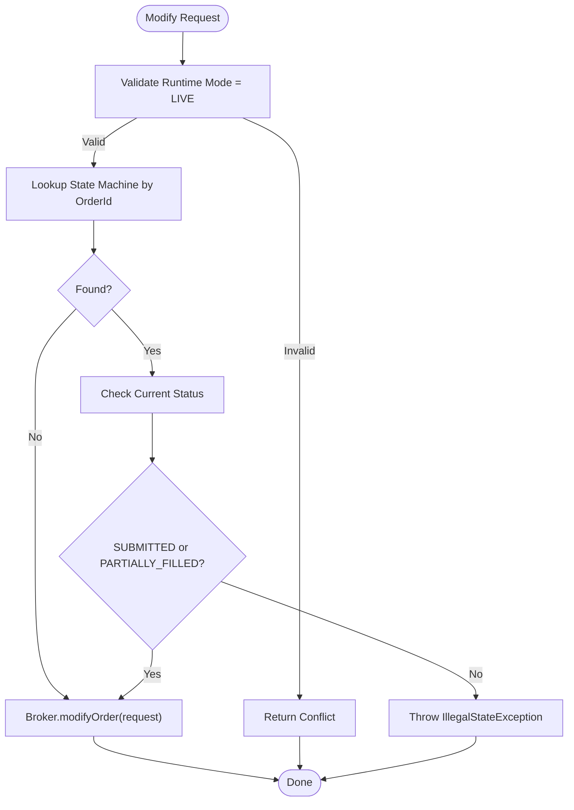
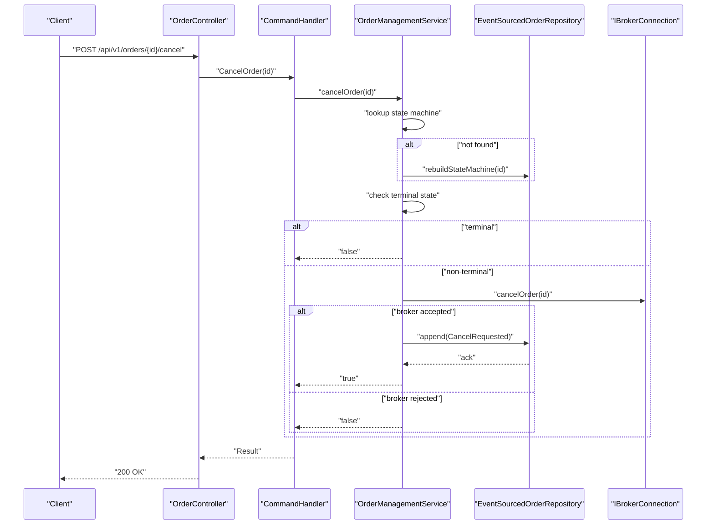
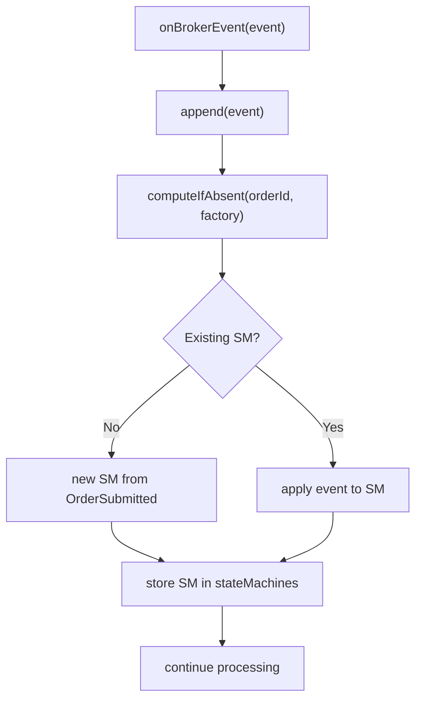
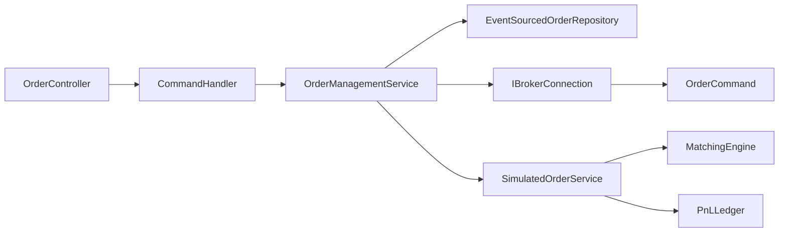
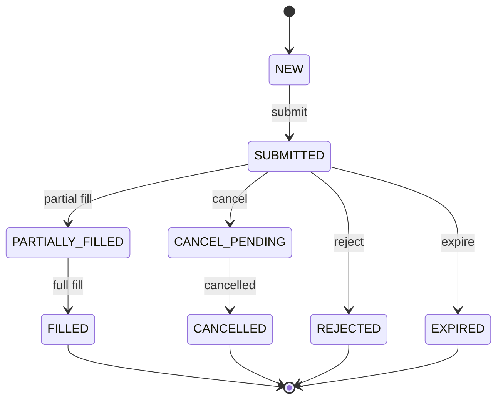

# Order Operations Service

<cite>
**Referenced Files in This Document**
- [OrderManagementService.java](file://trading/execution/src/main/java/com/tradej/execution/service/OrderManagementService.java)
- [OrderController.java](file://app/src/main/java/com/tradej/app/api/OrderController.java)
- [TradingCommand.java](file://trading/execution/src/main/java/com/tradej/execution/command/TradingCommand.java)
- [EventSourcedOrderRepository.java](file://data/persistence/src/main/java/com/tradej/persistence/oms/EventSourcedOrderRepository.java)
- [OrderStateMachine.java](file://core/src/main/java/com/tradej/core/domain/oms/OrderStateMachine.java)
- [IBrokerConnection.java](file://broker/api/src/main/java/com/tradej/broker/api/IBrokerConnection.java)
- [OrderCommand.java](file://broker/api/src/main/java/com/tradej/broker/api/port/OrderCommand.java)
- [OrderHandle.java](file://broker-gateway/src/main/java/com/tradej/brokergateway/OrderHandle.java)
- [BrokerHandle.java](file://broker-gateway/src/main/java/com/tradej/brokergateway/BrokerHandle.java)
- [ExecutionHandlerUnitTest.java](file://trading/execution/src/test/java/com/tradej/execution/service/ExecutionHandlerUnitTest.java)
- [EventSourcedOrderRepositoryTest.java](file://data/persistence/src/test/java/com/tradej/persistence/oms/EventSourcedOrderRepositoryTest.java)
- [TripleModePNLParityTest.java](file://app/src/test/java/com/tradej/app/integration/TripleModePNLParityTest.java)
- [DhanOrderModifyIntegrationTest.java](file://app/src/test/java/com/tradej/app/integration/DhanOrderModifyIntegrationTest.java)
- [ENGINEERING_REPORT.md](file://docs/ENGINEERING_REPORT.md)
</cite>

## Table of Contents
1. [Introduction](#introduction)
2. [Project Structure](#project-structure)
3. [Core Components](#core-components)
4. [Architecture Overview](#architecture-overview)
5. [Detailed Component Analysis](#detailed-component-analysis)
6. [Dependency Analysis](#dependency-analysis)
7. [Performance Considerations](#performance-considerations)
8. [Troubleshooting Guide](#troubleshooting-guide)
9. [Conclusion](#conclusion)
10. [Appendices](#appendices)

## Introduction
This document describes the Order Operations Service, focusing on the OrderManagementService class and its role in orchestrating order lifecycle operations. It explains how the service integrates with broker connections, runtime mode handling, and simulated order execution. It documents validation rules, state checking for modifications, circuit breaker integration, and event processing with atomic persistence. It also covers state machine rebuilding on startup, concurrency and thread-safety mechanisms, and state snapshot functionality for replay systems. Practical examples illustrate order operations, error handling strategies, and integration patterns with the execution engine.

## Project Structure
The Order Operations Service spans several modules:
- Application API layer exposes REST endpoints for order placement, modification, and cancellation.
- Execution layer handles command dispatch and orchestrates order lifecycle operations.
- Persistence layer provides atomic event sourcing for order state reconstruction.
- Broker integration provides pluggable connections to various brokers.
- Simulation layer supports REPLAY and BACKTEST modes with a matching engine and PnL ledger.

**Diagram sources**
- [OrderController.java:32-157](file://app/src/main/java/com/tradej/app/api/OrderController.java#L32-L157)
- [TradingCommand.java:18-30](file://trading/execution/src/main/java/com/tradej/execution/command/TradingCommand.java#L18-L30)
- [OrderManagementService.java:44-316](file://trading/execution/src/main/java/com/tradej/execution/service/OrderManagementService.java#L44-L316)
- [EventSourcedOrderRepository.java:56-123](file://data/persistence/src/main/java/com/tradej/persistence/oms/EventSourcedOrderRepository.java#L56-L123)
- [OrderHandle.java:14-37](file://broker-gateway/src/main/java/com/tradej/brokergateway/OrderHandle.java#L14-L37)
- [BrokerHandle.java:249-279](file://broker-gateway/src/main/java/com/tradej/brokergateway/BrokerHandle.java#L249-L279)
- [IBrokerConnection.java](file://broker/api/src/main/java/com/tradej/broker/api/IBrokerConnection.java)
- [OrderCommand.java:10-31](file://broker/api/src/main/java/com/tradej/broker/api/port/OrderCommand.java#L10-L31)

**Section sources**
- [OrderController.java:32-157](file://app/src/main/java/com/tradej/app/api/OrderController.java#L32-L157)
- [OrderManagementService.java:44-316](file://trading/execution/src/main/java/com/tradej/execution/service/OrderManagementService.java#L44-L316)
- [EventSourcedOrderRepository.java:56-123](file://data/persistence/src/main/java/com/tradej/persistence/oms/EventSourcedOrderRepository.java#L56-L123)
- [OrderHandle.java:14-37](file://broker-gateway/src/main/java/com/tradej/brokergateway/OrderHandle.java#L14-L37)
- [BrokerHandle.java:249-279](file://broker-gateway/src/main/java/com/tradej/brokergateway/BrokerHandle.java#L249-L279)
- [IBrokerConnection.java](file://broker/api/src/main/java/com/tradej/broker/api/IBrokerConnection.java)
- [OrderCommand.java:10-31](file://broker/api/src/main/java/com/tradej/broker/api/port/OrderCommand.java#L10-L31)

## Core Components
- OrderManagementService: Central orchestrator for order operations with state-machine validation, atomic event persistence, runtime mode awareness, and optional simulated execution.
- OrderController: REST API exposing order operations with runtime mode gating and kill switch checks.
- TradingCommand: Immutable command intents for place, modify, cancel, and kill switch operations.
- EventSourcedOrderRepository: Atomic event persistence and state machine rebuilding.
- IBrokerConnection and OrderCommand: Abstractions for broker operations.
- SimulatedOrderService: In-process matching engine and PnL ledger for REPLAY and BACKTEST modes.

Key responsibilities:
- Order placement: normalize symbol, apply circuit breaker, forward to broker or simulated engine, and rely on broker callbacks to drive state transitions.
- Order modification: validate state machine allows modification (SUBMITTED or PARTIALLY_FILLED), otherwise reject.
- Order cancellation: check local state to prevent double-cancel and cancel-after-fill, then forward to broker and persist event.
- Query operations: expose active and terminal orders, and projections for individual orders.
- Event processing: persist and apply events atomically, rebuild state machines on startup, and snapshot/restore state for replay isolation.

**Section sources**
- [OrderManagementService.java:44-316](file://trading/execution/src/main/java/com/tradej/execution/service/OrderManagementService.java#L44-L316)
- [OrderController.java:53-156](file://app/src/main/java/com/tradej/app/api/OrderController.java#L53-L156)
- [TradingCommand.java:18-30](file://trading/execution/src/main/java/com/tradej/execution/command/TradingCommand.java#L18-L30)
- [EventSourcedOrderRepository.java:56-123](file://data/persistence/src/main/java/com/tradej/persistence/oms/EventSourcedOrderRepository.java#L56-L123)

## Architecture Overview
The Order Operations Service follows a command-driven architecture with event sourcing:
- Commands enter via OrderController and are dispatched to OrderManagementService.
- OrderManagementService validates state, applies circuit breaker, and delegates to broker or simulated engine.
- Broker callbacks trigger state transitions via OrderStateMachine.
- Every event is persisted atomically and cached in memory for fast rebuilds.
- On startup, the service replays persisted events to reconstruct in-memory state machines.

**Diagram sources**
- [OrderController.java:82-116](file://app/src/main/java/com/tradej/app/api/OrderController.java#L82-L116)
- [TradingCommand.java](file://trading/execution/src/main/java/com/tradej/execution/command/TradingCommand.java#L20)
- [OrderManagementService.java:94-123](file://trading/execution/src/main/java/com/tradej/execution/service/OrderManagementService.java#L94-L123)
- [EventSourcedOrderRepository.java:61-68](file://data/persistence/src/main/java/com/tradej/persistence/oms/EventSourcedOrderRepository.java#L61-L68)
- [IBrokerConnection.java](file://broker/api/src/main/java/com/tradej/broker/api/IBrokerConnection.java)

**Section sources**
- [OrderController.java:82-116](file://app/src/main/java/com/tradej/app/api/OrderController.java#L82-L116)
- [OrderManagementService.java:94-123](file://trading/execution/src/main/java/com/tradej/execution/service/OrderManagementService.java#L94-L123)
- [EventSourcedOrderRepository.java:61-68](file://data/persistence/src/main/java/com/tradej/persistence/oms/EventSourcedOrderRepository.java#L61-L68)

## Detailed Component Analysis

### OrderManagementService
Responsibilities:
- Place orders with symbol normalization and circuit breaker enforcement.
- Route to broker or simulated engine depending on runtime mode.
- Validate modification requests against state machine (SUBMITTED or PARTIALLY_FILLED).
- Prevent invalid cancellations by checking terminal state and rebuilding from events if needed.
- Persist and apply events atomically, rebuild state machines on startup.
- Snapshot and restore in-memory state for replay isolation.

Concurrency and thread safety:
- Uses ConcurrentHashMap for state machines keyed by order ID.
- State machine transitions are synchronized internally.
- Event repository uses CopyOnWriteArrayList per order for thread-safe reads while maintaining append atomicity.

State machine and lifecycle:
- Maintains per-order state machines in memory.
- Rebuilds state machines on demand from persisted events.
- Supports snapshot/restore for replay isolation.

Integration points:
- IBrokerConnection for live execution.
- SimulatedOrderService for REPLAY and BACKTEST modes.
- EventSourcedOrderRepository for atomic persistence.

**Diagram sources**
- [OrderManagementService.java:44-316](file://trading/execution/src/main/java/com/tradej/execution/service/OrderManagementService.java#L44-L316)
- [EventSourcedOrderRepository.java:56-123](file://data/persistence/src/main/java/com/tradej/persistence/oms/EventSourcedOrderRepository.java#L56-L123)
- [IBrokerConnection.java](file://broker/api/src/main/java/com/tradej/broker/api/IBrokerConnection.java)
- [OrderStateMachine.java](file://core/src/main/java/com/tradej/core/domain/oms/OrderStateMachine.java)

**Section sources**
- [OrderManagementService.java:44-316](file://trading/execution/src/main/java/com/tradej/execution/service/OrderManagementService.java#L44-L316)
- [EventSourcedOrderRepository.java:56-123](file://data/persistence/src/main/java/com/tradej/persistence/oms/EventSourcedOrderRepository.java#L56-L123)
- [OrderStateMachine.java](file://core/src/main/java/com/tradej/core/domain/oms/OrderStateMachine.java)

### Order Placement Workflow
- REST endpoint validates runtime mode and kill switch.
- CommandHandler executes PlaceOrder command.
- OrderManagementService normalizes symbol, checks circuit breaker, and routes to broker or simulated engine.
- Broker callbacks drive state transitions; events are persisted atomically.

**Diagram sources**
- [OrderController.java:82-116](file://app/src/main/java/com/tradej/app/api/OrderController.java#L82-L116)
- [OrderManagementService.java:94-123](file://trading/execution/src/main/java/com/tradej/execution/service/OrderManagementService.java#L94-L123)
- [EventSourcedOrderRepository.java:61-68](file://data/persistence/src/main/java/com/tradej/persistence/oms/EventSourcedOrderRepository.java#L61-L68)

**Section sources**
- [OrderController.java:82-116](file://app/src/main/java/com/tradej/app/api/OrderController.java#L82-L116)
- [OrderManagementService.java:94-123](file://trading/execution/src/main/java/com/tradej/execution/service/OrderManagementService.java#L94-L123)

### Order Modification Workflow
- REST endpoint validates runtime mode.
- CommandHandler executes ModifyOrder command.
- OrderManagementService checks state machine: only SUBMITTED or PARTIALLY_FILLED are modifiable.
- For unknown order IDs, falls back to broker-side modification.

**Diagram sources**
- [OrderController.java:118-144](file://app/src/main/java/com/tradej/app/api/OrderController.java#L118-L144)
- [OrderManagementService.java:165-180](file://trading/execution/src/main/java/com/tradej/execution/service/OrderManagementService.java#L165-L180)

**Section sources**
- [OrderController.java:118-144](file://app/src/main/java/com/tradej/app/api/OrderController.java#L118-L144)
- [OrderManagementService.java:165-180](file://trading/execution/src/main/java/com/tradej/execution/service/OrderManagementService.java#L165-L180)

### Order Cancellation Workflow
- REST endpoint validates runtime mode.
- CommandHandler executes CancelOrder command.
- OrderManagementService checks local state machine for terminal state; if absent, rebuilds from events.
- Prevents cancellation if order is terminal; otherwise forwards to broker and persists CancelRequested.

**Diagram sources**
- [OrderController.java:146-155](file://app/src/main/java/com/tradej/app/api/OrderController.java#L146-L155)
- [OrderManagementService.java:132-157](file://trading/execution/src/main/java/com/tradej/execution/service/OrderManagementService.java#L132-L157)
- [EventSourcedOrderRepository.java:61-68](file://data/persistence/src/main/java/com/tradej/persistence/oms/EventSourcedOrderRepository.java#L61-L68)

**Section sources**
- [OrderController.java:146-155](file://app/src/main/java/com/tradej/app/api/OrderController.java#L146-L155)
- [OrderManagementService.java:132-157](file://trading/execution/src/main/java/com/tradej/execution/service/OrderManagementService.java#L132-L157)

### Event Processing and Atomic Persistence
- EventSourcedOrderRepository appends events atomically to Chronicle Queue and caches them in memory per order.
- OrderManagementService persists events before applying state transitions.
- Startup replay clears in-memory state and rebuilds all state machines from persisted events.

**Diagram sources**
- [OrderManagementService.java:279-295](file://trading/execution/src/main/java/com/tradej/execution/service/OrderManagementService.java#L279-L295)
- [EventSourcedOrderRepository.java:61-68](file://data/persistence/src/main/java/com/tradej/persistence/oms/EventSourcedOrderRepository.java#L61-L68)

**Section sources**
- [OrderManagementService.java:218-235](file://trading/execution/src/main/java/com/tradej/execution/service/OrderManagementService.java#L218-L235)
- [EventSourcedOrderRepository.java:61-68](file://data/persistence/src/main/java/com/tradej/persistence/oms/EventSourcedOrderRepository.java#L61-L68)

### State Machine Rebuilding on Startup
- replayAll() clears in-memory state and iterates known order IDs from repository.
- Rebuilds each state machine from persisted events and stores in memory.
- Ensures consistent state across restarts.

**Section sources**
- [OrderManagementService.java:226-235](file://trading/execution/src/main/java/com/tradej/execution/service/OrderManagementService.java#L226-L235)
- [EventSourcedOrderRepository.java:113-115](file://data/persistence/src/main/java/com/tradej/persistence/oms/EventSourcedOrderRepository.java#L113-L115)

### Concurrency Model and Thread Safety
- State machines are stored in ConcurrentHashMap keyed by order ID.
- State machine transitions are synchronized internally.
- Event repository uses CopyOnWriteArrayList per order to support concurrent reads while maintaining append atomicity.
- Tests demonstrate thread-safe event append and rebuild under stress.

**Section sources**
- [OrderManagementService.java:54-55](file://trading/execution/src/main/java/com/tradej/execution/service/OrderManagementService.java#L54-L55)
- [EventSourcedOrderRepository.java:67-68](file://data/persistence/src/main/java/com/tradej/persistence/oms/EventSourcedOrderRepository.java#L67-L68)
- [EventSourcedOrderRepositoryTest.java:101-114](file://data/persistence/src/test/java/com/tradej/persistence/oms/EventSourcedOrderRepositoryTest.java#L101-L114)

### State Snapshot Functionality for Replay Systems
- snapshot(): captures a copy of in-memory state machines and last simulated match result.
- restore(): restores state from a previously captured snapshot.
- Used by replay systems to isolate and reproduce order state during AD-02 scenarios.

**Section sources**
- [OrderManagementService.java:253-270](file://trading/execution/src/main/java/com/tradej/execution/service/OrderManagementService.java#L253-L270)

### Integration Patterns with Execution Engine
- ExecutionHandler coordinates order placement from signals, validates circuit breaker, and emits domain events.
- Circuit breaker integration records success/failure and can block placement when open.
- Kill switch activation/deactivation is delegated to broker connection.

**Section sources**
- [ExecutionHandlerUnitTest.java:114-210](file://trading/execution/src/test/java/com/tradej/execution/service/ExecutionHandlerUnitTest.java#L114-L210)
- [OrderManagementService.java:241-247](file://trading/execution/src/main/java/com/tradej/execution/service/OrderManagementService.java#L241-L247)

## Dependency Analysis
The Order Operations Service exhibits clear separation of concerns:
- API layer depends on command handler and runtime mode holder.
- Execution layer depends on OMS, repository, and circuit breaker.
- Persistence layer depends on Chronicle Queue and JSON serialization.
- Broker integration depends on IBrokerConnection and OrderCommand abstractions.
- Simulation layer depends on matching engine and PnL ledger.

**Diagram sources**
- [OrderController.java:36-51](file://app/src/main/java/com/tradej/app/api/OrderController.java#L36-L51)
- [OrderManagementService.java:48-86](file://trading/execution/src/main/java/com/tradej/execution/service/OrderManagementService.java#L48-L86)
- [EventSourcedOrderRepository.java:56-68](file://data/persistence/src/main/java/com/tradej/persistence/oms/EventSourcedOrderRepository.java#L56-L68)
- [IBrokerConnection.java](file://broker/api/src/main/java/com/tradej/broker/api/IBrokerConnection.java)
- [OrderCommand.java:10-31](file://broker/api/src/main/java/com/tradej/broker/api/port/OrderCommand.java#L10-L31)

**Section sources**
- [OrderController.java:36-51](file://app/src/main/java/com/tradej/app/api/OrderController.java#L36-L51)
- [OrderManagementService.java:48-86](file://trading/execution/src/main/java/com/tradej/execution/service/OrderManagementService.java#L48-L86)

## Performance Considerations
- Event persistence uses a fresh appender per call to support multithreading safely.
- In-memory state machines enable O(1) lookups by order ID.
- Copy-on-write collections minimize contention for reads while preserving append atomicity.
- Circuit breaker short-circuits expensive operations when open, preventing cascading failures.
- Snapshot/restore reduces cold-start latency by avoiding full replay in isolated environments.

[No sources needed since this section provides general guidance]

## Troubleshooting Guide
Common issues and resolutions:
- Order placement blocked by circuit breaker: Check circuit breaker status and retry when allowed.
- Modify rejected due to invalid state: Ensure order is SUBMITTED or PARTIALLY_FILLED before modifying.
- Cancel rejected for terminal order: Verify order status; terminal orders cannot be canceled.
- Unknown order ID during modify/cancel: Allow OMS to rebuild state from repository; ensure events are persisted.
- Kill switch active: Deactivate kill switch before placing orders in non-LIVE modes.
- Integration tests for broker operations: Use provided integration tests to validate broker connectivity and order lifecycle.

**Section sources**
- [OrderManagementService.java:95-97](file://trading/execution/src/main/java/com/tradej/execution/service/OrderManagementService.java#L95-L97)
- [OrderManagementService.java:174-177](file://trading/execution/src/main/java/com/tradej/execution/service/OrderManagementService.java#L174-L177)
- [OrderManagementService.java:145-148](file://trading/execution/src/main/java/com/tradej/execution/service/OrderManagementService.java#L145-L148)
- [ExecutionHandlerUnitTest.java:195-210](file://trading/execution/src/test/java/com/tradej/execution/service/ExecutionHandlerUnitTest.java#L195-L210)
- [DhanOrderModifyIntegrationTest.java:88-99](file://app/src/test/java/com/tradej/app/integration/DhanOrderModifyIntegrationTest.java#L88-L99)

## Conclusion
The Order Operations Service provides a robust, event-sourced foundation for order lifecycle management. Its design emphasizes correctness via state-machine validation, resilience through circuit breaker integration, and reliability through atomic persistence and state rebuilding. The service cleanly separates concerns across API, execution, persistence, broker, and simulation layers, enabling flexible runtime modes and strong replay capabilities essential for backtesting and production environments.

[No sources needed since this section summarizes without analyzing specific files]

## Appendices

### Order Lifecycle State Machine
The lifecycle follows a deterministic state machine with defined transitions and terminal states.

**Diagram sources**
- [ENGINEERING_REPORT.md:172-193](file://docs/ENGINEERING_REPORT.md#L172-L193)

**Section sources**
- [ENGINEERING_REPORT.md:172-193](file://docs/ENGINEERING_REPORT.md#L172-L193)

### Practical Examples
- Place an order in LIVE mode: Use the REST endpoint to submit an order request; the service validates runtime mode and kill switch, then places the order via broker or simulated engine.
- Modify an order: Ensure the order is in SUBMITTED or PARTIALLY_FILLED state; otherwise, modification is rejected.
- Cancel an order: The service checks local state to prevent invalid cancellations; if terminal, cancellation is rejected.
- Validate PnL parity across modes: Use the triple-mode parity test to compare PnL across LIVE, REPLAY, and BACKTEST modes when simulation and replay are configured.

**Section sources**
- [OrderController.java:82-116](file://app/src/main/java/com/tradej/app/api/OrderController.java#L82-L116)
- [OrderManagementService.java:165-180](file://trading/execution/src/main/java/com/tradej/execution/service/OrderManagementService.java#L165-L180)
- [TripleModePNLParityTest.java:15-18](file://app/src/test/java/com/tradej/app/integration/TripleModePNLParityTest.java#L15-L18)