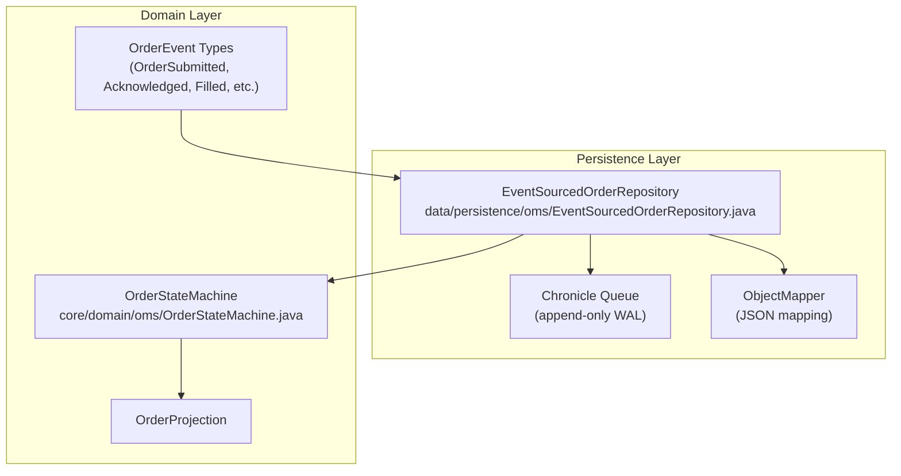
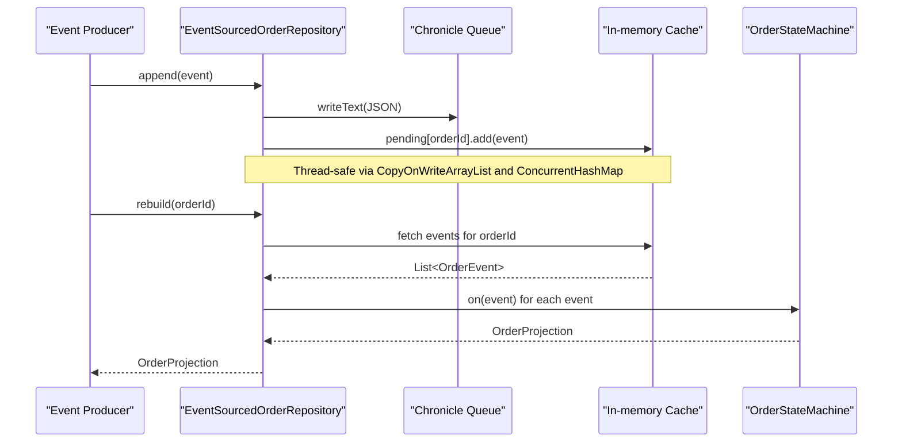
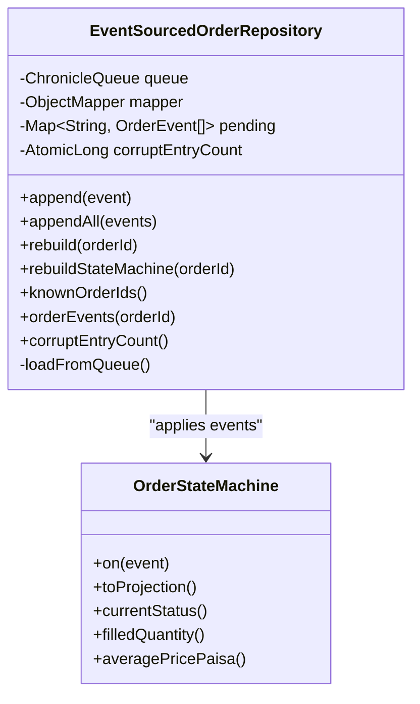

# Order Persistence and Repository

<cite>
**Referenced Files in This Document**
- [EventSourcedOrderRepository.java](file://data/persistence/src/main/java/com/tradej/persistence/oms/EventSourcedOrderRepository.java)
- [EventSourcedOrderRepositoryTest.java](file://data/persistence/src/test/java/com/tradej/persistence/oms/EventSourcedOrderRepositoryTest.java)
- [EventSourcedOrderRepositoryStressTest.java](file://data/persistence/src/test/java/com/tradej/persistence/oms/EventSourcedOrderRepositoryStressTest.java)
- [OrderStateMachine.java](file://core/src/main/java/com/tradej/core/domain/oms/OrderStateMachine.java)
</cite>

## Table of Contents
1. [Introduction](#introduction)
2. [Project Structure](#project-structure)
3. [Core Components](#core-components)
4. [Architecture Overview](#architecture-overview)
5. [Detailed Component Analysis](#detailed-component-analysis)
6. [Dependency Analysis](#dependency-analysis)
7. [Performance Considerations](#performance-considerations)
8. [Troubleshooting Guide](#troubleshooting-guide)
9. [Conclusion](#conclusion)

## Introduction
This document explains the Order Persistence and Repository system with a focus on the EventSourcedOrderRepository implementation. It covers how orders are persisted using Chronicle Queue as an append-only event store, how events are serialized and deserialized, how the repository initializes by loading existing events, and how it maintains an in-memory cache for fast state rebuilding. It also documents concurrency handling, corruption detection and recovery, and the repository's role in event replay and order reconstruction.

## Project Structure
The repository centers around the EventSourcedOrderRepository in the persistence module, with supporting domain logic in the core module. Tests validate correctness, concurrency, and resilience.

**Diagram sources**
- [EventSourcedOrderRepository.java:41-54](file://data/persistence/src/main/java/com/tradej/persistence/oms/EventSourcedOrderRepository.java#L41-L54)
- [OrderStateMachine.java](file://core/src/main/java/com/tradej/core/domain/oms/OrderStateMachine.java)

**Section sources**
- [EventSourcedOrderRepository.java:41-54](file://data/persistence/src/main/java/com/tradej/persistence/oms/EventSourcedOrderRepository.java#L41-L54)

## Core Components
- EventSourcedOrderRepository: The central repository that persists OrderEvent instances to Chronicle Queue and maintains an in-memory cache for fast state rebuilds.
- OrderStateMachine: The state machine that applies events to reconstruct order lifecycle and produce projections.
- ObjectMapper with custom serializers: Handles JSON serialization/deserialization of OrderEvent variants.
- Chronicle Queue: Append-only log used as the durable event store.

Key responsibilities:
- Persist events via Chronicle Queue appenders.
- Maintain in-memory cache keyed by order ID.
- Load existing events on startup and track corrupt entries.
- Rebuild order state from cached events or replay from the event log.
- Provide diagnostics such as corrupt entry counts and known order IDs.

**Section sources**
- [EventSourcedOrderRepository.java:41-86](file://data/persistence/src/main/java/com/tradej/persistence/oms/EventSourcedOrderRepository.java#L41-L86)
- [OrderStateMachine.java](file://core/src/main/java/com/tradej/core/domain/oms/OrderStateMachine.java)

## Architecture Overview
The repository integrates three pillars:
- Append-only persistence: Chronicle Queue ensures immutable, ordered event storage.
- In-memory caching: Fast access to recent events for state rebuilding.
- Domain-driven state machine: Applies events deterministically to compute projections.

**Diagram sources**
- [EventSourcedOrderRepository.java:61-68](file://data/persistence/src/main/java/com/tradej/persistence/oms/EventSourcedOrderRepository.java#L61-L68)
- [EventSourcedOrderRepository.java:83-108](file://data/persistence/src/main/java/com/tradej/persistence/oms/EventSourcedOrderRepository.java#L83-L108)
- [OrderStateMachine.java](file://core/src/main/java/com/tradej/core/domain/oms/OrderStateMachine.java)

## Detailed Component Analysis

### EventSourcedOrderRepository
Responsibilities:
- Initialize Chronicle Queue and JSON mapper.
- Load existing events on construction and track corrupt entries.
- Append single or multiple events atomically.
- Rebuild order projections and state machines.
- Expose diagnostics (known order IDs, corrupt entry count).

Concurrency model:
- Uses a ConcurrentHashMap for per-order event lists.
- Uses CopyOnWriteArrayList for thread-safe reads during iteration.
- Creates a new appender per append to support concurrent writers.

Startup event loading:
- Iterates through the queue using a tailer.
- Attempts to parse each entry as JSON and map to OrderEvent.
- Skips invalid entries and increments a corrupt counter with warnings.

Serialization and deserialization:
- Custom serializer writes eventType discriminator and variant-specific fields.
- Custom deserializer reads eventType and constructs the appropriate OrderEvent subtype.

State machine rebuilding:
- Requires the first event to be OrderSubmitted.
- Applies all cached events to construct OrderStateMachine and produce OrderProjection.

Diagnostics:
- knownOrderIds(): returns current tracked order IDs.
- orderEvents(orderId): returns a copy of cached events for an order.
- corruptEntryCount(): total number of corrupt entries encountered during load.

Practical examples (paths):
- Repository initialization and event loading: [EventSourcedOrderRepositoryTest.java:179-195](file://data/persistence/src/test/java/com/tradej/persistence/oms/EventSourcedOrderRepositoryTest.java#L179-L195)
- Single event append and rebuild: [EventSourcedOrderRepositoryTest.java:75-89](file://data/persistence/src/test/java/com/tradej/persistence/oms/EventSourcedOrderRepositoryTest.java#L75-L89)
- Append all and rebuild: [EventSourcedOrderRepositoryTest.java:75-89](file://data/persistence/src/test/java/com/tradej/persistence/oms/EventSourcedOrderRepositoryTest.java#L75-L89)
- Serialization roundtrip coverage: [EventSourcedOrderRepositoryTest.java:143-176](file://data/persistence/src/test/java/com/tradej/persistence/oms/EventSourcedOrderRepositoryTest.java#L143-L176)

**Section sources**
- [EventSourcedOrderRepository.java:50-54](file://data/persistence/src/main/java/com/tradej/persistence/oms/EventSourcedOrderRepository.java#L50-L54)
- [EventSourcedOrderRepository.java:61-68](file://data/persistence/src/main/java/com/tradej/persistence/oms/EventSourcedOrderRepository.java#L61-L68)
- [EventSourcedOrderRepository.java:83-108](file://data/persistence/src/main/java/com/tradej/persistence/oms/EventSourcedOrderRepository.java#L83-L108)
- [EventSourcedOrderRepository.java:113-123](file://data/persistence/src/main/java/com/tradej/persistence/oms/EventSourcedOrderRepository.java#L113-L123)
- [EventSourcedOrderRepository.java:166-190](file://data/persistence/src/main/java/com/tradej/persistence/oms/EventSourcedOrderRepository.java#L166-L190)
- [EventSourcedOrderRepository.java:193-195](file://data/persistence/src/main/java/com/tradej/persistence/oms/EventSourcedOrderRepository.java#L193-L195)

### JSON Mapping Configuration
The ObjectMapper is configured with a custom SimpleModule that registers:
- OrderEventSerializer: Writes a compact JSON representation with eventType discriminator and variant-specific fields.
- OrderEventDeserializer: Reads eventType and reconstructs the correct OrderEvent subtype.

This enables deterministic, schema-versionable event storage suitable for long-term replay.

**Section sources**
- [EventSourcedOrderRepository.java:156-161](file://data/persistence/src/main/java/com/tradej/persistence/oms/EventSourcedOrderRepository.java#L156-L161)
- [EventSourcedOrderRepository.java:197-225](file://data/persistence/src/main/java/com/tradej/persistence/oms/EventSourcedOrderRepository.java#L197-L225)
- [EventSourcedOrderRepository.java:227-264](file://data/persistence/src/main/java/com/tradej/persistence/oms/EventSourcedOrderRepository.java#L227-L264)

### Startup Event Loading and Corruption Recovery
Behavior:
- On construction, the repository opens a tailer and iterates all entries.
- Each entry is parsed as JSON and mapped to an OrderEvent.
- On parse errors or runtime exceptions, the entry is treated as corrupt, skipped, and the corrupt counter is incremented with a warning log.
- After loading, the repository logs the number of loaded and skipped entries.

Recovery:
- Corrupt entries do not prevent loading valid events.
- Valid orders remain reconstructible; corrupt entries are simply ignored.

Practical examples (paths):
- Partial corruption handling: [EventSourcedOrderRepositoryStressTest.java:138-169](file://data/persistence/src/test/java/com/tradej/persistence/oms/EventSourcedOrderRepositoryStressTest.java#L138-L169)
- All entries corrupt handling: [EventSourcedOrderRepositoryStressTest.java:174-193](file://data/persistence/src/test/java/com/tradej/persistence/oms/EventSourcedOrderRepositoryStressTest.java#L174-L193)

**Section sources**
- [EventSourcedOrderRepository.java:166-190](file://data/persistence/src/main/java/com/tradej/persistence/oms/EventSourcedOrderRepository.java#L166-L190)
- [EventSourcedOrderRepositoryStressTest.java:138-169](file://data/persistence/src/test/java/com/tradej/persistence/oms/EventSourcedOrderRepositoryStressTest.java#L138-L169)
- [EventSourcedOrderRepositoryStressTest.java:174-193](file://data/persistence/src/test/java/com/tradej/persistence/oms/EventSourcedOrderRepositoryStressTest.java#L174-L193)

### In-Memory Event Caching Strategy
- pending: ConcurrentHashMap<String, List<OrderEvent>> stores per-order event lists.
- CopyOnWriteArrayList: Ensures safe iteration during rebuilds while allowing efficient appends.
- Known order IDs: exposed via knownOrderIds().
- Event copies: orderEvents returns immutable copies to prevent external mutation.

Benefits:
- Fast rebuilds without touching disk.
- Thread-safe concurrent access from producers and consumers.
- Minimal overhead for small to moderate numbers of orders.

**Section sources**
- [EventSourcedOrderRepository.java:47-48](file://data/persistence/src/main/java/com/tradej/persistence/oms/EventSourcedOrderRepository.java#L47-L48)
- [EventSourcedOrderRepository.java:113-123](file://data/persistence/src/main/java/com/tradej/persistence/oms/EventSourcedOrderRepository.java#L113-L123)

### Concurrency and Access Handling
- append(): Creates a new appender per call to avoid contention and ensure durability.
- pending: Uses ConcurrentHashMap and CopyOnWriteArrayList for safe concurrent reads/writes.
- Tests validate concurrent appends for the same and different order IDs without corruption.

Practical examples (paths):
- Same order concurrent appends: [EventSourcedOrderRepositoryStressTest.java:28-47](file://data/persistence/src/test/java/com/tradej/persistence/oms/EventSourcedOrderRepositoryStressTest.java#L28-L47)
- Different order concurrent appends: [EventSourcedOrderRepositoryStressTest.java:52-70](file://data/persistence/src/test/java/com/tradej/persistence/oms/EventSourcedOrderRepositoryStressTest.java#L52-L70)
- Mixed concurrent appends and rebuilds: [EventSourcedOrderRepositoryStressTest.java:77-132](file://data/persistence/src/test/java/com/tradej/persistence/oms/EventSourcedOrderRepositoryStressTest.java#L77-L132)

**Section sources**
- [EventSourcedOrderRepository.java:61-68](file://data/persistence/src/main/java/com/tradej/persistence/oms/EventSourcedOrderRepository.java#L61-L68)
- [EventSourcedOrderRepositoryStressTest.java:28-47](file://data/persistence/src/test/java/com/tradej/persistence/oms/EventSourcedOrderRepositoryStressTest.java#L28-L47)
- [EventSourcedOrderRepositoryStressTest.java:52-70](file://data/persistence/src/test/java/com/tradej/persistence/oms/EventSourcedOrderRepositoryStressTest.java#L52-L70)
- [EventSourcedOrderRepositoryStressTest.java:77-132](file://data/persistence/src/test/java/com/tradej/persistence/oms/EventSourcedOrderRepositoryStressTest.java#L77-L132)

### Event Ordering Guarantees and Append-Only Design
- Append-only: Events are appended to the end of the queue; no modification or deletion occurs.
- Ordering: Events are read in the order they were written, ensuring deterministic replay.
- Replay: The repository replays cached events to reconstruct state, guaranteeing consistent projections.

Practical examples (paths):
- Event ordering verification in stress tests: [EventSourcedOrderRepositoryStressTest.java:125-131](file://data/persistence/src/test/java/com/tradej/persistence/oms/EventSourcedOrderRepositoryStressTest.java#L125-L131)

**Section sources**
- [EventSourcedOrderRepository.java:92-108](file://data/persistence/src/main/java/com/tradej/persistence/oms/EventSourcedOrderRepository.java#L92-L108)
- [EventSourcedOrderRepositoryStressTest.java:125-131](file://data/persistence/src/test/java/com/tradej/persistence/oms/EventSourcedOrderRepositoryStressTest.java#L125-L131)

### Repository Role in State Machine Rebuilding and Order Reconstruction
- rebuild(orderId): Returns an OrderProjection by applying cached events through OrderStateMachine.
- rebuildStateMachine(orderId): Returns the full OrderStateMachine for deeper inspection.
- Validation: Requires the first event to be OrderSubmitted; otherwise throws an IllegalStateException.

Practical examples (paths):
- Rebuild unknown order returns null: [EventSourcedOrderRepositoryTest.java:70-72](file://data/persistence/src/test/java/com/tradej/persistence/oms/EventSourcedOrderRepositoryTest.java#L70-L72)
- Rebuild with partial fills: [EventSourcedOrderRepositoryTest.java:92-102](file://data/persistence/src/test/java/com/tradej/persistence/oms/EventSourcedOrderRepositoryTest.java#L92-L102)
- Roundtrip serialization scenarios: [EventSourcedOrderRepositoryTest.java:143-176](file://data/persistence/src/test/java/com/tradej/persistence/oms/EventSourcedOrderRepositoryTest.java#L143-L176)

**Section sources**
- [EventSourcedOrderRepository.java:83-108](file://data/persistence/src/main/java/com/tradej/persistence/oms/EventSourcedOrderRepository.java#L83-L108)
- [OrderStateMachine.java](file://core/src/main/java/com/tradej/core/domain/oms/OrderStateMachine.java)

## Dependency Analysis
The repository depends on:
- Chronicle Queue for durable, append-only storage.
- Jackson ObjectMapper for JSON serialization/deserialization.
- Core domain classes for OrderEvent types and OrderStateMachine.

**Diagram sources**
- [EventSourcedOrderRepository.java:41-108](file://data/persistence/src/main/java/com/tradej/persistence/oms/EventSourcedOrderRepository.java#L41-L108)
- [OrderStateMachine.java](file://core/src/main/java/com/tradej/core/domain/oms/OrderStateMachine.java)

**Section sources**
- [EventSourcedOrderRepository.java:41-108](file://data/persistence/src/main/java/com/tradej/persistence/oms/EventSourcedOrderRepository.java#L41-L108)

## Performance Considerations
- Append cost: Each append creates a new appender; this avoids shared resource contention but may increase filesystem metadata operations. For high-throughput scenarios, consider batching via appendAll.
- Read cost: Rebuilds operate on cached events, avoiding disk traversal after initial load.
- Memory footprint: Per-order event lists grow with activity; monitor cache sizes for large portfolios.
- JSON overhead: Compact serialization minimizes payload size; ensure consistent field ordering for optimal compression.
- Startup time: Initial load scans the entire queue; consider pre-warming caches or partitioning if startup latency becomes a concern.

[No sources needed since this section provides general guidance]

## Troubleshooting Guide
Common issues and resolutions:
- Corrupt entries during startup:
  - Symptom: Warnings about JSON parse failures or deserialization errors; corruptEntryCount increases.
  - Action: Investigate the queue directory for malformed entries; remove or repair as needed; valid entries continue to load.
  - Evidence: [EventSourcedOrderRepository.java:175-185](file://data/persistence/src/main/java/com/tradej/persistence/oms/EventSourcedOrderRepository.java#L175-L185)
- First event must be OrderSubmitted:
  - Symptom: IllegalStateException indicating the first event must be OrderSubmitted.
  - Action: Ensure OrderSubmitted is emitted before other events for an order.
  - Evidence: [EventSourcedOrderRepository.java:99-101](file://data/persistence/src/main/java/com/tradej/persistence/oms/EventSourcedOrderRepository.java#L99-L101)
- Rebuild returns null:
  - Symptom: No events found for the order ID.
  - Action: Confirm the order exists in the queue or cache; verify append operations.
  - Evidence: [EventSourcedOrderRepositoryTest.java:70-72](file://data/persistence/src/test/java/com/tradej/persistence/oms/EventSourcedOrderRepositoryTest.java#L70-L72)
- Concurrency anomalies:
  - Symptom: Unexpected event ordering or missing events under load.
  - Action: Use appendAll for batches; ensure proper event sequencing; verify tests pass.
  - Evidence: [EventSourcedOrderRepositoryStressTest.java:28-47](file://data/persistence/src/test/java/com/tradej/persistence/oms/EventSourcedOrderRepositoryStressTest.java#L28-L47)

**Section sources**
- [EventSourcedOrderRepository.java:175-185](file://data/persistence/src/main/java/com/tradej/persistence/oms/EventSourcedOrderRepository.java#L175-L185)
- [EventSourcedOrderRepository.java:99-101](file://data/persistence/src/main/java/com/tradej/persistence/oms/EventSourcedOrderRepository.java#L99-L101)
- [EventSourcedOrderRepositoryTest.java:70-72](file://data/persistence/src/test/java/com/tradej/persistence/oms/EventSourcedOrderRepositoryTest.java#L70-L72)
- [EventSourcedOrderRepositoryStressTest.java:28-47](file://data/persistence/src/test/java/com/tradej/persistence/oms/EventSourcedOrderRepositoryStressTest.java#L28-L47)

## Conclusion
The EventSourcedOrderRepository provides a robust, append-only persistence mechanism for order events using Chronicle Queue, complemented by a fast in-memory cache and deterministic state machine reconstruction. Its design emphasizes correctness, resilience (via corruption detection), and scalability (via concurrent access patterns). The JSON serialization scheme ensures compatibility and replayability, while diagnostics enable operational visibility and troubleshooting.