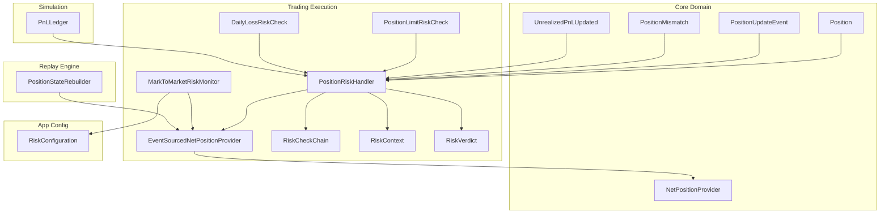
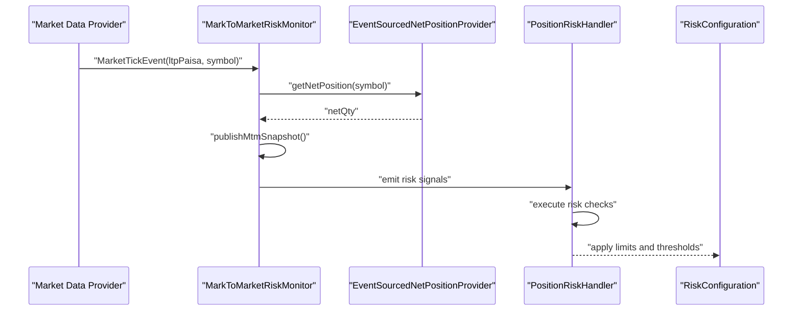
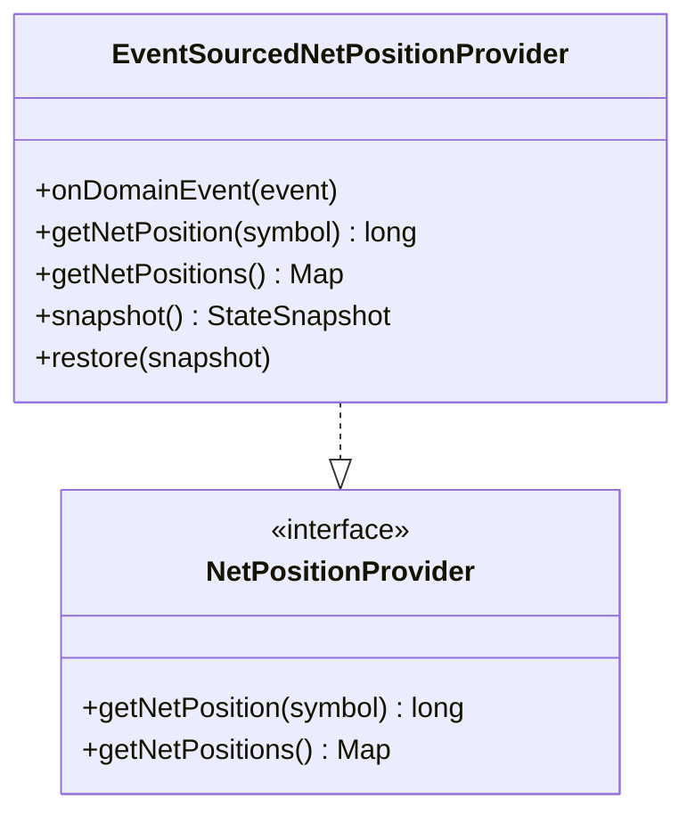
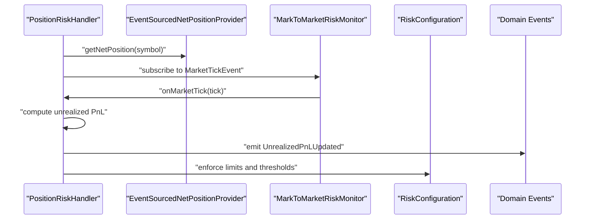
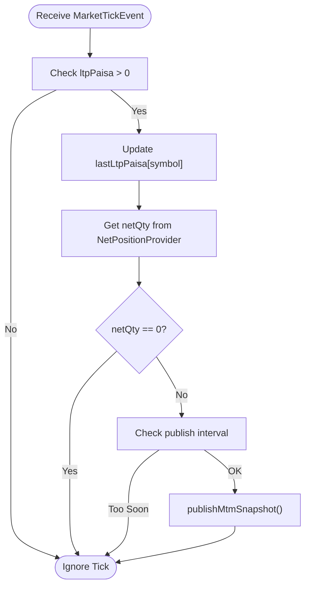
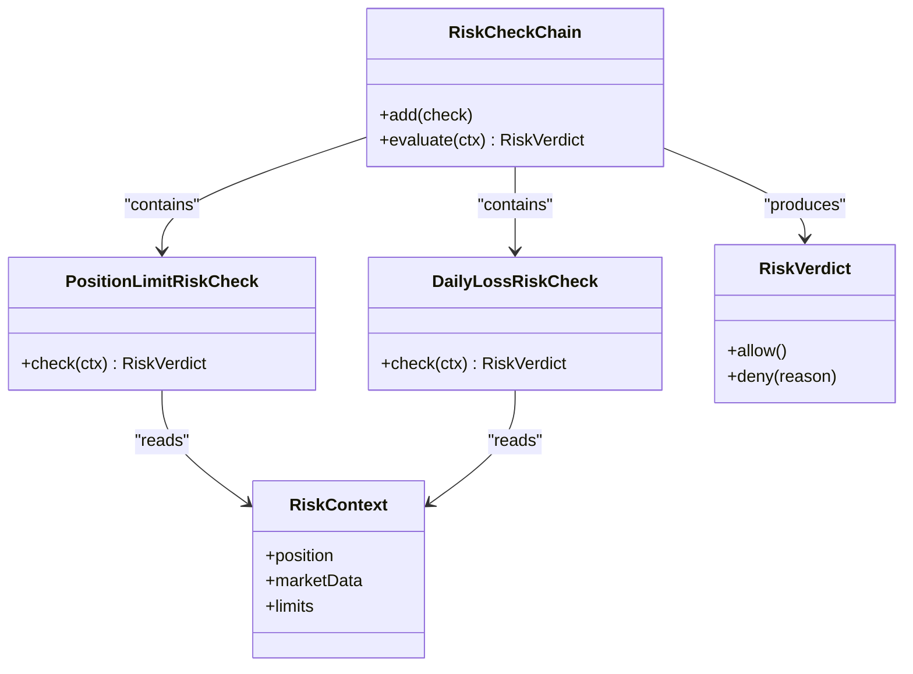
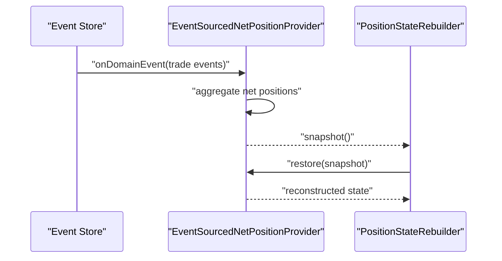
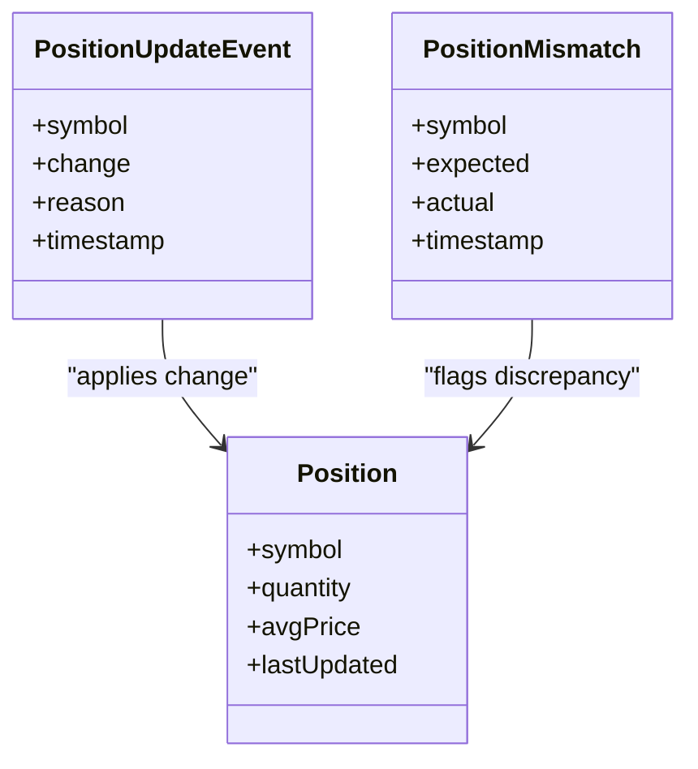
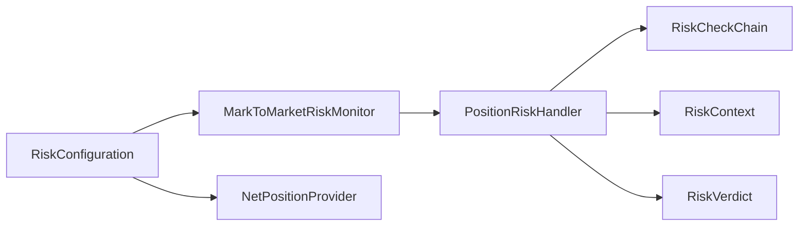
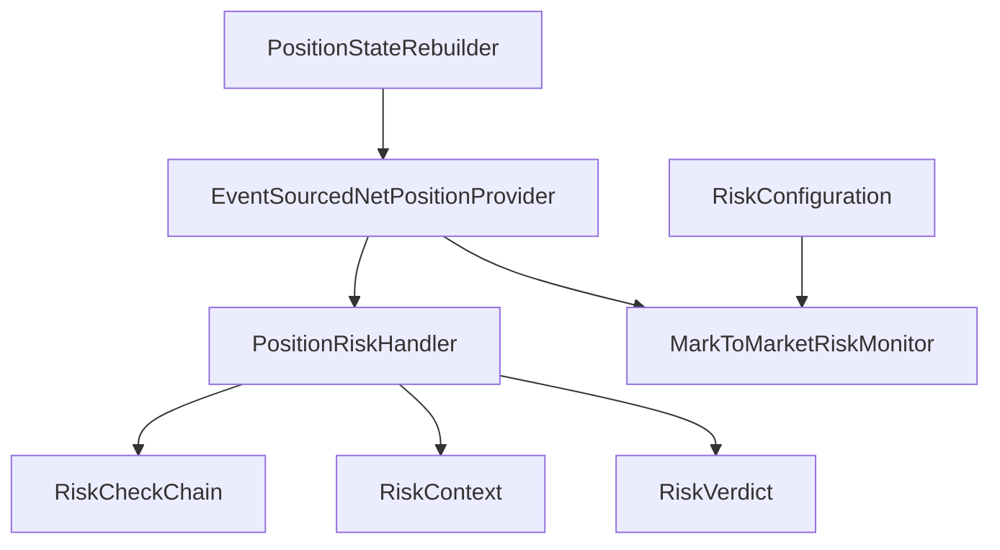

# Position Management

<cite>
**Referenced Files in This Document**
- [EventSourcedNetPositionProvider.java](file://trading/execution/src/main/java/com/tradej/execution/position/EventSourcedNetPositionProvider.java)
- [MarkToMarketRiskMonitor.java](file://trading/execution/src/main/java/com/tradej/execution/risk/MarkToMarketRiskMonitor.java)
- [PositionRiskHandler.java](file://trading/execution/src/main/java/com/tradej/execution/risk/PositionRiskHandler.java)
- [NetPositionProvider.java](file://core/src/main/java/com/tradej/core/domain/port/NetPositionProvider.java)
- [RiskConfiguration.java](file://app/src/main/java/com/tradej/app/config/RiskConfiguration.java)
- [PositionRiskHandlerComponentTest.java](file://app/src/test/java/com/tradej/app/integration/PositionRiskHandlerComponentTest.java)
- [PositionMismatch.java](file://core/src/main/java/com/tradej/core/domain/event/PositionMismatch.java)
- [PositionUpdateEvent.java](file://core/src/main/java/com/tradej/core/domain/event/PositionUpdateEvent.java)
- [Position.java](file://core/src/main/java/com/tradej/core/domain/model/Position.java)
- [PositionLimitRiskCheck.java](file://trading/execution/src/main/java/com/tradej/execution/risk/PositionLimitRiskCheck.java)
- [DailyLossRiskCheck.java](file://trading/execution/src/main/java/com/tradej/execution/risk/DailyLossRiskCheck.java)
- [RiskCheckChain.java](file://trading/execution/src/main/java/com/tradej/execution/risk/RiskCheckChain.java)
- [RiskContext.java](file://trading/execution/src/main/java/com/tradej/execution/risk/RiskContext.java)
- [RiskVerdict.java](file://tradej/execution/src/main/java/com/tradej/execution/risk/RiskVerdict.java)
- [PositionStateRebuilder.java](file://replay/engine/src/main/java/com/tradej/replay/engine/PositionStateRebuilder.java)
- [UnrealizedPnLUpdated.java](file://core/src/main/java/com/tradej/core/domain/event/UnrealizedPnLUpdated.java)
- [PnLLedger.java](file://trading/simulation/src/main/java/com/tradej/simulation/PnLLedger.java)
</cite>

## Table of Contents
1. [Introduction](#introduction)
2. [Project Structure](#project-structure)
3. [Core Components](#core-components)
4. [Architecture Overview](#architecture-overview)
5. [Detailed Component Analysis](#detailed-component-analysis)
6. [Dependency Analysis](#dependency-analysis)
7. [Performance Considerations](#performance-considerations)
8. [Troubleshooting Guide](#troubleshooting-guide)
9. [Conclusion](#conclusion)
10. [Appendices](#appendices)

## Introduction
This document explains the Position Management system in the TradeJ platform. It focuses on:
- EventSourcedNetPositionProvider for position tracking and net position calculation
- LivePnL and mark-to-market updates via PositionRiskHandler and related components
- Real-time price monitoring and risk assessment through MarkToMarketRiskMonitor
- Position state management, aggregation, and reconciliation
- Position history tracking, limits enforcement, and reporting
- Integration with market data providers and position-based risk calculations

The goal is to provide a practical understanding for both developers and operators who need to configure, monitor, and troubleshoot position management workflows.

## Project Structure
Position management spans several modules:
- trading/execution: position providers, risk monitors, and handlers
- core: domain models and ports for positions and events
- app: configuration wiring for risk monitors and event bus
- replay/engine: position state rebuilding for replay and reconciliation
- trading/simulation: PnL ledger for simulation and testing

**Diagram sources**
- [EventSourcedNetPositionProvider.java](file://trading/execution/src/main/java/com/tradej/execution/position/EventSourcedNetPositionProvider.java)
- [PositionRiskHandler.java](file://trading/execution/src/main/java/com/tradej/execution/risk/PositionRiskHandler.java)
- [MarkToMarketRiskMonitor.java](file://trading/execution/src/main/java/com/tradej/execution/risk/MarkToMarketRiskMonitor.java)
- [PositionLimitRiskCheck.java](file://trading/execution/src/main/java/com/tradej/execution/risk/PositionLimitRiskCheck.java)
- [DailyLossRiskCheck.java](file://trading/execution/src/main/java/com/tradej/execution/risk/DailyLossRiskCheck.java)
- [RiskCheckChain.java](file://trading/execution/src/main/java/com/tradej/execution/risk/RiskCheckChain.java)
- [RiskContext.java](file://trading/execution/src/main/java/com/tradej/execution/risk/RiskContext.java)
- [RiskVerdict.java](file://trading/execution/src/main/java/com/tradej/execution/risk/RiskVerdict.java)
- [NetPositionProvider.java](file://core/src/main/java/com/tradej/core/domain/port/NetPositionProvider.java)
- [Position.java](file://core/src/main/java/com/tradej/core/domain/model/Position.java)
- [PositionUpdateEvent.java](file://core/src/main/java/com/tradej/core/domain/event/PositionUpdateEvent.java)
- [PositionMismatch.java](file://core/src/main/java/com/tradej/core/domain/event/PositionMismatch.java)
- [UnrealizedPnLUpdated.java](file://core/src/main/java/com/tradej/core/domain/event/UnrealizedPnLUpdated.java)
- [RiskConfiguration.java](file://app/src/main/java/com/tradej/app/config/RiskConfiguration.java)
- [PositionStateRebuilder.java](file://replay/engine/src/main/java/com/tradej/replay/engine/PositionStateRebuilder.java)
- [PnLLedger.java](file://trading/simulation/src/main/java/com/tradej/simulation/PnLLedger.java)

**Section sources**
- [EventSourcedNetPositionProvider.java](file://trading/execution/src/main/java/com/tradej/execution/position/EventSourcedNetPositionProvider.java)
- [MarkToMarketRiskMonitor.java](file://trading/execution/src/main/java/com/tradej/execution/risk/MarkToMarketRiskMonitor.java)
- [PositionRiskHandler.java](file://trading/execution/src/main/java/com/tradej/execution/risk/PositionRiskHandler.java)
- [NetPositionProvider.java](file://core/src/main/java/com/tradej/core/domain/port/NetPositionProvider.java)
- [RiskConfiguration.java](file://app/src/main/java/com/tradej/app/config/RiskConfiguration.java)

## Core Components
- EventSourcedNetPositionProvider: Computes net positions from trade lifecycle events and exposes a canonical view keyed by symbol.
- PositionRiskHandler: Orchestrates risk checks, integrates with market data, and coordinates PnL updates and position state transitions.
- MarkToMarketRiskMonitor: Subscribes to market ticks, tracks last traded prices, and periodically publishes mark-to-market snapshots for risk evaluation.
- RiskCheckChain and related risk checks: Enforce position limits and daily loss caps.
- RiskContext and RiskVerdict: Provide structured context and outcomes for risk decisions.
- PositionStateRebuilder: Reconstructs position state for replay and reconciliation scenarios.
- Simulation PnLLedger: Supports PnL tracking and validation in simulation environments.

**Section sources**
- [EventSourcedNetPositionProvider.java](file://trading/execution/src/main/java/com/tradej/execution/position/EventSourcedNetPositionProvider.java)
- [PositionRiskHandler.java](file://trading/execution/src/main/java/com/tradej/execution/risk/PositionRiskHandler.java)
- [MarkToMarketRiskMonitor.java](file://trading/execution/src/main/java/com/tradej/execution/risk/MarkToMarketRiskMonitor.java)
- [RiskCheckChain.java](file://trading/execution/src/main/java/com/tradej/execution/risk/RiskCheckChain.java)
- [RiskContext.java](file://trading/execution/src/main/java/com/tradej/execution/risk/RiskContext.java)
- [RiskVerdict.java](file://trading/execution/src/main/java/com/tradej/execution/risk/RiskVerdict.java)
- [PositionStateRebuilder.java](file://replay/engine/src/main/java/com/tradej/replay/engine/PositionStateRebuilder.java)
- [PnLLedger.java](file://trading/simulation/src/main/java/com/tradej/simulation/PnLLedger.java)

## Architecture Overview
The Position Management system follows an event-driven architecture:
- Trade lifecycle events update internal position state.
- Net positions are derived on demand from these events.
- Market data triggers mark-to-market updates and risk assessments.
- Risk checks evaluate pre-trade and post-trade constraints.
- Position state can be rebuilt for replay and reconciliation.

**Diagram sources**
- [MarkToMarketRiskMonitor.java](file://trading/execution/src/main/java/com/tradej/execution/risk/MarkToMarketRiskMonitor.java)
- [EventSourcedNetPositionProvider.java](file://trading/execution/src/main/java/com/tradej/execution/position/EventSourcedNetPositionProvider.java)
- [PositionRiskHandler.java](file://trading/execution/src/main/java/com/tradej/execution/risk/PositionRiskHandler.java)
- [RiskConfiguration.java](file://app/src/main/java/com/tradej/app/config/RiskConfiguration.java)

## Detailed Component Analysis

### EventSourcedNetPositionProvider
Responsibilities:
- Maintains a canonical net position view keyed by symbol.
- Recomputes net positions from trade lifecycle events on demand.
- Supports snapshot/restore for state reconstruction and replay.

Key behaviors:
- Aggregates per-symbol quantities from trade events.
- Exposes methods to retrieve net positions and the full map.
- Provides snapshot and restore to support reconciliation and replay.

**Diagram sources**
- [EventSourcedNetPositionProvider.java](file://trading/execution/src/main/java/com/tradej/execution/position/EventSourcedNetPositionProvider.java)
- [NetPositionProvider.java](file://core/src/main/java/com/tradej/core/domain/port/NetPositionProvider.java)

**Section sources**
- [EventSourcedNetPositionProvider.java](file://trading/execution/src/main/java/com/tradej/execution/position/EventSourcedNetPositionProvider.java)

### Live PnL and Mark-to-Market Updates
PositionRiskHandler integrates market data and position state to compute and propagate unrealized PnL updates. It coordinates with risk checks and emits domain events reflecting position changes and PnL adjustments.

**Diagram sources**
- [PositionRiskHandler.java](file://trading/execution/src/main/java/com/tradej/execution/risk/PositionRiskHandler.java)
- [EventSourcedNetPositionProvider.java](file://trading/execution/src/main/java/com/tradej/execution/position/EventSourcedNetPositionProvider.java)
- [MarkToMarketRiskMonitor.java](file://trading/execution/src/main/java/com/tradej/execution/risk/MarkToMarketRiskMonitor.java)
- [UnrealizedPnLUpdated.java](file://core/src/main/java/com/tradej/core/domain/event/UnrealizedPnLUpdated.java)
- [RiskConfiguration.java](file://app/src/main/java/com/tradej/app/config/RiskConfiguration.java)

**Section sources**
- [PositionRiskHandler.java](file://trading/execution/src/main/java/com/tradej/execution/risk/PositionRiskHandler.java)
- [MarkToMarketRiskMonitor.java](file://trading/execution/src/main/java/com/tradej/execution/risk/MarkToMarketRiskMonitor.java)
- [UnrealizedPnLUpdated.java](file://core/src/main/java/com/tradej/core/domain/event/UnrealizedPnLUpdated.java)

### MarkToMarketRiskMonitor
Responsibilities:
- Subscribes to market ticks and tracks last traded prices per symbol.
- Computes mark-to-market exposure using net positions from NetPositionProvider.
- Periodically publishes mark-to-market snapshots for risk evaluation.

Behavior highlights:
- Ignores invalid ticks (non-positive LTP).
- Skips publishing if the net position is zero or below configured interval.
- Integrates with RiskConfiguration for enforcement policies and thresholds.

**Diagram sources**
- [MarkToMarketRiskMonitor.java](file://trading/execution/src/main/java/com/tradej/execution/risk/MarkToMarketRiskMonitor.java)
- [EventSourcedNetPositionProvider.java](file://trading/execution/src/main/java/com/tradej/execution/position/EventSourcedNetPositionProvider.java)
- [RiskConfiguration.java](file://app/src/main/java/com/tradej/app/config/RiskConfiguration.java)

**Section sources**
- [MarkToMarketRiskMonitor.java](file://trading/execution/src/main/java/com/tradej/execution/risk/MarkToMarketRiskMonitor.java)
- [RiskConfiguration.java](file://app/src/main/java/com/tradej/app/config/RiskConfiguration.java)

### Position Limits Enforcement
PositionLimitRiskCheck and DailyLossRiskCheck form part of the risk evaluation chain. They enforce:
- Symbol-level position limits
- Daily loss thresholds in paisa

**Diagram sources**
- [RiskCheckChain.java](file://trading/execution/src/main/java/com/tradej/execution/risk/RiskCheckChain.java)
- [PositionLimitRiskCheck.java](file://trading/execution/src/main/java/com/tradej/execution/risk/PositionLimitRiskCheck.java)
- [DailyLossRiskCheck.java](file://trading/execution/src/main/java/com/tradej/execution/risk/DailyLossRiskCheck.java)
- [RiskContext.java](file://trading/execution/src/main/java/com/tradej/execution/risk/RiskContext.java)
- [RiskVerdict.java](file://trading/execution/src/main/java/com/tradej/execution/risk/RiskVerdict.java)

**Section sources**
- [PositionLimitRiskCheck.java](file://trading/execution/src/main/java/com/tradej/execution/risk/PositionLimitRiskCheck.java)
- [DailyLossRiskCheck.java](file://trading/execution/src/main/java/com/tradej/execution/risk/DailyLossRiskCheck.java)
- [RiskCheckChain.java](file://trading/execution/src/main/java/com/tradej/execution/risk/RiskCheckChain.java)
- [RiskContext.java](file://trading/execution/src/main/java/com/tradej/execution/risk/RiskContext.java)
- [RiskVerdict.java](file://trading/execution/src/main/java/com/tradej/execution/risk/RiskVerdict.java)

### Position State Management, Aggregation, and Reconciliation
- State management: Net positions are computed from trade events and exposed via NetPositionProvider.
- Aggregation: Per-symbol net quantities are aggregated from TradeOpened and TradeClosed events.
- Reconciliation: PositionStateRebuilder reconstructs state for replay sessions using event-sourced snapshots.

**Diagram sources**
- [EventSourcedNetPositionProvider.java](file://trading/execution/src/main/java/com/tradej/execution/position/EventSourcedNetPositionProvider.java)
- [PositionStateRebuilder.java](file://replay/engine/src/main/java/com/tradej/replay/engine/PositionStateRebuilder.java)

**Section sources**
- [EventSourcedNetPositionProvider.java](file://trading/execution/src/main/java/com/tradej/execution/position/EventSourcedNetPositionProvider.java)
- [PositionStateRebuilder.java](file://replay/engine/src/main/java/com/tradej/replay/engine/PositionStateRebuilder.java)

### Position History Tracking and Reporting
- PositionUpdateEvent captures updates to position state for auditability.
- PositionMismatch event signals discrepancies for operational review.
- Position model encapsulates current holdings and metadata for reporting.

**Diagram sources**
- [Position.java](file://core/src/main/java/com/tradej/core/domain/model/Position.java)
- [PositionUpdateEvent.java](file://core/src/main/java/com/tradej/core/domain/event/PositionUpdateEvent.java)
- [PositionMismatch.java](file://core/src/main/java/com/tradej/core/domain/event/PositionMismatch.java)

**Section sources**
- [Position.java](file://core/src/main/java/com/tradej/core/domain/model/Position.java)
- [PositionUpdateEvent.java](file://core/src/main/java/com/tradej/core/domain/event/PositionUpdateEvent.java)
- [PositionMismatch.java](file://core/src/main/java/com/tradej/core/domain/event/PositionMismatch.java)

### Integration with Market Data Providers and Position-Based Risk Calculations
- RiskConfiguration wires MarkToMarketRiskMonitor with NetPositionProvider and risk thresholds.
- PositionRiskHandler subscribes to market data and executes risk checks in response to price changes.

**Diagram sources**
- [RiskConfiguration.java](file://app/src/main/java/com/tradej/app/config/RiskConfiguration.java)
- [MarkToMarketRiskMonitor.java](file://trading/execution/src/main/java/com/tradej/execution/risk/MarkToMarketRiskMonitor.java)
- [PositionRiskHandler.java](file://trading/execution/src/main/java/com/tradej/execution/risk/PositionRiskHandler.java)
- [RiskCheckChain.java](file://trading/execution/src/main/java/com/tradej/execution/risk/RiskCheckChain.java)
- [RiskContext.java](file://trading/execution/src/main/java/com/tradej/execution/risk/RiskContext.java)
- [RiskVerdict.java](file://trading/execution/src/main/java/com/tradej/execution/risk/RiskVerdict.java)

**Section sources**
- [RiskConfiguration.java](file://app/src/main/java/com/tradej/app/config/RiskConfiguration.java)
- [PositionRiskHandler.java](file://trading/execution/src/main/java/com/tradej/execution/risk/PositionRiskHandler.java)

## Dependency Analysis
- EventSourcedNetPositionProvider implements NetPositionProvider and is consumed by PositionRiskHandler and MarkToMarketRiskMonitor.
- PositionRiskHandler depends on RiskCheckChain, RiskContext, and RiskVerdict to evaluate risk constraints.
- MarkToMarketRiskMonitor depends on NetPositionProvider and RiskConfiguration for enforcement.
- PositionStateRebuilder depends on event-sourced state to reconstruct positions for replay.

**Diagram sources**
- [EventSourcedNetPositionProvider.java](file://trading/execution/src/main/java/com/tradej/execution/position/EventSourcedNetPositionProvider.java)
- [PositionRiskHandler.java](file://trading/execution/src/main/java/com/tradej/execution/risk/PositionRiskHandler.java)
- [MarkToMarketRiskMonitor.java](file://trading/execution/src/main/java/com/tradej/execution/risk/MarkToMarketRiskMonitor.java)
- [RiskCheckChain.java](file://trading/execution/src/main/java/com/tradej/execution/risk/RiskCheckChain.java)
- [RiskContext.java](file://trading/execution/src/main/java/com/tradej/execution/risk/RiskContext.java)
- [RiskVerdict.java](file://trading/execution/src/main/java/com/tradej/execution/risk/RiskVerdict.java)
- [RiskConfiguration.java](file://app/src/main/java/com/tradej/app/config/RiskConfiguration.java)
- [PositionStateRebuilder.java](file://replay/engine/src/main/java/com/tradej/replay/engine/PositionStateRebuilder.java)

**Section sources**
- [EventSourcedNetPositionProvider.java](file://trading/execution/src/main/java/com/tradej/execution/position/EventSourcedNetPositionProvider.java)
- [PositionRiskHandler.java](file://trading/execution/src/main/java/com/tradej/execution/risk/PositionRiskHandler.java)
- [MarkToMarketRiskMonitor.java](file://trading/execution/src/main/java/com/tradej/execution/risk/MarkToMarketRiskMonitor.java)
- [RiskCheckChain.java](file://trading/execution/src/main/java/com/tradej/execution/risk/RiskCheckChain.java)
- [RiskContext.java](file://trading/execution/src/main/java/com/tradej/execution/risk/RiskContext.java)
- [RiskVerdict.java](file://trading/execution/src/main/java/com/tradej/execution/risk/RiskVerdict.java)
- [RiskConfiguration.java](file://app/src/main/java/com/tradej/app/config/RiskConfiguration.java)
- [PositionStateRebuilder.java](file://replay/engine/src/main/java/com/tradej/replay/engine/PositionStateRebuilder.java)

## Performance Considerations
- Net position recomputation: EventSourcedNetPositionProvider recomputes positions on demand, balancing accuracy with CPU cost. Consider caching strategies if frequent reads are required.
- Market tick throttling: MarkToMarketRiskMonitor applies a publish interval to avoid excessive updates. Tune publishIntervalMs according to market volatility and downstream processing capacity.
- Concurrency: EventSourcedNetPositionProvider uses concurrent structures for thread-safe access; ensure event ordering and snapshot/restore operations are synchronized.
- Risk check chain: Keep risk checks efficient and ordered to minimize latency in pre-trade and post-trade evaluations.

## Troubleshooting Guide
Common issues and resolutions:
- No unrealized PnL updates:
  - Verify MarketTickEvent delivery and ltpPaisa positivity.
  - Confirm net position is non-zero and publish interval elapsed.
- Position mismatch alerts:
  - Investigate PositionMismatch events and reconcile with trade events.
  - Use PositionStateRebuilder to reconstruct state and compare against expected positions.
- Risk violations:
  - Review RiskCheckChain outcomes and RiskVerdict decisions.
  - Adjust position limits and daily loss thresholds via RiskConfiguration.

**Section sources**
- [MarkToMarketRiskMonitor.java](file://trading/execution/src/main/java/com/tradej/execution/risk/MarkToMarketRiskMonitor.java)
- [PositionMismatch.java](file://core/src/main/java/com/tradej/core/domain/event/PositionMismatch.java)
- [PositionStateRebuilder.java](file://replay/engine/src/main/java/com/tradej/replay/engine/PositionStateRebuilder.java)
- [RiskCheckChain.java](file://trading/execution/src/main/java/com/tradej/execution/risk/RiskCheckChain.java)
- [RiskVerdict.java](file://trading/execution/src/main/java/com/tradej/execution/risk/RiskVerdict.java)

## Conclusion
The Position Management system combines event sourcing, real-time market data, and configurable risk checks to provide accurate and timely position tracking, PnL computation, and risk monitoring. Its modular design supports robust reconciliation, replay, and operational oversight.

## Appendices

### Example Workflows

- Position queries:
  - Retrieve net position for a symbol via NetPositionProvider.
  - Snapshot and restore position state for reconciliation or replay.

- PnL calculations:
  - Subscribe to MarketTickEvent and compute unrealized PnL using net position and LTP.
  - Emit UnrealizedPnLUpdated events for downstream consumption.

- Position monitoring:
  - Configure MarkToMarketRiskMonitor with enforcement and thresholds.
  - Execute risk checks in RiskCheckChain and act on RiskVerdict outcomes.

**Section sources**
- [NetPositionProvider.java](file://core/src/main/java/com/tradej/core/domain/port/NetPositionProvider.java)
- [EventSourcedNetPositionProvider.java](file://trading/execution/src/main/java/com/tradej/execution/position/EventSourcedNetPositionProvider.java)
- [MarkToMarketRiskMonitor.java](file://trading/execution/src/main/java/com/tradej/execution/risk/MarkToMarketRiskMonitor.java)
- [UnrealizedPnLUpdated.java](file://core/src/main/java/com/tradej/core/domain/event/UnrealizedPnLUpdated.java)
- [RiskCheckChain.java](file://trading/execution/src/main/java/com/tradej/execution/risk/RiskCheckChain.java)
- [RiskVerdict.java](file://trading/execution/src/main/java/com/tradej/execution/risk/RiskVerdict.java)