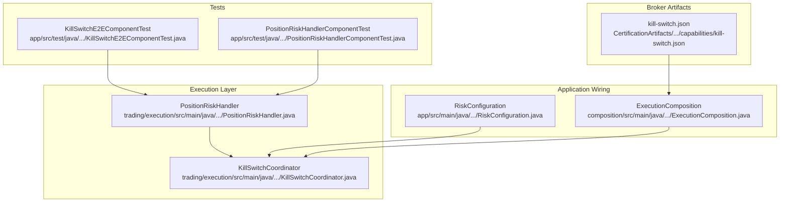
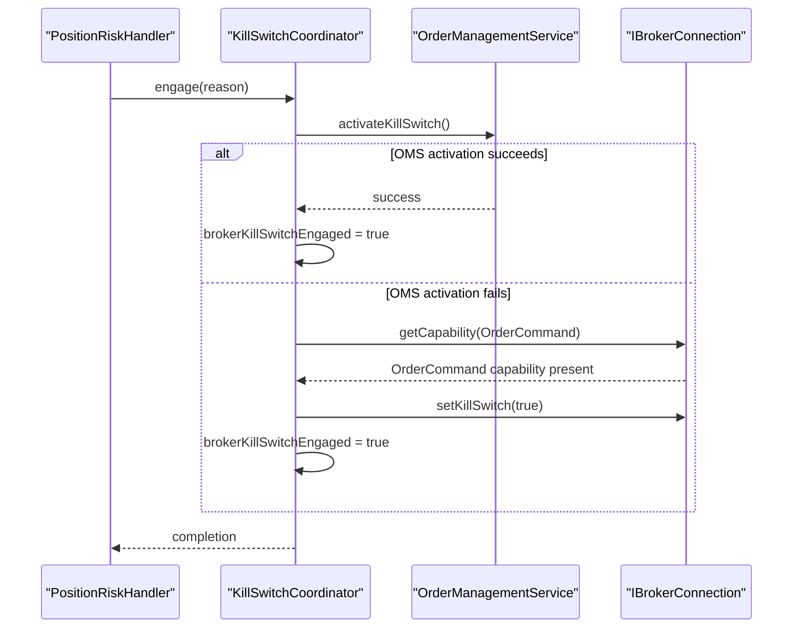
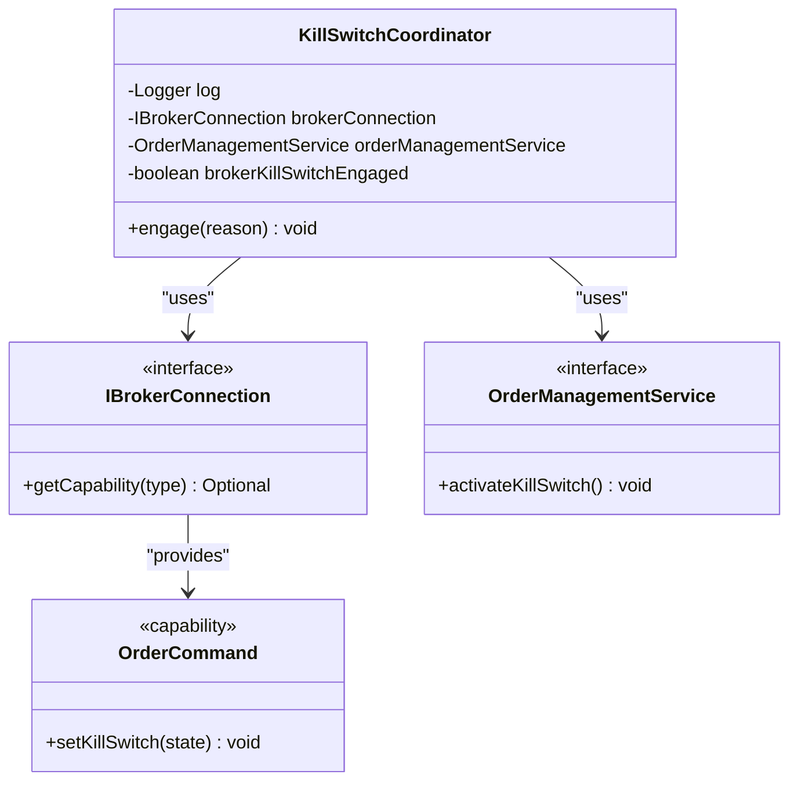
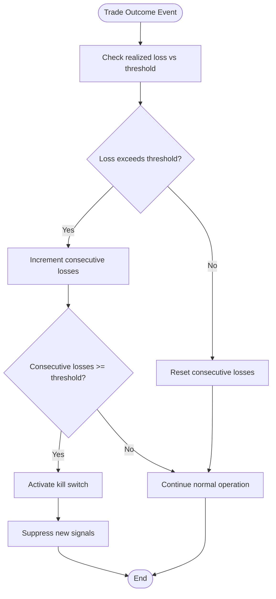
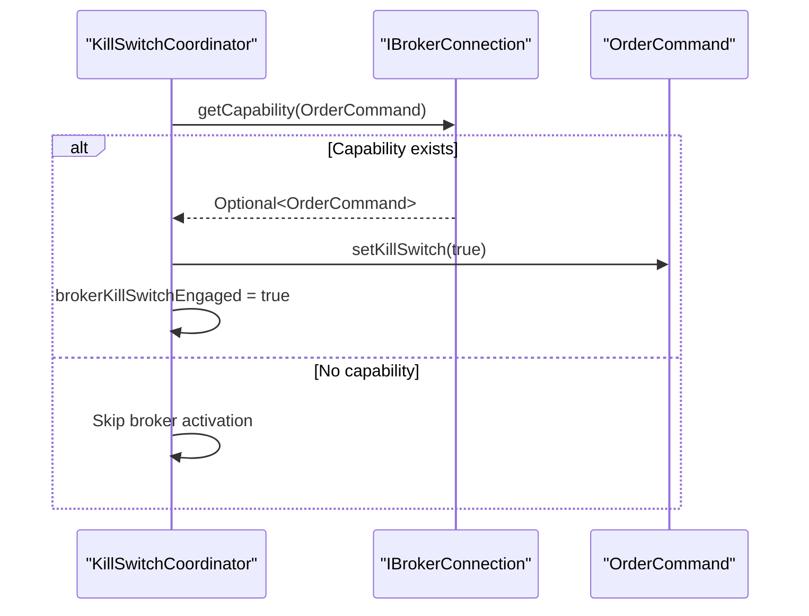
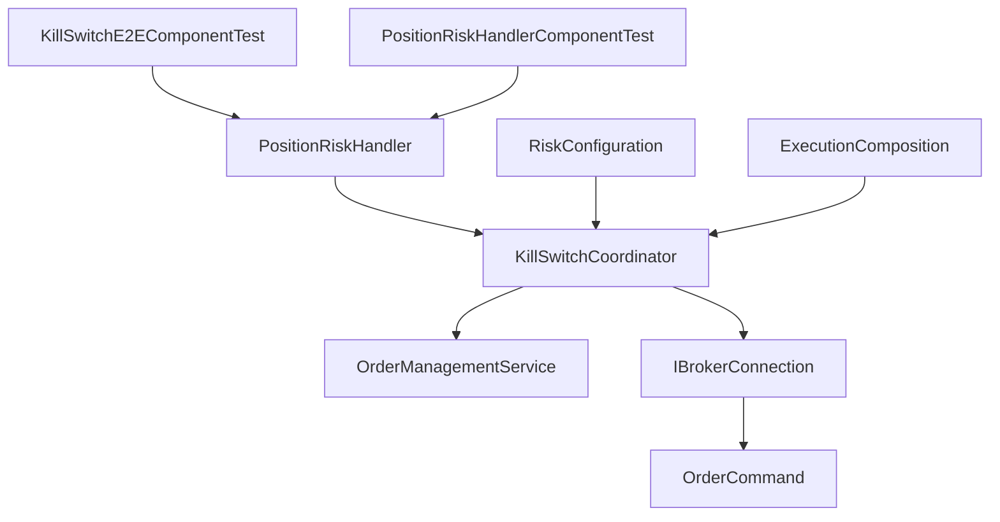

# Kill Switch Coordination

<cite>
**Referenced Files in This Document**
- [KillSwitchCoordinator.java](file://trading/execution/src/main/java/com/tradej/execution/risk/KillSwitchCoordinator.java)
- [PositionRiskHandler.java](file://trading/execution/src/main/java/com/tradej/execution/risk/PositionRiskHandler.java)
- [RiskConfiguration.java](file://app/src/main/java/com/tradej/app/config/RiskConfiguration.java)
- [ExecutionComposition.java](file://composition/src/main/java/com/tradej/composition/ExecutionComposition.java)
- [KillSwitchE2EComponentTest.java](file://app/src/test/java/com/tradej/app/integration/KillSwitchE2EComponentTest.java)
- [PositionRiskHandlerComponentTest.java](file://app/src/test/java/com/tradej/app/integration/PositionRiskHandlerComponentTest.java)
- [kill-switch.json](file://CertificationArtifacts/dhan/capabilities/kill-switch.json)
- [ARCHITECTURE_REVIEW_2026-06-06.md](file://docs/reports/ARCHITECTURE_REVIEW_2026-06-06.md)
</cite>

## Table of Contents
1. [Introduction](#introduction)
2. [Project Structure](#project-structure)
3. [Core Components](#core-components)
4. [Architecture Overview](#architecture-overview)
5. [Detailed Component Analysis](#detailed-component-analysis)
6. [Dependency Analysis](#dependency-analysis)
7. [Performance Considerations](#performance-considerations)
8. [Troubleshooting Guide](#troubleshooting-guide)
9. [Conclusion](#conclusion)
10. [Appendices](#appendices)

## Introduction
This document provides comprehensive documentation for the KillSwitchCoordinator component, which orchestrates emergency stop mechanisms across the trading platform. The system coordinates kill switch activation and deactivation across order management and broker APIs, tracks engagement state, and integrates with PositionRiskHandler to enforce trading halts. It also covers atomicity guarantees, emergency procedures, recovery mechanisms, logging and monitoring, and operational best practices for managing trading halts and system-wide risk controls.

## Project Structure
The kill switch coordination spans several modules:
- Execution risk module: KillSwitchCoordinator and PositionRiskHandler
- Application configuration: RiskConfiguration wiring
- Composition layer: ExecutionComposition instantiation
- Integration tests: KillSwitchE2EComponentTest and PositionRiskHandlerComponentTest
- Broker capability artifacts: kill-switch.json for broker kill switch support

**Diagram sources**
- [KillSwitchCoordinator.java:1-47](file://trading/execution/src/main/java/com/tradej/execution/risk/KillSwitchCoordinator.java#L1-L47)
- [PositionRiskHandler.java:1-250](file://trading/execution/src/main/java/com/tradej/execution/risk/PositionRiskHandler.java#L1-L250)
- [RiskConfiguration.java:60-85](file://app/src/main/java/com/tradej/app/config/RiskConfiguration.java#L60-L85)
- [ExecutionComposition.java:60-95](file://composition/src/main/java/com/tradej/composition/ExecutionComposition.java#L60-L95)
- [KillSwitchE2EComponentTest.java:1-66](file://app/src/test/java/com/tradej/app/integration/KillSwitchE2EComponentTest.java#L1-L66)
- [PositionRiskHandlerComponentTest.java:177-203](file://app/src/test/java/com/tradej/app/integration/PositionRiskHandlerComponentTest.java#L177-L203)
- [kill-switch.json:1-200](file://CertificationArtifacts/dhan/capabilities/kill-switch.json#L1-L200)

**Section sources**
- [KillSwitchCoordinator.java:1-47](file://trading/execution/src/main/java/com/tradej/execution/risk/KillSwitchCoordinator.java#L1-L47)
- [PositionRiskHandler.java:1-250](file://trading/execution/src/main/java/com/tradej/execution/risk/PositionRiskHandler.java#L1-L250)
- [RiskConfiguration.java:60-85](file://app/src/main/java/com/tradej/app/config/RiskConfiguration.java#L60-L85)
- [ExecutionComposition.java:60-95](file://composition/src/main/java/com/tradej/composition/ExecutionComposition.java#L60-L95)
- [KillSwitchE2EComponentTest.java:1-66](file://app/src/test/java/com/tradej/app/integration/KillSwitchE2EComponentTest.java#L1-L66)
- [PositionRiskHandlerComponentTest.java:177-203](file://app/src/test/java/com/tradej/app/integration/PositionRiskHandlerComponentTest.java#L177-L203)
- [kill-switch.json:1-200](file://CertificationArtifacts/dhan/capabilities/kill-switch.json#L1-L200)

## Core Components
- KillSwitchCoordinator: Central coordinator that synchronizes platform kill-switch state with broker-side kill switch APIs. It supports two activation paths: OMS-based activation via OrderManagementService and broker API fallback via IBrokerConnection capability.
- PositionRiskHandler: Risk engine that triggers kill switch activation based on realized losses and consecutive loss thresholds, and enforces suppression of new signals during kill switch state.
- RiskConfiguration and ExecutionComposition: Provide DI wiring and instantiation of KillSwitchCoordinator with required dependencies.

Key responsibilities:
- Unified kill switch management across OMS and broker APIs
- Atomic engagement state tracking
- Integration with PositionRiskHandler for risk-driven activation
- Logging and monitoring of kill switch events
- Broker capability detection and fallback mechanisms

**Section sources**
- [KillSwitchCoordinator.java:1-47](file://trading/execution/src/main/java/com/tradej/execution/risk/KillSwitchCoordinator.java#L1-L47)
- [PositionRiskHandler.java:1-250](file://trading/execution/src/main/java/com/tradej/execution/risk/PositionRiskHandler.java#L1-L250)
- [RiskConfiguration.java:60-85](file://app/src/main/java/com/tradej/app/config/RiskConfiguration.java#L60-L85)
- [ExecutionComposition.java:60-95](file://composition/src/main/java/com/tradej/composition/ExecutionComposition.java#L60-L95)

## Architecture Overview
The kill switch coordination follows a layered architecture with clear separation of concerns:
- Risk layer: PositionRiskHandler monitors trading outcomes and activates kill switch
- Coordination layer: KillSwitchCoordinator translates kill switch activation into OMS and broker actions
- Broker integration: Capability-based fallback ensures robust activation across different broker implementations
- Monitoring: Structured logging with error and warning levels for operational visibility

**Diagram sources**
- [KillSwitchCoordinator.java:28-47](file://trading/execution/src/main/java/com/tradej/execution/risk/KillSwitchCoordinator.java#L28-L47)
- [PositionRiskHandler.java:1-250](file://trading/execution/src/main/java/com/tradej/execution/risk/PositionRiskHandler.java#L1-L250)

## Detailed Component Analysis

### KillSwitchCoordinator Analysis
KillSwitchCoordinator implements a unified kill switch management system with dual activation paths:

**Diagram sources**
- [KillSwitchCoordinator.java:1-47](file://trading/execution/src/main/java/com/tradej/execution/risk/KillSwitchCoordinator.java#L1-L47)

Activation process:
1. OMS-based activation via OrderManagementService.activateKillSwitch()
2. Fallback to broker API via IBrokerConnection.getCapability(OrderCommand) and setKillSwitch(true)
3. State tracking with brokerKillSwitchEngaged flag
4. Comprehensive error handling with structured logging

**Section sources**
- [KillSwitchCoordinator.java:1-47](file://trading/execution/src/main/java/com/tradej/execution/risk/KillSwitchCoordinator.java#L1-L47)

### PositionRiskHandler Integration
PositionRiskHandler coordinates kill switch activation based on realized losses and consecutive loss thresholds:

**Diagram sources**
- [PositionRiskHandler.java:1-250](file://trading/execution/src/main/java/com/tradej/execution/risk/PositionRiskHandler.java#L1-L250)

Key behaviors:
- Realized loss accumulation and consecutive loss tracking
- Kill switch activation when thresholds are exceeded
- Signal suppression during kill switch state
- Daily limit reset functionality

**Section sources**
- [PositionRiskHandler.java:1-250](file://trading/execution/src/main/java/com/tradej/execution/risk/PositionRiskHandler.java#L1-L250)
- [PositionRiskHandlerComponentTest.java:177-203](file://app/src/test/java/com/tradej/app/integration/PositionRiskHandlerComponentTest.java#L177-L203)

### Broker Kill Switch Integration
Broker kill switch capability detection and fallback mechanism:

**Diagram sources**
- [KillSwitchCoordinator.java:37-46](file://trading/execution/src/main/java/com/tradej/execution/risk/KillSwitchCoordinator.java#L37-L46)

Broker capability artifact:
- kill-switch.json defines broker kill switch capability support
- Enables capability-based activation for compatible brokers

**Section sources**
- [KillSwitchCoordinator.java:37-46](file://trading/execution/src/main/java/com/tradej/execution/risk/KillSwitchCoordinator.java#L37-L46)
- [kill-switch.json:1-200](file://CertificationArtifacts/dhan/capabilities/kill-switch.json#L1-L200)

## Dependency Analysis
The kill switch coordination involves several key dependencies and relationships:

**Diagram sources**
- [PositionRiskHandler.java:1-250](file://trading/execution/src/main/java/com/tradej/execution/risk/PositionRiskHandler.java#L1-L250)
- [KillSwitchCoordinator.java:1-47](file://trading/execution/src/main/java/com/tradej/execution/risk/KillSwitchCoordinator.java#L1-L47)
- [RiskConfiguration.java:60-85](file://app/src/main/java/com/tradej/app/config/RiskConfiguration.java#L60-L85)
- [ExecutionComposition.java:60-95](file://composition/src/main/java/com/tradej/composition/ExecutionComposition.java#L60-L95)
- [KillSwitchE2EComponentTest.java:1-66](file://app/src/test/java/com/tradej/app/integration/KillSwitchE2EComponentTest.java#L1-L66)
- [PositionRiskHandlerComponentTest.java:177-203](file://app/src/test/java/com/tradej/app/integration/PositionRiskHandlerComponentTest.java#L177-L203)

**Section sources**
- [PositionRiskHandler.java:1-250](file://trading/execution/src/main/java/com/tradej/execution/risk/PositionRiskHandler.java#L1-L250)
- [KillSwitchCoordinator.java:1-47](file://trading/execution/src/main/java/com/tradej/execution/risk/KillSwitchCoordinator.java#L1-L47)
- [RiskConfiguration.java:60-85](file://app/src/main/java/com/tradej/app/config/RiskConfiguration.java#L60-L85)
- [ExecutionComposition.java:60-95](file://composition/src/main/java/com/tradej/composition/ExecutionComposition.java#L60-L95)

## Performance Considerations
- Atomicity: Current implementation uses volatile boolean for kill switch state without compare-and-set semantics
- Concurrency: PositionRiskHandler handles concurrent loss sequences correctly with proper synchronization
- Latency: Kill switch activation is designed to be immediate but may have microsecond windows between reconciliation halt and OMS activation
- Memory: Minimal footprint with simple boolean state tracking

Recommendations for improvement:
- Replace volatile boolean with AtomicBoolean for stronger atomicity guarantees
- Implement pre-trade tryReserve() mechanism per (strategy, symbol) to ensure indivisible check-and-set operations
- Add real unwind stage: emit PositionCloseRequested to all open trades and call brokerConnection.cancelAll()

**Section sources**
- [ARCHITECTURE_REVIEW_2026-06-06.md:70-73](file://docs/reports/ARCHITECTURE_REVIEW_2026-06-06.md#L70-L73)

## Troubleshooting Guide
Common issues and resolutions:

### Kill Switch Activation Failures
- OMS activation failures: Coordinator falls back to broker API automatically
- Broker capability not available: Coordinator continues operation without broker kill switch
- Error logging: Both failure paths produce structured warnings with exception messages

### State Management Issues
- Inconsistent state: brokerKillSwitchEngaged flag indicates whether kill switch is engaged
- Recovery: Reset daily limits clears both realized loss and consecutive loss counters
- Testing: Integration tests verify kill switch suppression behavior

### Operational Visibility
- Logging levels: ERROR for activation, WARN for failures, INFO for normal operations
- Audit trail: Structured log messages with reason strings for operational tracking
- Monitoring: Integration tests validate end-to-end kill switch behavior

**Section sources**
- [KillSwitchCoordinator.java:28-47](file://trading/execution/src/main/java/com/tradej/execution/risk/KillSwitchCoordinator.java#L28-L47)
- [PositionRiskHandlerComponentTest.java:177-203](file://app/src/test/java/com/tradej/app/integration/PositionRiskHandlerComponentTest.java#L177-L203)
- [KillSwitchE2EComponentTest.java:26-66](file://app/src/test/java/com/tradej/app/integration/KillSwitchE2EComponentTest.java#L26-L66)

## Conclusion
The KillSwitchCoordinator provides a robust, dual-path kill switch management system that coordinates emergency stops across OMS and broker APIs. Its integration with PositionRiskHandler ensures timely activation based on risk thresholds, while comprehensive error handling and logging maintain operational visibility. The current implementation serves as a solid foundation for trading halts and system-wide risk controls, with clear pathways for enhancement including improved atomicity guarantees and real unwind capabilities.

## Appendices

### Emergency Procedures
1. Manual kill switch activation: Call KillSwitchCoordinator.engage(reason) with appropriate reason string
2. Broker-specific activation: Ensure OrderCommand capability is available for broker-specific kill switch
3. Recovery procedure: Reset daily limits to clear state and resume normal operations
4. Monitoring: Verify log messages for activation and any fallback mechanisms

### Operational Best Practices
- Use descriptive reason strings for kill switch activations
- Monitor both OMS and broker activation paths
- Implement proper error handling and fallback mechanisms
- Regular testing of kill switch scenarios through integration tests
- Maintain audit trails through structured logging

### Broker-Specific Implementations
- Capability-based activation: OrderCommand.setKillSwitch(true) for supported brokers
- Fallback mechanisms: Automatic fallback when OMS activation fails
- Capability verification: Use Optional pattern to safely handle missing capabilities