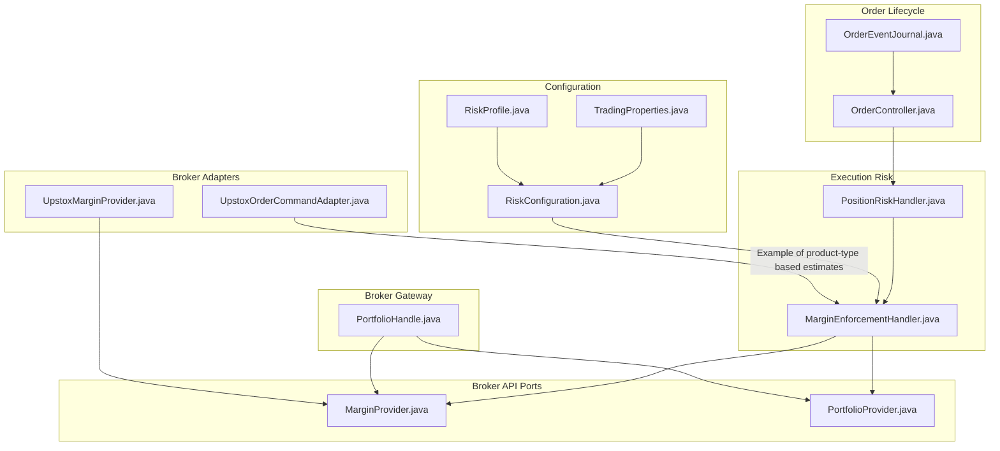
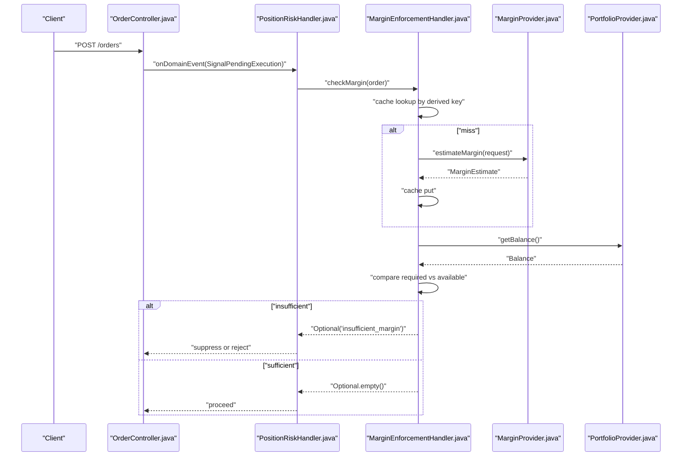
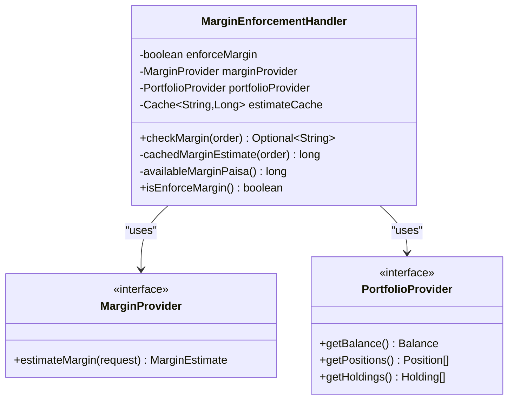
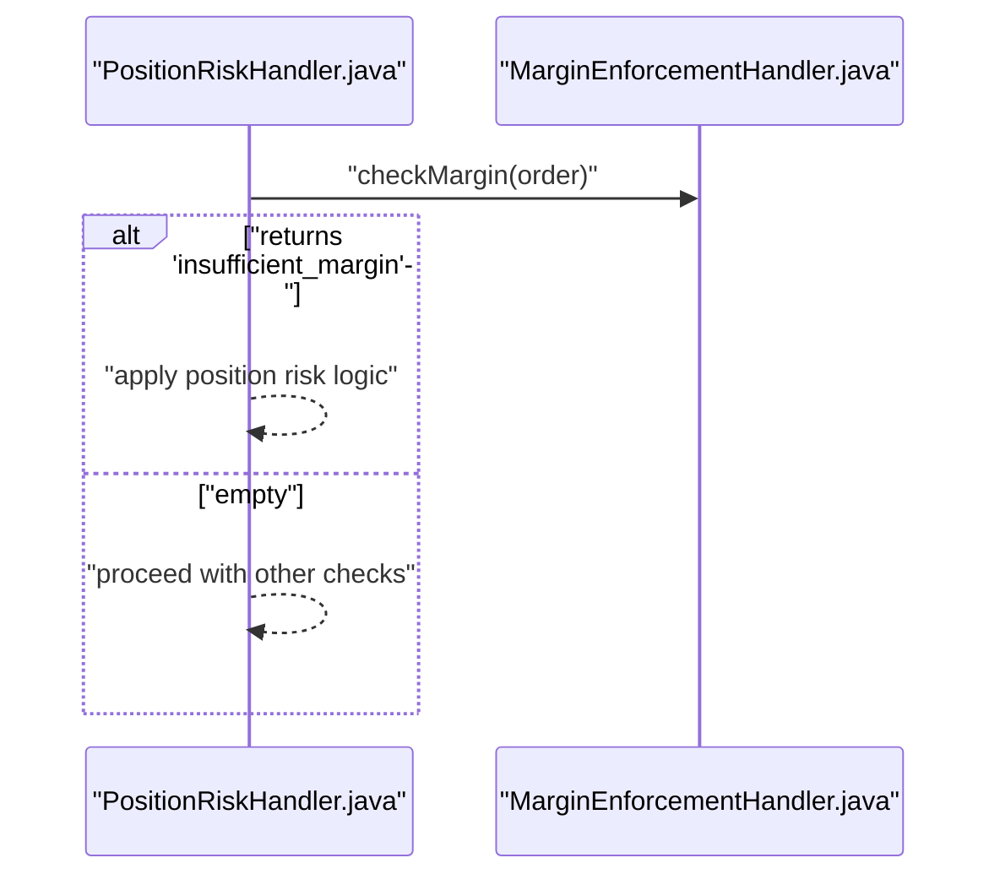
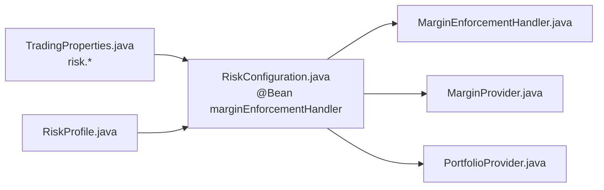
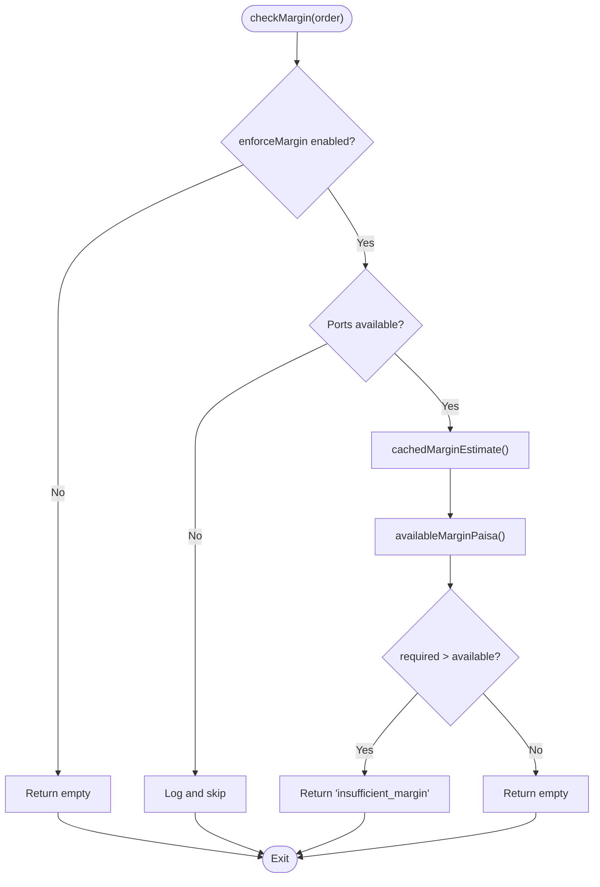

# Margin Enforcement

<cite>
**Referenced Files in This Document**
- [MarginEnforcementHandler.java](file://trading/execution/src/main/java/com/tradej/execution/risk/MarginEnforcementHandler.java)
- [MarginEnforcementHandlerTest.java](file://trading/execution/src/test/java/com/tradej/execution/risk/MarginEnforcementHandlerTest.java)
- [MarginEnforcementComponentTest.java](file://app/src/test/java/com/tradej/app/integration/MarginEnforcementComponentTest.java)
- [RiskConfiguration.java](file://app/src/main/java/com/tradej/app/config/RiskConfiguration.java)
- [TradingProperties.java](file://app/src/main/java/com/tradej/app/config/TradingProperties.java)
- [RiskProfile.java](file://composition/src/main/java/com/tradej/composition/config/RiskProfile.java)
- [MarginProvider.java](file://broker/api/src/main/java/com/tradej/broker/api/port/MarginProvider.java)
- [PortfolioProvider.java](file://broker/api/src/main/java/com/tradej/broker/api/port/PortfolioProvider.java)
- [PortfolioHandle.java](file://broker-gateway/src/main/java/com/tradej/brokergateway/PortfolioHandle.java)
- [PositionRiskHandler.java](file://trading/execution/src/main/java/com/tradej/execution/risk/PositionRiskHandler.java)
- [UpstoxMarginProvider.java](file://broker/upstox/src/main/java/com/tradej/broker/upstox/adapter/UpstoxMarginProvider.java)
- [UpstoxOrderCommandAdapter.java](file://broker/upstox/src/main/java/com/tradej/broker/upstox/adapter/UpstoxOrderCommandAdapter.java)
- [OrderController.java](file://app/src/main/java/com/tradej/app/api/OrderController.java)
- [OrderEventJournal.java](file://trading/execution/src/main/java/com/tradej/execution/journal/OrderEventJournal.java)
</cite>

## Table of Contents
1. [Introduction](#introduction)
2. [Project Structure](#project-structure)
3. [Core Components](#core-components)
4. [Architecture Overview](#architecture-overview)
5. [Detailed Component Analysis](#detailed-component-analysis)
6. [Dependency Analysis](#dependency-analysis)
7. [Performance Considerations](#performance-considerations)
8. [Troubleshooting Guide](#troubleshooting-guide)
9. [Conclusion](#conclusion)
10. [Appendices](#appendices)

## Introduction
This document explains the MarginEnforcementHandler component responsible for pre-trade margin validation. It covers how margin is estimated via MarginProvider, how portfolio balance is checked via PortfolioProvider, and how caching improves performance. It also documents the end-to-end enforcement workflow from order placement to approval or rejection, including cache key derivation and broker-specific requirements. Configuration options for enabling/disabling enforcement, cache TTL, and performance tuning are included, along with integration points to PositionRiskHandler and handling of insufficient margin scenarios.

## Project Structure
The margin enforcement logic lives in the execution risk module and integrates with broker APIs and configuration layers:
- Risk enforcement handler: trading/execution/src/main/java/com/tradej/execution/risk/MarginEnforcementHandler.java
- Broker provider interfaces: broker/api/src/main/java/com/tradej/broker/api/port/MarginProvider.java, PortfolioProvider.java
- Broker gateway handle: broker-gateway/src/main/java/com/tradej/brokergateway/PortfolioHandle.java
- Configuration wiring: app/src/main/java/com/tradej/app/config/RiskConfiguration.java, app/src/main/java/com/tradej/app/config/TradingProperties.java
- Composition defaults: composition/src/main/java/com/tradej/composition/config/RiskProfile.java
- Example broker adapters: broker/upstox/.../UpstoxMarginProvider.java, UpstoxOrderCommandAdapter.java
- Integration tests: app/src/test/java/com/tradej/app/integration/MarginEnforcementComponentTest.java
- Unit tests: trading/execution/src/test/java/com/tradej/execution/risk/MarginEnforcementHandlerTest.java

**Diagram sources**
- [MarginEnforcementHandler.java:1-118](file://trading/execution/src/main/java/com/tradej/execution/risk/MarginEnforcementHandler.java#L1-L118)
- [PositionRiskHandler.java:1-200](file://trading/execution/src/main/java/com/tradej/execution/risk/PositionRiskHandler.java#L1-L200)
- [MarginProvider.java:1-8](file://broker/api/src/main/java/com/tradej/broker/api/port/MarginProvider.java#L1-L8)
- [PortfolioProvider.java:1-15](file://broker/api/src/main/java/com/tradej/broker/api/port/PortfolioProvider.java#L1-L15)
- [PortfolioHandle.java:1-39](file://broker-gateway/src/main/java/com/tradej/brokergateway/PortfolioHandle.java#L1-L39)
- [RiskConfiguration.java:32-61](file://app/src/main/java/com/tradej/app/config/RiskConfiguration.java#L32-L61)
- [TradingProperties.java:219-242](file://app/src/main/java/com/tradej/app/config/TradingProperties.java#L219-L242)
- [RiskProfile.java:1-17](file://composition/src/main/java/com/tradej/composition/config/RiskProfile.java#L1-L17)
- [UpstoxMarginProvider.java:1-43](file://broker/upstox/src/main/java/com/tradej/broker/upstox/adapter/UpstoxMarginProvider.java#L1-L43)
- [UpstoxOrderCommandAdapter.java:169-191](file://broker/upstox/src/main/java/com/tradej/broker/upstox/adapter/UpstoxOrderCommandAdapter.java#L169-L191)
- [OrderController.java:53-116](file://app/src/main/java/com/tradej/app/api/OrderController.java#L53-L116)
- [OrderEventJournal.java:47-57](file://trading/execution/src/main/java/com/tradej/execution/journal/OrderEventJournal.java#L47-L57)

**Section sources**
- [MarginEnforcementHandler.java:1-118](file://trading/execution/src/main/java/com/tradej/execution/risk/MarginEnforcementHandler.java#L1-L118)
- [RiskConfiguration.java:32-61](file://app/src/main/java/com/tradej/app/config/RiskConfiguration.java#L32-L61)
- [TradingProperties.java:219-242](file://app/src/main/java/com/tradej/app/config/TradingProperties.java#L219-L242)
- [RiskProfile.java:1-17](file://composition/src/main/java/com/tradej/composition/config/RiskProfile.java#L1-L17)

## Core Components
- MarginEnforcementHandler: Enforces pre-trade margin checks by comparing a cached margin estimate with available portfolio margin. It supports toggling enforcement, broker port availability checks, and robust error handling.
- MarginProvider and PortfolioProvider: Broker-facing ports for margin estimation and portfolio balance retrieval.
- RiskConfiguration and TradingProperties: Provide runtime configuration for enabling enforcement and cache TTL.
- PositionRiskHandler: Integrates margin enforcement into broader pre-trade risk checks.

Key behaviors:
- Enforce flag controls whether checks run.
- Cache key includes symbol, segment, side, quantity, price, product type, and order type to avoid stale estimates.
- Available margin prioritizes withdrawable funds, otherwise computes cash + collateral - utilized.

**Section sources**
- [MarginEnforcementHandler.java:17-118](file://trading/execution/src/main/java/com/tradej/execution/risk/MarginEnforcementHandler.java#L17-L118)
- [MarginProvider.java:1-8](file://broker/api/src/main/java/com/tradej/broker/api/port/MarginProvider.java#L1-L8)
- [PortfolioProvider.java:1-15](file://broker/api/src/main/java/com/tradej/broker/api/port/PortfolioProvider.java#L1-L15)
- [RiskConfiguration.java:44-61](file://app/src/main/java/com/tradej/app/config/RiskConfiguration.java#L44-L61)
- [TradingProperties.java:219-242](file://app/src/main/java/com/tradej/app/config/TradingProperties.java#L219-L242)

## Architecture Overview
The margin enforcement workflow sits between order acceptance and execution. It validates that sufficient margin exists before allowing further processing.

**Diagram sources**
- [OrderController.java:77-116](file://app/src/main/java/com/tradej/app/api/OrderController.java#L77-L116)
- [PositionRiskHandler.java:1-200](file://trading/execution/src/main/java/com/tradej/execution/risk/PositionRiskHandler.java#L1-L200)
- [MarginEnforcementHandler.java:48-113](file://trading/execution/src/main/java/com/tradej/execution/risk/MarginEnforcementHandler.java#L48-L113)
- [MarginProvider.java:1-8](file://broker/api/src/main/java/com/tradej/broker/api/port/MarginProvider.java#L1-L8)
- [PortfolioProvider.java:1-15](file://broker/api/src/main/java/com/tradej/broker/api/port/PortfolioProvider.java#L1-L15)

## Detailed Component Analysis

### MarginEnforcementHandler
Responsibilities:
- Gate orders based on pre-trade margin sufficiency.
- Estimate required margin via MarginProvider with caching.
- Compute available margin from PortfolioProvider balance.
- Provide safe fallbacks and logging for missing ports or errors.

Implementation highlights:
- Constructor builds a cache with maximum size and TTL.
- checkMargin short-circuits when disabled or when broker ports are unavailable.
- cachedMarginEstimate derives a composite key from order attributes and caches the total margin paisa.
- availableMarginPaisa prefers withdrawable funds; otherwise computes cash + collateral - utilized.

**Diagram sources**
- [MarginEnforcementHandler.java:21-118](file://trading/execution/src/main/java/com/tradej/execution/risk/MarginEnforcementHandler.java#L21-L118)
- [MarginProvider.java:1-8](file://broker/api/src/main/java/com/tradej/broker/api/port/MarginProvider.java#L1-L8)
- [PortfolioProvider.java:1-15](file://broker/api/src/main/java/com/tradej/broker/api/port/PortfolioProvider.java#L1-L15)

**Section sources**
- [MarginEnforcementHandler.java:21-118](file://trading/execution/src/main/java/com/tradej/execution/risk/MarginEnforcementHandler.java#L21-L118)

### Cache Key Derivation and Broker-Specific Behavior
- Cache key includes: symbol, exchange segment, side, quantity, price paisa, product type, order type. This ensures distinct estimates for different order attributes.
- Broker adapters may apply product-type rules when estimating margins (e.g., intraday vs delivery multipliers). These rules influence the final estimate returned by MarginProvider.

Examples of key components:
- Key construction and cache usage: [MarginEnforcementHandler.java:74-99](file://trading/execution/src/main/java/com/tradej/execution/risk/MarginEnforcementHandler.java#L74-L99)
- Broker adapter example with product-type logic: [UpstoxOrderCommandAdapter.java:169-191](file://broker/upstox/src/main/java/com/tradej/broker/upstox/adapter/UpstoxOrderCommandAdapter.java#L169-L191)

**Section sources**
- [MarginEnforcementHandler.java:74-99](file://trading/execution/src/main/java/com/tradej/execution/risk/MarginEnforcementHandler.java#L74-L99)
- [UpstoxOrderCommandAdapter.java:169-191](file://broker/upstox/src/main/java/com/tradej/broker/upstox/adapter/UpstoxOrderCommandAdapter.java#L169-L191)

### Integration with PositionRiskHandler
PositionRiskHandler coordinates pre-trade risk, including margin checks. When MarginEnforcementHandler returns an insufficient margin reason, PositionRiskHandler can suppress signals or activate protective measures.

**Diagram sources**
- [PositionRiskHandler.java:1-200](file://trading/execution/src/main/java/com/tradej/execution/risk/PositionRiskHandler.java#L1-L200)
- [MarginEnforcementHandler.java:48-72](file://trading/execution/src/main/java/com/tradej/execution/risk/MarginEnforcementHandler.java#L48-L72)
- [MarginEnforcementComponentTest.java:22-35](file://app/src/test/java/com/tradej/app/integration/MarginEnforcementComponentTest.java#L22-L35)

**Section sources**
- [MarginEnforcementComponentTest.java:22-35](file://app/src/test/java/com/tradej/app/integration/MarginEnforcementComponentTest.java#L22-L35)
- [PositionRiskHandler.java:1-200](file://trading/execution/src/main/java/com/tradej/execution/risk/PositionRiskHandler.java#L1-L200)

### Broker Adapter Examples
- UpstoxMarginProvider: Calls broker endpoint to compute required margin from request payload and returns a MarginEstimate.
- UpstoxOrderCommandAdapter: Demonstrates product-type based margin estimation logic used by brokers.

**Section sources**
- [UpstoxMarginProvider.java:24-42](file://broker/upstox/src/main/java/com/tradej/broker/upstox/adapter/UpstoxMarginProvider.java#L24-L42)
- [UpstoxOrderCommandAdapter.java:169-191](file://broker/upstox/src/main/java/com/tradej/broker/upstox/adapter/UpstoxOrderCommandAdapter.java#L169-L191)

## Dependency Analysis
- MarginEnforcementHandler depends on MarginProvider and PortfolioProvider interfaces. These are resolved at runtime via broker connections.
- RiskConfiguration wires enforceMargin and cache TTL from TradingProperties and injects the ports if available.
- RiskProfile provides default risk profile values including enforceMargin and cache TTL minutes.

**Diagram sources**
- [TradingProperties.java:219-242](file://app/src/main/java/com/tradej/app/config/TradingProperties.java#L219-L242)
- [RiskConfiguration.java:44-61](file://app/src/main/java/com/tradej/app/config/RiskConfiguration.java#L44-L61)
- [RiskProfile.java:5-16](file://composition/src/main/java/com/tradej/composition/config/RiskProfile.java#L5-L16)
- [MarginEnforcementHandler.java:25-42](file://trading/execution/src/main/java/com/tradej/execution/risk/MarginEnforcementHandler.java#L25-L42)

**Section sources**
- [RiskConfiguration.java:44-61](file://app/src/main/java/com/tradej/app/config/RiskConfiguration.java#L44-L61)
- [TradingProperties.java:219-242](file://app/src/main/java/com/tradej/app/config/TradingProperties.java#L219-L242)
- [RiskProfile.java:5-16](file://composition/src/main/java/com/tradej/composition/config/RiskProfile.java#L5-L16)

## Performance Considerations
- Cache configuration:
  - Maximum cache size: 10,000 entries.
  - Default TTL: 5 minutes; configurable via marginCacheTtlMinutes.
- Cache key granularity prevents cross-order contamination and reduces redundant broker calls.
- availableMarginPaisa avoids repeated broker calls by preferring withdrawable funds and computing derived values from Balance.

Recommendations:
- Adjust marginCacheTtlMinutes based on broker latency and stability.
- Monitor cache hit ratio and adjust maximumSize if needed.
- Ensure broker-side margin endpoints are responsive; consider retry/backoff at higher layers if required.

**Section sources**
- [MarginEnforcementHandler.java:39-42](file://trading/execution/src/main/java/com/tradej/execution/risk/MarginEnforcementHandler.java#L39-L42)
- [TradingProperties.java:228-228](file://app/src/main/java/com/tradej/app/config/TradingProperties.java#L228-L228)

## Troubleshooting Guide
Common scenarios and handling:
- Enforce disabled: checkMargin returns empty; no broker calls are made.
- Broker ports unavailable: handler logs and skips enforcement gracefully.
- Insufficient margin: returns a rejection reason; PositionRiskHandler can act accordingly.
- Margin check failure: logs warning and returns a generic rejection reason.

**Diagram sources**
- [MarginEnforcementHandler.java:48-113](file://trading/execution/src/main/java/com/tradej/execution/risk/MarginEnforcementHandler.java#L48-L113)

Operational tips:
- Verify enforceMargin and marginCacheTtlMinutes in configuration.
- Confirm broker connection exposes MarginProvider and PortfolioProvider capabilities.
- Review logs for warnings indicating margin check failures.

**Section sources**
- [MarginEnforcementHandler.java:48-113](file://trading/execution/src/main/java/com/tradej/execution/risk/MarginEnforcementHandler.java#L48-L113)
- [RiskConfiguration.java:44-61](file://app/src/main/java/com/tradej/app/config/RiskConfiguration.java#L44-L61)

## Conclusion
MarginEnforcementHandler provides a robust, configurable pre-trade gate that leverages cached broker margin estimates against portfolio availability. Its design balances safety and performance through selective enforcement, granular cache keys, and sensible defaults. Integration with PositionRiskHandler and configuration-driven toggles enables broker-agnostic deployment and operational control.

## Appendices

### Configuration Options
- enforceMargin: Enable/disable margin enforcement globally.
- marginCacheTtlMinutes: Cache TTL for margin estimates (minimum 1 minute).
- Defaults: enforceMargin=true, marginCacheTtlMinutes=5 (via RiskProfile.defaults).

Best practices:
- Start with enforceMargin=true and conservative TTL.
- Increase TTL for stable, low-latency brokers; reduce for volatile environments.
- Align product-type rules with broker-specific margin policies.

**Section sources**
- [TradingProperties.java:226-228](file://app/src/main/java/com/tradej/app/config/TradingProperties.java#L226-L228)
- [RiskProfile.java:11-16](file://composition/src/main/java/com/tradej/composition/config/RiskProfile.java#L11-L16)
- [RiskConfiguration.java:56-60](file://app/src/main/java/com/tradej/app/config/RiskConfiguration.java#L56-L60)

### Example Scenarios
- Insufficient margin: Unit test demonstrates rejection with a specific reason.
- Sufficient margin: Unit test demonstrates passing check.
- Integration: Component test verifies PositionRiskHandler reacts to insufficient margin.

**Section sources**
- [MarginEnforcementHandlerTest.java:35-57](file://trading/execution/src/test/java/com/tradej/execution/risk/MarginEnforcementHandlerTest.java#L35-L57)
- [MarginEnforcementComponentTest.java:22-35](file://app/src/test/java/com/tradej/app/integration/MarginEnforcementComponentTest.java#L22-L35)

### Order Lifecycle Notes
- Rejection reasons propagate to downstream components and API responses.
- OrderEventJournal captures rejected events with associated timestamps.

**Section sources**
- [OrderController.java:107-115](file://app/src/main/java/com/tradej/app/api/OrderController.java#L107-L115)
- [OrderEventJournal.java:47-57](file://trading/execution/src/main/java/com/tradej/execution/journal/OrderEventJournal.java#L47-L57)