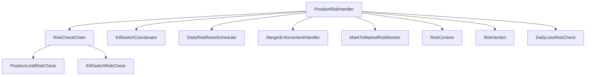
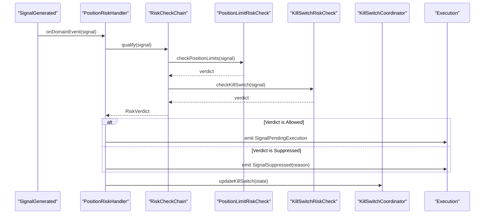
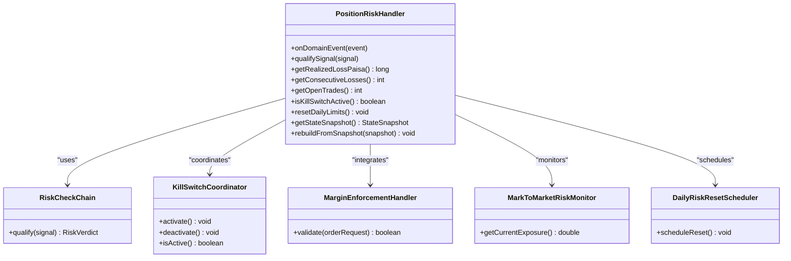
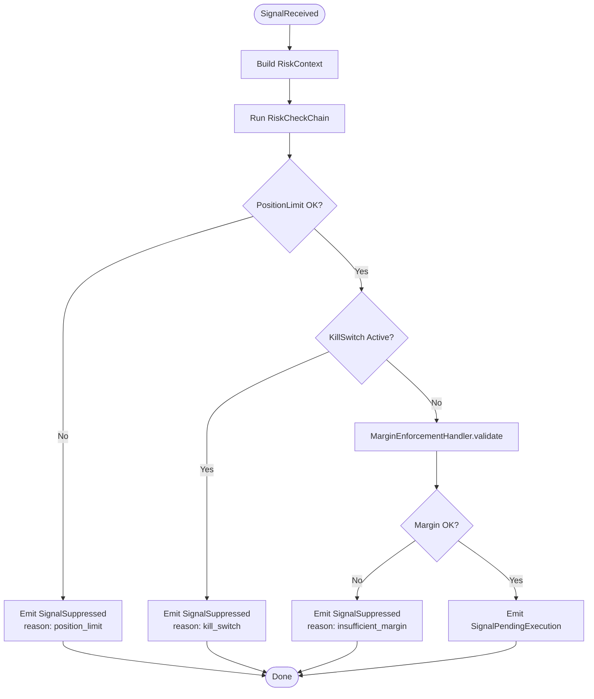
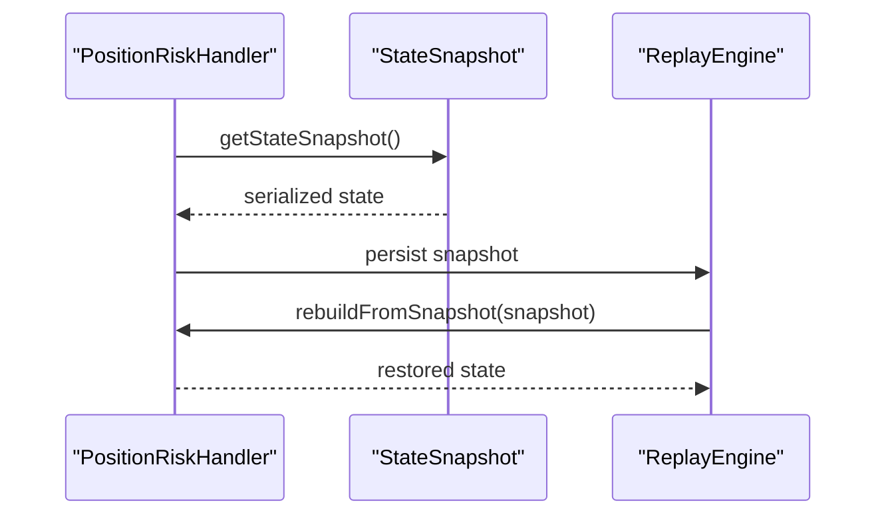
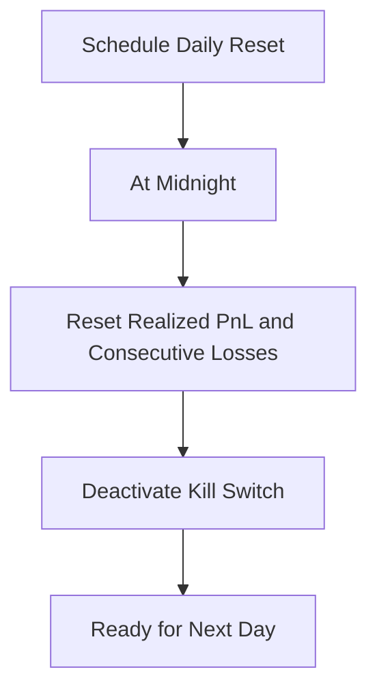
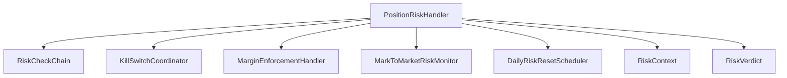

# Position Risk Handler

<cite>
**Referenced Files in This Document**
- [PositionRiskHandler.java](file://trading/execution/src/main/java/com/tradej/execution/risk/PositionRiskHandler.java)
- [PositionRiskHandlerStressTest.java](file://trading/execution/src/test/java/com/tradej/execution/risk/PositionRiskHandlerStressTest.java)
- [PositionRiskHandlerComponentTest.java](file://app/src/test/java/com/tradej/app/integration/PositionRiskHandlerComponentTest.java)
- [RiskCheckChain.java](file://trading/execution/src/main/java/com/tradej/execution/risk/RiskCheckChain.java)
- [PositionLimitRiskCheck.java](file://trading/execution/src/main/java/com/tradej/execution/risk/PositionLimitRiskCheck.java)
- [KillSwitchCoordinator.java](file://trading/execution/src/main/java/com/tradej/execution/risk/KillSwitchCoordinator.java)
- [KillSwitchRiskCheck.java](file://trading/execution/src/main/java/com/tradej/execution/risk/KillSwitchRiskCheck.java)
- [DailyRiskResetScheduler.java](file://trading/execution/src/main/java/com/tradej/execution/risk/DailyRiskResetScheduler.java)
- [MarginEnforcementHandler.java](file://trading/execution/src/main/java/com/tradej/execution/risk/MarginEnforcementHandler.java)
- [MarkToMarketRiskMonitor.java](file://trading/execution/src/main/java/com/tradej/execution/risk/MarkToMarketRiskMonitor.java)
- [RiskContext.java](file://trading/execution/src/main/java/com/tradej/execution/risk/RiskContext.java)
- [RiskVerdict.java](file://trading/execution/src/main/java/com/tradej/execution/risk/RiskVerdict.java)
- [DailyLossRiskCheck.java](file://trading/execution/src/main/java/com/tradej/execution/risk/DailyLossRiskCheck.java)
</cite>

## Table of Contents
1. [Introduction](#introduction)
2. [Project Structure](#project-structure)
3. [Core Components](#core-components)
4. [Architecture Overview](#architecture-overview)
5. [Detailed Component Analysis](#detailed-component-analysis)
6. [Dependency Analysis](#dependency-analysis)
7. [Performance Considerations](#performance-considerations)
8. [Troubleshooting Guide](#troubleshooting-guide)
9. [Conclusion](#conclusion)

## Introduction
PositionRiskHandler is the central position tracking and risk enforcement mechanism in the trading system. It manages realized and unrealized profit and loss (PnL), consecutive loss counting, open trade monitoring, and kill switch coordination. It also performs pre-trade risk validation, including position limit checks, order value validation, margin enforcement integration, and portfolio capital reservation. The component coordinates with other risk management components to qualify signals from SignalGenerated to SignalPendingExecution, handles rejections and suppression reasons, supports state snapshots for replay and recovery, implements daily risk limit resets, and manages reconciliation halt scenarios.

## Project Structure
The PositionRiskHandler resides in the trading execution module under the risk package. It collaborates with several supporting components:
- RiskCheckChain: orchestrates multiple risk checks in sequence
- PositionLimitRiskCheck: enforces position limits per symbol and overall
- KillSwitchCoordinator: manages kill switch activation and deactivation
- KillSwitchRiskCheck: evaluates kill switch conditions during signal qualification
- DailyRiskResetScheduler: schedules daily risk limit resets
- MarginEnforcementHandler: integrates with margin enforcement systems
- MarkToMarketRiskMonitor: monitors mark-to-market risk exposure
- RiskContext and RiskVerdict: provide context and verdicts for risk decisions
- DailyLossRiskCheck: tracks daily losses for kill switch triggers

**Diagram sources**
- [PositionRiskHandler.java](file://trading/execution/src/main/java/com/tradej/execution/risk/PositionRiskHandler.java)
- [RiskCheckChain.java](file://trading/execution/src/main/java/com/tradej/execution/risk/RiskCheckChain.java)
- [PositionLimitRiskCheck.java](file://trading/execution/src/main/java/com/tradej/execution/risk/PositionLimitRiskCheck.java)
- [KillSwitchCoordinator.java](file://trading/execution/src/main/java/com/tradej/execution/risk/KillSwitchCoordinator.java)
- [KillSwitchRiskCheck.java](file://trading/execution/src/main/java/com/tradej/execution/risk/KillSwitchRiskCheck.java)
- [DailyRiskResetScheduler.java](file://trading/execution/src/main/java/com/tradej/execution/risk/DailyRiskResetScheduler.java)
- [MarginEnforcementHandler.java](file://trading/execution/src/main/java/com/tradej/execution/risk/MarginEnforcementHandler.java)
- [MarkToMarketRiskMonitor.java](file://trading/execution/src/main/java/com/tradej/execution/risk/MarkToMarketRiskMonitor.java)
- [RiskContext.java](file://trading/execution/src/main/java/com/tradej/execution/risk/RiskContext.java)
- [RiskVerdict.java](file://trading/execution/src/main/java/com/tradej/execution/risk/RiskVerdict.java)
- [DailyLossRiskCheck.java](file://trading/execution/src/main/java/com/tradej/execution/risk/DailyLossRiskCheck.java)

**Section sources**
- [PositionRiskHandler.java](file://trading/execution/src/main/java/com/tradej/execution/risk/PositionRiskHandler.java)
- [RiskCheckChain.java](file://trading/execution/src/main/java/com/tradej/execution/risk/RiskCheckChain.java)

## Core Components
PositionRiskHandler maintains:
- Realized PnL: cumulative losses from closed trades
- Unrealized PnL: current paper profit/loss from open positions
- Consecutive Losses: streak counter for loss events
- Open Trades: count of currently open positions
- Kill Switch: global suppression flag activated by risk thresholds
- State Snapshot: serializable state for replay and recovery
- Daily Limits Reset: scheduled reset of daily risk counters

It integrates with:
- RiskCheckChain for pre-trade validation
- KillSwitchCoordinator for kill switch lifecycle
- MarginEnforcementHandler for margin validation
- MarkToMarketRiskMonitor for exposure monitoring
- DailyRiskResetScheduler for daily limit resets

**Section sources**
- [PositionRiskHandler.java](file://trading/execution/src/main/java/com/tradej/execution/risk/PositionRiskHandler.java)
- [RiskCheckChain.java](file://trading/execution/src/main/java/com/tradej/execution/risk/RiskCheckChain.java)
- [KillSwitchCoordinator.java](file://trading/execution/src/main/java/com/tradej/execution/risk/KillSwitchCoordinator.java)
- [MarginEnforcementHandler.java](file://trading/execution/src/main/java/com/tradej/execution/risk/MarginEnforcementHandler.java)
- [MarkToMarketRiskMonitor.java](file://trading/execution/src/main/java/com/tradej/execution/risk/MarkToMarketRiskMonitor.java)
- [DailyRiskResetScheduler.java](file://trading/execution/src/main/java/com/tradej/execution/risk/DailyRiskResetScheduler.java)

## Architecture Overview
PositionRiskHandler acts as the central coordinator for risk enforcement. It receives domain events (signals, trades, fills) and applies risk checks to qualify signals before execution. It maintains internal state for realized/unrealized PnL, consecutive losses, and open trades, and coordinates with kill switch and daily reset mechanisms.

**Diagram sources**
- [PositionRiskHandler.java](file://trading/execution/src/main/java/com/tradej/execution/risk/PositionRiskHandler.java)
- [RiskCheckChain.java](file://trading/execution/src/main/java/com/tradej/execution/risk/RiskCheckChain.java)
- [PositionLimitRiskCheck.java](file://trading/execution/src/main/java/com/tradej/execution/risk/PositionLimitRiskCheck.java)
- [KillSwitchRiskCheck.java](file://trading/execution/src/main/java/com/tradej/execution/risk/KillSwitchRiskCheck.java)
- [KillSwitchCoordinator.java](file://trading/execution/src/main/java/com/tradej/execution/risk/KillSwitchCoordinator.java)

## Detailed Component Analysis

### PositionRiskHandler
Responsibilities:
- Track realized and unrealized PnL
- Count consecutive losses and manage kill switch
- Monitor open trades and enforce position limits
- Coordinate pre-trade risk checks via RiskCheckChain
- Manage state snapshots for replay and recovery
- Integrate with margin enforcement and mark-to-market monitoring
- Support daily risk limit resets

Key behaviors:
- Processes TradeClosed events to update realized PnL and consecutive losses
- Processes TradeOpened events to update open trades and unrealized PnL
- Qualifies signals through RiskCheckChain and emits SignalPendingExecution or SignalSuppressed
- Resets daily limits and clears kill switch on schedule

**Diagram sources**
- [PositionRiskHandler.java](file://trading/execution/src/main/java/com/tradej/execution/risk/PositionRiskHandler.java)
- [RiskCheckChain.java](file://trading/execution/src/main/java/com/tradej/execution/risk/RiskCheckChain.java)
- [KillSwitchCoordinator.java](file://trading/execution/src/main/java/com/tradej/execution/risk/KillSwitchCoordinator.java)
- [MarginEnforcementHandler.java](file://trading/execution/src/main/java/com/tradej/execution/risk/MarginEnforcementHandler.java)
- [MarkToMarketRiskMonitor.java](file://trading/execution/src/main/java/com/tradej/execution/risk/MarkToMarketRiskMonitor.java)
- [DailyRiskResetScheduler.java](file://trading/execution/src/main/java/com/tradej/execution/risk/DailyRiskResetScheduler.java)

**Section sources**
- [PositionRiskHandler.java](file://trading/execution/src/main/java/com/tradej/execution/risk/PositionRiskHandler.java)

### Pre-Trade Risk Validation Workflow
PositionRiskHandler delegates pre-trade validation to RiskCheckChain, which runs PositionLimitRiskCheck and KillSwitchRiskCheck. The workflow ensures:
- Position limits are enforced per symbol and overall
- Kill switch suppression is applied when active
- Order value validation and margin enforcement are integrated
- Portfolio capital reservation is considered

**Diagram sources**
- [RiskCheckChain.java](file://trading/execution/src/main/java/com/tradej/execution/risk/RiskCheckChain.java)
- [PositionLimitRiskCheck.java](file://trading/execution/src/main/java/com/tradej/execution/risk/PositionLimitRiskCheck.java)
- [KillSwitchRiskCheck.java](file://trading/execution/src/main/java/com/tradej/execution/risk/KillSwitchRiskCheck.java)
- [MarginEnforcementHandler.java](file://trading/execution/src/main/java/com/tradej/execution/risk/MarginEnforcementHandler.java)

**Section sources**
- [RiskCheckChain.java](file://trading/execution/src/main/java/com/tradej/execution/risk/RiskCheckChain.java)
- [PositionLimitRiskCheck.java](file://trading/execution/src/main/java/com/tradej/execution/risk/PositionLimitRiskCheck.java)
- [KillSwitchRiskCheck.java](file://trading/execution/src/main/java/com/tradej/execution/risk/KillSwitchRiskCheck.java)
- [MarginEnforcementHandler.java](file://trading/execution/src/main/java/com/tradej/execution/risk/MarginEnforcementHandler.java)

### Signal Qualification and Suppression
PositionRiskHandler transforms SignalGenerated into SignalPendingExecution or SignalSuppressed based on risk checks. Suppression reasons include:
- position_limit: when position limits are exceeded
- kill_switch: when kill switch is active
- insufficient_margin: when margin validation fails
- Other reasons as determined by individual risk checks

Integration tests demonstrate kill switch suppression and open trade tracking behavior.

**Section sources**
- [PositionRiskHandlerComponentTest.java](file://app/src/test/java/com/tradej/app/integration/PositionRiskHandlerComponentTest.java)

### State Snapshot and Recovery
PositionRiskHandler provides state snapshot functionality for replay and recovery. The snapshot captures realized PnL, consecutive losses, open trades, and kill switch state. Recovery rebuilds the handler from a snapshot to resume risk tracking consistently.

**Diagram sources**
- [PositionRiskHandler.java](file://trading/execution/src/main/java/com/tradej/execution/risk/PositionRiskHandler.java)

**Section sources**
- [PositionRiskHandler.java](file://trading/execution/src/main/java/com/tradej/execution/risk/PositionRiskHandler.java)

### Daily Risk Limit Reset Mechanism
DailyRiskResetScheduler schedules daily resets of risk counters (realized PnL, consecutive losses). Tests verify that reset clears state and deactivates kill switch.

**Diagram sources**
- [DailyRiskResetScheduler.java](file://trading/execution/src/main/java/com/tradej/execution/risk/DailyRiskResetScheduler.java)
- [PositionRiskHandlerStressTest.java](file://trading/execution/src/test/java/com/tradej/execution/risk/PositionRiskHandlerStressTest.java)

**Section sources**
- [DailyRiskResetScheduler.java](file://trading/execution/src/main/java/com/tradej/execution/risk/DailyRiskResetScheduler.java)
- [PositionRiskHandlerStressTest.java](file://trading/execution/src/test/java/com/tradej/execution/risk/PositionRiskHandlerStressTest.java)

### Reconciliation Halt Handling
During reconciliation, PositionRiskHandler coordinates with KillSwitchCoordinator to halt further signal processing until reconciliation completes. This prevents inconsistent state updates during replay or recovery scenarios.

**Section sources**
- [KillSwitchCoordinator.java](file://trading/execution/src/main/java/com/tradej/execution/risk/KillSwitchCoordinator.java)

## Dependency Analysis
PositionRiskHandler depends on:
- RiskCheckChain for modular risk validation
- KillSwitchCoordinator for kill switch lifecycle
- MarginEnforcementHandler for margin validation
- MarkToMarketRiskMonitor for exposure monitoring
- DailyRiskResetScheduler for daily resets
- RiskContext and RiskVerdict for risk decision structures

**Diagram sources**
- [PositionRiskHandler.java](file://trading/execution/src/main/java/com/tradej/execution/risk/PositionRiskHandler.java)
- [RiskCheckChain.java](file://trading/execution/src/main/java/com/tradej/execution/risk/RiskCheckChain.java)
- [KillSwitchCoordinator.java](file://trading/execution/src/main/java/com/tradej/execution/risk/KillSwitchCoordinator.java)
- [MarginEnforcementHandler.java](file://trading/execution/src/main/java/com/tradej/execution/risk/MarginEnforcementHandler.java)
- [MarkToMarketRiskMonitor.java](file://trading/execution/src/main/java/com/tradej/execution/risk/MarkToMarketRiskMonitor.java)
- [DailyRiskResetScheduler.java](file://trading/execution/src/main/java/com/tradej/execution/risk/DailyRiskResetScheduler.java)
- [RiskContext.java](file://trading/execution/src/main/java/com/tradej/execution/risk/RiskContext.java)
- [RiskVerdict.java](file://trading/execution/src/main/java/com/tradej/execution/risk/RiskVerdict.java)

**Section sources**
- [PositionRiskHandler.java](file://trading/execution/src/main/java/com/tradej/execution/risk/PositionRiskHandler.java)
- [RiskCheckChain.java](file://trading/execution/src/main/java/com/tradej/execution/risk/RiskCheckChain.java)
- [KillSwitchCoordinator.java](file://trading/execution/src/main/java/com/tradej/execution/risk/KillSwitchCoordinator.java)
- [MarginEnforcementHandler.java](file://trading/execution/src/main/java/com/tradej/execution/risk/MarginEnforcementHandler.java)
- [MarkToMarketRiskMonitor.java](file://trading/execution/src/main/java/com/tradej/execution/risk/MarkToMarketRiskMonitor.java)
- [DailyRiskResetScheduler.java](file://trading/execution/src/main/java/com/tradej/execution/risk/DailyRiskResetScheduler.java)
- [RiskContext.java](file://trading/execution/src/main/java/com/tradej/execution/risk/RiskContext.java)
- [RiskVerdict.java](file://trading/execution/src/main/java/com/tradej/execution/risk/RiskVerdict.java)

## Performance Considerations
- Concurrency: PositionRiskHandlerStressTest validates atomicity of realized loss accumulation and consecutive loss increments under contention, ensuring thread-safe state updates.
- Reset Efficiency: DailyRiskResetScheduler efficiently clears counters without disrupting ongoing operations.
- Integration Overhead: MarginEnforcementHandler and MarkToMarketRiskMonitor add minimal overhead while providing essential validation and monitoring.

**Section sources**
- [PositionRiskHandlerStressTest.java](file://trading/execution/src/test/java/com/tradej/execution/risk/PositionRiskHandlerStressTest.java)
- [DailyRiskResetScheduler.java](file://trading/execution/src/main/java/com/tradej/execution/risk/DailyRiskResetScheduler.java)
- [MarginEnforcementHandler.java](file://trading/execution/src/main/java/com/tradej/execution/risk/MarginEnforcementHandler.java)
- [MarkToMarketRiskMonitor.java](file://trading/execution/src/main/java/com/tradej/execution/risk/MarkToMarketRiskMonitor.java)

## Troubleshooting Guide
Common issues and resolutions:
- Kill Switch Activation: Verify consecutive loss thresholds and realized loss accumulation. Use resetDailyLimits to clear state and deactivate kill switch.
- Position Limit Exceeded: Review PositionLimitRiskCheck configuration and net position provider. Ensure symbol-specific and overall limits are set appropriately.
- Insufficient Margin: Confirm MarginEnforcementHandler integration and portfolio capital reservation. Validate order value calculations.
- Signal Suppression: Check RiskCheckChain ordering and individual check configurations. Review suppression reasons for precise diagnosis.
- State Inconsistencies: Use state snapshots for replay and recovery. Validate snapshot serialization and rebuild procedures.

**Section sources**
- [PositionRiskHandlerComponentTest.java](file://app/src/test/java/com/tradej/app/integration/PositionRiskHandlerComponentTest.java)
- [PositionRiskHandlerStressTest.java](file://trading/execution/src/test/java/com/tradej/execution/risk/PositionRiskHandlerStressTest.java)
- [PositionRiskHandler.java](file://trading/execution/src/main/java/com/tradej/execution/risk/PositionRiskHandler.java)

## Conclusion
PositionRiskHandler serves as the central nervous system for position tracking and risk enforcement. Its robust design integrates pre-trade validation, kill switch coordination, daily resets, and state recovery to ensure safe and reliable trading operations. By leveraging modular risk checks and coordinated components, it provides comprehensive protection against excessive risk while maintaining operational flexibility.