# Risk Check Chain

<cite>
**Referenced Files in This Document**
- [RiskCheckChain.java](file://trading/execution/src/main/java/com/tradej/execution/risk/RiskCheckChain.java)
- [RiskCheck.java](file://trading/execution/src/main/java/com/tradej/execution/risk/RiskCheck.java)
- [RiskContext.java](file://trading/execution/src/main/java/com/tradej/execution/risk/RiskContext.java)
- [RiskVerdict.java](file://trading/execution/src/main/java/com/tradej/execution/risk/RiskVerdict.java)
- [KillSwitchRiskCheck.java](file://trading/execution/src/main/java/com/tradej/execution/risk/KillSwitchRiskCheck.java)
- [DailyLossRiskCheck.java](file://trading/execution/src/main/java/com/tradej/execution/risk/DailyLossRiskCheck.java)
- [PositionLimitRiskCheck.java](file://trading/execution/src/main/java/com/tradej/execution/risk/PositionLimitRiskCheck.java)
- [RiskCheckChainTest.java](file://trading/execution/src/test/java/com/tradej/execution/risk/RiskCheckChainTest.java)
- [KillSwitchEngaged.java](file://core/src/main/java/com/tradej/core/domain/event/KillSwitchEngaged.java)
- [UnifiedKillSwitchEngaged.java](file://core/src/main/java/com/tradej/core/domain/event/UnifiedKillSwitchEngaged.java)
- [UnifiedKillSwitchDisengaged.java](file://core/src/main/java/com/tradej/core/domain/event/UnifiedKillSwitchDisengaged.java)
- [KillSwitchE2EComponentTest.java](file://app/src/test/java/com/tradej/app/integration/KillSwitchE2EComponentTest.java)
- [DhanKillSwitchIntegrationTest.java](file://app/src/test/java/com/tradej/app/integration/DhanKillSwitchIntegrationTest.java)
- [RiskLimits.java](file://core/src/main/java/com/tradej/core/domain/model/RiskLimits.java)
</cite>

## Table of Contents
1. [Introduction](#introduction)
2. [Project Structure](#project-structure)
3. [Core Components](#core-components)
4. [Architecture Overview](#architecture-overview)
5. [Detailed Component Analysis](#detailed-component-analysis)
6. [Dependency Analysis](#dependency-analysis)
7. [Performance Considerations](#performance-considerations)
8. [Troubleshooting Guide](#troubleshooting-guide)
9. [Conclusion](#conclusion)
10. [Appendices](#appendices)

## Introduction
This document describes the RiskCheckChain architecture and the composable risk validation framework that enforces modular risk through a chain of responsibility pattern. It explains how risk checks are composed, evaluated sequentially, and how rejections are handled. It documents the RiskCheck interface design, RiskContext creation, and RiskVerdict generation. It also covers built-in risk checks including KillSwitchRiskCheck for emergency stop validation, DailyLossRiskCheck for daily loss limit enforcement, and PositionLimitRiskCheck for position size limitations. Guidance is provided for implementing custom risk checks, adding new checks to the chain, configuring priorities, and integrating with the broader risk management system.

## Project Structure
The risk management subsystem resides under the execution module and includes:
- RiskCheck interface: defines the contract for all risk checks
- RiskCheckChain: orchestrates sequential evaluation of risk checks
- RiskContext: carries inputs and shared state for risk evaluation
- RiskVerdict: encapsulates the outcome of a risk evaluation
- Built-in risk checks: KillSwitchRiskCheck, DailyLossRiskCheck, PositionLimitRiskCheck
- Tests: RiskCheckChainTest validates chain behavior and ordering
- Domain events: KillSwitch-related events integrate with broader risk ecosystem
- Risk limits model: RiskLimits defines configurable limits used by risk checks

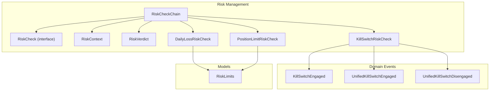

**Diagram sources**
- [RiskCheckChain.java](file://trading/execution/src/main/java/com/tradej/execution/risk/RiskCheckChain.java)
- [RiskCheck.java](file://trading/execution/src/main/java/com/tradej/execution/risk/RiskCheck.java)
- [RiskContext.java](file://trading/execution/src/main/java/com/tradej/execution/risk/RiskContext.java)
- [RiskVerdict.java](file://trading/execution/src/main/java/com/tradej/execution/risk/RiskVerdict.java)
- [KillSwitchRiskCheck.java](file://trading/execution/src/main/java/com/tradej/execution/risk/KillSwitchRiskCheck.java)
- [DailyLossRiskCheck.java](file://trading/execution/src/main/java/com/tradej/execution/risk/DailyLossRiskCheck.java)
- [PositionLimitRiskCheck.java](file://trading/execution/src/main/java/com/tradej/execution/risk/PositionLimitRiskCheck.java)
- [KillSwitchEngaged.java](file://core/src/main/java/com/tradej/core/domain/event/KillSwitchEngaged.java)
- [UnifiedKillSwitchEngaged.java](file://core/src/main/java/com/tradej/core/domain/event/UnifiedKillSwitchEngaged.java)
- [UnifiedKillSwitchDisengaged.java](file://core/src/main/java/com/tradej/core/domain/event/UnifiedKillSwitchDisengaged.java)
- [RiskLimits.java](file://core/src/main/java/com/tradej/core/domain/model/RiskLimits.java)

**Section sources**
- [RiskCheckChain.java](file://trading/execution/src/main/java/com/tradej/execution/risk/RiskCheckChain.java)
- [RiskCheck.java](file://trading/execution/src/main/java/com/tradej/execution/risk/RiskCheck.java)
- [RiskContext.java](file://trading/execution/src/main/java/com/tradej/execution/risk/RiskContext.java)
- [RiskVerdict.java](file://trading/execution/src/main/java/com/tradej/execution/risk/RiskVerdict.java)
- [KillSwitchRiskCheck.java](file://trading/execution/src/main/java/com/tradej/execution/risk/KillSwitchRiskCheck.java)
- [DailyLossRiskCheck.java](file://trading/execution/src/main/java/com/tradej/execution/risk/DailyLossRiskCheck.java)
- [PositionLimitRiskCheck.java](file://trading/execution/src/main/java/com/tradej/execution/risk/PositionLimitRiskCheck.java)
- [RiskLimits.java](file://core/src/main/java/com/tradej/core/domain/model/RiskLimits.java)

## Core Components
This section documents the foundational building blocks of the risk validation framework.

- RiskCheck interface: Defines the contract for a single risk validation unit. Implementations evaluate a RiskContext and return a RiskVerdict indicating approval or rejection with optional reasons and metadata.
- RiskCheckChain: Orchestrates evaluation of a list of RiskCheck instances in a fixed order. It short-circuits on the first rejection and aggregates verdicts for informational purposes.
- RiskContext: Encapsulates inputs and contextual state required for risk evaluation (e.g., order request, current positions, market data, timestamps).
- RiskVerdict: Represents the outcome of a risk check evaluation, including whether the check passed or failed, associated reason(s), and any additional data.

Key behaviors:
- Sequential evaluation: Checks are processed in insertion order.
- Early termination: Evaluation stops upon the first rejection.
- Aggregation: Verdicts from all executed checks are collected for audit and diagnostics.

**Section sources**
- [RiskCheck.java](file://trading/execution/src/main/java/com/tradej/execution/risk/RiskCheck.java)
- [RiskCheckChain.java](file://trading/execution/src/main/java/com/tradej/execution/risk/RiskCheckChain.java)
- [RiskContext.java](file://trading/execution/src/main/java/com/tradej/execution/risk/RiskContext.java)
- [RiskVerdict.java](file://trading/execution/src/main/java/com/tradej/execution/risk/RiskVerdict.java)

## Architecture Overview
The RiskCheckChain implements a chain of responsibility pattern to compose risk validations. Each RiskCheck evaluates the same RiskContext and produces a RiskVerdict. The chain maintains order and short-circuits on the first failure, ensuring efficient and deterministic risk enforcement.

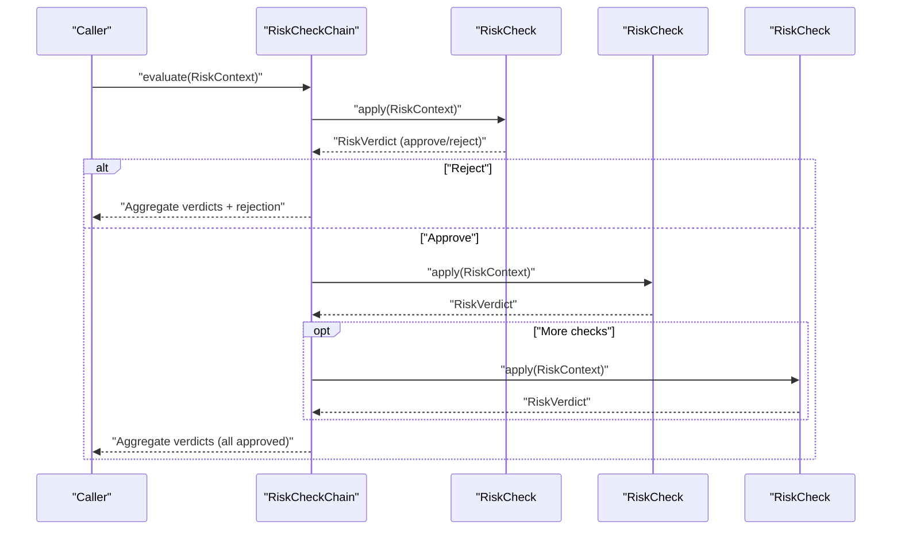

**Diagram sources**
- [RiskCheckChain.java](file://trading/execution/src/main/java/com/tradej/execution/risk/RiskCheckChain.java)
- [RiskCheck.java](file://trading/execution/src/main/java/com/tradej/execution/risk/RiskCheck.java)
- [RiskVerdict.java](file://trading/execution/src/main/java/com/tradej/execution/risk/RiskVerdict.java)

## Detailed Component Analysis

### RiskCheckChain Implementation
RiskCheckChain manages a list of RiskCheck instances and coordinates their evaluation against a shared RiskContext. It captures all verdicts and returns them alongside the final outcome. The chain supports ordered composition and early termination on rejection.

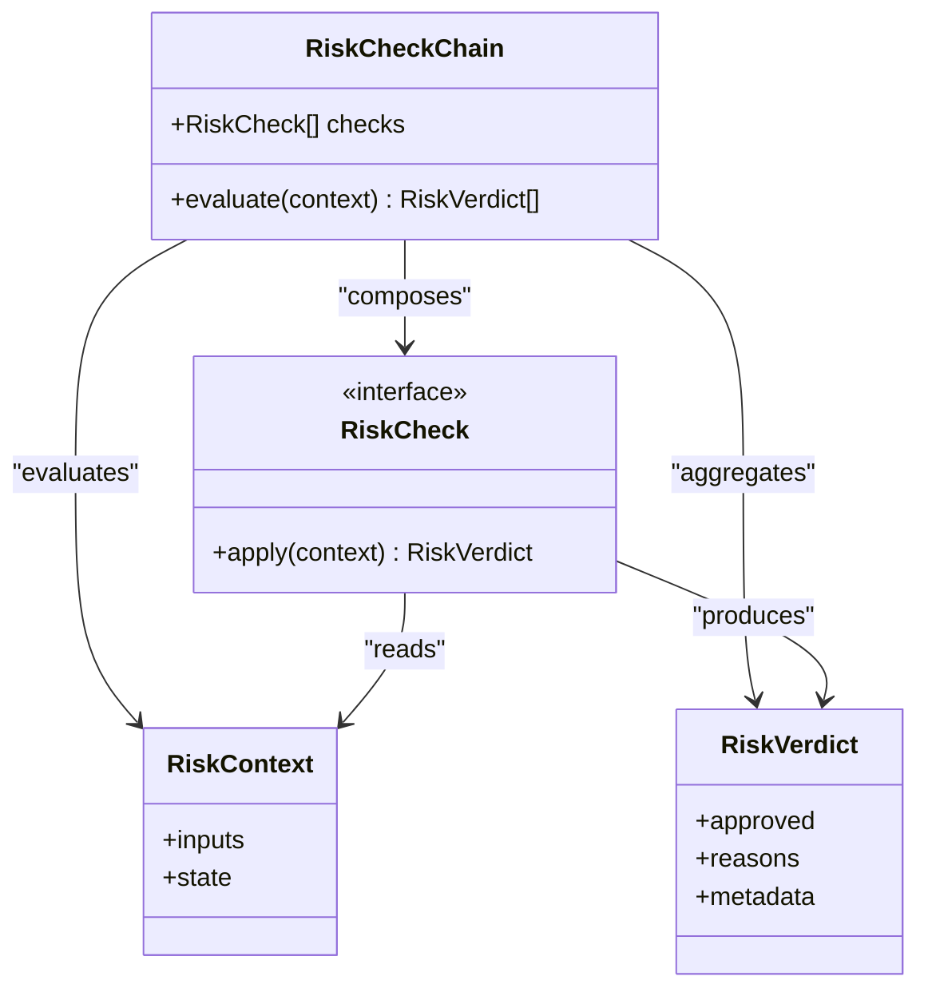

**Diagram sources**
- [RiskCheckChain.java](file://trading/execution/src/main/java/com/tradej/execution/risk/RiskCheckChain.java)
- [RiskCheck.java](file://trading/execution/src/main/java/com/tradej/execution/risk/RiskCheck.java)
- [RiskContext.java](file://trading/execution/src/main/java/com/tradej/execution/risk/RiskContext.java)
- [RiskVerdict.java](file://trading/execution/src/main/java/com/tradej/execution/risk/RiskVerdict.java)

**Section sources**
- [RiskCheckChain.java](file://trading/execution/src/main/java/com/tradej/execution/risk/RiskCheckChain.java)

### RiskCheck Interface Design
The RiskCheck interface defines a single method to apply a check against a RiskContext and produce a RiskVerdict. Implementations encapsulate specific risk logic and return appropriate verdicts.

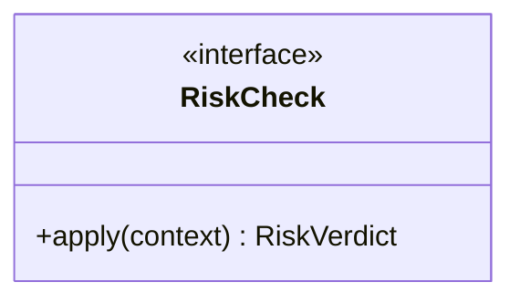

**Diagram sources**
- [RiskCheck.java](file://trading/execution/src/main/java/com/tradej/execution/risk/RiskCheck.java)

**Section sources**
- [RiskCheck.java](file://trading/execution/src/main/java/com/tradej/execution/risk/RiskCheck.java)

### RiskContext Creation
RiskContext carries all inputs and state required for risk evaluation. Typical fields include order request details, current portfolio positions, market data snapshots, and temporal context (e.g., session start time, current timestamp). Implementations populate this context before invoking RiskCheckChain.evaluate.

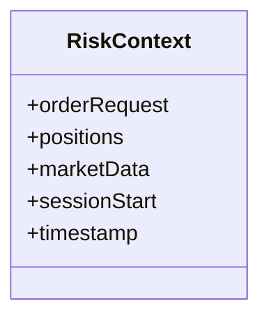

**Diagram sources**
- [RiskContext.java](file://trading/execution/src/main/java/com/tradej/execution/risk/RiskContext.java)

**Section sources**
- [RiskContext.java](file://trading/execution/src/main/java/com/tradej/execution/risk/RiskContext.java)

### RiskVerdict Generation
RiskVerdict communicates the result of a single risk check. It indicates whether the check approved or rejected the request, includes human-readable reasons, and optionally attaches structured metadata for downstream systems.

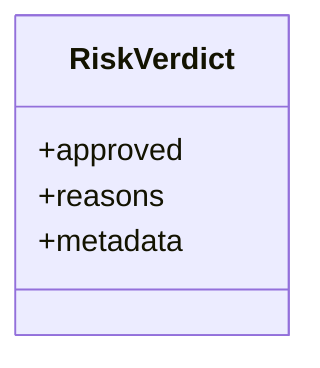

**Diagram sources**
- [RiskVerdict.java](file://trading/execution/src/main/java/com/tradej/execution/risk/RiskVerdict.java)

**Section sources**
- [RiskVerdict.java](file://trading/execution/src/main/java/com/tradej/execution/risk/RiskVerdict.java)

### KillSwitchRiskCheck
Purpose: Enforces emergency stop validation by checking kill switch activation signals. When engaged, all orders are rejected regardless of other checks.

Behavior:
- Reads kill switch state from domain events or unified kill switch signals
- Returns a rejection verdict if kill switch is active
- Short-circuits the chain to prevent further evaluation

Integration points:
- Domain events: KillSwitchEngaged, UnifiedKillSwitchEngaged, UnifiedKillSwitchDisengaged
- End-to-end tests validate kill switch behavior across brokers

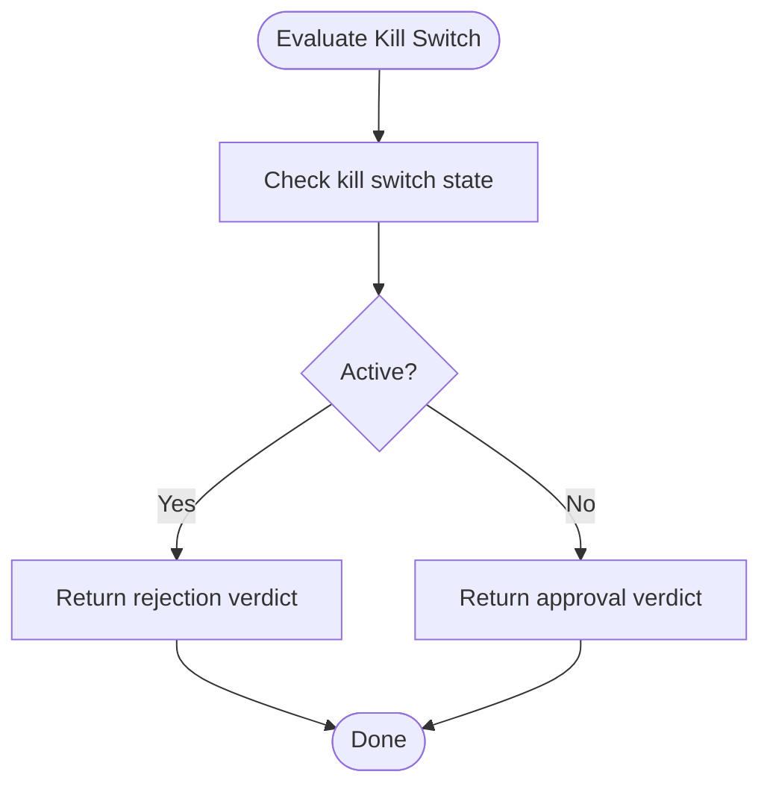

**Diagram sources**
- [KillSwitchRiskCheck.java](file://trading/execution/src/main/java/com/tradej/execution/risk/KillSwitchRiskCheck.java)
- [KillSwitchEngaged.java](file://core/src/main/java/com/tradej/core/domain/event/KillSwitchEngaged.java)
- [UnifiedKillSwitchEngaged.java](file://core/src/main/java/com/tradej/core/domain/event/UnifiedKillSwitchEngaged.java)
- [UnifiedKillSwitchDisengaged.java](file://core/src/main/java/com/tradej/core/domain/event/UnifiedKillSwitchDisengaged.java)

**Section sources**
- [KillSwitchRiskCheck.java](file://trading/execution/src/main/java/com/tradej/execution/risk/KillSwitchRiskCheck.java)
- [KillSwitchEngaged.java](file://core/src/main/java/com/tradej/core/domain/event/KillSwitchEngaged.java)
- [UnifiedKillSwitchEngaged.java](file://core/src/main/java/com/tradej/core/domain/event/UnifiedKillSwitchEngaged.java)
- [UnifiedKillSwitchDisengaged.java](file://core/src/main/java/com/tradej/core/domain/event/UnifiedKillSwitchDisengaged.java)
- [KillSwitchE2EComponentTest.java](file://app/src/test/java/com/tradej/app/integration/KillSwitchE2EComponentTest.java)
- [DhanKillSwitchIntegrationTest.java](file://app/src/test/java/com/tradej/app/integration/DhanKillSwitchIntegrationTest.java)

### DailyLossRiskCheck
Purpose: Enforces daily loss limits by computing realized and unrealized losses and comparing against configured thresholds.

Behavior:
- Computes total loss exposure over the current trading session
- Compares against RiskLimits.dailyLossCap
- Returns rejection if threshold exceeded

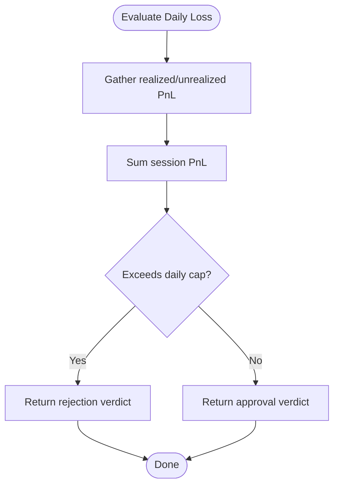

**Diagram sources**
- [DailyLossRiskCheck.java](file://trading/execution/src/main/java/com/tradej/execution/risk/DailyLossRiskCheck.java)
- [RiskLimits.java](file://core/src/main/java/com/tradej/core/domain/model/RiskLimits.java)

**Section sources**
- [DailyLossRiskCheck.java](file://trading/execution/src/main/java/com/tradej/execution/risk/DailyLossRiskCheck.java)
- [RiskLimits.java](file://core/src/main/java/com/tradej/core/domain/model/RiskLimits.java)

### PositionLimitRiskCheck
Purpose: Enforces position size limitations per instrument to prevent excessive concentration risk.

Behavior:
- Calculates current exposure and requested change
- Compares against RiskLimits.positionCaps
- Returns rejection if the resulting position exceeds configured limits

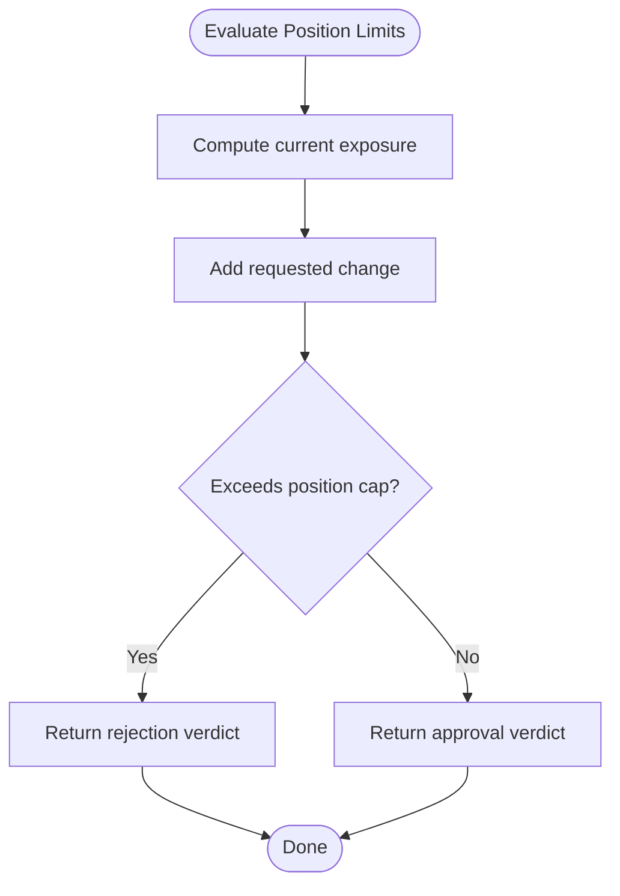

**Diagram sources**
- [PositionLimitRiskCheck.java](file://trading/execution/src/main/java/com/tradej/execution/risk/PositionLimitRiskCheck.java)
- [RiskLimits.java](file://core/src/main/java/com/tradej/core/domain/model/RiskLimits.java)

**Section sources**
- [PositionLimitRiskCheck.java](file://trading/execution/src/main/java/com/tradej/execution/risk/PositionLimitRiskCheck.java)
- [RiskLimits.java](file://core/src/main/java/com/tradej/core/domain/model/RiskLimits.java)

### RiskCheckChain Evaluation Flow
The chain evaluates checks in order, collecting verdicts and terminating early on rejection. This ensures minimal computation while guaranteeing that no rejected request proceeds further.

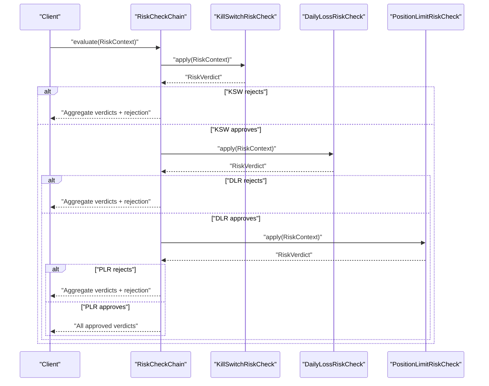

**Diagram sources**
- [RiskCheckChain.java](file://trading/execution/src/main/java/com/tradej/execution/risk/RiskCheckChain.java)
- [KillSwitchRiskCheck.java](file://trading/execution/src/main/java/com/tradej/execution/risk/KillSwitchRiskCheck.java)
- [DailyLossRiskCheck.java](file://trading/execution/src/main/java/com/tradej/execution/risk/DailyLossRiskCheck.java)
- [PositionLimitRiskCheck.java](file://trading/execution/src/main/java/com/tradej/execution/risk/PositionLimitRiskCheck.java)

**Section sources**
- [RiskCheckChain.java](file://trading/execution/src/main/java/com/tradej/execution/risk/RiskCheckChain.java)
- [RiskCheckChainTest.java](file://trading/execution/src/test/java/com/tradej/execution/risk/RiskCheckChainTest.java)

## Dependency Analysis
The risk checks depend on domain models and events for kill switch state and on RiskLimits for configurable thresholds. The chain composes checks and coordinates evaluation.

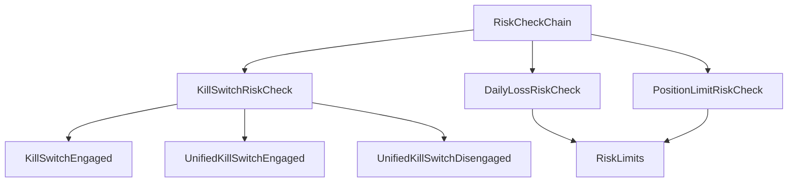

**Diagram sources**
- [RiskCheckChain.java](file://trading/execution/src/main/java/com/tradej/execution/risk/RiskCheckChain.java)
- [KillSwitchRiskCheck.java](file://trading/execution/src/main/java/com/tradej/execution/risk/KillSwitchRiskCheck.java)
- [DailyLossRiskCheck.java](file://trading/execution/src/main/java/com/tradej/execution/risk/DailyLossRiskCheck.java)
- [PositionLimitRiskCheck.java](file://trading/execution/src/main/java/com/tradej/execution/risk/PositionLimitRiskCheck.java)
- [KillSwitchEngaged.java](file://core/src/main/java/com/tradej/core/domain/event/KillSwitchEngaged.java)
- [UnifiedKillSwitchEngaged.java](file://core/src/main/java/com/tradej/core/domain/event/UnifiedKillSwitchEngaged.java)
- [UnifiedKillSwitchDisengaged.java](file://core/src/main/java/com/tradej/core/domain/event/UnifiedKillSwitchDisengaged.java)
- [RiskLimits.java](file://core/src/main/java/com/tradej/core/domain/model/RiskLimits.java)

**Section sources**
- [RiskCheckChain.java](file://trading/execution/src/main/java/com/tradej/execution/risk/RiskCheckChain.java)
- [RiskCheck.java](file://trading/execution/src/main/java/com/tradej/execution/risk/RiskCheck.java)
- [RiskContext.java](file://trading/execution/src/main/java/com/tradej/execution/risk/RiskContext.java)
- [RiskVerdict.java](file://trading/execution/src/main/java/com/tradej/execution/risk/RiskVerdict.java)
- [KillSwitchRiskCheck.java](file://trading/execution/src/main/java/com/tradej/execution/risk/KillSwitchRiskCheck.java)
- [DailyLossRiskCheck.java](file://trading/execution/src/main/java/com/tradej/execution/risk/DailyLossRiskCheck.java)
- [PositionLimitRiskCheck.java](file://trading/execution/src/main/java/com/tradej/execution/risk/PositionLimitRiskCheck.java)
- [RiskLimits.java](file://core/src/main/java/com/tradej/core/domain/model/RiskLimits.java)

## Performance Considerations
- Early termination: The chain short-circuits on the first rejection, minimizing unnecessary computations.
- Ordered composition: Place the most selective and fast checks first (e.g., kill switch) to reduce average latency.
- Minimal state: Keep RiskContext lean; avoid heavy computations inside checks to maintain low latency.
- Batch evaluation: When evaluating multiple orders, reuse shared state (e.g., market data snapshots) to avoid redundant fetches.

## Troubleshooting Guide
Common issues and resolutions:
- Unexpected rejections: Verify the order of checks and ensure earlier checks (e.g., kill switch) are not masking later failures. Use aggregated verdicts to diagnose.
- Kill switch false positives: Confirm kill switch event state and ensure disengage events are properly propagated.
- Daily loss cap exceeded: Review realized/unrealized PnL calculations and RiskLimits configuration.
- Position cap violations: Validate position aggregation logic and ensure RiskLimits.positionCaps are correctly set.

Diagnostic aids:
- Inspect aggregated verdicts returned by RiskCheckChain.evaluate to identify the failing check.
- Cross-check domain events for kill switch state transitions.
- Validate RiskLimits configuration in the active profile.

**Section sources**
- [RiskCheckChainTest.java](file://trading/execution/src/test/java/com/tradej/execution/risk/RiskCheckChainTest.java)
- [KillSwitchE2EComponentTest.java](file://app/src/test/java/com/tradej/app/integration/KillSwitchE2EComponentTest.java)
- [DhanKillSwitchIntegrationTest.java](file://app/src/test/java/com/tradej/app/integration/DhanKillSwitchIntegrationTest.java)

## Conclusion
The RiskCheckChain provides a flexible, composable framework for enforcing risk policies through a chain of responsibility. By structuring checks around a shared RiskContext and RiskVerdict, the system achieves predictable, efficient, and extensible risk enforcement. Built-in checks cover critical areas (emergency stop, daily loss caps, position limits), while the design supports easy addition of custom checks and dynamic configuration via RiskLimits.

## Appendices

### How to Implement a Custom Risk Check
Steps:
1. Implement the RiskCheck interface with a single apply method that reads from RiskContext and returns a RiskVerdict.
2. Integrate with domain models or services as needed (e.g., market data, portfolio state).
3. Add the check to the RiskCheckChain in the desired order.
4. Configure any required thresholds via RiskLimits or external configuration.
5. Write unit and integration tests to validate behavior under normal and edge conditions.

Reference paths:
- [RiskCheck.java](file://trading/execution/src/main/java/com/tradej/execution/risk/RiskCheck.java)
- [RiskContext.java](file://trading/execution/src/main/java/com/tradej/execution/risk/RiskContext.java)
- [RiskVerdict.java](file://trading/execution/src/main/java/com/tradej/execution/risk/RiskVerdict.java)
- [RiskCheckChain.java](file://trading/execution/src/main/java/com/tradej/execution/risk/RiskCheckChain.java)
- [RiskLimits.java](file://core/src/main/java/com/tradej/core/domain/model/RiskLimits.java)

### Adding a New Check to the Chain
- Instantiate your RiskCheck implementation.
- Insert it into the RiskCheckChain list at the intended position.
- Ensure ordering aligns with policy (e.g., safety checks before permissiveness).
- Re-run tests to confirm expected behavior.

**Section sources**
- [RiskCheckChain.java](file://trading/execution/src/main/java/com/tradej/execution/risk/RiskCheckChain.java)
- [RiskCheckChainTest.java](file://trading/execution/src/test/java/com/tradej/execution/risk/RiskCheckChainTest.java)

### Configuring Risk Check Priorities
- Use RiskLimits to centralize configurable thresholds for DailyLossRiskCheck and PositionLimitRiskCheck.
- Adjust the order of checks in RiskCheckChain to reflect policy hierarchy.
- Validate with end-to-end tests to ensure emergent behavior matches expectations.

**Section sources**
- [RiskLimits.java](file://core/src/main/java/com/tradej/core/domain/model/RiskLimits.java)
- [RiskCheckChain.java](file://trading/execution/src/main/java/com/tradej/execution/risk/RiskCheckChain.java)
- [KillSwitchE2EComponentTest.java](file://app/src/test/java/com/tradej/app/integration/KillSwitchE2EComponentTest.java)
- [DhanKillSwitchIntegrationTest.java](file://app/src/test/java/com/tradej/app/integration/DhanKillSwitchIntegrationTest.java)