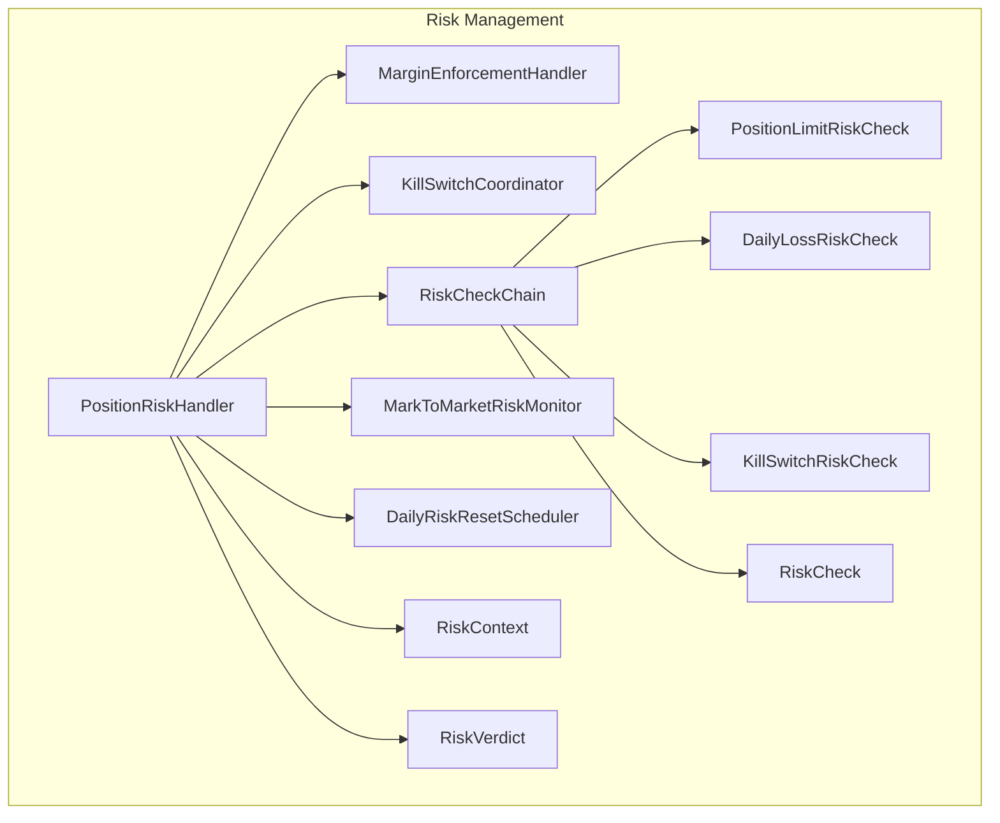
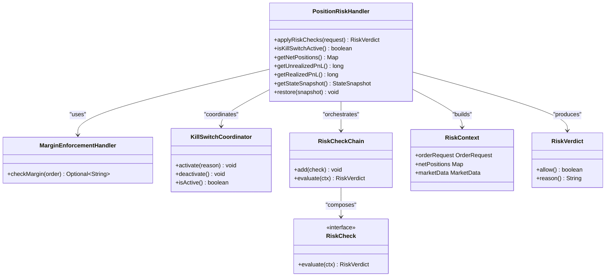
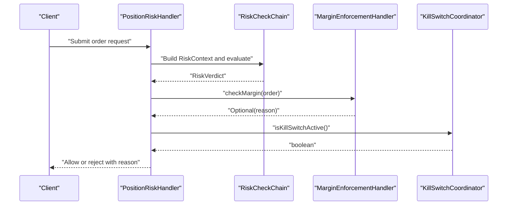
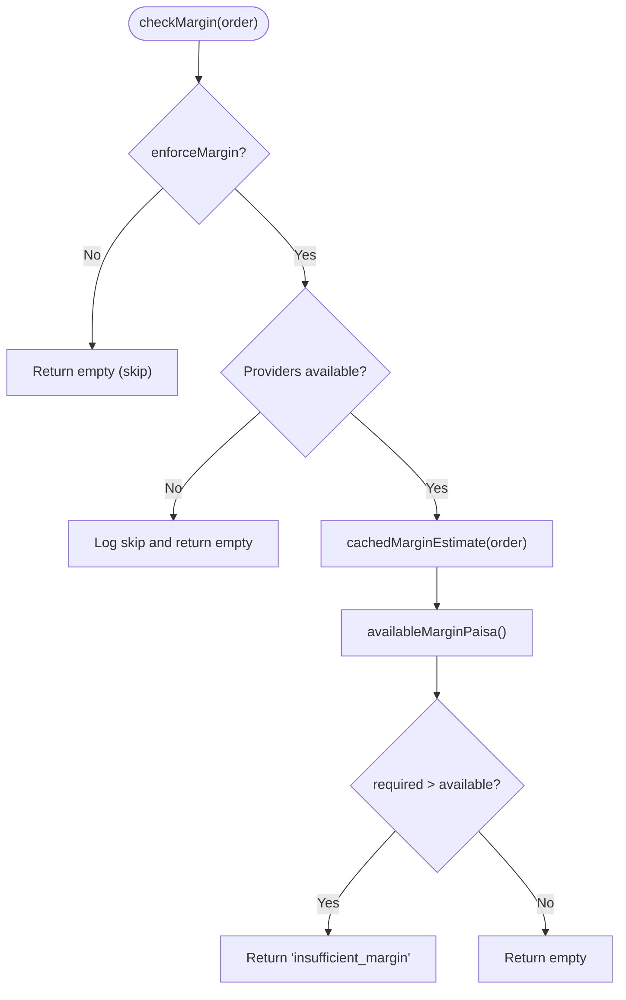
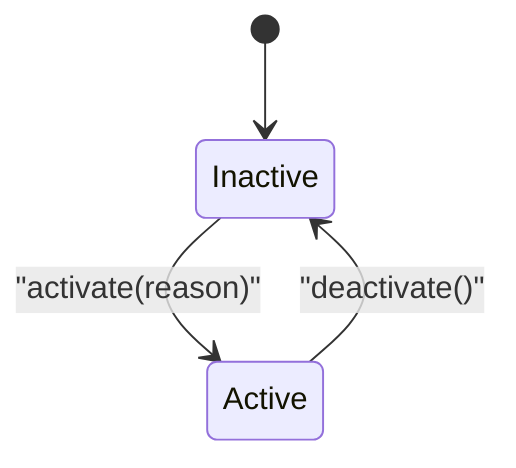
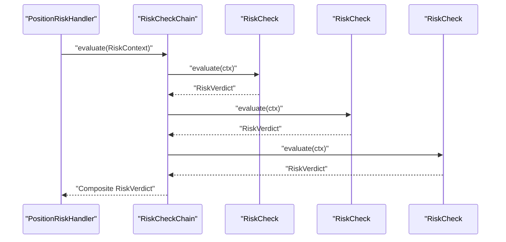
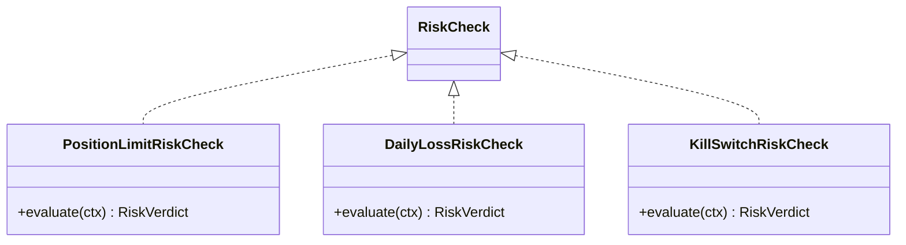
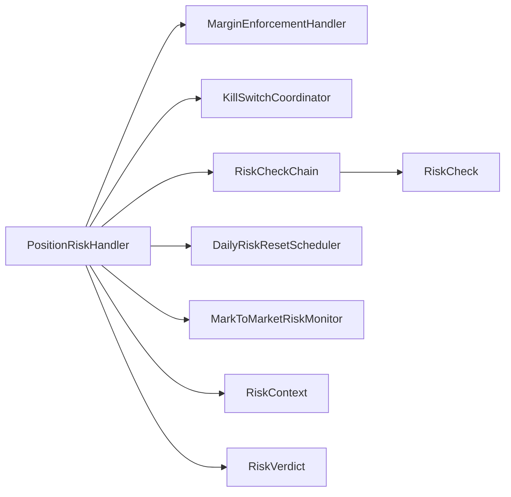

# Risk Management

<cite>
**Referenced Files in This Document**
- [PositionRiskHandler.java](file://trading/execution/src/main/java/com/tradej/execution/risk/PositionRiskHandler.java)
- [MarginEnforcementHandler.java](file://trading/execution/src/main/java/com/tradej/execution/risk/MarginEnforcementHandler.java)
- [KillSwitchCoordinator.java](file://trading/execution/src/main/java/com/tradej/execution/risk/KillSwitchCoordinator.java)
- [RiskCheckChain.java](file://trading/execution/src/main/java/com/tradej/execution/risk/RiskCheckChain.java)
- [DailyRiskResetScheduler.java](file://trading/execution/src/main/java/com/tradej/execution/risk/DailyRiskResetScheduler.java)
- [MarkToMarketRiskMonitor.java](file://trading/execution/src/main/java/com/tradej/execution/risk/MarkToMarketRiskMonitor.java)
- [PositionLimitRiskCheck.java](file://trading/execution/src/main/java/com/tradej/execution/risk/PositionLimitRiskCheck.java)
- [DailyLossRiskCheck.java](file://trading/execution/src/main/java/com/tradej/execution/risk/DailyLossRiskCheck.java)
- [KillSwitchRiskCheck.java](file://trading/execution/src/main/java/com/tradej/execution/risk/KillSwitchRiskCheck.java)
- [RiskContext.java](file://trading/execution/src/main/java/com/tradej/execution/risk/RiskContext.java)
- [RiskVerdict.java](file://trading/execution/src/main/java/com/tradej/execution/risk/RiskVerdict.java)
- [RiskCheck.java](file://trading/execution/src/main/java/com/tradej/execution/risk/RiskCheck.java)
- [PositionRiskHandlerComponentTest.java](file://app/src/test/java/com/tradej/app/integration/PositionRiskHandlerComponentTest.java)
- [MarginEnforcementComponentTest.java](file://app/src/test/java/com/tradej/app/integration/MarginEnforcementComponentTest.java)
- [PositionRiskHandlerStressTest.java](file://trading/execution/src/test/java/com/tradej/execution/risk/PositionRiskHandlerStressTest.java)
- [ARCHITECTURE_REVIEW_2026-06-06.md](file://docs/reports/ARCHITECTURE_REVIEW_2026-06-06.md)
</cite>

## Table of Contents
1. [Introduction](#introduction)
2. [Project Structure](#project-structure)
3. [Core Components](#core-components)
4. [Architecture Overview](#architecture-overview)
5. [Detailed Component Analysis](#detailed-component-analysis)
6. [Dependency Analysis](#dependency-analysis)
7. [Performance Considerations](#performance-considerations)
8. [Troubleshooting Guide](#troubleshooting-guide)
9. [Conclusion](#conclusion)
10. [Appendices](#appendices)

## Introduction
This document provides comprehensive documentation for the Risk Management subsystem. It explains the PositionRiskHandler implementation for position tracking, PnL calculation, and risk monitoring; the MarginEnforcementHandler for margin calculations and position sizing; the KillSwitchCoordinator for emergency stop mechanisms; and the RiskCheckChain architecture for sequential risk validation. It also covers position management, unrealized PnL tracking, realized profit calculation, risk limit enforcement, kill switch coordination, daily risk reset scheduling, and position limit checking. Finally, it includes examples of risk configuration, custom risk checks, and risk monitoring dashboards.

## Project Structure
The Risk Management subsystem resides in the trading/execution module under the risk package. It consists of:
- Core handlers: PositionRiskHandler, MarginEnforcementHandler, KillSwitchCoordinator
- Chain orchestration: RiskCheckChain
- Supporting utilities: DailyRiskResetScheduler, MarkToMarketRiskMonitor
- Risk checks: PositionLimitRiskCheck, DailyLossRiskCheck, KillSwitchRiskCheck
- Contracts: RiskContext, RiskVerdict, RiskCheck

**Diagram sources**
- [PositionRiskHandler.java](file://trading/execution/src/main/java/com/tradej/execution/risk/PositionRiskHandler.java)
- [MarginEnforcementHandler.java](file://trading/execution/src/main/java/com/tradej/execution/risk/MarginEnforcementHandler.java)
- [KillSwitchCoordinator.java](file://trading/execution/src/main/java/com/tradej/execution/risk/KillSwitchCoordinator.java)
- [RiskCheckChain.java](file://trading/execution/src/main/java/com/tradej/execution/risk/RiskCheckChain.java)
- [DailyRiskResetScheduler.java](file://trading/execution/src/main/java/com/tradej/execution/risk/DailyRiskResetScheduler.java)
- [MarkToMarketRiskMonitor.java](file://trading/execution/src/main/java/com/tradej/execution/risk/MarkToMarketRiskMonitor.java)
- [PositionLimitRiskCheck.java](file://trading/execution/src/main/java/com/tradej/execution/risk/PositionLimitRiskCheck.java)
- [DailyLossRiskCheck.java](file://trading/execution/src/main/java/com/tradej/execution/risk/DailyLossRiskCheck.java)
- [KillSwitchRiskCheck.java](file://trading/execution/src/main/java/com/tradej/execution/risk/KillSwitchRiskCheck.java)
- [RiskContext.java](file://trading/execution/src/main/java/com/tradej/execution/risk/RiskContext.java)
- [RiskVerdict.java](file://trading/execution/src/main/java/com/tradej/execution/risk/RiskVerdict.java)
- [RiskCheck.java](file://trading/execution/src/main/java/com/tradej/execution/risk/RiskCheck.java)

**Section sources**
- [PositionRiskHandler.java](file://trading/execution/src/main/java/com/tradej/execution/risk/PositionRiskHandler.java)
- [MarginEnforcementHandler.java](file://trading/execution/src/main/java/com/tradej/execution/risk/MarginEnforcementHandler.java)
- [KillSwitchCoordinator.java](file://trading/execution/src/main/java/com/tradej/execution/risk/KillSwitchCoordinator.java)
- [RiskCheckChain.java](file://trading/execution/src/main/java/com/tradej/execution/risk/RiskCheckChain.java)
- [DailyRiskResetScheduler.java](file://trading/execution/src/main/java/com/tradej/execution/risk/DailyRiskResetScheduler.java)
- [MarkToMarketRiskMonitor.java](file://trading/execution/src/main/java/com/tradej/execution/risk/MarkToMarketRiskMonitor.java)
- [PositionLimitRiskCheck.java](file://trading/execution/src/main/java/com/tradej/execution/risk/PositionLimitRiskCheck.java)
- [DailyLossRiskCheck.java](file://trading/execution/src/main/java/com/tradej/execution/risk/DailyLossRiskCheck.java)
- [KillSwitchRiskCheck.java](file://trading/execution/src/main/java/com/tradej/execution/risk/KillSwitchRiskCheck.java)
- [RiskContext.java](file://trading/execution/src/main/java/com/tradej/execution/risk/RiskContext.java)
- [RiskVerdict.java](file://trading/execution/src/main/java/com/tradej/execution/risk/RiskVerdict.java)
- [RiskCheck.java](file://trading/execution/src/main/java/com/tradej/execution/risk/RiskCheck.java)

## Core Components
- PositionRiskHandler: Central orchestrator for position tracking, PnL computation, and risk monitoring. Manages net positions, unrealized and realized PnL, and integrates with margin enforcement and kill switch coordination.
- MarginEnforcementHandler: Validates margin availability before order placement, computes required margin, and enforces position sizing constraints.
- KillSwitchCoordinator: Coordinates emergency stop mechanisms across the system, enabling immediate risk control during severe market conditions.
- RiskCheckChain: Sequential risk validation framework that composes multiple risk checks (position limits, daily loss limits, kill switches) and aggregates decisions.
- DailyRiskResetScheduler: Schedules daily risk reset operations to enforce intraday risk limits and maintain system stability.
- MarkToMarketRiskMonitor: Monitors mark-to-market valuation updates and triggers risk recalculations when pricing changes occur.

**Section sources**
- [PositionRiskHandler.java](file://trading/execution/src/main/java/com/tradej/execution/risk/PositionRiskHandler.java)
- [MarginEnforcementHandler.java](file://trading/execution/src/main/java/com/tradej/execution/risk/MarginEnforcementHandler.java)
- [KillSwitchCoordinator.java](file://trading/execution/src/main/java/com/tradej/execution/risk/KillSwitchCoordinator.java)
- [RiskCheckChain.java](file://trading/execution/src/main/java/com/tradej/execution/risk/RiskCheckChain.java)
- [DailyRiskResetScheduler.java](file://trading/execution/src/main/java/com/tradej/execution/risk/DailyRiskResetScheduler.java)
- [MarkToMarketRiskMonitor.java](file://trading/execution/src/main/java/com/tradej/execution/risk/MarkToMarketRiskMonitor.java)

## Architecture Overview
The Risk Management subsystem follows a layered architecture:
- Handlers: PositionRiskHandler, MarginEnforcementHandler, KillSwitchCoordinator
- Chain Orchestration: RiskCheckChain composes risk checks
- Utilities: DailyRiskResetScheduler, MarkToMarketRiskMonitor
- Contracts: RiskContext, RiskVerdict, RiskCheck define the interface for risk evaluation

**Diagram sources**
- [PositionRiskHandler.java](file://trading/execution/src/main/java/com/tradej/execution/risk/PositionRiskHandler.java)
- [MarginEnforcementHandler.java](file://trading/execution/src/main/java/com/tradej/execution/risk/MarginEnforcementHandler.java)
- [KillSwitchCoordinator.java](file://trading/execution/src/main/java/com/tradej/execution/risk/KillSwitchCoordinator.java)
- [RiskCheckChain.java](file://trading/execution/src/main/java/com/tradej/execution/risk/RiskCheckChain.java)
- [RiskContext.java](file://trading/execution/src/main/java/com/tradej/execution/risk/RiskContext.java)
- [RiskVerdict.java](file://trading/execution/src/main/java/com/tradej/execution/risk/RiskVerdict.java)
- [RiskCheck.java](file://trading/execution/src/main/java/com/tradej/execution/risk/RiskCheck.java)

## Detailed Component Analysis

### PositionRiskHandler
Responsibilities:
- Track net positions per symbol and compute unrealized and realized PnL
- Enforce position limits and session constraints
- Integrate with margin enforcement and kill switch coordination
- Manage state snapshots for kill-switch resets

Key behaviors:
- Position tracking: Maintains net positions and updates them on trades
- PnL calculation: Computes unrealized PnL using mark-to-market and realized PnL from closed trades
- Risk monitoring: Aggregates risk verdicts from composed checks and coordinates with margin enforcement and kill switches

**Diagram sources**
- [PositionRiskHandler.java](file://trading/execution/src/main/java/com/tradej/execution/risk/PositionRiskHandler.java)
- [RiskCheckChain.java](file://trading/execution/src/main/java/com/tradej/execution/risk/RiskCheckChain.java)
- [MarginEnforcementHandler.java](file://trading/execution/src/main/java/com/tradej/execution/risk/MarginEnforcementHandler.java)
- [KillSwitchCoordinator.java](file://trading/execution/src/main/java/com/tradej/execution/risk/KillSwitchCoordinator.java)

**Section sources**
- [PositionRiskHandler.java](file://trading/execution/src/main/java/com/tradej/execution/risk/PositionRiskHandler.java)
- [PositionRiskHandlerComponentTest.java](file://app/src/test/java/com/tradej/app/integration/PositionRiskHandlerComponentTest.java)
- [PositionRiskHandlerStressTest.java](file://trading/execution/src/test/java/com/tradej/execution/risk/PositionRiskHandlerStressTest.java)
- [ARCHITECTURE_REVIEW_2026-06-06.md](file://docs/reports/ARCHITECTURE_REVIEW_2026-06-06.md)

### MarginEnforcementHandler
Responsibilities:
- Calculate required margin for an order
- Compare against available margin
- Return rejection reasons for insufficient margin or failures

Key behaviors:
- Margin estimation: Uses cached estimates to avoid repeated heavy computations
- Availability check: Retrieves available margin from portfolio provider
- Decision logic: Rejects when required margin exceeds available margin or when providers are unavailable

**Diagram sources**
- [MarginEnforcementHandler.java](file://trading/execution/src/main/java/com/tradej/execution/risk/MarginEnforcementHandler.java)

**Section sources**
- [MarginEnforcementHandler.java](file://trading/execution/src/main/java/com/tradej/execution/risk/MarginEnforcementHandler.java)
- [MarginEnforcementComponentTest.java](file://app/src/test/java/com/tradej/app/integration/MarginEnforcementComponentTest.java)

### KillSwitchCoordinator
Responsibilities:
- Coordinate emergency stop mechanisms
- Activate and deactivate kill switches across the system
- Provide centralized kill switch status

Key behaviors:
- Activation: Triggers emergency stop procedures
- Deactivation: Resets kill switch state
- Status reporting: Indicates whether kill switch is active

**Diagram sources**
- [KillSwitchCoordinator.java](file://trading/execution/src/main/java/com/tradej/execution/risk/KillSwitchCoordinator.java)

**Section sources**
- [KillSwitchCoordinator.java](file://trading/execution/src/main/java/com/tradej/execution/risk/KillSwitchCoordinator.java)

### RiskCheckChain
Responsibilities:
- Compose multiple risk checks into a single evaluation pipeline
- Evaluate checks in sequence and aggregate results
- Provide unified risk verdict

Key behaviors:
- Composition: Adds risk checks to the chain
- Evaluation: Iterates through checks and produces a composite verdict
- Integration: Works with RiskContext and RiskVerdict

**Diagram sources**
- [RiskCheckChain.java](file://trading/execution/src/main/java/com/tradej/execution/risk/RiskCheckChain.java)
- [RiskCheck.java](file://trading/execution/src/main/java/com/tradej/execution/risk/RiskCheck.java)
- [RiskVerdict.java](file://trading/execution/src/main/java/com/tradej/execution/risk/RiskVerdict.java)

**Section sources**
- [RiskCheckChain.java](file://trading/execution/src/main/java/com/tradej/execution/risk/RiskCheckChain.java)
- [RiskCheck.java](file://trading/execution/src/main/java/com/tradej/execution/risk/RiskCheck.java)
- [RiskVerdict.java](file://trading/execution/src/main/java/com/tradej/execution/risk/RiskVerdict.java)

### Supporting Risk Checks
- PositionLimitRiskCheck: Enforces maximum open position quantities and counts
- DailyLossRiskCheck: Enforces intraday loss limits
- KillSwitchRiskCheck: Integrates kill switch activation into the chain

**Diagram sources**
- [PositionLimitRiskCheck.java](file://trading/execution/src/main/java/com/tradej/execution/risk/PositionLimitRiskCheck.java)
- [DailyLossRiskCheck.java](file://trading/execution/src/main/java/com/tradej/execution/risk/DailyLossRiskCheck.java)
- [KillSwitchRiskCheck.java](file://trading/execution/src/main/java/com/tradej/execution/risk/KillSwitchRiskCheck.java)
- [RiskCheck.java](file://trading/execution/src/main/java/com/tradej/execution/risk/RiskCheck.java)

**Section sources**
- [PositionLimitRiskCheck.java](file://trading/execution/src/main/java/com/tradej/execution/risk/PositionLimitRiskCheck.java)
- [DailyLossRiskCheck.java](file://trading/execution/src/main/java/com/tradej/execution/risk/DailyLossRiskCheck.java)
- [KillSwitchRiskCheck.java](file://trading/execution/src/main/java/com/tradej/execution/risk/KillSwitchRiskCheck.java)

### Daily Risk Reset Scheduler
Responsibilities:
- Schedule daily risk reset operations
- Enforce intraday risk limits and maintain system stability

Key behaviors:
- Scheduling: Periodically triggers risk reset routines
- Coordination: Works with PositionRiskHandler to reset daily counters

**Section sources**
- [DailyRiskResetScheduler.java](file://trading/execution/src/main/java/com/tradej/execution/risk/DailyRiskResetScheduler.java)

### Mark-to-Market Risk Monitor
Responsibilities:
- Monitor mark-to-market valuation updates
- Trigger risk recalculations when pricing changes occur

Key behaviors:
- Monitoring: Observes market data updates
- Recalculation: Invokes risk recalculation on significant price movements

**Section sources**
- [MarkToMarketRiskMonitor.java](file://trading/execution/src/main/java/com/tradej/execution/risk/MarkToMarketRiskMonitor.java)

## Dependency Analysis
The Risk Management subsystem exhibits clear separation of concerns:
- PositionRiskHandler depends on MarginEnforcementHandler, KillSwitchCoordinator, RiskCheckChain, and supporting utilities
- RiskCheckChain depends on RiskCheck interface and composes concrete checks
- DailyRiskResetScheduler and MarkToMarketRiskMonitor provide auxiliary services

**Diagram sources**
- [PositionRiskHandler.java](file://trading/execution/src/main/java/com/tradej/execution/risk/PositionRiskHandler.java)
- [MarginEnforcementHandler.java](file://trading/execution/src/main/java/com/tradej/execution/risk/MarginEnforcementHandler.java)
- [KillSwitchCoordinator.java](file://trading/execution/src/main/java/com/tradej/execution/risk/KillSwitchCoordinator.java)
- [RiskCheckChain.java](file://trading/execution/src/main/java/com/tradej/execution/risk/RiskCheckChain.java)
- [RiskCheck.java](file://trading/execution/src/main/java/com/tradej/execution/risk/RiskCheck.java)
- [DailyRiskResetScheduler.java](file://trading/execution/src/main/java/com/tradej/execution/risk/DailyRiskResetScheduler.java)
- [MarkToMarketRiskMonitor.java](file://trading/execution/src/main/java/com/tradej/execution/risk/MarkToMarketRiskMonitor.java)
- [RiskContext.java](file://trading/execution/src/main/java/com/tradej/execution/risk/RiskContext.java)
- [RiskVerdict.java](file://trading/execution/src/main/java/com/tradej/execution/risk/RiskVerdict.java)

**Section sources**
- [PositionRiskHandler.java](file://trading/execution/src/main/java/com/tradej/execution/risk/PositionRiskHandler.java)
- [RiskCheckChain.java](file://trading/execution/src/main/java/com/tradej/execution/risk/RiskCheckChain.java)
- [RiskCheck.java](file://trading/execution/src/main/java/com/tradej/execution/risk/RiskCheck.java)

## Performance Considerations
- Margin caching: MarginEnforcementHandler caches margin estimates to reduce computational overhead
- Atomic operations: PositionRiskHandler uses concurrent structures for counters to ensure thread safety under stress
- Snapshot consistency: Ensure state snapshots include net positions to preserve position state after kill-switch resets
- Session policy enforcement: Validate market session policies to prevent regulatory violations during pre-open/post-close periods

[No sources needed since this section provides general guidance]

## Troubleshooting Guide
Common issues and resolutions:
- Insufficient margin rejections: Verify margin provider availability and estimate accuracy
- Kill switch false positives: Confirm kill switch activation criteria and deactivation procedures
- Position state loss after reset: Ensure state snapshots include net positions for restoration
- Stale mark-to-market: Investigate MarkToMarketRiskMonitor updates and recalculation triggers

**Section sources**
- [MarginEnforcementHandler.java](file://trading/execution/src/main/java/com/tradej/execution/risk/MarginEnforcementHandler.java)
- [KillSwitchCoordinator.java](file://trading/execution/src/main/java/com/tradej/execution/risk/KillSwitchCoordinator.java)
- [PositionRiskHandler.java](file://trading/execution/src/main/java/com/tradej/execution/risk/PositionRiskHandler.java)
- [MarkToMarketRiskMonitor.java](file://trading/execution/src/main/java/com/tradej/execution/risk/MarkToMarketRiskMonitor.java)
- [ARCHITECTURE_REVIEW_2026-06-06.md](file://docs/reports/ARCHITECTURE_REVIEW_2026-06-06.md)

## Conclusion
The Risk Management subsystem provides a robust, modular framework for position tracking, margin enforcement, kill switch coordination, and sequential risk validation. Its design emphasizes composability, concurrency safety, and operational resilience, enabling effective risk control across diverse market conditions.

[No sources needed since this section summarizes without analyzing specific files]

## Appendices

### Risk Configuration Examples
- Application configuration for risk limits and enforcement settings
- Example: max-open-positions and related position quantity thresholds
- Example: margin enforcement enablement and cache durations

**Section sources**
- [ARCHITECTURE_REVIEW_2026-06-06.md](file://docs/reports/ARCHITECTURE_REVIEW_2026-06-06.md)

### Custom Risk Checks
- Implement RiskCheck interface to create domain-specific validations
- Add custom checks to RiskCheckChain for sequential evaluation
- Example: Volatility-based position sizing or correlation risk controls

**Section sources**
- [RiskCheck.java](file://trading/execution/src/main/java/com/tradej/execution/risk/RiskCheck.java)
- [RiskCheckChain.java](file://trading/execution/src/main/java/com/tradej/execution/risk/RiskCheckChain.java)

### Risk Monitoring Dashboards
- Track unrealized and realized PnL, open positions, and kill switch status
- Visualize daily loss exposure and margin utilization trends
- Alert on margin breaches and kill switch activations

[No sources needed since this section provides general guidance]