# Trading Engine

<cite>
**Referenced Files in This Document**
- [OrderStateMachine.java](file://core/src/main/java/com/tradej/core/domain/oms/OrderStateMachine.java)
- [OrderEvent.java](file://core/src/main/java/com/tradej/core/domain/oms/OrderEvent.java)
- [OrderProjection.java](file://core/src/main/java/com/tradej/core/domain/oms/OrderProjection.java)
- [LifecycleState.java](file://core/src/main/java/com/tradej/core/domain/oms/LifecycleState.java)
- [OrderManagementService.java](file://trading/execution/src/main/java/com/tradej/execution/service/OrderManagementService.java)
- [ExecutionHandler.java](file://trading/execution/src/main/java/com/tradej/execution/service/ExecutionHandler.java)
- [TradingCircuitBreaker.java](file://trading/execution/src/main/java/com/tradej/execution/service/TradingCircuitBreaker.java)
- [MarginEnforcementHandler.java](file://trading/execution/src/main/java/com/tradej/execution/risk/MarginEnforcementHandler.java)
- [KillSwitchCoordinator.java](file://trading/execution/src/main/java/com/tradej/execution/risk/KillSwitchCoordinator.java)
- [MarkToMarketRiskMonitor.java](file://trading/execution/src/main/java/com/tradej/execution/risk/MarkToMarketRiskMonitor.java)
- [PositionRiskHandler.java](file://trading/execution/src/main/java/com/tradej/execution/risk/PositionRiskHandler.java)
- [RiskCheckChain.java](file://trading/execution/src/main/java/com/tradej/execution/risk/RiskCheckChain.java)
- [OrderIdentityRegistry.java](file://trading/execution/src/main/java/com/tradej/execution/identity/OrderIdentityRegistry.java)
- [OrderIdentityRehydrator.java](file://trading/execution/src/main/java/com/tradej/execution/identity/OrderIdentityRehydrator.java)
- [OrderEventJournal.java](file://trading/execution/src/main/java/com/tradej/execution/journal/OrderEventJournal.java)
- [OrderReconciler.java](file://trading/execution/src/main/java/com/tradej/execution/reconcile/OrderReconciler.java)
- [TickReconciler.java](file://trading/execution/src/main/java/com/tradej/execution/reconcile/TickReconciler.java)
- [LivePnlService.java](file://trading/execution/src/main/java/com/tradej/execution/marketdata/LivePnlService.java)
- [OmsNode.java](file://trading/execution/src/main/java/com/tradej/execution/node/OmsNode.java)
- [RiskNode.java](file://trading/execution/src/main/java/com/tradej/execution/node/RiskNode.java)
- [IBrokerConnection.java](file://broker/api/src/main/java/com/tradej/broker/api/IBrokerConnection.java)
- [DhanBrokerConnection.java](file://broker/dhan/src/main/java/com/tradej/broker/dhan/DhanBrokerConnection.java)
- [IciciBrokerConnection.java](file://broker/icici/src/main/java/com/tradej/broker/icici/IciciBrokerConnection.java)
- [UpstoxBrokerConnection.java](file://broker/upstox/src/main/java/com/tradej/broker/upstox/UpstoxBrokerConnection.java)
- [SubscriptionCoordinator.java](file://trading/execution/src/main/java/com/tradej/execution/subscription/SubscriptionCoordinator.java)
- [SubscriptionManager.java](file://trading/execution/src/main/java/com/tradej/execution/subscription/SubscriptionManager.java)
- [MarketDepthOrchestrator.java](file://trading/execution/src/main/java/com/tradej/execution/marketdata/MarketDepthOrchestrator.java)
- [SignalExecutionBridge.java](file://trading/execution/src/main/java/com/tradej/execution/bridge/SignalExecutionBridge.java)
- [OrderFullyFilled.java](file://core/src/main/java/com/tradej/core/domain/event/OrderFullyFilled.java)
- [OrderPartiallyFilled.java](file://core/src/main/java/com/tradej/core/domain/event/OrderPartiallyFilled.java)
- [OrderCancelled.java](file://core/src/main/java/com/tradej/core/domain/event/OrderCancelled.java)
- [OrderRejected.java](file://core/src/main/java/com/tradej/core/domain/event/OrderRejected.java)
- [OrderAccepted.java](file://core/src/main/java/com/tradej/core/domain/event/OrderAccepted.java)
- [OrderModified.java](file://core/src/main/java/com/tradej/core/domain/event/OrderModified.java)
- [OrderExpired.java](file://core/src/main/java/com/tradej/core/domain/event/OrderExpired.java)
- [OrderSubmitted.java](file://core/src/main/java/com/tradej/core/domain/event/OrderSubmitted.java)
- [EventSourcedOrderRepository.java](file://data/persistence/src/main/java/com/tradej/persistence/oms/EventSourcedOrderRepository.java)
- [EventSourcedNetPositionProvider.java](file://trading/execution/src/main/java/com/tradej/execution/position/EventSourcedNetPositionProvider.java)
</cite>

## Table of Contents
1. [Introduction](#introduction)
2. [Project Structure](#project-structure)
3. [Core Components](#core-components)
4. [Architecture Overview](#architecture-overview)
5. [Detailed Component Analysis](#detailed-component-analysis)
6. [Dependency Analysis](#dependency-analysis)
7. [Performance Considerations](#performance-considerations)
8. [Troubleshooting Guide](#troubleshooting-guide)
9. [Conclusion](#conclusion)
10. [Appendices](#appendices)

## Introduction
This document describes the trading engine subsystem with emphasis on order management, execution, risk controls, and position tracking. It explains the order lifecycle, state transitions, identity management, execution handling, and reconciliation. It also documents integration with broker adapters and real-time market data processing, along with practical examples for placing, modifying, canceling orders, and monitoring risk.

## Project Structure
The trading engine spans several modules:
- core: Domain models, events, and order lifecycle state machine
- trading/execution: Execution handlers, risk checks, identity registry, reconcilers, and market data services
- broker: Broker adapters (Dhan, ICICI, Upstox) and connection abstractions
- data/persistence: Event-sourced repositories for orders and positions
- pipeline and gateway: Orchestrators for streaming and routing

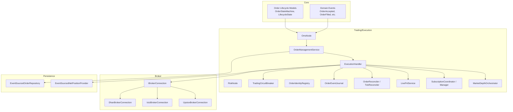

**Diagram sources**
- [OrderStateMachine.java](file://core/src/main/java/com/tradej/core/domain/oms/OrderStateMachine.java)
- [OmsNode.java](file://trading/execution/src/main/java/com/tradej/execution/node/OmsNode.java)
- [RiskNode.java](file://trading/execution/src/main/java/com/tradej/execution/node/RiskNode.java)
- [OrderManagementService.java](file://trading/execution/src/main/java/com/tradej/execution/service/OrderManagementService.java)
- [ExecutionHandler.java](file://trading/execution/src/main/java/com/tradej/execution/service/ExecutionHandler.java)
- [TradingCircuitBreaker.java](file://trading/execution/src/main/java/com/tradej/execution/service/TradingCircuitBreaker.java)
- [OrderIdentityRegistry.java](file://trading/execution/src/main/java/com/tradej/execution/identity/OrderIdentityRegistry.java)
- [OrderEventJournal.java](file://trading/execution/src/main/java/com/tradej/execution/journal/OrderEventJournal.java)
- [OrderReconciler.java](file://trading/execution/src/main/java/com/tradej/execution/reconcile/OrderReconciler.java)
- [TickReconciler.java](file://trading/execution/src/main/java/com/tradej/execution/reconcile/TickReconciler.java)
- [LivePnlService.java](file://trading/execution/src/main/java/com/tradej/execution/marketdata/LivePnlService.java)
- [SubscriptionCoordinator.java](file://trading/execution/src/main/java/com/tradej/execution/subscription/SubscriptionCoordinator.java)
- [MarketDepthOrchestrator.java](file://trading/execution/src/main/java/com/tradej/execution/marketdata/MarketDepthOrchestrator.java)
- [IBrokerConnection.java](file://broker/api/src/main/java/com/tradej/broker/api/IBrokerConnection.java)
- [DhanBrokerConnection.java](file://broker/dhan/src/main/java/com/tradej/broker/dhan/DhanBrokerConnection.java)
- [IciciBrokerConnection.java](file://broker/icici/src/main/java/com/tradej/broker/icici/IciciBrokerConnection.java)
- [UpstoxBrokerConnection.java](file://broker/upstox/src/main/java/com/tradej/broker/upstox/UpstoxBrokerConnection.java)
- [EventSourcedOrderRepository.java](file://data/persistence/src/main/java/com/tradej/persistence/oms/EventSourcedOrderRepository.java)
- [EventSourcedNetPositionProvider.java](file://trading/execution/src/main/java/com/tradej/execution/position/EventSourcedNetPositionProvider.java)

**Section sources**
- [OrderStateMachine.java](file://core/src/main/java/com/tradej/core/domain/oms/OrderStateMachine.java)
- [OrderManagementService.java](file://trading/execution/src/main/java/com/tradej/execution/service/OrderManagementService.java)
- [ExecutionHandler.java](file://trading/execution/src/main/java/com/tradej/execution/service/ExecutionHandler.java)
- [TradingCircuitBreaker.java](file://trading/execution/src/main/java/com/tradej/execution/service/TradingCircuitBreaker.java)
- [OrderIdentityRegistry.java](file://trading/execution/src/main/java/com/tradej/execution/identity/OrderIdentityRegistry.java)
- [OrderEventJournal.java](file://trading/execution/src/main/java/com/tradej/execution/journal/OrderEventJournal.java)
- [OrderReconciler.java](file://trading/execution/src/main/java/com/tradej/execution/reconcile/OrderReconciler.java)
- [TickReconciler.java](file://trading/execution/src/main/java/com/tradej/execution/reconcile/TickReconciler.java)
- [LivePnlService.java](file://trading/execution/src/main/java/com/tradej/execution/marketdata/LivePnlService.java)
- [SubscriptionCoordinator.java](file://trading/execution/src/main/java/com/tradej/execution/subscription/SubscriptionCoordinator.java)
- [MarketDepthOrchestrator.java](file://trading/execution/src/main/java/com/tradej/execution/marketdata/MarketDepthOrchestrator.java)
- [IBrokerConnection.java](file://broker/api/src/main/java/com/tradej/broker/api/IBrokerConnection.java)
- [DhanBrokerConnection.java](file://broker/dhan/src/main/java/com/tradej/broker/dhan/DhanBrokerConnection.java)
- [IciciBrokerConnection.java](file://broker/icici/src/main/java/com/tradej/broker/icici/IciciBrokerConnection.java)
- [UpstoxBrokerConnection.java](file://broker/upstox/src/main/java/com/tradej/broker/upstox/UpstoxBrokerConnection.java)
- [EventSourcedOrderRepository.java](file://data/persistence/src/main/java/com/tradej/persistence/oms/EventSourcedOrderRepository.java)
- [EventSourcedNetPositionProvider.java](file://trading/execution/src/main/java/com/tradej/execution/position/EventSourcedNetPositionProvider.java)

## Core Components
- Order lifecycle and state machine: Defines order states, events, and transitions.
- Order management service: Orchestrates order creation, modification, cancellation, and persistence.
- Execution handler: Routes orders to brokers, applies circuit breakers, emits events, and updates positions.
- Risk management: Enforces margins, monitors mark-to-market, enforces position limits, and coordinates kill switches.
- Identity management: Generates and rehydrates order identifiers for idempotency and recovery.
- Reconciliation: Ensures order and trade parity against broker feeds and internal state.
- Market data services: Live PnL, market depth orchestration, and subscription management.
- Broker adapters: Pluggable connections for Dhan, ICICI, Upstox.

**Section sources**
- [OrderStateMachine.java](file://core/src/main/java/com/tradej/core/domain/oms/OrderStateMachine.java)
- [OrderManagementService.java](file://trading/execution/src/main/java/com/tradej/execution/service/OrderManagementService.java)
- [ExecutionHandler.java](file://trading/execution/src/main/java/com/tradej/execution/service/ExecutionHandler.java)
- [MarginEnforcementHandler.java](file://trading/execution/src/main/java/com/tradej/execution/risk/MarginEnforcementHandler.java)
- [KillSwitchCoordinator.java](file://trading/execution/src/main/java/com/tradej/execution/risk/KillSwitchCoordinator.java)
- [MarkToMarketRiskMonitor.java](file://trading/execution/src/main/java/com/tradej/execution/risk/MarkToMarketRiskMonitor.java)
- [PositionRiskHandler.java](file://trading/execution/src/main/java/com/tradej/execution/risk/PositionRiskHandler.java)
- [RiskCheckChain.java](file://trading/execution/src/main/java/com/tradej/execution/risk/RiskCheckChain.java)
- [OrderIdentityRegistry.java](file://trading/execution/src/main/java/com/tradej/execution/identity/OrderIdentityRegistry.java)
- [OrderIdentityRehydrator.java](file://trading/execution/src/main/java/com/tradej/execution/identity/OrderIdentityRehydrator.java)
- [OrderEventJournal.java](file://trading/execution/src/main/java/com/tradej/execution/journal/OrderEventJournal.java)
- [OrderReconciler.java](file://trading/execution/src/main/java/com/tradej/execution/reconcile/OrderReconciler.java)
- [TickReconciler.java](file://trading/execution/src/main/java/com/tradej/execution/reconcile/TickReconciler.java)
- [LivePnlService.java](file://trading/execution/src/main/java/com/tradej/execution/marketdata/LivePnlService.java)
- [SubscriptionCoordinator.java](file://trading/execution/src/main/java/com/tradej/execution/subscription/SubscriptionCoordinator.java)
- [SubscriptionManager.java](file://trading/execution/src/main/java/com/tradej/execution/subscription/SubscriptionManager.java)
- [MarketDepthOrchestrator.java](file://trading/execution/src/main/java/com/tradej/execution/marketdata/MarketDepthOrchestrator.java)
- [IBrokerConnection.java](file://broker/api/src/main/java/com/tradej/broker/api/IBrokerConnection.java)
- [DhanBrokerConnection.java](file://broker/dhan/src/main/java/com/tradej/broker/dhan/DhanBrokerConnection.java)
- [IciciBrokerConnection.java](file://broker/icici/src/main/java/com/tradej/broker/icici/IciciBrokerConnection.java)
- [UpstoxBrokerConnection.java](file://broker/upstox/src/main/java/com/tradej/broker/upstox/UpstoxBrokerConnection.java)

## Architecture Overview
The trading engine follows a reactive, event-driven design:
- Signals enter via SignalExecutionBridge and are transformed into trading commands.
- OmsNode validates and projects order state changes.
- RiskNode evaluates risk pre-execution.
- OrderManagementService persists and publishes domain events.
- ExecutionHandler applies TradingCircuitBreaker, routes to broker via IBrokerConnection, and updates live PnL and positions.
- Reconcilers compare internal state with broker feeds to maintain parity.
- MarketDepthOrchestrator and SubscriptionManager manage real-time market data subscriptions.

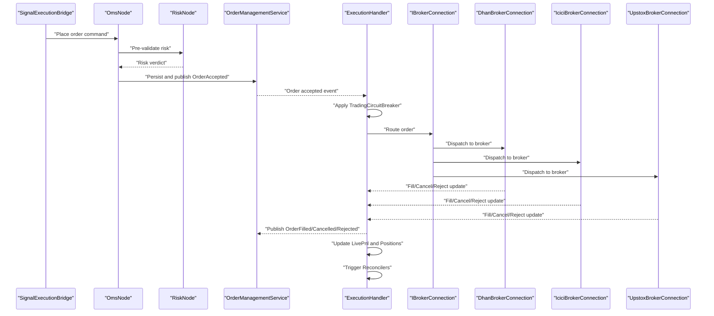

**Diagram sources**
- [SignalExecutionBridge.java](file://trading/execution/src/main/java/com/tradej/execution/bridge/SignalExecutionBridge.java)
- [OmsNode.java](file://trading/execution/src/main/java/com/tradej/execution/node/OmsNode.java)
- [RiskNode.java](file://trading/execution/src/main/java/com/tradej/execution/node/RiskNode.java)
- [OrderManagementService.java](file://trading/execution/src/main/java/com/tradej/execution/service/OrderManagementService.java)
- [ExecutionHandler.java](file://trading/execution/src/main/java/com/tradej/execution/service/ExecutionHandler.java)
- [TradingCircuitBreaker.java](file://trading/execution/src/main/java/com/tradej/execution/service/TradingCircuitBreaker.java)
- [IBrokerConnection.java](file://broker/api/src/main/java/com/tradej/broker/api/IBrokerConnection.java)
- [DhanBrokerConnection.java](file://broker/dhan/src/main/java/com/tradej/broker/dhan/DhanBrokerConnection.java)
- [IciciBrokerConnection.java](file://broker/icici/src/main/java/com/tradej/broker/icici/IciciBrokerConnection.java)
- [UpstoxBrokerConnection.java](file://broker/upstox/src/main/java/com/tradej/broker/upstox/UpstoxBrokerConnection.java)

## Detailed Component Analysis

### Order Lifecycle Management and State Transitions
The order lifecycle is modeled with explicit states and events. The state machine defines valid transitions and guards, while the projection maintains the current order state.

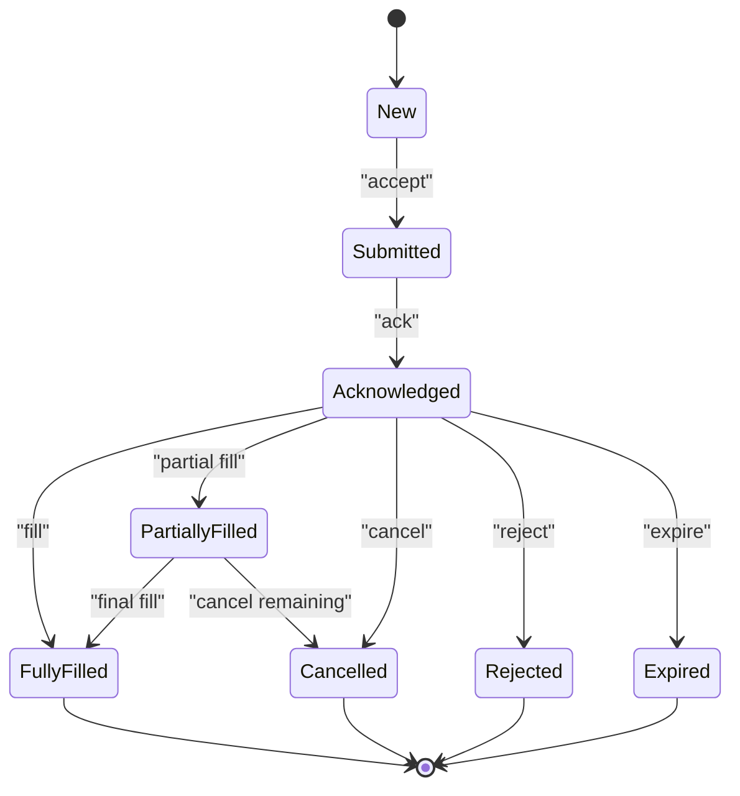

Key events include acceptance, partial fills, full fills, cancellations, modifications, and rejections. The projection encapsulates the current state and supports queries for downstream systems.

**Section sources**
- [OrderStateMachine.java](file://core/src/main/java/com/tradej/core/domain/oms/OrderStateMachine.java)
- [OrderEvent.java](file://core/src/main/java/com/tradej/core/domain/oms/OrderEvent.java)
- [OrderProjection.java](file://core/src/main/java/com/tradej/core/domain/oms/OrderProjection.java)
- [LifecycleState.java](file://core/src/main/java/com/tradej/core/domain/oms/LifecycleState.java)
- [OrderAccepted.java](file://core/src/main/java/com/tradej/core/domain/event/OrderAccepted.java)
- [OrderPartiallyFilled.java](file://core/src/main/java/com/tradej/core/domain/event/OrderPartiallyFilled.java)
- [OrderFullyFilled.java](file://core/src/main/java/com/tradej/core/domain/event/OrderFullyFilled.java)
- [OrderCancelled.java](file://core/src/main/java/com/tradej/core/domain/event/OrderCancelled.java)
- [OrderRejected.java](file://core/src/main/java/com/tradej/core/domain/event/OrderRejected.java)
- [OrderModified.java](file://core/src/main/java/com/tradej/core/domain/event/OrderModified.java)
- [OrderExpired.java](file://core/src/main/java/com/tradej/core/domain/event/OrderExpired.java)
- [OrderSubmitted.java](file://core/src/main/java/com/tradej/core/domain/event/OrderSubmitted.java)

### Order Identity Management
Order identity ensures idempotent processing and recovery across restarts. The registry generates canonical identifiers, while the rehydrator reconstructs identities from persisted state.

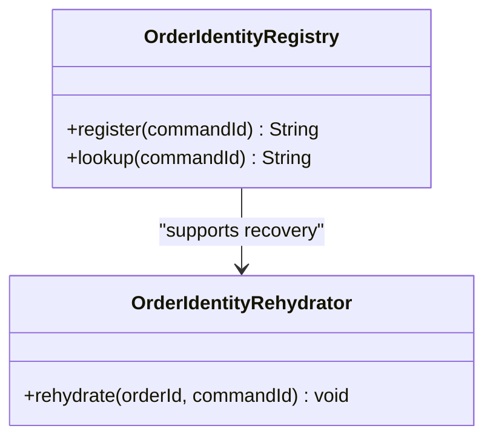

**Diagram sources**
- [OrderIdentityRegistry.java](file://trading/execution/src/main/java/com/tradej/execution/identity/OrderIdentityRegistry.java)
- [OrderIdentityRehydrator.java](file://trading/execution/src/main/java/com/tradej/execution/identity/OrderIdentityRehydrator.java)

**Section sources**
- [OrderIdentityRegistry.java](file://trading/execution/src/main/java/com/tradej/execution/identity/OrderIdentityRegistry.java)
- [OrderIdentityRehydrator.java](file://trading/execution/src/main/java/com/tradej/execution/identity/OrderIdentityRehydrator.java)

### Execution Engine and Circuit Breakers
The execution handler coordinates order routing, applies circuit breaker controls, and emits domain events. It integrates with broker adapters via a common interface and updates live PnL and positions.

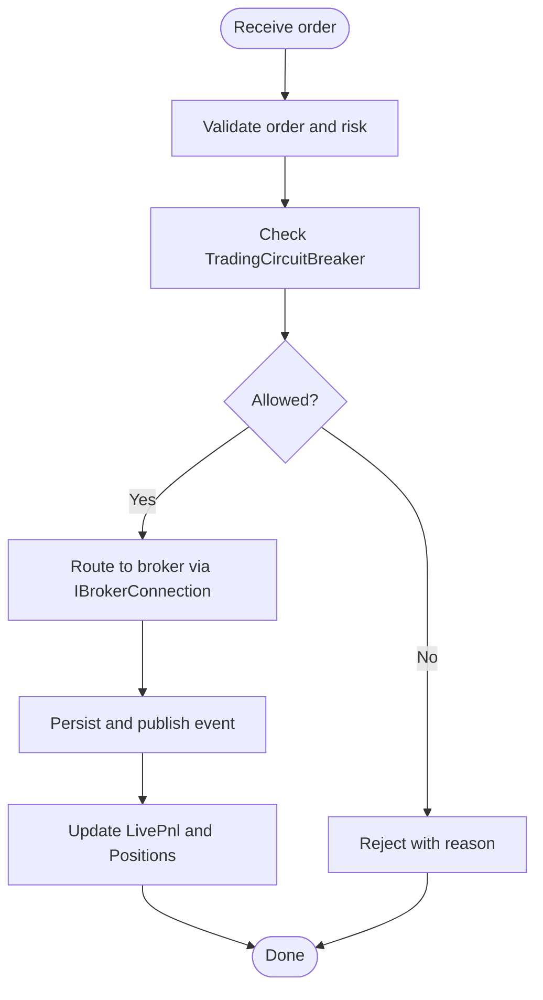

**Diagram sources**
- [ExecutionHandler.java](file://trading/execution/src/main/java/com/tradej/execution/service/ExecutionHandler.java)
- [TradingCircuitBreaker.java](file://trading/execution/src/main/java/com/tradej/execution/service/TradingCircuitBreaker.java)
- [IBrokerConnection.java](file://broker/api/src/main/java/com/tradej/broker/api/IBrokerConnection.java)

**Section sources**
- [ExecutionHandler.java](file://trading/execution/src/main/java/com/tradej/execution/service/ExecutionHandler.java)
- [TradingCircuitBreaker.java](file://trading/execution/src/main/java/com/tradej/execution/service/TradingCircuitBreaker.java)
- [IBrokerConnection.java](file://broker/api/src/main/java/com/tradej/broker/api/IBrokerConnection.java)

### Risk Management and Margin Enforcement
Risk checks are chained and evaluated before execution. They include position limits, daily loss thresholds, mark-to-market monitoring, and kill switch coordination.

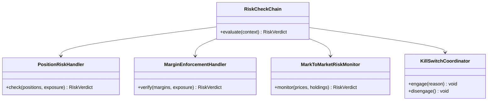

**Diagram sources**
- [RiskCheckChain.java](file://trading/execution/src/main/java/com/tradej/execution/risk/RiskCheckChain.java)
- [PositionRiskHandler.java](file://trading/execution/src/main/java/com/tradej/execution/risk/PositionRiskHandler.java)
- [MarginEnforcementHandler.java](file://trading/execution/src/main/java/com/tradej/execution/risk/MarginEnforcementHandler.java)
- [MarkToMarketRiskMonitor.java](file://trading/execution/src/main/java/com/tradej/execution/risk/MarkToMarketRiskMonitor.java)
- [KillSwitchCoordinator.java](file://trading/execution/src/main/java/com/tradej/execution/risk/KillSwitchCoordinator.java)

**Section sources**
- [RiskCheckChain.java](file://trading/execution/src/main/java/com/tradej/execution/risk/RiskCheckChain.java)
- [PositionRiskHandler.java](file://trading/execution/src/main/java/com/tradej/execution/risk/PositionRiskHandler.java)
- [MarginEnforcementHandler.java](file://trading/execution/src/main/java/com/tradej/execution/risk/MarginEnforcementHandler.java)
- [MarkToMarketRiskMonitor.java](file://trading/execution/src/main/java/com/tradej/execution/risk/MarkToMarketRiskMonitor.java)
- [KillSwitchCoordinator.java](file://trading/execution/src/main/java/com/tradej/execution/risk/KillSwitchCoordinator.java)

### Position Tracking and Live PnL
Positions are maintained via event-sourced projections. Live PnL is continuously updated from market data and trade events.

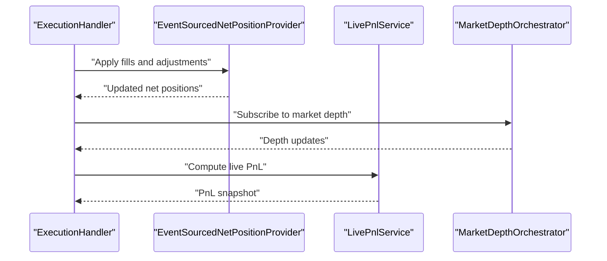

**Diagram sources**
- [EventSourcedNetPositionProvider.java](file://trading/execution/src/main/java/com/tradej/execution/position/EventSourcedNetPositionProvider.java)
- [LivePnlService.java](file://trading/execution/src/main/java/com/tradej/execution/marketdata/LivePnlService.java)
- [MarketDepthOrchestrator.java](file://trading/execution/src/main/java/com/tradej/execution/marketdata/MarketDepthOrchestrator.java)

**Section sources**
- [EventSourcedNetPositionProvider.java](file://trading/execution/src/main/java/com/tradej/execution/position/EventSourcedNetPositionProvider.java)
- [LivePnlService.java](file://trading/execution/src/main/java/com/tradej/execution/marketdata/LivePnlService.java)
- [MarketDepthOrchestrator.java](file://trading/execution/src/main/java/com/tradej/execution/marketdata/MarketDepthOrchestrator.java)

### Trade Reconciliation
Reconciliation compares internal order and trade state with broker feeds to detect discrepancies and trigger alerts or corrective actions.

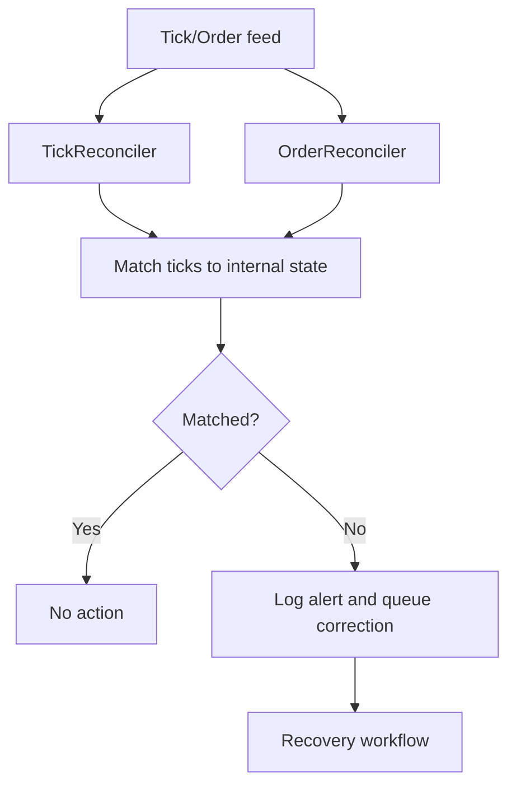

**Diagram sources**
- [TickReconciler.java](file://trading/execution/src/main/java/com/tradej/execution/reconcile/TickReconciler.java)
- [OrderReconciler.java](file://trading/execution/src/main/java/com/tradej/execution/reconcile/OrderReconciler.java)

**Section sources**
- [TickReconciler.java](file://trading/execution/src/main/java/com/tradej/execution/reconcile/TickReconciler.java)
- [OrderReconciler.java](file://trading/execution/src/main/java/com/tradej/execution/reconcile/OrderReconciler.java)

### Broker Adapter Integration
Broker adapters implement a common connection interface and expose capabilities for authentication, routing, and resilience. The system supports multiple providers (Dhan, ICICI, Upstox).

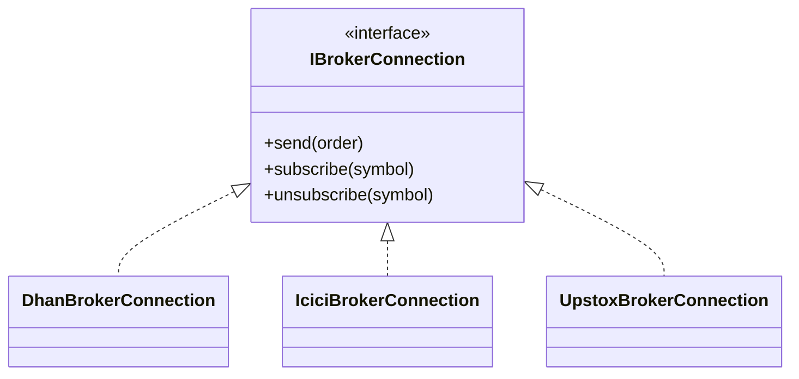

**Diagram sources**
- [IBrokerConnection.java](file://broker/api/src/main/java/com/tradej/broker/api/IBrokerConnection.java)
- [DhanBrokerConnection.java](file://broker/dhan/src/main/java/com/tradej/broker/dhan/DhanBrokerConnection.java)
- [IciciBrokerConnection.java](file://broker/icici/src/main/java/com/tradej/broker/icici/IciciBrokerConnection.java)
- [UpstoxBrokerConnection.java](file://broker/upstox/src/main/java/com/tradej/broker/upstox/UpstoxBrokerConnection.java)

**Section sources**
- [IBrokerConnection.java](file://broker/api/src/main/java/com/tradej/broker/api/IBrokerConnection.java)
- [DhanBrokerConnection.java](file://broker/dhan/src/main/java/com/tradej/broker/dhan/DhanBrokerConnection.java)
- [IciciBrokerConnection.java](file://broker/icici/src/main/java/com/tradej/broker/icici/IciciBrokerConnection.java)
- [UpstoxBrokerConnection.java](file://broker/upstox/src/main/java/com/tradej/broker/upstox/UpstoxBrokerConnection.java)

### Real-Time Market Data Processing
Market depth orchestration aggregates and normalizes feeds from multiple sources. Subscription managers handle dynamic subscription lifecycles and recovery.

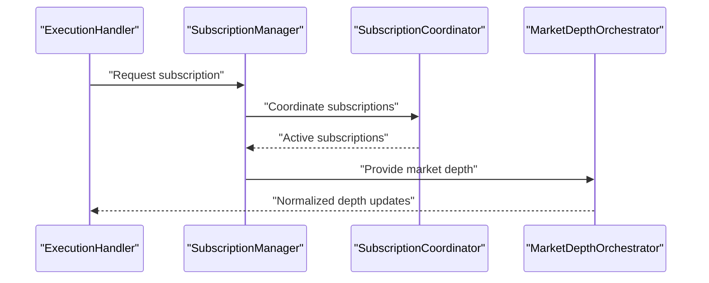

**Diagram sources**
- [SubscriptionManager.java](file://trading/execution/src/main/java/com/tradej/execution/subscription/SubscriptionManager.java)
- [SubscriptionCoordinator.java](file://trading/execution/src/main/java/com/tradej/execution/subscription/SubscriptionCoordinator.java)
- [MarketDepthOrchestrator.java](file://trading/execution/src/main/java/com/tradej/execution/marketdata/MarketDepthOrchestrator.java)

**Section sources**
- [SubscriptionManager.java](file://trading/execution/src/main/java/com/tradej/execution/subscription/SubscriptionManager.java)
- [SubscriptionCoordinator.java](file://trading/execution/src/main/java/com/tradej/execution/subscription/SubscriptionCoordinator.java)
- [MarketDepthOrchestrator.java](file://trading/execution/src/main/java/com/tradej/execution/marketdata/MarketDepthOrchestrator.java)

## Dependency Analysis
The trading engine exhibits strong cohesion within functional domains and loose coupling via interfaces and events.

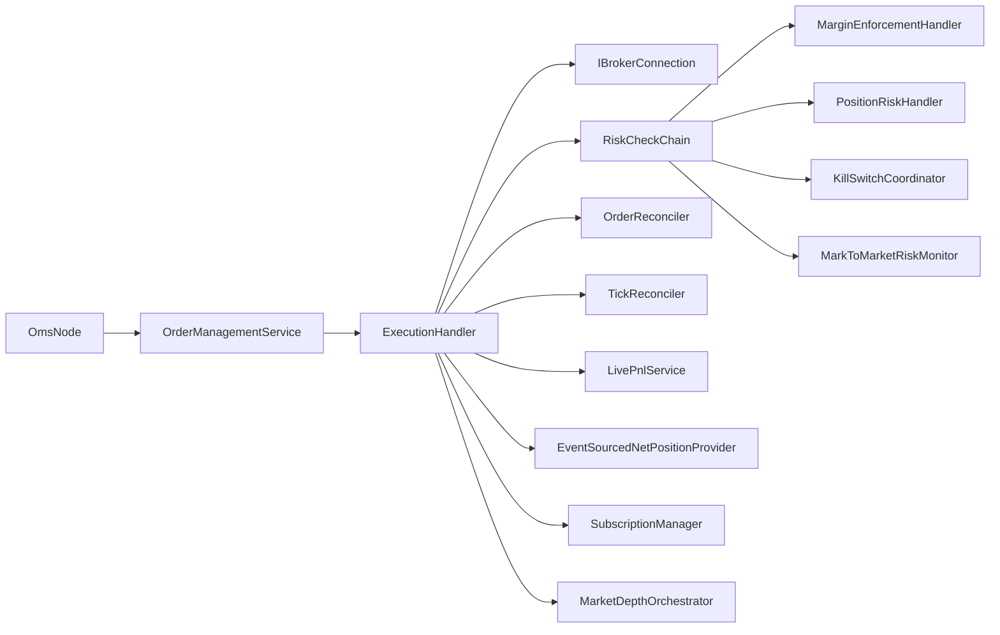

**Diagram sources**
- [OmsNode.java](file://trading/execution/src/main/java/com/tradej/execution/node/OmsNode.java)
- [OrderManagementService.java](file://trading/execution/src/main/java/com/tradej/execution/service/OrderManagementService.java)
- [ExecutionHandler.java](file://trading/execution/src/main/java/com/tradej/execution/service/ExecutionHandler.java)
- [IBrokerConnection.java](file://broker/api/src/main/java/com/tradej/broker/api/IBrokerConnection.java)
- [RiskCheckChain.java](file://trading/execution/src/main/java/com/tradej/execution/risk/RiskCheckChain.java)
- [MarginEnforcementHandler.java](file://trading/execution/src/main/java/com/tradej/execution/risk/MarginEnforcementHandler.java)
- [PositionRiskHandler.java](file://trading/execution/src/main/java/com/tradej/execution/risk/PositionRiskHandler.java)
- [KillSwitchCoordinator.java](file://trading/execution/src/main/java/com/tradej/execution/risk/KillSwitchCoordinator.java)
- [MarkToMarketRiskMonitor.java](file://trading/execution/src/main/java/com/tradej/execution/risk/MarkToMarketRiskMonitor.java)
- [OrderReconciler.java](file://trading/execution/src/main/java/com/tradej/execution/reconcile/OrderReconciler.java)
- [TickReconciler.java](file://trading/execution/src/main/java/com/tradej/execution/reconcile/TickReconciler.java)
- [LivePnlService.java](file://trading/execution/src/main/java/com/tradej/execution/marketdata/LivePnlService.java)
- [EventSourcedNetPositionProvider.java](file://trading/execution/src/main/java/com/tradej/execution/position/EventSourcedNetPositionProvider.java)
- [SubscriptionManager.java](file://trading/execution/src/main/java/com/tradej/execution/subscription/SubscriptionManager.java)
- [MarketDepthOrchestrator.java](file://trading/execution/src/main/java/com/tradej/execution/marketdata/MarketDepthOrchestrator.java)

**Section sources**
- [OrderManagementService.java](file://trading/execution/src/main/java/com/tradej/execution/service/OrderManagementService.java)
- [ExecutionHandler.java](file://trading/execution/src/main/java/com/tradej/execution/service/ExecutionHandler.java)
- [RiskCheckChain.java](file://trading/execution/src/main/java/com/tradej/execution/risk/RiskCheckChain.java)
- [MarginEnforcementHandler.java](file://trading/execution/src/main/java/com/tradej/execution/risk/MarginEnforcementHandler.java)
- [PositionRiskHandler.java](file://trading/execution/src/main/java/com/tradej/execution/risk/PositionRiskHandler.java)
- [KillSwitchCoordinator.java](file://trading/execution/src/main/java/com/tradej/execution/risk/KillSwitchCoordinator.java)
- [MarkToMarketRiskMonitor.java](file://trading/execution/src/main/java/com/tradej/execution/risk/MarkToMarketRiskMonitor.java)
- [OrderReconciler.java](file://trading/execution/src/main/java/com/tradej/execution/reconcile/OrderReconciler.java)
- [TickReconciler.java](file://trading/execution/src/main/java/com/tradej/execution/reconcile/TickReconciler.java)
- [LivePnlService.java](file://trading/execution/src/main/java/com/tradej/execution/marketdata/LivePnlService.java)
- [EventSourcedNetPositionProvider.java](file://trading/execution/src/main/java/com/tradej/execution/position/EventSourcedNetPositionProvider.java)
- [SubscriptionManager.java](file://trading/execution/src/main/java/com/tradej/execution/subscription/SubscriptionManager.java)
- [MarketDepthOrchestrator.java](file://trading/execution/src/main/java/com/tradej/execution/marketdata/MarketDepthOrchestrator.java)

## Performance Considerations
- Event sourcing and immutable projections enable efficient reconciliation and audit trails.
- Circuit breakers prevent cascading failures during volatile market conditions.
- Idempotent identity management reduces duplicate processing overhead.
- Reactive market data orchestration minimizes latency and maximizes throughput.
- Partitioning execution handlers and risk checks improves scalability under load.

## Troubleshooting Guide
Common issues and diagnostics:
- Order stuck in transitional state: Verify order journal entries and state machine transitions.
- Reconciliation mismatches: Inspect tick and order reconcilers for missing or duplicate updates.
- Risk violations: Review risk check chain evaluation and kill switch engagement logs.
- Broker connectivity: Confirm subscription manager and coordinator states; validate broker adapter health.
- Live PnL drift: Cross-check market depth normalization and position updates.

**Section sources**
- [OrderEventJournal.java](file://trading/execution/src/main/java/com/tradej/execution/journal/OrderEventJournal.java)
- [OrderReconciler.java](file://trading/execution/src/main/java/com/tradej/execution/reconcile/OrderReconciler.java)
- [TickReconciler.java](file://trading/execution/src/main/java/com/tradej/execution/reconcile/TickReconciler.java)
- [RiskCheckChain.java](file://trading/execution/src/main/java/com/tradej/execution/risk/RiskCheckChain.java)
- [KillSwitchCoordinator.java](file://trading/execution/src/main/java/com/tradej/execution/risk/KillSwitchCoordinator.java)
- [SubscriptionCoordinator.java](file://trading/execution/src/main/java/com/tradej/execution/subscription/SubscriptionCoordinator.java)
- [SubscriptionManager.java](file://trading/execution/src/main/java/com/tradej/execution/subscription/SubscriptionManager.java)

## Conclusion
The trading engine integrates order lifecycle management, robust risk controls, resilient execution, and real-time market data processing. Its modular design, event-driven architecture, and strong identity and reconciliation mechanisms provide a solid foundation for scalable, reliable trading operations across multiple broker adapters.

## Appendices

### Practical Examples

- Place an order
  - Input: Trading command with symbol, quantity, price, type, duration
  - Flow: SignalExecutionBridge → OmsNode → OrderManagementService → ExecutionHandler → IBrokerConnection → Broker adapter → Publish OrderAccepted
  - Reference: [SignalExecutionBridge.java](file://trading/execution/src/main/java/com/tradej/execution/bridge/SignalExecutionBridge.java), [OrderManagementService.java](file://trading/execution/src/main/java/com/tradej/execution/service/OrderManagementService.java), [ExecutionHandler.java](file://trading/execution/src/main/java/com/tradej/execution/service/ExecutionHandler.java), [IBrokerConnection.java](file://broker/api/src/main/java/com/tradej/broker/api/IBrokerConnection.java)

- Modify an order
  - Input: Modification command referencing existing order identity
  - Flow: Identity lookup → OmsNode validates → OrderManagementService persists → ExecutionHandler applies changes → Broker adapter → Publish OrderModified
  - Reference: [OrderIdentityRegistry.java](file://trading/execution/src/main/java/com/tradej/execution/identity/OrderIdentityRegistry.java), [OrderManagementService.java](file://trading/execution/src/main/java/com/tradej/execution/service/OrderManagementService.java), [ExecutionHandler.java](file://trading/execution/src/main/java/com/tradej/execution/service/ExecutionHandler.java)

- Cancel an order
  - Input: Cancellation command referencing existing order identity
  - Flow: OmsNode validates → OrderManagementService persists → ExecutionHandler routes cancel → Broker adapter → Publish OrderCancelled
  - Reference: [OrderManagementService.java](file://trading/execution/src/main/java/com/tradej/execution/service/OrderManagementService.java), [ExecutionHandler.java](file://trading/execution/src/main/java/com/tradej/execution/service/ExecutionHandler.java), [OrderCancelled.java](file://core/src/main/java/com/tradej/core/domain/event/OrderCancelled.java)

- Monitor risk
  - Inputs: Positions, exposures, market prices, margins
  - Flow: RiskCheckChain evaluates → PositionRiskHandler, MarginEnforcementHandler, MarkToMarketRiskMonitor → KillSwitchCoordinator engages if threshold exceeded
  - Reference: [RiskCheckChain.java](file://trading/execution/src/main/java/com/tradej/execution/risk/RiskCheckChain.java), [PositionRiskHandler.java](file://trading/execution/src/main/java/com/tradej/execution/risk/PositionRiskHandler.java), [MarginEnforcementHandler.java](file://trading/execution/src/main/java/com/tradej/execution/risk/MarginEnforcementHandler.java), [MarkToMarketRiskMonitor.java](file://trading/execution/src/main/java/com/tradej/execution/risk/MarkToMarketRiskMonitor.java), [KillSwitchCoordinator.java](file://trading/execution/src/main/java/com/tradej/execution/risk/KillSwitchCoordinator.java)

- Reconcile trades
  - Inputs: Internal order/trade state, broker feed
  - Flow: TickReconciler and OrderReconciler compare → Log discrepancies → Trigger recovery actions
  - Reference: [TickReconciler.java](file://trading/execution/src/main/java/com/tradej/execution/reconcile/TickReconciler.java), [OrderReconciler.java](file://trading/execution/src/main/java/com/tradej/execution/reconcile/OrderReconciler.java)

- Manage subscriptions
  - Inputs: Symbols, desired depth, streams
  - Flow: SubscriptionManager coordinates → SubscriptionCoordinator activates → MarketDepthOrchestrator normalizes → LivePnlService updates
  - Reference: [SubscriptionManager.java](file://trading/execution/src/main/java/com/tradej/execution/subscription/SubscriptionManager.java), [SubscriptionCoordinator.java](file://trading/execution/src/main/java/com/tradej/execution/subscription/SubscriptionCoordinator.java), [MarketDepthOrchestrator.java](file://trading/execution/src/main/java/com/tradej/execution/marketdata/MarketDepthOrchestrator.java), [LivePnlService.java](file://trading/execution/src/main/java/com/tradej/execution/marketdata/LivePnlService.java)