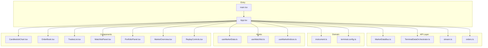
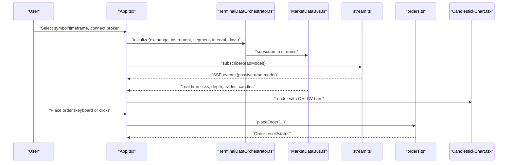
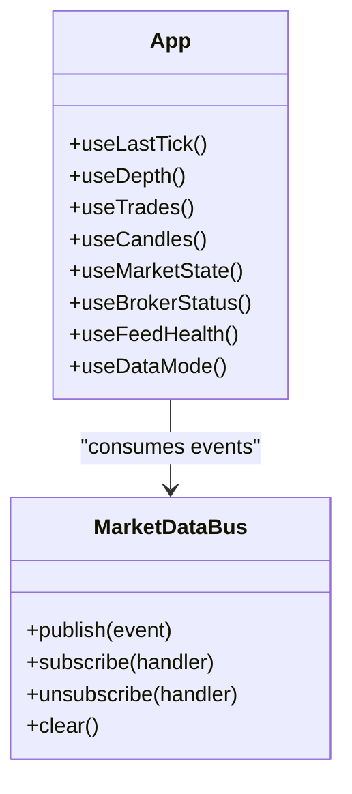
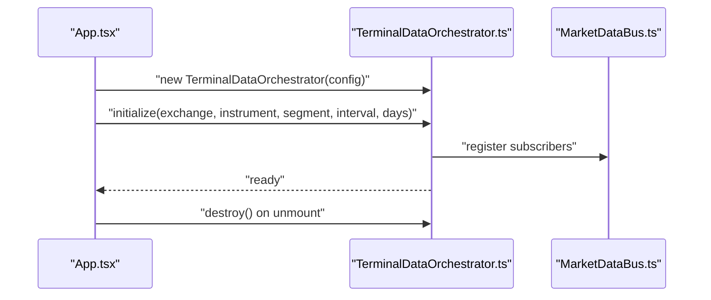
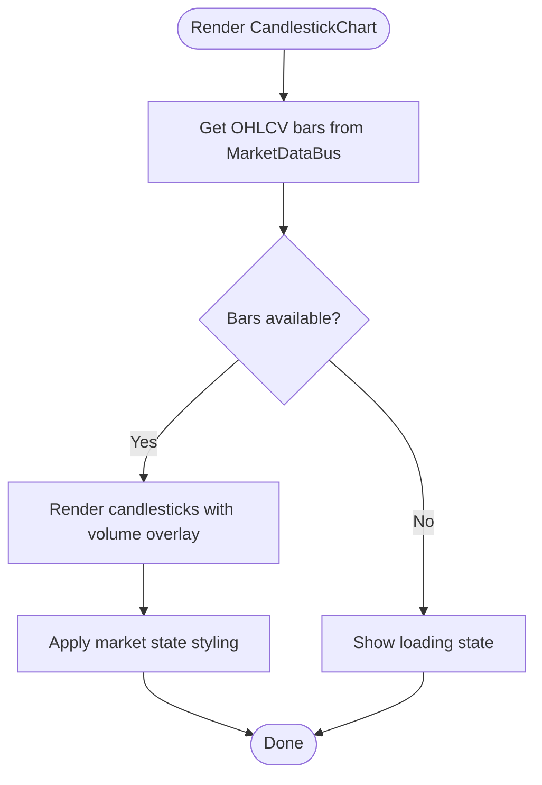
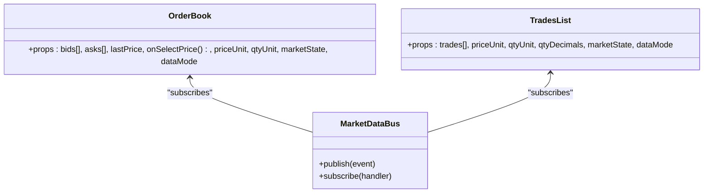
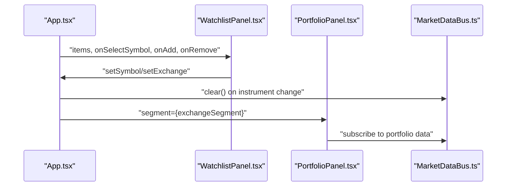
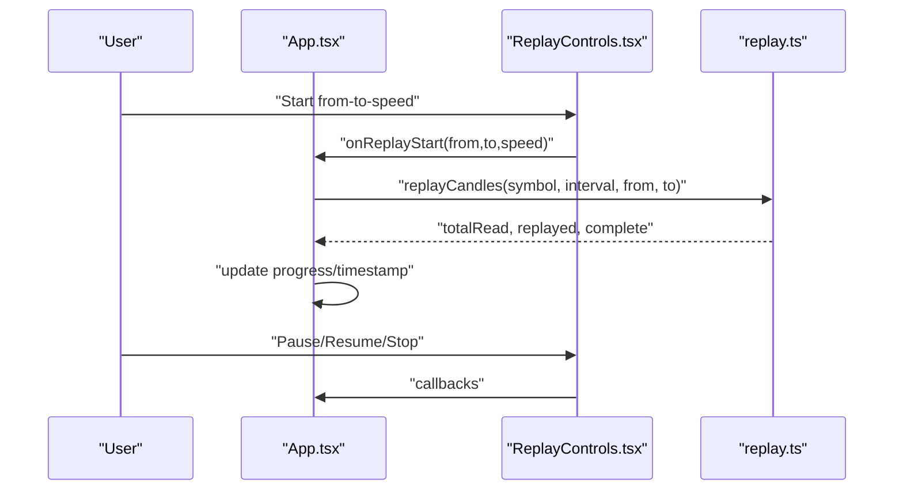
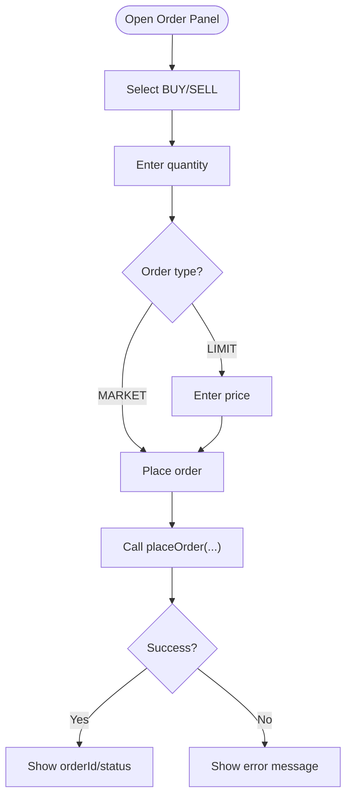
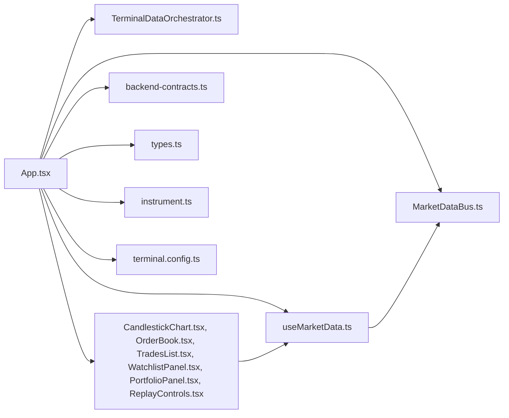

# Trading Terminal

<cite>
**Referenced Files in This Document**
- [App.tsx](file://trade_j_frontend/src/App.tsx)
- [MarketDataBus.ts](file://trade_j_frontend/src/api/MarketDataBus.ts)
- [TerminalDataOrchestrator.ts](file://trade_j_frontend/src/api/TerminalDataOrchestrator.ts)
- [stream.ts](file://trade_j_frontend/src/api/stream.ts)
- [orders.ts](file://trade_j_frontend/src/api/orders.ts)
- [useMarketData.ts](file://trade_j_frontend/src/hooks/useMarketData.ts)
- [useWatchlist.ts](file://trade_j_frontend/src/hooks/useWatchlist.ts)
- [useMarketIndices.ts](file://trade_j_frontend/src/hooks/useMarketIndices.ts)
- [CandlestickChart.tsx](file://trade_j_frontend/src/components/CandlestickChart.tsx)
- [OrderBook.tsx](file://trade_j_frontend/src/components/OrderBook.tsx)
- [TradesList.tsx](file://trade_j_frontend/src/components/TradesList.tsx)
- [WatchlistPanel.tsx](file://trade_j_frontend/src/components/WatchlistPanel.tsx)
- [PortfolioPanel.tsx](file://trade_j_frontend/src/components/PortfolioPanel.tsx)
- [MarketOverview.tsx](file://trade_j_frontend/src/components/MarketOverview.tsx)
- [ReplayControls.tsx](file://trade_j_frontend/src/components/ReplayControls.tsx)
- [terminal.config.ts](file://trade_j_frontend/src/config/terminal.config.ts)
- [instrument.ts](file://trade_j_frontend/src/domain/instrument.ts)
- [backend-contracts.ts](file://trade_j_frontend/src/api/backend-contracts.ts)
- [main.tsx](file://trade_j_frontend/src/main.tsx)
- [index.css](file://trade_j_frontend/src/index.css)
- [types.ts](file://trade_j_frontend/src/types.ts)
</cite>

## Table of Contents
1. [Introduction](#introduction)
2. [Project Structure](#project-structure)
3. [Core Components](#core-components)
4. [Architecture Overview](#architecture-overview)
5. [Detailed Component Analysis](#detailed-component-analysis)
6. [Dependency Analysis](#dependency-analysis)
7. [Performance Considerations](#performance-considerations)
8. [Troubleshooting Guide](#troubleshooting-guide)
9. [Conclusion](#conclusion)
10. [Appendices](#appendices)

## Introduction
This document describes the React-based trading terminal frontend, focusing on component architecture, real-time market data visualization, charting capabilities, order entry interface, and state management. It explains the MarketDataBus for real-time data streaming, component composition patterns, and WebSocket/SSE integration. It also covers charting library integration, candlestick visualization, order book display, portfolio panel functionality, user interaction patterns, keyboard shortcuts, customization options, data synchronization, responsive design, accessibility, and performance optimization for large datasets.

## Project Structure
The frontend is organized around a modular React architecture with clear separation of concerns:
- API layer: Market data orchestration, streaming, order placement, and broker integration
- Domain: Instruments, market calendar, and validators
- Hooks: Reactive data subscriptions and derived state
- Components: Reusable UI widgets for charts, order book, trades, watchlist, portfolio, news, and settings
- Config: Terminal defaults, storage keys, and UI constants
- Styles: Global Tailwind-based CSS

**Diagram sources**
- [main.tsx](file://trade_j_frontend/src/main.tsx)
- [App.tsx](file://trade_j_frontend/src/App.tsx)
- [MarketDataBus.ts](file://trade_j_frontend/src/api/MarketDataBus.ts)
- [TerminalDataOrchestrator.ts](file://trade_j_frontend/src/api/TerminalDataOrchestrator.ts)
- [stream.ts](file://trade_j_frontend/src/api/stream.ts)
- [orders.ts](file://trade_j_frontend/src/api/orders.ts)
- [useMarketData.ts](file://trade_j_frontend/src/hooks/useMarketData.ts)
- [useWatchlist.ts](file://trade_j_frontend/src/hooks/useWatchlist.ts)
- [useMarketIndices.ts](file://trade_j_frontend/src/hooks/useMarketIndices.ts)
- [CandlestickChart.tsx](file://trade_j_frontend/src/components/CandlestickChart.tsx)
- [OrderBook.tsx](file://trade_j_frontend/src/components/OrderBook.tsx)
- [TradesList.tsx](file://trade_j_frontend/src/components/TradesList.tsx)
- [WatchlistPanel.tsx](file://trade_j_frontend/src/components/WatchlistPanel.tsx)
- [PortfolioPanel.tsx](file://trade_j_frontend/src/components/PortfolioPanel.tsx)
- [MarketOverview.tsx](file://trade_j_frontend/src/components/MarketOverview.tsx)
- [ReplayControls.tsx](file://trade_j_frontend/src/components/ReplayControls.tsx)
- [instrument.ts](file://trade_j_frontend/src/domain/instrument.ts)
- [terminal.config.ts](file://trade_j_frontend/src/config/terminal.config.ts)

**Section sources**
- [main.tsx](file://trade_j_frontend/src/main.tsx)
- [App.tsx](file://trade_j_frontend/src/App.tsx)
- [terminal.config.ts](file://trade_j_frontend/src/config/terminal.config.ts)

## Core Components
- App shell and orchestration: Central state, keyboard shortcuts, broker modal, order panel, and layout composition
- MarketDataBus: In-memory event bus for real-time data distribution
- TerminalDataOrchestrator: Initializes and coordinates market data feeds and timeframes
- Streaming: SSE subscription for passive read model updates
- Charting: CandlestickChart component rendering OHLCV bars
- Order Book and Trades: Real-time Level-2 depth and recent trades
- Watchlist and Portfolio: Market lists and portfolio holdings
- Replay Controls: Historical replay orchestration
- Hooks: useMarketData, useWatchlist, useMarketIndices for reactive data consumption

Key responsibilities:
- Real-time data ingestion via SSE and WebSockets
- Local caching and event-driven updates
- Order entry lifecycle and validation
- Responsive grid layout with bottom tabs for modularity
- Keyboard shortcuts for fast navigation and order placement

**Section sources**
- [App.tsx](file://trade_j_frontend/src/App.tsx)
- [MarketDataBus.ts](file://trade_j_frontend/src/api/MarketDataBus.ts)
- [TerminalDataOrchestrator.ts](file://trade_j_frontend/src/api/TerminalDataOrchestrator.ts)
- [stream.ts](file://trade_j_frontend/src/api/stream.ts)
- [CandlestickChart.tsx](file://trade_j_frontend/src/components/CandlestickChart.tsx)
- [OrderBook.tsx](file://trade_j_frontend/src/components/OrderBook.tsx)
- [TradesList.tsx](file://trade_j_frontend/src/components/TradesList.tsx)
- [WatchlistPanel.tsx](file://trade_j_frontend/src/components/WatchlistPanel.tsx)
- [PortfolioPanel.tsx](file://trade_j_frontend/src/components/PortfolioPanel.tsx)
- [ReplayControls.tsx](file://trade_j_frontend/src/components/ReplayControls.tsx)
- [useMarketData.ts](file://trade_j_frontend/src/hooks/useMarketData.ts)
- [useWatchlist.ts](file://trade_j_frontend/src/hooks/useWatchlist.ts)
- [useMarketIndices.ts](file://trade_j_frontend/src/hooks/useMarketIndices.ts)

## Architecture Overview
The terminal follows a publish-subscribe pattern with an in-memory MarketDataBus and a TerminalDataOrchestrator coordinating broker feeds and timeframes. Data flows from backend via SSE and WebSockets into the bus, which components consume via hooks. The App composes components and manages global state, keyboard shortcuts, and replay mode.

**Diagram sources**
- [App.tsx](file://trade_j_frontend/src/App.tsx)
- [TerminalDataOrchestrator.ts](file://trade_j_frontend/src/api/TerminalDataOrchestrator.ts)
- [MarketDataBus.ts](file://trade_j_frontend/src/api/MarketDataBus.ts)
- [stream.ts](file://trade_j_frontend/src/api/stream.ts)
- [orders.ts](file://trade_j_frontend/src/api/orders.ts)
- [CandlestickChart.tsx](file://trade_j_frontend/src/components/CandlestickChart.tsx)

## Detailed Component Analysis

### MarketDataBus
The MarketDataBus is an in-memory event bus enabling decoupled data distribution across components. It supports publishing and subscribing to typed events, clearing stores on instrument change, and emitting status updates.

**Diagram sources**
- [MarketDataBus.ts](file://trade_j_frontend/src/api/MarketDataBus.ts)
- [App.tsx](file://trade_j_frontend/src/App.tsx)

**Section sources**
- [MarketDataBus.ts](file://trade_j_frontend/src/api/MarketDataBus.ts)
- [App.tsx](file://trade_j_frontend/src/App.tsx)

### TerminalDataOrchestrator
The orchestrator initializes broker connections, sets up timeframes, and coordinates data ingestion. It cleans up on unmount and reacts to broker credential changes.

**Diagram sources**
- [TerminalDataOrchestrator.ts](file://trade_j_frontend/src/api/TerminalDataOrchestrator.ts)
- [MarketDataBus.ts](file://trade_j_frontend/src/api/MarketDataBus.ts)
- [App.tsx](file://trade_j_frontend/src/App.tsx)

**Section sources**
- [TerminalDataOrchestrator.ts](file://trade_j_frontend/src/api/TerminalDataOrchestrator.ts)
- [App.tsx](file://trade_j_frontend/src/App.tsx)

### CandlestickChart
The chart component renders OHLCV bars with responsive sizing and market state awareness. It integrates with the MarketDataBus via hooks and respects replay/live modes.

**Diagram sources**
- [CandlestickChart.tsx](file://trade_j_frontend/src/components/CandlestickChart.tsx)
- [useMarketData.ts](file://trade_j_frontend/src/hooks/useMarketData.ts)

**Section sources**
- [CandlestickChart.tsx](file://trade_j_frontend/src/components/CandlestickChart.tsx)
- [useMarketData.ts](file://trade_j_frontend/src/hooks/useMarketData.ts)

### Order Book and Trades
OrderBook displays L2 depth with bid/ask levels and highlights last price. TradesList shows recent executions with currency and quantity units.

**Diagram sources**
- [OrderBook.tsx](file://trade_j_frontend/src/components/OrderBook.tsx)
- [TradesList.tsx](file://trade_j_frontend/src/components/TradesList.tsx)
- [MarketDataBus.ts](file://trade_j_frontend/src/api/MarketDataBus.ts)

**Section sources**
- [OrderBook.tsx](file://trade_j_frontend/src/components/OrderBook.tsx)
- [TradesList.tsx](file://trade_j_frontend/src/components/TradesList.tsx)
- [MarketDataBus.ts](file://trade_j_frontend/src/api/MarketDataBus.ts)

### Watchlist and Portfolio Panels
WatchlistPanel allows adding/removing symbols and switching instruments. PortfolioPanel displays holdings and balances for the selected segment.

**Diagram sources**
- [WatchlistPanel.tsx](file://trade_j_frontend/src/components/WatchlistPanel.tsx)
- [PortfolioPanel.tsx](file://trade_j_frontend/src/components/PortfolioPanel.tsx)
- [MarketDataBus.ts](file://trade_j_frontend/src/api/MarketDataBus.ts)
- [App.tsx](file://trade_j_frontend/src/App.tsx)

**Section sources**
- [WatchlistPanel.tsx](file://trade_j_frontend/src/components/WatchlistPanel.tsx)
- [PortfolioPanel.tsx](file://trade_j_frontend/src/components/PortfolioPanel.tsx)
- [App.tsx](file://trade_j_frontend/src/App.tsx)

### Replay Controls
ReplayControls enable historical playback with start/pause/resume/stop actions. The App orchestrates replay via replayCandles and updates progress and timestamps.

**Diagram sources**
- [ReplayControls.tsx](file://trade_j_frontend/src/components/ReplayControls.tsx)
- [App.tsx](file://trade_j_frontend/src/App.tsx)

**Section sources**
- [ReplayControls.tsx](file://trade_j_frontend/src/components/ReplayControls.tsx)
- [App.tsx](file://trade_j_frontend/src/App.tsx)

### Order Entry Interface
The order panel supports BUY/SELL selection, quantity, order type (LIMIT/MARKET), and price editing. Placing an order calls the orders API with validated parameters.

**Diagram sources**
- [App.tsx](file://trade_j_frontend/src/App.tsx)
- [orders.ts](file://trade_j_frontend/src/api/orders.ts)

**Section sources**
- [App.tsx](file://trade_j_frontend/src/App.tsx)
- [orders.ts](file://trade_j_frontend/src/api/orders.ts)

### Keyboard Shortcuts and User Interaction Patterns
Shortcuts include:
- Number keys 1–6 to switch timeframes
- B/S to open buy/sell order panels
- T to toggle order panel
- Escape to close modals and panels
- Slash/F to open symbol search

These are handled in App with event listeners scoped to avoid conflicts with form inputs.

**Section sources**
- [App.tsx](file://trade_j_frontend/src/App.tsx)

### WebSocket and SSE Integration
- SSE read model: Passive subscription for read-model updates
- Broker WebSocket: Integrated via TerminalDataOrchestrator and MarketDataBus
- MarketDataBus publishes typed events consumed by components
- Broker status and feed health are reflected in the status bar

**Section sources**
- [stream.ts](file://trade_j_frontend/src/api/stream.ts)
- [TerminalDataOrchestrator.ts](file://trade_j_frontend/src/api/TerminalDataOrchestrator.ts)
- [MarketDataBus.ts](file://trade_j_frontend/src/api/MarketDataBus.ts)
- [App.tsx](file://trade_j_frontend/src/App.tsx)

### Data Synchronization and Real-Time Updates
- On instrument change, MarketDataBus is cleared to prevent stale data
- Loading state is driven by presence of candles
- Runtime mode (LIVE/HISTORICAL/SIMULATION) affects UI messaging and behavior
- Replay mode toggles live vs historical data presentation

**Section sources**
- [App.tsx](file://trade_j_frontend/src/App.tsx)
- [MarketDataBus.ts](file://trade_j_frontend/src/api/MarketDataBus.ts)

### Responsive Design and Accessibility
- Grid layout adapts rows/columns for different screen sizes
- Monospace fonts and high contrast color scheme improve readability
- Keyboard navigation and focus-aware inputs
- Status bar and tooltips provide contextual feedback

**Section sources**
- [App.tsx](file://trade_j_frontend/src/App.tsx)
- [index.css](file://trade_j_frontend/src/index.css)

## Dependency Analysis
The App depends on orchestrators, hooks, and components. Hooks depend on MarketDataBus. Components depend on hooks and domain types.

**Diagram sources**
- [App.tsx](file://trade_j_frontend/src/App.tsx)
- [TerminalDataOrchestrator.ts](file://trade_j_frontend/src/api/TerminalDataOrchestrator.ts)
- [MarketDataBus.ts](file://trade_j_frontend/src/api/MarketDataBus.ts)
- [useMarketData.ts](file://trade_j_frontend/src/hooks/useMarketData.ts)
- [CandlestickChart.tsx](file://trade_j_frontend/src/components/CandlestickChart.tsx)
- [OrderBook.tsx](file://trade_j_frontend/src/components/OrderBook.tsx)
- [TradesList.tsx](file://trade_j_frontend/src/components/TradesList.tsx)
- [WatchlistPanel.tsx](file://trade_j_frontend/src/components/WatchlistPanel.tsx)
- [PortfolioPanel.tsx](file://trade_j_frontend/src/components/PortfolioPanel.tsx)
- [ReplayControls.tsx](file://trade_j_frontend/src/components/ReplayControls.tsx)
- [backend-contracts.ts](file://trade_j_frontend/src/api/backend-contracts.ts)
- [types.ts](file://trade_j_frontend/src/types.ts)
- [instrument.ts](file://trade_j_frontend/src/domain/instrument.ts)
- [terminal.config.ts](file://trade_j_frontend/src/config/terminal.config.ts)

**Section sources**
- [App.tsx](file://trade_j_frontend/src/App.tsx)
- [MarketDataBus.ts](file://trade_j_frontend/src/api/MarketDataBus.ts)
- [useMarketData.ts](file://trade_j_frontend/src/hooks/useMarketData.ts)

## Performance Considerations
- Prefer memoization and stable callbacks to minimize re-renders
- Clear data stores on instrument change to avoid memory leaks
- Use controlled inputs and numeric parsing helpers
- Defer heavy computations off the render thread
- Virtualize long lists (watchlist, trades) when datasets grow
- Batch updates to the MarketDataBus to reduce churn
- Use CSS containment and isolation for chart containers

## Troubleshooting Guide
Common issues and remedies:
- Broker credentials missing: Open broker modal and enter required fields
- No real-time data: Verify broker status and WebSocket connectivity; check feed health indicator
- Order placement errors: Validate inputs and ensure broker is connected
- Replay failures: Confirm date range and speed; inspect console logs
- Stale data after symbol change: MarketDataBus is cleared automatically; wait for new candles

**Section sources**
- [App.tsx](file://trade_j_frontend/src/App.tsx)
- [MarketDataBus.ts](file://trade_j_frontend/src/api/MarketDataBus.ts)
- [orders.ts](file://trade_j_frontend/src/api/orders.ts)

## Conclusion
The trading terminal leverages a clean separation of concerns with a MarketDataBus, TerminalDataOrchestrator, and a suite of reusable components. It delivers real-time market visualization, order entry, and replay capabilities while maintaining responsiveness and accessibility. Extending the system involves adding new event types to the bus, integrating additional broker feeds, and enhancing components with virtualization and advanced chart features.

## Appendices

### Configuration and Defaults
- Storage keys and UI defaults are centralized for consistent persistence and UX
- Timeframe configurations define intervals and history windows
- Exchange and broker mappings ensure compatibility

**Section sources**
- [terminal.config.ts](file://trade_j_frontend/src/config/terminal.config.ts)
- [App.tsx](file://trade_j_frontend/src/App.tsx)

### Backend Contracts Reference
- Order placement parameters are strongly typed to ensure correctness
- Segment, side, type, product, and validity enums align with backend expectations

**Section sources**
- [backend-contracts.ts](file://trade_j_frontend/src/api/backend-contracts.ts)
- [orders.ts](file://trade_j_frontend/src/api/orders.ts)