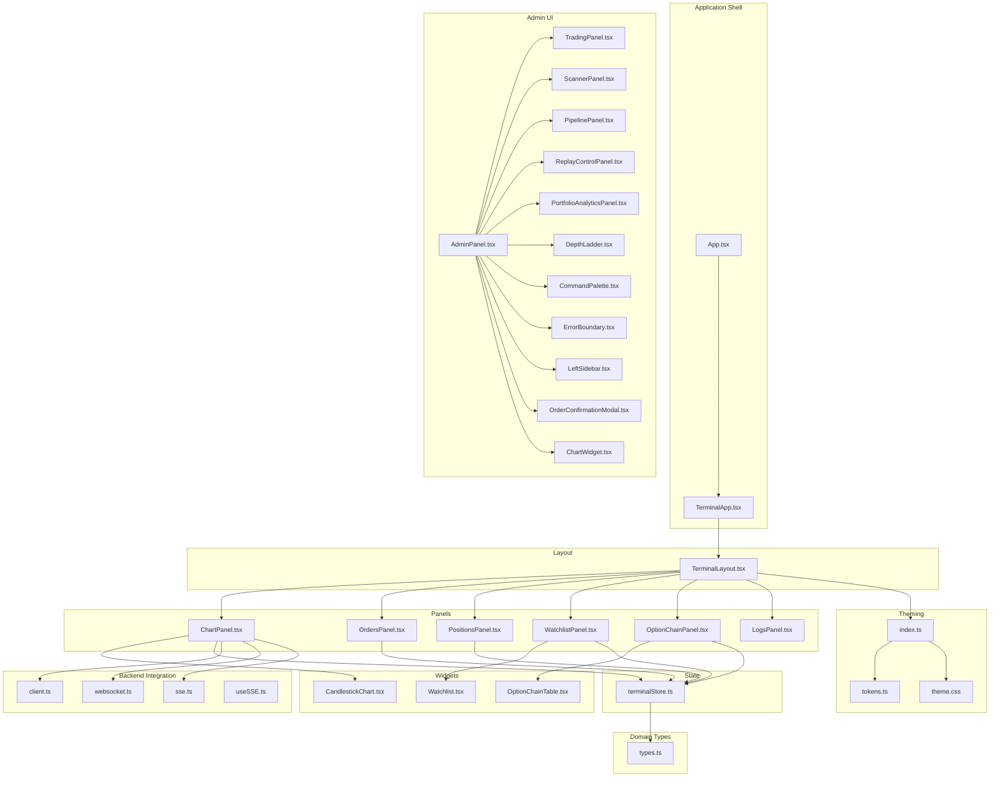
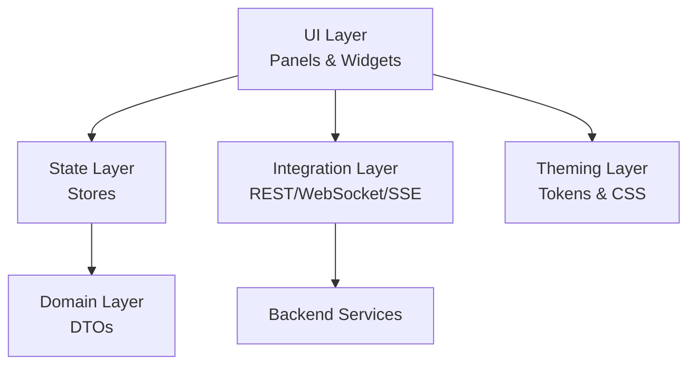
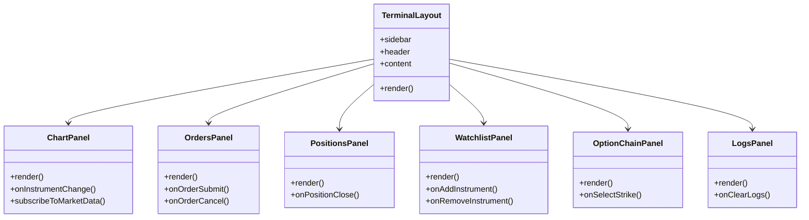
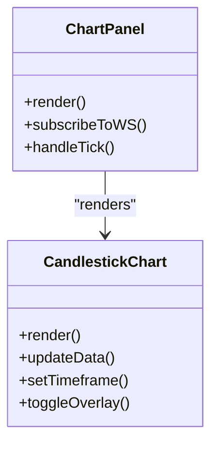
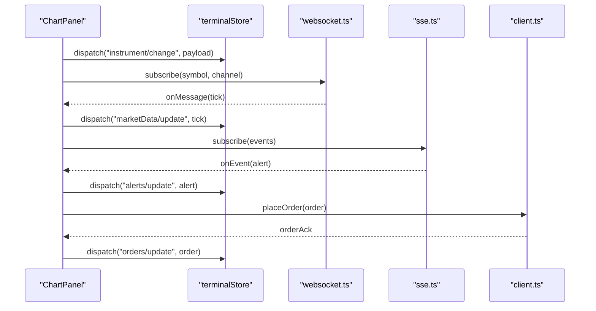
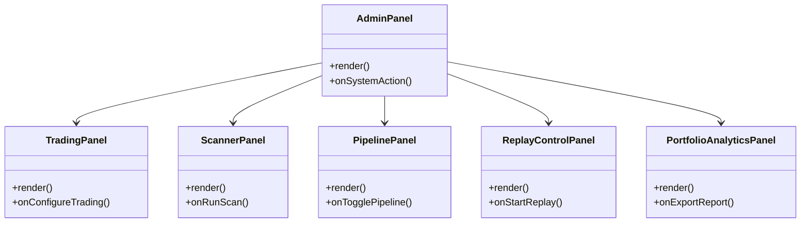
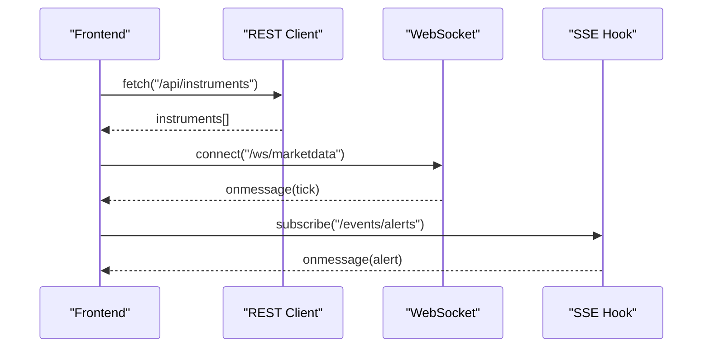
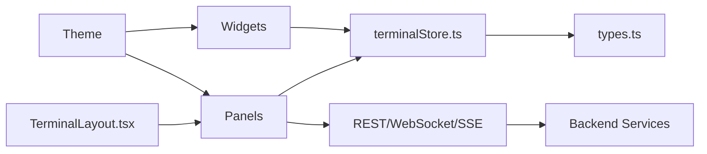

# User Interface

<cite>
**Referenced Files in This Document**
- [App.tsx](file://frontend/src/App.tsx)
- [TerminalApp.tsx](file://frontend/src/app/TerminalApp.tsx)
- [TerminalLayout.tsx](file://frontend/src/ui/layout/TerminalLayout.tsx)
- [ChartPanel.tsx](file://frontend/src/ui/panels/ChartPanel.tsx)
- [OrdersPanel.tsx](file://frontend/src/ui/panels/OrdersPanel.tsx)
- [PositionsPanel.tsx](file://frontend/src/ui/panels/PositionsPanel.tsx)
- [WatchlistPanel.tsx](file://frontend/src/ui/panels/WatchlistPanel.tsx)
- [OptionChainPanel.tsx](file://frontend/src/ui/panels/OptionChainPanel.tsx)
- [LogsPanel.tsx](file://frontend/src/ui/panels/LogsPanel.tsx)
- [CandlestickChart.tsx](file://frontend/src/ui/widgets/charts/CandlestickChart.tsx)
- [Watchlist.tsx](file://frontend/src/ui/widgets/Watchlist/Watchlist.tsx)
- [OptionChainTable.tsx](file://frontend/src/ui/widgets/OptionChain/OptionChainTable.tsx)
- [terminalStore.ts](file://frontend/src/state/terminalStore.ts)
- [types.ts](file://frontend/src/domain/dto/types.ts)
- [index.ts](file://frontend/src/theme/index.ts)
- [tokens.ts](file://frontend/src/theme/tokens.ts)
- [theme.css](file://frontend/src/theme/theme.css)
- [client.ts](file://archive/frontend/src/api/client.ts)
- [websocket.ts](file://archive/frontend/src/api/websocket.ts)
- [sse.ts](file://archive/frontend/src/api/sse.ts)
- [useSSE.ts](file://archive/frontend/src/hooks/useSSE.ts)
- [AdminPanel.tsx](file://archive/frontend/src/components/AdminPanel.tsx)
- [TradingPanel.tsx](file://archive/frontend/src/components/TradingPanel.tsx)
- [ScannerPanel.tsx](file://archive/frontend/src/components/ScannerPanel.tsx)
- [PipelinePanel.tsx](file://archive/frontend/src/components/PipelinePanel.tsx)
- [ReplayControlPanel.tsx](file://archive/frontend/src/components/ReplayControlPanel.tsx)
- [PortfolioAnalyticsPanel.tsx](file://archive/frontend/src/components/PortfolioAnalyticsPanel.tsx)
- [DepthLadder.tsx](file://archive/frontend/src/components/DepthLadder.tsx)
- [CommandPalette.tsx](file://archive/frontend/src/components/CommandPalette.tsx)
- [ErrorBoundary.tsx](file://archive/frontend/src/components/ErrorBoundary.tsx)
- [LeftSidebar.tsx](file://archive/frontend/src/components/LeftSidebar.tsx)
- [OrderConfirmationModal.tsx](file://archive/frontend/src/components/OrderConfirmationModal.tsx)
- [ChartWidget.tsx](file://archive/frontend/src/charts/ChartWidget.tsx)
- [useStudioStore.ts](file://archive/frontend/src/store/useStudioStore.ts)
- [usePipelineStore.ts](file://archive/frontend/src/store/usePipelineStore.ts)
</cite>

## Table of Contents
1. [Introduction](#introduction)
2. [Project Structure](#project-structure)
3. [Core Components](#core-components)
4. [Architecture Overview](#architecture-overview)
5. [Detailed Component Analysis](#detailed-component-analysis)
6. [Dependency Analysis](#dependency-analysis)
7. [Performance Considerations](#performance-considerations)
8. [Troubleshooting Guide](#troubleshooting-guide)
9. [Conclusion](#conclusion)

## Introduction
This document describes the user interface architecture for the trading terminal and administrative panel. It covers the React-based frontend, component composition patterns, state management, real-time data visualization, charting capabilities, interactive trading controls, responsive design, accessibility, and integration with backend services via REST, WebSocket, and Server-Sent Events (SSE). The frontend is organized into two primary areas:
- Trading terminal: Real-time market data, order management, positions, watchlists, options chain, and charting.
- Administrative panel: System monitoring, configuration management, pipeline controls, and replay utilities.

## Project Structure
The frontend is structured around a modular React application with clear separation of concerns:
- Application shell and routing: [App.tsx](file://frontend/src/App.tsx), [TerminalApp.tsx](file://frontend/src/app/TerminalApp.tsx)
- Layout and navigation: [TerminalLayout.tsx](file://frontend/src/ui/layout/TerminalLayout.tsx)
- Panels and widgets: Panels under [ui/panels](file://frontend/src/ui/panels/) and widgets under [ui/widgets](file://frontend/src/ui/widgets/)
- State management: [terminalStore.ts](file://frontend/src/state/terminalStore.ts)
- Domain types: [types.ts](file://frontend/src/domain/dto/types.ts)
- Theming: [index.ts](file://frontend/src/theme/index.ts), [tokens.ts](file://frontend/src/theme/tokens.ts), [theme.css](file://frontend/src/theme/theme.css)
- Backend integration: REST client, WebSocket, and SSE under [archive/frontend/src/api](file://archive/frontend/src/api/), with hooks under [archive/frontend/src/hooks](file://archive/frontend/src/hooks/)
- Administrative UI: Panels and components under [archive/frontend/src/components](file://archive/frontend/src/components/)
- Additional stores: [useStudioStore.ts](file://archive/frontend/src/store/useStudioStore.ts), [usePipelineStore.ts](file://archive/frontend/src/store/usePipelineStore.ts)

**Diagram sources**
- [App.tsx:1-200](file://frontend/src/App.tsx#L1-L200)
- [TerminalApp.tsx:1-200](file://frontend/src/app/TerminalApp.tsx#L1-L200)
- [TerminalLayout.tsx:1-200](file://frontend/src/ui/layout/TerminalLayout.tsx#L1-L200)
- [ChartPanel.tsx:1-200](file://frontend/src/ui/panels/ChartPanel.tsx#L1-L200)
- [OrdersPanel.tsx:1-200](file://frontend/src/ui/panels/OrdersPanel.tsx#L1-L200)
- [PositionsPanel.tsx:1-200](file://frontend/src/ui/panels/PositionsPanel.tsx#L1-L200)
- [WatchlistPanel.tsx:1-200](file://frontend/src/ui/panels/WatchlistPanel.tsx#L1-L200)
- [OptionChainPanel.tsx:1-200](file://frontend/src/ui/panels/OptionChainPanel.tsx#L1-L200)
- [LogsPanel.tsx:1-200](file://frontend/src/ui/panels/LogsPanel.tsx#L1-L200)
- [CandlestickChart.tsx:1-200](file://frontend/src/ui/widgets/charts/CandlestickChart.tsx#L1-L200)
- [Watchlist.tsx:1-200](file://frontend/src/ui/widgets/Watchlist/Watchlist.tsx#L1-L200)
- [OptionChainTable.tsx:1-200](file://frontend/src/ui/widgets/OptionChain/OptionChainTable.tsx#L1-L200)
- [terminalStore.ts:1-200](file://frontend/src/state/terminalStore.ts#L1-L200)
- [types.ts:1-200](file://frontend/src/domain/dto/types.ts#L1-L200)
- [index.ts:1-200](file://frontend/src/theme/index.ts#L1-L200)
- [tokens.ts:1-200](file://frontend/src/theme/tokens.ts#L1-L200)
- [theme.css:1-200](file://frontend/src/theme/theme.css#L1-L200)
- [client.ts:1-200](file://archive/frontend/src/api/client.ts#L1-L200)
- [websocket.ts:1-200](file://archive/frontend/src/api/websocket.ts#L1-L200)
- [sse.ts:1-200](file://archive/frontend/src/api/sse.ts#L1-L200)
- [useSSE.ts:1-200](file://archive/frontend/src/hooks/useSSE.ts#L1-L200)
- [AdminPanel.tsx:1-200](file://archive/frontend/src/components/AdminPanel.tsx#L1-L200)
- [TradingPanel.tsx:1-200](file://archive/frontend/src/components/TradingPanel.tsx#L1-L200)
- [ScannerPanel.tsx:1-200](file://archive/frontend/src/components/ScannerPanel.tsx#L1-L200)
- [PipelinePanel.tsx:1-200](file://archive/frontend/src/components/PipelinePanel.tsx#L1-L200)
- [ReplayControlPanel.tsx:1-200](file://archive/frontend/src/components/ReplayControlPanel.tsx#L1-L200)
- [PortfolioAnalyticsPanel.tsx:1-200](file://archive/frontend/src/components/PortfolioAnalyticsPanel.tsx#L1-L200)
- [DepthLadder.tsx:1-200](file://archive/frontend/src/components/DepthLadder.tsx#L1-L200)
- [CommandPalette.tsx:1-200](file://archive/frontend/src/components/CommandPalette.tsx#L1-L200)
- [ErrorBoundary.tsx:1-200](file://archive/frontend/src/components/ErrorBoundary.tsx#L1-L200)
- [LeftSidebar.tsx:1-200](file://archive/frontend/src/components/LeftSidebar.tsx#L1-L200)
- [OrderConfirmationModal.tsx:1-200](file://archive/frontend/src/components/OrderConfirmationModal.tsx#L1-L200)
- [ChartWidget.tsx:1-200](file://archive/frontend/src/charts/ChartWidget.tsx#L1-L200)
- [useStudioStore.ts:1-200](file://archive/frontend/src/store/useStudioStore.ts#L1-L200)
- [usePipelineStore.ts:1-200](file://archive/frontend/src/store/usePipelineStore.ts#L1-L200)

**Section sources**
- [App.tsx:1-200](file://frontend/src/App.tsx#L1-L200)
- [TerminalApp.tsx:1-200](file://frontend/src/app/TerminalApp.tsx#L1-L200)
- [TerminalLayout.tsx:1-200](file://frontend/src/ui/layout/TerminalLayout.tsx#L1-L200)

## Core Components
This section outlines the primary building blocks of the UI and their responsibilities.

- Application shell and routing
  - [App.tsx:1-200](file://frontend/src/App.tsx#L1-L200): Top-level application container and routing configuration.
  - [TerminalApp.tsx:1-200](file://frontend/src/app/TerminalApp.tsx#L1-L200): Terminal-specific application wrapper.

- Layout and navigation
  - [TerminalLayout.tsx:1-200](file://frontend/src/ui/layout/TerminalLayout.tsx#L1-L200): Main layout orchestrating sidebar, header, and panel regions.

- Panels (data presentation)
  - [ChartPanel.tsx:1-200](file://frontend/src/ui/panels/ChartPanel.tsx#L1-L200): Charting panel integrating candlesticks and overlays.
  - [OrdersPanel.tsx:1-200](file://frontend/src/ui/panels/OrdersPanel.tsx#L1-L200): Active orders and order book.
  - [PositionsPanel.tsx:1-200](file://frontend/src/ui/panels/PositionsPanel.tsx#L1-L200): Open positions and PnL.
  - [WatchlistPanel.tsx:1-200](file://frontend/src/ui/panels/WatchlistPanel.tsx#L1-L200): Watchlist management and selection.
  - [OptionChainPanel.tsx:1-200](file://frontend/src/ui/panels/OptionChainPanel.tsx#L1-L200): Options chain and greeks.
  - [LogsPanel.tsx:1-200](file://frontend/src/ui/panels/LogsPanel.tsx#L1-L200): System logs and alerts.

- Widgets (reusable components)
  - [CandlestickChart.tsx:1-200](file://frontend/src/ui/widgets/charts/CandlestickChart.tsx#L1-L200): Candlestick visualization with overlays.
  - [Watchlist.tsx:1-200](file://frontend/src/ui/widgets/Watchlist/Watchlist.tsx#L1-L200): Instrument selection and watchlist actions.
  - [OptionChainTable.tsx:1-200](file://frontend/src/ui/widgets/OptionChain/OptionChainTable.tsx#L1-L200): Options chain table with sorting and filtering.

- State management
  - [terminalStore.ts:1-200](file://frontend/src/state/terminalStore.ts#L1-L200): Centralized state for instruments, market data, orders, positions, and UI state.

- Domain types
  - [types.ts:1-200](file://frontend/src/domain/dto/types.ts#L1-L200): Shared TypeScript definitions for market data, orders, positions, and UI models.

- Theming
  - [index.ts:1-200](file://frontend/src/theme/index.ts#L1-L200), [tokens.ts:1-200](file://frontend/src/theme/tokens.ts#L1-L200), [theme.css:1-200](file://frontend/src/theme/theme.css#L1-L200): Design tokens and CSS-in-JS integration.

- Backend integration
  - [client.ts:1-200](file://archive/frontend/src/api/client.ts#L1-L200): REST client for backend APIs.
  - [websocket.ts:1-200](file://archive/frontend/src/api/websocket.ts#L1-L200): WebSocket connection manager for real-time streams.
  - [sse.ts:1-200](file://archive/frontend/src/api/sse.ts#L1-L200): SSE client for server-sent events.
  - [useSSE.ts:1-200](file://archive/frontend/src/hooks/useSSE.ts#L1-L200): React hook for SSE subscriptions.

- Administrative UI
  - [AdminPanel.tsx:1-200](file://archive/frontend/src/components/AdminPanel.tsx#L1-L200): Administrative dashboard.
  - [TradingPanel.tsx:1-200](file://archive/frontend/src/components/TradingPanel.tsx#L1-L200): Trading controls and configuration.
  - [ScannerPanel.tsx:1-200](file://archive/frontend/src/components/ScannerPanel.tsx#L1-L200): Screening and scanning utilities.
  - [PipelinePanel.tsx:1-200](file://archive/frontend/src/components/PipelinePanel.tsx#L1-L200): Pipeline monitoring and control.
  - [ReplayControlPanel.tsx:1-200](file://archive/frontend/src/components/ReplayControlPanel.tsx#L1-L200): Replay session controls.
  - [PortfolioAnalyticsPanel.tsx:1-200](file://archive/frontend/src/components/PortfolioAnalyticsPanel.tsx#L1-L200): Portfolio analytics.
  - [DepthLadder.tsx:1-200](file://archive/frontend/src/components/DepthLadder.tsx#L1-L200): Market depth visualization.
  - [CommandPalette.tsx:1-200](file://archive/frontend/src/components/CommandPalette.tsx#L1-L200): Global command palette.
  - [ErrorBoundary.tsx:1-200](file://archive/frontend/src/components/ErrorBoundary.tsx#L1-L200): Error boundary for resilience.
  - [LeftSidebar.tsx:1-200](file://archive/frontend/src/components/LeftSidebar.tsx#L1-L200): Navigation sidebar.
  - [OrderConfirmationModal.tsx:1-200](file://archive/frontend/src/components/OrderConfirmationModal.tsx#L1-L200): Confirmation modal for orders.
  - [ChartWidget.tsx:1-200](file://archive/frontend/src/charts/ChartWidget.tsx#L1-L200): Legacy chart widget.

- Additional stores
  - [useStudioStore.ts:1-200](file://archive/frontend/src/store/useStudioStore.ts#L1-L200): Studio-related state.
  - [usePipelineStore.ts:1-200](file://archive/frontend/src/store/usePipelineStore.ts#L1-L200): Pipeline-related state.

**Section sources**
- [App.tsx:1-200](file://frontend/src/App.tsx#L1-L200)
- [TerminalApp.tsx:1-200](file://frontend/src/app/TerminalApp.tsx#L1-L200)
- [TerminalLayout.tsx:1-200](file://frontend/src/ui/layout/TerminalLayout.tsx#L1-L200)
- [ChartPanel.tsx:1-200](file://frontend/src/ui/panels/ChartPanel.tsx#L1-L200)
- [OrdersPanel.tsx:1-200](file://frontend/src/ui/panels/OrdersPanel.tsx#L1-L200)
- [PositionsPanel.tsx:1-200](file://frontend/src/ui/panels/PositionsPanel.tsx#L1-L200)
- [WatchlistPanel.tsx:1-200](file://frontend/src/ui/panels/WatchlistPanel.tsx#L1-L200)
- [OptionChainPanel.tsx:1-200](file://frontend/src/ui/panels/OptionChainPanel.tsx#L1-L200)
- [LogsPanel.tsx:1-200](file://frontend/src/ui/panels/LogsPanel.tsx#L1-L200)
- [CandlestickChart.tsx:1-200](file://frontend/src/ui/widgets/charts/CandlestickChart.tsx#L1-L200)
- [Watchlist.tsx:1-200](file://frontend/src/ui/widgets/Watchlist/Watchlist.tsx#L1-L200)
- [OptionChainTable.tsx:1-200](file://frontend/src/ui/widgets/OptionChain/OptionChainTable.tsx#L1-L200)
- [terminalStore.ts:1-200](file://frontend/src/state/terminalStore.ts#L1-L200)
- [types.ts:1-200](file://frontend/src/domain/dto/types.ts#L1-L200)
- [index.ts:1-200](file://frontend/src/theme/index.ts#L1-L200)
- [tokens.ts:1-200](file://frontend/src/theme/tokens.ts#L1-L200)
- [theme.css:1-200](file://frontend/src/theme/theme.css#L1-L200)
- [client.ts:1-200](file://archive/frontend/src/api/client.ts#L1-L200)
- [websocket.ts:1-200](file://archive/frontend/src/api/websocket.ts#L1-L200)
- [sse.ts:1-200](file://archive/frontend/src/api/sse.ts#L1-L200)
- [useSSE.ts:1-200](file://archive/frontend/src/hooks/useSSE.ts#L1-L200)
- [AdminPanel.tsx:1-200](file://archive/frontend/src/components/AdminPanel.tsx#L1-L200)
- [TradingPanel.tsx:1-200](file://archive/frontend/src/components/TradingPanel.tsx#L1-L200)
- [ScannerPanel.tsx:1-200](file://archive/frontend/src/components/ScannerPanel.tsx#L1-L200)
- [PipelinePanel.tsx:1-200](file://archive/frontend/src/components/PipelinePanel.tsx#L1-L200)
- [ReplayControlPanel.tsx:1-200](file://archive/frontend/src/components/ReplayControlPanel.tsx#L1-L200)
- [PortfolioAnalyticsPanel.tsx:1-200](file://archive/frontend/src/components/PortfolioAnalyticsPanel.tsx#L1-L200)
- [DepthLadder.tsx:1-200](file://archive/frontend/src/components/DepthLadder.tsx#L1-L200)
- [CommandPalette.tsx:1-200](file://archive/frontend/src/components/CommandPalette.tsx#L1-L200)
- [ErrorBoundary.tsx:1-200](file://archive/frontend/src/components/ErrorBoundary.tsx#L1-L200)
- [LeftSidebar.tsx:1-200](file://archive/frontend/src/components/LeftSidebar.tsx#L1-L200)
- [OrderConfirmationModal.tsx:1-200](file://archive/frontend/src/components/OrderConfirmationModal.tsx#L1-L200)
- [ChartWidget.tsx:1-200](file://archive/frontend/src/charts/ChartWidget.tsx#L1-L200)
- [useStudioStore.ts:1-200](file://archive/frontend/src/store/useStudioStore.ts#L1-L200)
- [usePipelineStore.ts:1-200](file://archive/frontend/src/store/usePipelineStore.ts#L1-L200)

## Architecture Overview
The UI follows a layered architecture:
- Presentation layer: Panels and widgets encapsulate UI logic and rendering.
- State layer: Centralized stores manage domain state and expose selectors/actions.
- Domain layer: Strongly typed DTOs define data contracts.
- Integration layer: REST, WebSocket, and SSE clients handle backend communication.
- Theming layer: Tokens and CSS provide consistent design and responsive behavior.

[No sources needed since this diagram shows conceptual architecture]

## Detailed Component Analysis

### Trading Terminal Panels
The trading terminal is composed of multiple specialized panels that render real-time data and enable interactive trading.

**Diagram sources**
- [TerminalLayout.tsx:1-200](file://frontend/src/ui/layout/TerminalLayout.tsx#L1-L200)
- [ChartPanel.tsx:1-200](file://frontend/src/ui/panels/ChartPanel.tsx#L1-L200)
- [OrdersPanel.tsx:1-200](file://frontend/src/ui/panels/OrdersPanel.tsx#L1-L200)
- [PositionsPanel.tsx:1-200](file://frontend/src/ui/panels/PositionsPanel.tsx#L1-L200)
- [WatchlistPanel.tsx:1-200](file://frontend/src/ui/panels/WatchlistPanel.tsx#L1-L200)
- [OptionChainPanel.tsx:1-200](file://frontend/src/ui/panels/OptionChainPanel.tsx#L1-L200)
- [LogsPanel.tsx:1-200](file://frontend/src/ui/panels/LogsPanel.tsx#L1-L200)

**Section sources**
- [TerminalLayout.tsx:1-200](file://frontend/src/ui/layout/TerminalLayout.tsx#L1-L200)
- [ChartPanel.tsx:1-200](file://frontend/src/ui/panels/ChartPanel.tsx#L1-L200)
- [OrdersPanel.tsx:1-200](file://frontend/src/ui/panels/OrdersPanel.tsx#L1-L200)
- [PositionsPanel.tsx:1-200](file://frontend/src/ui/panels/PositionsPanel.tsx#L1-L200)
- [WatchlistPanel.tsx:1-200](file://frontend/src/ui/panels/WatchlistPanel.tsx#L1-L200)
- [OptionChainPanel.tsx:1-200](file://frontend/src/ui/panels/OptionChainPanel.tsx#L1-L200)
- [LogsPanel.tsx:1-200](file://frontend/src/ui/panels/LogsPanel.tsx#L1-L200)

### Charting and Visualization
Real-time charting is implemented with a dedicated widget that renders candlesticks and overlays.

**Diagram sources**
- [CandlestickChart.tsx:1-200](file://frontend/src/ui/widgets/charts/CandlestickChart.tsx#L1-L200)
- [ChartPanel.tsx:1-200](file://frontend/src/ui/panels/ChartPanel.tsx#L1-L200)

**Section sources**
- [CandlestickChart.tsx:1-200](file://frontend/src/ui/widgets/charts/CandlestickChart.tsx#L1-L200)
- [ChartPanel.tsx:1-200](file://frontend/src/ui/panels/ChartPanel.tsx#L1-L200)

### State Management and Data Flow
Centralized state management coordinates UI updates and data synchronization.

**Diagram sources**
- [ChartPanel.tsx:1-200](file://frontend/src/ui/panels/ChartPanel.tsx#L1-L200)
- [terminalStore.ts:1-200](file://frontend/src/state/terminalStore.ts#L1-L200)
- [websocket.ts:1-200](file://archive/frontend/src/api/websocket.ts#L1-L200)
- [sse.ts:1-200](file://archive/frontend/src/api/sse.ts#L1-L200)
- [client.ts:1-200](file://archive/frontend/src/api/client.ts#L1-L200)

**Section sources**
- [terminalStore.ts:1-200](file://frontend/src/state/terminalStore.ts#L1-L200)
- [websocket.ts:1-200](file://archive/frontend/src/api/websocket.ts#L1-L200)
- [sse.ts:1-200](file://archive/frontend/src/api/sse.ts#L1-L200)
- [client.ts:1-200](file://archive/frontend/src/api/client.ts#L1-L200)

### Administrative Panel Components
Administrative capabilities are provided through a set of specialized panels and controls.

**Diagram sources**
- [AdminPanel.tsx:1-200](file://archive/frontend/src/components/AdminPanel.tsx#L1-L200)
- [TradingPanel.tsx:1-200](file://archive/frontend/src/components/TradingPanel.tsx#L1-L200)
- [ScannerPanel.tsx:1-200](file://archive/frontend/src/components/ScannerPanel.tsx#L1-L200)
- [PipelinePanel.tsx:1-200](file://archive/frontend/src/components/PipelinePanel.tsx#L1-L200)
- [ReplayControlPanel.tsx:1-200](file://archive/frontend/src/components/ReplayControlPanel.tsx#L1-L200)
- [PortfolioAnalyticsPanel.tsx:1-200](file://archive/frontend/src/components/PortfolioAnalyticsPanel.tsx#L1-L200)

**Section sources**
- [AdminPanel.tsx:1-200](file://archive/frontend/src/components/AdminPanel.tsx#L1-L200)
- [TradingPanel.tsx:1-200](file://archive/frontend/src/components/TradingPanel.tsx#L1-L200)
- [ScannerPanel.tsx:1-200](file://archive/frontend/src/components/ScannerPanel.tsx#L1-L200)
- [PipelinePanel.tsx:1-200](file://archive/frontend/src/components/PipelinePanel.tsx#L1-L200)
- [ReplayControlPanel.tsx:1-200](file://archive/frontend/src/components/ReplayControlPanel.tsx#L1-L200)
- [PortfolioAnalyticsPanel.tsx:1-200](file://archive/frontend/src/components/PortfolioAnalyticsPanel.tsx#L1-L200)

### Responsive Design and Accessibility
Responsive design and accessibility are addressed through:
- Theme tokens and CSS-in-JS for consistent spacing, typography, and color scales.
- Semantic HTML and ARIA attributes in panels and modals.
- Keyboard navigation support in command palette and interactive controls.
- Focus management and screen reader-friendly labeling.

**Section sources**
- [index.ts:1-200](file://frontend/src/theme/index.ts#L1-L200)
- [tokens.ts:1-200](file://frontend/src/theme/tokens.ts#L1-L200)
- [theme.css:1-200](file://frontend/src/theme/theme.css#L1-L200)
- [CommandPalette.tsx:1-200](file://archive/frontend/src/components/CommandPalette.tsx#L1-L200)
- [ErrorBoundary.tsx:1-200](file://archive/frontend/src/components/ErrorBoundary.tsx#L1-L200)

### Backend Integration Patterns
Real-time data is integrated via REST, WebSocket, and SSE:
- REST: [client.ts:1-200](file://archive/frontend/src/api/client.ts#L1-L200) for CRUD operations and batch requests.
- WebSocket: [websocket.ts:1-200](file://archive/frontend/src/api/websocket.ts#L1-L200) for low-latency market data streams.
- SSE: [sse.ts:1-200](file://archive/frontend/src/api/sse.ts#L1-L200) and [useSSE.ts:1-200](file://archive/frontend/src/hooks/useSSE.ts#L1-L200) for server-sent events.

**Diagram sources**
- [client.ts:1-200](file://archive/frontend/src/api/client.ts#L1-L200)
- [websocket.ts:1-200](file://archive/frontend/src/api/websocket.ts#L1-L200)
- [sse.ts:1-200](file://archive/frontend/src/api/sse.ts#L1-L200)
- [useSSE.ts:1-200](file://archive/frontend/src/hooks/useSSE.ts#L1-L200)

**Section sources**
- [client.ts:1-200](file://archive/frontend/src/api/client.ts#L1-L200)
- [websocket.ts:1-200](file://archive/frontend/src/api/websocket.ts#L1-L200)
- [sse.ts:1-200](file://archive/frontend/src/api/sse.ts#L1-L200)
- [useSSE.ts:1-200](file://archive/frontend/src/hooks/useSSE.ts#L1-L200)

## Dependency Analysis
The UI components depend on shared state, domain types, and integration utilities. Dependencies are intentionally decoupled to support maintainability and testability.

[No sources needed since this diagram shows conceptual dependencies]

**Section sources**
- [terminalStore.ts:1-200](file://frontend/src/state/terminalStore.ts#L1-L200)
- [types.ts:1-200](file://frontend/src/domain/dto/types.ts#L1-L200)
- [client.ts:1-200](file://archive/frontend/src/api/client.ts#L1-L200)
- [websocket.ts:1-200](file://archive/frontend/src/api/websocket.ts#L1-L200)
- [sse.ts:1-200](file://archive/frontend/src/api/sse.ts#L1-L200)
- [TerminalLayout.tsx:1-200](file://frontend/src/ui/layout/TerminalLayout.tsx#L1-L200)

## Performance Considerations
- Virtualization: Use virtualized lists for large datasets (e.g., watchlist, option chain).
- Memoization: Persist derived data and avoid unnecessary re-renders.
- Debouncing: Debounce rapid UI interactions (e.g., search, filters).
- Lazy loading: Load heavy components on demand.
- Efficient subscriptions: Subscribe only to required symbols and channels.
- Rendering optimization: Prefer pure components and controlled updates.

[No sources needed since this section provides general guidance]

## Troubleshooting Guide
Common issues and resolutions:
- WebSocket disconnections: Reconnect logic and exponential backoff in [websocket.ts:1-200](file://archive/frontend/src/api/websocket.ts#L1-L200).
- SSE subscription failures: Retry mechanism and fallback in [useSSE.ts:1-200](file://archive/frontend/src/hooks/useSSE.ts#L1-L200).
- Panel rendering errors: Wrap panels with [ErrorBoundary.tsx:1-200](file://archive/frontend/src/components/ErrorBoundary.tsx#L1-L200) to prevent cascading failures.
- State inconsistencies: Normalize state in [terminalStore.ts:1-200](file://frontend/src/state/terminalStore.ts#L1-L200) and validate with [types.ts:1-200](file://frontend/src/domain/dto/types.ts#L1-L200).

**Section sources**
- [websocket.ts:1-200](file://archive/frontend/src/api/websocket.ts#L1-L200)
- [useSSE.ts:1-200](file://archive/frontend/src/hooks/useSSE.ts#L1-L200)
- [ErrorBoundary.tsx:1-200](file://archive/frontend/src/components/ErrorBoundary.tsx#L1-L200)
- [terminalStore.ts:1-200](file://frontend/src/state/terminalStore.ts#L1-L200)
- [types.ts:1-200](file://frontend/src/domain/dto/types.ts#L1-L200)

## Conclusion
The trading terminal and administrative panel are built with a clean separation of concerns, robust state management, and strong integration with backend services. The modular component architecture supports scalability, maintainability, and a consistent user experience across devices and accessibility needs.