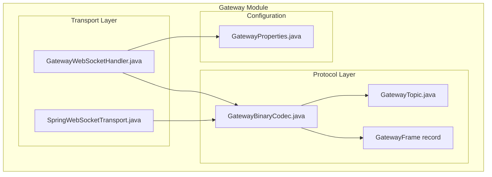
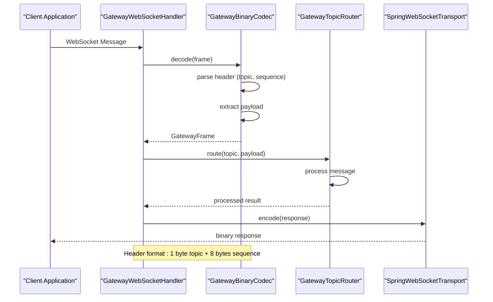
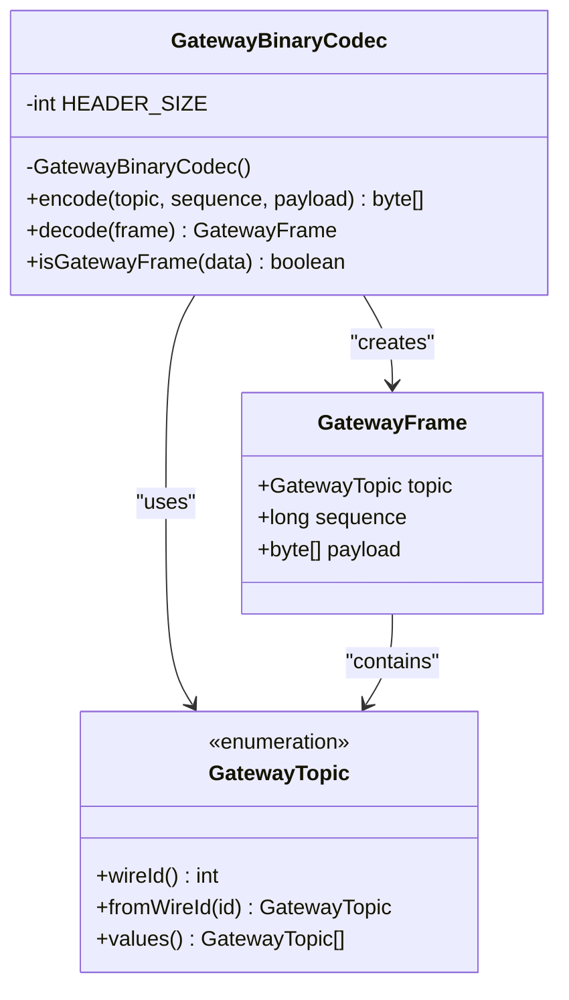
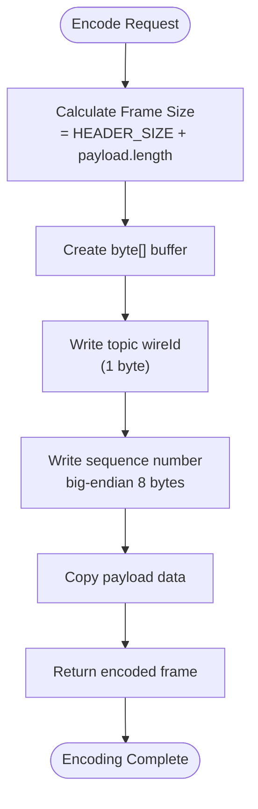
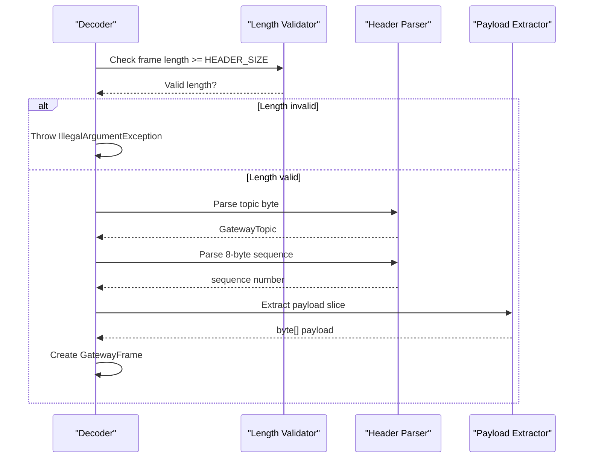
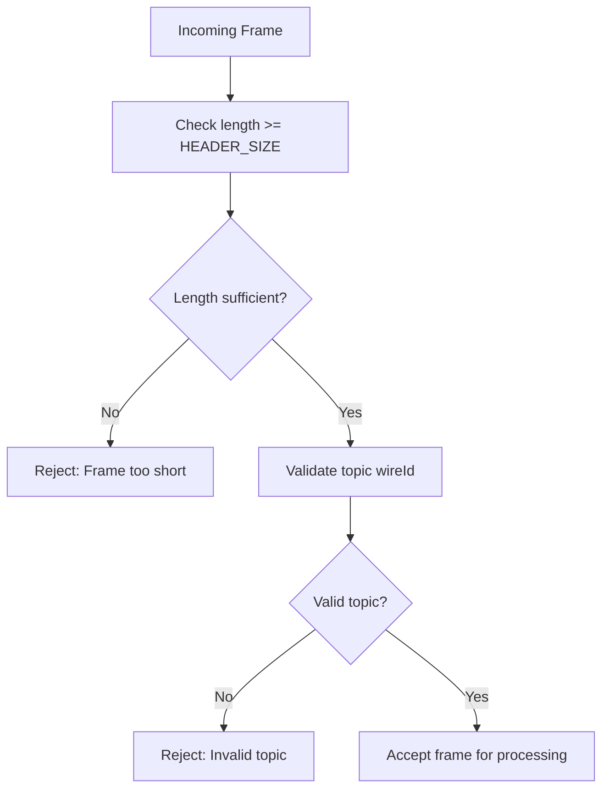

# Binary Protocol Implementation

<cite>
**Referenced Files in This Document**
- [GatewayBinaryCodec.java](file://gateway/src/main/java/com/tradej/gateway/protocol/GatewayBinaryCodec.java)
- [GatewayTopic.java](file://gateway/src/main/java/com/tradej/gateway/protocol/GatewayTopic.java)
- [GatewayWebSocketHandler.java](file://gateway/src/main/java/com/tradej/gateway/websocket/GatewayWebSocketHandler.java)
- [SpringWebSocketTransport.java](file://gateway/src/main/java/com/tradej/gateway/transport/SpringWebSocketTransport.java)
- [GatewayProperties.java](file://gateway/src/main/java/com/tradej/gateway/config/GatewayProperties.java)
</cite>

## Table of Contents
1. [Introduction](#introduction)
2. [Project Structure](#project-structure)
3. [Core Components](#core-components)
4. [Architecture Overview](#architecture-overview)
5. [Detailed Component Analysis](#detailed-component-analysis)
6. [Protocol Specification](#protocol-specification)
7. [Message Formats and Serialization](#message-formats-and-serialization)
8. [Performance Characteristics](#performance-characteristics)
9. [Protocol Evolution and Compatibility](#protocol-evolution-and-compatibility)
10. [Practical Examples](#practical-examples)
11. [Debugging and Troubleshooting](#debugging-and-troubleshooting)
12. [Conclusion](#conclusion)

## Introduction

The Trade-J binary protocol implementation provides a lightweight, efficient communication mechanism for the gateway system. This protocol is designed for high-performance market data streaming and order management operations, utilizing a compact binary format optimized for low-latency transmission over WebSocket connections.

The implementation consists of three primary components: the binary codec for frame encoding/decoding, topic enumeration for message categorization, and transport integration for WebSocket communication. The protocol prioritizes performance through minimal overhead while maintaining extensibility for future enhancements.

## Project Structure

The binary protocol implementation is organized within the gateway module, specifically in the protocol package alongside supporting components for transport and configuration.

**Diagram sources**
- [GatewayBinaryCodec.java:1-69](file://gateway/src/main/java/com/tradej/gateway/protocol/GatewayBinaryCodec.java#L1-L69)
- [GatewayTopic.java:1-50](file://gateway/src/main/java/com/tradej/gateway/protocol/GatewayTopic.java#L1-L50)
- [GatewayWebSocketHandler.java:1-100](file://gateway/src/main/java/com/tradej/gateway/websocket/GatewayWebSocketHandler.java#L1-L100)

**Section sources**
- [GatewayBinaryCodec.java:1-69](file://gateway/src/main/java/com/tradej/gateway/protocol/GatewayBinaryCodec.java#L1-L69)
- [GatewayTopic.java:1-50](file://gateway/src/main/java/com/tradej/gateway/protocol/GatewayTopic.java#L1-L50)

## Core Components

The binary protocol implementation centers around three fundamental components that work together to provide efficient message transmission:

### GatewayBinaryCodec
The primary codec responsible for encoding and decoding binary frames. It implements a fixed-size header format followed by variable-length payload data, providing deterministic frame boundaries and efficient serialization.

### GatewayTopic Enumeration
Defines the categorical classification system for different message types within the protocol. Each topic is assigned a unique wire identifier for efficient frame recognition and routing.

### GatewayFrame Record
Represents the structured data container for decoded frames, encapsulating topic, sequence number, and payload information in a single immutable object.

**Section sources**
- [GatewayBinaryCodec.java:9-32](file://gateway/src/main/java/com/tradej/gateway/protocol/GatewayBinaryCodec.java#L9-L32)
- [GatewayTopic.java:7-25](file://gateway/src/main/java/com/tradej/gateway/protocol/GatewayTopic.java#L7-L25)
- [GatewayBinaryCodec.java:87-95](file://gateway/src/main/java/com/tradej/gateway/protocol/GatewayBinaryCodec.java#L87-L95)

## Architecture Overview

The binary protocol architecture follows a layered approach with clear separation between encoding/decoding logic, message routing, and transport abstraction.

**Diagram sources**
- [GatewayWebSocketHandler.java:1-100](file://gateway/src/main/java/com/tradej/gateway/websocket/GatewayWebSocketHandler.java#L1-L100)
- [GatewayBinaryCodec.java:19-53](file://gateway/src/main/java/com/tradej/gateway/protocol/GatewayBinaryCodec.java#L19-L53)

## Detailed Component Analysis

### GatewayBinaryCodec Implementation

The codec implements a stateless, thread-safe encoding and decoding mechanism optimized for high-frequency message processing. The implementation uses bitwise operations for efficient conversion between primitive types and byte arrays.

**Diagram sources**
- [GatewayBinaryCodec.java:9-69](file://gateway/src/main/java/com/tradej/gateway/protocol/GatewayBinaryCodec.java#L9-L69)
- [GatewayBinaryCodec.java:87-95](file://gateway/src/main/java/com/tradej/gateway/protocol/GatewayBinaryCodec.java#L87-L95)
- [GatewayTopic.java:7-25](file://gateway/src/main/java/com/tradej/gateway/protocol/GatewayTopic.java#L7-L25)

**Section sources**
- [GatewayBinaryCodec.java:13-14](file://gateway/src/main/java/com/tradej/gateway/protocol/GatewayBinaryCodec.java#L13-L14)
- [GatewayBinaryCodec.java:19-32](file://gateway/src/main/java/com/tradej/gateway/protocol/GatewayBinaryCodec.java#L19-L32)
- [GatewayBinaryCodec.java:37-53](file://gateway/src/main/java/com/tradej/gateway/protocol/GatewayBinaryCodec.java#L37-L53)

### Encoding Process

The encoding process transforms structured data into a compact binary format with minimal overhead. The process follows these steps:

1. Calculate total frame size: header size + payload length
2. Write topic identifier as a single byte
3. Serialize sequence number using big-endian 8-byte representation
4. Copy payload data directly into the frame buffer
5. Return the complete binary frame

**Diagram sources**
- [GatewayBinaryCodec.java:19-32](file://gateway/src/main/java/com/tradej/gateway/protocol/GatewayBinaryCodec.java#L19-L32)

**Section sources**
- [GatewayBinaryCodec.java:19-32](file://gateway/src/main/java/com/tradej/gateway/protocol/GatewayBinaryCodec.java#L19-L32)

### Decoding Process

The decoding process reverses the encoding operation, extracting structured information from binary frames with validation and error handling.

**Diagram sources**
- [GatewayBinaryCodec.java:37-53](file://gateway/src/main/java/com/tradej/gateway/protocol/GatewayBinaryCodec.java#L37-L53)

**Section sources**
- [GatewayBinaryCodec.java:37-53](file://gateway/src/main/java/com/tradej/gateway/protocol/GatewayBinaryCodec.java#L37-L53)

## Protocol Specification

### Frame Structure

The binary protocol defines a consistent frame format optimized for performance and simplicity:

| Field | Size (bytes) | Description | Format |
|-------|--------------|-------------|--------|
| Topic Identifier | 1 | Message category/type | Single byte value |
| Sequence Number | 8 | Monotonically increasing counter | Big-endian 64-bit integer |
| Payload | Variable | Message content | Raw byte array |

**Section sources**
- [GatewayBinaryCodec.java:11](file://gateway/src/main/java/com/tradej/gateway/protocol/GatewayBinaryCodec.java#L11)
- [GatewayBinaryCodec.java:19-32](file://gateway/src/main/java/com/tradej/gateway/protocol/GatewayBinaryCodec.java#L19-L32)

### Header Validation

The protocol includes built-in validation mechanisms to ensure frame integrity and prevent malformed data processing.

**Diagram sources**
- [GatewayBinaryCodec.java:37-69](file://gateway/src/main/java/com/tradej/gateway/protocol/GatewayBinaryCodec.java#L37-L69)

**Section sources**
- [GatewayBinaryCodec.java:37-69](file://gateway/src/main/java/com/tradej/gateway/protocol/GatewayBinaryCodec.java#L37-L69)

## Message Formats and Serialization

### Topic Enumeration

The protocol supports multiple message categories through the GatewayTopic enumeration, each assigned a unique wire identifier for efficient processing.

**Section sources**
- [GatewayTopic.java:7-25](file://gateway/src/main/java/com/tradej/gateway/protocol/GatewayTopic.java#L7-L25)

### Sequence Management

The 64-bit sequence number provides reliable message ordering and gap detection capabilities essential for market data synchronization and reconnection scenarios.

**Section sources**
- [GatewayBinaryCodec.java:42-49](file://gateway/src/main/java/com/tradej/gateway/protocol/GatewayBinaryCodec.java#L42-L49)

## Performance Characteristics

### Memory Efficiency

The implementation minimizes memory allocation through direct buffer manipulation and avoids unnecessary object creation during encoding/decoding operations.

### Processing Speed

Bitwise operations and direct array copying enable high-throughput message processing suitable for real-time market data applications.

### Network Optimization

The compact 9-byte header (1 byte topic + 8 bytes sequence) provides significant overhead reduction compared to text-based protocols.

## Protocol Evolution and Compatibility

### Versioning Strategy

The current implementation uses a simple wire identifier system that allows for future protocol versioning through topic enumeration expansion.

### Backward Compatibility

Future protocol versions should maintain the 9-byte header format while extending topic enumeration to preserve compatibility with existing clients.

### Migration Procedures

New protocol versions should implement dual-mode support, accepting both old and new frame formats during transition periods.

## Practical Examples

### Message Construction

To construct a binary message, use the encode method with appropriate topic selection and sequence management.

### Parsing Workflow

The decode method handles frame validation, header extraction, and payload isolation in a single operation.

### Validation Patterns

Use the isGatewayFrame method to quickly identify valid protocol frames before processing.

## Debugging and Troubleshooting

### Common Issues

- Frame length validation failures indicate network corruption or incomplete message reception
- Invalid topic identifiers suggest protocol version mismatches or corrupted data
- Sequence number gaps indicate message loss or reordering in the transport layer

### Diagnostic Approaches

Enable protocol logging at the WebSocket handler level to monitor frame traffic and identify processing bottlenecks.

**Section sources**
- [GatewayWebSocketHandler.java:1-100](file://gateway/src/main/java/com/tradej/gateway/websocket/GatewayWebSocketHandler.java#L1-L100)

## Conclusion

The Trade-J binary protocol implementation provides a robust foundation for high-performance financial data transmission. Its compact design, efficient encoding/decoding mechanisms, and extensible architecture support both current requirements and future protocol evolution needs.

The implementation demonstrates careful consideration of performance, reliability, and maintainability through its stateless design, comprehensive validation, and clear separation of concerns between protocol logic and transport abstraction.