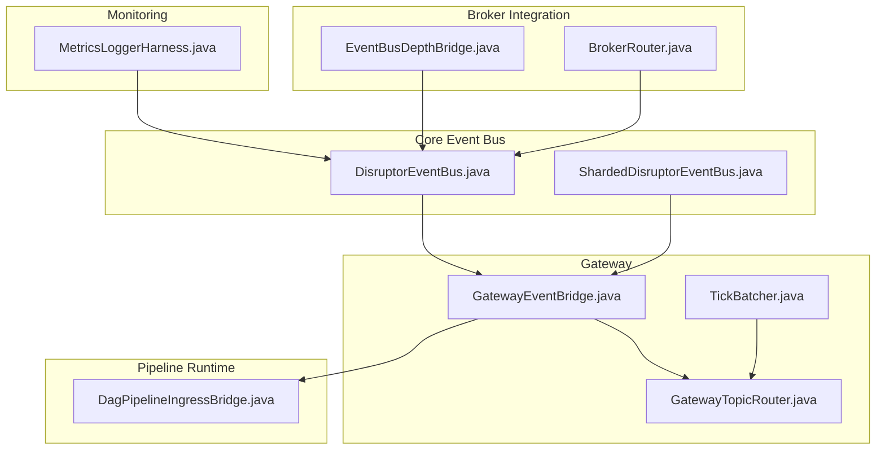
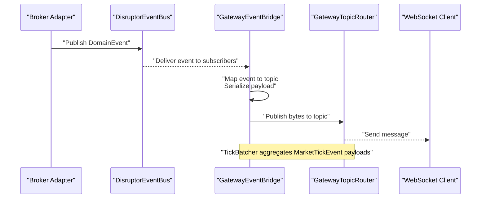
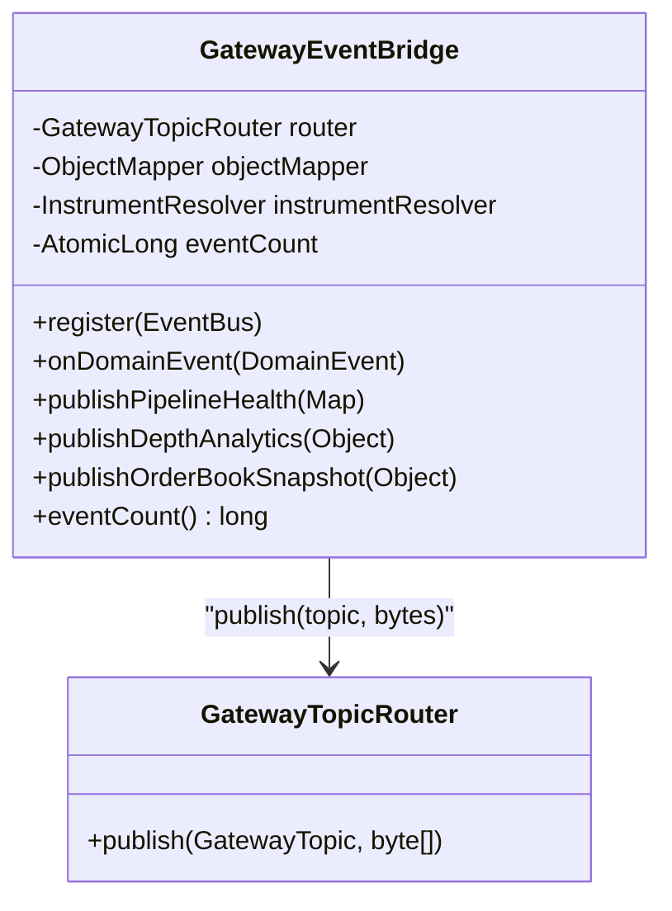
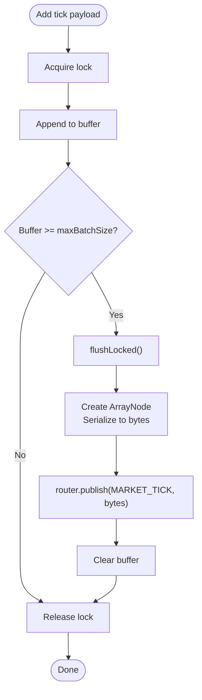
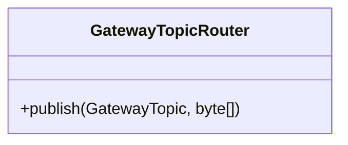
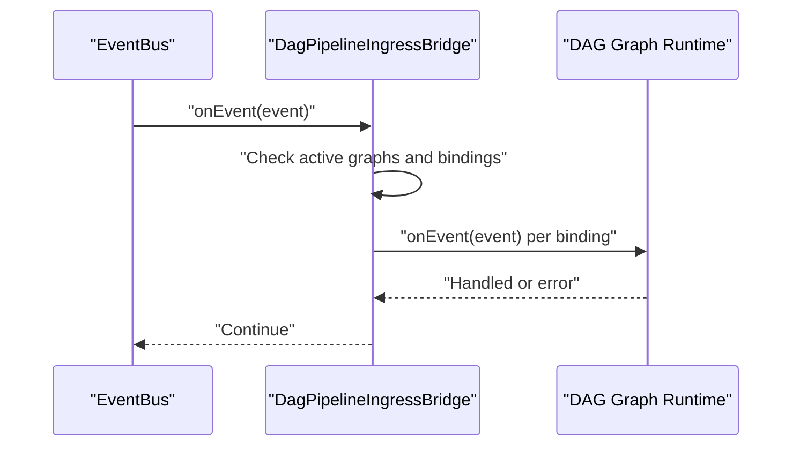
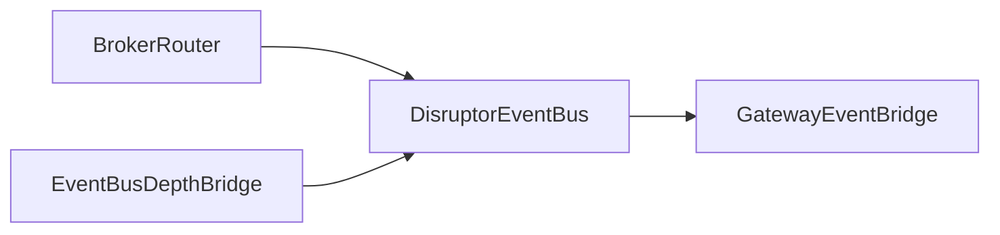
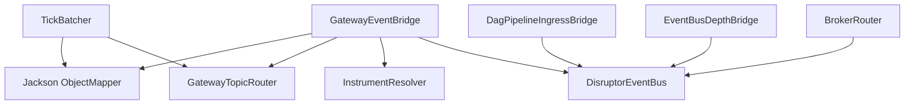

# Event Bridge and Data Streaming

<cite>
**Referenced Files in This Document**
- [GatewayEventBridge.java](file://gateway/src/main/java/com/tradej/gateway/bridge/GatewayEventBridge.java)
- [TickBatcher.java](file://gateway/src/main/java/com/tradej/gateway/bridge/TickBatcher.java)
- [GatewayTopicRouter.java](file://gateway/src/main/java/com/tradej/gateway/router/GatewayTopicRouter.java)
- [DagPipelineIngressBridge.java](file://pipeline/runtime/src/main/java/com/tradej/pipeline/service/DagPipelineIngressBridge.java)
- [DisruptorEventBus.java](file://runtime/disruptor/src/main/java/com/tradej/disruptor/DisruptorEventBus.java)
- [ShardedDisruptorEventBus.java](file://runtime/disruptor/src/main/java/com/tradej/disruptor/ShardedDisruptorEventBus.java)
- [EventBusDepthBridge.java](file://broker/core/src/main/java/com/tradej/broker/core/depth/EventBusDepthBridge.java)
- [BrokerRouter.java](file://broker-gateway/src/main/java/com/tradej/brokergateway/BrokerRouter.java)
- [MetricsLoggerHarness.java](file://app/src/main/java/com/tradej/app/metrics/MetricsLoggerHarness.java)
- [REACTIVE_ADOPTION_REVIEW_2026-06-06.md](file://docs/reports/REACTIVE_ADOPTION_REVIEW_2026-06-06.md)
- [ARCHITECTURE_EVOLUTION_PIPELINE_OS.md](file://docs/archive/ARCHITECTURE_EVOLUTION_PIPELINE_OS.md)
- [2026-06-08-market-data-remediation.md](file://.kilo/plans/2026-06-08-market-data-remediation.md)
- [GatewayEventBridgeTest.java](file://gateway/src/test/java/com/tradej/gateway/bridge/GatewayEventBridgeTest.java)
- [GatewayEventBridgeIntegrationTest.java](file://gateway/src/test/java/com/tradej/gateway/bridge/GatewayEventBridgeIntegrationTest.java)
- [TickBatcherTest.java](file://gateway/src/test/java/com/tradej/gateway/bridge/TickBatcherTest.java)
- [GatewayTopicRouterTest.java](file://gateway/src/test/java/com/tradej/gateway/router/GatewayTopicRouterTest.java)
- [GatewayTopicRouterIsolationTest.java](file://gateway/src/test/java/com/tradej/gateway/router/GatewayTopicRouterIsolationTest.java)
- [PipelineDataIntegrityValidator.java](file://runtime/hotpath/src/main/java/com/tradej/hotpath/PipelineDataIntegrityValidator.java)
</cite>

## Table of Contents
1. [Introduction](#introduction)
2. [Project Structure](#project-structure)
3. [Core Components](#core-components)
4. [Architecture Overview](#architecture-overview)
5. [Detailed Component Analysis](#detailed-component-analysis)
6. [Dependency Analysis](#dependency-analysis)
7. [Performance Considerations](#performance-considerations)
8. [Troubleshooting Guide](#troubleshooting-guide)
9. [Conclusion](#conclusion)
10. [Appendices](#appendices)

## Introduction
This document explains the event bridge and data streaming system that connects domain events to real-time clients via WebSocket topics. It covers the GatewayEventBridge implementation, event processing pipelines, and throughput optimization techniques. It also documents the TickBatcher functionality, batch processing strategies, and latency reduction techniques. Practical examples illustrate event handling, data transformation, and stream processing. Integration points with event buses, market data feeds, and broker adapters are addressed, along with performance monitoring, backpressure handling, and fault tolerance. Guidelines are provided for extending the event bridge, optimizing data flow, and debugging streaming issues.

## Project Structure
The event bridge and streaming system spans several modules:
- Gateway module: event bridging and WebSocket topic publishing
- Pipeline runtime: DAG-based event ingestion and routing
- Disruptor runtime: high-throughput in-process event bus
- Broker integration: market data feeds and broker adapters
- Monitoring and tests: metrics logging, isolation tests, and stress tests

**Diagram sources**
- [DisruptorEventBus.java](file://runtime/disruptor/src/main/java/com/tradej/disruptor/DisruptorEventBus.java)
- [ShardedDisruptorEventBus.java](file://runtime/disruptor/src/main/java/com/tradej/disruptor/ShardedDisruptorEventBus.java)
- [GatewayEventBridge.java](file://gateway/src/main/java/com/tradej/gateway/bridge/GatewayEventBridge.java)
- [TickBatcher.java](file://gateway/src/main/java/com/tradej/gateway/bridge/TickBatcher.java)
- [GatewayTopicRouter.java](file://gateway/src/main/java/com/tradej/gateway/router/GatewayTopicRouter.java)
- [DagPipelineIngressBridge.java](file://pipeline/runtime/src/main/java/com/tradej/pipeline/service/DagPipelineIngressBridge.java)
- [EventBusDepthBridge.java](file://broker/core/src/main/java/com/tradej/broker/core/depth/EventBusDepthBridge.java)
- [BrokerRouter.java](file://broker-gateway/src/main/java/com/tradej/brokergateway/BrokerRouter.java)
- [MetricsLoggerHarness.java](file://app/src/main/java/com/tradej/app/metrics/MetricsLoggerHarness.java)

**Section sources**
- [GatewayEventBridge.java](file://gateway/src/main/java/com/tradej/gateway/bridge/GatewayEventBridge.java)
- [TickBatcher.java](file://gateway/src/main/java/com/tradej/gateway/bridge/TickBatcher.java)
- [GatewayTopicRouter.java](file://gateway/src/main/java/com/tradej/gateway/router/GatewayTopicRouter.java)
- [DagPipelineIngressBridge.java](file://pipeline/runtime/src/main/java/com/tradej/pipeline/service/DagPipelineIngressBridge.java)
- [DisruptorEventBus.java](file://runtime/disruptor/src/main/java/com/tradej/disruptor/DisruptorEventBus.java)
- [ShardedDisruptorEventBus.java](file://runtime/disruptor/src/main/java/com/tradej/disruptor/ShardedDisruptorEventBus.java)
- [EventBusDepthBridge.java](file://broker/core/src/main/java/com/tradej/broker/core/depth/EventBusDepthBridge.java)
- [BrokerRouter.java](file://broker-gateway/src/main/java/com/tradej/brokergateway/BrokerRouter.java)
- [MetricsLoggerHarness.java](file://app/src/main/java/com/tradej/app/metrics/MetricsLoggerHarness.java)

## Core Components
- GatewayEventBridge: Subscribes to domain events, maps them to WebSocket topics, serializes payloads, and publishes to the router. It also exposes helpers for depth analytics and order book snapshots.
- TickBatcher: Buffers MarketTickEvent payloads within a time window and publishes them as a single JSON array to reduce serialization overhead.
- GatewayTopicRouter: Distributes messages to subscribed WebSocket transports per topic.
- DagPipelineIngressBridge: Dispatches domain events to active DAG graphs for pipeline processing.
- DisruptorEventBus and ShardedDisruptorEventBus: High-throughput in-process event buses implementing ring buffers and sharding.
- EventBusDepthBridge: Bridges depth updates to the event bus for downstream consumption.
- BrokerRouter: Routes market data requests to the active broker and supports future failover/load balancing.
- MetricsLoggerHarness: Aggregates and logs operational metrics for observability.

**Section sources**
- [GatewayEventBridge.java](file://gateway/src/main/java/com/tradej/gateway/bridge/GatewayEventBridge.java)
- [TickBatcher.java](file://gateway/src/main/java/com/tradej/gateway/bridge/TickBatcher.java)
- [GatewayTopicRouter.java](file://gateway/src/main/java/com/tradej/gateway/router/GatewayTopicRouter.java)
- [DagPipelineIngressBridge.java](file://pipeline/runtime/src/main/java/com/tradej/pipeline/service/DagPipelineIngressBridge.java)
- [DisruptorEventBus.java](file://runtime/disruptor/src/main/java/com/tradej/disruptor/DisruptorEventBus.java)
- [ShardedDisruptorEventBus.java](file://runtime/disruptor/src/main/java/com/tradej/disruptor/ShardedDisruptorEventBus.java)
- [EventBusDepthBridge.java](file://broker/core/src/main/java/com/tradej/broker/core/depth/EventBusDepthBridge.java)
- [BrokerRouter.java](file://broker-gateway/src/main/java/com/tradej/brokergateway/BrokerRouter.java)
- [MetricsLoggerHarness.java](file://app/src/main/java/com/tradej/app/metrics/MetricsLoggerHarness.java)

## Architecture Overview
The event bridge architecture separates concerns across three planes:
- Event generation: Market data feeds and broker adapters publish domain events to the DisruptorEventBus.
- Bridging and fan-out: GatewayEventBridge consumes events and fans out to GatewayTopicRouter, which delivers to WebSocket clients. TickBatcher optimizes tick throughput.
- Pipeline processing: DagPipelineIngressBridge forwards events to active DAG graphs for computation and analytics.

**Diagram sources**
- [DisruptorEventBus.java](file://runtime/disruptor/src/main/java/com/tradej/disruptor/DisruptorEventBus.java)
- [GatewayEventBridge.java](file://gateway/src/main/java/com/tradej/gateway/bridge/GatewayEventBridge.java)
- [GatewayTopicRouter.java](file://gateway/src/main/java/com/tradej/gateway/router/GatewayTopicRouter.java)

## Detailed Component Analysis

### GatewayEventBridge
GatewayEventBridge is the central bridge between the event bus and the gateway router. It:
- Registers handlers for specific domain event types to minimize dispatch overhead.
- Maps each event to a GatewayTopic and serializes to JSON.
- Publishes to the router and tracks event count.
- Provides helpers for depth analytics and order book snapshots.
- Resolves canonical symbols and exchange segments via InstrumentResolver.

**Diagram sources**
- [GatewayEventBridge.java](file://gateway/src/main/java/com/tradej/gateway/bridge/GatewayEventBridge.java)
- [GatewayTopicRouter.java](file://gateway/src/main/java/com/tradej/gateway/router/GatewayTopicRouter.java)

**Section sources**
- [GatewayEventBridge.java](file://gateway/src/main/java/com/tradej/gateway/bridge/GatewayEventBridge.java)

### TickBatcher
TickBatcher reduces serialization overhead by aggregating MarketTickEvent payloads into a single JSON array within a fixed time window. It:
- Maintains a lock-protected buffer with a max batch size.
- Schedules periodic flushes using a single-threaded executor.
- Publishes aggregated payloads to the router and clears the buffer.

**Diagram sources**
- [TickBatcher.java](file://gateway/src/main/java/com/tradej/gateway/bridge/TickBatcher.java)

**Section sources**
- [TickBatcher.java](file://gateway/src/main/java/com/tradej/gateway/bridge/TickBatcher.java)

### GatewayTopicRouter
GatewayTopicRouter distributes messages to WebSocket transports subscribed to specific topics. It ensures isolation and scalability for fan-out scenarios.

**Diagram sources**
- [GatewayTopicRouter.java](file://gateway/src/main/java/com/tradej/gateway/router/GatewayTopicRouter.java)

**Section sources**
- [GatewayTopicRouter.java](file://gateway/src/main/java/com/tradej/gateway/router/GatewayTopicRouter.java)

### DagPipelineIngressBridge
DagPipelineIngressBridge dispatches domain events to active DAG graphs. It:
- Checks for active graphs and ingress bindings.
- Executes dispatch on a fixed thread pool.
- Logs and swallows exceptions per binding to prevent cascading failures.

**Diagram sources**
- [DagPipelineIngressBridge.java](file://pipeline/runtime/src/main/java/com/tradej/pipeline/service/DagPipelineIngressBridge.java)

**Section sources**
- [DagPipelineIngressBridge.java](file://pipeline/runtime/src/main/java/com/tradej/pipeline/service/DagPipelineIngressBridge.java)

### Event Bus and Broker Integration
- DisruptorEventBus and ShardedDisruptorEventBus provide high-throughput, low-latency event distribution with ring buffers and optional sharding.
- EventBusDepthBridge bridges depth updates to the event bus for downstream consumption.
- BrokerRouter selects the active broker and prepares for future failover and load balancing.

**Diagram sources**
- [BrokerRouter.java](file://broker-gateway/src/main/java/com/tradej/brokergateway/BrokerRouter.java)
- [DisruptorEventBus.java](file://runtime/disruptor/src/main/java/com/tradej/disruptor/DisruptorEventBus.java)
- [EventBusDepthBridge.java](file://broker/core/src/main/java/com/tradej/broker/core/depth/EventBusDepthBridge.java)
- [GatewayEventBridge.java](file://gateway/src/main/java/com/tradej/gateway/bridge/GatewayEventBridge.java)

**Section sources**
- [DisruptorEventBus.java](file://runtime/disruptor/src/main/java/com/tradej/disruptor/DisruptorEventBus.java)
- [ShardedDisruptorEventBus.java](file://runtime/disruptor/src/main/java/com/tradej/disruptor/ShardedDisruptorEventBus.java)
- [EventBusDepthBridge.java](file://broker/core/src/main/java/com/tradej/broker/core/depth/EventBusDepthBridge.java)
- [BrokerRouter.java](file://broker-gateway/src/main/java/com/tradej/brokergateway/BrokerRouter.java)

## Dependency Analysis
The event bridge depends on:
- Event bus implementations for high-throughput event delivery
- Jackson for JSON serialization
- Router for WebSocket topic fan-out
- Instrument resolver for symbol normalization
- Optional per-broker isolation via dedicated event buses

**Diagram sources**
- [GatewayEventBridge.java](file://gateway/src/main/java/com/tradej/gateway/bridge/GatewayEventBridge.java)
- [TickBatcher.java](file://gateway/src/main/java/com/tradej/gateway/bridge/TickBatcher.java)
- [GatewayTopicRouter.java](file://gateway/src/main/java/com/tradej/gateway/router/GatewayTopicRouter.java)
- [DagPipelineIngressBridge.java](file://pipeline/runtime/src/main/java/com/tradej/pipeline/service/DagPipelineIngressBridge.java)
- [DisruptorEventBus.java](file://runtime/disruptor/src/main/java/com/tradej/disruptor/DisruptorEventBus.java)
- [EventBusDepthBridge.java](file://broker/core/src/main/java/com/tradej/broker/core/depth/EventBusDepthBridge.java)
- [BrokerRouter.java](file://broker-gateway/src/main/java/com/tradej/brokergateway/BrokerRouter.java)

**Section sources**
- [GatewayEventBridge.java](file://gateway/src/main/java/com/tradej/gateway/bridge/GatewayEventBridge.java)
- [TickBatcher.java](file://gateway/src/main/java/com/tradej/gateway/bridge/TickBatcher.java)
- [GatewayTopicRouter.java](file://gateway/src/main/java/com/tradej/gateway/router/GatewayTopicRouter.java)
- [DagPipelineIngressBridge.java](file://pipeline/runtime/src/main/java/com/tradej/pipeline/service/DagPipelineIngressBridge.java)
- [DisruptorEventBus.java](file://runtime/disruptor/src/main/java/com/tradej/disruptor/DisruptorEventBus.java)
- [EventBusDepthBridge.java](file://broker/core/src/main/java/com/tradej/broker/core/depth/EventBusDepthBridge.java)
- [BrokerRouter.java](file://broker-gateway/src/main/java/com/tradej/brokergateway/BrokerRouter.java)

## Performance Considerations
- Serialization reduction: TickBatcher aggregates MarketTickEvent payloads to reduce JSON serialization overhead.
- Fan-out optimization: GatewayEventBridge registers narrow subscriptions to avoid unnecessary dispatch.
- Reactive fan-out: The repository recommends replacing the current bridge with a reactive Flux per topic to enable per-client backpressure and improved throughput.
- Determinism vs. throughput: Disruptor provides deterministic replay characteristics and low latency suitable for the hot path; Reactor is recommended for fan-out scenarios.
- Backpressure and isolation: Per-broker event buses with bounded queues and drop-oldest policies isolate slow consumers and prevent head-of-line blocking.

**Section sources**
- [TickBatcher.java](file://gateway/src/main/java/com/tradej/gateway/bridge/TickBatcher.java)
- [GatewayEventBridge.java](file://gateway/src/main/java/com/tradej/gateway/bridge/GatewayEventBridge.java)
- [REACTIVE_ADOPTION_REVIEW_2026-06-06.md](file://docs/reports/REACTIVE_ADOPTION_REVIEW_2026-06-06.md)
- [2026-06-08-market-data-remediation.md](file://.kilo/plans/2026-06-08-market-data-remediation.md)

## Troubleshooting Guide
Common issues and remedies:
- Null or malformed events: GatewayEventBridge logs warnings and continues; validate upstream producers.
- Slow clients: The reactive fan-out recommendation enables per-client backpressure; consider adopting the reactive bridge design.
- Serialization errors: Verify payload builders and ObjectMapper configuration.
- Batch flush failures: TickBatcher logs failures and clears the buffer; inspect flush intervals and max batch sizes.
- Pipeline dispatch errors: DagPipelineIngressBridge logs and swallows per-binding exceptions; review graph configurations and node implementations.
- Metrics visibility: Use MetricsLoggerHarness to collect and log operational metrics for ring buffer capacity, tick rates, and broker connectivity.

**Section sources**
- [GatewayEventBridge.java](file://gateway/src/main/java/com/tradej/gateway/bridge/GatewayEventBridge.java)
- [TickBatcher.java](file://gateway/src/main/java/com/tradej/gateway/bridge/TickBatcher.java)
- [DagPipelineIngressBridge.java](file://pipeline/runtime/src/main/java/com/tradej/pipeline/service/DagPipelineIngressBridge.java)
- [MetricsLoggerHarness.java](file://app/src/main/java/com/tradej/app/metrics/MetricsLoggerHarness.java)

## Conclusion
The event bridge and data streaming system combines a high-throughput event bus, targeted bridging, and efficient fan-out to deliver real-time market data and derived signals to clients. TickBatcher and targeted subscriptions optimize throughput, while the reactive fan-out pathway offers scalable per-client backpressure. Integrations with broker adapters and pipeline graphs enable comprehensive trading workflows. Observability and isolation strategies ensure robust operation under load.

## Appendices

### Practical Examples
- Event handling: GatewayEventBridge maps MarketTickEvent, DepthUpdateEvent, and candle events to topics and serializes payloads.
- Data transformation: Payload builders construct JSON nodes with symbol normalization and segment resolution.
- Stream processing: TickBatcher aggregates tick payloads into arrays for reduced serialization overhead.
- Pipeline integration: DagPipelineIngressBridge forwards events to active DAG graphs for computation.

**Section sources**
- [GatewayEventBridge.java](file://gateway/src/main/java/com/tradej/gateway/bridge/GatewayEventBridge.java)
- [TickBatcher.java](file://gateway/src/main/java/com/tradej/gateway/bridge/TickBatcher.java)
- [DagPipelineIngressBridge.java](file://pipeline/runtime/src/main/java/com/tradej/pipeline/service/DagPipelineIngressBridge.java)

### Extending the Event Bridge
- Add new event types: Extend GatewayEventBridge.register and onDomainEvent switch to handle new event classes.
- Introduce new topics: Define GatewayTopic entries and update router publishing logic.
- Optimize serialization: Tune ObjectMapper configuration and payload builders for new event shapes.
- Adopt reactive fan-out: Replace synchronous router dispatch with a reactive Flux per topic and per-client backpressure.

**Section sources**
- [GatewayEventBridge.java](file://gateway/src/main/java/com/tradej/gateway/bridge/GatewayEventBridge.java)
- [REACTIVE_ADOPTION_REVIEW_2026-06-06.md](file://docs/reports/REACTIVE_ADOPTION_REVIEW_2026-06-06.md)

### Debugging Streaming Issues
- Validate event counts: Use GatewayEventBridge.eventCount and MetricsLoggerHarness to monitor throughput.
- Inspect router behavior: Use GatewayTopicRouter tests to verify topic fan-out correctness.
- Stress and isolation: Leverage TickBatcherTest and GatewayTopicRouter isolation tests to validate behavior under load.

**Section sources**
- [GatewayEventBridge.java](file://gateway/src/main/java/com/tradej/gateway/bridge/GatewayEventBridge.java)
- [MetricsLoggerHarness.java](file://app/src/main/java/com/tradej/app/metrics/MetricsLoggerHarness.java)
- [GatewayTopicRouterTest.java](file://gateway/src/test/java/com/tradej/gateway/router/GatewayTopicRouterTest.java)
- [GatewayTopicRouterIsolationTest.java](file://gateway/src/test/java/com/tradej/gateway/router/GatewayTopicRouterIsolationTest.java)
- [TickBatcherTest.java](file://gateway/src/test/java/com/tradej/gateway/bridge/TickBatcherTest.java)

### Data Integrity and Monitoring
- Pipeline integrity: Use PipelineDataIntegrityValidator to track ingress, processed, egress, and dropped event counts by symbol.
- Operational metrics: MetricsLoggerHarness collects ring buffer capacity, tick totals/rates, and broker connection metrics.

**Section sources**
- [PipelineDataIntegrityValidator.java](file://runtime/hotpath/src/main/java/com/tradej/hotpath/PipelineDataIntegrityValidator.java)
- [MetricsLoggerHarness.java](file://app/src/main/java/com/tradej/app/metrics/MetricsLoggerHarness.java)