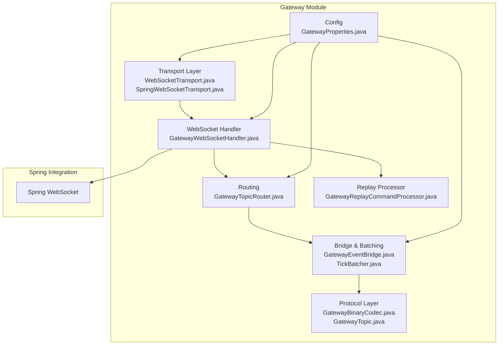
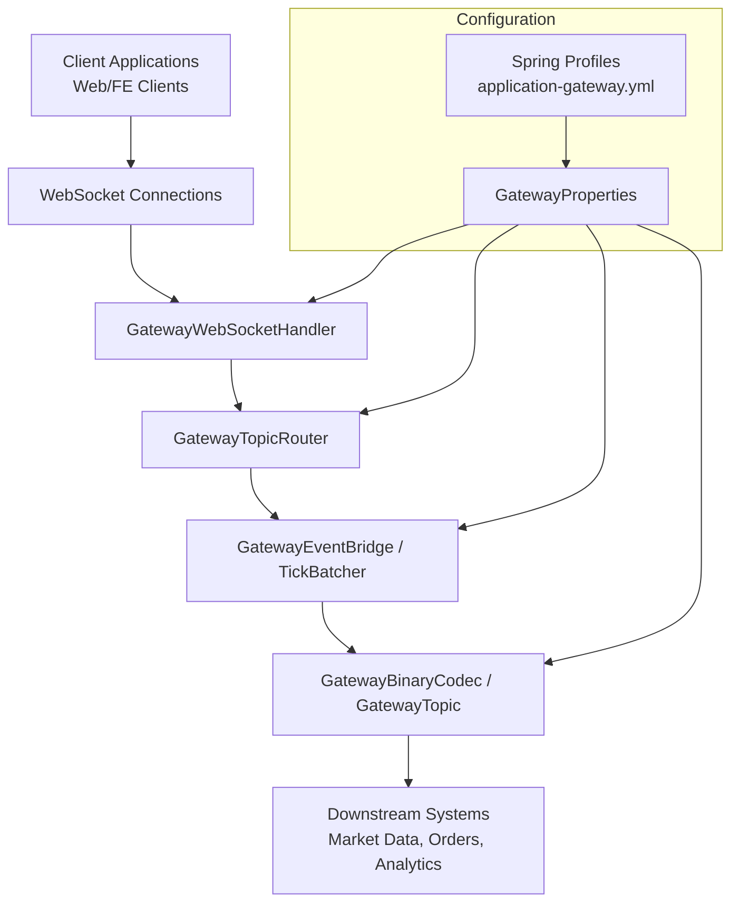
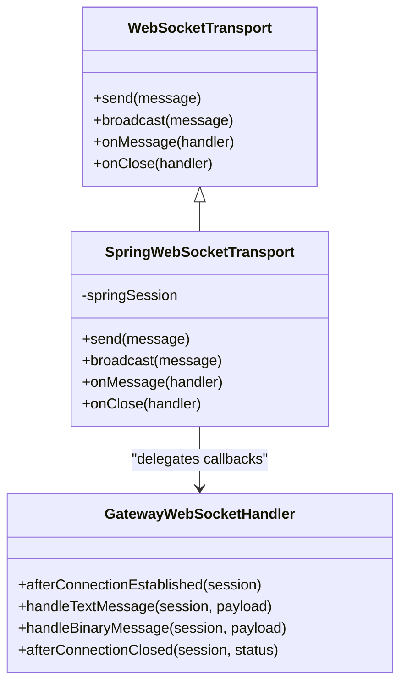
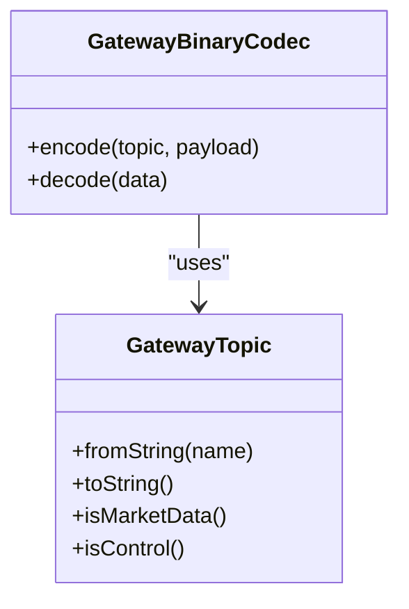
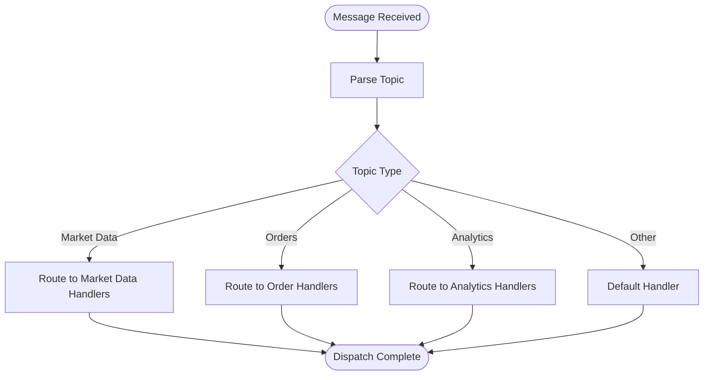
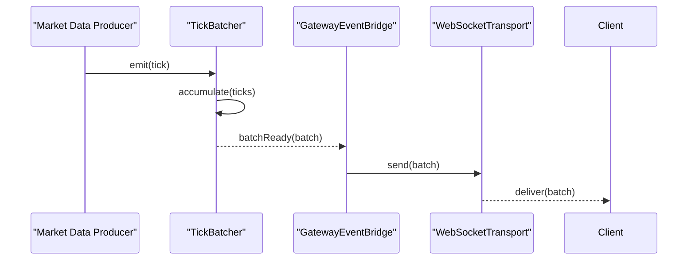
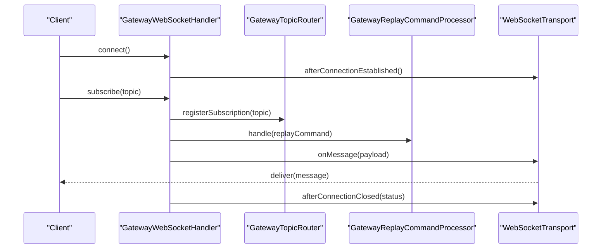
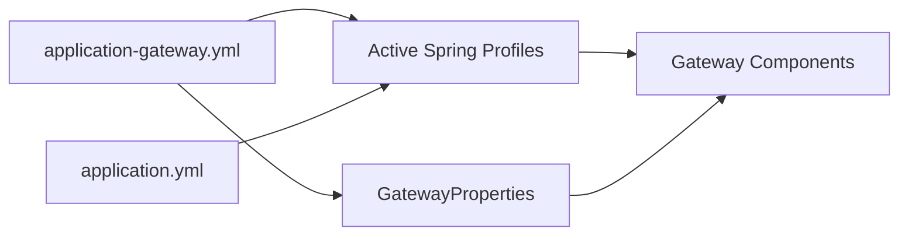
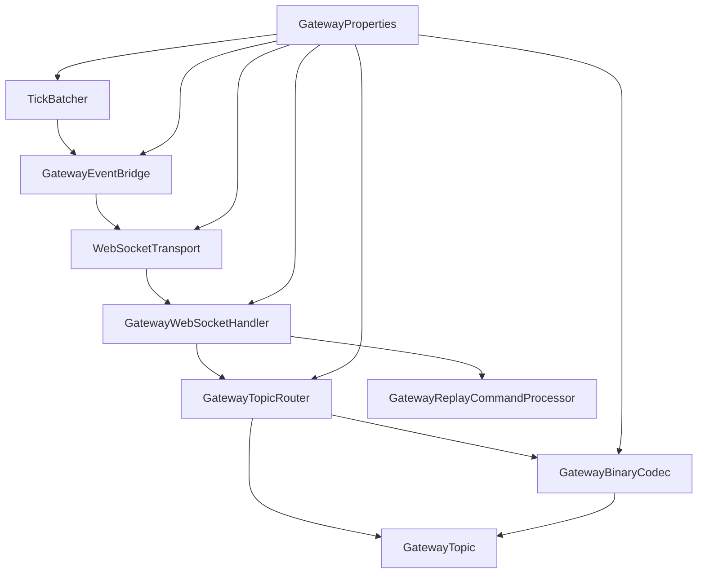
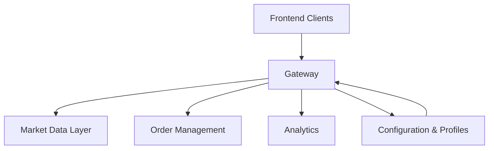

# Gateway Architecture

<cite>
**Referenced Files in This Document**
- [GatewayWebSocketHandler.java](file://gateway/src/main/java/com/tradej/gateway/websocket/GatewayWebSocketHandler.java)
- [SpringWebSocketTransport.java](file://gateway/src/main/java/com/tradej/gateway/transport/SpringWebSocketTransport.java)
- [WebSocketTransport.java](file://gateway/src/main/java/com/tradej/gateway/transport/WebSocketTransport.java)
- [GatewayTopicRouter.java](file://gateway/src/main/java/com/tradej/gateway/router/GatewayTopicRouter.java)
- [GatewayBinaryCodec.java](file://gateway/src/main/java/com/tradej/gateway/protocol/GatewayBinaryCodec.java)
- [GatewayTopic.java](file://gateway/src/main/java/com/tradej/gateway/protocol/GatewayTopic.java)
- [GatewayEventBridge.java](file://gateway/src/main/java/com/tradej/gateway/bridge/GatewayEventBridge.java)
- [TickBatcher.java](file://gateway/src/main/java/com/tradej/gateway/bridge/TickBatcher.java)
- [GatewayReplayCommandProcessor.java](file://gateway/src/main/java/com/tradej/gateway/websocket/GatewayReplayCommandProcessor.java)
- [GatewayProperties.java](file://gateway/src/main/java/com/tradej/gateway/config/GatewayProperties.java)
- [application-gateway.yml](file://app/src/main/resources/application-gateway.yml)
- [application.yml](file://app/src/main/resources/application.yml)
- [GatewayWebSocketLifecycleTest.java](file://app/src/test/java/com/tradej/app/integration/GatewayWebSocketLifecycleTest.java)
- [GatewayLiveBenchmark.java](file://app/src/test/java/com/tradej/app/integration/GatewayLiveBenchmark.java)
- [GatewayCheckSpeedLiveTest.java](file://app/src/test/java/com/tradej/app/integration/GatewayCheckSpeedLiveTest.java)
- [GatewayMarketFeedWebSocketFullIntegrationTest.java](file://app/src/test/java/com/tradej/app/integration/GatewayMarketFeedWebSocketFullIntegrationTest.java)
- [GatewayMarketFeedWebSocketIntegrationTest.java](file://app/src/test/java/com/tradej/app/integration/GatewayMarketFeedWebSocketIntegrationTest.java)
- [GatewayMarketFeedWebSocketQuoteIntegrationTest.java](file://app/src/test/java/com/tradej/app/integration/GatewayMarketFeedWebSocketQuoteIntegrationTest.java)
- [GatewayReplaySmokeTest.java](file://app/src/test/java/com/tradej/app/integration/GatewayReplaySmokeTest.java)
- [GatewayProfileContextComponentTest.java](file://app/src/test/java/com/tradej/app/config/GatewayProfileContextComponentTest.java)
- [GatewayRouterTest.java](file://gateway/src/test/java/com/tradej/gateway/router/GatewayRouterTest.java)
- [GatewayBridgeTest.java](file://gateway/src/test/java/com/tradej/gateway/bridge/GatewayBridgeTest.java)
</cite>

## Table of Contents
1. [Introduction](#introduction)
2. [Project Structure](#project-structure)
3. [Core Components](#core-components)
4. [Architecture Overview](#architecture-overview)
5. [Detailed Component Analysis](#detailed-component-analysis)
6. [Dependency Analysis](#dependency-analysis)
7. [Performance Considerations](#performance-considerations)
8. [Troubleshooting Guide](#troubleshooting-guide)
9. [Conclusion](#conclusion)
10. [Appendices](#appendices)

## Introduction
This document describes the WebSocket gateway system architecture for the trading platform. It explains the high-level design patterns, component interactions, and system boundaries. The gateway integrates with the Spring WebSocket framework while supporting custom transport implementations. It manages WebSocket connections, routes messages by topics, encodes/decodes binary payloads, batches market data updates, and coordinates replay commands. Configuration is managed via Spring profiles and YAML properties, enabling environment-specific settings. The document also covers scalability considerations, connection lifecycle management, and the gateway's role within the broader trading ecosystem.

## Project Structure
The gateway module is organized around transport abstraction, protocol encoding, routing, bridging, and Spring WebSocket integration:

- Transport layer: defines the WebSocket transport interface and Spring-based implementation
- Protocol layer: binary codec and topic model for message framing
- Routing: topic-based routing of inbound/outbound messages
- Bridge: event bridging and tick batching for efficient downstream consumption
- Websocket handler: Spring WebSocket handler coordinating lifecycle and replay
- Config: gateway properties and Spring profile-driven configuration

**Diagram sources**
- [WebSocketTransport.java](file://gateway/src/main/java/com/tradej/gateway/transport/WebSocketTransport.java)
- [SpringWebSocketTransport.java](file://gateway/src/main/java/com/tradej/gateway/transport/SpringWebSocketTransport.java)
- [GatewayBinaryCodec.java](file://gateway/src/main/java/com/tradej/gateway/protocol/GatewayBinaryCodec.java)
- [GatewayTopic.java](file://gateway/src/main/java/com/tradej/gateway/protocol/GatewayTopic.java)
- [GatewayTopicRouter.java](file://gateway/src/main/java/com/tradej/gateway/router/GatewayTopicRouter.java)
- [GatewayEventBridge.java](file://gateway/src/main/java/com/tradej/gateway/bridge/GatewayEventBridge.java)
- [TickBatcher.java](file://gateway/src/main/java/com/tradej/gateway/bridge/TickBatcher.java)
- [GatewayWebSocketHandler.java](file://gateway/src/main/java/com/tradej/gateway/websocket/GatewayWebSocketHandler.java)
- [GatewayReplayCommandProcessor.java](file://gateway/src/main/java/com/tradej/gateway/websocket/GatewayReplayCommandProcessor.java)
- [GatewayProperties.java](file://gateway/src/main/java/com/tradej/gateway/config/GatewayProperties.java)

**Section sources**
- [WebSocketTransport.java](file://gateway/src/main/java/com/tradej/gateway/transport/WebSocketTransport.java)
- [SpringWebSocketTransport.java](file://gateway/src/main/java/com/tradej/gateway/transport/SpringWebSocketTransport.java)
- [GatewayBinaryCodec.java](file://gateway/src/main/java/com/tradej/gateway/protocol/GatewayBinaryCodec.java)
- [GatewayTopic.java](file://gateway/src/main/java/com/tradej/gateway/protocol/GatewayTopic.java)
- [GatewayTopicRouter.java](file://gateway/src/main/java/com/tradej/gateway/router/GatewayTopicRouter.java)
- [GatewayEventBridge.java](file://gateway/src/main/java/com/tradej/gateway/bridge/GatewayEventBridge.java)
- [TickBatcher.java](file://gateway/src/main/java/com/tradej/gateway/bridge/TickBatcher.java)
- [GatewayWebSocketHandler.java](file://gateway/src/main/java/com/tradej/gateway/websocket/GatewayWebSocketHandler.java)
- [GatewayReplayCommandProcessor.java](file://gateway/src/main/java/com/tradej/gateway/websocket/GatewayReplayCommandProcessor.java)
- [GatewayProperties.java](file://gateway/src/main/java/com/tradej/gateway/config/GatewayProperties.java)

## Core Components
- Transport abstraction: decouples WebSocket transport from application logic, enabling pluggable implementations
- Spring WebSocket transport: bridges the gateway to Spring’s WebSocket infrastructure
- Binary codec and topic model: define the wire protocol for market data and control messages
- Topic router: routes inbound/outbound messages by topic to appropriate handlers
- Event bridge and tick batcher: aggregates frequent updates for efficient delivery
- WebSocket handler: manages connection lifecycle, message dispatch, and replay commands
- Properties and configuration: environment-specific settings via Spring profiles and YAML

**Section sources**
- [WebSocketTransport.java](file://gateway/src/main/java/com/tradej/gateway/transport/WebSocketTransport.java)
- [SpringWebSocketTransport.java](file://gateway/src/main/java/com/tradej/gateway/transport/SpringWebSocketTransport.java)
- [GatewayBinaryCodec.java](file://gateway/src/main/java/com/tradej/gateway/protocol/GatewayBinaryCodec.java)
- [GatewayTopic.java](file://gateway/src/main/java/com/tradej/gateway/protocol/GatewayTopic.java)
- [GatewayTopicRouter.java](file://gateway/src/main/java/com/tradej/gateway/router/GatewayTopicRouter.java)
- [GatewayEventBridge.java](file://gateway/src/main/java/com/tradej/gateway/bridge/GatewayEventBridge.java)
- [TickBatcher.java](file://gateway/src/main/java/com/tradej/gateway/bridge/TickBatcher.java)
- [GatewayWebSocketHandler.java](file://gateway/src/main/java/com/tradej/gateway/websocket/GatewayWebSocketHandler.java)
- [GatewayProperties.java](file://gateway/src/main/java/com/tradej/gateway/config/GatewayProperties.java)

## Architecture Overview
The gateway sits between the trading frontend and backend systems. It receives WebSocket connections from clients, decodes binary messages, routes them by topic, batches frequent updates, and forwards them to downstream systems. It also supports replay commands for historical data playback and maintains environment-specific configuration.

**Diagram sources**
- [GatewayWebSocketHandler.java](file://gateway/src/main/java/com/tradej/gateway/websocket/GatewayWebSocketHandler.java)
- [GatewayTopicRouter.java](file://gateway/src/main/java/com/tradej/gateway/router/GatewayTopicRouter.java)
- [GatewayEventBridge.java](file://gateway/src/main/java/com/tradej/gateway/bridge/GatewayEventBridge.java)
- [TickBatcher.java](file://gateway/src/main/java/com/tradej/gateway/bridge/TickBatcher.java)
- [GatewayBinaryCodec.java](file://gateway/src/main/java/com/tradej/gateway/protocol/GatewayBinaryCodec.java)
- [GatewayTopic.java](file://gateway/src/main/java/com/tradej/gateway/protocol/GatewayTopic.java)
- [GatewayProperties.java](file://gateway/src/main/java/com/tradej/gateway/config/GatewayProperties.java)
- [application-gateway.yml](file://app/src/main/resources/application-gateway.yml)

## Detailed Component Analysis

### Transport Layer
The transport layer abstracts WebSocket connectivity:
- WebSocketTransport: defines the transport contract for sending/receiving messages and managing sessions
- SpringWebSocketTransport: implements the transport using Spring WebSocket infrastructure, delegating lifecycle events and message handling to the gateway handler

**Diagram sources**
- [WebSocketTransport.java](file://gateway/src/main/java/com/tradej/gateway/transport/WebSocketTransport.java)
- [SpringWebSocketTransport.java](file://gateway/src/main/java/com/tradej/gateway/transport/SpringWebSocketTransport.java)
- [GatewayWebSocketHandler.java](file://gateway/src/main/java/com/tradej/gateway/websocket/GatewayWebSocketHandler.java)

**Section sources**
- [WebSocketTransport.java](file://gateway/src/main/java/com/tradej/gateway/transport/WebSocketTransport.java)
- [SpringWebSocketTransport.java](file://gateway/src/main/java/com/tradej/gateway/transport/SpringWebSocketTransport.java)

### Protocol Encoding and Topic Model
The protocol layer defines the wire format and topic taxonomy:
- GatewayBinaryCodec: encodes/decodes binary payloads for market data and control messages
- GatewayTopic: enumerates topics (e.g., market data streams, order updates, replay commands) and provides parsing/formatting helpers

**Diagram sources**
- [GatewayBinaryCodec.java](file://gateway/src/main/java/com/tradej/gateway/protocol/GatewayBinaryCodec.java)
- [GatewayTopic.java](file://gateway/src/main/java/com/tradej/gateway/protocol/GatewayTopic.java)

**Section sources**
- [GatewayBinaryCodec.java](file://gateway/src/main/java/com/tradej/gateway/protocol/GatewayBinaryCodec.java)
- [GatewayTopic.java](file://gateway/src/main/java/com/tradej/gateway/protocol/GatewayTopic.java)

### Routing and Message Dispatch
The router directs messages by topic:
- GatewayTopicRouter: routes inbound messages to registered handlers per topic and manages outbound routing for broadcast and targeted delivery

**Diagram sources**
- [GatewayTopicRouter.java](file://gateway/src/main/java/com/tradej/gateway/router/GatewayTopicRouter.java)

**Section sources**
- [GatewayTopicRouter.java](file://gateway/src/main/java/com/tradej/gateway/router/GatewayTopicRouter.java)

### Bridging and Batching
The bridge and batcher optimize throughput for high-frequency data:
- GatewayEventBridge: bridges internal events to the transport layer
- TickBatcher: aggregates frequent ticks and emits consolidated batches to reduce overhead

**Diagram sources**
- [TickBatcher.java](file://gateway/src/main/java/com/tradej/gateway/bridge/TickBatcher.java)
- [GatewayEventBridge.java](file://gateway/src/main/java/com/tradej/gateway/bridge/GatewayEventBridge.java)
- [WebSocketTransport.java](file://gateway/src/main/java/com/tradej/gateway/transport/WebSocketTransport.java)

**Section sources**
- [GatewayEventBridge.java](file://gateway/src/main/java/com/tradej/gateway/bridge/GatewayEventBridge.java)
- [TickBatcher.java](file://gateway/src/main/java/com/tradej/gateway/bridge/TickBatcher.java)

### WebSocket Handler and Lifecycle
The handler coordinates connection lifecycle and message processing:
- GatewayWebSocketHandler: establishes sessions, handles text/binary messages, manages subscriptions, and delegates to replay processor for historical playback

**Diagram sources**
- [GatewayWebSocketHandler.java](file://gateway/src/main/java/com/tradej/gateway/websocket/GatewayWebSocketHandler.java)
- [GatewayReplayCommandProcessor.java](file://gateway/src/main/java/com/tradej/gateway/websocket/GatewayReplayCommandProcessor.java)
- [GatewayTopicRouter.java](file://gateway/src/main/java/com/tradej/gateway/router/GatewayTopicRouter.java)
- [WebSocketTransport.java](file://gateway/src/main/java/com/tradej/gateway/transport/WebSocketTransport.java)

**Section sources**
- [GatewayWebSocketHandler.java](file://gateway/src/main/java/com/tradej/gateway/websocket/GatewayWebSocketHandler.java)
- [GatewayReplayCommandProcessor.java](file://gateway/src/main/java/com/tradej/gateway/websocket/GatewayReplayCommandProcessor.java)

### Configuration Management
Configuration is driven by Spring profiles and YAML:
- application-gateway.yml: gateway-specific overrides and environment settings
- application.yml: base application configuration and profile activation
- GatewayProperties: typed configuration properties bound to the gateway runtime

**Diagram sources**
- [application-gateway.yml](file://app/src/main/resources/application-gateway.yml)
- [application.yml](file://app/src/main/resources/application.yml)
- [GatewayProperties.java](file://gateway/src/main/java/com/tradej/gateway/config/GatewayProperties.java)

**Section sources**
- [application-gateway.yml](file://app/src/main/resources/application-gateway.yml)
- [application.yml](file://app/src/main/resources/application.yml)
- [GatewayProperties.java](file://gateway/src/main/java/com/tradej/gateway/config/GatewayProperties.java)

## Dependency Analysis
The gateway components exhibit low coupling and high cohesion:
- Transport depends on handler for lifecycle callbacks
- Handler depends on router, codec, and replay processor
- Router depends on topic model and handlers
- Bridge and batcher depend on codec and transport
- Properties drive wiring of all components

**Diagram sources**
- [WebSocketTransport.java](file://gateway/src/main/java/com/tradej/gateway/transport/WebSocketTransport.java)
- [GatewayWebSocketHandler.java](file://gateway/src/main/java/com/tradej/gateway/websocket/GatewayWebSocketHandler.java)
- [GatewayTopicRouter.java](file://gateway/src/main/java/com/tradej/gateway/router/GatewayTopicRouter.java)
- [GatewayReplayCommandProcessor.java](file://gateway/src/main/java/com/tradej/gateway/websocket/GatewayReplayCommandProcessor.java)
- [GatewayBinaryCodec.java](file://gateway/src/main/java/com/tradej/gateway/protocol/GatewayBinaryCodec.java)
- [GatewayTopic.java](file://gateway/src/main/java/com/tradej/gateway/protocol/GatewayTopic.java)
- [GatewayEventBridge.java](file://gateway/src/main/java/com/tradej/gateway/bridge/GatewayEventBridge.java)
- [TickBatcher.java](file://gateway/src/main/java/com/tradej/gateway/bridge/TickBatcher.java)
- [GatewayProperties.java](file://gateway/src/main/java/com/tradej/gateway/config/GatewayProperties.java)

**Section sources**
- [GatewayWebSocketHandler.java](file://gateway/src/main/java/com/tradej/gateway/websocket/GatewayWebSocketHandler.java)
- [GatewayTopicRouter.java](file://gateway/src/main/java/com/tradej/gateway/router/GatewayTopicRouter.java)
- [GatewayEventBridge.java](file://gateway/src/main/java/com/tradej/gateway/bridge/GatewayEventBridge.java)
- [TickBatcher.java](file://gateway/src/main/java/com/tradej/gateway/bridge/TickBatcher.java)
- [GatewayBinaryCodec.java](file://gateway/src/main/java/com/tradej/gateway/protocol/GatewayBinaryCodec.java)
- [GatewayTopic.java](file://gateway/src/main/java/com/tradej/gateway/protocol/GatewayTopic.java)
- [GatewayProperties.java](file://gateway/src/main/java/com/tradej/gateway/config/GatewayProperties.java)

## Performance Considerations
- Connection pooling and concurrency: configure thread pools and connection limits via Spring WebSocket and Netty/Tomcat settings in the application profiles
- Message batching: use TickBatcher to reduce network overhead for high-frequency market data
- Binary codec efficiency: GatewayBinaryCodec minimizes serialization costs for large payloads
- Router fan-out: route only necessary topics to reduce downstream processing load
- Replay throttling: control replay rates to avoid overwhelming clients during historical playback
- Resource management: monitor CPU, memory, and network utilization; adjust JVM and container limits accordingly

[No sources needed since this section provides general guidance]

## Troubleshooting Guide
Common issues and diagnostics:
- Connection failures: verify Spring WebSocket configuration and transport readiness
- Message routing errors: confirm topic registration and handler availability
- Replay command failures: validate replay command parsing and historical data availability
- Configuration drift: ensure active Spring profiles match environment and GatewayProperties values
- Integration tests: leverage existing tests for lifecycle, speed, replay, and market feed scenarios

**Section sources**
- [GatewayWebSocketLifecycleTest.java](file://app/src/test/java/com/tradej/app/integration/GatewayWebSocketLifecycleTest.java)
- [GatewayLiveBenchmark.java](file://app/src/test/java/com/tradej/app/integration/GatewayLiveBenchmark.java)
- [GatewayCheckSpeedLiveTest.java](file://app/src/test/java/com/tradej/app/integration/GatewayCheckSpeedLiveTest.java)
- [GatewayMarketFeedWebSocketFullIntegrationTest.java](file://app/src/test/java/com/tradej/app/integration/GatewayMarketFeedWebSocketFullIntegrationTest.java)
- [GatewayMarketFeedWebSocketIntegrationTest.java](file://app/src/test/java/com/tradej/app/integration/GatewayMarketFeedWebSocketIntegrationTest.java)
- [GatewayMarketFeedWebSocketQuoteIntegrationTest.java](file://app/src/test/java/com/tradej/app/integration/GatewayMarketFeedWebSocketQuoteIntegrationTest.java)
- [GatewayReplaySmokeTest.java](file://app/src/test/java/com/tradej/app/integration/GatewayReplaySmokeTest.java)
- [GatewayProfileContextComponentTest.java](file://app/src/test/java/com/tradej/app/config/GatewayProfileContextComponentTest.java)
- [GatewayRouterTest.java](file://gateway/src/test/java/com/tradej/gateway/router/GatewayRouterTest.java)
- [GatewayBridgeTest.java](file://gateway/src/test/java/com/tradej/gateway/bridge/GatewayBridgeTest.java)

## Conclusion
The WebSocket gateway provides a modular, extensible foundation for real-time market data distribution and control messaging. Its layered design—transport abstraction, protocol encoding, routing, bridging, and Spring integration—enables clean separation of concerns and environment-specific configuration. With batching, replay support, and robust testing, the gateway scales effectively while maintaining reliability across diverse trading environments.

[No sources needed since this section summarizes without analyzing specific files]

## Appendices

### System Context Diagram
The gateway operates within the trading platform as a central conduit for real-time data and commands.

[No sources needed since this diagram shows conceptual workflow, not actual code structure]

### Integration Points
- Spring WebSocket: transport and session lifecycle
- Topic router: message routing and subscription management
- Binary codec: wire protocol encoding/decoding
- Replay processor: historical data playback coordination
- Event bridge and batcher: downstream delivery optimization

**Section sources**
- [GatewayWebSocketHandler.java](file://gateway/src/main/java/com/tradej/gateway/websocket/GatewayWebSocketHandler.java)
- [GatewayTopicRouter.java](file://gateway/src/main/java/com/tradej/gateway/router/GatewayTopicRouter.java)
- [GatewayBinaryCodec.java](file://gateway/src/main/java/com/tradej/gateway/protocol/GatewayBinaryCodec.java)
- [GatewayReplayCommandProcessor.java](file://gateway/src/main/java/com/tradej/gateway/websocket/GatewayReplayCommandProcessor.java)
- [GatewayEventBridge.java](file://gateway/src/main/java/com/tradej/gateway/bridge/GatewayEventBridge.java)
- [TickBatcher.java](file://gateway/src/main/java/com/tradej/gateway/bridge/TickBatcher.java)