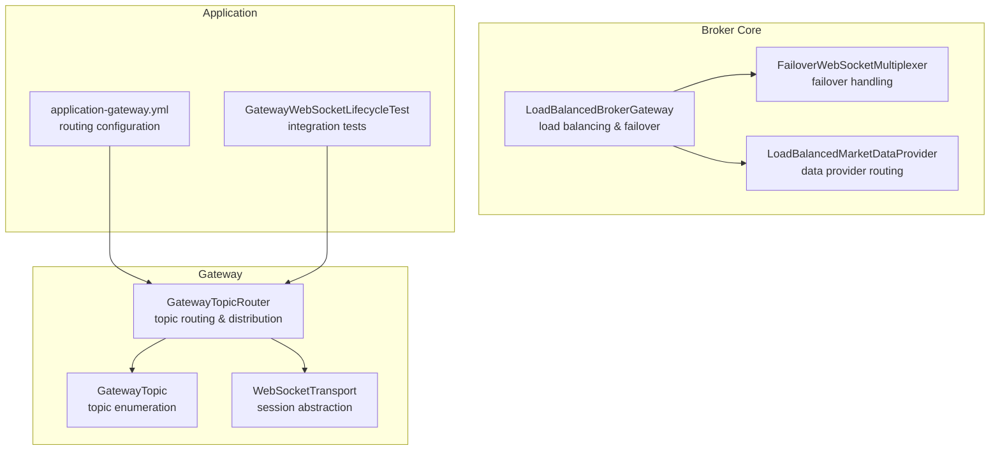
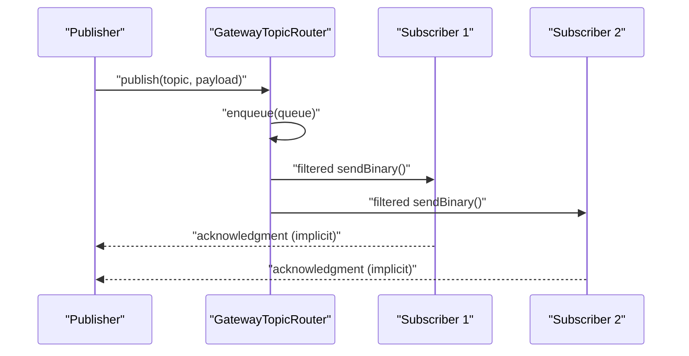
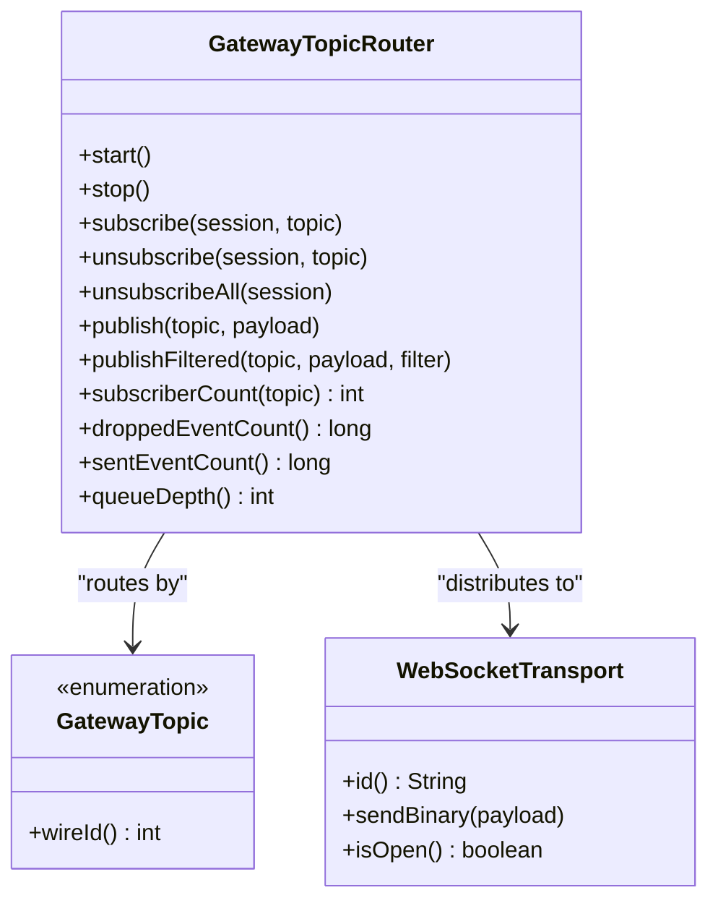
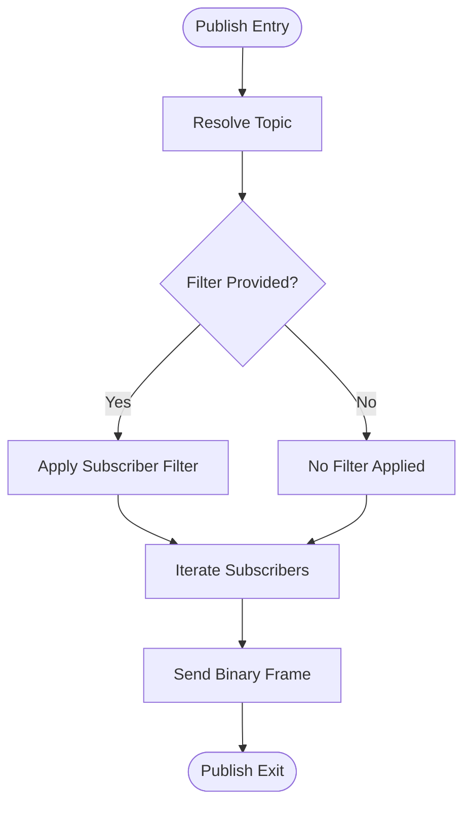
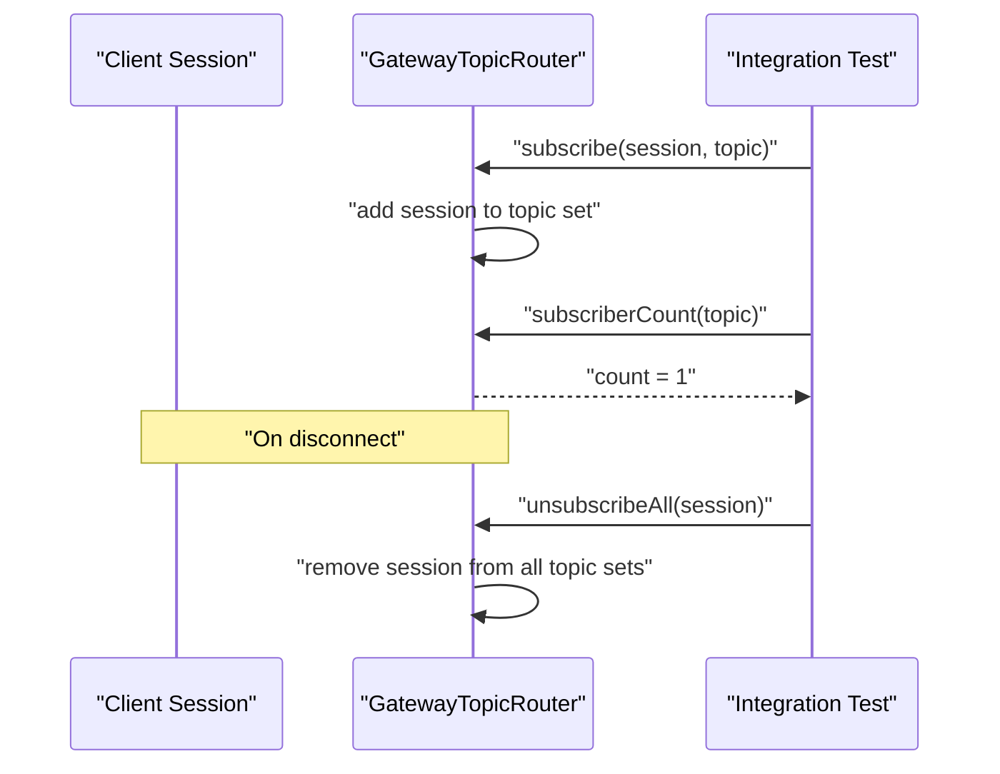
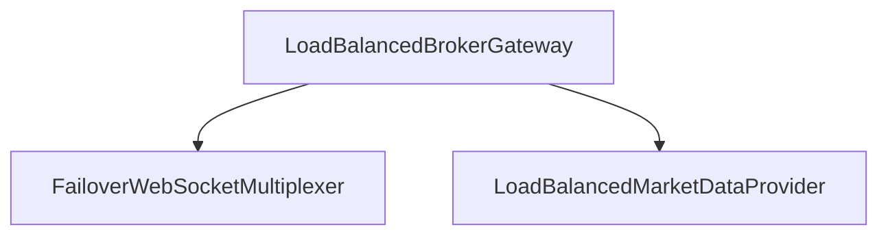
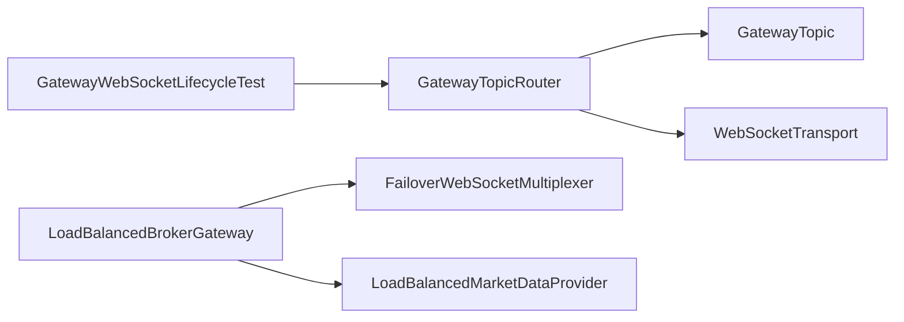

# Message Routing and Topic Management

<cite>
**Referenced Files in This Document**
- [GatewayTopicRouter.java](file://gateway/src/main/java/com/tradej/gateway/router/GatewayTopicRouter.java)
- [GatewayTopic.java](file://gateway/src/main/java/com/tradej/gateway/protocol/GatewayTopic.java)
- [WebSocketTransport.java](file://gateway/src/main/java/com/tradej/gateway/transport/WebSocketTransport.java)
- [GatewayTopicRouterTest.java](file://gateway/src/test/java/com/tradej/gateway/router/GatewayTopicRouterTest.java)
- [GatewayWebSocketLifecycleTest.java](file://app/src/test/java/com/tradej/app/integration/GatewayWebSocketLifecycleTest.java)
- [LoadBalancedBrokerGateway.java](file://broker/core/src/main/java/com/tradej/broker/core/routing/LoadBalancedBrokerGateway.java)
- [FailoverWebSocketMultiplexer.java](file://broker/core/src/main/java/com/tradej/broker/core/routing/FailoverWebSocketMultiplexer.java)
- [LoadBalancedMarketDataProvider.java](file://broker/core/src/main/java/com/tradej/broker/core/routing/LoadBalancedMarketDataProvider.java)
- [application-gateway.yml](file://app/src/main/resources/application-gateway.yml)
</cite>

## Table of Contents
1. [Introduction](#introduction)
2. [Project Structure](#project-structure)
3. [Core Components](#core-components)
4. [Architecture Overview](#architecture-overview)
5. [Detailed Component Analysis](#detailed-component-analysis)
6. [Dependency Analysis](#dependency-analysis)
7. [Performance Considerations](#performance-considerations)
8. [Troubleshooting Guide](#troubleshooting-guide)
9. [Conclusion](#conclusion)
10. [Appendices](#appendices)

## Introduction
This document describes the message routing and topic management system centered around the GatewayTopicRouter. It explains the topic-based messaging architecture, routing algorithms, subscription management, and message distribution patterns. It also documents the topic hierarchy, routing rules, load balancing strategies, and integration with event streams, broker feeds, and real-time data sources. Practical examples illustrate topic creation, subscription handling, and message forwarding, along with performance optimization, routing efficiency, scalability considerations, and guidelines for extending the routing system.

## Project Structure
The routing system spans several modules:
- Gateway module: Implements the topic router and transport abstractions.
- Broker core module: Provides load-balancing and failover routing for broker connections.
- Application tests: Demonstrate lifecycle, concurrency, backpressure, and integration scenarios.

**Diagram sources**
- [GatewayTopicRouter.java](file://gateway/src/main/java/com/tradej/gateway/router/GatewayTopicRouter.java)
- [GatewayTopic.java](file://gateway/src/main/java/com/tradej/gateway/protocol/GatewayTopic.java)
- [WebSocketTransport.java](file://gateway/src/main/java/com/tradej/gateway/transport/WebSocketTransport.java)
- [LoadBalancedBrokerGateway.java](file://broker/core/src/main/java/com/tradej/broker/core/routing/LoadBalancedBrokerGateway.java)
- [FailoverWebSocketMultiplexer.java](file://broker/core/src/main/java/com/tradej/broker/core/routing/FailoverWebSocketMultiplexer.java)
- [LoadBalancedMarketDataProvider.java](file://broker/core/src/main/java/com/tradej/broker/core/routing/LoadBalancedMarketDataProvider.java)
- [application-gateway.yml](file://app/src/main/resources/application-gateway.yml)
- [GatewayWebSocketLifecycleTest.java](file://app/src/test/java/com/tradej/app/integration/GatewayWebSocketLifecycleTest.java)

**Section sources**
- [GatewayTopicRouter.java](file://gateway/src/main/java/com/tradej/gateway/router/GatewayTopicRouter.java)
- [LoadBalancedBrokerGateway.java](file://broker/core/src/main/java/com/tradej/broker/core/routing/LoadBalancedBrokerGateway.java)
- [application-gateway.yml](file://app/src/main/resources/application-gateway.yml)

## Core Components
- GatewayTopicRouter: Central routing component that manages subscriptions per topic, enqueues outbound messages, applies filters, and distributes to subscribers with backpressure and metrics.
- GatewayTopic: Enumerates topics (e.g., market tick, depth, candles) and wire identifiers used for subscription and routing.
- WebSocketTransport: Abstraction for client sessions, enabling sendBinary operations and lifecycle management.
- LoadBalancedBrokerGateway: Distributes requests across multiple broker nodes and handles failover.
- FailoverWebSocketMultiplexer: Manages failover behavior for WebSocket connections.
- LoadBalancedMarketDataProvider: Routes market data providers across broker nodes.

Key responsibilities:
- Topic-based routing: Messages are routed by topic identifiers.
- Subscription management: Tracks sessions subscribed to each topic.
- Message distribution: Publishes to all subscribers per topic with optional filtering.
- Backpressure and metrics: Tracks queue depth, dropped events, and sent counts.
- Concurrency: Supports concurrent publish and subscription operations.

**Section sources**
- [GatewayTopicRouter.java](file://gateway/src/main/java/com/tradej/gateway/router/GatewayTopicRouter.java)
- [GatewayTopic.java](file://gateway/src/main/java/com/tradej/gateway/protocol/GatewayTopic.java)
- [WebSocketTransport.java](file://gateway/src/main/java/com/tradej/gateway/transport/WebSocketTransport.java)
- [LoadBalancedBrokerGateway.java](file://broker/core/src/main/java/com/tradej/broker/core/routing/LoadBalancedBrokerGateway.java)
- [FailoverWebSocketMultiplexer.java](file://broker/core/src/main/java/com/tradej/broker/core/routing/FailoverWebSocketMultiplexer.java)
- [LoadBalancedMarketDataProvider.java](file://broker/core/src/main/java/com/tradej/broker/core/routing/LoadBalancedMarketDataProvider.java)

## Architecture Overview
The system follows a publish-subscribe pattern with topic-based routing:
- Publishers enqueue messages by topic.
- Router maintains per-topic subscriber sets.
- Router distributes messages to subscribers with optional filters.
- Transport layer sends binary frames to sessions.
- Broker core components provide load balancing and failover for upstream data sources.

**Diagram sources**
- [GatewayTopicRouter.java](file://gateway/src/main/java/com/tradej/gateway/router/GatewayTopicRouter.java)
- [GatewayTopicRouterTest.java](file://gateway/src/test/java/com/tradej/gateway/router/GatewayTopicRouterTest.java)

## Detailed Component Analysis

### GatewayTopicRouter Implementation
GatewayTopicRouter orchestrates topic-based routing:
- Lifecycle: start/stop with idempotent behavior.
- Subscription: associate sessions with topics via subscribe/unsubscribe/unsubscribeAll.
- Publishing: publish and publishFiltered apply optional filters before sending.
- Backpressure: tracks queue depth and dropped events when capacity is exceeded.
- Metrics: exposes counters for dropped events, sent events, and queue depth.
- Concurrency: supports concurrent publish and subscription operations safely.

**Diagram sources**
- [GatewayTopicRouter.java](file://gateway/src/main/java/com/tradej/gateway/router/GatewayTopicRouter.java)
- [GatewayTopic.java](file://gateway/src/main/java/com/tradej/gateway/protocol/GatewayTopic.java)
- [WebSocketTransport.java](file://gateway/src/main/java/com/tradej/gateway/transport/WebSocketTransport.java)

**Section sources**
- [GatewayTopicRouter.java](file://gateway/src/main/java/com/tradej/gateway/router/GatewayTopicRouter.java)
- [GatewayTopicRouterTest.java](file://gateway/src/test/java/com/tradej/gateway/router/GatewayTopicRouterTest.java)

### Topic Resolution and Message Distribution
- Topic resolution: Topics are resolved via GatewayTopic enumerations and wire identifiers.
- Message distribution: Router iterates over subscribers for a topic and applies publishFiltered semantics.
- Filtering: Optional predicate allows excluding specific subscribers (e.g., sender self-filtering).
- Transport: Uses WebSocketTransport.sendBinary to deliver payloads.

**Diagram sources**
- [GatewayTopicRouter.java](file://gateway/src/main/java/com/tradej/gateway/router/GatewayTopicRouter.java)
- [GatewayTopicRouterTest.java](file://gateway/src/test/java/com/tradej/gateway/router/GatewayTopicRouterTest.java)

**Section sources**
- [GatewayTopicRouter.java](file://gateway/src/main/java/com/tradej/gateway/router/GatewayTopicRouter.java)
- [GatewayTopicRouterTest.java](file://gateway/src/test/java/com/tradej/gateway/router/GatewayTopicRouterTest.java)

### Subscription Management
- Adding subscriptions: subscribe associates a session with a topic.
- Removing subscriptions: unsubscribe removes a session from a topic; unsubscribeAll removes all subscriptions for a session.
- Subscriber count: subscriberCount(topic) reflects current subscribers.
- Integration test demonstrates subscription lifecycle and session disconnect effects.

**Diagram sources**
- [GatewayTopicRouterTest.java](file://gateway/src/test/java/com/tradej/gateway/router/GatewayTopicRouterTest.java)
- [GatewayWebSocketLifecycleTest.java](file://app/src/test/java/com/tradej/app/integration/GatewayWebSocketLifecycleTest.java)

**Section sources**
- [GatewayTopicRouterTest.java](file://gateway/src/test/java/com/tradej/gateway/router/GatewayTopicRouterTest.java)
- [GatewayWebSocketLifecycleTest.java](file://app/src/test/java/com/tradej/app/integration/GatewayWebSocketLifecycleTest.java)

### Topic Hierarchy and Routing Rules
- Topic hierarchy: Topics are defined by GatewayTopic enumeration. Examples include market tick, market depth, and candle closed events.
- Routing rules: Router routes by exact topic match; filtering is applied per subscriber.
- Wire protocol: Subscriptions use single-byte wire identifiers derived from topic wireId.

Practical examples:
- Creating a topic subscription: Use subscribe(session, topic) to bind a session to a topic.
- Publishing to a topic: Use publish(topic, payload) to broadcast to all subscribers.
- Conditional delivery: Use publishFiltered(topic, payload, filter) to selectively deliver.

**Section sources**
- [GatewayTopic.java](file://gateway/src/main/java/com/tradej/gateway/protocol/GatewayTopic.java)
- [GatewayTopicRouterTest.java](file://gateway/src/test/java/com/tradej/gateway/router/GatewayTopicRouterTest.java)

### Load Balancing Strategies
- LoadBalancedBrokerGateway: Distributes requests across multiple broker nodes and delegates disconnect operations.
- FailoverWebSocketMultiplexer: Handles failover behavior for WebSocket connections.
- LoadBalancedMarketDataProvider: Routes market data providers across broker nodes.

**Diagram sources**
- [LoadBalancedBrokerGateway.java](file://broker/core/src/main/java/com/tradej/broker/core/routing/LoadBalancedBrokerGateway.java)
- [FailoverWebSocketMultiplexer.java](file://broker/core/src/main/java/com/tradej/broker/core/routing/FailoverWebSocketMultiplexer.java)
- [LoadBalancedMarketDataProvider.java](file://broker/core/src/main/java/com/tradej/broker/core/routing/LoadBalancedMarketDataProvider.java)

**Section sources**
- [LoadBalancedBrokerGateway.java](file://broker/core/src/main/java/com/tradej/broker/core/routing/LoadBalancedBrokerGateway.java)
- [FailoverWebSocketMultiplexer.java](file://broker/core/src/main/java/com/tradej/broker/core/routing/FailoverWebSocketMultiplexer.java)
- [LoadBalancedMarketDataProvider.java](file://broker/core/src/main/java/com/tradej/broker/core/routing/LoadBalancedMarketDataProvider.java)

### Integration with Event Streams, Broker Feeds, and Real-Time Data Sources
- Event streams: Router publishes events to subscribed sessions; tests demonstrate event delivery and backpressure behavior.
- Broker feeds: LoadBalancedBrokerGateway and related components distribute load and handle failover for broker connections.
- Real-time data sources: Market data providers are routed via LoadBalancedMarketDataProvider to ensure balanced and resilient data ingestion.

**Section sources**
- [GatewayTopicRouterTest.java](file://gateway/src/test/java/com/tradej/gateway/router/GatewayTopicRouterTest.java)
- [LoadBalancedBrokerGateway.java](file://broker/core/src/main/java/com/tradej/broker/core/routing/LoadBalancedBrokerGateway.java)
- [LoadBalancedMarketDataProvider.java](file://broker/core/src/main/java/com/tradej/broker/core/routing/LoadBalancedMarketDataProvider.java)

## Dependency Analysis
The routing system exhibits clear separation of concerns:
- GatewayTopicRouter depends on GatewayTopic for topic identification and WebSocketTransport for delivery.
- Broker core components depend on routing abstractions to implement load balancing and failover.
- Tests validate lifecycle, concurrency, backpressure, and integration scenarios.

**Diagram sources**
- [GatewayTopicRouter.java](file://gateway/src/main/java/com/tradej/gateway/router/GatewayTopicRouter.java)
- [GatewayTopic.java](file://gateway/src/main/java/com/tradej/gateway/protocol/GatewayTopic.java)
- [WebSocketTransport.java](file://gateway/src/main/java/com/tradej/gateway/transport/WebSocketTransport.java)
- [LoadBalancedBrokerGateway.java](file://broker/core/src/main/java/com/tradej/broker/core/routing/LoadBalancedBrokerGateway.java)
- [FailoverWebSocketMultiplexer.java](file://broker/core/src/main/java/com/tradej/broker/core/routing/FailoverWebSocketMultiplexer.java)
- [LoadBalancedMarketDataProvider.java](file://broker/core/src/main/java/com/tradej/broker/core/routing/LoadBalancedMarketDataProvider.java)
- [GatewayWebSocketLifecycleTest.java](file://app/src/test/java/com/tradej/app/integration/GatewayWebSocketLifecycleTest.java)

**Section sources**
- [GatewayTopicRouter.java](file://gateway/src/main/java/com/tradej/gateway/router/GatewayTopicRouter.java)
- [LoadBalancedBrokerGateway.java](file://broker/core/src/main/java/com/tradej/broker/core/routing/LoadBalancedBrokerGateway.java)

## Performance Considerations
- Queue sizing: Configure router queue depth to balance latency and memory usage; tests demonstrate queue capacity and overflow behavior.
- Backpressure: Router drops events when queue is full and tracks droppedEventCount; use queueDepth to monitor utilization.
- Throughput: publishFiltered enables efficient selective delivery; avoid unnecessary filtering overhead.
- Concurrency: Router supports concurrent operations; ensure session send operations are non-blocking.
- Transport efficiency: WebSocketTransport.sendBinary delivers payloads directly; minimize payload size and frequency for high-frequency topics.

[No sources needed since this section provides general guidance]

## Troubleshooting Guide
Common issues and resolutions:
- Router not started: Ensure router.start() is called before publishing; tests show idempotent start behavior.
- No subscribers receiving messages: Verify subscribe(session, topic) was called and session.isOpen() is true.
- Excessive dropped events: Increase queue depth or reduce publish rate; monitor droppedEventCount and queueDepth.
- Concurrency problems: Use separate threads for publish and subscription operations; tests validate concurrent behavior.
- Session disconnects: Integration tests show subscriber count adjusts after disconnect; ensure unsubscribeAll is called on cleanup.

**Section sources**
- [GatewayTopicRouterTest.java](file://gateway/src/test/java/com/tradej/gateway/router/GatewayTopicRouterTest.java)
- [GatewayWebSocketLifecycleTest.java](file://app/src/test/java/com/tradej/app/integration/GatewayWebSocketLifecycleTest.java)

## Conclusion
The GatewayTopicRouter provides a robust, topic-based routing foundation with subscription management, filtering, backpressure, and metrics. Combined with load-balancing and failover components in the broker core, the system achieves scalability and resilience for real-time data distribution. The provided tests and integration examples serve as practical references for extending the routing system and implementing custom routing logic.

[No sources needed since this section summarizes without analyzing specific files]

## Appendices

### Practical Examples Index
- Topic creation and subscription: Use subscribe(session, topic) to bind sessions to topics.
- Message forwarding: Use publish(topic, payload) for broadcast delivery.
- Conditional forwarding: Use publishFiltered(topic, payload, filter) for selective delivery.
- Backpressure handling: Monitor droppedEventCount and queueDepth; adjust queue size accordingly.
- Integration lifecycle: Validate start/stop, subscription counts, and disconnect behavior via integration tests.

**Section sources**
- [GatewayTopicRouterTest.java](file://gateway/src/test/java/com/tradej/gateway/router/GatewayTopicRouterTest.java)
- [GatewayWebSocketLifecycleTest.java](file://app/src/test/java/com/tradej/app/integration/GatewayWebSocketLifecycleTest.java)