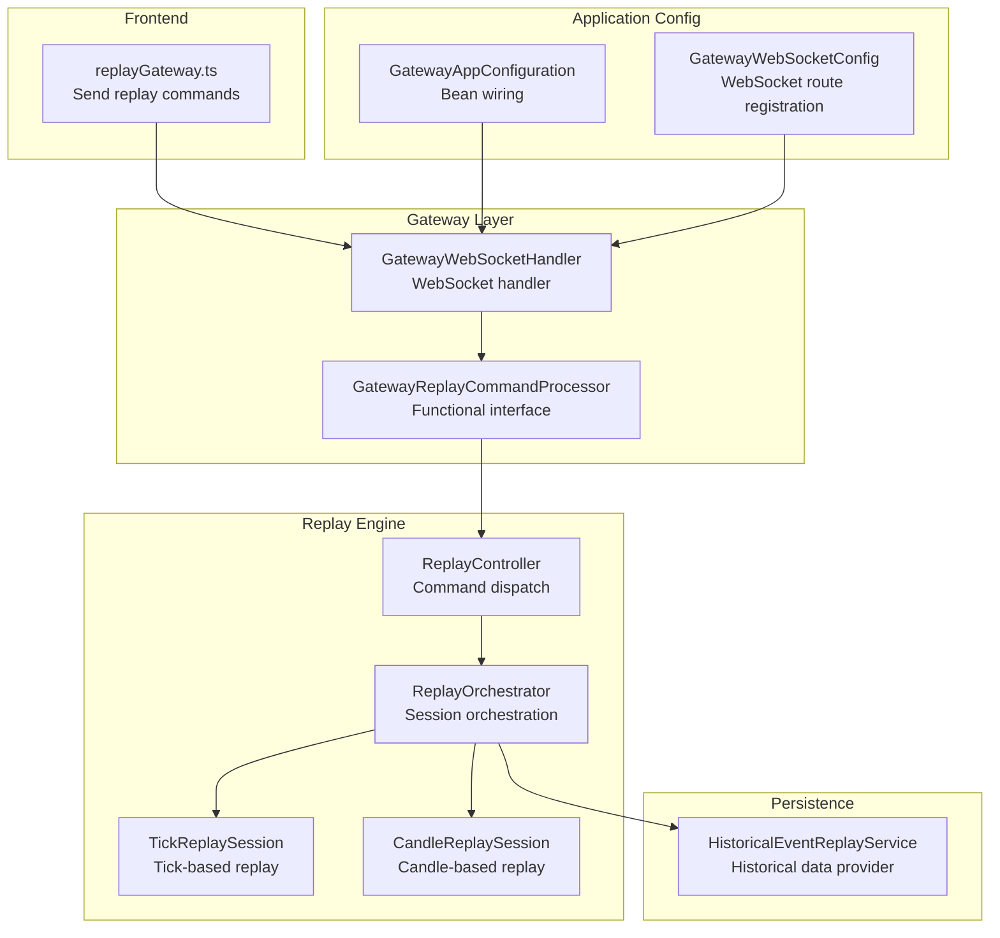
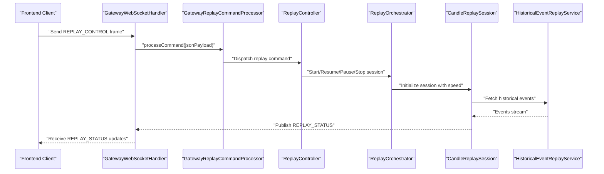
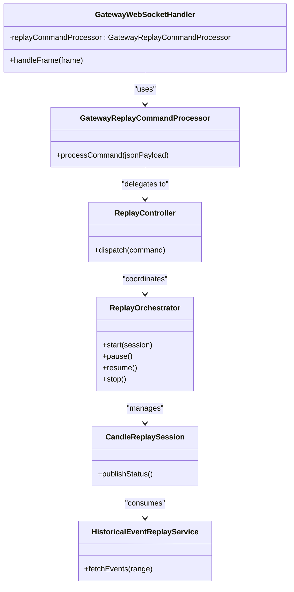

# Replay Command Processing

<cite>
**Referenced Files in This Document**
- [GatewayReplayCommandProcessor.java](file://gateway/src/main/java/com/tradej/gateway/websocket/GatewayReplayCommandProcessor.java)
- [GatewayWebSocketHandler.java](file://gateway/src/main/java/com/tradej/gateway/websocket/GatewayWebSocketHandler.java)
- [GatewayAppConfiguration.java](file://app/src/main/java/com/tradej/app/config/GatewayAppConfiguration.java)
- [GatewayWebSocketConfig.java](file://app/src/main/java/com/tradej/app/config/GatewayWebSocketConfig.java)
- [replayGateway.ts](file://archive/frontend/src/api/replayGateway.ts)
- [ReplayController.java](file://replay/engine/src/main/java/com/tradej/replay/engine/ReplayController.java)
- [ReplayOrchestrator.java](file://replay/engine/src/main/java/com/tradej/replay/engine/ReplayOrchestrator.java)
- [CandleReplaySession.java](file://replay/engine/src/main/java/com/tradej/replay/engine/CandleReplaySession.java)
- [HistoricalEventReplayService.java](file://data/persistence/src/main/java/com/tradej/persistence/replay/HistoricalEventReplayService.java)
- [ReplayTradingClock.java](file://core/src/main/java/com/tradej/core/domain/time/ReplayTradingClock.java)
- [ReplayTimeChangedEvent.java](file://core/src/main/java/com/tradej/core/domain/event/ReplayTimeChangedEvent.java)
- [GatewayReplaySmokeTest.java](file://app/src/test/java/com/tradej/app/integration/GatewayReplaySmokeTest.java)
- [AdminReplayTest.java](file://app/src/test/java/com/tradej/app/integration/AdminReplayTest.java)
- [ReplayEndToEndCertificationTest.java](file://app/src/test/java/com/tradej/app/integration/ReplayEndToEndCertificationTest.java)
- [ReplayParityHashTest.java](file://app/src/test/java/com/tradej/app/integration/ReplayParityHashTest.java)
- [ReplayMarketTickParityTest.java](file://app/src/test/java/com/tradej/app/pipeline/ReplayMarketTickParityTest.java)
</cite>

## Table of Contents
1. [Introduction](#introduction)
2. [Project Structure](#project-structure)
3. [Core Components](#core-components)
4. [Architecture Overview](#architecture-overview)
5. [Detailed Component Analysis](#detailed-component-analysis)
6. [Dependency Analysis](#dependency-analysis)
7. [Performance Considerations](#performance-considerations)
8. [Troubleshooting Guide](#troubleshooting-guide)
9. [Conclusion](#conclusion)
10. [Appendices](#appendices)

## Introduction
This document explains the replay command processing system used to control historical data playback and time-based message replay. It covers the end-to-end flow from command reception via the gateway WebSocket to orchestration and playback execution, including timeline management, speed control, synchronization, and integration with historical data stores. Practical examples demonstrate initiating replays, processing commands, and monitoring playback progress. Guidance is included for implementing custom replay commands, optimizing performance, and troubleshooting replay issues.

## Project Structure
The replay system spans several modules:
- Gateway WebSocket layer: Receives and decodes replay control commands from clients.
- Application configuration: Wires the replay command processor into the WebSocket handler.
- Replay engine: Orchestrates replay sessions, manages timelines, and publishes status updates.
- Historical data persistence: Supplies historical events for replay.
- Frontend integration: Encodes and sends replay control frames to the gateway.

**Diagram sources**
- [GatewayWebSocketHandler.java:1-120](file://gateway/src/main/java/com/tradej/gateway/websocket/GatewayWebSocketHandler.java#L1-L120)
- [GatewayReplayCommandProcessor.java:1-10](file://gateway/src/main/java/com/tradej/gateway/websocket/GatewayReplayCommandProcessor.java#L1-L10)
- [GatewayAppConfiguration.java:1-60](file://app/src/main/java/com/tradej/app/config/GatewayAppConfiguration.java#L1-L60)
- [GatewayWebSocketConfig.java:1-120](file://app/src/main/java/com/tradej/app/config/GatewayWebSocketConfig.java#L1-L120)
- [ReplayController.java:1-200](file://replay/engine/src/main/java/com/tradej/replay/engine/ReplayController.java#L1-L200)
- [ReplayOrchestrator.java:1-200](file://replay/engine/src/main/java/com/tradej/replay/engine/ReplayOrchestrator.java#L1-L200)
- [CandleReplaySession.java:1-250](file://replay/engine/src/main/java/com/tradej/replay/engine/CandleReplaySession.java#L1-L250)
- [HistoricalEventReplayService.java:1-200](file://data/persistence/src/main/java/com/tradej/persistence/replay/HistoricalEventReplayService.java#L1-L200)
- [replayGateway.ts:1-30](file://archive/frontend/src/api/replayGateway.ts#L1-L30)

**Section sources**
- [GatewayReplayCommandProcessor.java:1-10](file://gateway/src/main/java/com/tradej/gateway/websocket/GatewayReplayCommandProcessor.java#L1-L10)
- [GatewayWebSocketHandler.java:1-120](file://gateway/src/main/java/com/tradej/gateway/websocket/GatewayWebSocketHandler.java#L1-L120)
- [GatewayAppConfiguration.java:1-60](file://app/src/main/java/com/tradej/app/config/GatewayAppConfiguration.java#L1-L60)
- [GatewayWebSocketConfig.java:1-120](file://app/src/main/java/com/tradej/app/config/GatewayWebSocketConfig.java#L1-L120)
- [replayGateway.ts:1-30](file://archive/frontend/src/api/replayGateway.ts#L1-L30)

## Core Components
- GatewayReplayCommandProcessor: Functional interface that processes inbound replay control commands received over the gateway WebSocket.
- GatewayWebSocketHandler: Integrates the replay command processor into the WebSocket pipeline and routes decoded messages to the processor.
- ReplayController: Dispatches incoming replay commands to the appropriate orchestrator or session.
- ReplayOrchestrator: Manages replay sessions, applies speed multipliers, and synchronizes timeline progression.
- CandleReplaySession: Executes candle-based historical playback and publishes status updates.
- HistoricalEventReplayService: Provides historical events for replay consumption.
- ReplayTradingClock and ReplayTimeChangedEvent: Manage replay time progression and notify subscribers of time changes.
- Frontend replayGateway: Encodes and sends replay control frames to the gateway.

Key responsibilities:
- Command ingestion and decoding from the REPLAY_CONTROL topic.
- Session lifecycle management (start, pause, resume, stop).
- Speed control and timeline synchronization.
- Status reporting to clients via gateway topics.

**Section sources**
- [GatewayReplayCommandProcessor.java:1-10](file://gateway/src/main/java/com/tradej/gateway/websocket/GatewayReplayCommandProcessor.java#L1-L10)
- [GatewayWebSocketHandler.java:1-120](file://gateway/src/main/java/com/tradej/gateway/websocket/GatewayWebSocketHandler.java#L1-L120)
- [ReplayController.java:1-200](file://replay/engine/src/main/java/com/tradej/replay/engine/ReplayController.java#L1-L200)
- [ReplayOrchestrator.java:1-200](file://replay/engine/src/main/java/com/tradej/replay/engine/ReplayOrchestrator.java#L1-L200)
- [CandleReplaySession.java:190-220](file://replay/engine/src/main/java/com/tradej/replay/engine/CandleReplaySession.java#L190-L220)
- [HistoricalEventReplayService.java:1-200](file://data/persistence/src/main/java/com/tradej/persistence/replay/HistoricalEventReplayService.java#L1-L200)
- [ReplayTradingClock.java:1-200](file://core/src/main/java/com/tradej/core/domain/time/ReplayTradingClock.java#L1-L200)
- [ReplayTimeChangedEvent.java:1-200](file://core/src/main/java/com/tradej/core/domain/event/ReplayTimeChangedEvent.java#L1-L200)
- [replayGateway.ts:1-30](file://archive/frontend/src/api/replayGateway.ts#L1-L30)

## Architecture Overview
The replay command processing architecture connects frontend clients to the gateway WebSocket, which delegates to a replay command processor. The processor dispatches commands to the controller, which coordinates the orchestrator and sessions. Sessions consume historical data and publish status updates back to clients.

**Diagram sources**
- [replayGateway.ts:1-30](file://archive/frontend/src/api/replayGateway.ts#L1-L30)
- [GatewayWebSocketHandler.java:1-120](file://gateway/src/main/java/com/tradej/gateway/websocket/GatewayWebSocketHandler.java#L1-L120)
- [GatewayReplayCommandProcessor.java:1-10](file://gateway/src/main/java/com/tradej/gateway/websocket/GatewayReplayCommandProcessor.java#L1-L10)
- [ReplayController.java:1-200](file://replay/engine/src/main/java/com/tradej/replay/engine/ReplayController.java#L1-L200)
- [ReplayOrchestrator.java:1-200](file://replay/engine/src/main/java/com/tradej/replay/engine/ReplayOrchestrator.java#L1-L200)
- [CandleReplaySession.java:190-220](file://replay/engine/src/main/java/com/tradej/replay/engine/CandleReplaySession.java#L190-L220)
- [HistoricalEventReplayService.java:1-200](file://data/persistence/src/main/java/com/tradej/persistence/replay/HistoricalEventReplayService.java#L1-L200)

## Detailed Component Analysis

### GatewayReplayCommandProcessor
- Role: Functional interface for processing inbound replay control commands.
- Contract: Accepts a JSON payload string and performs command-specific actions.
- Integration: Implemented by the gateway WebSocket handler and wired into the WebSocket configuration.

Implementation pattern:
- Single method interface enabling flexible command processing strategies.
- Decoupled from transport details, allowing reuse across different transports.

**Section sources**
- [GatewayReplayCommandProcessor.java:1-10](file://gateway/src/main/java/com/tradej/gateway/websocket/GatewayReplayCommandProcessor.java#L1-L10)

### GatewayWebSocketHandler
- Role: Bridges WebSocket frames to the replay command processor.
- Responsibilities:
  - Maintains a reference to the replay command processor.
  - Decodes frames and invokes the processor with the JSON payload.
  - Routes processed commands to downstream components.

Integration points:
- Constructor dependency injection of the replay command processor.
- WebSocket routing and frame encoding handled externally.

**Section sources**
- [GatewayWebSocketHandler.java:1-120](file://gateway/src/main/java/com/tradej/gateway/websocket/GatewayWebSocketHandler.java#L1-L120)

### Application Configuration Wiring
- GatewayAppConfiguration: Creates and exposes the replay command processor bean.
- GatewayWebSocketConfig: Registers the WebSocket route and injects the processor into the handler.

Outcome:
- Ensures the gateway handler receives a configured processor instance at runtime.

**Section sources**
- [GatewayAppConfiguration.java:1-60](file://app/src/main/java/com/tradej/app/config/GatewayAppConfiguration.java#L1-L60)
- [GatewayWebSocketConfig.java:1-120](file://app/src/main/java/com/tradej/app/config/GatewayWebSocketConfig.java#L1-L120)

### Frontend Integration (replayGateway)
- Role: Encodes replay control frames and sends them to the gateway WebSocket.
- Features:
  - Builds JSON payload with command and optional speed multiplier.
  - Uses a fixed topic ID for replay control frames.
  - Returns success/failure based on socket readiness.

Usage:
- Call the send function with a command string and optional multiplier.
- Ensure the WebSocket is connected before sending.

**Section sources**
- [replayGateway.ts:1-30](file://archive/frontend/src/api/replayGateway.ts#L1-L30)

### ReplayController
- Role: Central dispatcher for replay commands.
- Responsibilities:
  - Interprets command payloads.
  - Delegates to the orchestrator for session management.
  - Coordinates timeline and speed settings.

Design:
- Stateless dispatcher focused on routing and coordination.

**Section sources**
- [ReplayController.java:1-200](file://replay/engine/src/main/java/com/tradej/replay/engine/ReplayController.java#L1-L200)

### ReplayOrchestrator
- Role: Manages replay sessions, applies speed multipliers, and synchronizes timeline progression.
- Responsibilities:
  - Start, pause, resume, and stop replay sessions.
  - Apply speed multipliers to control playback rate.
  - Synchronize with the replay clock and notify subscribers.

Performance characteristics:
- Time-based scheduling and event throttling to maintain desired speed.

**Section sources**
- [ReplayOrchestrator.java:1-200](file://replay/engine/src/main/java/com/tradej/replay/engine/ReplayOrchestrator.java#L1-L200)

### CandleReplaySession
- Role: Executes candle-based historical playback.
- Responsibilities:
  - Consume historical candles from the historical data service.
  - Publish periodic status updates containing current index, total count, speed, and current time.
  - Route status messages to the gateway for client consumption.

Status publishing:
- Payload includes state, current index, total items, speed multiplier, and current time in milliseconds.

**Section sources**
- [CandleReplaySession.java:190-220](file://replay/engine/src/main/java/com/tradej/replay/engine/CandleReplaySession.java#L190-L220)

### HistoricalEventReplayService
- Role: Supplies historical events for replay consumption.
- Responsibilities:
  - Retrieve historical events within requested time windows.
  - Stream events to replay sessions in chronological order.

Integration:
- Consumed by replay sessions to drive playback.

**Section sources**
- [HistoricalEventReplayService.java:1-200](file://data/persistence/src/main/java/com/tradej/persistence/replay/HistoricalEventReplayService.java#L1-L200)

### Timeline Management and Synchronization
- ReplayTradingClock: Manages the progression of replay time and emits time-changed events.
- ReplayTimeChangedEvent: Notifies subscribers when replay time advances.

Mechanisms:
- Clock-driven progression synchronized with speed multipliers.
- Event publication ensures downstream components update accordingly.

**Section sources**
- [ReplayTradingClock.java:1-200](file://core/src/main/java/com/tradej/core/domain/time/ReplayTradingClock.java#L1-L200)
- [ReplayTimeChangedEvent.java:1-200](file://core/src/main/java/com/tradej/core/domain/event/ReplayTimeChangedEvent.java#L1-L200)

### Replay Modes and Speed Controls
- Modes:
  - Start: Initialize a new replay session.
  - Pause: Temporarily halt playback while preserving position.
  - Resume: Continue playback from the last paused position.
  - Stop: Terminate the session and reset internal state.
- Speed control:
  - Configured via a multiplier passed in the command payload.
  - Applied by the orchestrator to adjust playback rate.

Synchronization:
- Timeline updates are propagated through the clock and events to keep clients informed.

**Section sources**
- [ReplayOrchestrator.java:1-200](file://replay/engine/src/main/java/com/tradej/replay/engine/ReplayOrchestrator.java#L1-L200)
- [CandleReplaySession.java:190-220](file://replay/engine/src/main/java/com/tradej/replay/engine/CandleReplaySession.java#L190-L220)

### Practical Examples

#### Example 1: Initiating a Replay from the Frontend
- Steps:
  - Connect to the gateway WebSocket.
  - Send a replay control command with a desired speed multiplier.
  - Observe REPLAY_STATUS updates published by the session.

References:
- [replayGateway.ts:1-30](file://archive/frontend/src/api/replayGateway.ts#L1-L30)

#### Example 2: Command Processing Flow
- Steps:
  - Frontend encodes and sends a REPLAY_CONTROL frame.
  - GatewayWebSocketHandler decodes and forwards to GatewayReplayCommandProcessor.
  - Processor dispatches to ReplayController, which coordinates the orchestrator and session.

References:
- [GatewayWebSocketHandler.java:1-120](file://gateway/src/main/java/com/tradej/gateway/websocket/GatewayWebSocketHandler.java#L1-L120)
- [GatewayReplayCommandProcessor.java:1-10](file://gateway/src/main/java/com/tradej/gateway/websocket/GatewayReplayCommandProcessor.java#L1-L10)
- [ReplayController.java:1-200](file://replay/engine/src/main/java/com/tradej/replay/engine/ReplayController.java#L1-L200)

#### Example 3: Playback Monitoring
- Steps:
  - CandleReplaySession publishes periodic status updates.
  - Gateway routes updates to clients subscribed to the REPLAY_CONTROL topic.

References:
- [CandleReplaySession.java:190-220](file://replay/engine/src/main/java/com/tradej/replay/engine/CandleReplaySession.java#L190-L220)

**Section sources**
- [replayGateway.ts:1-30](file://archive/frontend/src/api/replayGateway.ts#L1-L30)
- [GatewayWebSocketHandler.java:1-120](file://gateway/src/main/java/com/tradej/gateway/websocket/GatewayWebSocketHandler.java#L1-L120)
- [GatewayReplayCommandProcessor.java:1-10](file://gateway/src/main/java/com/tradej/gateway/websocket/GatewayReplayCommandProcessor.java#L1-L10)
- [ReplayController.java:1-200](file://replay/engine/src/main/java/com/tradej/replay/engine/ReplayController.java#L1-L200)
- [CandleReplaySession.java:190-220](file://replay/engine/src/main/java/com/tradej/replay/engine/CandleReplaySession.java#L190-L220)

### Integration with Historical Data Stores and Simulation Environments
- Historical data integration:
  - HistoricalEventReplayService supplies historical events to replay sessions.
- Simulation environments:
  - Replay sessions operate independently of live feeds, enabling isolated testing and verification.

Verification:
- Integration tests validate end-to-end replay behavior and parity with expected outcomes.

**Section sources**
- [HistoricalEventReplayService.java:1-200](file://data/persistence/src/main/java/com/tradej/persistence/replay/HistoricalEventReplayService.java#L1-L200)
- [ReplayEndToEndCertificationTest.java:1-200](file://app/src/test/java/com/tradej/app/integration/ReplayEndToEndCertificationTest.java#L1-L200)
- [ReplayParityHashTest.java:1-200](file://app/src/test/java/com/tradej/app/integration/ReplayParityHashTest.java#L1-L200)
- [ReplayMarketTickParityTest.java:1-200](file://app/src/test/java/com/tradej/app/pipeline/ReplayMarketTickParityTest.java#L1-L200)

## Dependency Analysis
The replay system exhibits clear layering and low coupling:
- Gateway WebSocket layer depends on the replay command processor interface.
- Application configuration wires the processor into the handler.
- Replay controller orchestrates sessions and interacts with the historical data service.
- Sessions publish status updates via the gateway router.

**Diagram sources**
- [GatewayReplayCommandProcessor.java:1-10](file://gateway/src/main/java/com/tradej/gateway/websocket/GatewayReplayCommandProcessor.java#L1-L10)
- [GatewayWebSocketHandler.java:1-120](file://gateway/src/main/java/com/tradej/gateway/websocket/GatewayWebSocketHandler.java#L1-L120)
- [ReplayController.java:1-200](file://replay/engine/src/main/java/com/tradej/replay/engine/ReplayController.java#L1-L200)
- [ReplayOrchestrator.java:1-200](file://replay/engine/src/main/java/com/tradej/replay/engine/ReplayOrchestrator.java#L1-L200)
- [CandleReplaySession.java:190-220](file://replay/engine/src/main/java/com/tradej/replay/engine/CandleReplaySession.java#L190-L220)
- [HistoricalEventReplayService.java:1-200](file://data/persistence/src/main/java/com/tradej/persistence/replay/HistoricalEventReplayService.java#L1-L200)

**Section sources**
- [GatewayReplayCommandProcessor.java:1-10](file://gateway/src/main/java/com/tradej/gateway/websocket/GatewayReplayCommandProcessor.java#L1-L10)
- [GatewayWebSocketHandler.java:1-120](file://gateway/src/main/java/com/tradej/gateway/websocket/GatewayWebSocketHandler.java#L1-L120)
- [ReplayController.java:1-200](file://replay/engine/src/main/java/com/tradej/replay/engine/ReplayController.java#L1-L200)
- [ReplayOrchestrator.java:1-200](file://replay/engine/src/main/java/com/tradej/replay/engine/ReplayOrchestrator.java#L1-L200)
- [CandleReplaySession.java:190-220](file://replay/engine/src/main/java/com/tradej/replay/engine/CandleReplaySession.java#L190-L220)
- [HistoricalEventReplayService.java:1-200](file://data/persistence/src/main/java/com/tradej/persistence/replay/HistoricalEventReplayService.java#L1-L200)

## Performance Considerations
- Speed multiplier impact: Higher multipliers increase throughput but may strain downstream consumers; tune based on client capacity.
- Event batching: Group historical events to reduce overhead during high-speed playback.
- Status update cadence: Limit status publish frequency to avoid overwhelming clients.
- Memory footprint: Ensure historical data retrieval streams events rather than loading entire datasets into memory.
- Clock synchronization: Use the replay clock to maintain consistent timing across sessions.

[No sources needed since this section provides general guidance]

## Troubleshooting Guide
Common issues and resolutions:
- Commands not received:
  - Verify WebSocket connection state and topic encoding.
  - Confirm the replay command processor bean is properly injected.
- No status updates:
  - Check session publish logic and gateway routing configuration.
  - Ensure the REPLAY_CONTROL topic is subscribed to by clients.
- Playback stalls:
  - Investigate historical data service availability and latency.
  - Review speed multiplier settings and client responsiveness.
- Time drift:
  - Validate replay clock behavior and event ordering.

Verification tests:
- GatewayReplaySmokeTest: Validates basic replay command processing.
- AdminReplayTest: Exercises administrative replay controls.
- ReplayEndToEndCertificationTest: Confirms end-to-end replay behavior.
- ReplayParityHashTest: Ensures replay parity with expected outcomes.
- ReplayMarketTickParityTest: Verifies tick replay parity in the pipeline.

**Section sources**
- [GatewayReplaySmokeTest.java:1-200](file://app/src/test/java/com/tradej/app/integration/GatewayReplaySmokeTest.java#L1-L200)
- [AdminReplayTest.java:1-200](file://app/src/test/java/com/tradej/app/integration/AdminReplayTest.java#L1-L200)
- [ReplayEndToEndCertificationTest.java:1-200](file://app/src/test/java/com/tradej/app/integration/ReplayEndToEndCertificationTest.java#L1-L200)
- [ReplayParityHashTest.java:1-200](file://app/src/test/java/com/tradej/app/integration/ReplayParityHashTest.java#L1-L200)
- [ReplayMarketTickParityTest.java:1-200](file://app/src/test/java/com/tradej/app/pipeline/ReplayMarketTickParityTest.java#L1-L200)

## Conclusion
The replay command processing system provides a robust, modular framework for historical data playback. It cleanly separates concerns between command ingestion, orchestration, and session execution, integrates with historical data services, and offers precise timeline control and status reporting. By following the guidelines in this document, teams can implement custom replay commands, optimize performance, and troubleshoot issues effectively.

[No sources needed since this section summarizes without analyzing specific files]

## Appendices

### Appendix A: Command Payload Format
- Fields:
  - command: String indicating the replay action (start, pause, resume, stop).
  - multiplier: Optional numeric value controlling playback speed.

Encoding:
- JSON payload sent as a single frame to the REPLAY_CONTROL topic.

**Section sources**
- [replayGateway.ts:1-30](file://archive/frontend/src/api/replayGateway.ts#L1-L30)

### Appendix B: Status Update Schema
- Fields:
  - type: Always "REPLAY_STATUS".
  - state: Current session state.
  - currentIndex: Current item index.
  - totalCandles: Total items in the session.
  - speedMultiplier: Current playback speed.
  - currentTimeMs: Current replay time in milliseconds.

**Section sources**
- [CandleReplaySession.java:190-220](file://replay/engine/src/main/java/com/tradej/replay/engine/CandleReplaySession.java#L190-L220)