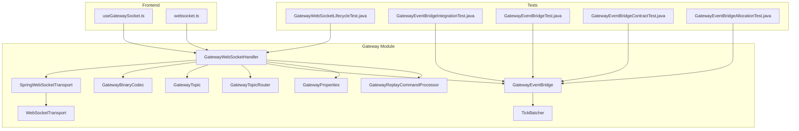
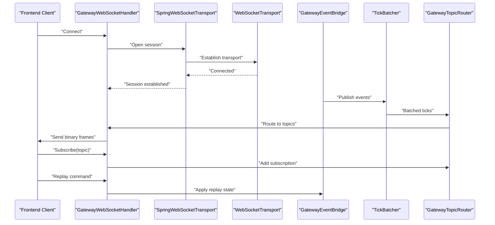
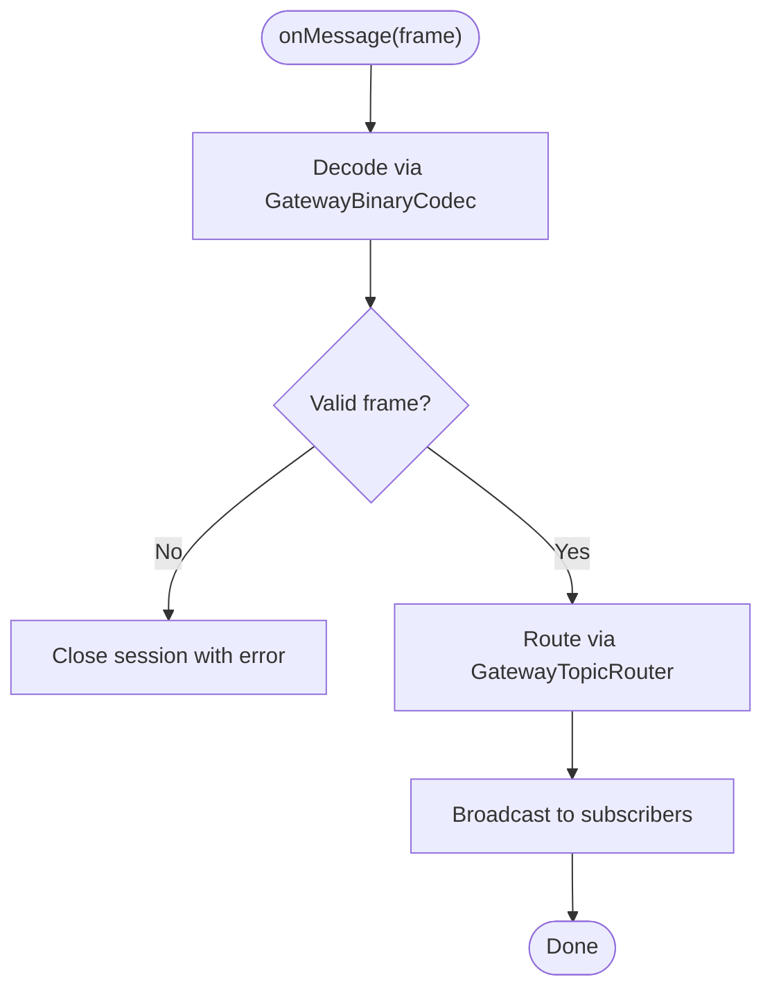
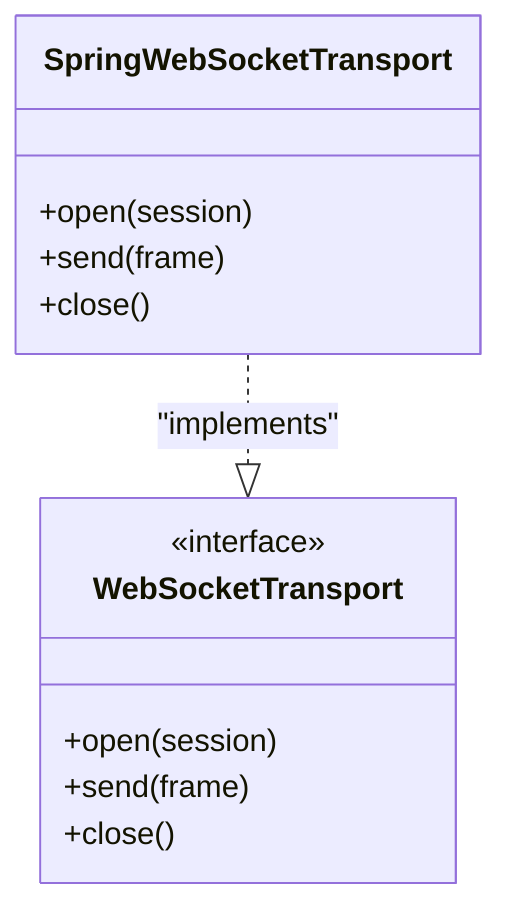
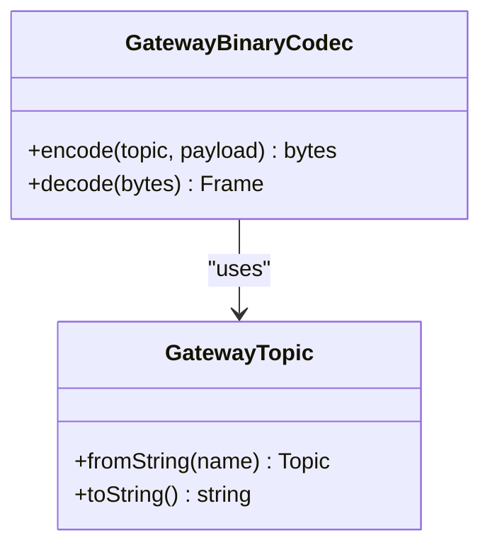
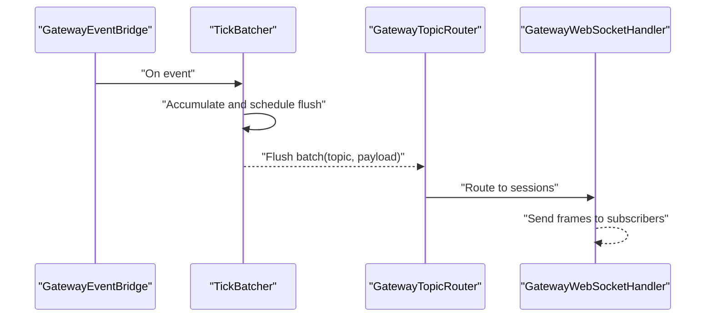
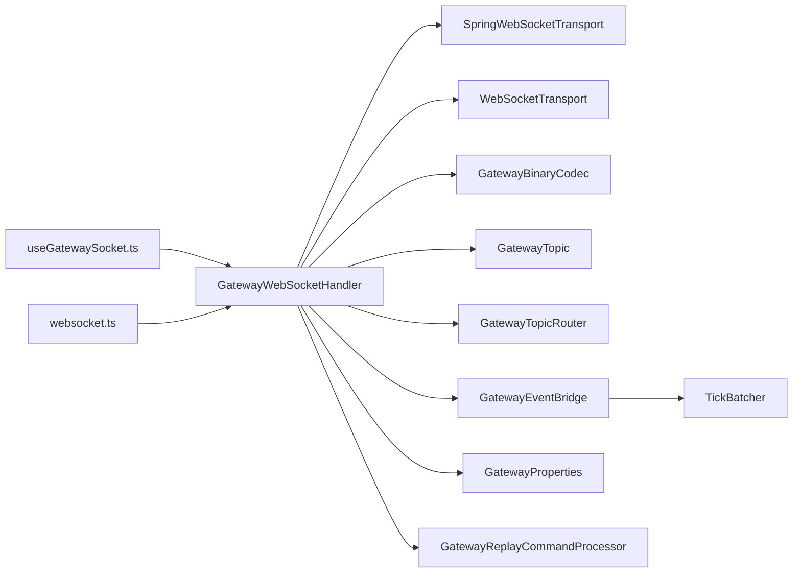

# WebSocket Gateway

<cite>
**Referenced Files in This Document**
- [GatewayWebSocketHandler.java](file://gateway/src/main/java/com/tradej/gateway/websocket/GatewayWebSocketHandler.java)
- [SpringWebSocketTransport.java](file://gateway/src/main/java/com/tradej/gateway/transport/SpringWebSocketTransport.java)
- [WebSocketTransport.java](file://gateway/src/main/java/com/tradej/gateway/transport/WebSocketTransport.java)
- [GatewayBinaryCodec.java](file://gateway/src/main/java/com/tradej/gateway/protocol/GatewayBinaryCodec.java)
- [GatewayTopic.java](file://gateway/src/main/java/com/tradej/gateway/protocol/GatewayTopic.java)
- [GatewayTopicRouter.java](file://gateway/src/main/java/com/tradej/gateway/router/GatewayTopicRouter.java)
- [GatewayEventBridge.java](file://gateway/src/main/java/com/tradej/gateway/bridge/GatewayEventBridge.java)
- [TickBatcher.java](file://gateway/src/main/java/com/tradej/gateway/bridge/TickBatcher.java)
- [GatewayProperties.java](file://gateway/src/main/java/com/tradej/gateway/config/GatewayProperties.java)
- [GatewayReplayCommandProcessor.java](file://gateway/src/main/java/com/tradej/gateway/websocket/GatewayReplayCommandProcessor.java)
- [useGatewaySocket.ts](file://frontend/src/hooks/useGatewaySocket.ts)
- [websocket.ts](file://archive/frontend/src/api/websocket.ts)
- [GatewayWebSocketLifecycleTest.java](file://app/src/test/java/com/tradej/app/integration/GatewayWebSocketLifecycleTest.java)
- [DhanMarketFeedWebSocketIntegrationTest.java](file://app/src/test/java/com/tradej/app/integration/DhanMarketFeedWebSocketIntegrationTest.java)
- [GatewayEventBridgeIntegrationTest.java](file://gateway/src/test/java/com/tradej/gateway/bridge/GatewayEventBridgeIntegrationTest.java)
- [GatewayEventBridgeTest.java](file://gateway/src/test/java/com/tradej/gateway/bridge/GatewayEventBridgeTest.java)
- [GatewayEventBridgeContractTest.java](file://gateway/src/test/java/com/tradej/gateway/bridge/GatewayEventBridgeContractTest.java)
- [GatewayEventBridgeAllocationTest.java](file://gateway/src/test/java/com/tradej/gateway/bridge/GatewayEventBridgeAllocationTest.java)
- [GatewayWebSocketLifecycleTest.java](file://app/src/test/java/com/tradej/app/integration/GatewayWebSocketLifecycleTest.java)
- [GatewayReplayCommandProcessor.java](file://gateway/src/main/java/com/tradej/gateway/websocket/GatewayReplayCommandProcessor.java)
</cite>

## Table of Contents
1. [Introduction](#introduction)
2. [Project Structure](#project-structure)
3. [Core Components](#core-components)
4. [Architecture Overview](#architecture-overview)
5. [Detailed Component Analysis](#detailed-component-analysis)
6. [Dependency Analysis](#dependency-analysis)
7. [Performance Considerations](#performance-considerations)
8. [Troubleshooting Guide](#troubleshooting-guide)
9. [Conclusion](#conclusion)
10. [Appendices](#appendices)

## Introduction
This document describes the WebSocket gateway system responsible for real-time market data distribution to clients. It explains the WebSocket protocol implementation, binary protocol specification, message routing, topic-based data distribution, event bridge architecture, tick batching, and lifecycle management. It also provides practical usage examples, integration guidelines with frontend components and broker adapters, and recommendations for protocol extension, performance optimization, and debugging.

## Project Structure
The WebSocket gateway is implemented primarily under the gateway module with supporting components in transport, protocol, router, bridge, and config packages. Frontend integration is provided via React hooks and TypeScript WebSocket utilities. Integration tests validate lifecycle and data streaming behavior.

**Diagram sources**
- [GatewayWebSocketHandler.java:1-200](file://gateway/src/main/java/com/tradej/gateway/websocket/GatewayWebSocketHandler.java#L1-L200)
- [SpringWebSocketTransport.java:1-200](file://gateway/src/main/java/com/tradej/gateway/transport/SpringWebSocketTransport.java#L1-L200)
- [WebSocketTransport.java:1-200](file://gateway/src/main/java/com/tradej/gateway/transport/WebSocketTransport.java#L1-L200)
- [GatewayBinaryCodec.java:1-200](file://gateway/src/main/java/com/tradej/gateway/protocol/GatewayBinaryCodec.java#L1-L200)
- [GatewayTopic.java:1-200](file://gateway/src/main/java/com/tradej/gateway/protocol/GatewayTopic.java#L1-L200)
- [GatewayTopicRouter.java:1-200](file://gateway/src/main/java/com/tradej/gateway/router/GatewayTopicRouter.java#L1-L200)
- [GatewayEventBridge.java:1-200](file://gateway/src/main/java/com/tradej/gateway/bridge/GatewayEventBridge.java#L1-L200)
- [TickBatcher.java:1-200](file://gateway/src/main/java/com/tradej/gateway/bridge/TickBatcher.java#L1-L200)
- [GatewayProperties.java:1-200](file://gateway/src/main/java/com/tradej/gateway/config/GatewayProperties.java#L1-L200)
- [GatewayReplayCommandProcessor.java:1-200](file://gateway/src/main/java/com/tradej/gateway/websocket/GatewayReplayCommandProcessor.java#L1-L200)
- [useGatewaySocket.ts:1-200](file://frontend/src/hooks/useGatewaySocket.ts#L1-L200)
- [websocket.ts:1-200](file://archive/frontend/src/api/websocket.ts#L1-L200)
- [GatewayWebSocketLifecycleTest.java:1-200](file://app/src/test/java/com/tradej/app/integration/GatewayWebSocketLifecycleTest.java#L1-L200)
- [GatewayEventBridgeIntegrationTest.java:1-200](file://gateway/src/test/java/com/tradej/gateway/bridge/GatewayEventBridgeIntegrationTest.java#L1-L200)
- [GatewayEventBridgeTest.java:1-200](file://gateway/src/test/java/com/tradej/gateway/bridge/GatewayEventBridgeTest.java#L1-L200)
- [GatewayEventBridgeContractTest.java:1-200](file://gateway/src/test/java/com/tradej/gateway/bridge/GatewayEventBridgeContractTest.java#L1-L200)
- [GatewayEventBridgeAllocationTest.java:1-200](file://gateway/src/test/java/com/tradej/gateway/bridge/GatewayEventBridgeAllocationTest.java#L1-L200)

**Section sources**
- [GatewayWebSocketHandler.java:1-200](file://gateway/src/main/java/com/tradej/gateway/websocket/GatewayWebSocketHandler.java#L1-L200)
- [SpringWebSocketTransport.java:1-200](file://gateway/src/main/java/com/tradej/gateway/transport/SpringWebSocketTransport.java#L1-L200)
- [WebSocketTransport.java:1-200](file://gateway/src/main/java/com/tradej/gateway/transport/WebSocketTransport.java#L1-L200)
- [GatewayBinaryCodec.java:1-200](file://gateway/src/main/java/com/tradej/gateway/protocol/GatewayBinaryCodec.java#L1-L200)
- [GatewayTopic.java:1-200](file://gateway/src/main/java/com/tradej/gateway/protocol/GatewayTopic.java#L1-L200)
- [GatewayTopicRouter.java:1-200](file://gateway/src/main/java/com/tradej/gateway/router/GatewayTopicRouter.java#L1-L200)
- [GatewayEventBridge.java:1-200](file://gateway/src/main/java/com/tradej/gateway/bridge/GatewayEventBridge.java#L1-L200)
- [TickBatcher.java:1-200](file://gateway/src/main/java/com/tradej/gateway/bridge/TickBatcher.java#L1-L200)
- [GatewayProperties.java:1-200](file://gateway/src/main/java/com/tradej/gateway/config/GatewayProperties.java#L1-L200)
- [GatewayReplayCommandProcessor.java:1-200](file://gateway/src/main/java/com/tradej/gateway/websocket/GatewayReplayCommandProcessor.java#L1-L200)
- [useGatewaySocket.ts:1-200](file://frontend/src/hooks/useGatewaySocket.ts#L1-L200)
- [websocket.ts:1-200](file://archive/frontend/src/api/websocket.ts#L1-L200)
- [GatewayWebSocketLifecycleTest.java:1-200](file://app/src/test/java/com/tradej/app/integration/GatewayWebSocketLifecycleTest.java#L1-L200)
- [GatewayEventBridgeIntegrationTest.java:1-200](file://gateway/src/test/java/com/tradej/gateway/bridge/GatewayEventBridgeIntegrationTest.java#L1-L200)
- [GatewayEventBridgeTest.java:1-200](file://gateway/src/test/java/com/tradej/gateway/bridge/GatewayEventBridgeTest.java#L1-L200)
- [GatewayEventBridgeContractTest.java:1-200](file://gateway/src/test/java/com/tradej/gateway/bridge/GatewayEventBridgeContractTest.java#L1-L200)
- [GatewayEventBridgeAllocationTest.java:1-200](file://gateway/src/test/java/com/tradej/gateway/bridge/GatewayEventBridgeAllocationTest.java#L1-L200)

## Core Components
- WebSocket handler: Orchestrates connection lifecycle, message decoding, routing, and broadcasting.
- Transport layer: Provides Spring-based WebSocket transport abstraction and low-level transport interface.
- Binary codec and topics: Defines the binary protocol framing and topic identifiers for routing.
- Topic router: Routes messages to subscribed channels based on topic metadata.
- Event bridge and tick batcher: Bridges internal events to WebSocket streams with batching for efficiency.
- Properties: Configures gateway behavior such as timeouts, limits, and replay settings.
- Replay command processor: Handles commands for replay controls and state transitions.
- Frontend integration: React hooks and WebSocket utilities for connecting and consuming streams.

**Section sources**
- [GatewayWebSocketHandler.java:1-200](file://gateway/src/main/java/com/tradej/gateway/websocket/GatewayWebSocketHandler.java#L1-L200)
- [SpringWebSocketTransport.java:1-200](file://gateway/src/main/java/com/tradej/gateway/transport/SpringWebSocketTransport.java#L1-L200)
- [WebSocketTransport.java:1-200](file://gateway/src/main/java/com/tradej/gateway/transport/WebSocketTransport.java#L1-L200)
- [GatewayBinaryCodec.java:1-200](file://gateway/src/main/java/com/tradej/gateway/protocol/GatewayBinaryCodec.java#L1-L200)
- [GatewayTopic.java:1-200](file://gateway/src/main/java/com/tradej/gateway/protocol/GatewayTopic.java#L1-L200)
- [GatewayTopicRouter.java:1-200](file://gateway/src/main/java/com/tradej/gateway/router/GatewayTopicRouter.java#L1-L200)
- [GatewayEventBridge.java:1-200](file://gateway/src/main/java/com/tradej/gateway/bridge/GatewayEventBridge.java#L1-L200)
- [TickBatcher.java:1-200](file://gateway/src/main/java/com/tradej/gateway/bridge/TickBatcher.java#L1-L200)
- [GatewayProperties.java:1-200](file://gateway/src/main/java/com/tradej/gateway/config/GatewayProperties.java#L1-L200)
- [GatewayReplayCommandProcessor.java:1-200](file://gateway/src/main/java/com/tradej/gateway/websocket/GatewayReplayCommandProcessor.java#L1-L200)
- [useGatewaySocket.ts:1-200](file://frontend/src/hooks/useGatewaySocket.ts#L1-L200)
- [websocket.ts:1-200](file://archive/frontend/src/api/websocket.ts#L1-L200)

## Architecture Overview
The gateway implements a layered architecture:
- Transport layer abstracts WebSocket connections and frames.
- Protocol layer defines binary framing and topic identifiers.
- Routing layer dispatches messages to subscribers by topic.
- Bridge layer aggregates and batches events for efficient delivery.
- Handler coordinates lifecycle, decoding, routing, and replay commands.

**Diagram sources**
- [GatewayWebSocketHandler.java:1-200](file://gateway/src/main/java/com/tradej/gateway/websocket/GatewayWebSocketHandler.java#L1-L200)
- [SpringWebSocketTransport.java:1-200](file://gateway/src/main/java/com/tradej/gateway/transport/SpringWebSocketTransport.java#L1-L200)
- [WebSocketTransport.java:1-200](file://gateway/src/main/java/com/tradej/gateway/transport/WebSocketTransport.java#L1-L200)
- [GatewayEventBridge.java:1-200](file://gateway/src/main/java/com/tradej/gateway/bridge/GatewayEventBridge.java#L1-L200)
- [TickBatcher.java:1-200](file://gateway/src/main/java/com/tradej/gateway/bridge/TickBatcher.java#L1-L200)
- [GatewayTopicRouter.java:1-200](file://gateway/src/main/java/com/tradej/gateway/router/GatewayTopicRouter.java#L1-L200)

## Detailed Component Analysis

### WebSocket Handler
Responsibilities:
- Manage connection lifecycle (onOpen, onMessage, onClose, onError).
- Decode incoming binary frames using the codec.
- Route decoded messages via the topic router.
- Broadcast to subscribed sessions.
- Apply replay commands for stateful playback.

Key behaviors:
- Validates incoming frames against the binary protocol.
- Maintains per-session subscriptions.
- Delegates routing decisions to the topic router.
- Integrates with the event bridge for outbound traffic.

**Diagram sources**
- [GatewayWebSocketHandler.java:1-200](file://gateway/src/main/java/com/tradej/gateway/websocket/GatewayWebSocketHandler.java#L1-L200)
- [GatewayBinaryCodec.java:1-200](file://gateway/src/main/java/com/tradej/gateway/protocol/GatewayBinaryCodec.java#L1-L200)
- [GatewayTopicRouter.java:1-200](file://gateway/src/main/java/com/tradej/gateway/router/GatewayTopicRouter.java#L1-L200)

**Section sources**
- [GatewayWebSocketHandler.java:1-200](file://gateway/src/main/java/com/tradej/gateway/websocket/GatewayWebSocketHandler.java#L1-L200)

### Transport Layer
Responsibilities:
- Provide a Spring-based WebSocket transport implementation.
- Define a generic WebSocket transport interface for decoupling.

Key behaviors:
- Establishes and manages underlying WebSocket sessions.
- Encapsulates transport-specific concerns while exposing a uniform API.

**Diagram sources**
- [SpringWebSocketTransport.java:1-200](file://gateway/src/main/java/com/tradej/gateway/transport/SpringWebSocketTransport.java#L1-L200)
- [WebSocketTransport.java:1-200](file://gateway/src/main/java/com/tradej/gateway/transport/WebSocketTransport.java#L1-L200)

**Section sources**
- [SpringWebSocketTransport.java:1-200](file://gateway/src/main/java/com/tradej/gateway/transport/SpringWebSocketTransport.java#L1-L200)
- [WebSocketTransport.java:1-200](file://gateway/src/main/java/com/tradej/gateway/transport/WebSocketTransport.java#L1-L200)

### Binary Protocol and Topics
Responsibilities:
- Define the binary frame format and topic identifiers.
- Provide encoding/decoding routines for efficient transport.

Key behaviors:
- Framing includes topic, payload length, and serialized data.
- Topic enumeration enables fast routing and filtering.

**Diagram sources**
- [GatewayBinaryCodec.java:1-200](file://gateway/src/main/java/com/tradej/gateway/protocol/GatewayBinaryCodec.java#L1-L200)
- [GatewayTopic.java:1-200](file://gateway/src/main/java/com/tradej/gateway/protocol/GatewayTopic.java#L1-L200)

**Section sources**
- [GatewayBinaryCodec.java:1-200](file://gateway/src/main/java/com/tradej/gateway/protocol/GatewayBinaryCodec.java#L1-L200)
- [GatewayTopic.java:1-200](file://gateway/src/main/java/com/tradej/gateway/protocol/GatewayTopic.java#L1-L200)

### Topic Routing
Responsibilities:
- Maintain topic-to-subscriber mappings.
- Dispatch messages to all subscribers of a given topic.

Key behaviors:
- Efficient lookup and broadcast.
- Subscription lifecycle management.

**Section sources**
- [GatewayTopicRouter.java:1-200](file://gateway/src/main/java/com/tradej/gateway/router/GatewayTopicRouter.java#L1-L200)

### Event Bridge and Tick Batching
Responsibilities:
- Bridge internal events to the WebSocket stream.
- Batch frequent updates (e.g., ticks) to reduce overhead.

Key behaviors:
- Aggregates events and emits periodic batches.
- Coordinates with the router to deliver to subscribed sessions.

**Diagram sources**
- [GatewayEventBridge.java:1-200](file://gateway/src/main/java/com/tradej/gateway/bridge/GatewayEventBridge.java#L1-L200)
- [TickBatcher.java:1-200](file://gateway/src/main/java/com/tradej/gateway/bridge/TickBatcher.java#L1-L200)
- [GatewayTopicRouter.java:1-200](file://gateway/src/main/java/com/tradej/gateway/router/GatewayTopicRouter.java#L1-L200)
- [GatewayWebSocketHandler.java:1-200](file://gateway/src/main/java/com/tradej/gateway/websocket/GatewayWebSocketHandler.java#L1-L200)

**Section sources**
- [GatewayEventBridge.java:1-200](file://gateway/src/main/java/com/tradej/gateway/bridge/GatewayEventBridge.java#L1-L200)
- [TickBatcher.java:1-200](file://gateway/src/main/java/com/tradej/gateway/bridge/TickBatcher.java#L1-L200)

### Replay Command Processor
Responsibilities:
- Handle commands that control replay state and behavior.
- Coordinate with the event bridge to apply replay settings.

Key behaviors:
- Parses and applies replay commands.
- Ensures consistent state transitions.

**Section sources**
- [GatewayReplayCommandProcessor.java:1-200](file://gateway/src/main/java/com/tradej/gateway/websocket/GatewayReplayCommandProcessor.java#L1-L200)

### Frontend Integration
Responsibilities:
- Provide React hooks and utilities for connecting to the gateway.
- Manage connection state, subscriptions, and message consumption.

Key behaviors:
- Establish WebSocket connections.
- Subscribe to topics and handle incoming frames.
- Integrate with application state stores.

**Section sources**
- [useGatewaySocket.ts:1-200](file://frontend/src/hooks/useGatewaySocket.ts#L1-L200)
- [websocket.ts:1-200](file://archive/frontend/src/api/websocket.ts#L1-L200)

## Dependency Analysis
The gateway components exhibit clean separation of concerns:
- Handler depends on transport, codec, router, bridge, and properties.
- Bridge depends on batcher and router.
- Router depends on topic definitions.
- Frontend integrates via hooks and utilities.

**Diagram sources**
- [GatewayWebSocketHandler.java:1-200](file://gateway/src/main/java/com/tradej/gateway/websocket/GatewayWebSocketHandler.java#L1-L200)
- [SpringWebSocketTransport.java:1-200](file://gateway/src/main/java/com/tradej/gateway/transport/SpringWebSocketTransport.java#L1-L200)
- [WebSocketTransport.java:1-200](file://gateway/src/main/java/com/tradej/gateway/transport/WebSocketTransport.java#L1-L200)
- [GatewayBinaryCodec.java:1-200](file://gateway/src/main/java/com/tradej/gateway/protocol/GatewayBinaryCodec.java#L1-L200)
- [GatewayTopic.java:1-200](file://gateway/src/main/java/com/tradej/gateway/protocol/GatewayTopic.java#L1-L200)
- [GatewayTopicRouter.java:1-200](file://gateway/src/main/java/com/tradej/gateway/router/GatewayTopicRouter.java#L1-L200)
- [GatewayEventBridge.java:1-200](file://gateway/src/main/java/com/tradej/gateway/bridge/GatewayEventBridge.java#L1-L200)
- [TickBatcher.java:1-200](file://gateway/src/main/java/com/tradej/gateway/bridge/TickBatcher.java#L1-L200)
- [GatewayProperties.java:1-200](file://gateway/src/main/java/com/tradej/gateway/config/GatewayProperties.java#L1-L200)
- [GatewayReplayCommandProcessor.java:1-200](file://gateway/src/main/java/com/tradej/gateway/websocket/GatewayReplayCommandProcessor.java#L1-L200)
- [useGatewaySocket.ts:1-200](file://frontend/src/hooks/useGatewaySocket.ts#L1-L200)
- [websocket.ts:1-200](file://archive/frontend/src/api/websocket.ts#L1-L200)

**Section sources**
- [GatewayWebSocketHandler.java:1-200](file://gateway/src/main/java/com/tradej/gateway/websocket/GatewayWebSocketHandler.java#L1-L200)
- [GatewayEventBridge.java:1-200](file://gateway/src/main/java/com/tradej/gateway/bridge/GatewayEventBridge.java#L1-L200)
- [GatewayTopicRouter.java:1-200](file://gateway/src/main/java/com/tradej/gateway/router/GatewayTopicRouter.java#L1-L200)

## Performance Considerations
- Use tick batching to reduce frame count during high-frequency updates.
- Leverage topic-based routing to minimize unnecessary broadcasts.
- Tune transport buffer sizes and connection limits via properties.
- Apply replay commands judiciously to avoid overwhelming clients.
- Monitor subscription counts and prune inactive sessions periodically.

[No sources needed since this section provides general guidance]

## Troubleshooting Guide
Common issues and remedies:
- Connection failures: Verify transport configuration and network connectivity. Check logs for handshake errors.
- Message deserialization errors: Ensure the binary codec matches broker-side framing. Validate topic identifiers.
- Over-subscription: Limit per-client subscriptions and enforce quotas.
- Replay anomalies: Confirm replay command processor state transitions and event bridge flush timing.
- Frontend disconnects: Implement reconnection logic and exponential backoff in the frontend hook.

**Section sources**
- [GatewayWebSocketHandler.java:1-200](file://gateway/src/main/java/com/tradej/gateway/websocket/GatewayWebSocketHandler.java#L1-L200)
- [GatewayEventBridgeTest.java:1-200](file://gateway/src/test/java/com/tradej/gateway/bridge/GatewayEventBridgeTest.java#L1-L200)
- [GatewayEventBridgeContractTest.java:1-200](file://gateway/src/test/java/com/tradej/gateway/bridge/GatewayEventBridgeContractTest.java#L1-L200)
- [GatewayEventBridgeAllocationTest.java:1-200](file://gateway/src/test/java/com/tradej/gateway/bridge/GatewayEventBridgeAllocationTest.java#L1-L200)
- [GatewayWebSocketLifecycleTest.java:1-200](file://app/src/test/java/com/tradej/app/integration/GatewayWebSocketLifecycleTest.java#L1-L200)

## Conclusion
The WebSocket gateway provides a robust, extensible foundation for real-time market data distribution. Its layered design supports efficient routing, batching, and lifecycle management, while the binary protocol ensures compact and reliable transport. The frontend integration is straightforward via dedicated hooks and utilities. Extensibility is achieved through protocol-aware codecs, topic enumerations, and modular bridges.

[No sources needed since this section summarizes without analyzing specific files]

## Appendices

### Practical Examples

- Connecting and subscribing in the frontend:
  - Use the React hook to establish a WebSocket connection and subscribe to topics.
  - Reference: [useGatewaySocket.ts:1-200](file://frontend/src/hooks/useGatewaySocket.ts#L1-L200)

- Handling binary frames:
  - Decode frames using the gateway binary codec and route by topic.
  - Reference: [GatewayBinaryCodec.java:1-200](file://gateway/src/main/java/com/tradej/gateway/protocol/GatewayBinaryCodec.java#L1-L200), [GatewayTopic.java:1-200](file://gateway/src/main/java/com/tradej/gateway/protocol/GatewayTopic.java#L1-L200)

- Managing subscriptions:
  - Add/remove subscriptions via the topic router and handler.
  - Reference: [GatewayTopicRouter.java:1-200](file://gateway/src/main/java/com/tradej/gateway/router/GatewayTopicRouter.java#L1-L200), [GatewayWebSocketHandler.java:1-200](file://gateway/src/main/java/com/tradej/gateway/websocket/GatewayWebSocketHandler.java#L1-L200)

- Applying replay commands:
  - Send replay commands to control playback state.
  - Reference: [GatewayReplayCommandProcessor.java:1-200](file://gateway/src/main/java/com/tradej/gateway/websocket/GatewayReplayCommandProcessor.java#L1-L200)

- Integration testing:
  - Validate lifecycle and streaming behavior with integration tests.
  - References: [GatewayWebSocketLifecycleTest.java:1-200](file://app/src/test/java/com/tradej/app/integration/GatewayWebSocketLifecycleTest.java#L1-L200), [DhanMarketFeedWebSocketIntegrationTest.java:1-200](file://app/src/test/java/com/tradej/app/integration/DhanMarketFeedWebSocketIntegrationTest.java#L1-L200), [GatewayEventBridgeIntegrationTest.java:1-200](file://gateway/src/test/java/com/tradej/gateway/bridge/GatewayEventBridgeIntegrationTest.java#L1-L200)

### Protocol Extension Guidelines
- Topic evolution: Extend topic enumeration with new identifiers and update codecs accordingly.
- Binary framing: Maintain backward compatibility when extending payloads; version frames as needed.
- Router updates: Add routing rules for new topics and ensure efficient dispatch.
- Frontend updates: Align client-side subscriptions and handlers with new topics.

[No sources needed since this section provides general guidance]