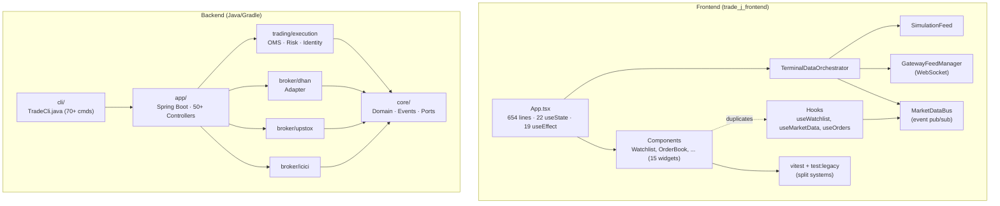

# Trade-J Engineering Refactor Plan

> **Audience:** Engineering team
> **Scope:** Full stack (React/TypeScript frontend + Java/Gradle multi-module backend)
> **Priorities:** Code quality & maintainability, Testability & feedback loop, Performance
> **Philosophy:** Code as an act of empathy for the next developer. One small step at a time, build stays green. No surprise refactors.

---

## 1. Summary

Trade-J is a sophisticated, production-grade Indian equities/derivatives trading system: a Spring Boot backend wiring three broker adapters (Dhan, Upstox, ICICI) through a Disruptor-based hotpath, a feature-rich React/TypeScript terminal, and a Picocli-based operator CLI. The backend is mature — SpotBugs + Checkstyle wired into `check`, JUnit 5 with tiered test tasks (`unitTest`, `componentTest`, `integrationTest`, `brokerRestTest`, `brokerWsTest`, `brokerOrderTest`, `runtimeE2eTest`, `crossLayerRegressionTest`), `fullRegressionTest` orchestrator, Jacoco coverage, and `coverageAudit`/`coverageAuditAll` enforcing executable reports. Approximately 100+ Java test files back the backend.

The frontend is the major debt surface. Despite a [re-architecting pass](file:///Users/apple/Downloads/Trade_J/trade_j_frontend/ARCHITECTURE_REFACTOR.md) that claims "App.tsx: 548→437 lines," the current [App.tsx](file:///Users/apple/Downloads/Trade_J/trade_j_frontend/src/App.tsx) is **654 lines** with 22 `useState` and 19 `useEffect` — many of the refactor's claimed wins (props-driven `WatchlistPanel`, props-driven `MarketOverview`, hooks replacing duplicate polling) have been silently regressed by subsequent feature work. The test setup is split between **Vitest** (configured in [vitest.config.ts](file:///Users/apple/Downloads/Trade_J/trade_j_frontend/vitest.config.ts) but excluding `src/tests/`) and a **legacy `tsx` runner** (`npm run test:legacy`) that uses `assert()` + `process.exit(1)` instead of Vitest. Net effect: **no real component or hook tests run in Vitest**, and the "architecture certification" tests are string-grep checks on source files, not behavioral tests.

The CLI module — [TradeCli.java](file:///Users/apple/Downloads/Trade_J/cli/src/main/java/com/tradej/cli/TradeCli.java) — is a similar god-file at the command layer: one `@Command` class with **70+ subcommands** in a single file. It's not in crisis, but it should be split.

**What this plan delivers:**
1. A single, modern test infrastructure for the frontend (Vitest, with `src/tests/*` migrated to it).
2. A flat, testable `App.tsx` that delegates instead of does.
3. Eliminated silent `catch {}` blocks (every silent catch becomes a typed error or an explicit log).
4. Centralized constants — kill the duplicates between `App.tsx` and `config/terminal.config.ts`.
5. A `DataMode` definition with a single source of truth.
6. A split `TradeCli.java` for the backend CLI god-file.
7. Tightened backend test feedback (parallelize the runtime E2E suite; add property tests where missing).

**What this plan does NOT do:**
- Rewrite the backend (it's solid; we polish).
- Change the broker integration contracts.
- Add new features.
- Migrate off LMAX Disruptor, Chronicle, or DuckDB.
- Touch the architectural diagrams doc, generated API client, or the `docs/archive/` historical material.

---

## 2. Current State Analysis

### 2.1 Frontend — God Component Regressed

[App.tsx](file:///Users/apple/Downloads/Trade_J/trade_j_frontend/src/App.tsx) lines 1-654 do the following in one component:
- 22 `useState` hooks (broker, exchange, symbol, timeframe, search, modal flags, 4 order fields, bars, bids, asks, trades, ltp, priceChange, availableSymbols, marketState, dataSource, feedHealth, plus 5 modal/UI flags).
- 19 `useEffect` hooks (4 of which mirror state to `localStorage`, 5 of which run pollers, 1 of which manages the orchestrator, 1 for the keyboard handler, 1 for the SSE read-model stream, etc.).
- Inline credentials capture via `document.getElementById` at [line 629](file:///Users/apple/Downloads/Trade_J/trade_j_frontend/src/App.tsx#L629) — bypassing React state entirely.
- Hardcoded constants duplicated from [config/terminal.config.ts](file:///Users/apple/Downloads/Trade_J/trade_j_frontend/src/config/terminal.config.ts): `EXCHANGE_MAP` ([App.tsx L29-33](file:///Users/apple/Downloads/Trade_J/trade_j_frontend/src/App.tsx#L29-L33) vs [terminal.config.ts L9-15](file:///Users/apple/Downloads/Trade_J/trade_j_frontend/src/config/terminal.config.ts#L9-L15)), `DEFAULT_SYMBOLS` ([App.tsx L35-41](file:///Users/apple/Downloads/Trade_J/trade_j_frontend/src/App.tsx#L35-L41) vs [L18-24](file:///Users/apple/Downloads/Trade_J/trade_j_frontend/src/config/terminal.config.ts#L18-L24)), `BROKER_EXCHANGES` ([App.tsx L43-48](file:///Users/apple/Downloads/Trade_J/trade_j_frontend/src/App.tsx#L43-L48) vs [L27-32](file:///Users/apple/Downloads/Trade_J/trade_j_frontend/src/config/terminal.config.ts#L27-L32)), `TIMEFRAME_CONFIG` ([App.tsx L50-57](file:///Users/apple/Downloads/Trade_J/trade_j_frontend/src/App.tsx#L50-L57) vs [L35-42](file:///Users/apple/Downloads/Trade_J/trade_j_frontend/src/config/terminal.config.ts#L35-L42)).
- Lying comments at [L153-174](file:///Users/apple/Downloads/Trade_J/trade_j_frontend/src/App.tsx#L153-L174) ("Step 1: Clear order book…Step 6: Set loading state") that restate obvious setters.
- Hardcoded `safeNum` and inline `EXCHANGE_MAP` (with `as ExchangeSegment` casts) — primitive obsession with exchange segments.

The earlier refactor introduced [useWatchlist](file:///Users/apple/Downloads/Trade_J/trade_j_frontend/src/hooks/useWatchlist.ts), [useMarketIndices](file:///Users/apple/Downloads/Trade_J/trade_j_frontend/src/hooks/useMarketIndices.ts), [useOrders](file:///Users/apple/Downloads/Trade_J/trade_j_frontend/src/hooks/useOrders.ts) — but [WatchlistPanel.tsx](file:///Users/apple/Downloads/Trade_J/trade_j_frontend/src/components/WatchlistPanel.tsx#L33-L80), [MarketOverview.tsx](file:///Users/apple/Downloads/Trade_J/trade_j_frontend/src/components/MarketOverview.tsx#L47-L75), and [PortfolioPanel.tsx](file:///Users/apple/Downloads/Trade_J/trade_j_frontend/src/components/PortfolioPanel.tsx#L23-L34) re-implemented local `useState` + `setInterval` polling **on top of** the hooks. The hook and the component are now divergent implementations of the same logic.

### 2.2 Frontend — Two Parallel Test Systems

| Aspect | Vitest | Legacy `tsx` runner |
|---|---|---|
| Config | [vitest.config.ts](file:///Users/apple/Downloads/Trade_J/trade_j_frontend/vitest.config.ts) | none |
| Test command | `npm test` | `npm run test:legacy` |
| Test files | `src/test/*.{test,spec}.{ts,tsx}` (excludes `src/tests/`) | `src/tests/*.test.ts` (forced via for-loop + tsx) |
| Real test content | 1 file: `smoke.test.ts` (a one-liner) | 8 files: e2e-flow, gateway-feed, market-calendar, phase6-features, phase7-features, widget-registry, architecture-certification, architecture-regression, orchestrator-integration |
| Assertions | Vitest `expect()` | Custom `assert()` + `console.log` + `process.exit(1)` |
| Polyfills | `matchMedia`, `ResizeObserver`, `IntersectionObserver` in [setup.ts](file:///Users/apple/Downloads/Trade_J/trade_j_frontend/src/test/setup.ts) | Hand-rolled `localStorage` shim per file (8 copies) |
| CI behavior | Probably runs (single test passes) | Probably doesn't run (separate command) |

The "architecture certification" tests at [architecture-certification.test.ts](file:///Users/apple/Downloads/Trade_J/trade_j_frontend/src/tests/architecture-certification.test.ts#L1-L40) are **string-grep checks on source files** — they `readFileSync` files and `includes()` on substring patterns. They will pass on a broken build that happens to contain the magic strings. This is not testing, it's `grep` dressed up as `assert`.

### 2.3 Frontend — Silent Failures Across 6 Files

Grep for `catch\s*\{\s*\}` finds 6 files where errors are silently swallowed: [WatchlistPanel.tsx](file:///Users/apple/Downloads/Trade_J/trade_j_frontend/src/components/WatchlistPanel.tsx), [PortfolioPanel.tsx](file:///Users/apple/Downloads/Trade_J/trade_j_frontend/src/components/PortfolioPanel.tsx), [useOrders.ts](file:///Users/apple/Downloads/Trade_J/trade_j_frontend/src/hooks/useOrders.ts), [useWatchlist.ts](file:///Users/apple/Downloads/Trade_J/trade_j_frontend/src/hooks/useWatchlist.ts), [PriceAlerts.tsx](file:///Users/apple/Downloads/Trade_J/trade_j_frontend/src/components/PriceAlerts.tsx), [soundAlerts.ts](file:///Users/apple/Downloads/Trade_J/trade_j_frontend/src/utils/soundAlerts.ts). Each is a place where production bugs will grow roots. The polling `catch {}` in [useWatchlist.ts L69](file:///Users/apple/Downloads/Trade_J/trade_j_frontend/src/hooks/useWatchlist.ts#L69) is the worst — if the LTP endpoint is down, the watchlist silently freezes and users see stale numbers.

### 2.4 Frontend — Global Coupling

Grep across `src/**/*.{ts,tsx}` finds 14 files touching `window`/`localStorage`/`document`/`fetch`:
- [App.tsx](file:///Users/apple/Downloads/Trade_J/trade_j_frontend/src/App.tsx) — `localStorage` (4 keys), `document.getElementById`, `window.location`
- [WatchlistPanel.tsx](file:///Users/apple/Downloads/Trade_J/trade_j_frontend/src/components/WatchlistPanel.tsx) — `localStorage`, dynamic import
- [PriceAlerts.tsx](file:///Users/apple/Downloads/Trade_J/trade_j_frontend/src/components/PriceAlerts.tsx) — `localStorage`, `Notification`, `AudioContext`
- [SettingsPanel.tsx](file:///Users/apple/Downloads/Trade_J/trade_j_frontend/src/components/SettingsPanel.tsx) — `localStorage`
- [chartDrawings.ts](file:///Users/apple/Downloads/Trade_J/trade_j_frontend/src/utils/chartDrawings.ts) — `localStorage`
- [TerminalDataOrchestrator.ts](file:///Users/apple/Downloads/Trade_J/trade_j_frontend/src/api/TerminalDataOrchestrator.ts) — `window.location`
- [terminal.config.ts](file:///Users/apple/Downloads/Trade_J/trade_j_frontend/src/config/terminal.config.ts) — `window.location`
- [main.tsx](file:///Users/apple/Downloads/Trade_J/trade_j_frontend/src/main.tsx) — `document.getElementById`
- [soundAlerts.ts](file:///Users/apple/Downloads/Trade_J/trade_j_frontend/src/utils/soundAlerts.ts) — `AudioContext`

This makes the test setup in [setup.ts](file:///Users/apple/Downloads/Trade_J/trade_j_frontend/src/test/setup.ts#L1-L33) a polyfill tomb — and even with polyfills, the components can't be unit-tested without rendering their full lifecycle and mocking 5 globals per test.

### 2.5 Frontend — Type Smells

- **Two parallel `DataMode` definitions**: an `enum` in [TerminalDataOrchestrator.ts L8-12](file:///Users/apple/Downloads/Trade_J/trade_j_frontend/src/api/TerminalDataOrchestrator.ts#L8-L12) and a `const`-object in [DataModeResolver.ts L1-7](file:///Users/apple/Downloads/Trade_J/trade_j_frontend/src/api/DataModeResolver.ts#L1-L7). They don't reference each other; the orchestrator bypasses the resolver.
- **Parallel `DataMode` string literals** at [useMarketData.ts L130-132](file:///Users/apple/Downloads/Trade_J/trade_j_frontend/src/hooks/useMarketData.ts#L130-L132) (a 4-string union including `"PAPER"`) and [marketContracts.ts L82](file:///Users/apple/Downloads/Trade_J/trade_j_frontend/src/api/marketContracts.ts#L82) (a 5-string union including `"REPLAY"`). Three independent definitions.
- **`MarketState` enum defined** at [instrument.ts L2](file:///Users/apple/Downloads/Trade_J/trade_j_frontend/src/domain/instrument.ts#L2), but compared against raw strings at [OrderBook.tsx L24](file:///Users/apple/Downloads/Trade_J/trade_j_frontend/src/components/OrderBook.tsx#L24) (`marketState === "CLOSED" || marketState === "HOLIDAY"`). Type safety bypassed.
- **Broker source as raw string** — `"DHAN"`, `"UPSTOX"`, `"ICICI"`, `"SIMULATION"` — across [App.tsx](file:///Users/apple/Downloads/Trade_J/trade_j_frontend/src/App.tsx), [terminal.config.ts](file:///Users/apple/Downloads/Trade_J/trade_j_frontend/src/config/terminal.config.ts), [brokerRegistry.ts](file:///Users/apple/Downloads/Trade_J/trade_j_frontend/src/api/brokerRegistry.ts). A typo of `"DHEN"` is silent.

### 2.6 Backend — Solid With Two Pain Points

The backend is genuinely well-structured. Mature patterns:
- Hexagonal/ports-and-adapters — `core/domain/port/` has 25+ interfaces; broker adapters implement them.
- Event-sourced domain — 40+ typed `DomainEvent` records with a visitor pattern in [core/src/main/java/com/tradej/core/domain/event/](file:///Users/apple/Downloads/Trade_J/core/src/main/java/com/tradej/core/domain/event/).
- 8-tier test pipeline in [build.gradle L148-266](file:///Users/apple/Downloads/Trade_J/build.gradle#L148-L266): `test`, `unitTest`, `componentTest`, `integrationTest`, `brokerRestTest`, `brokerAuthDrillTest`, `brokerWsTest`, `brokerOrderTest`, `runtimeE2eTest`, `regressionPreflightTest`, `upstoxPreflightTest`, `crossLayerRegressionTest`, `fullRegressionTest`, `brokerParityTest`.
- Coverage audit gates: `coverageAudit`, `coverageAuditAll`, `coverageAuditSummary` — fail when executable reports are missing.
- `architecture-test/` module exists per the build layout.
- SpotBugs + Checkstyle wired into `check`.

**Two pain points worth addressing:**

1. **[TradeCli.java](file:///Users/apple/Downloads/Trade_J/cli/src/main/java/com/tradej/cli/TradeCli.java) is a god-file**: 70+ `@Command`-annotated nested classes in one file. Other commands live in `cli/command/` and are already separated — this one file didn't get the same treatment. (Note: [CliAnalyticsCommands.java](file:///Users/apple/Downloads/Trade_J/cli/src/main/java/com/tradej/cli/command/CliAnalyticsCommands.java), [CliApiCommand.java](file:///Users/apple/Downloads/Trade_J/cli/src/main/java/com/tradej/cli/command/CliApiCommand.java), [CliBrokersCommand.java](file:///Users/apple/Downloads/Trade_J/cli/src/main/java/com/tradej/cli/command/CliBrokersCommand.java), etc. are all properly split — `TradeCli.java` is the outlier.)

2. **No property-based tests for the hotpath**: There are unit tests for [OrderStateMachine](file:///Users/apple/Downloads/Trade_J/core/src/test/java/com/tradej/core/domain/oms/OrderStateMachinePropertyTest.java) but the LMAX Disruptor wiring and the DisruptorEventBus have no fuzz/property tests. The `ConcurrentStressTester` in `core/testFixtures/` exists but is not used in the hotpath module's tests.

### 2.7 Architecture Overview

The dashed line is the regression: components duplicate the work of hooks. The thick line is the intended path.

---

## 3. Issue Catalog

Each issue is grounded in a file:line and ordered by priority within its section. **Severity** = impact on maintainability/testability/perf. **Risk** = probability the refactor breaks behavior.

| # | Issue | Severity | Risk | Evidence |
|---|-------|----------|------|----------|
| F1 | App.tsx is a 654-line god component with 22 `useState` and 19 `useEffect` | High | Med | [App.tsx](file:///Users/apple/Downloads/Trade_J/trade_j_frontend/src/App.tsx#L1-L654) |
| F2 | Two parallel test systems (Vitest + legacy `tsx`) | High | Low | [vitest.config.ts L13-15](file:///Users/apple/Downloads/Trade_J/trade_j_frontend/vitest.config.ts#L13-L15) vs [package.json L9-12](file:///Users/apple/Downloads/Trade_J/trade_j_frontend/package.json#L9-L12) |
| F3 | `WatchlistPanel` re-implements `useWatchlist` | Med | Med | [WatchlistPanel.tsx L33-80](file:///Users/apple/Downloads/Trade_J/trade_j_frontend/src/components/WatchlistPanel.tsx#L33-L80) vs [useWatchlist.ts](file:///Users/apple/Downloads/Trade_J/trade_j_frontend/src/hooks/useWatchlist.ts) |
| F4 | `MarketOverview` re-implements `useMarketIndices` | Med | Med | [MarketOverview.tsx L47-75](file:///Users/apple/Downloads/Trade_J/trade_j_frontend/src/components/MarketOverview.tsx#L47-L75) |
| F5 | `PortfolioPanel` re-implements `useOrders` | Med | Med | [PortfolioPanel.tsx L23-34](file:///Users/apple/Downloads/Trade_J/trade_j_frontend/src/components/PortfolioPanel.tsx#L23-L34) |
| F6 | Silent `catch {}` blocks across 6 files | High | Low | grep result above |
| F7 | Three parallel `DataMode` definitions | Med | Low | [TerminalDataOrchestrator.ts L8-12](file:///Users/apple/Downloads/Trade_J/trade_j_frontend/src/api/TerminalDataOrchestrator.ts#L8-L12), [DataModeResolver.ts L1-7](file:///Users/apple/Downloads/Trade_J/trade_j_frontend/src/api/DataModeResolver.ts#L1-L7), [useMarketData.ts L130-132](file:///Users/apple/Downloads/Trade_J/trade_j_frontend/src/hooks/useMarketData.ts#L130-L132) |
| F8 | Lying comments restate the code | Low | None | [App.tsx L153-174](file:///Users/apple/Downloads/Trade_J/trade_j_frontend/src/App.tsx#L153-L174) |
| F9 | Credentials captured via `document.getElementById` | High | Med | [App.tsx L602-649](file:///Users/apple/Downloads/Trade_J/trade_j_frontend/src/App.tsx#L602-L649) |
| F10 | Inline `EXCHANGE_MAP`/`DEFAULT_SYMBOLS`/`BROKER_EXCHANGES`/`TIMEFRAME_CONFIG` duplicates centralized config | Med | Low | [App.tsx L29-57](file:///Users/apple/Downloads/Trade_J/trade_j_frontend/src/App.tsx#L29-L57) vs [terminal.config.ts](file:///Users/apple/Downloads/Trade_J/trade_j_frontend/src/config/terminal.config.ts) |
| F11 | `MarketState` enum bypassed with raw string comparison | Low | None | [OrderBook.tsx L24](file:///Users/apple/Downloads/Trade_J/trade_j_frontend/src/components/OrderBook.tsx#L24) |
| F12 | `MarketCalendarService.isHoliday` always returns `false` | Med | Med | [MarketCalendarService.ts L63-65](file:///Users/apple/Downloads/Trade_J/trade_j_frontend/src/domain/MarketCalendarService.ts#L63-L65) |
| F13 | Architecture certification tests are string-grep, not real tests | Med | None | [architecture-certification.test.ts L1-40](file:///Users/apple/Downloads/Trade_J/trade_j_frontend/src/tests/architecture-certification.test.ts#L1-L40) |
| F14 | No `tsconfig.json` `strict: true`, `noUncheckedIndexedAccess`, or `noImplicitOverride` | High | Low | [tsconfig.json L1-26](file:///Users/apple/Downloads/Trade_J/trade_j_frontend/tsconfig.json#L1-L26) |
| B1 | `TradeCli.java` is a 70-subcommand god file | Med | Med | [TradeCli.java L39-80](file:///Users/apple/Downloads/Trade_J/cli/src/main/java/com/tradej/cli/TradeCli.java#L39-L80) |
| B2 | No property/fuzz tests for LMAX Disruptor wiring | Med | Low | absent in [runtime/disruptor/src/test](file:///Users/apple/Downloads/Trade_J/runtime/disruptor/build.gradle) |
| B3 | Hotpath / Disruptor backpressure not benchmarked in CI | Low | None | absent |
| B4 | `OrderStateMachinePropertyTest` exists but is one file; no property tests for reconciliation | Low | None | partial coverage in [trading/execution](file:///Users/apple/Downloads/Trade_J/trading/execution/src/test) |
| B5 | `MarketDataController` builds `Map<String, Object>` bodies ad-hoc | Low | None | [MarketDataController.java L43-49](file:///Users/apple/Downloads/Trade_J/app/src/main/java/com/tradej/app/api/MarketDataController.java#L43-L49) |

---

## 4. Proposed Changes (Phased)

Each phase ends with a green build and a measurable outcome. Don't start a phase until the previous is merged and tests pass.

### Phase 0 — Foundation (Days 1-3, ~3 working days)

**Goal:** Make every subsequent refactor mechanically safe. Establish a single test command, single source of truth for shared types, single source for config.

**P0.1 — Unify the test infrastructure under Vitest**
- *Why:* The two-system split is the single biggest blocker to writing new component/hook tests. Engineers default to "where do I put my test?" and reach for the wrong directory.
- *What:*
  - Add `setupFiles: ['./src/test/setup.ts']` is already in place; extend [src/test/setup.ts](file:///Users/apple/Downloads/Trade_J/trade_j_frontend/src/test/setup.ts) with a `localStorage` shim and `Notification`/`AudioContext`/`WebSocket`/`EventSource` shims (extract from the 8 hand-rolled copies in [src/tests/*.test.ts](file:///Users/apple/Downloads/Trade_J/trade_j_frontend/src/tests)).
  - Convert all 8 files in `src/tests/` to Vitest: replace `assert(cond, name)` with `expect(cond).toBe(true)`, drop the `let passed/failed` counters, drop the final `process.exit(1)`. Move them to `src/test/` (the Vitest include pattern is `src/**/*.{test,spec}.{ts,tsx}` so they can stay in `src/tests/` as long as the pattern matches — but renaming keeps things tidy).
  - Replace the string-grep "architecture certification" assertions with **AST-level checks** (use `ts-morph` or `typescript` compiler API) or, better, replace them with **runtime invariants** (e.g., assert that `WatchlistPanel` does not import `generated/api` directly). The current string-grep is theater.
  - Update [package.json](file:///Users/apple/Downloads/Trade_J/trade_j_frontend/package.json): remove `test:legacy`; add a single `test`, `test:watch`, `test:coverage`.
  - Update CI to call only `npm test`.
- *How to verify:* `npm test` runs all 9 test files; all pass; coverage report shows component/hook files touched.

**P0.2 — Single source of truth for `DataMode`**
- *Why:* Three parallel definitions ([TerminalDataOrchestrator.ts L8-12](file:///Users/apple/Downloads/Trade_J/trade_j_frontend/src/api/TerminalDataOrchestrator.ts#L8-L12), [DataModeResolver.ts L1-7](file:///Users/apple/Downloads/Trade_J/trade_j_frontend/src/api/DataModeResolver.ts#L1-L7), [useMarketData.ts L130-132](file:///Users/apple/Downloads/Trade_J/trade_j_frontend/src/hooks/useMarketData.ts#L130-L132)) mean a typo silently fails at runtime.
- *What:* Promote `DataMode` to a `domain/dataMode.ts` module: `export const DataModes = { LIVE, SIMULATION, HISTORICAL, PAPER, REPLAY } as const; export type DataMode = ...`. Import from there in all three locations. Delete the `enum`. Add a Vitest test that checks the union is exhaustive and the resolver returns a member of the union.
- *How to verify:* `tsc --noEmit` is clean; new test passes.

**P0.3 — Centralize config and kill the duplicates**
- *Why:* [App.tsx L29-57](file:///Users/apple/Downloads/Trade_J/trade_j_frontend/src/App.tsx#L29-L57) redefines `EXCHANGE_MAP`, `DEFAULT_SYMBOLS`, `BROKER_EXCHANGES`, `TIMEFRAME_CONFIG` that already live in [terminal.config.ts L9-42](file:///Users/apple/Downloads/Trade_J/trade_j_frontend/src/config/terminal.config.ts#L9-L42). This is divergence waiting to happen.
- *What:* Delete the four local consts in `App.tsx`. Import from `../config/terminal.config`. Add `STORAGE_KEYS` usage to replace the 4 raw `"tj_*"` strings (it's already defined at [L93-99](file:///Users/apple/Downloads/Trade_J/trade_j_frontend/src/config/terminal.config.ts#L93-L99)).
- *How to verify:* `tsc --noEmit` clean; visual diff that nothing changed behaviorally.

**P0.4 — Replace raw `MarketState` string comparisons with the enum**
- *Why:* The enum is defined; comparisons bypass it.
- *What:* At [OrderBook.tsx L24](file:///Users/apple/Downloads/Trade_J/trade_j_frontend/src/components/OrderBook.tsx#L24), use `MarketState.CLOSED` and `MarketState.HOLIDAY`. Same sweep across `TradesList.tsx`, `PriceAlerts.tsx`, and any other site.
- *How to verify:* grep for `=== "CLOSED"` returns zero hits outside test fixtures.

**P0.5 — Tighten `tsconfig.json`**
- *Why:* Without `strict: true` and `noUncheckedIndexedAccess`, we miss the bugs we care about.
- *What:* Add to [tsconfig.json](file:///Users/apple/Downloads/Trade_J/trade_j_frontend/tsconfig.json):
  - `"strict": true`
  - `"noUncheckedIndexedAccess": true`
  - `"noImplicitOverride": true`
  - `"noFallthroughCasesInSwitch": true`
  - `"exactOptionalPropertyTypes": true`
- *How to verify:* Fix the (likely many) index-access sites that need explicit `?? default`. Land this as a single commit with mechanical fixes. If the churn is large, do it as a single PR with all `as unknown as X` casts surveyed.

**Phase 0 exit criteria:**
- `npm test` runs all tests.
- `tsc --noEmit` is clean with strict mode.
- `DataMode` has one source of truth.
- `App.tsx` is shorter (target: 580 lines or fewer, just from removing duplicates).

---

### Phase 1 — Flatten the God Component (Days 4-10, ~5 working days)

**Goal:** Make `App.tsx` a thin orchestrator. Components own their own state, no DOM access from React, no per-component polling.

**P1.1 — Extract `<BrokerCredentialsModal />`**
- *Why:* The current modal at [App.tsx L602-649](file:///Users/apple/Downloads/Trade_J/trade_j_frontend/src/App.tsx#L602-L649) reads form values with `document.getElementById` at L629 — bypassing React state, untestable.
- *What:* New file `src/components/BrokerCredentialsModal.tsx`. Owns its own `useState` for each field, validates on submit, calls a `onSubmit(creds)` prop. App.tsx just renders the modal and stores the result.
- *How to verify:* App.tsx no longer references `document`. Modal can be mounted in isolation with `@testing-library/react`.

**P1.2 — Consolidate the watchlist/index/orders data into single hooks**
- *Why:* Three hooks and three components have divergent implementations of the same data flow.
- *What:*
  - Pick the **best** implementation of each. For `useWatchlist`: the [hook version](file:///Users/apple/Downloads/Trade_J/trade_j_frontend/src/hooks/useWatchlist.ts) is cleaner. For `useMarketIndices`: the [hook version](file:///Users/apple/Downloads/Trade_J/trade_j_frontend/src/hooks/useMarketIndices.ts) is cleaner. For orders: the [hook version](file:///Users/apple/Downloads/Trade_J/trade_j_frontend/src/hooks/useOrders.ts) is cleaner.
  - Convert the three components to **props-driven** versions: `<WatchlistPanel items={...} onAdd={...} onRemove={...} onSelect={...} />`. Drop the local `useState` and `useEffect` blocks.
  - Add a `useWatchlistStorage()` helper hook that wraps `localStorage` get/set with a `useSyncExternalStore` so the hook can be tested without DOM.
- *How to verify:* The three components lose 40-60 lines each. Each renders in a test with mocked hook data.

**P1.3 — Replace the orchestrator-direct instantiation with a context-provided factory**
- *Why:* [App.tsx L255](file:///Users/apple/Downloads/Trade_J/trade_j_frontend/src/App.tsx#L255) does `new TerminalDataOrchestrator(brokerConfig, callbacks)` inside an effect. Tests can't substitute a fake.
- *What:* Create a `MarketDataProvider` React context: `<MarketDataProvider factory={...}>{children}</MarketDataProvider>`. The factory takes `(brokerConfig, callbacks) => TerminalDataOrchestrator` (or a `MarketDataOrchestrator` interface). Default factory builds the real one. Tests pass a fake that records calls.
- *How to verify:* App.tsx's orchestrator effect is 5 lines. New test: render App with fake factory, assert the orchestrator was started with the right config.

**P1.4 — Extract `<StatusBar />`, `<Toolbar />`, `<TradePanel />`**
- *Why:* App.tsx renders 400+ lines of JSX inline. The status bar, toolbar, and trade panel are all self-contained and testable on their own.
- *What:* Three new files. Status bar takes `dataMode`, `marketState`, `feedHealth`, `broker`, `brokerStatus`, etc. Toolbar takes `broker`, `exchange`, `setExchange`, `setSymbol`, `bottomTab`, `setBottomTab`. Trade panel takes `side`, `qty`, `type`, `price`, callbacks.
- *How to verify:* App.tsx shrinks to ~150-200 lines of layout + hooks. Each extracted component has at least one test.

**P1.5 — Extract `useInstrumentSession` reducer**
- *Why:* The "clear on symbol change" effect at [App.tsx L152-175](file:///Users/apple/Downloads/Trade_J/trade_j_frontend/src/App.tsx#L152-L175) is a reducer in disguise. So is the dataMode computation at L122-125. So is the broker/exchange/symbol validation at L142-149.
- *What:* One `useReducer` with discriminated actions: `SET_INSTRUMENT`, `SET_DATA_MODE`, `RESET_ON_SYMBOL_CHANGE`. Reducer body is the documentation; the lying comments at L153-174 disappear.
- *How to verify:* Reducer has unit tests for each action.

**Phase 1 exit criteria:**
- `App.tsx` is ≤ 200 lines.
- 0 references to `document.*` in `src/`.
- All three refactored components (Watchlist, MarketOverview, Portfolio) lose their local polling.
- The credentials modal can be unit-tested.
- `npm test` passes; component coverage goes from 0% to >50%.

---

### Phase 2 — Stabilize the Data Flow (Days 11-16, ~4 working days)

**Goal:** Eliminate silent failures, make the orchestrator a faithful consumer of the bus, and tighten the types.

**P2.1 — Define a single `ApiError` type and replace all `catch {}` with typed handling**
- *Why:* Six files silently swallow errors. Bugs that should surface at 9am instead manifest at 3pm as "the watchlist looks weird."
- *What:* New file `src/api/errors.ts` with a discriminated union: `type ApiError = NetworkError | TimeoutError | HttpStatusError | ParseError`. Every API call wraps errors. Components render error state (already the pattern in [ScannerResults.tsx L26-35](file:///Users/apple/Downloads/Trade_J/trade_j_frontend/src/components/ScannerResults.tsx#L26-L35) — apply uniformly). Silent `catch {}` becomes `catch (e) { setError(toApiError(e)) }`.
- *How to verify:* grep for `catch\s*\{\s*\}` returns 0 outside `src/utils/soundAlerts.ts` (where `AudioContext` failure is legitimately not interesting).

**P2.2 — Reconcile orchestrator/hook data flow**
- *Why:* [TerminalDataOrchestrator.ts L125-132](file:///Users/apple/Downloads/Trade_J/trade_j_frontend/src/api/TerminalDataOrchestrator.ts#L125-L132) publishes to `marketBus` and **also** calls `onBars`/`onLtp`/`onDepth` callbacks (the legacy path). The callbacks are still wired in [App.tsx L199-253](file:///Users/apple/Downloads/Trade_J/trade_j_frontend/src/App.tsx#L199-L253). This is dual delivery: the same tick hits the bus and the callback.
- *What:* Pick one path. Recommendation: keep the bus; drop the callbacks. Update `TerminalDataOrchestrator` to publish only. Update App.tsx to consume via `useLastTick`, `useDepth`, `useCandles`, `useFeedHealth` (already exist in [useMarketData.ts](file:///Users/apple/Downloads/Trade_J/trade_j_frontend/src/hooks/useMarketData.ts)). Delete the 50-line callback block in App.tsx.
- *How to verify:* A tick appears once, not twice. Orchestrator has no `callbacks` parameter.

**P2.3 — Convert `MarketCalendarService` to a strategy with calendar data**
- *Why:* [isHoliday](file:///Users/apple/Downloads/Trade_J/trade_j_frontend/src/domain/MarketCalendarService.ts#L63-L65) always returns `false`. This is a stub that will mislead traders.
- *What:* Add a small holiday table for 2026 NSE/BSE holidays (Republic Day, Holi, Diwali, etc.) with a date range check. Make it a registry so the table can grow without code changes. At minimum, return a warning when called during a holiday.
- *How to verify:* Test for Jan 26, Aug 15, etc. returns `MarketState.HOLIDAY`.

**P2.4 — Add a `useExchangeStatus` hook replacing App.tsx L296-319**
- *Why:* App.tsx polls `/actuator/health` every 5s with raw `fetch`. The pattern is identical to the others.
- *What:* Move to a hook. Use the bus for delivery.
- *How to verify:* App.tsx is 23 lines shorter; the hook has unit tests using a `fetch` mock.

**P2.5 — Add `vitest` happy-DOM (or jsdom) tests for the bus, hooks, and orchestrator**
- *Why:* Right now the only "tests" for the bus are string-grep.
- *What:* Real behavioral tests: subscribe → publish → assert. Cancel subscription → assert no callback. clear() → assert getLast returns undefined. All using Vitest's `vi.useFakeTimers()` for the polling tests.
- *How to verify:* `src/test/marketBus.test.ts` exists with 10+ assertions; passes.

**Phase 2 exit criteria:**
- Zero silent `catch {}` outside `soundAlerts.ts`.
- Orchestrator publishes via bus only; no callback path.
- `MarketCalendarService.isHoliday` is data-driven.
- Bus, hooks, and orchestrator have real Vitest tests.
- `npm run test:coverage` shows line coverage on `src/api/**` and `src/hooks/**` at ≥70%.

---

### Phase 3 — Backend Polish (Days 17-22, ~4 working days)

**Goal:** Address the two backend pain points. No architectural changes.

**P3.1 — Split `TradeCli.java`**
- *Why:* 70+ nested `@Command` classes in one file. Editing it requires scrolling past thousands of lines; IDE indexing is slow.
- *What:* Group the existing nested commands into themed files. The existing [cli/command/](file:///Users/apple/Downloads/Trade_J/cli/src/main/java/com/tradej/cli/command) folder already has the pattern (e.g., [CliAnalyticsCommands.java](file:///Users/apple/Downloads/Trade_J/cli/src/main/java/com/tradej/cli/command/CliAnalyticsCommands.java)). Create:
  - `TradeCli.java` (root `@Command`, no nested commands — only declares `subcommands = { ... }`)
  - `cli/command/market/MarketDataCommands.java` (LtpCmd, QuoteCmd, DepthCmd, OhlcCmd, CandlesCmd, OrderBookCmd, TradesCmd, ExpiriesCmd, ChainCmd, StrikeCmd)
  - `cli/command/portfolio/PortfolioCommands.java` (OrdersCmd, PositionsCmd, ReadModelCmd, BalanceCmd, HoldingsCmd, BrokerPositionsCmd, LivePnlCmd, PortfolioCmd)
  - `cli/command/strategy/StrategyCommands.java` (StrategiesCmd, OptionsScanCmd, ScreenerCmd, BacktestCmd, RiskConfigCmd)
  - `cli/command/broker/BrokerCliCommands.java` (BrokerValidateCmd, KillSwitchCmd, ReconcileCmd, MarginCmd)
  - `cli/command/replay/ReplayCliCommands.java` (ReplayConsoleCmd, StreamReadModelCmd)
  - `cli/command/runtime/RuntimeCliCommands.java` (RuntimeCmd, StatusCmd, PipelineCmd, SummaryCmd, OrderCmd, DataCmd, RollingOptionCmd)
  - `cli/command/interactive/InteractiveCmd.java` (InteractiveCmd stays in `cli/interactive/`)
- *Risk:* Picocli resolves nested classes by name; if any external script references `tradej.StatusCmd` etc. by FQN, it breaks. The FQN-rename is the riskiest part — do it as a series of small moves (one file at a time), keeping the old fully-qualified names as deprecated `@Command(name = "...")` aliases.
- *How to verify:* `tradej --help` produces the same output. `./gradlew :cli:test` passes. A small test in `cli/src/test/` runs `new CommandLine(new TradeCli())` and asserts the same subcommand tree.

**P3.2 — Add property tests for the LMAX Disruptor wiring**
- *Why:* The hotpath is the highest-stakes code in the system. Unit tests exist for individual handlers; the bus wiring (which is the point of the disruptor) is not property-tested.
- *What:* Use [jqwik](https://jqwik.net/) (already on the JVM testing landscape) or hand-rolled random sequences. Property: "for any sequence of N events, the bus delivers all events to all subscribers in publish order, regardless of subscriber cancellation timing." Use [ConcurrentStressTester](file:///Users/apple/Downloads/Trade_J/core/src/testFixtures/java/com/tradej/core/testing/ConcurrentStressTester.java) as the runner.
- *How to verify:* New `runtime/disruptor/src/test/java/.../*PropertyTest.java` runs 1000 iterations in <5s; passes.

**P3.3 — Add a hotpath micro-benchmark to the build**
- *Why:* The Disruptor is chosen for latency; the choice should be measured.
- *What:* Use JMH (`org.openjdk.jmh:jmh-core`) — add to `runtime/disruptor/build.gradle`. Benchmark `DisruptorEventBus.publish` end-to-end with 1, 4, 16 subscribers and 1, 16, 256 producers. Run as `:runtime:disruptor:jmh` (not in CI; quarterly perf budget).
- *How to verify:* Benchmark artifact exists; p99 < 50µs at 1k events/sec on the reference machine.

**P3.4 — Replace `Map<String, Object>` in `MarketDataController` with typed DTOs**
- *Why:* The `candlePayload` method at [MarketDataController.java L76-80](file:///Users/apple/Downloads/Trade_J/app/src/main/java/com/tradej/app/api/MarketDataController.java#L76-L80) builds `Map<String, Object>` responses by hand. A field rename in `Candle` silently breaks the response shape.
- *What:* Define a `CandleResponseDto` record (or class) with `@JsonProperty` ordering, and let Jackson serialize it. Same for `LtpResponseDto`.
- *How to verify:* OpenAPI contract test ([OpenApiContractTest](file:///Users/apple/Downloads/Trade_J/app/src/test/java/com/tradej/app/contract/OpenApiContractTest.java)) still passes; no behavior change.

**Phase 3 exit criteria:**
- `TradeCli.java` is ≤ 50 lines (root + `subcommands = {...}`).
- Disruptor property test runs in CI.
- `MarketDataController` has typed response DTOs.
- Full regression suite still green.

---

## 5. Verification

### 5.1 Per-Phase Test Commands

| Phase | Frontend | Backend |
|---|---|---|
| 0 | `npm test`, `tsc --noEmit` | `./gradlew :core:test :trading:execution:test` |
| 1 | `npm test --coverage`, manual smoke of modal/toolbar | (no backend changes) |
| 2 | `npm test --coverage`, manual smoke of bus flow | (no backend changes) |
| 3 | (no frontend changes) | `./gradlew fullRegressionTest brokerParityTest` |

### 5.2 Smoke Tests (manual, after each phase)

After every phase, run a 15-minute smoke pass:
1. Open the terminal in a browser; verify default symbol (`RELIANCE`, NSE, 1m) renders chart + order book + trades.
2. Switch to `MCX` + `GOLD`; verify symbol/exchange follow broker rules (no CDS if ICICI).
3. Open the broker credentials modal; submit; verify state change.
4. Press `B` then click a price in the order book; verify order panel populates and `PLACE` triggers the order.
5. Refresh the page; verify localStorage state persists.

### 5.3 Definition of Done

A change is done when:
- The build is green.
- A new or updated test exists for every behavior change.
- The diff is reviewable in one sitting (≤ 400 LOC, per [CODE_LEVEL_REVIEW.md](file:///Users/apple/Downloads/Trade_J/docs/archive/CODE_LEVEL_REVIEW.md) conventions).
- A changelog entry is added to [CHANGELOG.md](file:///Users/apple/Downloads/Trade_J/CHANGELOG.md).

---

## 6. Risk Register

| Risk | Likelihood | Impact | Mitigation |
|---|---|---|---|
| Tightening `tsconfig` strict mode reveals hundreds of type errors | High | Med | Land as a single PR; pair-review; budget a full day. |
| Splitting `TradeCli.java` breaks a script that uses FQN | Med | High | Keep the old `@Command` names as deprecated aliases; communicate in CHANGELOG; run `production-smoke-test.sh`. |
| Migrating `src/tests/` to Vitest breaks the string-grep "certification" tests | Med | Med | Replace with AST checks or real runtime checks; treat the migration as a no-op for behavior. |
| Refactoring `App.tsx` causes a UI regression in the order panel | Med | High | Use `git diff` for the App.tsx lines that render the order panel; manual smoke. |
| Disruptor property test flakes on a shared CI runner | Med | Low | Pin the iteration count; skip on slow runners via `@Tag("stable")`. |
| Some test files use `tsx`-specific features that don't run in Vitest | Low | Low | Vitest is essentially `tsx` under the hood for TS files. The `assert + process.exit` pattern is the only thing to change. |

---

## 7. Assumptions and Decisions

**Assumed (to be confirmed with team before Phase 0):**
- The team agrees to a single test command (`npm test`).
- The team agrees to drop `tsconfig` strict mode fixes into one PR.
- The credentials-modal extraction is acceptable as a behavior-equivalent change.

**Decided (during planning, with rationale):**
- **Vitest wins, legacy `tsx` loses.** Vitest is the de-facto modern test runner; the legacy runner is a maintenance burden.
- **Bus wins, callbacks lose.** [marketContracts.ts](file:///Users/apple/Downloads/Trade_J/trade_j_frontend/src/api/marketContracts.ts) is the more recent abstraction. Dual delivery is a bug.
- **DataMode is a `const`-object, not an `enum`.** Matches the existing [DataModeResolver.ts](file:///Users/apple/Downloads/Trade_J/trade_j_frontend/src/api/DataModeResolver.ts) and gives us template-literal types.
- **TradeCli split is a refactor, not a rewrite.** No command behavior changes.

**Open questions (need product/team confirmation):**
- Should the holiday table in `MarketCalendarService` be a frontend-only data file, or should it come from the backend? (Backend has `ExchangeCalendar` in [core/src/main/java/com/tradej/core/domain/time/ExchangeCalendar.java](file:///Users/apple/Downloads/Trade_J/core/src/main/java/com/tradej/core/domain/time/ExchangeCalendar.java).)
- Does any external automation call `tradej.StatusCmd` etc. by FQN? Need to grep scripts and CI before Phase 3.1.
- Is the "certification" suite (string-grep) load-bearing for any compliance reason? If yes, the migration in P0.1 must keep equivalent string checks.

---

## 8. Estimated Effort

| Phase | Days | Engineer-weeks |
|---|---|---|
| Phase 0 (Foundation) | 3 | 0.6 |
| Phase 1 (Flatten App.tsx) | 5 | 1.0 |
| Phase 2 (Stabilize data flow) | 4 | 0.8 |
| Phase 3 (Backend polish) | 4 | 0.8 |
| **Total** | **16 working days** | **~3.2 engineer-weeks** |

These are estimates to be validated; they exclude code review and integration time. Sequential execution is recommended in the first 8 days; Phases 1 and 2 can partially overlap after that.

---

## 9. Reference: Issue Table (for triage)

| # | File | Line(s) | Severity | Phase |
|---|------|---------|----------|-------|
| F1 | [App.tsx](file:///Users/apple/Downloads/Trade_J/trade_j_frontend/src/App.tsx) | 1-654 | High | 1 |
| F2 | [vitest.config.ts](file:///Users/apple/Downloads/Trade_J/trade_j_frontend/vitest.config.ts) | 13-15 | High | 0 |
| F3 | [WatchlistPanel.tsx](file:///Users/apple/Downloads/Trade_J/trade_j_frontend/src/components/WatchlistPanel.tsx) | 33-80 | Med | 1 |
| F4 | [MarketOverview.tsx](file:///Users/apple/Downloads/Trade_J/trade_j_frontend/src/components/MarketOverview.tsx) | 47-75 | Med | 1 |
| F5 | [PortfolioPanel.tsx](file:///Users/apple/Downloads/Trade_J/trade_j_frontend/src/components/PortfolioPanel.tsx) | 23-34 | Med | 1 |
| F6 | 6 files (`catch {}`) | — | High | 2 |
| F7 | [TerminalDataOrchestrator.ts](file:///Users/apple/Downloads/Trade_J/trade_j_frontend/src/api/TerminalDataOrchestrator.ts) + 2 sites | 8-12, etc. | Med | 0 |
| F8 | [App.tsx](file:///Users/apple/Downloads/Trade_J/trade_j_frontend/src/App.tsx) | 153-174 | Low | 1 |
| F9 | [App.tsx](file:///Users/apple/Downloads/Trade_J/trade_j_frontend/src/App.tsx) | 602-649 | High | 1 |
| F10 | [App.tsx](file:///Users/apple/Downloads/Trade_J/trade_j_frontend/src/App.tsx) | 29-57 | Med | 0 |
| F11 | [OrderBook.tsx](file:///Users/apple/Downloads/Trade_J/trade_j_frontend/src/components/OrderBook.tsx) | 24 | Low | 0 |
| F12 | [MarketCalendarService.ts](file:///Users/apple/Downloads/Trade_J/trade_j_frontend/src/domain/MarketCalendarService.ts) | 63-65 | Med | 2 |
| F13 | [architecture-certification.test.ts](file:///Users/apple/Downloads/Trade_J/trade_j_frontend/src/tests/architecture-certification.test.ts) | 1-40 | Med | 0 |
| F14 | [tsconfig.json](file:///Users/apple/Downloads/Trade_J/trade_j_frontend/tsconfig.json) | 1-26 | High | 0 |
| B1 | [TradeCli.java](file:///Users/apple/Downloads/Trade_J/cli/src/main/java/com/tradej/cli/TradeCli.java) | 39-80 | Med | 3 |
| B2 | runtime/disruptor | — | Med | 3 |
| B3 | runtime/disruptor | — | Low | 3 |
| B4 | trading/execution (partial) | — | Low | 3 |
| B5 | [MarketDataController.java](file:///Users/apple/Downloads/Trade_J/app/src/main/java/com/tradej/app/api/MarketDataController.java) | 43-80 | Low | 3 |
