# Trade-J System Architecture Documentation

> **Version**: 0.1.0-SNAPSHOT  
> **Generated**: 2026-06-03  
> **Tech Stack**: Java 21, Spring Boot 3.5.0, Gradle, LMAX Disruptor, Chronicle Queue, DuckDB, WebSocket

---

## Table of Contents

1. [File Tree Hierarchy](#1-file-tree-hierarchy)
2. [System Architecture Overview](#2-system-architecture-overview)
3. [Module Relationships & Dependencies](#3-module-relationships--dependencies)
4. [Spring Configuration Details](#4-spring-configuration-details)
5. [API Contracts & Endpoints](#5-api-contracts--endpoints)
6. [Class Diagrams](#6-class-diagrams)
7. [Component Diagrams](#7-component-diagrams)
8. [Event Flow Diagrams](#8-event-flow-diagrams)
9. [Data Flow Diagrams](#9-data-flow-diagrams)
10. [Key Design Patterns](#10-key-design-patterns)

---

## 1. File Tree Hierarchy

```
trade-j/
├── .github/workflows/ci.yml
├── .gitignore
├── .gradle/
├── .idea/
├── .junie/
├── .openclaude/
├── app-test-errors.txt
├── build.gradle                          # Root build config
├── conductor/                            # Project planning & workflow docs
│   ├── index.md
│   ├── product-guidelines.md
│   ├── product.md
│   ├── tech-stack.md
│   ├── tracks.md
│   ├── workflow.md
│   ├── code_styleguides/
│   │   ├── general.md
│   │   └── typescript.md
│   └── tracks/
│       ├── phase_0_20260531/
│       └── prod_validation_20260603/
├── docs/
│   └── API_DOCUMENTATION.md
├── frontend/                             # Vite + TypeScript console UI
├── gateway/                              # WebSocket gateway module
│   ├── build.gradle
│   └── src/main/java/com/tradej/gateway/
│       ├── bridge/GatewayEventBridge.java
│       ├── config/GatewayProperties.java
│       ├── config/GatewayWebSocketConfiguration.java
│       ├── protocol/GatewayBinaryCodec.java
│       ├── protocol/GatewayTopic.java
│       ├── router/GatewayTopicRouter.java
│       └── websocket/GatewayWebSocketHandler.java
├── gradle.properties
├── gradlew / gradlew.bat
├── health.json
├── hotpath-errors.txt
├── pnpm-workspace.yaml
├── README.md
├── REGRESSION_MANIFEST.md
├── settings.gradle                       # Multi-module project definition
├── test.java
├── TESTING.md
├── TRADEHULL_PARITY.md
│
├── app/                                  # Main Spring Boot application
│   ├── build.gradle
│   ├── gradle.lockfile
│   ├── research.db
│   ├── data/
│   │   ├── readmodel-snapshot.json
│   │   └── risk-state.json
│   ├── runtime-dev/                      # Dev runtime data (DuckDB, Chronicle)
│   ├── runtime-prod/                     # Prod runtime data
│   ├── runtime/                          # Live drill runtime data
│   ├── src/main/java/com/tradej/app/
│   │   ├── TradingApplication.java       # @SpringBootApplication entry point
│   │   ├── admin/
│   │   │   ├── AdminController.java
│   │   │   ├── DashboardRedirectController.java
│   │   │   ├── HistoricalDownloadController.java
│   │   │   └── RuntimeHealthState.java
│   │   ├── api/                          # REST Controllers
│   │   │   ├── AnalyticsController.java
│   │   │   ├── ExpiredOptionsController.java
│   │   │   ├── GlobalExceptionHandler.java
│   │   │   ├── MarketDataController.java
│   │   │   ├── OptionScanController.java
│   │   │   ├── PipelineController.java
│   │   │   ├── ReadModelController.java
│   │   │   ├── ScanController.java
│   │   │   ├── StudioController.java
│   │   │   ├── SymbolController.java
│   │   │   └── dto/
│   │   │       ├── ScanListResponse.java
│   │   │       └── ScanRunSummary.java
│   │   ├── config/                       # Spring Configuration classes
│   │   │   ├── AnalyticsConfiguration.java
│   │   │   ├── BrokerConfiguration.java
│   │   │   ├── BrokerInfrastructureConfiguration.java
│   │   │   ├── BrokerMarketDataConfiguration.java
│   │   │   ├── BrokerProfileNames.java
│   │   │   ├── BrokerRuntimeMode.java
│   │   │   ├── BrokerRuntimeModeResolver.java
│   │   │   ├── BrokerStartupConfiguration.java
│   │   │   ├── ClockConfiguration.java
│   │   │   ├── ConsoleCorsConfiguration.java
│   │   │   ├── EventBusConfiguration.java
│   │   │   ├── ExecutionConfiguration.java
│   │   │   ├── FeatureStoreConfiguration.java
│   │   │   ├── GatewayConfiguration.java
│   │   │   ├── HistoricalDownloadConfiguration.java
│   │   │   ├── IciciConfiguration.java
│   │   │   ├── MarketDepthConfiguration.java
│   │   │   ├── OpenApiConfig.java
│   │   │   ├── OptionsAnalyticsConfiguration.java
│   │   │   ├── OptionScanConfiguration.java
│   │   │   ├── PersistenceConfiguration.java
│   │   │   ├── PortfolioConfiguration.java
│   │   │   ├── PropertiesBrokerCapabilities.java
│   │   │   ├── RateLimitFilter.java
│   │   │   ├── ReadModelConfiguration.java
│   │   │   ├── RiskConfiguration.java
│   │   │   ├── RuntimeConfiguration.java
│   │   │   ├── RuntimeModeConfiguration.java
│   │   │   ├── ScanConfiguration.java
│   │   │   ├── ScanProperties.java
│   │   │   ├── SchedulingConfiguration.java
│   │   │   ├── StartupConfiguration.java
│   │   │   ├── StrategyConfiguration.java
│   │   │   ├── StudioConfiguration.java
│   │   │   ├── SubscriptionConfiguration.java
│   │   │   ├── TimeConfiguration.java
│   │   │   ├── TracingConfiguration.java
│   │   │   ├── TradingProperties.java
│   │   │   ├── TradingRuntimeConfiguration.java
│   │   │   ├── UpstoxConfiguration.java
│   │   │   └── WorkspaceConfiguration.java
│   │   ├── health/                       # Health indicators
│   │   │   ├── AnalyticsHealthIndicator.java
│   │   │   ├── BrokerErrorTracker.java
│   │   │   ├── BrokerHealthIndicator.java
│   │   │   ├── DisruptorReadinessHealthIndicator.java
│   │   │   ├── MarketDataHealthIndicator.java
│   │   │   ├── OrderPipelineHealthIndicator.java
│   │   │   └── UpstoxHealthIndicator.java
│   │   ├── metrics/                      # Micrometer metrics
│   │   │   ├── MicrometerConfiguration.java
│   │   │   ├── ObservableMarketDataProvider.java
│   │   │   ├── ObservableOrderCommand.java
│   │   │   └── StageTimingConfiguration.java
│   │   ├── pipeline/                     # DAG pipeline runtime
│   │   │   ├── DagPipelineIngressBridge.java
│   │   │   ├── DagPipelineInstance.java
│   │   │   ├── DagPipelineRuntimeService.java
│   │   │   ├── IsolatedReplayStateManager.java
│   │   │   ├── PipelineCompileContexts.java
│   │   │   ├── PipelineConfiguration.java
│   │   │   ├── PipelineNodeFactory.java
│   │   │   ├── PipelineRuntimeService.java
│   │   │   ├── PositionStateRebuilder.java
│   │   │   ├── ReplayOrchestrator.java
│   │   │   └── reactor/
│   │   │       ├── ReactorBridgeMetrics.java
│   │   │       ├── ReactorColdPathConsumer.java
│   │   │       └── ReactorColdPathRegistry.java
│   │   ├── readmodel/ReadModelStore.java
│   │   ├── scanner/                      # Scan orchestration
│   │   │   ├── OptionScanService.java
│   │   │   ├── RuntimeSubscriptionManager.java
│   │   │   ├── ScanProfileCatalog.java
│   │   │   ├── ScanProfileMapper.java
│   │   │   ├── ScanResultStore.java
│   │   │   ├── ScanScheduler.java
│   │   │   └── ScanService.java
│   │   ├── security/
│   │   │   ├── AuthValidationService.java
│   │   │   └── DefaultAuthValidationService.java
│   │   ├── service/
│   │   │   ├── broker/
│   │   │   │   ├── BrokerExpiredOptionQueryService.java
│   │   │   │   ├── BrokerHistoricalQueryService.java
│   │   │   │   ├── LivePnlService.java
│   │   │   │   ├── MarketDepthOrchestrator.java
│   │   │   │   └── OptionStrikeResolver.java
│   │   │   ├── BrokerCapabilityLimits.java
│   │   │   └── OrderEventJournal.java
│   │   ├── startup/                      # Startup orchestration
│   │   │   ├── BrokerStartupOrchestrator.java
│   │   │   ├── RuntimeStartupContext.java
│   │   │   ├── StartupContext.java
│   │   │   ├── StartupStep.java
│   │   │   └── steps/
│   │   │       ├── ConnectBrokerWebSocketStep.java
│   │   │       ├── InitializeEventBusAndOMSReplayStep.java
│   │   │       ├── LoadInstrumentCatalogStep.java
│   │   │       ├── RestoreRiskStateStep.java
│   │   │       ├── SetupWebSocketHandlersStep.java
│   │   │       ├── SubscribeEventHandlersStep.java
│   │   │       ├── ValidateSubscriptionsStep.java
│   │   │       └── VerifyPreflightStep.java
│   │   ├── studio/StudioChartService.java
│   │   └── subscription/
│   │       ├── SubscriptionCoordinator.java
│   │       ├── SubscriptionManager.java
│   │       └── SubscriptionRecoveryManager.java
│   └── src/main/resources/
│       ├── application.yml               # Main Spring config
│       ├── application-dev.yml
│       ├── application-dev-live.yml
│       ├── application-gateway.yml
│       ├── application-icici-prod.yml
│       ├── application-prod.yml
│       ├── application-replay.yml
│       ├── application-test.yml
│       ├── application-upstox-analytics.yml
│       ├── application-upstox-dev.yml
│       ├── application-upstox-prod.yml
│       ├── logback-spring.xml
│       └── static/
│           ├── chart.html
│           ├── dashboard.html
│           ├── favicon.svg
│           └── console/                  # Built frontend assets
│
├── architecture-test/                    # Architecture constraint tests
│   ├── build.gradle
│   └── src/test/java/com/tradej/architecture/
│       └── ModuleBoundaryArchitectureTest.java
│
├── broker/                               # Broker integration modules
│   ├── api/                              # Broker SPI / Port interfaces
│   │   ├── build.gradle
│   │   ├── gradle.lockfile
│   │   └── src/main/java/com/tradej/broker/api/
│   │       ├── auth/
│   │       │   ├── TokenLifecycleService.java
│   │       │   ├── TokenSource.java
│   │       │   └── TokenState.java
│   │       ├── capability/
│   │       │   ├── AdvancedOrderCapable.java
│   │       │   ├── AlertCapable.java
│   │       │   ├── FuturesCapable.java
│   │       │   ├── MarginCapable.java
│   │       │   └── OptionsCapable.java
│   │       ├── exceptions/
│   │       │   ├── BrokerAuthException.java
│   │       │   ├── BrokerException.java
│   │       │   ├── BrokerNetworkException.java
│   │       │   └── BrokerRateLimitException.java
│   │       ├── IBrokerConnection.java    # Core broker connection interface
│   │       ├── model/
│   │       │   ├── BrokerCapabilities.java
│   │       │   ├── BrokerTransportCapabilities.java
│   │       │   ├── ContractPolicy.java
│   │       │   ├── ExchangeCapabilities.java
│   │       │   ├── FeedRequest.java
│   │       │   ├── HistoricalDataCapabilities.java
│   │       │   ├── HistoricalDataCapabilitiesResolver.java
│   │       │   ├── MarketSessionPolicy.java
│   │       │   ├── MarketSubscriptionRequest.java
│   │       │   └── VenueCapability.java
│   │       ├── port/                     # Port interfaces (DDD style)
│   │       │   ├── BracketOrderProvider.java
│   │       │   ├── ConditionalAlertProvider.java
│   │       │   ├── FuturesProvider.java
│   │       │   ├── GttOrderProvider.java
│   │       │   ├── IdempotencyCachePort.java
│   │       │   ├── InstrumentCatalogLoader.java
│   │       │   ├── InstrumentResolver.java
│   │       │   ├── InstrumentSubscribeResolver.java
│   │       │   ├── MarginProvider.java
│   │       │   ├── MarketDataListener.java
│   │       │   ├── MarketDataProvider.java
│   │       │   ├── MarketDataStreamAdapter.java
│   │       │   ├── MarketDepthProvider.java
│   │       │   ├── NoOpMarketDepthProvider.java
│   │       │   ├── OptionsProvider.java
│   │       │   ├── OrderCommand.java
│   │       │   ├── OrderQuery.java
│   │       │   ├── OrderUpdateListener.java
│   │       │   ├── PassthroughInstrumentSubscribeResolver.java
│   │       │   ├── PortfolioProvider.java
│   │       │   ├── SessionRiskProvider.java
│   │       │   ├── SliceOrderCommand.java
│   │       │   └── WebSocketMultiplexer.java
│   │       ├── resilience/
│   │       │   └── BrokerErrorCategory.java
│   │       ├── startup/
│   │       │   └── BrokerStartupContributor.java
│   │       └── websocket/
│   │           └── WebSocketSupervisor.java
│   │
│   ├── core/                             # Shared broker infrastructure
│   │   ├── build.gradle
│   │   ├── gradle.lockfile
│   │   └── src/main/java/com/tradej/broker/core/
│   │       ├── auth/
│   │       │   ├── DefaultTokenLifecycleService.java
│   │       │   ├── EncryptedTokenStateStore.java
│   │       │   ├── JsonTokenStateStore.java
│   │       │   └── TokenStateStore.java
│   │       ├── depth/
│   │       │   ├── DepthBookState.java
│   │       │   └── OrderBookEngine.java
│   │       ├── health/
│   │       │   └── FeedHealthMonitor.java
│   │       ├── historical/
│   │       │   ├── HistoricalCandleMerger.java
│   │       │   ├── HistoricalDataRouter.java
│   │       │   └── HistoricalDateWindowSplitter.java
│   │       ├── instrument/
│   │       │   └── CrossBrokerSymbolMapper.java
│   │       ├── observability/
│   │       │   ├── ObservableMarketDataProvider.java
│   │       │   └── ObservableOrderCommand.java
│   │       ├── options/
│   │       │   └── StrikeSelectionSupport.java
│   │       ├── rate/
│   │       │   ├── DailyQuotaTracker.java
│   │       │   ├── MultiBucketRateLimiter.java
│   │       │   ├── RateLimitConfig.java
│   │       │   └── TokenBucketRateLimiter.java
│   │       ├── reconnect/
│   │       │   ├── ReconnectListenerRegistry.java
│   │       │   └── ReconnectManager.java
│   │       ├── resilience/
│   │       │   ├── BackoffStrategy.java
│   │       │   ├── CircuitBreaker.java
│   │       │   ├── RetryExecutor.java
│   │       │   └── RetryPolicy.java
│   │       ├── routing/                  # Load balancing & failover
│   │       │   ├── CapabilityRegistry.java
│   │       │   ├── FailoverInstrumentResolver.java
│   │       │   ├── FailoverOrderCommand.java
│   │       │   ├── FailoverOrderQuery.java
│   │       │   ├── FailoverPortfolioProvider.java
│   │       │   ├── FailoverWebSocketMultiplexer.java
│   │       │   ├── LoadBalancedBrokerGateway.java
│   │       │   ├── LoadBalancedMarketDataProvider.java
│   │       │   └── LoadBalancedOptionsProvider.java
│   │       ├── stream/
│   │       │   ├── BackpressureAwareEventPublisher.java
│   │       │   ├── DeduplicatingEventBusAdapter.java
│   │       │   └── WebSocketMarketDataStreamAdapter.java
│   │       ├── subscription/
│   │       │   └── SubscriptionRegistry.java
│   │       ├── util/
│   │       │   └── ReflectionSupport.java
│   │       └── websocket/
│   │           └── DefaultWebSocketSupervisor.java
│   │
│   ├── dhan/                             # Dhan broker adapter
│   │   ├── build.gradle
│   │   ├── gradle.lockfile
│   │   └── src/main/java/com/tradej/broker/dhan/
│   │       ├── adapter/
│   │       │   ├── DhanBaseRestAdapter.java
│   │       │   ├── DhanBracketOrderAdapter.java
│   │       │   ├── DhanConditionalAlertProvider.java
│   │       │   ├── DhanFuturesAdapter.java
│   │       │   ├── DhanGttOrderAdapter.java
│   │       │   ├── DhanInstrumentResolver.java
│   │       │   ├── DhanMarginProvider.java
│   │       │   ├── DhanMarketDataProvider.java
│   │       │   ├── DhanOptionsAdapter.java
│   │       │   ├── DhanOrderCommandAdapter.java
│   │       │   ├── DhanOrderQueryAdapter.java
│   │       │   ├── DhanPortfolioProvider.java
│   │       │   ├── DhanSessionRiskProvider.java
│   │       │   ├── DhanSliceOrderAdapter.java
│   │       │   └── InMemoryInstrumentResolver.java
│   │       ├── auth/
│   │       │   ├── DhanAuthClient.java
│   │       │   ├── DhanAuthenticationException.java
│   │       │   ├── DhanAuthRejectedException.java
│   │       │   ├── DhanTokenInfo.java
│   │       │   ├── DhanTokenManager.java
│   │       │   ├── DhanTokenProvider.java
│   │       │   ├── DhanTokenState.java
│   │       │   ├── DhanTokenStateStore.java
│   │       │   └── DhanTotpGenerator.java
│   │       ├── client/
│   │       │   └── DhanClientHolder.java
│   │       ├── config/
│   │       │   ├── DhanApiEnvironment.java
│   │       │   ├── DhanAuthMode.java
│   │       │   ├── DhanBrokerCapabilities.java
│   │       │   ├── DhanBrokerStartup.java
│   │       │   ├── DhanConfigPaths.java
│   │       │   └── DhanConnectionSettings.java
│   │       ├── constants/
│   │       │   ├── DhanApiEndpoints.java
│   │       │   ├── DhanApiUrlResolver.java
│   │       └── DhanProtocolConstants.java
│   │       ├── depth/
│   │       │   ├── DhanExchangeSegmentCodes.java
│   │       │   ├── DhanMarketDepthProvider.java
│   │       │   ├── DhanTwentyDepthBinaryParser.java
│   │       │   └── DhanTwentyDepthWebSocketClient.java
│   │       ├── DhanBrokerConnection.java
│   │       ├── exceptions/
│   │       │   ├── DhanBrokerException.java
│   │       │   ├── DhanExceptionUtil.java
│   │       │   └── DhanHttpException.java
│   │       ├── historical/
│   │       │   ├── DhanHistoricalDataClient.java
│   │       │   └── DhanHistoricalDataMapper.java
│   │       ├── http/
│   │       │   └── DhanAuthenticatedHttpClient.java
│   │       ├── instrument/
│   │       │   ├── DhanInstrumentCatalog.java
│   │       │   ├── DhanInstrumentDefinition.java
│   │       │   ├── DhanInstrumentLoader.java
│   │       │   ├── DhanSegmentMapper.java
│   │       │   └── DhanSymbolNormalizer.java
│   │       ├── mapper/
│   │       │   ├── DhanJsonResponse.java
│   │       │   ├── DhanPayloadNormalizer.java
│   │       │   ├── DhanSdkConverters.java
│   │       │   ├── DhanSdkMapper.java
│   │       │   └── DhanSdkResponse.java
│   │       ├── options/
│   │       │   ├── DhanOptionChainClient.java
│   │       │   ├── DhanOptionChainResponseMapper.java
│   │       │   ├── DhanRollingOptionClient.java
│   │       │   ├── DhanRollingOptionMapper.java
│   │       │   ├── DhanRollingOptionWireMapper.java
│   │       │   └── OptionExpiryCache.java
│   │       ├── orders/
│   │       │   └── DhanRestOrderClient.java
│   │       ├── rate/
│   │       │   └── ApiCategory.java
│   │       ├── resilience/
│   │       └── DhanRetryExecutor.java
│   │       └── websocket/
│   │           ├── DhanBinaryParser.java
│   │           ├── DhanWebSocketMultiplexer.java
│   │           └── ParsedFeedFrame.java
│   │
│   ├── icici/                             # ICICI Direct broker adapter
│   │   ├── build.gradle
│   │   ├── gradle.lockfile
│   │   └── src/main/java/com/tradej/broker/icici/
│   │       ├── adapter/
│   │       │   └── IciciMarketDataProvider.java
│   │       └── websocket/
│   │           └── BreezeWebSocketMultiplexer.java
│   │
│   └── upstox/                            # Upstox broker adapter
│       ├── build.gradle
│       ├── gradle.lockfile
│       └── src/main/java/com/tradej/broker/upstox/
│           ├── adapter/
│           │   └── UpstoxOptionsProvider.java
│           └── websocket/
│               └── UpstoxWebSocketMultiplexer.java
│
├── cli/                                   # CLI tool module
│   ├── build.gradle
│   ├── gradle.lockfile
│   └── src/main/java/com/tradej/cli/
│       ├── CliContext.java
│       ├── CliOperations.java
│       ├── TradeCli.java
│       ├── analytics/CliAnalyticsSupport.java
│       ├── attach/AttachClient.java
│       ├── command/
│       │   ├── BacktestCommand.java
│       │   ├── BrokerConnectCommand.java
│       │   ├── CliCommand.java
│       │   ├── CliCommandFactory.java
│       │   ├── CliDispatcher.java
│       │   ├── HistoricalIngestCommand.java
│       │   ├── PlaceOrderCommand.java
│       │   ├── PositionQueryCommand.java
│       │   ├── ReplayCommand.java
│       │   ├── ScanCommand.java
│       │   └── SubscribeCommand.java
│       ├── config/CliConfig.java
│       ├── download/
│       │   ├── CliDownloadSupport.java
│       │   └── CliEquityImportSupport.java
│       ├── interactive/
│       │   ├── InteractiveShell.java
│       │   └── MenuContext.java
│       ├── output/
│       │   ├── OutputFormatter.java
│       │   └── TablePrinter.java
│       ├── scan/ScanProfileJsonLoader.java
│       └── standalone/
│           ├── BrokerSession.java
│           ├── BrokerSessionFactory.java
│           ├── DhanBrokerSession.java
│           ├── NoOpIdempotencyCache.java
│           ├── UpstoxBrokerSession.java
│           └── UpstoxCliConnectionFactory.java
│
├── config/                                # External config templates
│   ├── dhan-local.properties.example
│   ├── dhan-sandbox.properties.example
│   ├── icici-local.properties.example
│   └── scan-profiles.json
│
├── core/                                  # Core domain module
│   ├── build.gradle
│   ├── gradle.lockfile
│   └── src/main/java/com/tradej/core/
│       ├── domain/
│       │   ├── event/
│       │   │   ├── DeduplicatingEventBus.java
│       │   │   └── DomainEvent.java
│       │   ├── model/
│       │   │   ├── Instrument.java
│       │   │   ├── InstrumentKey.java
│       │   │   ├── OptionChainSnapshot.java
│       │   │   ├── OptionQuote.java
│       │   │   ├── Order.java
│       │   │   ├── Position.java
│       │   │   └── ...
│       │   └── port/
│       │       ├── DeadLetterQueue.java
│       │       ├── EventBus.java
│       │       ├── MarketDataIngressPort.java
│       │       └── ...
│       └── domain/value/
│           ├── CapitalPaisa.java
│           ├── ExchangeSegment.java
│           ├── OptionType.java
│           └── ...
│
├── data/                                  # Data & analytics modules
│   ├── README.md
│   ├── analytics/                         # DuckDB analytics engine
│   │   ├── build.gradle
│   │   └── src/main/java/com/tradej/analytics/
│   │       ├── catalog/HistoricalDataCatalog.java
│   │       ├── config/DuckDbAnalyticsConfig.java
│   │       ├── engine/DuckDbAnalyticsEngine.java
│   │       ├── engine/WelfordOnlineMetrics.java
│   │       ├── guard/AnalyticsSqlGuard.java
│   │       ├── repository/
│   │       │   ├── DuckDbRollingOptionHistoricalRepository.java
│   │       │   └── FederatedHistoricalBarRepository.java
│   │       └── service/DefaultHistoricalAnalyticsService.java
│   ├── feature-store/                     # Feature store (DuckDB + InMemory)
│   │   ├── build.gradle
│   │   ├── gradle.lockfile
│   │   └── src/main/java/com/tradej/feature/store/
│   │       ├── AsyncDuckDbWriter.java
│   │       ├── DuckDbFeatureStore.java
│   │       ├── InMemoryFeatureStore.java
│   │       └── node/FeatureNode.java
│   ├── historical-ingest/                 # Historical data ingestion
│   ├── persistence/                       # Event store & OMS persistence
│   │   ├── build.gradle
│   │   ├── gradle.lockfile
│   │   └── src/main/java/com/tradej/persistence/
│   │       ├── chronicle/ChronicleAuditLogWriter.java
│   │       ├── chronicle/ChronicleDeadLetterQueue.java
│   │       ├── duckdb/
│   │       │   ├── AsyncDuckDbEventStore.java
│   │       │   ├── DuckDbEventStore.java
│   │       │   └── DuckDbScanStore.java
│   │       ├── oms/EventSourcedOrderRepository.java
│   │       ├── pipeline/DuckDbPipelineGraphStore.java
│   │       └── replay/
│   │           ├── HistoricalRangeService.java
│   │           ├── ReplayClock.java
│   │           ├── ReplayResult.java
│   │           ├── ReplayRunner.java
│   │           └── ReplayStateManager.java
│   └── readmodel-snapshot.json
│
├── logs/
├── mcp-server/
├── nodes/                                 # Trade node library
│   └── trade-node-library/
├── pipeline/                              # Pipeline platform modules
│   ├── analytics/trade-analytics/
│   └── platform/trade-pipeline-platform/
├── plans/
├── replay/
│   └── engine/
├── research/                              # Research modules
│   ├── core/
│   ├── lab/
│   └── api/
├── runtime/                               # Runtime engines
│   ├── disruptor/                         # LMAX Disruptor runtime
│   └── hotpath/                           # Hot path runtime
├── scripts/
├── trading/                               # Trading domain modules
│   ├── execution/                         # Order execution engine
│   │   ├── build.gradle
│   │   └── src/main/java/com/tradej/execution/
│   │       ├── identity/OrderIdentityRegistry.java
│   │       ├── position/EventSourcedNetPositionProvider.java
│   │       ├── risk/PositionRiskHandler.java
│   │       └── service/
│   │           ├── ExecutionCommandQueue.java
│   │           ├── ExecutionHandler.java
│   │           ├── OrderPlacementService.java
│   │           └── TradingCircuitBreaker.java
│   ├── indicators/                        # Technical indicators
│   │   └── src/test/java/com/tradej/indicators/IndicatorEngineTest.java
│   ├── institutional-scanner/             # Institutional flow scanner
│   │   ├── build.gradle
│   │   └── src/main/java/com/tradej/institutional/
│   │       ├── InstitutionalScanEngine.java
│   │       ├── features/FeaturePipeline.java
│   │       ├── model/
│   │       │   ├── InstitutionalScanConfig.java
│   │       │   ├── InstitutionalScanResult.java
│   │       │   └── ScoredBar.java
│   │       ├── ranking/RankingEngine.java
│   │       ├── sector/SectorRankingEngine.java
│   │       └── selection/CandidateSelection.java
│   ├── options-analytics/                 # Options analytics
│   │   └── build.gradle
│   ├── scanner/                           # Market scanner
│   │   ├── build.gradle
│   │   └── src/main/java/com/tradej/scanner/
│   │       ├── criterion/                 # Scan criteria
│   │       │   ├── CriterionGroup.java
│   │       │   ├── MaxOiStrikeCriterion.java
│   │       │   ├── OptionAwareCriterion.java
│   │       │   ├── PcrRangeCriterion.java
│   │       │   ├── PctChangeFromOpenCriterion.java
│   │       │   ├── PctChangeFromPrevCloseCriterion.java
│   │       │   ├── ScanCriterion.java
│   │       │   ├── ScanCriterionFactory.java
│   │       │   ├── ScanCriterionRegistry.java
│   │       │   ├── StreamingScanCriterion.java
│   │       │   └── VolumeSpikeCriterion.java
│   │       ├── engine/ScanEngine.java
│   │       ├── fetch/
│   │       │   ├── OptionChainFetcher.java
│   │       │   └── SnapshotFetcher.java
│   │       ├── model/                     # Scan DTOs
│   │       │   ├── AssetClass.java
│   │       │   ├── OptionScanSpec.java
│   │       │   ├── PromotionSpec.java
│   │       │   ├── RestScanSpec.java
│   │       │   ├── ScanAsset.java
│   │       │   ├── ScanContext.java
│   │       │   ├── ScanHit.java
│   │       │   ├── ScanMode.java
│   │       │   ├── ScanProfile.java
│   │       │   ├── ScanResult.java
│   │       │   ├── ScanRun.java
│   │       │   ├── ScanRunStatus.java
│   │       │   └── UniverseSpec.java
│   │       ├── node/                      # Pipeline scan nodes
│   │       │   ├── ScanAggregatorNode.java
│   │       │   ├── ScanNode.java
│   │       │   └── StreamingScanCriterionNode.java
│   │       ├── option/                    # Options-specific scanning
│   │       │   ├── LiquidityScorer.java
│   │       │   ├── OptionContractHit.java
│   │       │   ├── OptionExpiryPolicy.java
│   │       │   ├── OptionLiquidityScanner.java
│   │       │   ├── OptionScanRequest.java
│   │       │   ├── OptionScanResult.java
│   │       │   └── OptionSideFilter.java
│   │       └── universe/
│   │           ├── IndexConstituentsLoader.java
│   │           └── UniverseBuilder.java
│   ├── simulation/                        # Simulated trading
│   │   ├── build.gradle
│   │   └── src/main/java/com/tradej/simulation/
│   │       ├── MatchingEngine.java
│   │       ├── PnLLedger.java
│   │       └── SimulatedOrderService.java
│   └── strategy/                          # Strategy plugin framework
│       ├── build.gradle
│       ├── docs/PORTFOLIO_DDD_MIGRATION_GUIDE.md
│       └── src/main/java/com/tradej/strategy/
│           ├── api/
│           │   ├── GraphStrategyPlugin.java
│           │   ├── StrategyPlugin.java
│           │   └── StrategyPluginAdapter.java
│           ├── domain/
│           │   ├── entity/
│           │   │   ├── PositionBook.java
│           │   │   └── SignalAttribution.java
│           │   ├── service/
│           │   │   ├── CapitalReservationService.java
│           │   │   └── TradeAttributionService.java
│           │   └── value/
│           │       ├── CapitalPaisa.java
│           │       └── StrategyId.java
│           ├── example/
│           │   ├── DepthImbalanceStrategy.java
│           │   └── TickPriceChangeStrategy.java
│           ├── ml/                         # ML strategy support
│           │   ├── DefaultModelRegistry.java
│           │   ├── InMemoryModelRegistry.java
│           │   ├── MLStrategyPlugin.java
│           │   └── ThresholdMLInferenceEngine.java
│           ├── node/                       # Pipeline strategy nodes
│           │   ├── CandleNode.java
│           │   ├── PortfolioNode.java
│           │   └── StrategyNode.java
│           └── portfolio/                  # Portfolio management
│               ├── CapitalReservationService.java
│               ├── DefaultCapitalReservationService.java
│               ├── DefaultExposureTracker.java
│               ├── DomainCapitalReservationServiceAdapter.java
│               ├── DomainExposureTrackerAdapter.java
│               └── ExposureTracker.java
│
└── trading/README.md
```

---

## 2. System Architecture Overview

### 2.1 High-Level Architecture

```
┌─────────────────────────────────────────────────────────────────────────┐
│                         Trade-J Platform                                 │
├─────────────────────────────────────────────────────────────────────────┤
│                                                                         │
│  ┌──────────────┐    ┌──────────────┐    ┌──────────────────────────┐  │
│  │   Frontend   │    │     CLI      │    │   External Clients       │  │
│  │  (Vite SPA)  │    │  (Interactive│    │   (WebSocket/HTTP)       │  │
│  │              │    │   Shell)     │    │                          │  │
│  └──────┬───────┘    └──────┬───────┘    └───────────┬──────────────┘  │
│         │                    │                        │                  │
│         └────────────────────┼────────────────────────┘                  │
│                              │ HTTP/WS                                   │
│                    ┌─────────▼──────────┐                               │
│                    │   Gateway Module   │                               │
│                    │  (WebSocket/HTTP)  │                               │
│                    └─────────┬──────────┘                               │
│                              │                                          │
│         ┌────────────────────┼────────────────────┐                     │
│         │                    │                    │                     │
│  ┌──────▼──────┐    ┌───────▼───────┐    ┌──────▼──────┐              │
│  │   REST API  │    │  Event Bus    │    │  WebSocket  │              │
│  │ Controllers │    │ (Disruptor)   │    │  Handlers   │              │
│  └──────┬──────┘    └───────┬───────┘    └──────┬──────┘              │
│         │                    │                    │                     │
│         └────────────────────┼────────────────────┘                     │
│                              │                                          │
│                    ┌─────────▼──────────┐                               │
│                    │  Pipeline Runtime  │                               │
│                    │  (DAG Engine)      │                               │
│                    └─────────┬──────────┘                               │
│                              │                                          │
│         ┌────────────────────┼────────────────────┐                     │
│         │                    │                    │                     │
│  ┌──────▼──────┐    ┌───────▼───────┐    ┌──────▼──────┐              │
│  │  Strategies │    │   Scanners    │    │  Execution  │              │
│  │  (Plugins)  │    │  (Institutional│    │   Engine    │              │
│  │             │    │   / Options)  │    │             │              │
│  └──────┬──────┘    └───────┬───────┘    └──────┬──────┘              │
│         │                    │                    │                     │
│         └────────────────────┼────────────────────┘                     │
│                              │                                          │
│                    ┌─────────▼──────────┐                               │
│                    │  Broker Gateway    │                               │
│                    │  (Load Balanced)   │                               │
│                    └─────────┬──────────┘                               │
│                              │                                          │
│         ┌────────────────────┼────────────────────┐                     │
│         │                    │                    │                     │
│  ┌──────▼──────┐    ┌───────▼───────┐    ┌──────▼──────┐              │
│  │   Dhan      │    │   Upstox      │    │   ICICI     │              │
│  │  Adapter    │    │   Adapter     │    │  Adapter    │              │
│  └─────────────┘    └───────────────┘    └─────────────┘              │
│                                                                         │
└─────────────────────────────────────────────────────────────────────────┘
```

### 2.2 Key Architectural Layers

| Layer | Modules | Responsibility |
|-------|---------|----------------|
| **Presentation** | `app` (REST/WS controllers), `gateway`, `cli`, `frontend` | HTTP/WebSocket APIs, CLI, SPA console |
| **Application** | `app` (services, startup, pipeline) | Use cases, orchestration, startup |
| **Domain** | `core`, `trading-strategy`, `trading-execution`, `trading-scanner` | Business logic, DDD entities, strategy plugins |
| **Infrastructure** | `broker-*`, `data-*`, `runtime-*` | Broker adapters, persistence, event bus runtime |
| **Cross-Cutting** | `broker-core`, `architecture-test` | Resilience, routing, rate limiting, architecture tests |

### 2.3 Runtime Modes

| Mode | Description |
|------|-------------|
| `LIVE` | Production trading with real broker connections |
| `REPLAY` | Historical event replay for backtesting |
| `SANDBOX` | Simulated broker for testing |
| `DEV` | Local development with mock/simulated data |

---

## 3. Module Relationships & Dependencies

### 3.1 Module Dependency Graph

```
                    ┌─────────────┐
                    │   gateway   │
                    └──────┬──────┘
                           │
                    ┌──────▼──────┐
                    │     app     │◄──── Main Spring Boot Application
                    └──────┬──────┘
                           │
           ┌───────────────┼───────────────┐
           │               │               │
    ┌──────▼──────┐ ┌─────▼─────┐ ┌──────▼──────┐
    │   cli       │ │  trading- │ │  data-*     │
    │             │ │  strategy │ │  modules    │
    └─────────────┘ │  scanner  │ └─────────────┘
                    │  exec     │
                    │  sim      │
                    └─────┬─────┘
                          │
              ┌───────────┼───────────┐
              │           │           │
        ┌─────▼─────┐ ┌───▼───┐ ┌────▼─────┐
        │ broker-*  │ │ core  │ │ runtime- │
        │ adapters  │ │       │ │  *       │
        └───────────┘ └───────┘ └──────────┘
              │           │
              └───────────┘
                    │
              ┌─────▼─────┐
              │ broker-api│◄── SPI / Port interfaces
              └───────────┘
```

### 3.2 Key Module Responsibilities

| Module | Gradle Name | Responsibility |
|--------|-------------|----------------|
| `app` | `:app` | Main Spring Boot application, REST controllers, startup orchestration |
| `core` | `:core` | Core domain events, value objects, event bus port |
| `broker-api` | `:broker-api` | Broker SPI interfaces, capability markers, port definitions |
| `broker-core` | `:broker-core` | Shared broker infrastructure: routing, failover, rate limiting, depth engine |
| `broker-dhan` | `:broker-dhan` | Dhan broker adapter implementation |
| `broker-upstox` | `:broker-upstox` | Upstox broker adapter implementation |
| `broker-icici` | `:broker-icici` | ICICI Direct broker adapter implementation |
| `gateway` | `:gateway` | WebSocket gateway for external clients |
| `cli` | `:cli` | Interactive CLI tool |
| `trading-strategy` | `:trading-strategy` | Strategy plugin framework, ML support |
| `trading-execution` | `:trading-execution` | Order execution engine, risk handler, circuit breaker |
| `trading-scanner` | `:trading-scanner` | Market scanner with criteria engine |
| `trading-institutional-scanner` | `:trading-institutional-scanner` | Institutional flow scanner |
| `trading-simulation` | `:trading-simulation` | Simulated matching engine |
| `trading-options-analytics` | `:trading-options-analytics` | Options analytics |
| `data-persistence` | `:data-persistence` | Event store, OMS repository, replay engine |
| `data-feature-store` | `:data-feature-store` | Feature store (DuckDB + in-memory) |
| `data-analytics` | `:data-analytics` | DuckDB analytics engine |
| `runtime-disruptor` | `:runtime-disruptor` | LMAX Disruptor event bus implementation |
| `runtime-hotpath` | `:runtime-hotpath` | Hot path pipeline runtime |
| `architecture-test` | `:architecture-test` | Architecture constraint tests |

---

## 4. Spring Configuration Details

### 4.1 Application Entry Point

```java
// app/src/main/java/com/tradej/app/TradingApplication.java
@SpringBootApplication
@ConfigurationPropertiesScan
@ComponentScan("com.tradej")
public class TradingApplication {
    public static void main(String[] args) {
        SpringApplication.run(TradingApplication.class, args);
    }
}
```

**Key annotations:**
- `@SpringBootApplication` — Enables auto-configuration, component scan, and configuration
- `@ConfigurationPropertiesScan` — Scans for `@ConfigurationProperties` beans
- `@ComponentScan("com.tradej")` — Scans all `com.tradej` packages

### 4.2 Main Application Properties

```yaml
# application.yml
spring:
  application:
    name: trade-j
  profiles:
    default: dev
    group:
      upstox-dev: [upstox-dev]
      upstox-prod: [upstox-prod]
      upstox-analytics: [upstox-analytics]

management:
  endpoints:
    web:
      exposure:
        include: health,info,prometheus
  endpoint:
    health:
      show-details: always
      probes:
        enabled: true

trade:
  broker:
    logging-enabled: false
    rate-limit-retries: 3
    max-reconnect-attempts: 10
    auto-reconnect-enabled: true
    auto-resubscribe-enabled: true
  risk:
    max-daily-loss-paisa: 500000
    max-consecutive-losses: 3
    max-order-value-paisa: 5000000
    max-open-positions: 3
  portfolio:
    default-capital-paisa: 1000000
    max-net-exposure-paisa: 5000000
  runtime:
    mode: LIVE
  hot-path:
    shard-count: ${TRADE_HOTPATH_SHARD_COUNT:0}
  gateway:
    enabled: ${TRADE_GATEWAY_ENABLED:true}
    endpoint: /ws/gateway
  scan:
    enabled: ${TRADE_SCAN_ENABLED:false}
    default-profile: intraday-hybrid
    scheduler-cron: "0 15,30,45 9-15 * * MON-FRI"
    scheduler-zone: Asia/Kolkata

springdoc:
  api-docs:
    enabled: true
    path: /v3/api-docs
  swagger-ui:
    enabled: true
    path: /swagger-ui.html
```

### 4.3 Key Configuration Classes

| Class | Purpose |
|-------|---------|
| `EventBusConfiguration` | Configures Disruptor event bus, sharding, deduplication |
| `BrokerConfiguration` | Broker connection profiles, capabilities, failover |
| `GatewayConfiguration` | WebSocket gateway setup |
| `PersistenceConfiguration` | DuckDB, Chronicle Queue, event store |
| `RiskConfiguration` | Risk limits, circuit breakers |
| `ScanConfiguration` | Scanner profiles, scheduling |
| `StrategyConfiguration` | Strategy plugin loading |
| `TracingConfiguration` | OpenTelemetry tracing |
| `RateLimitFilter` | HTTP rate limiting |

### 4.4 Event Bus Configuration

```java
// EventBusConfiguration.java (key beans)
@Bean
@Primary
EventBus eventBus(TradingProperties properties, StageTimings stageTimings,
                  DeadLetterQueue deadLetterQueue, PipelineRuntimeService pipelineRuntimeService) {
    int shardCount = properties.hotPath().effectiveShardCount();
    int ringSize = properties.hotPath().effectiveRingBufferSize();
    
    if (shardCount > 1) {
        delegate = new ShardedDisruptorEventBus(shardCount, ...);
    } else {
        delegate = new DisruptorEventBus(...);
    }
    return new DeduplicatingEventBusAdapter(delegate);
}

@Bean
MarketDataPipeline marketDataPipeline(EventBus eventBus, TradingProperties properties) {
    return new MarketDataPipeline(busPublisher, tickLimiter);
}

@Bean
OrderPipeline orderPipeline(EventBus eventBus) {
    return new OrderPipeline(busPublisher);
}
```

### 4.5 Profile-Specific Configurations

| Profile | File | Purpose |
|---------|------|---------|
| `dev` | `application-dev.yml` | Local development |
| `prod` | `application-prod.yml` | Production |
| `upstox-dev` | `application-upstox-dev.yml` | Upstox dev environment |
| `upstox-prod` | `application-upstox-prod.yml` | Upstox production |
| `gateway` | `application-gateway.yml` | Gateway-only mode |
| `replay` | `application-replay.yml` | Replay mode |
| `test` | `application-test.yml` | Test profile |

---

## 5. API Contracts & Endpoints

### 5.1 REST API Endpoints

#### Market Data

| Method | Path | Description |
|--------|------|-------------|
| `GET` | `/api/v1/market/ltp` | Get last traded price |
| `GET` | `/api/v1/market/historical/candles` | Get historical candles |
| `GET` | `/api/v1/market/expired-options/expiries` | List expired option expiries |
| `GET` | `/api/v1/market/expired-options/contracts` | List expired option contracts |
| `GET` | `/api/v1/market/expired-options/candles` | Get expired option candles |

#### Analytics

| Method | Path | Description |
|--------|------|-------------|
| `GET` | `/api/v1/analytics/catalog` | Analytics catalog snapshot |
| `GET` | `/api/v1/analytics/equity/candles` | Equity candles from Parquet |
| `GET` | `/api/v1/analytics/equity/universe` | Nifty 500 universe |
| `GET` | `/api/v1/analytics/options/bars` | Rolling option bars |
| `POST` | `/api/v1/analytics/sql` | Run guarded SQL query |

#### Pipeline

| Method | Path | Description |
|--------|------|-------------|
| `GET` | `/api/v1/pipeline/templates` | Pipeline graph templates |
| `GET` | `/api/v1/pipeline/node-types` | All node types |
| `GET` | `/api/v1/pipeline/node-types/categories` | Node type categories |
| `GET` | `/api/v1/pipeline/node-types/category/{category}` | Node types by category |
| `GET` | `/api/v1/pipeline/graph` | Active pipeline graph |
| `GET` | `/api/v1/pipeline/dag/graphs` | All active DAG graphs |
| `GET` | `/api/v1/pipeline/dag/graph/{graphId}` | Specific DAG graph |
| `GET` | `/api/v1/pipeline/history/{graphId}` | Graph versions |
| `GET` | `/api/v1/pipeline/history/{graphId}/{version}` | Load graph version |
| `POST` | `/api/v1/pipeline/persist` | Persist active graph |
| `POST` | `/api/v1/pipeline/compile` | Compile pipeline graph |
| `POST` | `/api/v1/pipeline/dag/compile` | Compile DAG graph |
| `POST` | `/api/v1/pipeline/restore/{graphId}/{version}` | Restore graph version |
| `GET` | `/api/v1/pipeline/stream/metrics` | Stream pipeline metrics (SSE) |

#### Scans

| Method | Path | Description |
|--------|------|-------------|
| `GET` | `/api/v1/scans/latest` | Get latest scan result |
| `GET` | `/api/v1/scans/{runId}` | Get scan by run ID |
| `GET` | `/api/v1/scans` | List recent scan runs |
| `POST` | `/api/v1/scans/run` | Trigger scan run |

#### Options Scan

| Method | Path | Description |
|--------|------|-------------|
| `POST` | `/api/v1/options/scan` | Rank option contracts |
| `GET` | `/api/v1/options/scan/expiries` | List available expiries |

#### Studio

| Method | Path | Description |
|--------|------|-------------|
| `GET` | `/api/v1/studio/startup-candidates` | Get startup candidates |
| `GET` | `/api/v1/studio/chart` | Get chart data |

#### Symbols

| Method | Path | Description |
|--------|------|-------------|
| `GET` | `/api/v1/symbols` | Get all symbols |

#### Read Model

| Method | Path | Description |
|--------|------|-------------|
| `GET` | `/api/v1/read-model` | Get read model snapshot |
| `GET` | `/api/v1/stream/read-model` | Stream read model (SSE) |

#### Admin

| Method | Path | Description |
|--------|------|-------------|
| `GET` | `/admin/runtime` | Get runtime status |
| `POST` | `/admin/risk/kill-switch/{enabled}` | Toggle kill switch |
| `GET` | `/admin/pipeline` | Get pipeline metrics |
| `GET` | `/admin/strategies` | Get strategies |

### 5.2 WebSocket Endpoints

| Path | Description |
|------|-------------|
| `/ws/gateway` | Main gateway WebSocket |
| `/ws/market-data` | Market data streaming |
| `/ws/orders` | Order updates streaming |

### 5.3 Key DTOs

```java
// Scan-related
ScanProfile, ScanRun, ScanResult, ScanHit, ScanContext
OptionScanSpec, OptionScanRequest, OptionScanResult
UniverseSpec, ScanAsset, AssetClass, ScanMode

// Pipeline
PipelineConfiguration, DagPipelineInstance
ScanNode, ScanAggregatorNode, StreamingScanCriterionNode

// Broker
BrokerCapabilities, FeedRequest, MarketSubscriptionRequest
InstrumentKey, OptionChainSnapshot, OptionQuote
```

---

## 6. Class Diagrams

### 6.1 Core Domain Event Bus

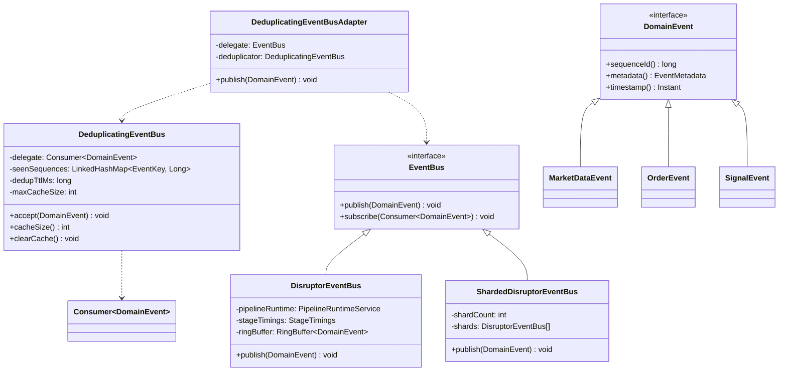

### 6.2 Broker Gateway & Routing

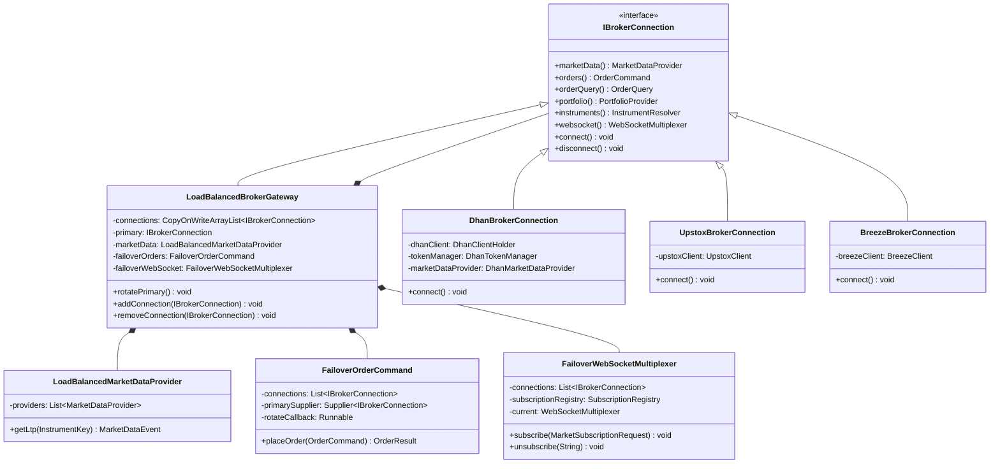

### 6.3 Pipeline Runtime

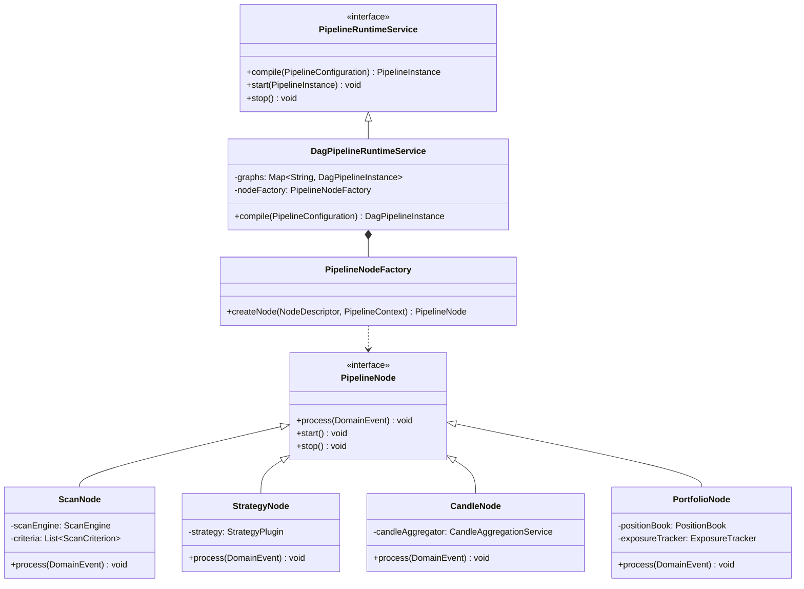

### 6.4 Strategy Plugin Framework

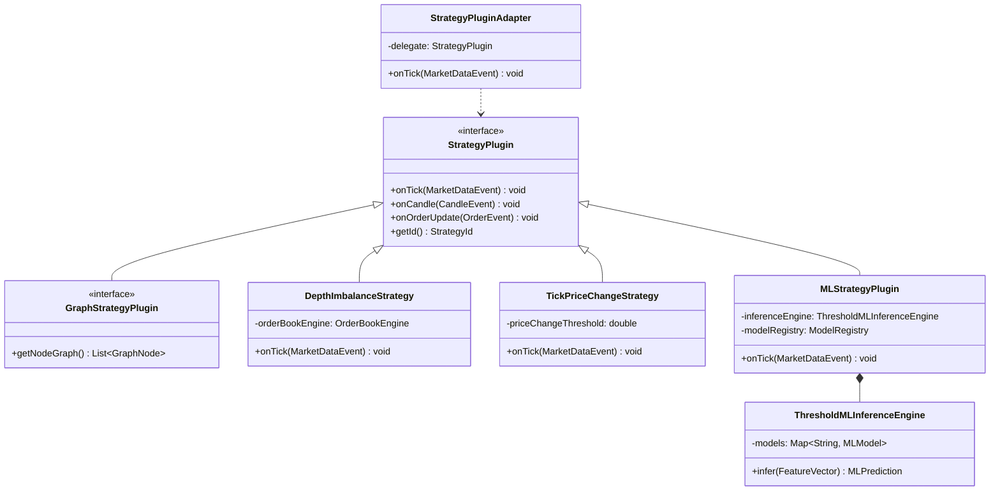

### 6.5 Execution & Risk

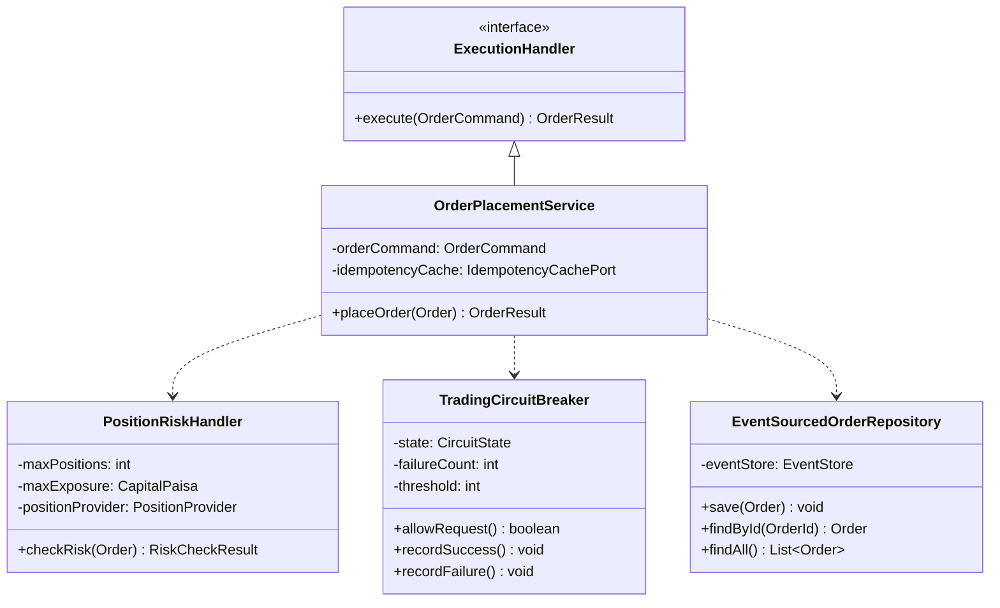

---

## 7. Component Diagrams

### 7.1 System Component Overview

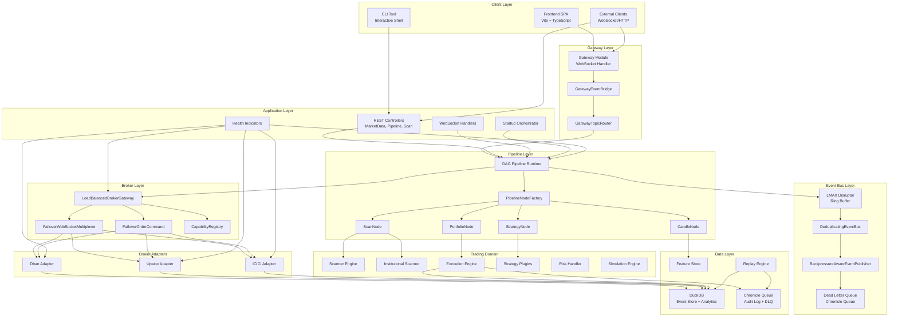

### 7.2 Hot Path Data Flow Component

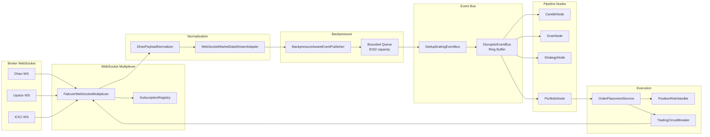

### 7.3 Persistence Component

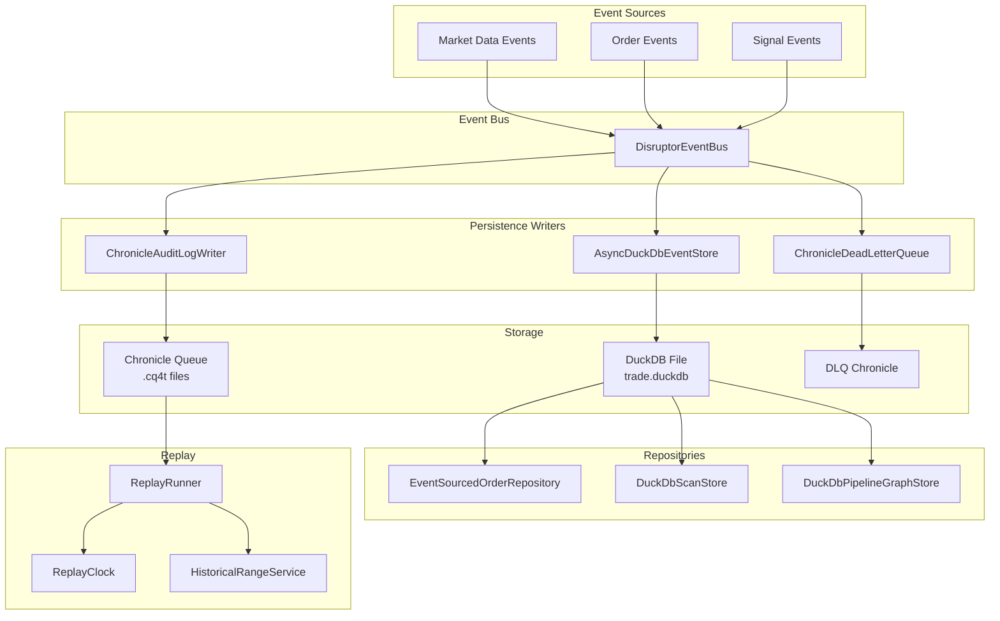

---

## 8. Event Flow Diagrams

### 8.1 Market Data Event Flow

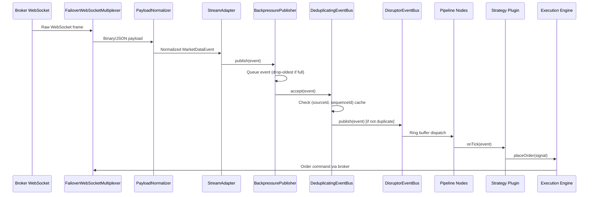

### 8.2 Order Execution Flow

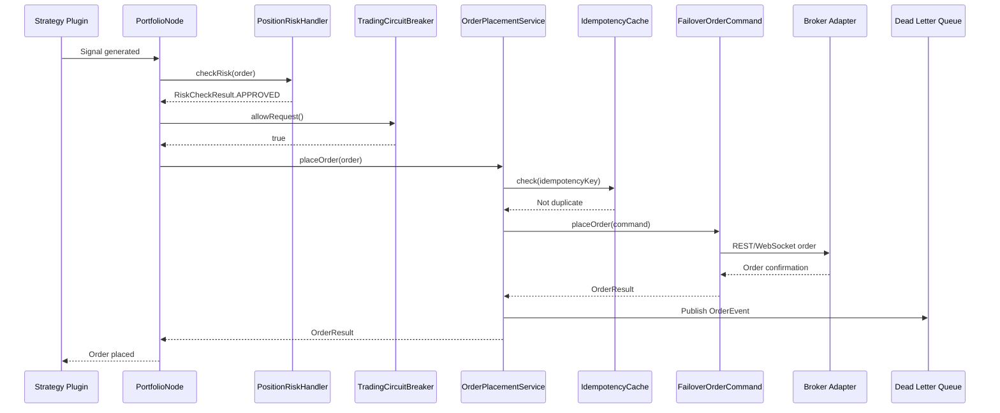

### 8.3 Startup Sequence Flow

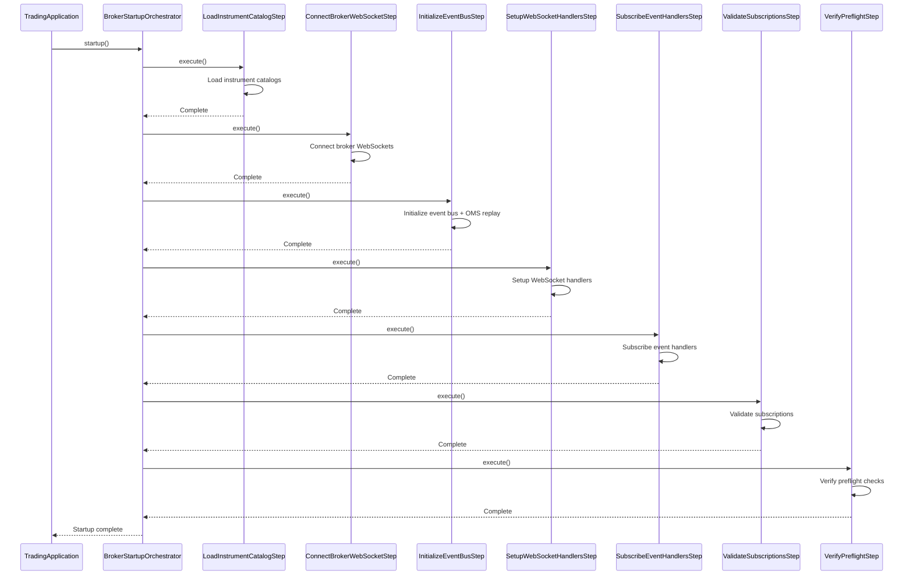

### 8.4 Failover Flow

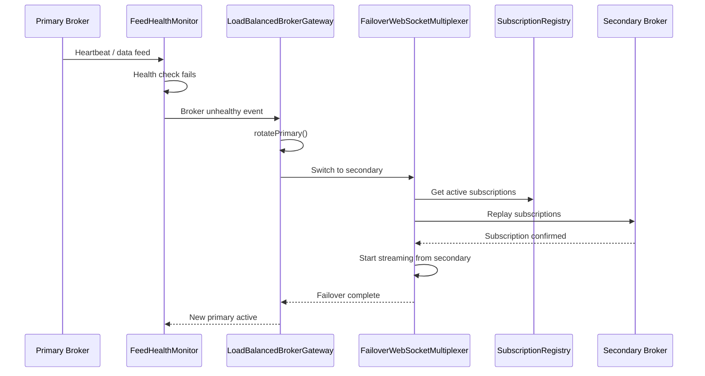

---

## 9. Data Flow Diagrams

### 9.0 Level 0 DFD - System Context

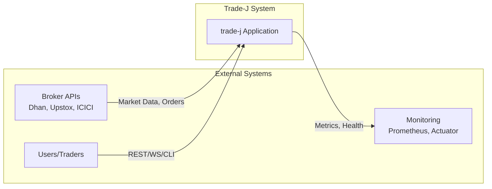

### 9.1 Level 1 DFD - Major Processes

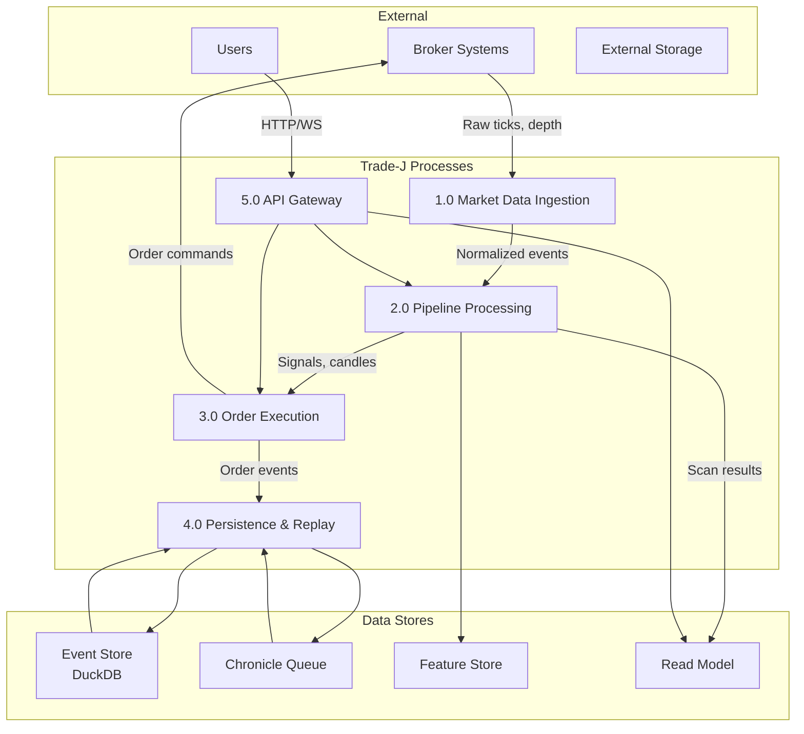

### 9.2 Level 2 DFD - Market Data Ingestion

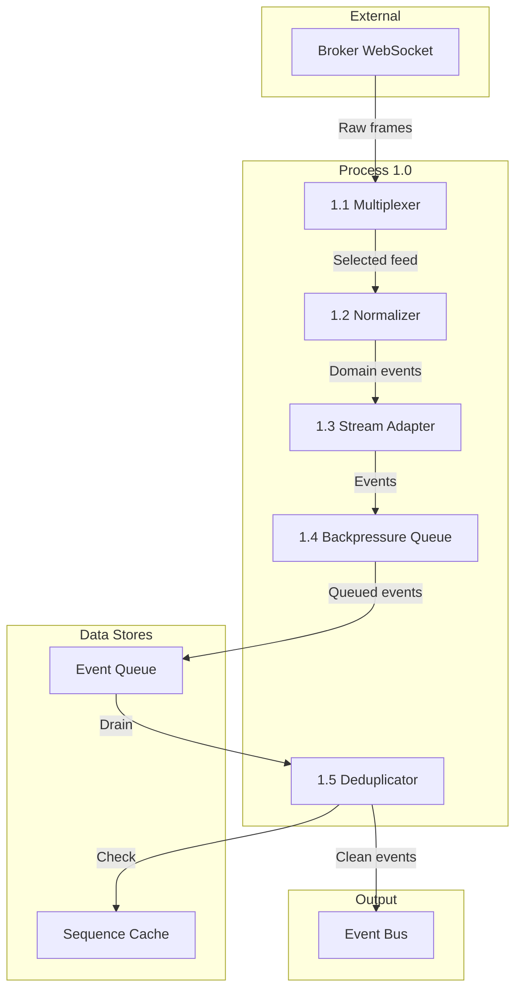

### 9.3 Level 2 DFD - Pipeline Processing

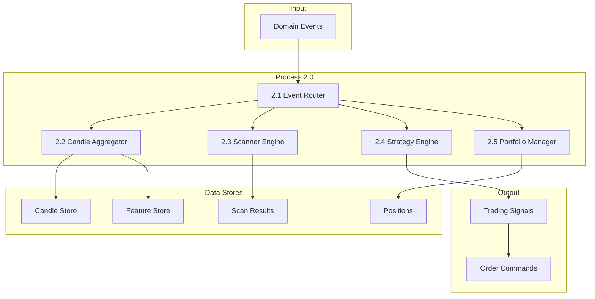

### 9.4 Level 2 DFD - Order Execution

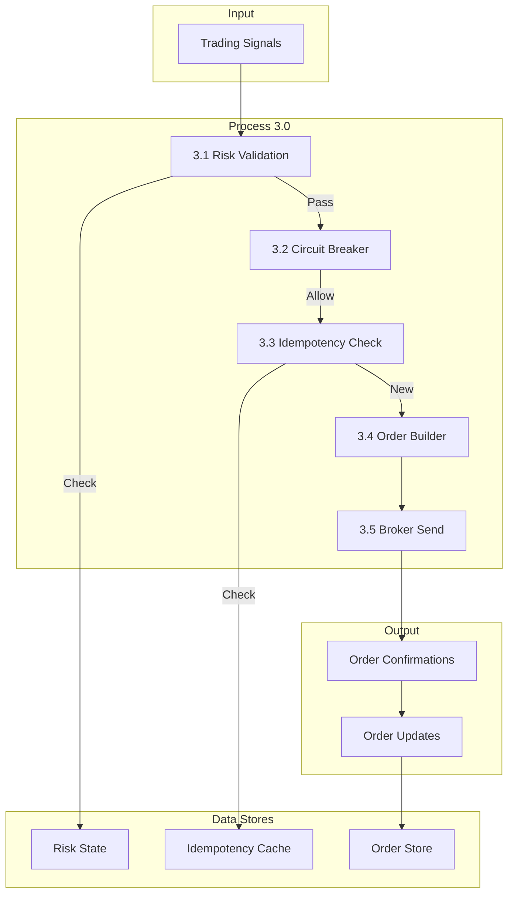

---

## 10. Key Design Patterns

### 10.1 Architectural Patterns

| Pattern | Usage | Location |
|---------|-------|----------|
| **Hexagonal Architecture** | Ports & adapters for broker integration | `broker-api` (ports), `broker-*` (adapters) |
| **Event Sourcing** | Order state from event stream | `EventSourcedOrderRepository` |
| **CQRS** | Separate read model from write model | `ReadModelStore`, `DuckDbEventStore` |
| **Plugin Architecture** | Strategy plugins | `StrategyPlugin`, `GraphStrategyPlugin` |
| **Pipeline Pattern** | DAG-based processing | `PipelineRuntimeService`, `PipelineNode` |
| **Circuit Breaker** | Broker resilience | `TradingCircuitBreaker` |
| **Failover Pattern** | Multi-broker failover | `LoadBalancedBrokerGateway`, `FailoverWebSocketMultiplexer` |
| **Backpressure** | Event flow control | `BackpressureAwareEventPublisher` |
| **Deduplication** | Event deduplication | `DeduplicatingEventBus` |
| **Sharding** | Horizontal scaling of event bus | `ShardedDisruptorEventBus` |

### 10.2 Broker SPI Pattern

```mermaid
graph TB
    subgraph "Port Layer (broker-api)"
        IBrokerConnection[IBrokerConnection]
        MarketDataProvider[MarketDataProvider]
        OrderCommand[OrderCommand]
        OrderQuery[OrderQuery]
        PortfolioProvider[PortfolioProvider]
        InstrumentResolver[InstrumentResolver]
        WebSocketMultiplexer[WebSocketMultiplexer]
        OptionsProvider[OptionsProvider]
    end

    subgraph "Core Layer (broker-core)"
        LoadBalanced[LoadBalancedBrokerGateway]
        FailoverWS[FailoverWebSocketMultiplexer]
        FailoverOrders[FailoverOrderCommand]
    end

    subgraph "Adapter Layer (broker-*)"
        DhanConn[DhanBrokerConnection]
        UpstoxConn[UpstoxBrokerConnection]
        BreezeConn[BreezeBrokerConnection]
    end

    IBrokerConnection <|-- LoadBalanced
    LoadBalanced --> IBrokerConnection
    DhanConn ..> IBrokerConnection
    UpstoxConn ..> IBrokerConnection
    BreezeConn ..> IBrokerConnection
```

### 10.3 Pipeline Node Pattern

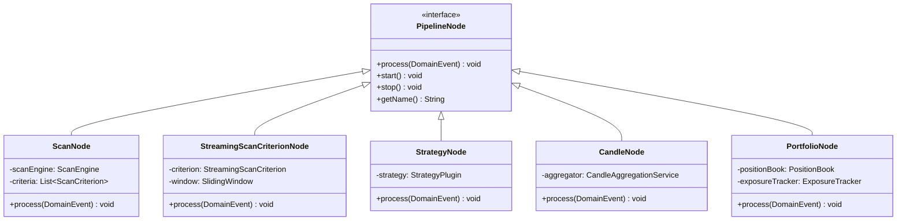

---

## Appendix A: Technology Stack Summary

| Category | Technology | Version |
|----------|-----------|---------|
| Language | Java | 21 (compiled with --release 25) |
| Framework | Spring Boot | 3.5.0 |
| Build | Gradle | 9.5.1 |
| Event Bus | LMAX Disruptor | 4.0.0 |
| Logging | Chronicle Queue | 2026.2 |
| Analytics | DuckDB | 1.5.3.0 |
| Caching | Caffeine | 3.2.4 |
| Broker SDK | Dhan SDK | 2.2.0 |
| Testing | JUnit | 5.12.2 |
| API Docs | SpringDoc OpenAPI | 2.8.6 |
| Observability | Micrometer + Prometheus + OTLP | - |
| Frontend | Vite + TypeScript | - |

## Appendix B: Key Configuration Properties

| Property | Default | Description |
|----------|---------|-------------|
| `trade.broker.rate-limit-retries` | 3 | Rate limit retry count |
| `trade.broker.max-reconnect-attempts` | 10 | Max WebSocket reconnect attempts |
| `trade.risk.max-daily-loss-paisa` | 500000 | Daily loss limit |
| `trade.risk.max-open-positions` | 3 | Max concurrent positions |
| `trade.portfolio.default-capital-paisa` | 1000000 | Default capital allocation |
| `trade.hot-path.shard-count` | 0 | Event bus shard count (0 = auto) |
| `trade.gateway.enabled` | true | Enable WebSocket gateway |
| `trade.scan.enabled` | false | Enable market scanner |
| `trade.scan.scheduler-cron` | `0 15,30,45 9-15 * * MON-FRI` | Scan schedule |

---

*End of Architecture Documentation*
