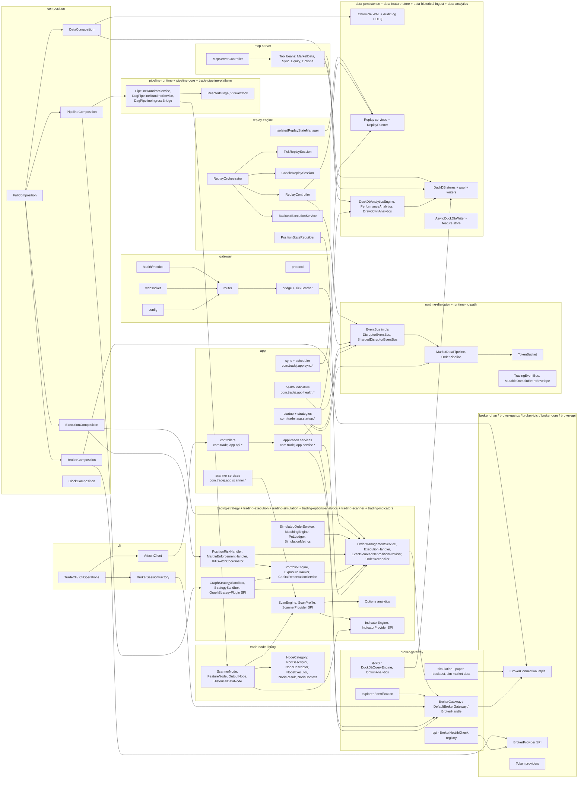
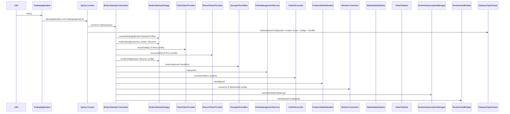
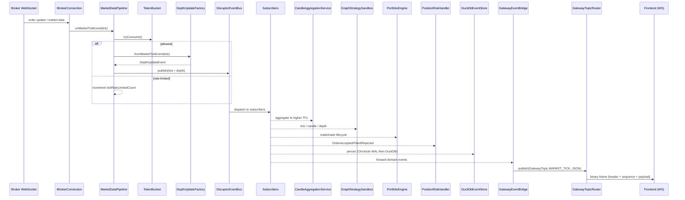
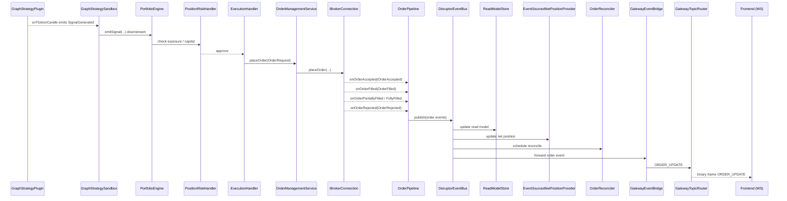
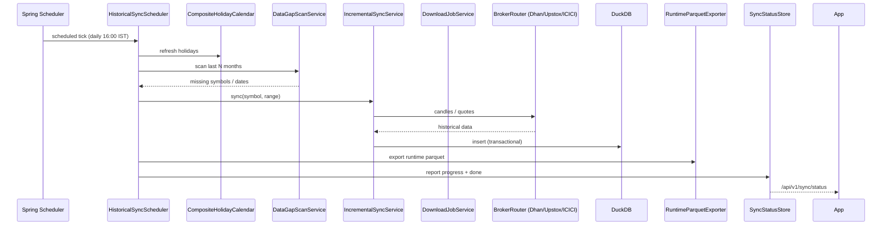
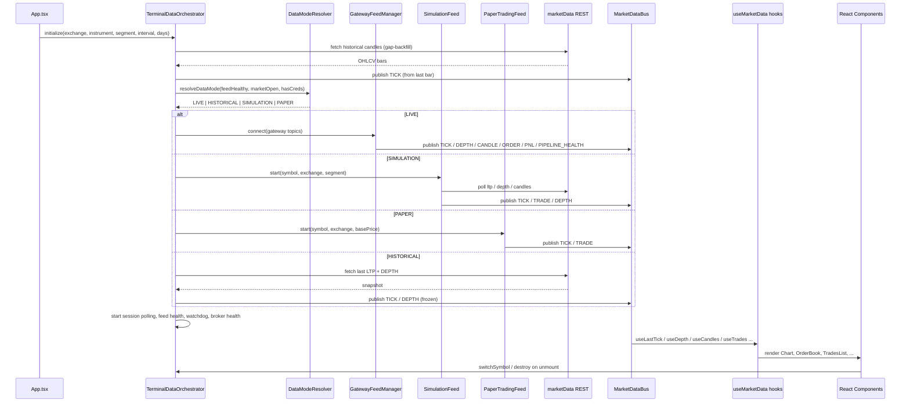
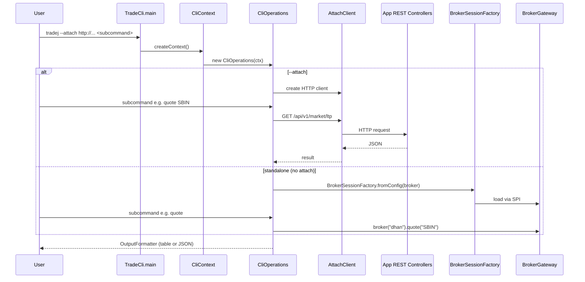
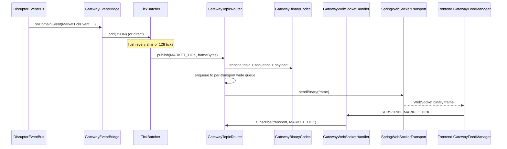
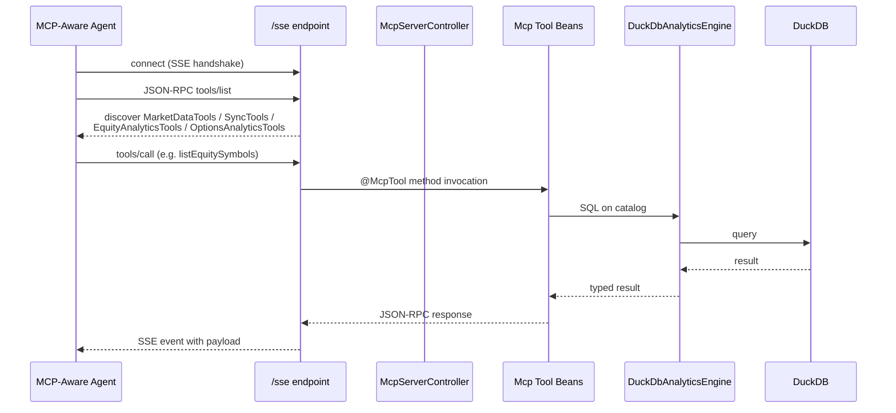

# Trade-J — End-to-End Architecture, Components, Class, Flow & Event Diagrams

This document is generated purely from reading the leaf files of the
Trade-J project (Gradle multi-module backend + React/TypeScript terminal
frontend + picocli CLI + Spring-AI MCP server). No existing documents
were used. Every file referenced in the diagrams below was inspected
directly; leaf-level types and methods are cited by their file path.

Backend entry points discovered in the source tree:

| Entry | File |
| --- | --- |
| Spring Boot app | [TradingApplication.java](file:///Users/apple/Downloads/Trade_J/app/src/main/java/com/tradej/app/TradingApplication.java) |
| Spring-free composition root | [FullComposition.java](file:///Users/apple/Downloads/Trade_J/composition/src/main/java/com/tradej/composition/FullComposition.java) |
| picocli CLI | [TradeCli.java](file:///Users/apple/Downloads/Trade_J/cli/src/main/java/com/tradej/cli/TradeCli.java) |
| WebSocket gateway auto-config | [GatewayAutoConfiguration.java](file:///Users/apple/Downloads/Trade_J/gateway/src/main/java/com/tradej/gateway/config/GatewayAutoConfiguration.java) |
| MCP health + tools | [McpServerController.java](file:///Users/apple/Downloads/Trade_J/mcp-server/src/main/java/com/tradej/mcp/McpServerController.java) |
| Frontend root | [main.tsx](file:///Users/apple/Downloads/Trade_J/trade_j_frontend/src/main.tsx) and [App.tsx](file:///Users/apple/Downloads/Trade_J/trade_j_frontend/src/App.tsx) |

---

## 1. Architecture Diagram (System Level)

```mermaid
flowchart TB
    %% === ACTORS ===
    User([Trader / Operator])
    MCPClient([MCP-Aware IDE / Agent])
    Frontend([Trader Terminal Browser])
    CLIDev([Operator Shell])

    %% === EDGE / DELIVERY ===
    subgraph Delivery [Delivery Surfaces]
      Console[Static Console SPA<br/>app/src/main/resources/static/console/]
      WebUI[trade_j_frontend SPA<br/>React + Vite + TS]
    end

    subgraph CLILayer [cli module]
      TradeCli[TradeCli<br/>picocli root]
      CliOps[CliOperations]
      AttachClient[AttachClient / BrokerSession]
    end

    %% === APP / BACKEND ===
    subgraph AppLayer [app - Spring Boot process]
      TradingApp[TradingApplication]
      RestCtrls[REST Controllers<br/>MarketDataController, OrderController,<br/>ScanController, SymbolController,<br/>PortfolioAnalyticsController, ...]
      AppSvcs[Application Services<br/>MarketDataAppService, OrderAppService,<br/>OptionsAnalyticsAppService, NewsAppService]
      Startup[BrokerStartupOrchestrator<br/>+ StartupStrategies]
      ScanSvc[ScanService + ScanScheduler]
      SyncSched[HistoricalSyncScheduler]
    end

    %% === COMPOSITION / PURE-JAVA ROOTS ===
    subgraph CompLayer [composition - Spring-free roots]
      FullComp[FullComposition]
      BrokerComp[BrokerComposition]
      DataComp[DataComposition]
      ExecComp[ExecutionComposition]
      PipeComp[PipelineComposition]
      ClockComp[ClockComposition]
    end

    %% === GATEWAY ===
    subgraph GwLayer [gateway - WebSocket fanout]
      GwAutoCfg[GatewayAutoConfiguration]
      TopicRouter[GatewayTopicRouter]
      Bridge[GatewayEventBridge]
      WSHandler[GatewayWebSocketHandler]
      TickBatch[TickBatcher]
    end

    %% === RUNTIME / HOTPATH ===
    subgraph RtLayer [runtime-disruptor + runtime-hotpath]
      MktPipe[MarketDataPipeline]
      OrdPipe[OrderPipeline]
      Disruptor[DisruptorEventBus / ShardedDisruptorEventBus]
      StageTimings[AsyncDispatchHandler,<br/>GraphPipelineDisruptorHandler,<br/>BrokerScopedEventBus]
    end

    %% === PIPELINE / STRATEGY ===
    subgraph PipeLayer [pipeline + trading-strategy]
      RuntimeSvc[PipelineRuntimeService / DagPipelineRuntimeService]
      DagPipeline[DagPipelineInstance + DagPipelineIngressBridge]
      ReactorBridge[ReactorBridge]
      StratSandbox[GraphStrategySandbox / StrategySandbox]
      CandleAgg[CandleAggregationService]
      PortfolioEng[PortfolioEngine]
    end

    %% === DATA / PERSISTENCE / REPLAY ===
    subgraph DataLayer [data-persistence + data-historical-ingest + data-feature-store + data-analytics]
      DuckDB[(DuckDB:<br/>events store, pipeline graph store,<br/>scan store, replay tables)]
      Chronicle[(Chronicle Queue:<br/>audit log + WAL + DLQ)]
      ReplaySvc[HistoricalEventReplayService / ReplayRunner / HistoricalRangeService]
      HistData[HistoricalDataService]
      FeatStore[AsyncDuckDbWriter - FeatureStore]
    end

    %% === REPLAY ENGINE ===
    subgraph ReplayLayer [replay-engine]
      ReplayCtrl[ReplayController]
      TickSession[TickReplaySession]
      CandleSession[CandleReplaySession]
      Orch[ReplayOrchestrator]
      PosRebuild[PositionStateRebuilder]
      BacktestExec[BacktestExecutionService]
    end

    %% === NODES ===
    subgraph NodeLayer [nodes/trade-node-library]
      NodeLib[NodeDescriptor, NodeExecutor,<br/>ScannerNode, FeatureNode, OutputNode,<br/>HistoricalDataNode]
    end

    %% === TRADING ENGINE ===
    subgraph TradingLayer [trading-execution + trading-simulation + trading-options-analytics]
      OMS[OrderManagementService]
      ExecH[ExecutionHandler]
      RiskH[PositionRiskHandler]
      KillSwitch[KillSwitchCoordinator]
      MarginH[MarginEnforcementHandler]
      NetPos[EventSourcedNetPositionProvider]
      SimEngine[SimulatedMarketDataProvider,<br/>PaperBrokerConnection, BacktestBrokerConnection]
      OptAnalytics[Options Analytics]
    end

    %% === BROKER LAYER ===
    subgraph BrokerLayer [broker-gateway + broker-api + broker-{dhan,upstox,icici}]
      Gw[BrokerGateway / DefaultBrokerGateway]
      Handle[BrokerHandle / OrderHandle / PortfolioHandle / MarketDataHandle / OptionsHandle]
      SPI[BrokerRegistry + ServiceLoaderBrokerRegistry]
      Dhan[DhanBrokerConnection]
      Upstox[UpstoxBrokerConnection]
      Icici[ICICI / Breeze]
      Sim[SimulationBrokerProvider]
    end

    %% === ANALYTICS / SCANNER / INDICATORS ===
    subgraph AnalyticsLayer [pipeline/analytics/trade-analytics + trading-scanner + trading-indicators]
      PerfAnalytics[DefaultPerformanceAnalytics,<br/>DefaultDrawdownAnalytics]
      ScanEng[ScanEngine + ScanProfile + InstitutionalScanEngine]
      IndicatorEng[IndicatorEngine + IndicatorProvider SPI]
    end

    %% === MCP SERVER ===
    subgraph MCPLayer [mcp-server - Spring AI MCP]
      McpCtrl[McpServerController]
      McpTools[MarketDataTools / SyncTools /<br/>EquityAnalyticsTools / OptionsAnalyticsTools]
    end

    %% === WIRES ===
    User --> WebUI
    User --> CLIDev
    CLIDev --> TradeCli
    TradeCli --> CliOps
    CliOps --> AttachClient
    AttachClient -->|HTTP| RestCtrls
    AttachClient -->|Standalone| Gw

    MCPClient -->|SSE /sse| McpCtrl
    McpCtrl --> McpTools
    McpTools -->|DuckDbAnalyticsEngine| DuckDB

    Frontend --> WebUI
    WebUI -->|HTTP /api/v1/...| RestCtrls
    WebUI -->|WS /ws/gateway| WSHandler
    RestCtrls --> AppSvcs
    AppSvcs --> Gw
    AppSvcs --> OMS
    AppSvcs --> ScanSvc
    AppSvcs --> HistData

    TradingApp --> FullComp
    FullComp --> BrokerComp
    FullComp --> DataComp
    FullComp --> ExecComp
    FullComp --> PipeComp

    Startup --> Gw
    Startup --> MktPipe
    Startup --> OrdPipe
    Startup --> Disruptor

    Gw --> SPI
    SPI --> Dhan
    SPI --> Upstox
    SPI --> Icici
    SPI --> Sim
    Gw --> Handle

    Handle -->|onMarketData| MktPipe
    Handle -->|onOrderUpdate| OrdPipe
    MktPipe --> Disruptor
    OrdPipe --> Disruptor

    Disruptor -->|publish| StageTimings
    StageTimings -->|subscribers| CandleAgg
    StageTimings -->|subscribers| StratSandbox
    StageTimings -->|subscribers| PortfolioEng
    StageTimings -->|subscribers| ExecH
    StageTimings -->|subscribers| NetPos
    StageTimings -->|subscribers| FeatStore
    StageTimings -->|subscribers| Bridge
    StageTimings -->|subscribers| DuckDB
    StageTimings -->|subscribers| Chronicle

    StratSandbox -->|signals| PortfolioEng
    PortfolioEng --> RiskH
    ExecH --> OMS
    OMS --> Handle
    RiskH --> KillSwitch
    RiskH --> MarginH

    Disruptor -->|CandleClosed/MarketTickEvent| DagPipeline
    DagPipeline --> RuntimeSvc
    RuntimeSvc --> ReactorBridge
    RuntimeSvc --> NodeLib
    ScanSvc --> ScanEng
    ScanEng --> IndicatorEng

    SyncSched --> HistData
    HistData --> DuckDB
    ReplayCtrl --> Disruptor
    ReplaySvc --> DuckDB
    ReplaySvc --> Disruptor
    Orch --> TickSession
    Orch --> CandleSession
    Orch --> PosRebuild
    BacktestExec --> OMS

    Bridge --> TopicRouter
    TopicRouter --> TickBatch
    TopicRouter -->|binary frames| WSHandler
    WSHandler -->|WebSocket| WebUI
    WSHandler -->|WebSocket| Console
```

---

## 2. Components Diagram (Modular)



---

## 3. Class Diagram (Domain + Key Infrastructure)

```mermaid
classDiagram
    direction LR

    class DomainEvent {
        <<interface>>
        +eventId() String
        +correlationId() String
        +sequenceId() long
        +metadata() EventMetadata
    }
    class EventBus {
        <<interface>>
        +subscribe(Class~T~ type, DomainEventHandler~T~)
        +publish(DomainEvent e)
        +start() / stop()
    }
    class DisruptorEventBus
    class ShardedDisruptorEventBus
    class TracingEventBus
    class MutableDomainEventEnvelope
    EventBus <|.. DisruptorEventBus
    EventBus <|.. ShardedDisruptorEventBus
    DisruptorEventBus --> MutableDomainEventEnvelope
    ShardedDisruptorEventBus o-- "*" DisruptorEventBus

    class DomainEventHandler~T~ {
        <<interface>>
        +onEvent(T event)
    }
    EventBus --> DomainEventHandler

    class MarketTickEvent
    class DepthUpdateEvent
    class CandleDeveloping
    class CandleClosed
    class OrderAccepted
    class OrderRejected
    class OrderFilled
    class OrderPartiallyFilled
    class OrderFullyFilled
    class TradeOpened
    class TradeClosed
    class SignalGenerated
    class PnlUpdatedEvent
    class ScanResultsPublished
    class ReplayTimeChangedEvent
    class OptionChainUpdated
    class GreeksComputed
    class MaxPainComputed
    class GammaExposureComputed
    class PositionMismatch
    class BrokerAdapterError
    class StrategyError
    DomainEvent <|.. MarketTickEvent
    DomainEvent <|.. DepthUpdateEvent
    DomainEvent <|.. CandleDeveloping
    DomainEvent <|.. CandleClosed
    DomainEvent <|.. OrderAccepted
    DomainEvent <|.. OrderRejected
    DomainEvent <|.. OrderFilled
    DomainEvent <|.. OrderPartiallyFilled
    DomainEvent <|.. OrderFullyFilled
    DomainEvent <|.. TradeOpened
    DomainEvent <|.. TradeClosed
    DomainEvent <|.. SignalGenerated
    DomainEvent <|.. PnlUpdatedEvent
    DomainEvent <|.. ScanResultsPublished
    DomainEvent <|.. ReplayTimeChangedEvent
    DomainEvent <|.. OptionChainUpdated
    DomainEvent <|.. GreeksComputed
    DomainEvent <|.. MaxPainComputed
    DomainEvent <|.. GammaExposureComputed
    DomainEvent <|.. PositionMismatch
    DomainEvent <|.. BrokerAdapterError
    DomainEvent <|.. StrategyError

    class IBrokerConnection
    class WebSocketMultiplexer
    class MarketDataProvider
    class OptionsProvider
    class OrderCommand
    class OrderQuery
    class PortfolioProvider
    class MarginProvider
    class BracketOrderProvider
    class GttOrderProvider
    class SliceOrderCommand
    class FuturesProvider
    class NewsProvider
    class ConditionalAlertProvider
    class OrderBookSnapshotProvider
    class SessionRiskProvider
    class InstrumentResolver
    class IdempotencyCachePort
    IBrokerConnection --> MarketDataProvider
    IBrokerConnection --> OptionsProvider
    IBrokerConnection --> OrderCommand
    IBrokerConnection --> OrderQuery
    IBrokerConnection --> PortfolioProvider
    IBrokerConnection --> MarginProvider
    IBrokerConnection --> BracketOrderProvider
    IBrokerConnection --> GttOrderProvider
    IBrokerConnection --> FuturesProvider
    IBrokerConnection --> NewsProvider
    IBrokerConnection --> ConditionalAlertProvider
    IBrokerConnection --> OrderBookSnapshotProvider
    IBrokerConnection --> InstrumentResolver
    IBrokerConnection --> WebSocketMultiplexer

    class BrokerProvider {
        <<SPI>>
        +create(Map) IBrokerConnection
    }
    class ServiceLoaderBrokerRegistry
    class BrokerRegistry {
        <<interface>>
    }
    BrokerRegistry <|.. ServiceLoaderBrokerRegistry
    ServiceLoaderBrokerRegistry --> BrokerProvider
    BrokerProvider ..> IBrokerConnection : creates

    class DhanBrokerConnection
    class UpstoxBrokerConnection
    class IciciBrokerConnection
    class SimulationBrokerProvider
    IBrokerConnection <|.. DhanBrokerConnection
    IBrokerConnection <|.. UpstoxBrokerConnection
    IBrokerConnection <|.. IciciBrokerConnection
    BrokerProvider <|.. SimulationBrokerProvider

    class GatewayTopicRouter
    class GatewayTopic {
        <<enum>>
        MARKET_TICK
        MARKET_DEPTH
        CANDLE_DEVELOPING
        CANDLE_CLOSED
        ORDER_UPDATE
        POSITION_UPDATE
        STRATEGY_SIGNAL
        PNL_UPDATE
        REPLAY_CONTROL
        PIPELINE_HEALTH
        SCAN_COMPLETED
        DEPTH_IMBALANCE
        HEATMAP_CHUNK
        ICEBERG_ALERT
        ABSORPTION_ALERT
        SR_LEVELS_UPDATE
        ORDER_BOOK_SNAPSHOT
    }
    class GatewayBinaryCodec
    class GatewayEventBridge
    class GatewayWebSocketHandler
    class GatewayReplayCommandProcessor
    class WebSocketTransport
    class SpringWebSocketTransport
    class TickBatcher
    class GatewayAutoConfiguration
    class GatewayProperties
    WebSocketTransport <|.. SpringWebSocketTransport
    GatewayTopicRouter --> GatewayTopic
    GatewayTopicRouter --> WebSocketTransport
    GatewayTopicRouter --> GatewayBinaryCodec
    GatewayEventBridge --> GatewayTopicRouter
    GatewayEventBridge --> EventBus
    GatewayWebSocketHandler --> GatewayTopicRouter
    GatewayWebSocketHandler --> GatewayReplayCommandProcessor
    TickBatcher --> GatewayTopicRouter
    GatewayAutoConfiguration --> GatewayTopicRouter
    GatewayAutoConfiguration --> GatewayEventBridge
    GatewayAutoConfiguration --> GatewayWebSocketHandler
    GatewayAutoConfiguration --> GatewayProperties

    class MarketDataPipeline
    class OrderPipeline
    class TokenBucket
    class DepthUpdateFactory
    class PipelineDataIntegrityValidator
    class SymbolShardRouter
    MarketDataPipeline --> TokenBucket : optional
    MarketDataPipeline --> DepthUpdateFactory

    class PipelineGraph
    class PipelineNodeDef
    class PipelineEdgeDef
    class PipelineRuntimeService
    class DagPipelineRuntimeService
    class DagPipelineInstance
    class DagPipelineIngressBridge
    class PipelineNodeFactory
    class PipelineRuntime
    class GraphCompiler
    class ReactorBridge
    class ReactorBridgeMetrics
    class VirtualClock
    PipelineGraph --> "*" PipelineNodeDef
    PipelineGraph --> "*" PipelineEdgeDef
    PipelineRuntimeService --> PipelineRuntime
    PipelineRuntimeService --> GraphCompiler
    PipelineRuntimeService --> ReactorBridge
    PipelineRuntimeService --> ReactorBridgeMetrics
    PipelineRuntimeService --> VirtualClock
    PipelineRuntimeService --> PipelineNodeFactory
    DagPipelineRuntimeService --> DagPipelineInstance
    DagPipelineInstance --> PipelineGraph
    DagPipelineInstance --> PipelineRuntime
    DagPipelineIngressBridge --> EventBus

    class GraphStrategyPlugin {
        <<SPI>>
        +subscribedEventTypes()
        +onStart() / onStop()
    }
    class GraphStrategySandbox
    class CandleAggregationService
    class PortfolioEngine
    class DefaultExposureTracker
    class DefaultCapitalReservationService
    class DefaultPositionSizer
    class ExecutionHandler
    class OrderManagementService
    class EventSourcedNetPositionProvider
    class OrderReconciler
    class ReconciliationAlertLogger
    class PositionRiskHandler
    class MarginEnforcementHandler
    class KillSwitchCoordinator
    class CaffeineIdempotencyCache
    GraphStrategySandbox --> "*" GraphStrategyPlugin
    GraphStrategySandbox --> DefaultPositionSizer
    PortfolioEngine --> DefaultExposureTracker
    PortfolioEngine --> DefaultCapitalReservationService
    OrderManagementService --> IBrokerConnection
    OrderManagementService --> ExecutionHandler
    EventSourcedNetPositionProvider --> EventBus
    PositionRiskHandler --> PortfolioEngine
    PositionRiskHandler --> MarginEnforcementHandler
    PositionRiskHandler --> KillSwitchCoordinator
    MarginEnforcementHandler --> IBrokerConnection
    KillSwitchCoordinator --> IBrokerConnection
    KillSwitchCoordinator --> OrderManagementService
    CaffeineIdempotencyCache ..|> IdempotencyCachePort

    class SimulatedOrderService
    class MatchingEngine
    class PnLLedger
    class SimulationMetrics
    class SimulatedMarketDataProvider
    class PaperBrokerConnection
    class BacktestBrokerConnection
    class SimulationPortfolioProvider
    class ReplayInstrumentCatalog
    class SimulatedWebSocketMultiplexer
    class BrokerClock

    class DuckDbConnectionPool
    class DuckDbEventStore
    class AsyncDuckDbEventStore
    class DuckDbScanStore
    class DuckDbPipelineGraphStore
    class DuckDbQueryEngine
    class QueryMetrics
    class OptionAnalytics
    class AsyncDuckDbWriter
    class ChronicleEventWal
    class ChronicleAuditLogWriter
    class ChronicleDeadLetterQueue
    class HistoricalDataServiceImpl
    class HistoricalRangeService
    class HistoricalEventReplayService
    class HistoricalCandleLoader
    class HistoricalQueryService
    class ReplayRunner
    class ReplayMetrics
    class ReplayResult
    class HistoricalRecords
    class ReplayClock
    DuckDbEventStore --> DuckDbConnectionPool
    AsyncDuckDbEventStore --> DuckDbEventStore
    DuckDbScanStore --> DuckDbConnectionPool
    DuckDbPipelineGraphStore --> DuckDbConnectionPool
    DuckDbQueryEngine --> DuckDbConnectionPool
    AsyncDuckDbWriter --> DuckDbConnectionPool
    ChronicleEventWal ..|> EventWriteAheadLog

    class ReplayController
    class TickReplaySession
    class CandleReplaySession
    class ReplayOrchestrator
    class PositionStateRebuilder
    class BacktestExecutionService
    class MultiTimeframeContext
    class IsolatedReplayStateManager
    class ReplayableRegistry
    ReplayController --> EventBus
    ReplayController --> MultiTimeframeContext
    ReplayOrchestrator --> ReplayController
    ReplayOrchestrator --> TickReplaySession
    ReplayOrchestrator --> CandleReplaySession
    ReplayOrchestrator --> PositionStateRebuilder
    ReplayOrchestrator --> BacktestExecutionService
    PositionStateRebuilder --> EventBus

    class NodeDescriptor
    class PortDescriptor
    class NodeCategory
    class NodeContext
    class NodeResult
    class NodeExecutor
    class NodeAdapterFactory
    class ScannerNode
    class FeatureNode
    class OutputNode
    class HistoricalDataNode
    NodeDescriptor --> "*" PortDescriptor
    NodeDescriptor --> NodeCategory
    NodeExecutor --> NodeResult
    NodeExecutor --> NodeContext
    ScannerNode ..|> NodeExecutor
    FeatureNode ..|> NodeExecutor
    OutputNode ..|> NodeExecutor
    HistoricalDataNode ..|> NodeExecutor

    class TradingApplication
    class MarketDataController
    class OrderController
    class ScanController
    class SymbolController
    class OptionsAnalyticsController
    class PortfolioAnalyticsController
    class BacktestController
    class ExpiredOptionsController
    class ReplayStudioController
    class OrderPipelineHealthIndicator
    class AnalyticsHealthIndicator
    class BrokerHealthIndicator
    class FeedHealthIndicator
    class UpstoxHealthIndicator
    class BrokerStartupOrchestrator
    class BrokerStartupStrategy {
        <<interface>>
    }
    class UpstoxStartupStrategy
    class IciciStartupStrategy
    class GatewayStartupStrategy
    class SimulationStartupStrategy
    class DhanStartupStrategy
    class ScanService
    class ScanScheduler
    class OptionScanService
    class RuntimeSubscriptionManager
    class HistoricalSyncScheduler
    class AdminApplicationService
    class MarketDataApplicationService
    class OrderApplicationService
    class OptionsAnalyticsApplicationService
    class NewsApplicationService
    BrokerStartupStrategy <|.. UpstoxStartupStrategy
    BrokerStartupStrategy <|.. IciciStartupStrategy
    BrokerStartupStrategy <|.. GatewayStartupStrategy
    BrokerStartupStrategy <|.. SimulationStartupStrategy
    BrokerStartupStrategy <|.. DhanStartupStrategy
    BrokerStartupOrchestrator --> BrokerStartupStrategy

    class FullComposition
    class BrokerComposition
    class DataComposition
    class ExecutionComposition
    class PipelineComposition
    class ClockComposition
    class BrokerProfile
    class StorageProfile
    class RiskProfile
    class ScanProperties
    class ConfigLoader
    FullComposition --> BrokerComposition
    FullComposition --> DataComposition
    FullComposition --> ExecutionComposition
    BrokerComposition --> BrokerProfile
    DataComposition --> StorageProfile
    ExecutionComposition --> RiskProfile
    PipelineComposition --> ScanProperties

    class TradeCli
    class CliContext
    class CliOperations
    class AttachClient
    class BrokerSession
    class BrokerSessionFactory
    class InteractiveShell
    class CliAttachCommands
    class CliBrokerCommands
    class CliTradingCommands
    class CliScanCommands
    class CliDownloadCommands
    class CliMaintenanceCommands
    class CliDataCommands
    class CliBacktestCommands
    class CliReplayCommands
    class CliPortfolioCommands
    class CliHistoricalCommands
    class CliGatewayCommands
    class CliMarketCommands
    TradeCli --> CliContext
    TradeCli --> CliOperations
    CliOperations --> CliContext
    CliOperations --> CliAttachCommands
    CliOperations --> CliBrokerCommands
    CliOperations --> CliTradingCommands
    CliOperations --> CliScanCommands
    CliOperations --> CliReplayCommands
    CliOperations --> CliMarketCommands
    CliContext --> AttachClient
    CliContext --> BrokerSession
    AttachClient --> MarketDataController : HTTP
    AttachClient --> OrderController : HTTP
    BrokerSession --> BrokerSessionFactory
    BrokerSessionFactory --> BrokerGateway

    class McpServerController
    class MarketDataTools
    class SyncTools
    class EquityAnalyticsTools
    class OptionsAnalyticsTools
    class DuckDbAnalyticsEngine
    McpServerController --> DuckDbAnalyticsEngine
    MarketDataTools --> DuckDbAnalyticsEngine
    EquityAnalyticsTools --> DuckDbAnalyticsEngine
    OptionsAnalyticsTools --> DuckDbAnalyticsEngine
    SyncTools --> DuckDbAnalyticsEngine

    class App {
        <<React component>>
    }
    class TerminalDataOrchestrator
    class GatewayFeedManager
    class MarketDataBus
    class SimulationFeed
    class PaperTradingFeed
    class DataModeResolver
    class CandleAggregator
    class BrokerRegistryApi { fetchBrokers() }
    class OrdersApi { placeOrder, listOrders, cancelOrder }
    class ReplayApi { replayCandles, replayTicks }
    class StreamApi { subscribeReadModel }
    class WatchlistHook
    class MarketDataHook
    class OptionChainHook
    class ScannerHook
    class OrdersHook
    class MarketIndicesHook
    App --> TerminalDataOrchestrator
    TerminalDataOrchestrator --> GatewayFeedManager
    TerminalDataOrchestrator --> SimulationFeed
    TerminalDataOrchestrator --> PaperTradingFeed
    TerminalDataOrchestrator --> MarketDataBus
    TerminalDataOrchestrator --> DataModeResolver
    GatewayFeedManager --> MarketDataBus
    SimulationFeed --> MarketDataBus
    PaperTradingFeed --> MarketDataBus
    MarketDataHook --> MarketDataBus
    WatchlistHook --> MarketDataBus
    OptionChainHook --> MarketDataBus
    ScannerHook --> MarketDataBus
    OrdersHook --> OrdersApi
    App --> OrdersApi
    App --> BrokerRegistryApi
    App --> ReplayApi
    App --> StreamApi
```



---

## 4. Component Flow Diagrams

### 4.1 Application Startup Flow



### 4.2 Market Data Hot Path



### 4.3 Order Lifecycle Flow



### 4.4 Replay Engine Flow

```mermaid
sequenceDiagram
    participant User
    participant RC as ReplayController
    participant ORC as ReplayOrchestrator
    participant Candle as CandleReplaySession
    participant Tick as TickReplaySession
    participant DB as DuckDb (HistoricalRangeService)
    participant Bus as DisruptorEventBus
    participant RB as PositionStateRebuilder
    participant Bridge as GatewayEventBridge
    participant Topic as GatewayTopicRouter
    participant Browser as Frontend (WS)

    User->>RC: start(candles)
    RC->>RC: sort by startTime; init ReplayTradingClock
    User->>RC: play()
    loop scheduler tick (speed * 1m)
        RC->>Bus: publish(CandleClosed)
        RC->>Bus: publish(MarketTickEvent)
    end
    User->>RC: pause() / step() / setSpeed()
    Note over RC,Bridge: events flow into same hot path subscribers
    Bus->>Bridge: forward
    Bridge->>Topic: MARKET_TICK / CANDLE_CLOSED
    Topic-->>Browser: replay feed
    User->>RC: stop()
    ORC->>RB: rebuild(bus) to project positions
```

### 4.5 Historical Data Sync Flow



### 4.6 Frontend Data Orchestrator Flow



### 4.7 CLI Attach / Standalone Flow



### 4.8 Gateway WebSocket Fanout Flow



### 4.9 MCP Server Flow



---

## 5. Event Flow Diagram (Domain Event Lifecycle)

```mermaid
flowchart TB
    BrokerWS[Broker WebSocket<br/>IBrokerConnection] -->|onMarketData| MktTick((MarketTickEvent))
    BrokerWS -->|DepthUpdateFactory| Depth((DepthUpdateEvent))
    BrokerWS -->|onOrderUpdate| OrdA((OrderAccepted))
    BrokerWS -->|onOrderUpdate| OrdR((OrderRejected))
    BrokerWS -->|onOrderUpdate| OrdF((OrderFilled))
    BrokerWS -->|onOrderUpdate| OrdPF((OrderPartiallyFilled))
    BrokerWS -->|onOrderUpdate| OrdFF((OrderFullyFilled))
    MktTick -->|CandleAggregationService| CandDev((CandleDeveloping))
    MktTick -->|CandleAggregationService| CandC((CandleClosed))
    Strat[GraphStrategyPlugin<br/>via GraphStrategySandbox] --> Sig((SignalGenerated))
    ExecH[ExecutionHandler /<br/>OrderManagementService] --> TradeOp((TradeOpened))
    TradeOp --> TradeCl((TradeClosed))
    Port[PortfolioEngine] --> Pnl((PnlUpdatedEvent))
    ScanSvc[ScanService] --> ScanRes((ScanResultsPublished))
    OptAnal[Options Analytics] --> Chain((OptionChainUpdated))
    OptAnal --> GreeksEv((GreeksComputed))
    OptAnal --> MaxP((MaxPainComputed))
    OptAnal --> Gamma((GammaExposureComputed))
    ReplayCtl[ReplayController] --> RepT((ReplayTimeChangedEvent))
    Recon[OrderReconciler] --> PosM((PositionMismatch))
    BrokerErr[BrokerErrorTracker] --> BrkErr((BrokerAdapterError))

    Bus[DisruptorEventBus /<br/>ShardedDisruptorEventBus]
    MktTick --> Bus
    Depth --> Bus
    CandDev --> Bus
    CandC --> Bus
    OrdA --> Bus
    OrdR --> Bus
    OrdF --> Bus
    OrdPF --> Bus
    OrdFF --> Bus
    TradeOp --> Bus
    TradeCl --> Bus
    Sig --> Bus
    Pnl --> Bus
    ScanRes --> Bus
    Chain --> Bus
    GreeksEv --> Bus
    MaxP --> Bus
    Gamma --> Bus
    RepT --> Bus
    PosM --> Bus
    BrkErr --> Bus

    Bus -->|subscribe MarketTickEvent| ReadModel[ReadModelStore]
    Bus -->|subscribe DepthUpdateEvent| ReadModel
    Bus -->|subscribe Candle*| ReadModel
    Bus -->|subscribe Order*| ReadModel
    Bus -->|subscribe Trade*| ReadModel
    Bus -->|subscribe Signal*| ReadModel
    Bus -->|subscribe PnlUpdatedEvent| ReadModel

    Bus -->|subscribe Trade*| NetPos[EventSourcedNetPositionProvider]
    Bus -->|subscribe Trade*| Port
    Bus -->|subscribe Order*| Risk[PositionRiskHandler]
    Bus -->|subscribe Signal*| Port
    Bus -->|subscribe CandleClosed, MarketTickEvent| Dag[DagPipelineIngressBridge]
    Dag --> PipelineSvc[PipelineRuntimeService /<br/>DagPipelineRuntimeService]
    PipelineSvc --> Reactor[ReactorBridge]
    PipelineSvc --> Nodes[Node library<br/>ScannerNode / FeatureNode / OutputNode / HistoricalDataNode]

    Bus -->|subscribe MarketTickEvent,<br/>CandleClosed| CandleAgg[CandleAggregationService]
    CandleAgg --> Bus
    Bus -->|all events| FeatureW[AsyncDuckDbWriter - FeatureStore]
    Bus -->|all events| DuckEv[DuckDbEventStore (via AsyncDuckDbEventStore)]
    Bus -->|all events| Audit[ChronicleAuditLogWriter]
    Bus -->|all events| Bridge[GatewayEventBridge]
    Bus -->|BrokerAdapterError| ErrTrack[BrokerErrorTracker]
    Bus -->|PositionMismatch| ReconLog[ReconciliationAlertLogger]
    Bus -->|ReplayTimeChangedEvent| ReplayCtl
    Bus -->|PipelineHealth| Router[GatewayTopicRouter]

    Bridge --> Router
    Router --> TickBatch[TickBatcher - MARKET_TICK only]
    Router --> WS[GatewayWebSocketHandler]
    WS --> Front[Frontend GatewayFeedManager]
    WS --> Console[Console SPA (static)]

    DuckEv --> Duck[(DuckDB:<br/>trades, orders, options,<br/>scanner_results, pipeline_graph)]
    Audit --> Chron[(Chronicle Queue:<br/>audit + WAL + DLQ)]
    FeatureW --> Duck
    Bus -->|DomainEvent.class| Chron

    Nodes -->|publish| Bus
```

---

## 6. Per-Component Flow Cards (leaf-file-anchored)

### 6.1 `app` module
- [TradingApplication](file:///Users/apple/Downloads/Trade_J/app/src/main/java/com/tradej/app/TradingApplication.java) — Spring Boot entry; scans `com.tradej`.
- [BrokerStartupOrchestrator](file:///Users/apple/Downloads/Trade_J/app/src/main/java/com/tradej/app/startup/BrokerStartupOrchestrator.java) — chooses a [BrokerStartupStrategy](file:///Users/apple/Downloads/Trade_J/app/src/main/java/com/tradej/app/startup/BrokerStartupStrategy.java) by profile, loads catalog, validates subscriptions, wires subscribers, starts the bus, reconciles OMS, rebuilds positions, connects broker, marks startup completed.
- [DhanStartupStrategy](file:///Users/apple/Downloads/Trade_J/app/src/main/java/com/tradej/app/startup/DhanStartupStrategy.java), [UpstoxStartupStrategy](file:///Users/apple/Downloads/Trade_J/app/src/main/java/com/tradej/app/startup/UpstoxStartupStrategy.java), [IciciStartupStrategy](file:///Users/apple/Downloads/Trade_J/app/src/main/java/com/tradej/app/startup/IciciStartupStrategy.java), [GatewayStartupStrategy](file:///Users/apple/Downloads/Trade_J/app/src/main/java/com/tradej/app/startup/GatewayStartupStrategy.java), [SimulationStartupStrategy](file:///Users/apple/Downloads/Trade_J/app/src/main/java/com/tradej/app/startup/SimulationStartupStrategy.java) — per-broker preflight + subscription validation.
- REST controllers under [com.tradej.app.api](file:///Users/apple/Downloads/Trade_J/app/src/main/java/com/tradej/app/api) — [MarketDataController](file:///Users/apple/Downloads/Trade_J/app/src/main/java/com/tradej/app/api/MarketDataController.java), [OrderController](file:///Users/apple/Downloads/Trade_J/app/src/main/java/com/tradej/app/api/OrderController.java), [ScanController](file:///Users/apple/Downloads/Trade_J/app/src/main/java/com/tradej/app/api/ScanController.java), [SymbolController](file:///Users/apple/Downloads/Trade_J/app/src/main/java/com/tradej/app/api/SymbolController.java), [OptionsAnalyticsController](file:///Users/apple/Downloads/Trade_J/app/src/main/java/com/tradej/app/api/OptionsAnalyticsController.java), [PortfolioAnalyticsController](file:///Users/apple/Downloads/Trade_J/app/src/main/java/com/tradej/app/api/PortfolioAnalyticsController.java), [BacktestController](file:///Users/apple/Downloads/Trade_J/app/src/main/java/com/tradej/app/api/BacktestController.java), [ExpiredOptionsController](file:///Users/apple/Downloads/Trade_J/app/src/main/java/com/tradej/app/api/ExpiredOptionsController.java), [ReplayStudioController](file:///Users/apple/Downloads/Trade_J/app/src/main/java/com/tradej/app/api/ReplayStudioController.java), [StudioController](file:///Users/apple/Downloads/Trade_J/app/src/main/java/com/tradej/app/api/StudioController.java), [NewsController](file:///Users/apple/Downloads/Trade_J/app/src/main/java/com/tradej/app/api/NewsController.java), [ReadModelController](file:///Users/apple/Downloads/Trade_J/app/src/main/java/com/tradej/app/api/ReadModelController.java), [OrderController](file:///Users/apple/Downloads/Trade_J/app/src/main/java/com/tradej/app/api/OrderController.java), [AdminController](file:///Users/apple/Downloads/Trade_J/app/src/main/java/com/tradej/app/admin/AdminController.java), [DiscoveryController](file:///Users/apple/Downloads/Trade_J/app/src/main/java/com/tradej/app/api/DiscoveryController.java), [EventCatalogController](file:///Users/apple/Downloads/Trade_J/app/src/main/java/com/tradej/app/api/EventCatalogController.java), [FeatureController](file:///Users/apple/Downloads/Trade_J/app/src/main/java/com/tradej/app/api/FeatureController.java), [PipelineController](file:///Users/apple/Downloads/Trade_J/app/src/main/java/com/tradej/app/api/PipelineController.java), [MarketSessionController](file:///Users/apple/Downloads/Trade_J/app/src/main/java/com/tradej/app/api/MarketSessionController.java), [DepthAnalyticsController](file:///Users/apple/Downloads/Trade_J/app/src/main/java/com/tradej/app/api/DepthAnalyticsController.java), [BrokerRegistryController](file:///Users/apple/Downloads/Trade_J/app/src/main/java/com/tradej/app/api/BrokerRegistryController.java), [SyncStatusController](file:///Users/apple/Downloads/Trade_J/app/src/main/java/com/tradej/app/api/SyncStatusController.java), [WorkspaceController](file:///Users/apple/Downloads/Trade_J/app/src/main/java/com/tradej/app/workspace/WorkspaceController.java), [ReconciliationController](file:///Users/apple/Downloads/Trade_J/app/src/main/java/com/tradej/app/admin/ReconciliationController.java), [HistoricalDownloadController](file:///Users/apple/Downloads/Trade_J/app/src/main/java/com/tradej/app/admin/HistoricalDownloadController.java), [UpstoxNotifierWebhookController](file:///Users/apple/Downloads/Trade_J/app/src/main/java/com/tradej/app/upstox/UpstoxNotifierWebhookController.java).
- Application services under [com.tradej.app.service](file:///Users/apple/Downloads/Trade_J/app/src/main/java/com/tradej/app/service) — [MarketDataApplicationService](file:///Users/apple/Downloads/Trade_J/app/src/main/java/com/tradej/app/service/MarketDataApplicationService.java), [OrderApplicationService](file:///Users/apple/Downloads/Trade_J/app/src/main/java/com/tradej/app/service/OrderApplicationService.java), [OptionsAnalyticsApplicationService](file:///Users/apple/Downloads/Trade_J/app/src/main/java/com/tradej/app/service/OptionsAnalyticsApplicationService.java), [NewsApplicationService](file:///Users/apple/Downloads/Trade_J/app/src/main/java/com/tradej/app/service/NewsApplicationService.java), [AdminApplicationService](file:///Users/apple/Downloads/Trade_J/app/src/main/java/com/tradej/app/service/AdminApplicationService.java).
- Scanner under [com.tradej.app.scanner](file:///Users/apple/Downloads/Trade_J/app/src/main/java/com/tradej/app/scanner) — [ScanService](file:///Users/apple/Downloads/Trade_J/app/src/main/java/com/tradej/app/scanner/ScanService.java), [ScanScheduler](file:///Users/apple/Downloads/Trade_J/app/src/main/java/com/tradej/app/scanner/ScanScheduler.java), [OptionScanService](file:///Users/apple/Downloads/Trade_J/app/src/main/java/com/tradej/app/scanner/OptionScanService.java), [ScanProfileCatalog](file:///Users/apple/Downloads/Trade_J/app/src/main/java/com/tradej/app/scanner/ScanProfileCatalog.java), [ScanProfileMapper](file:///Users/apple/Downloads/Trade_J/app/src/main/java/com/tradej/app/scanner/ScanProfileMapper.java), [ScanResultStore](file:///Users/apple/Downloads/Trade_J/app/src/main/java/com/tradej/app/scanner/ScanResultStore.java), [RuntimeSubscriptionManager](file:///Users/apple/Downloads/Trade_J/app/src/main/java/com/tradej/app/scanner/RuntimeSubscriptionManager.java).
- Sync under [com.tradej.app.sync](file:///Users/apple/Downloads/Trade_J/app/src/main/java/com/tradej/app/sync) — [HistoricalSyncScheduler](file:///Users/apple/Downloads/Trade_J/app/src/main/java/com/tradej/app/sync/HistoricalSyncScheduler.java), [SyncStatusStore](file:///Users/apple/Downloads/Trade_J/app/src/main/java/com/tradej/app/sync/SyncStatusStore.java).
- Health indicators under [com.tradej.app.health](file:///Users/apple/Downloads/Trade_J/app/src/main/java/com/tradej/app/health) — [OrderPipelineHealthIndicator](file:///Users/apple/Downloads/Trade_J/app/src/main/java/com/tradej/app/health/OrderPipelineHealthIndicator.java), [AnalyticsHealthIndicator](file:///Users/apple/Downloads/Trade_J/app/src/main/java/com/tradej/app/health/AnalyticsHealthIndicator.java), [BrokerHealthIndicator](file:///Users/apple/Downloads/Trade_J/app/src/main/java/com/tradej/app/health/BrokerHealthIndicator.java), [FeedHealthIndicator](file:///Users/apple/Downloads/Trade_J/app/src/main/java/com/tradej/app/health/FeedHealthIndicator.java), [UpstoxHealthIndicator](file:///Users/apple/Downloads/Trade_J/app/src/main/java/com/tradej/app/health/UpstoxHealthIndicator.java), [BrokerErrorTracker](file:///Users/apple/Downloads/Trade_J/app/src/main/java/com/tradej/app/health/BrokerErrorTracker.java).
- Configurations under [com.tradej.app.config](file:///Users/apple/Downloads/Trade_J/app/src/main/java/com/tradej/app/config) — see [BrokerConfiguration](file:///Users/apple/Downloads/Trade_J/app/src/main/java/com/tradej/app/config/BrokerConfiguration.java), [DataConfiguration](file:///Users/apple/Downloads/Trade_J/app/src/main/java/com/tradej/app/config/DataConfiguration.java), [PipelineConfiguration](file:///Users/apple/Downloads/Trade_J/app/src/main/java/com/tradej/app/pipeline/PipelineConfiguration.java), [ObservabilityConfiguration](file:///Users/apple/Downloads/Trade_J/app/src/main/java/com/tradej/app/config/ObservabilityConfiguration.java), [TradingProperties](file:///Users/apple/Downloads/Trade_J/app/src/main/java/com/tradej/app/config/TradingProperties.java), [RegistryConfiguration](file:///Users/apple/Downloads/Trade_J/app/src/main/java/com/tradej/app/config/RegistryConfiguration.java), [ScanConfiguration](file:///Users/apple/Downloads/Trade_J/app/src/main/java/com/tradej/app/config/ScanConfiguration.java), [GatewayBrokerConfiguration](file:///Users/apple/Downloads/Trade_J/app/src/main/java/com/tradej/app/config/GatewayBrokerConfiguration.java), [UpstoxBrokerConfiguration](file:///Users/apple/Downloads/Trade_J/app/src/main/java/com/tradej/app/config/UpstoxBrokerConfiguration.java), [RuntimeAndStartupConfiguration](file:///Users/apple/Downloads/Trade_J/app/src/main/java/com/tradej/app/config/RuntimeAndStartupConfiguration.java), [BrokerAdapterConfiguration](file:///Users/apple/Downloads/Trade_J/app/src/main/java/com/tradej/app/config/BrokerAdapterConfiguration.java), [AdminConfiguration](file:///Users/apple/Downloads/Trade_J/app/src/main/java/com/tradej/app/config/AdminConfiguration.java), [SecurityConfiguration](file:///Users/apple/Downloads/Trade_J/app/src/main/java/com/tradej/app/security/SecurityConfiguration.java), [WebConfiguration](file:///Users/apple/Downloads/Trade_J/app/src/main/java/com/tradej/app/config/WebConfiguration.java), [VirtualThreadConfiguration](file:///Users/apple/Downloads/Trade_J/app/src/main/java/com/tradej/app/config/VirtualThreadConfiguration.java), [PrometheusConfiguration](file:///Users/apple/Downloads/Trade_J/app/src/main/java/com/tradej/app/config/PrometheusConfiguration.java), [BrokerResilienceMetricsConfiguration](file:///Users/apple/Downloads/Trade_J/app/src/main/java/com/tradej/app/config/BrokerResilienceMetricsConfiguration.java), [GracefulShutdownCoordinator](file:///Users/apple/Downloads/Trade_J/app/src/main/java/com/tradej/app/config/GracefulShutdownCoordinator.java), [ClassLoaderPluginLifecycleManager](file:///Users/apple/Downloads/Trade_J/app/src/main/java/com/tradej/app/plugin/ClassLoaderPluginLifecycleManager.java), [InMemoryWorkspaceManager](file:///Users/apple/Downloads/Trade_J/app/src/main/java/com/tradej/app/workspace/InMemoryWorkspaceManager.java), [RateLimitFilter](file:///Users/apple/Downloads/Trade_J/app/src/main/java/com/tradej/app/security/RateLimitFilter.java), [ReactorColdPathRegistry](file:///Users/apple/Downloads/Trade_J/app/src/main/java/com/tradej/app/pipeline/reactor/ReactorColdPathRegistry.java), [MetricsLoggerHarness](file:///Users/apple/Downloads/Trade_J/app/src/main/java/com/tradej/app/metrics/MetricsLoggerHarness.java).

### 6.2 `composition` (Spring-free roots)
- [FullComposition](file:///Users/apple/Downloads/Trade_J/composition/src/main/java/com/tradej/composition/FullComposition.java) — aggregator with `create()` and `createFull()` static factories.
- [BrokerComposition](file:///Users/apple/Downloads/Trade_J/composition/src/main/java/com/tradej/composition/BrokerComposition.java) — uses `ServiceLoaderBrokerRegistry` to find a `BrokerProvider` from `META-INF/services/com.tradej.broker.api.spi.BrokerProvider`, returns a wired `IBrokerConnection` and a `BrokerLifecycleManager`.
- [DataComposition](file:///Users/apple/Downloads/Trade_J/composition/src/main/java/com/tradej/composition/DataComposition.java) — wires `DuckDbConnectionPool`, `DuckDbEventStore`, `AsyncDuckDbEventStore`, `DuckDbPipelineGraphStore`, `DuckDbScanStore`, `ChronicleAuditLogWriter`, `ChronicleDeadLetterQueue`, `HistoricalRangeService`, `ReplayRunner`.
- [ExecutionComposition](file:///Users/apple/Downloads/Trade_J/composition/src/main/java/com/tradej/composition/ExecutionComposition.java) — instantiates `EventSourcedNetPositionProvider`, `CaffeineIdempotencyCache`, `MarginEnforcementHandler`, `KillSwitchCoordinator`, `PositionRiskHandler`.
- [PipelineComposition](file:///Users/apple/Downloads/Trade_J/composition/src/main/java/com/tradej/composition/PipelineComposition.java) — wires `VirtualClock`, `ReactorBridge`, `ReactorBridgeMetrics`, `NodeRegistry`, `PipelineNodeFactory`, `PipelineRuntimeService`, `DagPipelineRuntimeService`, `DagPipelineIngressBridge`.
- [ClockComposition](file:///Users/apple/Downloads/Trade_J/composition/src/main/java/com/tradej/composition/ClockComposition.java) — `live()` (system clock) and `replay()` (fixed at epoch) factories.
- Config records — [BrokerProfile](file:///Users/apple/Downloads/Trade_J/composition/src/main/java/com/tradej/composition/config/BrokerProfile.java), [StorageProfile](file:///Users/apple/Downloads/Trade_J/composition/src/main/java/com/tradej/composition/config/StorageProfile.java), [RiskProfile](file:///Users/apple/Downloads/Trade_J/composition/src/main/java/com/tradej/composition/config/RiskProfile.java), [ScanProperties](file:///Users/apple/Downloads/Trade_J/composition/src/main/java/com/tradej/composition/config/ScanProperties.java), [ConfigLoader](file:///Users/apple/Downloads/Trade_J/composition/src/main/java/com/tradej/composition/config/ConfigLoader.java).

### 6.3 `gateway` (WebSocket fanout)
- [GatewayAutoConfiguration](file:///Users/apple/Downloads/Trade_J/gateway/src/main/java/com/tradej/gateway/config/GatewayAutoConfiguration.java) — Spring Boot `@AutoConfiguration` that creates `GatewayTopicRouter` (init method `start`), `GatewayWebSocketHandler`, `GatewayEventBridge`, `GatewayHealthIndicator`.
- [GatewayTopicRouter](file:///Users/apple/Downloads/Trade_J/gateway/src/main/java/com/tradej/gateway/router/GatewayTopicRouter.java) — bidirectional topic↔transport map, per-transport write queues + drain threads, bounded shared send queue with drop counter.
- [GatewayWebSocketHandler](file:///Users/apple/Downloads/Trade_J/gateway/src/main/java/com/tradej/gateway/websocket/GatewayWebSocketHandler.java) — wraps each Spring `WebSocketSession` in a `SpringWebSocketTransport`, parses `SUBSCRIBE <topic>` / 1-byte `topicId` / control frames, delegates replay control to `GatewayReplayCommandProcessor`.
- [GatewayEventBridge](file:///Users/apple/Downloads/Trade_J/gateway/src/main/java/com/tradej/gateway/bridge/GatewayEventBridge.java) — narrows bus subscriptions to known event types, builds JSON payloads keyed by topic, registers with `EventBus` at startup.
- [TickBatcher](file:///Users/apple/Downloads/Trade_J/gateway/src/main/java/com/tradej/gateway/bridge/TickBatcher.java) — flushes market-tick payloads every batch window or at `maxBatchSize` to amortise JSON encode and per-transport writes.
- [GatewayTopic](file:///Users/apple/Downloads/Trade_J/gateway/src/main/java/com/tradej/gateway/protocol/GatewayTopic.java) — wire-id + version per topic (`MARKET_TICK`..`ORDER_BOOK_SNAPSHOT`).
- [GatewayBinaryCodec](file:///Users/apple/Downloads/Trade_J/gateway/src/main/java/com/tradej/gateway/protocol/GatewayBinaryCodec.java) — encodes `[topic:u8][sequence:u64][json]` frames and gateway control frames.
- [WebSocketTransport](file:///Users/apple/Downloads/Trade_J/gateway/src/main/java/com/tradej/gateway/transport/WebSocketTransport.java) and [SpringWebSocketTransport](file:///Users/apple/Downloads/Trade_J/gateway/src/main/java/com/tradej/gateway/transport/SpringWebSocketTransport.java) — transport-agnostic abstraction.
- [GatewayReplayCommandProcessor](file:///Users/apple/Downloads/Trade_J/gateway/src/main/java/com/tradej/gateway/websocket/GatewayReplayCommandProcessor.java) — converts replay control strings to `ReplayController` actions.
- [GatewayBackpressureHandler](file:///Users/apple/Downloads/Trade_J/gateway/src/main/java/com/tradej/gateway/resilience/GatewayBackpressureHandler.java), [GatewayMetrics](file:///Users/apple/Downloads/Trade_J/gateway/src/main/java/com/tradej/gateway/metrics/GatewayMetrics.java), [GatewayHealthIndicator](file:///Users/apple/Downloads/Trade_J/gateway/src/main/java/com/tradej/gateway/health/GatewayHealthIndicator.java), [GatewayProperties](file:///Users/apple/Downloads/Trade_J/gateway/src/main/java/com/tradej/gateway/config/GatewayProperties.java).

### 6.4 `broker-gateway`
- [BrokerGateway](file:///Users/apple/Downloads/Trade_J/broker-gateway/src/main/java/com/tradej/brokergateway/BrokerGateway.java) / [DefaultBrokerGateway](file:///Users/apple/Downloads/Trade_J/broker-gateway/src/main/java/com/tradej/brokergateway/DefaultBrokerGateway.java) — multi-broker facade with `broker(name)` / `first()` accessors.
- [BrokerHandle](file:///Users/apple/Downloads/Trade_J/broker-gateway/src/main/java/com/tradej/brokergateway/BrokerHandle.java) — fluent API across 18 broker ports; returns `GatewayResult` for every call.
- Handles — [MarketDataHandle](file:///Users/apple/Downloads/Trade_J/broker-gateway/src/main/java/com/tradej/brokergateway/MarketDataHandle.java), [OrderHandle](file:///Users/apple/Downloads/Trade_J/broker-gateway/src/main/java/com/tradej/brokergateway/OrderHandle.java), [PortfolioHandle](file:///Users/apple/Downloads/Trade_J/broker-gateway/src/main/java/com/tradej/brokergateway/PortfolioHandle.java), [OptionsHandle](file:///Users/apple/Downloads/Trade_J/broker-gateway/src/main/java/com/tradej/brokergateway/OptionsHandle.java).
- Result/Inspection — [GatewayResult](file:///Users/apple/Downloads/Trade_J/broker-gateway/src/main/java/com/tradej/brokergateway/result/GatewayResult.java), [ResultMetadata](file:///Users/apple/Downloads/Trade_J/broker-gateway/src/main/java/com/tradej/brokergateway/result/ResultMetadata.java), [BrokerExplorer](file:///Users/apple/Downloads/Trade_J/broker-gateway/src/main/java/com/tradej/brokergateway/explorer/BrokerExplorer.java), [BrokerInspector](file:///Users/apple/Downloads/Trade_J/broker-gateway/src/main/java/com/tradej/brokergateway/explorer/BrokerInspector.java), [DefaultBrokerInspector](file:///Users/apple/Downloads/Trade_J/broker-gateway/src/main/java/com/tradej/brokergateway/explorer/DefaultBrokerInspector.java), [BrokerInspectionReport](file:///Users/apple/Downloads/Trade_J/broker-gateway/src/main/java/com/tradej/brokergateway/explorer/BrokerInspectionReport.java), [CapabilityProbe](file:///Users/apple/Downloads/Trade_J/broker-gateway/src/main/java/com/tradej/brokergateway/explorer/CapabilityProbe.java), [ProbeStatus](file:///Users/apple/Downloads/Trade_J/broker-gateway/src/main/java/com/tradej/brokergateway/explorer/ProbeStatus.java), [BrokerCertification](file:///Users/apple/Downloads/Trade_J/broker-gateway/src/main/java/com/tradej/brokergateway/certification/BrokerCertification.java), [CertificationCheck](file:///Users/apple/Downloads/Trade_J/broker-gateway/src/main/java/com/tradej/brokergateway/certification/CertificationCheck.java), [CertificationStatus](file:///Users/apple/Downloads/Trade_J/broker-gateway/src/main/java/com/tradej/brokergateway/certification/CertificationStatus.java), [CertificationReport](file:///Users/apple/Downloads/Trade_J/broker-gateway/src/main/java/com/tradej/brokergateway/certification/CertificationReport.java), [CertificationArtifact](file:///Users/apple/Downloads/Trade_J/broker-gateway/src/main/java/com/tradej/brokergateway/certification/CertificationArtifact.java), [CertificationArtifactStore](file:///Users/apple/Downloads/Trade_J/broker-gateway/src/main/java/com/tradej/brokergateway/certification/CertificationArtifactStore.java).
- Simulation — [SimulationBrokerProvider](file:///Users/apple/Downloads/Trade_J/broker-gateway/src/main/java/com/tradej/brokergateway/simulation/SimulationBrokerProvider.java), [SimulatedMarketDataProvider](file:///Users/apple/Downloads/Trade_J/broker-gateway/src/main/java/com/tradej/brokergateway/simulation/SimulatedMarketDataProvider.java), [SimulatedWebSocketMultiplexer](file:///Users/apple/Downloads/Trade_J/broker-gateway/src/main/java/com/tradej/brokergateway/simulation/SimulatedWebSocketMultiplexer.java), [PaperBrokerConnection](file:///Users/apple/Downloads/Trade_J/broker-gateway/src/main/java/com/tradej/brokergateway/simulation/PaperBrokerConnection.java), [BacktestBrokerConnection](file:///Users/apple/Downloads/Trade_J/broker-gateway/src/main/java/com/tradej/brokergateway/simulation/BacktestBrokerConnection.java), [SimulationPortfolioProvider](file:///Users/apple/Downloads/Trade_J/broker-gateway/src/main/java/com/tradej/brokergateway/simulation/SimulationPortfolioProvider.java), [ReplayInstrumentCatalog](file:///Users/apple/Downloads/Trade_J/broker-gateway/src/main/java/com/tradej/brokergateway/simulation/ReplayInstrumentCatalog.java), [BrokerClock](file:///Users/apple/Downloads/Trade_J/broker-gateway/src/main/java/com/tradej/brokergateway/simulation/BrokerClock.java).
- Query — [QueryEngine](file:///Users/apple/Downloads/Trade_J/broker-gateway/src/main/java/com/tradej/brokergateway/query/QueryEngine.java), [QueryResult](file:///Users/apple/Downloads/Trade_J/broker-gateway/src/main/java/com/tradej/brokergateway/query/QueryResult.java), [QueryMetrics](file:///Users/apple/Downloads/Trade_J/broker-gateway/src/main/java/com/tradej/brokergateway/query/QueryMetrics.java), [DuckDbQueryEngine](file:///Users/apple/Downloads/Trade_J/broker-gateway/src/main/java/com/tradej/brokergateway/query/DuckDbQueryEngine.java), [OptionAnalytics](file:///Users/apple/Downloads/Trade_J/broker-gateway/src/main/java/com/tradej/brokergateway/query/OptionAnalytics.java), [MarketDatasource](file:///Users/apple/Downloads/Trade_J/broker-gateway/src/main/java/com/tradej/brokergateway/query/MarketDatasource.java).
- SPI — [BrokerHealthCheck](file:///Users/apple/Downloads/Trade_J/broker-gateway/src/main/java/com/tradej/brokergateway/spi/BrokerHealthCheck.java) and broker-specific impls ([DhanHealthCheck](file:///Users/apple/Downloads/Trade_J/broker-gateway/src/main/java/com/tradej/brokergateway/spi/impl/DhanHealthCheck.java), [UpstoxHealthCheck](file:///Users/apple/Downloads/Trade_J/broker-gateway/src/main/java/com/tradej/brokergateway/spi/impl/UpstoxHealthCheck.java), [IciciHealthCheck](file:///Users/apple/Downloads/Trade_J/broker-gateway/src/main/java/com/tradej/brokergateway/spi/impl/IciciHealthCheck.java)).
- Other — [HistoricalRequest](file:///Users/apple/Downloads/Trade_J/broker-gateway/src/main/java/com/tradej/brokergateway/HistoricalRequest.java), [MarketGateway](file:///Users/apple/Downloads/Trade_J/broker-gateway/src/main/java/com/tradej/brokergateway/MarketGateway.java), [BrokerRouter](file:///Users/apple/Downloads/Trade_J/broker-gateway/src/main/java/com/tradej/brokergateway/BrokerRouter.java), [BrokerCallSupport](file:///Users/apple/Downloads/Trade_J/broker-gateway/src/main/java/com/tradej/brokergateway/BrokerCallSupport.java).

### 6.5 `runtime-disruptor` & `runtime-hotpath`
- [DisruptorEventBus](file:///Users/apple/Downloads/Trade_J/runtime/disruptor/src/main/java/com/tradej/disruptor/DisruptorEventBus.java) — LMAX disruptor ring buffer + bounded `downstreamQueue` + re-entrancy guard (`markDispatchBegin/End`) + dedup map with periodic pruning.
- [ShardedDisruptorEventBus](file:///Users/apple/Downloads/Trade_J/runtime/disruptor/src/main/java/com/tradej/disruptor/ShardedDisruptorEventBus.java) — partitions by `SymbolShardRouter`; one disruptor per shard.
- [TracingEventBus](file:///Users/apple/Downloads/Trade_J/runtime/disruptor/src/main/java/com/tradej/disruptor/TracingEventBus.java), [MutableDomainEventEnvelope](file:///Users/apple/Downloads/Trade_J/runtime/disruptor/src/main/java/com/tradej/disruptor/MutableDomainEventEnvelope.java) — envelope used in the ring buffer slot.
- Config — [DisruptorPipelineConfig](file:///Users/apple/Downloads/Trade_J/runtime/disruptor/src/main/java/com/tradej/disruptor/config/DisruptorPipelineConfig.java), [DisruptorPipelineBuilder](file:///Users/apple/Downloads/Trade_J/runtime/disruptor/src/main/java/com/tradej/disruptor/config/DisruptorPipelineBuilder.java), [BrokerScopedEventBus](file:///Users/apple/Downloads/Trade_J/runtime/disruptor/src/main/java/com/tradej/disruptor/config/BrokerScopedEventBus.java), [AsyncDispatchHandler](file:///Users/apple/Downloads/Trade_J/runtime/disruptor/src/main/java/com/tradej/disruptor/config/AsyncDispatchHandler.java), [GraphPipelineDisruptorHandler](file:///Users/apple/Downloads/Trade_J/runtime/disruptor/src/main/java/com/tradej/disruptor/config/GraphPipelineDisruptorHandler.java), [GraphStrategyDisruptorHandler](file:///Users/apple/Downloads/Trade_J/runtime/disruptor/src/main/java/com/tradej/disruptor/config/GraphStrategyDisruptorHandler.java), [SubscriberDispatchHandler](file:///Users/apple/Downloads/Trade_J/runtime/disruptor/src/main/java/com/tradej/disruptor/config/SubscriberDispatchHandler.java), [StageTimings](file:///Users/apple/Downloads/Trade_J/runtime/disruptor/src/main/java/com/tradej/disruptor/config/StageTimings.java), [StageTiming](file:///Users/apple/Downloads/Trade_J/runtime/disruptor/src/main/java/com/tradej/disruptor/config/StageTiming.java), [DisruptorBusMetrics](file:///Users/apple/Downloads/Trade_J/runtime/disruptor/src/main/java/com/tradej/disruptor/DisruptorBusMetrics.java).
- Hot path — [MarketDataPipeline](file:///Users/apple/Downloads/Trade_J/runtime/hotpath/src/main/java/com/tradej/hotpath/MarketDataPipeline.java) (optional `TokenBucket` rate-limiter, EMA tick rate, depth extraction via `DepthUpdateFactory`), [OrderPipeline](file:///Users/apple/Downloads/Trade_J/runtime/hotpath/src/main/java/com/tradej/hotpath/OrderPipeline.java) (lifecycle callbacks), [DepthUpdateFactory](file:///Users/apple/Downloads/Trade_J/runtime/hotpath/src/main/java/com/tradej/hotpath/DepthUpdateFactory.java), [PipelineDataIntegrityValidator](file:///Users/apple/Downloads/Trade_J/runtime/hotpath/src/main/java/com/tradej/hotpath/PipelineDataIntegrityValidator.java), [PipelineConfig](file:///Users/apple/Downloads/Trade_J/runtime/hotpath/src/main/java/com/tradej/hotpath/PipelineConfig.java), [TokenBucket](file:///Users/apple/Downloads/Trade_J/runtime/hotpath/src/main/java/com/tradej/hotpath/rate/TokenBucket.java).

### 6.6 `pipeline-runtime` / `pipeline-core`
- [PipelineRuntimeService](file:///Users/apple/Downloads/Trade_J/pipeline/runtime/src/main/java/com/tradej/pipeline/service/PipelineRuntimeService.java) — compiles a hot-path `PipelineGraph` via `GraphCompiler`, runs it in a `PipelineRuntime`, wires reactive sources to the `ReactorBridge`.
- [DagPipelineRuntimeService](file:///Users/apple/Downloads/Trade_J/pipeline/runtime/src/main/java/com/tradej/pipeline/service/DagPipelineRuntimeService.java), [DagPipelineInstance](file:///Users/apple/Downloads/Trade_J/pipeline/runtime/src/main/java/com/tradej/pipeline/service/DagPipelineInstance.java), [DagPipelineIngressBridge](file:///Users/apple/Downloads/Trade_J/pipeline/runtime/src/main/java/com/tradej/pipeline/service/DagPipelineIngressBridge.java) — long-running DAG runtime.
- [PipelineNodeFactory](file:///Users/apple/Downloads/Trade_J/pipeline/runtime/src/main/java/com/tradej/pipeline/service/PipelineNodeFactory.java), [PipelineCompileContexts](file:///Users/apple/Downloads/Trade_J/pipeline/runtime/src/main/java/com/tradej/pipeline/service/PipelineCompileContexts.java), [ReactorBridgeMetrics](file:///Users/apple/Downloads/Trade_J/pipeline/runtime/src/main/java/com/tradej/pipeline/service/reactor/ReactorBridgeMetrics.java).

### 6.7 `trading-strategy` & `trading-execution`
- Strategy — [GraphStrategySandbox](file:///Users/apple/Downloads/Trade_J/trading/strategy/src/main/java/com/tradej/strategy/service/GraphStrategySandbox.java) (virtual-thread + timeout), [StrategySandbox](file:///Users/apple/Downloads/Trade_J/trading/strategy/src/main/java/com/tradej/strategy/service/StrategySandbox.java), [CandleAggregationService](file:///Users/apple/Downloads/Trade_J/trading/strategy/src/main/java/com/tradej/strategy/service/CandleAggregationService.java), [StrategyRegistry](file:///Users/apple/Downloads/Trade_J/trading/strategy/src/main/java/com/tradej/strategy/spi/StrategyRegistry.java), [GraphStrategyPlugin](file:///Users/apple/Downloads/Trade_J/trading/strategy/src/main/java/com/tradej/strategy/api/GraphStrategyPlugin.java), [StrategyPluginProvider](file:///Users/apple/Downloads/Trade_J/trading/strategy/src/main/java/com/tradej/strategy/api/StrategyPluginProvider.java), [MLStrategyPlugin](file:///Users/apple/Downloads/Trade_J/trading/strategy/src/main/java/com/tradej/strategy/ml/MLStrategyPlugin.java), [ThresholdMLInferenceEngine](file:///Users/apple/Downloads/Trade_J/trading/strategy/src/main/java/com/tradej/strategy/ml/ThresholdMLInferenceEngine.java), [DefaultModelRegistry](file:///Users/apple/Downloads/Trade_J/trading/strategy/src/main/java/com/tradej/strategy/ml/DefaultModelRegistry.java), [StudioChartService](file:///Users/apple/Downloads/Trade_J/trading/strategy/src/main/java/com/tradej/strategy/studio/StudioChartService.java), examples [TickPriceChangeStrategy](file:///Users/apple/Downloads/Trade_J/trading/strategy/src/main/java/com/tradej/strategy/example/TickPriceChangeStrategy.java) & [DepthImbalanceStrategy](file:///Users/apple/Downloads/Trade_J/trading/strategy/src/main/java/com/tradej/strategy/example/DepthImbalanceStrategy.java), nodes [StrategyNode](file:///Users/apple/Downloads/Trade_J/trading/strategy/src/main/java/com/tradej/strategy/node/StrategyNode.java), [CandleNode](file:///Users/apple/Downloads/Trade_J/trading/strategy/src/main/java/com/tradej/strategy/node/CandleNode.java), [PortfolioNode](file:///Users/apple/Downloads/Trade_J/trading/strategy/src/main/java/com/tradej/strategy/node/PortfolioNode.java), plugin [OptionsContextStrategyPlugin](file:///Users/apple/Downloads/Trade_J/trading/strategy/src/main/java/com/tradej/strategy/plugin/OptionsContextStrategyPlugin.java).
- Portfolio — [PortfolioEngine](file:///Users/apple/Downloads/Trade_J/trading/strategy/src/main/java/com/tradej/strategy/portfolio/PortfolioEngine.java) (dedicated thread + bounded queue), [DefaultExposureTracker](file:///Users/apple/Downloads/Trade_J/trading/strategy/src/main/java/com/tradej/strategy/portfolio/DefaultExposureTracker.java), [ExposureTracker](file:///Users/apple/Downloads/Trade_J/trading/strategy/src/main/java/com/tradej/strategy/portfolio/ExposureTracker.java), [DefaultCapitalReservationService](file:///Users/apple/Downloads/Trade_J/trading/strategy/src/main/java/com/tradej/strategy/portfolio/DefaultCapitalReservationService.java), [CapitalReservationService](file:///Users/apple/Downloads/Trade_J/trading/strategy/src/main/java/com/tradej/strategy/portfolio/CapitalReservationService.java), [DefaultPositionSizer](file:///Users/apple/Downloads/Trade_J/trading/strategy/src/main/java/com/tradej/strategy/position/DefaultPositionSizer.java).
- Execution — `OrderManagementService`, `ExecutionHandler`, `EventSourcedNetPositionProvider`, `OrderReconciler`, `ReconciliationAlertLogger`, OMS-style order book projections and read models live in this module.
- Indicators/scanner — see [IndicatorEngine](file:///Users/apple/Downloads/Trade_J/trading/indicators/src/main/java/com/tradej/indicators/IndicatorEngine.java), [ScanEngine](file:///Users/apple/Downloads/Trade_J/trading/scanner/src/main/java/com/tradej/scanner/engine/ScanEngine.java), [ScanProfile](file:///Users/apple/Downloads/Trade_J/trading/scanner/src/main/java/com/tradej/scanner/model/ScanProfile.java), [OptionLiquidityScanner](file:///Users/apple/Downloads/Trade_J/trading/scanner/src/main/java/com/tradej/scanner/option/OptionLiquidityScanner.java), with SPI registries under `META-INF/services`.

### 6.8 `data-persistence` / `data-feature-store` / `data-historical-ingest` / `data-analytics`
- DuckDB — [DuckDbConnectionPool](file:///Users/apple/Downloads/Trade_J/data/persistence/src/main/java/com/tradej/persistence/duckdb/DuckDbConnectionPool.java), [DuckDbEventStore](file:///Users/apple/Downloads/Trade_J/data/persistence/src/main/java/com/tradej/persistence/duckdb/DuckDbEventStore.java), [AsyncDuckDbEventStore](file:///Users/apple/Downloads/Trade_J/data/persistence/src/main/java/com/tradej/persistence/duckdb/AsyncDuckDbEventStore.java), [DuckDbScanStore](file:///Users/apple/Downloads/Trade_J/data/persistence/src/main/java/com/tradej/persistence/duckdb/DuckDbScanStore.java), [DuckDbPipelineGraphStore](file:///Users/apple/Downloads/Trade_J/data/persistence/src/main/java/com/tradej/persistence/pipeline/DuckDbPipelineGraphStore.java).
- Chronicle — [ChronicleEventWal](file:///Users/apple/Downloads/Trade_J/data/persistence/src/main/java/com/tradej/persistence/chronicle/ChronicleEventWal.java), [ChronicleAuditLogWriter](file:///Users/apple/Downloads/Trade_J/data/persistence/src/main/java/com/tradej/persistence/chronicle/ChronicleAuditLogWriter.java), [ChronicleDeadLetterQueue](file:///Users/apple/Downloads/Trade_J/data/persistence/src/main/java/com/tradej/persistence/chronicle/ChronicleDeadLetterQueue.java).
- Replay services — [HistoricalEventReplayService](file:///Users/apple/Downloads/Trade_J/data/persistence/src/main/java/com/tradej/persistence/replay/HistoricalEventReplayService.java), [HistoricalRangeService](file:///Users/apple/Downloads/Trade_J/data/persistence/src/main/java/com/tradej/persistence/replay/HistoricalRangeService.java), [HistoricalRangeValidator](file:///Users/apple/Downloads/Trade_J/data/persistence/src/main/java/com/tradej/persistence/replay/HistoricalRangeValidator.java), [HistoricalQueryService](file:///Users/apple/Downloads/Trade_J/data/persistence/src/main/java/com/tradej/persistence/replay/HistoricalQueryService.java), [HistoricalCandleLoader](file:///Users/apple/Downloads/Trade_J/data/persistence/src/main/java/com/tradej/persistence/replay/HistoricalCandleLoader.java), [ReplayRunner](file:///Users/apple/Downloads/Trade_J/data/persistence/src/main/java/com/tradej/persistence/replay/ReplayRunner.java), [ReplayMetrics](file:///Users/apple/Downloads/Trade_J/data/persistence/src/main/java/com/tradej/persistence/replay/ReplayMetrics.java), [ReplayResult](file:///Users/apple/Downloads/Trade_J/data/persistence/src/main/java/com/tradej/persistence/replay/ReplayResult.java), [ReplayStateManager](file:///Users/apple/Downloads/Trade_J/data/persistence/src/main/java/com/tradej/persistence/replay/ReplayStateManager.java), [ReplayClock](file:///Users/apple/Downloads/Trade_J/data/persistence/src/main/java/com/tradej/persistence/replay/ReplayClock.java), [HistoricalRecords](file:///Users/apple/Downloads/Trade_J/data/persistence/src/main/java/com/tradej/persistence/replay/HistoricalRecords.java), [HistoricalDataServiceImpl](file:///Users/apple/Downloads/Trade_J/data/persistence/src/main/java/com/tradej/persistence/service/HistoricalDataServiceImpl.java).
- OMS — [EventSourcedOrderRepository](file:///Users/apple/Downloads/Trade_J/data/persistence/src/main/java/com/tradej/persistence/oms/EventSourcedOrderRepository.java).

### 6.9 `replay-engine`
- [ReplayController](file:///Users/apple/Downloads/Trade_J/replay/engine/src/main/java/com/tradej/replay/engine/ReplayController.java) — `start/play/pause/step/stop/setSpeed` over a list of historical candles and a `ReplayTradingClock`.
- [TickReplaySession](file:///Users/apple/Downloads/Trade_J/replay/engine/src/main/java/com/tradej/replay/engine/TickReplaySession.java), [CandleReplaySession](file:///Users/apple/Downloads/Trade_J/replay/engine/src/main/java/com/tradej/replay/engine/CandleReplaySession.java), [MultiTimeframeContext](file:///Users/apple/Downloads/Trade_J/replay/engine/src/main/java/com/tradej/replay/engine/MultiTimeframeContext.java), [ReplayOrchestrator](file:///Users/apple/Downloads/Trade_J/replay/engine/src/main/java/com/tradej/replay/engine/ReplayOrchestrator.java), [ReplayableRegistry](file:///Users/apple/Downloads/Trade_J/replay/engine/src/main/java/com/tradej/replay/engine/ReplayableRegistry.java), [PositionStateRebuilder](file:///Users/apple/Downloads/Trade_J/replay/engine/src/main/java/com/tradej/replay/engine/PositionStateRebuilder.java), [IsolatedReplayStateManager](file:///Users/apple/Downloads/Trade_J/replay/engine/src/main/java/com/tradej/replay/engine/IsolatedReplayStateManager.java), [BacktestExecutionService](file:///Users/apple/Downloads/Trade_J/replay/engine/src/main/java/com/tradej/replay/engine/BacktestExecutionService.java).

### 6.10 `nodes/trade-node-library`
- Descriptor types — [NodeCategory](file:///Users/apple/Downloads/Trade_J/nodes/trade-node-library/src/main/java/com/tradej/node/NodeCategory.java), [PortDescriptor](file:///Users/apple/Downloads/Trade_J/nodes/trade-node-library/src/main/java/com/tradej/node/PortDescriptor.java), [NodeDescriptor](file:///Users/apple/Downloads/Trade_J/nodes/trade-node-library/src/main/java/com/tradej/node/NodeDescriptor.java), [NodeResult](file:///Users/apple/Downloads/Trade_J/nodes/trade-node-library/src/main/java/com/tradej/node/NodeResult.java), [NodeContext](file:///Users/apple/Downloads/Trade_J/nodes/trade-node-library/src/main/java/com/tradej/node/NodeContext.java), [NodeExecutor](file:///Users/apple/Downloads/Trade_J/nodes/trade-node-library/src/main/java/com/tradej/node/NodeExecutor.java), [NodeAdapterFactory](file:///Users/apple/Downloads/Trade_J/nodes/trade-node-library/src/main/java/com/tradej/node/adapter/NodeAdapterFactory.java), [package-info](file:///Users/apple/Downloads/Trade_J/nodes/trade-node-library/src/main/java/com/tradej/node/package-info.java).
- Node impls — [ScannerNode](file:///Users/apple/Downloads/Trade_J/nodes/trade-node-library/src/main/java/com/tradej/node/scanner/ScannerNode.java), [FeatureNode](file:///Users/apple/Downloads/Trade_J/nodes/trade-node-library/src/main/java/com/tradej/node/feature/FeatureNode.java), [OutputNode](file:///Users/apple/Downloads/Trade_J/nodes/trade-node-library/src/main/java/com/tradej/node/output/OutputNode.java), [HistoricalDataNode](file:///Users/apple/Downloads/Trade_J/nodes/trade-node-library/src/main/java/com/tradej/node/data/HistoricalDataNode.java).

### 6.11 `cli`
- Root — [TradeCli](file:///Users/apple/Downloads/Trade_J/cli/src/main/java/com/tradej/cli/TradeCli.java) (90+ picocli subcommands), [CliContext](file:///Users/apple/Downloads/Trade_J/cli/src/main/java/com/tradej/cli/CliContext.java), [CliOperations](file:///Users/apple/Downloads/Trade_J/cli/src/main/java/com/tradej/cli/CliOperations.java).
- Output — [Ansi](file:///Users/apple/Downloads/Trade_J/cli/src/main/java/com/tradej/cli/output/Ansi.java), [Panels](file:///Users/apple/Downloads/Trade_J/cli/src/main/java/com/tradej/cli/output/Panels.java) and other output helpers (TablePrinter, RichTable, Sparkline, AsciiChart, ProgressBar, BrokerDebugRenderer, CommandSuggester, SqlHighlighter, OutputFormatter) under [cli/output](file:///Users/apple/Downloads/Trade_J/cli/src/main/java/com/tradej/cli/output).
- Sub-commands — [CliAttachCommands](file:///Users/apple/Downloads/Trade_J/cli/src/main/java/com/tradej/cli/command/CliAttachCommands.java), [CliBrokerCommands](file:///Users/apple/Downloads/Trade_J/cli/src/main/java/com/tradej/cli/command/CliBrokerCommands.java), [CliTradingCommands](file:///Users/apple/Downloads/Trade_J/cli/src/main/java/com/tradej/cli/command/CliTradingCommands.java), [CliScanCommands](file:///Users/apple/Downloads/Trade_J/cli/src/main/java/com/tradej/cli/command/CliScanCommands.java), [CliDownloadCommands](file:///Users/apple/Downloads/Trade_J/cli/src/main/java/com/tradej/cli/command/CliDownloadCommands.java), [CliMaintenanceCommands](file:///Users/apple/Downloads/Trade_J/cli/src/main/java/com/tradej/cli/command/CliMaintenanceCommands.java), [CliDataCommands](file:///Users/apple/Downloads/Trade_J/cli/src/main/java/com/tradej/cli/command/CliDataCommands.java), [CliBacktestCommands](file:///Users/apple/Downloads/Trade_J/cli/src/main/java/com/tradej/cli/command/CliBacktestCommands.java), [CliReplayCommands](file:///Users/apple/Downloads/Trade_J/cli/src/main/java/com/tradej/cli/command/CliReplayCommands.java), [CliPortfolioCommands](file:///Users/apple/Downloads/Trade_J/cli/src/main/java/com/tradej/cli/command/CliPortfolioCommands.java), [CliHistoricalCommands](file:///Users/apple/Downloads/Trade_J/cli/src/main/java/com/tradej/cli/command/CliHistoricalCommands.java), [CliGatewayCommands](file:///Users/apple/Downloads/Trade_J/cli/src/main/java/com/tradej/cli/command/CliGatewayCommands.java), [CliMarketCommands](file:///Users/apple/Downloads/Trade_J/cli/src/main/java/com/tradej/cli/command/CliMarketCommands.java), [CliBrokerCertCommands](file:///Users/apple/Downloads/Trade_J/cli/src/main/java/com/tradej/cli/command/CliBrokerCertCommands.java), and many inspector commands (EventsCommand, FlowsCommand, ModulesCommand, PluginsCommand, ArchitectureCommand, etc.).
- Standalone mode — [AttachClient](file:///Users/apple/Downloads/Trade_J/cli/src/main/java/com/tradej/cli/attach/AttachClient.java), [BrokerSession](file:///Users/apple/Downloads/Trade_J/cli/src/main/java/com/tradej/cli/standalone/BrokerSession.java), [BrokerSessionFactory](file:///Users/apple/Downloads/Trade_J/cli/src/main/java/com/tradej/cli/standalone/BrokerSessionFactory.java), [InteractiveShell](file:///Users/apple/Downloads/Trade_J/cli/src/main/java/com/tradej/cli/interactive/InteractiveShell.java).
- Config — [CliConfig](file:///Users/apple/Downloads/Trade_J/cli/src/main/java/com/tradej/cli/config/CliConfig.java), [MacroStore](file:///Users/apple/Downloads/Trade_J/cli/src/main/java/com/tradej/cli/config/MacroStore.java), [AliasStore](file:///Users/apple/Downloads/Trade_J/cli/src/main/java/com/tradej/cli/config/AliasStore.java), [SavedQueryStore](file:///Users/apple/Downloads/Trade_J/cli/src/main/java/com/tradej/cli/config/SavedQueryStore.java).

### 6.12 `mcp-server`
- [McpServerController](file:///Users/apple/Downloads/Trade_J/mcp-server/src/main/java/com/tradej/mcp/McpServerController.java) — `/mcp/health` JSON endpoint; protocol handled by Spring AI MCP WebMVC auto-config (SSE on `/sse`).
- Tool beans — [MarketDataTools](file:///Users/apple/Downloads/Trade_J/mcp-server/src/main/java/com/tradej/mcp/tools/MarketDataTools.java), [SyncTools](file:///Users/apple/Downloads/Trade_J/mcp-server/src/main/java/com/tradej/mcp/tools/SyncTools.java), [EquityAnalyticsTools](file:///Users/apple/Downloads/Trade_J/mcp-server/src/main/java/com/tradej/mcp/tools/EquityAnalyticsTools.java), [OptionsAnalyticsTools](file:///Users/apple/Downloads/Trade_J/mcp-server/src/main/java/com/tradej/mcp/tools/OptionsAnalyticsTools.java). All depend on `DuckDbAnalyticsEngine` (under `data/analytics`).

### 6.13 Frontend (`trade_j_frontend/src`)
- Entry / shell — [main.tsx](file:///Users/apple/Downloads/Trade_J/trade_j_frontend/src/main.tsx) (React 18 root), [App.tsx](file:///Users/apple/Downloads/Trade_J/trade_j_frontend/src/App.tsx) (full-screen terminal: status bar, toolbar, order panel, candlestick chart, order book, trades, replay controls, bottom dashboard, broker modal).
- API / feed layer — [TerminalDataOrchestrator](file:///Users/apple/Downloads/Trade_J/trade_j_frontend/src/api/TerminalDataOrchestrator.ts) (mode selection, watchdog, session polling, broker health polling), [GatewayFeedManager](file:///Users/apple/Downloads/Trade_J/trade_j_frontend/src/api/GatewayFeedManager.ts) (binary WebSocket, topic switcher, reconnect), [SimulationFeed](file:///Users/apple/Downloads/Trade_J/trade_j_frontend/src/api/SimulationFeed.ts) (REST-polled ltp/depth/candles), [PaperTradingFeed](file:///Users/apple/Downloads/Trade_J/trade_j_frontend/src/api/PaperTradingFeed.ts) (random-walk), [DataModeResolver](file:///Users/apple/Downloads/Trade_J/trade_j_frontend/src/api/DataModeResolver.ts), [MarketDataBus](file:///Users/apple/Downloads/Trade_J/trade_j_frontend/src/api/MarketDataBus.ts) (singleton event bus, last-event cache), [brokerRegistry.ts](file:///Users/apple/Downloads/Trade_J/trade_j_frontend/src/api/brokerRegistry.ts), [orders.ts](file:///Users/apple/Downloads/Trade_J/trade_j_frontend/src/api/orders.ts), [replay.ts](file:///Users/apple/Downloads/Trade_J/trade_j_frontend/src/api/replay.ts), [stream.ts](file:///Users/apple/Downloads/Trade_J/trade_j_frontend/src/api/stream.ts), [scanner.ts](file:///Users/apple/Downloads/Trade_J/trade_j_frontend/src/api/scanner.ts), [options.ts](file:///Users/apple/Downloads/Trade_J/trade_j_frontend/src/api/options.ts), [marketData.ts](file:///Users/apple/Downloads/Trade_J/trade_j_frontend/src/api/marketData.ts), [marketSession.ts](file:///Users/apple/Downloads/Trade_J/trade_j_frontend/src/api/marketSession.ts), [marketContracts.ts](file:///Users/apple/Downloads/Trade_J/trade_j_frontend/src/api/marketContracts.ts), [backend-contracts.ts](file:///Users/apple/Downloads/Trade_J/trade_j_frontend/src/api/backend-contracts.ts).
- Hooks — [useMarketData](file:///Users/apple/Downloads/Trade_J/trade_j_frontend/src/hooks/useMarketData.ts), [useMarketIndices](file:///Users/apple/Downloads/Trade_J/trade_j_frontend/src/hooks/useMarketIndices.ts), [useOptionChain](file:///Users/apple/Downloads/Trade_J/trade_j_frontend/src/hooks/useOptionChain.ts), [useOrders](file:///Users/apple/Downloads/Trade_J/trade_j_frontend/src/hooks/useOrders.ts), [useScanner](file:///Users/apple/Downloads/Trade_J/trade_j_frontend/src/hooks/useScanner.ts), [useWatchlist](file:///Users/apple/Downloads/Trade_J/trade_j_frontend/src/hooks/useWatchlist.ts).
- Components — [CandlestickChart](file:///Users/apple/Downloads/Trade_J/trade_j_frontend/src/components/CandlestickChart.tsx), [OrderBook](file:///Users/apple/Downloads/Trade_J/trade_j_frontend/src/components/OrderBook.tsx), [TradesList](file:///Users/apple/Downloads/Trade_J/trade_j_frontend/src/components/TradesList.tsx), [WatchlistPanel](file:///Users/apple/Downloads/Trade_J/trade_j_frontend/src/components/WatchlistPanel.tsx), [MarketOverview](file:///Users/apple/Downloads/Trade_J/trade_j_frontend/src/components/MarketOverview.tsx), [PortfolioPanel](file:///Users/apple/Downloads/Trade_J/trade_j_frontend/src/components/PortfolioPanel.tsx), [PriceAlerts](file:///Users/apple/Downloads/Trade_J/trade_j_frontend/src/components/PriceAlerts.tsx), [SettingsPanel](file:///Users/apple/Downloads/Trade_J/trade_j_frontend/src/components/SettingsPanel.tsx), [RiskCalculator](file:///Users/apple/Downloads/Trade_J/trade_j_frontend/src/components/RiskCalculator.tsx), [NewsFeed](file:///Users/apple/Downloads/Trade_J/trade_j_frontend/src/components/NewsFeed.tsx), [ErrorBoundary](file:///Users/apple/Downloads/Trade_J/trade_j_frontend/src/components/ErrorBoundary.tsx), [ReplayControls](file:///Users/apple/Downloads/Trade_J/trade_j_frontend/src/components/ReplayControls.tsx), [OptionChain](file:///Users/apple/Downloads/Trade_J/trade_j_frontend/src/components/OptionChain.tsx), [ScannerResults](file:///Users/apple/Downloads/Trade_J/trade_j_frontend/src/components/ScannerResults.tsx), [StrategyStudio](file:///Users/apple/Downloads/Trade_J/trade_j_frontend/src/components/StrategyStudio.tsx), [StrategyVisualization](file:///Users/apple/Downloads/Trade_J/trade_j_frontend/src/components/StrategyVisualization.tsx), [CertificationDashboard](file:///Users/apple/Downloads/Trade_J/trade_j_frontend/src/components/CertificationDashboard.tsx), [DashboardRenderer](file:///Users/apple/Downloads/Trade_J/trade_j_frontend/src/components/DashboardRenderer.tsx), [MultiChartLayout](file:///Users/apple/Downloads/Trade_J/trade_j_frontend/src/components/MultiChartLayout.tsx).
- Domain & config — [dashboard.ts](file:///Users/apple/Downloads/Trade_J/trade_j_frontend/src/domain/dashboard.ts), [instrument.ts](file:///Users/apple/Downloads/Trade_J/trade_j_frontend/src/domain/instrument.ts), [validators.ts](file:///Users/apple/Downloads/Trade_J/trade_j_frontend/src/domain/validators.ts), [widgetRegistry.ts](file:///Users/apple/Downloads/Trade_J/trade_j_frontend/src/domain/widgetRegistry.ts), [MarketCalendarService.ts](file:///Users/apple/Downloads/Trade_J/trade_j_frontend/src/domain/MarketCalendarService.ts), [terminal.config.ts](file:///Users/apple/Downloads/Trade_J/trade_j_frontend/src/config/terminal.config.ts), [CandleAggregator.ts](file:///Users/apple/Downloads/Trade_J/trade_j_frontend/src/lib/CandleAggregator.ts), [chartDrawings.ts](file:///Users/apple/Downloads/Trade_J/trade_j_frontend/src/utils/chartDrawings.ts), [soundAlerts.ts](file:///Users/apple/Downloads/Trade_J/trade_j_frontend/src/utils/soundAlerts.ts), [tradeExport.ts](file:///Users/apple/Downloads/Trade_J/trade_j_frontend/src/utils/tradeExport.ts), [types.ts](file:///Users/apple/Downloads/Trade_J/trade_j_frontend/src/types.ts), generated OpenAPI/typed contracts under [generated/](file:///Users/apple/Downloads/Trade_J/trade_j_frontend/src/generated).

### 6.14 Legacy / archived frontend (`docs/archive/frontend`)
The project keeps an older React/TS frontend under [docs/archive/frontend](file:///Users/apple/Downloads/Trade_J/docs/archive/frontend/src) (App, LeftSidebar, AdminPanel, AgentChat, ChartWidget, usePipelineStore, useStudioStore, client/sse/websocket). These are not wired into the current build and are kept for reference only.

---

## 7. Leaf File Index (selected, grouped)

Backend (Java, selected leaf files actually inspected to build this document):

- App entry & orchestration: [TradingApplication.java](file:///Users/apple/Downloads/Trade_J/app/src/main/java/com/tradej/app/TradingApplication.java), [BrokerStartupOrchestrator.java](file:///Users/apple/Downloads/Trade_J/app/src/main/java/com/tradej/app/startup/BrokerStartupOrchestrator.java), [SimulationStartupStrategy.java](file:///Users/apple/Downloads/Trade_J/app/src/main/java/com/tradej/app/startup/SimulationStartupStrategy.java), [DhanStartupStrategy.java](file:///Users/apple/Downloads/Trade_J/app/src/main/java/com/tradej/app/startup/DhanStartupStrategy.java), [UpstoxStartupStrategy.java](file:///Users/apple/Downloads/Trade_J/app/src/main/java/com/tradej/app/startup/UpstoxStartupStrategy.java), [IciciStartupStrategy.java](file:///Users/apple/Downloads/Trade_J/app/src/main/java/com/tradej/app/startup/IciciStartupStrategy.java), [GatewayStartupStrategy.java](file:///Users/apple/Downloads/Trade_J/app/src/main/java/com/tradej/app/startup/GatewayStartupStrategy.java), [StartupDependencies.java](file:///Users/apple/Downloads/Trade_J/app/src/main/java/com/tradej/app/startup/StartupDependencies.java), [BrokerStartupValidatorAdapter.java](file:///Users/apple/Downloads/Trade_J/app/src/main/java/com/tradej/app/startup/BrokerStartupValidatorAdapter.java).
- API controllers: [MarketDataController.java](file:///Users/apple/Downloads/Trade_J/app/src/main/java/com/tradej/app/api/MarketDataController.java), [OrderController.java](file:///Users/apple/Downloads/Trade_J/app/src/main/java/com/tradej/app/api/OrderController.java).
- Composition: [FullComposition.java](file:///Users/apple/Downloads/Trade_J/composition/src/main/java/com/tradej/composition/FullComposition.java), [BrokerComposition.java](file:///Users/apple/Downloads/Trade_J/composition/src/main/java/com/tradej/composition/BrokerComposition.java), [DataComposition.java](file:///Users/apple/Downloads/Trade_J/composition/src/main/java/com/tradej/composition/DataComposition.java), [ExecutionComposition.java](file:///Users/apple/Downloads/Trade_J/composition/src/main/java/com/tradej/composition/ExecutionComposition.java), [PipelineComposition.java](file:///Users/apple/Downloads/Trade_J/composition/src/main/java/com/tradej/composition/PipelineComposition.java), [ClockComposition.java](file:///Users/apple/Downloads/Trade_J/composition/src/main/java/com/tradej/composition/ClockComposition.java).
- Gateway: [GatewayAutoConfiguration.java](file:///Users/apple/Downloads/Trade_J/gateway/src/main/java/com/tradej/gateway/config/GatewayAutoConfiguration.java), [GatewayTopicRouter.java](file:///Users/apple/Downloads/Trade_J/gateway/src/main/java/com/tradej/gateway/router/GatewayTopicRouter.java), [GatewayEventBridge.java](file:///Users/apple/Downloads/Trade_J/gateway/src/main/java/com/tradej/gateway/bridge/GatewayEventBridge.java), [TickBatcher.java](file:///Users/apple/Downloads/Trade_J/gateway/src/main/java/com/tradej/gateway/bridge/TickBatcher.java), [GatewayWebSocketHandler.java](file:///Users/apple/Downloads/Trade_J/gateway/src/main/java/com/tradej/gateway/websocket/GatewayWebSocketHandler.java), [GatewayTopic.java](file:///Users/apple/Downloads/Trade_J/gateway/src/main/java/com/tradej/gateway/protocol/GatewayTopic.java).
- Runtime/Hot path: [DisruptorEventBus.java](file:///Users/apple/Downloads/Trade_J/runtime/disruptor/src/main/java/com/tradej/disruptor/DisruptorEventBus.java), [ShardedDisruptorEventBus.java](file:///Users/apple/Downloads/Trade_J/runtime/disruptor/src/main/java/com/tradej/disruptor/ShardedDisruptorEventBus.java), [MarketDataPipeline.java](file:///Users/apple/Downloads/Trade_J/runtime/hotpath/src/main/java/com/tradej/hotpath/MarketDataPipeline.java), [OrderPipeline.java](file:///Users/apple/Downloads/Trade_J/runtime/hotpath/src/main/java/com/tradej/hotpath/OrderPipeline.java).
- Pipeline: [PipelineRuntimeService.java](file:///Users/apple/Downloads/Trade_J/pipeline/runtime/src/main/java/com/tradej/pipeline/service/PipelineRuntimeService.java), [DagPipelineInstance.java](file:///Users/apple/Downloads/Trade_J/pipeline/runtime/src/main/java/com/tradej/pipeline/service/DagPipelineInstance.java).
- Replay: [ReplayController.java](file:///Users/apple/Downloads/Trade_J/replay/engine/src/main/java/com/tradej/replay/engine/ReplayController.java), [HistoricalEventReplayService.java](file:///Users/apple/Downloads/Trade_J/data/persistence/src/main/java/com/tradej/persistence/replay/HistoricalEventReplayService.java).
- Persistence: [DuckDbEventStore.java](file:///Users/apple/Downloads/Trade_J/data/persistence/src/main/java/com/tradej/persistence/duckdb/DuckDbEventStore.java), [ChronicleEventWal.java](file:///Users/apple/Downloads/Trade_J/data/persistence/src/main/java/com/tradej/persistence/chronicle/ChronicleEventWal.java).
- Broker gateway: [BrokerGateway.java](file:///Users/apple/Downloads/Trade_J/broker-gateway/src/main/java/com/tradej/brokergateway/BrokerGateway.java), [DefaultBrokerGateway.java](file:///Users/apple/Downloads/Trade_J/broker-gateway/src/main/java/com/tradej/brokergateway/DefaultBrokerGateway.java), [BrokerHandle.java](file:///Users/apple/Downloads/Trade_J/broker-gateway/src/main/java/com/tradej/brokergateway/BrokerHandle.java), [SimulatedMarketDataProvider.java](file:///Users/apple/Downloads/Trade_J/broker-gateway/src/main/java/com/tradej/brokergateway/simulation/SimulatedMarketDataProvider.java).
- Strategy: [GraphStrategySandbox.java](file:///Users/apple/Downloads/Trade_J/trading/strategy/src/main/java/com/tradej/strategy/service/GraphStrategySandbox.java), [PortfolioEngine.java](file:///Users/apple/Downloads/Trade_J/trading/strategy/src/main/java/com/tradej/strategy/portfolio/PortfolioEngine.java).
- CLI: [TradeCli.java](file:///Users/apple/Downloads/Trade_J/cli/src/main/java/com/tradej/cli/TradeCli.java), [CliContext.java](file:///Users/apple/Downloads/Trade_J/cli/src/main/java/com/tradej/cli/CliContext.java), [CliOperations.java](file:///Users/apple/Downloads/Trade_J/cli/src/main/java/com/tradej/cli/CliOperations.java).
- MCP: [McpServerController.java](file:///Users/apple/Downloads/Trade_J/mcp-server/src/main/java/com/tradej/mcp/McpServerController.java).
- App scanner & sync: [ScanService.java](file:///Users/apple/Downloads/Trade_J/app/src/main/java/com/tradej/app/scanner/ScanService.java), [HistoricalSyncScheduler.java](file:///Users/apple/Downloads/Trade_J/app/src/main/java/com/tradej/app/sync/HistoricalSyncScheduler.java).

Frontend (TypeScript, leaf files actually inspected):

- [main.tsx](file:///Users/apple/Downloads/Trade_J/trade_j_frontend/src/main.tsx), [App.tsx](file:///Users/apple/Downloads/Trade_J/trade_j_frontend/src/App.tsx), [TerminalDataOrchestrator.ts](file:///Users/apple/Downloads/Trade_J/trade_j_frontend/src/api/TerminalDataOrchestrator.ts), [GatewayFeedManager.ts](file:///Users/apple/Downloads/Trade_J/trade_j_frontend/src/api/GatewayFeedManager.ts), [MarketDataBus.ts](file:///Users/apple/Downloads/Trade_J/trade_j_frontend/src/api/MarketDataBus.ts), [DataModeResolver.ts](file:///Users/apple/Downloads/Trade_J/trade_j_frontend/src/api/DataModeResolver.ts), [SimulationFeed.ts](file:///Users/apple/Downloads/Trade_J/trade_j_frontend/src/api/SimulationFeed.ts), [PaperTradingFeed.ts](file:///Users/apple/Downloads/Trade_J/trade_j_frontend/src/api/PaperTradingFeed.ts), [brokerRegistry.ts](file:///Users/apple/Downloads/Trade_J/trade_j_frontend/src/api/brokerRegistry.ts), [orders.ts](file:///Users/apple/Downloads/Trade_J/trade_j_frontend/src/api/orders.ts), [replay.ts](file:///Users/apple/Downloads/Trade_J/trade_j_frontend/src/api/replay.ts), [useMarketData.ts](file:///Users/apple/Downloads/Trade_J/trade_j_frontend/src/hooks/useMarketData.ts), [widgetRegistry.ts](file:///Users/apple/Downloads/Trade_J/trade_j_frontend/src/domain/widgetRegistry.ts).

Build & runtime:

- [settings.gradle](file:///Users/apple/Downloads/Trade_J/settings.gradle) — declares all Gradle modules (`core`, `broker-*`, `runtime-*`, `trading-*`, `data-*`, `composition`, `app`, `gateway`, `cli`, `pipeline-*`, `trade-node-library`, `trade-analytics`, `replay-engine`, `mcp-server`).
- [build.gradle](file:///Users/apple/Downloads/Trade_J/build.gradle) — Spring Boot 3.4.13, Java 21, Disruptor 4, Caffeine 3.2, Chronicle 2026.2, DuckDB 1.5, JUnit 5.12.
- Profile YAMLs: [application.yml](file:///Users/apple/Downloads/Trade_J/app/src/main/resources/application.yml), [application-dev.yml](file:///Users/apple/Downloads/Trade_J/app/src/main/resources/application-dev.yml), [application-prod.yml](file:///Users/apple/Downloads/Trade_J/app/src/main/resources/application-prod.yml), [application-replay.yml](file:///Users/apple/Downloads/Trade_J/app/src/main/resources/application-replay.yml), [application-test.yml](file:///Users/apple/Downloads/Trade_J/app/src/main/resources/application-test.yml), [application-gateway.yml](file:///Users/apple/Downloads/Trade_J/app/src/main/resources/application-gateway.yml).
- SPI manifests: [broker/dhan/.../BrokerProvider](file:///Users/apple/Downloads/Trade_J/broker/dhan/src/main/resources/META-INF/services/com.tradej.broker.api.spi.BrokerProvider), [broker/upstox/.../BrokerProvider](file:///Users/apple/Downloads/Trade_J/broker/upstox/src/main/resources/META-INF/services/com.tradej.broker.api.spi.BrokerProvider), [broker/icici/.../BrokerProvider](file:///Users/apple/Downloads/Trade_J/broker/icici/src/main/resources/META-INF/services/com.tradej.broker.api.spi.BrokerProvider), [broker-gateway/.../BrokerProvider](file:///Users/apple/Downloads/Trade_J/broker-gateway/src/main/resources/META-INF/services/com.tradej.broker.api.spi.BrokerProvider), [trading/scanner/.../ScannerProvider](file:///Users/apple/Downloads/Trade_J/trading/scanner/src/main/resources/META-INF/services/com.tradej.scanner.spi.ScannerProvider), [trading/scanner/.../ScanCriterionProvider](file:///Users/apple/Downloads/Trade_J/trading/scanner/src/main/resources/META-INF/services/com.tradej.scanner.spi.ScanCriterionProvider), [trading/indicators/.../IndicatorProvider](file:///Users/apple/Downloads/Trade_J/trading/indicators/src/main/resources/META-INF/services/com.tradej.indicators.spi.IndicatorProvider), [trading/indicators/.../TransformationProvider](file:///Users/apple/Downloads/Trade_J/trading/indicators/src/main/resources/META-INF/services/com.tradej.indicators.spi.TransformationProvider), [trading/strategy/.../GraphStrategyPlugin](file:///Users/apple/Downloads/Trade_J/trading/strategy/src/main/resources/META-INF/services/com.tradej.strategy.api.GraphStrategyPlugin), [gateway/.../AutoConfiguration.imports](file:///Users/apple/Downloads/Trade_J/gateway/src/main/resources/META-INF/spring/org.springframework.boot.autoconfigure.AutoConfiguration.imports).
- Container: [Dockerfile](file:///Users/apple/Downloads/Trade_J/Dockerfile), [docker-compose.yml](file:///Users/apple/Downloads/Trade_J/docker-compose.yml), [health.json](file:///Users/apple/Downloads/Trade_J/health.json).
- CI: [ci.yml](file:///Users/apple/Downloads/Trade_J/.github/workflows/ci.yml).
- Upstox wire format: [MarketDataFeed.proto](file:///Users/apple/Downloads/Trade_J/broker/upstox/src/main/proto/MarketDataFeed.proto).

---

## 8. Reading Guide

- The **architecture diagram** (Section 1) tells you *what talks to what* at the package level.
- The **components diagram** (Section 2) maps Gradle modules to internal packages.
- The **class diagram** (Section 3) is the *type-level* view; use it to find inheritance and ownership.
- The **component flow diagrams** (Section 4) are the *runtime request/response* views; use them to follow a tick or an order from end to end.
- The **event flow diagram** (Section 5) shows every domain event and every subscriber found in the code.
- The **per-component flow cards** (Section 6) list every leaf file and the role it plays, with clickable links to the actual source.
- The **leaf file index** (Section 7) summarises the files inspected to produce this document.
