# Trade-J Architecture Diagrams

*Mermaid diagrams for visual architecture documentation — June 2026*

---

## 1. High-Level System Architecture (Component Diagram)

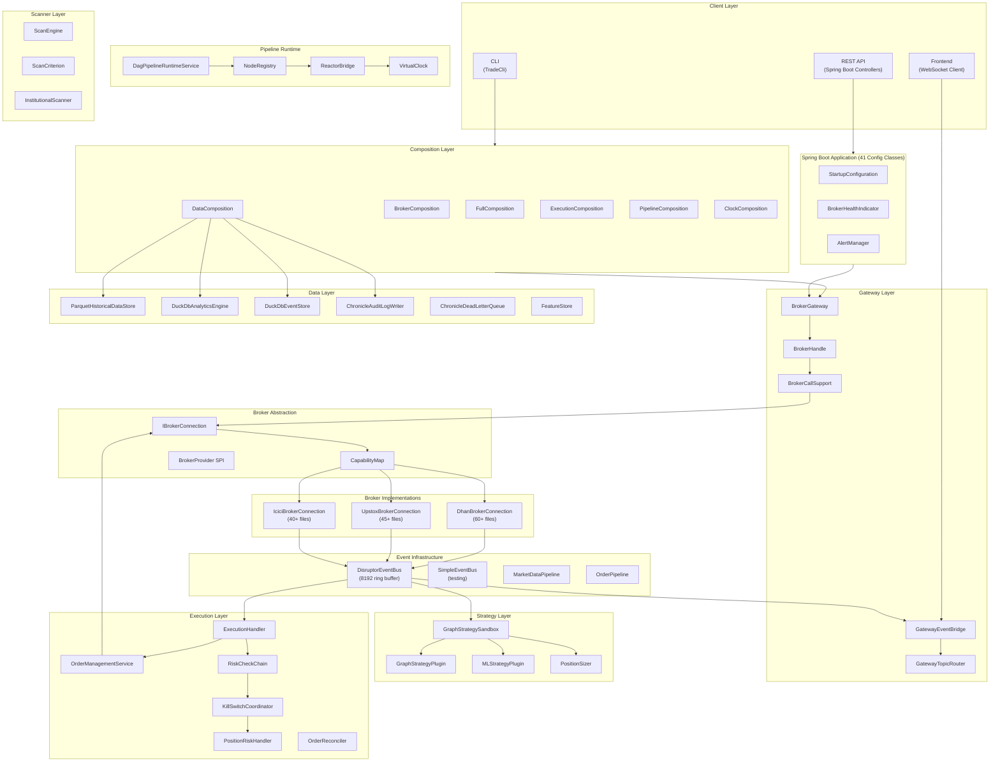

---

## 2. Module Dependency Graph

```mermaid
graph BT
    core["core<br/>(leaf — no deps)"]

    broker_api["broker-api"]
    broker_core["broker-core"]
    broker_dhan["broker-dhan"]
    broker_upstox["broker-upstox"]
    broker_icici["broker-icici"]
    broker_gw["broker-gateway"]

    runtime_disruptor["runtime-disruptor"]
    runtime_hotpath["runtime-hotpath"]

    pipeline_core["pipeline-core"]
    pipeline_rt["pipeline-runtime"]
    pipeline_plat["trade-pipeline-platform"]
    pipeline_analytics["trade-analytics"]

    trading_strategy["trading-strategy"]
    trading_exec["trading-execution"]
    trading_ind["trading-indicators"]
    trading_scan["trading-scanner"]
    trading_inst["trading-institutional-scanner"]
    trading_opts["trading-options-analytics"]
    trading_sim["trading-simulation"]

    data_persist["data-persistence"]
    data_analytics["data-analytics"]
    data_ingest["data-historical-ingest"]
    data_feat["data-feature-store"]

    node_lib["trade-node-library"]
    replay["replay-engine"]
    composition["composition"]
    gateway["gateway"]
    cli["cli"]
    app["app"]

    broker_api --> core
    broker_core --> broker_api
    broker_core --> core
    broker_dhan --> broker_core
    broker_upstox --> broker_core
    broker_icici --> broker_core
    broker_gw --> broker_api

    runtime_disruptor --> core
    runtime_hotpath --> runtime_disruptor
    runtime_hotpath --> core

    pipeline_core --> core
    pipeline_rt --> pipeline_core
    pipeline_rt --> core
    pipeline_plat --> pipeline_core
    pipeline_analytics --> pipeline_core

    trading_strategy --> core
    trading_exec --> broker_api
    trading_exec --> core
    trading_ind --> core
    trading_scan --> core
    trading_scan --> broker_api
    trading_inst --> core
    trading_inst --> broker_api
    trading_opts --> core
    trading_sim --> core

    data_persist --> core
    data_analytics --> data_persist
    data_analytics --> core
    data_ingest --> data_persist
    data_ingest --> broker_api
    data_feat --> data_persist

    node_lib --> pipeline_core
    replay --> core
    replay --> pipeline_rt

    composition --> broker_dhan
    composition --> broker_upstox
    composition --> broker_icici
    composition --> trading_exec
    composition --> data_persist
    composition --> pipeline_rt

    gateway --> core
    gateway --> runtime_disruptor
    gateway --> broker_gw

    cli --> composition
    cli --> broker_gw

    app --> composition
    app --> broker_dhan
    app --> broker_upstox
    app --> broker_icici
    app --> gateway
    app --> cli
    app --> runtime_disruptor
    app --> pipeline_rt
    app --> trading_strategy
    app --> trading_exec
    app --> trading_scan
    app --> data_persist
    app --> data_analytics
    app --> data_ingest

    style core fill:#e1f5fe
    style broker_api fill:#fff3e0
    style broker_core fill:#fff3e0
    style broker_dhan fill:#fce4ec
    style broker_upstox fill:#fce4ec
    style broker_icici fill:#fce4ec
    style broker_gw fill:#f3e5f5
    style gateway fill:#f3e5f5
    style composition fill:#e8f5e9
    style app fill:#fff9c4
```

---

## 3. Market Data Flow (Sequence Diagram)

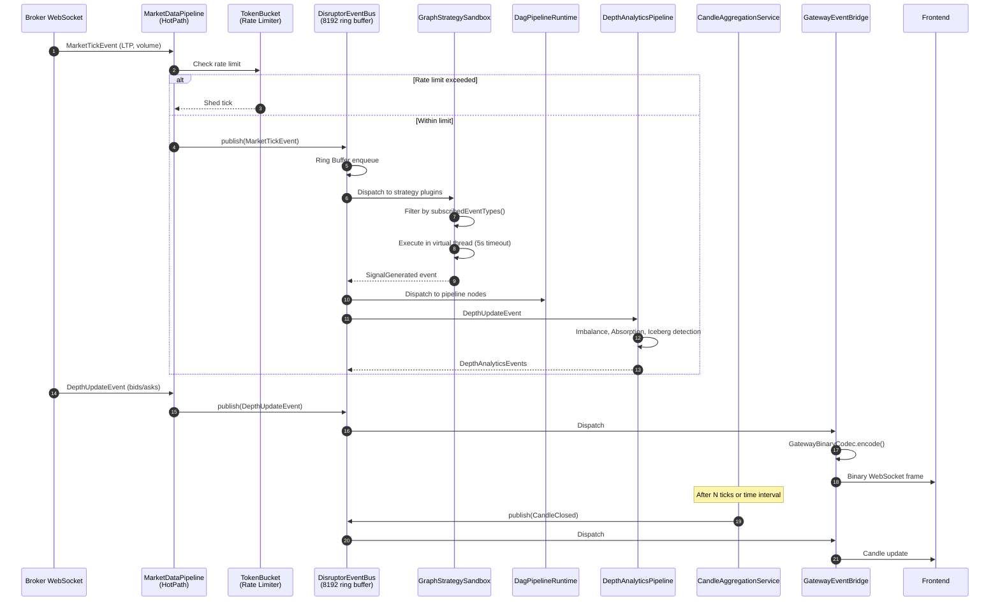

---

## 4. Order Execution Flow (Sequence Diagram)

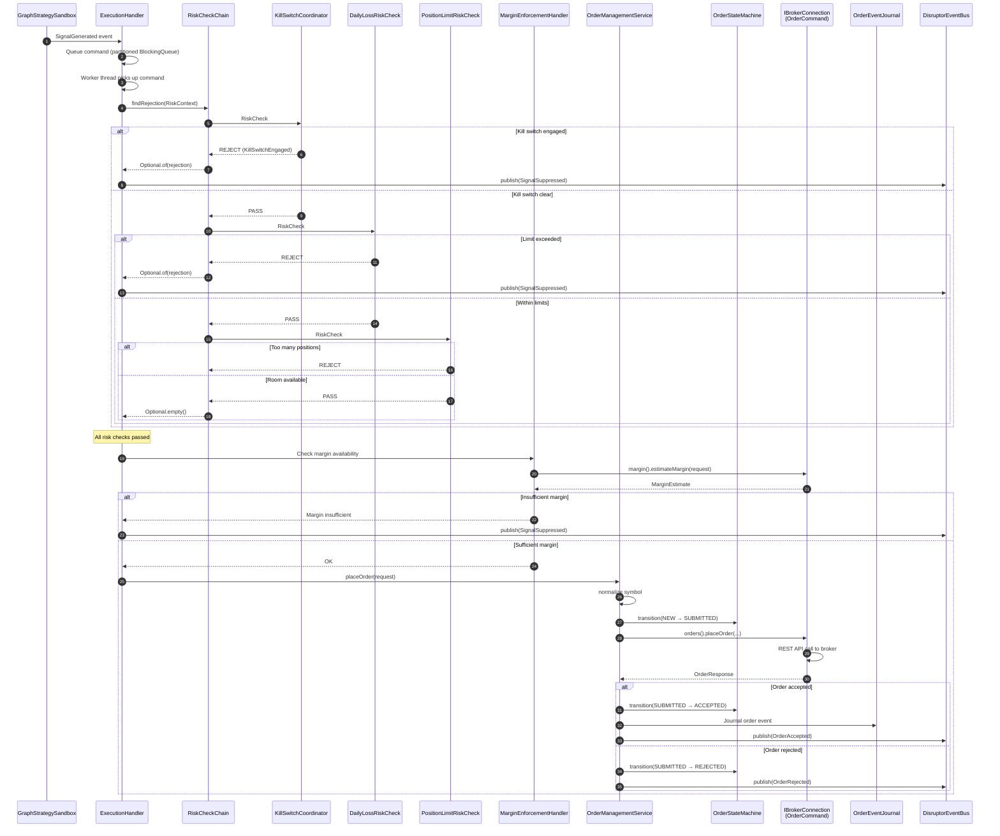

---

## 5. Historical Data Flow (Sequence Diagram)

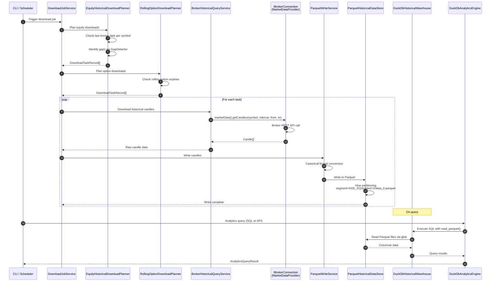

---

## 6. Broker Initialization Sequence

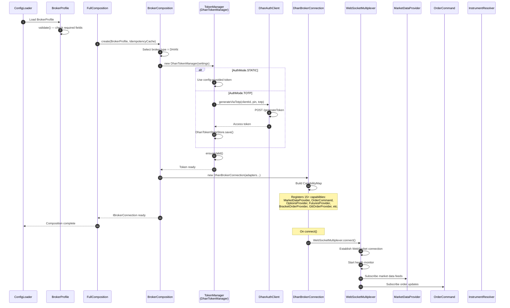

---

## 7. Event Bus Architecture

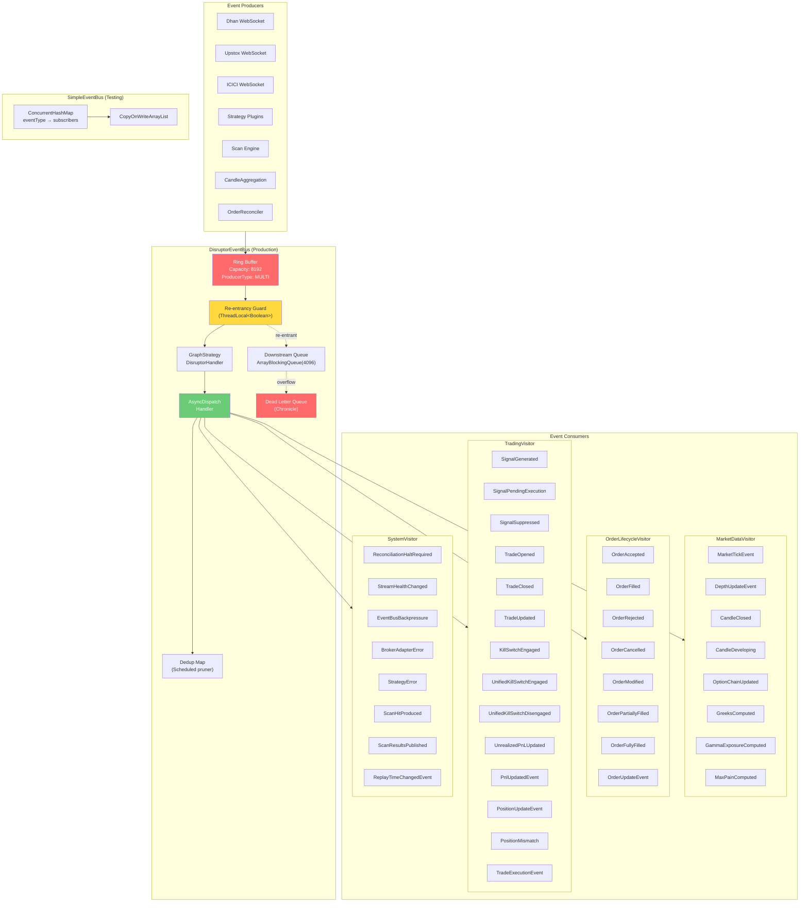

---

## 8. Composition Layer Flow

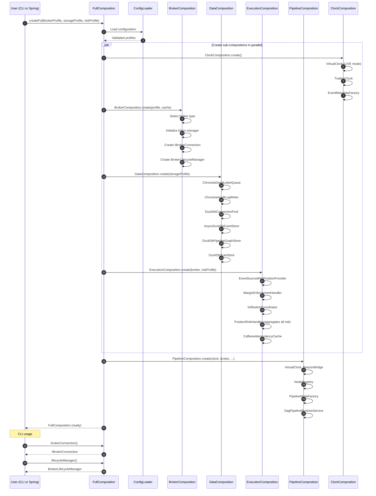

---

## 9. Strategy Execution Flow

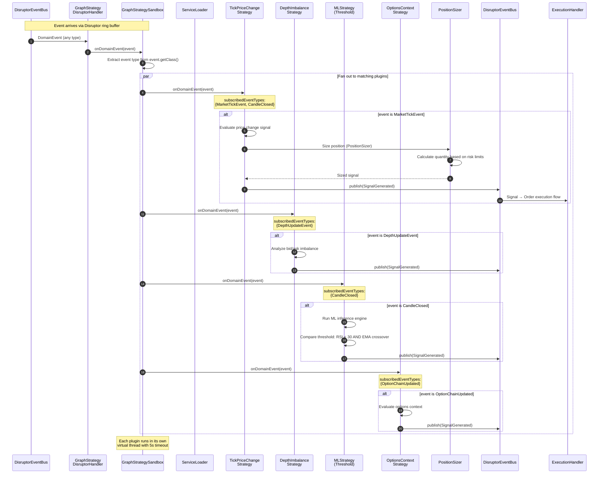

---

## 10. Historical Replay Flow

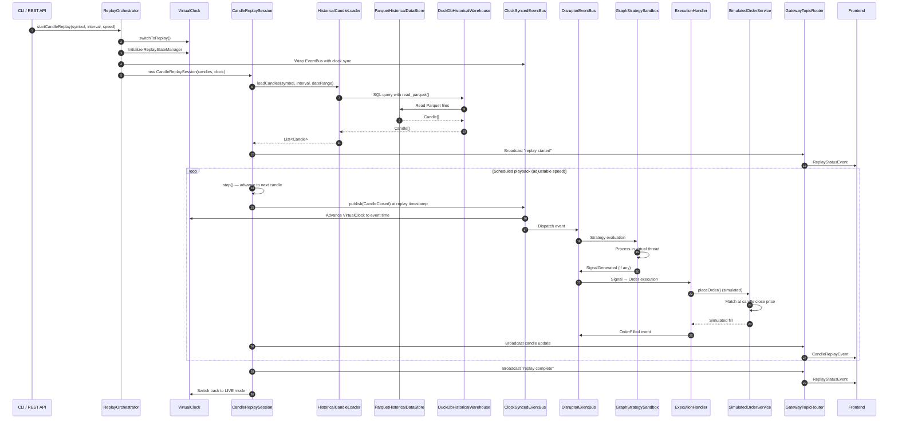

---

## 11. Risk Management Architecture

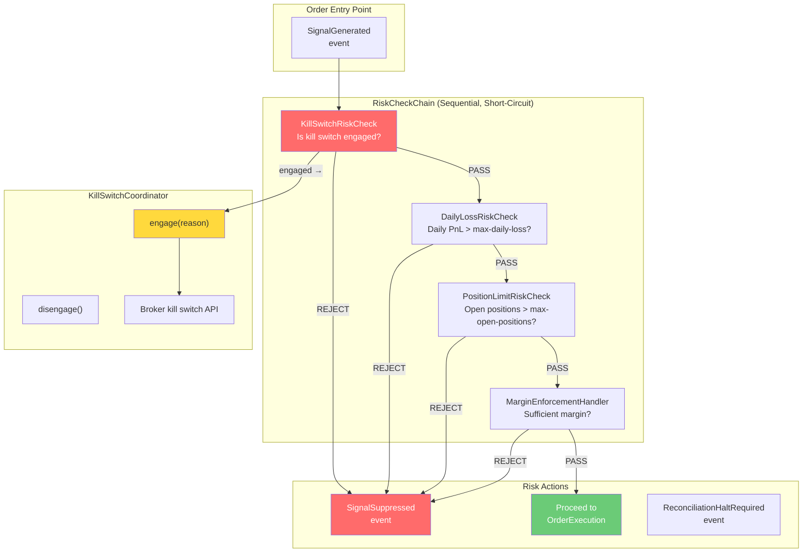

---

## 12. Data Storage Architecture

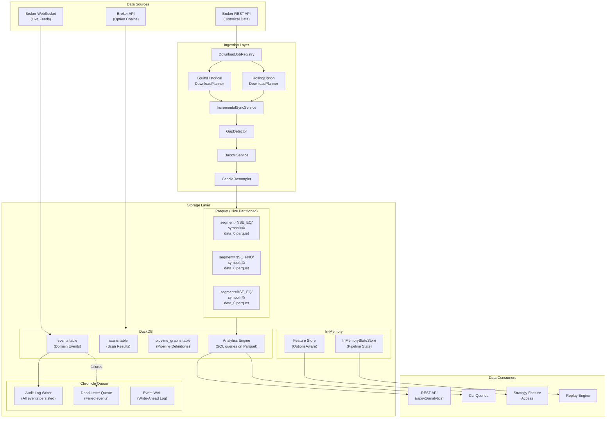

---

## 13. CLI Execution Architecture

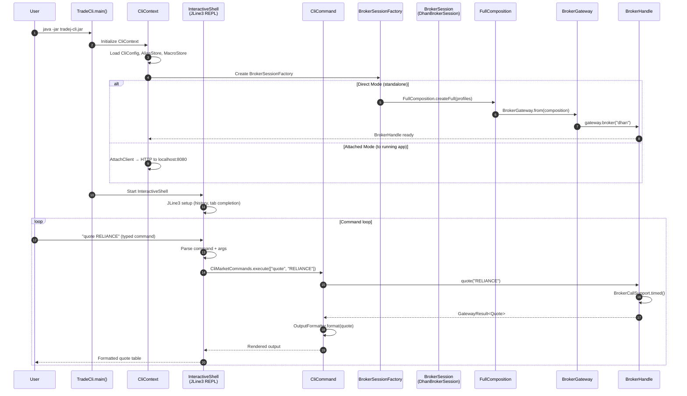

---

## 14. Spring Boot Configuration Loading

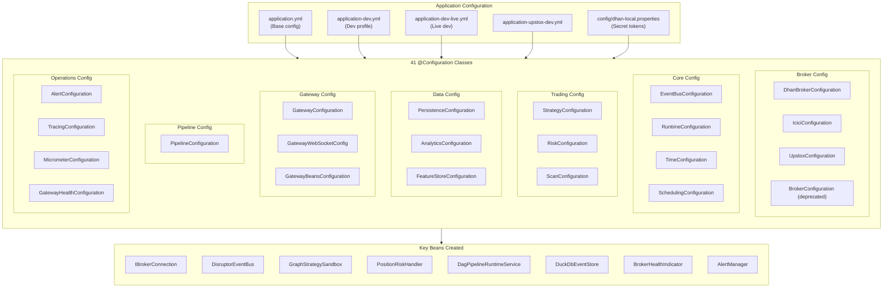

---

## 15. Scanner & Options Analytics Flow

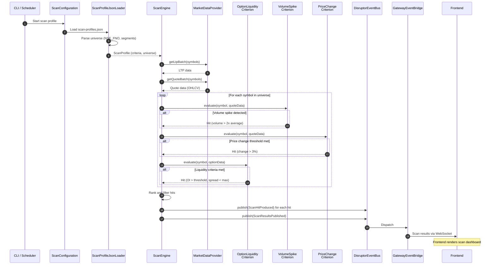

---

## 16. Broker Adapter Pattern (Hexagonal)

```mermaid
graph TB
    subgraph Ports["Ports (broker-api)"]
        direction TB
        IBC["IBrokerConnection<br/>(CapabilityMap)"]
        MPD["MarketDataProvider"]
        OC["OrderCommand"]
        OQ["OrderQuery"]
        PP["PortfolioProvider"]
        OP["OptionsProvider"]
        FP["FuturesProvider"]
        IR["InstrumentResolver"]
        WS["WebSocketMultiplexer"]
        MP["MarginProvider"]
        SRP["SessionRiskProvider"]
        CAP["ConditionalAlertProvider"]
        BOP["BracketOrderProvider"]
        GOP["GttOrderProvider"]
        SOC["SliceOrderCommand"]
        COP["CoverOrderProvider"]
        MSP["MarketStatusProvider"]
        NP["NewsProvider"]
    end

    subgraph Dhan["Dhan Adapters"]
        DM["DhanMarketDataProvider"]
        DO["DhanOrderCommandAdapter"]
        DOQ["DhanOrderQueryAdapter"]
        DP["DhanPortfolioProvider"]
        DOP["DhanOptionsProvider"]
        DFP["DhanFuturesProvider"]
        DIR["DhanInstrumentResolver"]
        DWS["DhanWebSocketMultiplexer"]
        DMP["DhanMarginProvider"]
        DSAP["DhanBracketOrderAdapter"]
        DGAP["DhanGttOrderAdapter"]
        DSOC["DhanSliceOrderAdapter"]
        DMSP["DhanMarketStatusProvider"]
    end

    subgraph Upstox["Upstox Adapters"]
        UM["UpstoxMarketDataProvider"]
        UO["UpstoxOrderCommandAdapter"]
        UOQ["UpstoxOrderQueryAdapter"]
        UP["UpstoxPortfolioProvider"]
        UOP["UpstoxOptionsProvider"]
        UFP["UpstoxFuturesProvider"]
        UIR["UpstoxInstrumentResolver"]
        UWS["UpstoxWebSocketMultiplexer"]
        UMP["UpstoxMarginProvider"]
        UGAP["UpstoxGttOrderAdapter"]
        USOC["UpstoxSliceOrderAdapter"]
        UCOP["UpstoxCoverOrderAdapter"]
        UMSP["UpstoxMarketStatusProvider"]
        UNP["UpstoxNewsProvider"]
    end

    subgraph ICICI["ICICI Adapters"]
        IM["IciciMarketDataProvider"]
        IO["IciciOrderCommandAdapter"]
        IOQ["IciciOrderQueryAdapter"]
        IP["IciciPortfolioProvider"]
        IOP["IciciOptionsProvider"]
        IFP["IciciFuturesProvider"]
        IIR["BreezeInstrumentResolver"]
        IWS["BreezeWebSocketMultiplexer"]
        IMP["IciciMarginProvider"]
        IBAP["IciciBracketOrderAdapter<br/>(synthetic)"]
        IGAP["IciciGttOrderAdapter<br/>(synthetic)"]
        ISOC["IciciSliceOrderAdapter<br/>(synthetic)"]
        ICOP["IciciCoverOrderAdapter<br/>(synthetic)"]
        IMSP["IciciMarketStatusProvider"]
    end

    IBC --> MPD
    IBC --> OC
    IBC --> OQ
    IBC --> PP
    IBC --> OP
    IBC --> FP
    IBC --> IR
    IBC --> WS
    IBC --> MP
    IBC --> SRP
    IBC --> CAP
    IBC --> BOP
    IBC --> GOP
    IBC --> SOC
    IBC --> COP
    IBC --> MSP
    IBC --> NP

    MPD -.-> DM
    MPD -.-> UM
    MPD -.-> IM

    OC -.-> DO
    OC -.-> UO
    OC -.-> IO

    BOP -.-> DSAP
    BOP -.->|"synthetic"| IBAP

    GOP -.-> DGAP
    GOP -.-> UGAP
    GOP -.->|"synthetic"| IGAP

    style IBAP fill:#ffcc80
    style IGAP fill:#ffcc80
    style ISOC fill:#ffcc80
    style ICOP fill:#ffcc80
```
