# Trade-J — Architecture, Class, Component & Flow Report

> **Generated:** 2026-05-31 (deep code audit, pass 3)  
> **Project:** Trade-J (`trade-j` 0.1.0-SNAPSHOT)  
> **Stack:** Java 21 · Spring Boot 3.4.13 · Gradle · React 19 + TypeScript · Vite · picocli  
> **Runtime Modes:** LIVE · REPLAY · BACKTEST  
> **Visual diagrams:** [docs/visuals/Trade-J-Architecture-Visual.html](visuals/Trade-J-Architecture-Visual.html)  
> **Testing detail:** [TESTING.md](../TESTING.md) · [REGRESSION_MANIFEST.md](../REGRESSION_MANIFEST.md)

### Project Health Snapshot

| Metric | Value |
|--------|-------|
| Gradle subprojects | 24 ([`settings.gradle`](../settings.gradle)) |
| Java compilation units | **655** main · **213** module test · **1** architecture-test (**214** total) — see [CODEBASE_LEAF_INDEX.md](CODEBASE_LEAF_INDEX.md) |
| React console (`frontend/`) | **29** TS/TSX/CSS files (incl. `vite.config.ts`; synced into `:app` static console) |
| Leaf file index | [docs/CODEBASE_LEAF_INDEX.md](CODEBASE_LEAF_INDEX.md) (every `src/main/java` class by package) |
| Brokers | Dhan · Upstox |
| Active pipeline runtimes | Disruptor hot path (3 configs) + Graph DAG |
| Canonical backlog | [docs/BACKLOG.md](BACKLOG.md) |
| Interactive diagrams (browser) | [Trade-J-Architecture-Visual.html](visuals/Trade-J-Architecture-Visual.html) — layers, components, flows, modules, capabilities |

---

## 0. Start Here — Diagrams, Modules & What Trade-J Does

Use this section for orientation. Detailed mermaid diagrams follow in §3–§22; the HTML visual is best for presentations and walkthroughs.

### What Trade-J can do

| Capability | Description | Primary modules / entry points |
|------------|-------------|--------------------------------|
| **Live market data** | Tick, quote, depth, OHLC via Dhan/Upstox WebSocket or REST | `:broker-*`, `MarketDataPipeline`, `GatewayEventBridge` |
| **Order management (OMS)** | Deterministic order state machine, place/modify/cancel, event-sourced lifecycle | `:trading-execution`, `OrderManagementService`, `OrderStateMachine` |
| **Risk & portfolio** | Daily limits, circuit breaker, capital reservation, position mismatch alerts | `PositionRiskHandler`, `PortfolioEngine`, `TradingCircuitBreaker` |
| **Strategies** | Plugin + graph sandbox strategies; ML inference via feature store | `:trading-strategy`, `GraphStrategySandbox`, `ThresholdMLInferenceEngine` |
| **Scanning** | Universe criteria scan, option liquidity scan, institutional ranking | `:trading-scanner`, `:trading-institutional-scanner`, `ScanController`, `OptionScanController` |
| **Historical data** | Equity/option download, Parquet/DuckDB warehouse, admin replay | `:data-historical-ingest`, `HistoricalDownloadController` |
| **Analytics** | Federated historical SQL, studio charts | `:data-analytics`, `AnalyticsController` |
| **Simulation** | Replay/backtest with simulated broker and matching engine | `:trading-simulation`, `RuntimeMode` REPLAY/BACKTEST |
| **Composable pipelines** | DAG graph runtime (nodes: candle, strategy, risk, OMS, scan, feature) | `:core` graph types, `DagPipelineRuntimeService`, Studio UI |
| **Operator tooling** | REST API, React console, picocli CLI (`tradej`) | `:app`, `:gateway`, `:cli` |


**Runtime modes:** `LIVE` (real or sandbox broker), `REPLAY` (historical events + simulated orders), `BACKTEST` (Parquet bars + matching engine).

### Diagram guide

| Diagram type | In this document | Interactive (open in browser) |
|--------------|------------------|-------------------------------|
| **Architecture** (layers & data flow) | [§3 High-Level Architecture](#3-high-level-architecture) | Visual HTML — **§1** System Architecture |
| **Components** (key classes & ports) | [§6 Broker](#6-broker-adapter-architecture-hexagonal), [§18 Class Diagrams](#18-key-class-diagrams) | Visual HTML — **§3** Component Diagram |
| **Runtime flows** (tick → fill, scan, ingest) | [§9](#9-event-system--disruptor-bus)–[§14](#14-persistence--data-layer), [§22](#22-risk-management-flow) | Visual HTML — **§4** Runtime Flow Diagrams |
| **Module map** (26 Gradle projects) | [§2](#2-gradle-module-map), [§4](#4-module-dependency-graph), [Leaf index](CODEBASE_LEAF_INDEX.md) | Visual HTML — **§5** Module Dependency Map |
| **Leaf files** (all Java classes) | [CODEBASE_LEAF_INDEX.md](CODEBASE_LEAF_INDEX.md) | — |
| **Test pyramid** | [§23](#23-testing-architecture) | Visual HTML — **§5** Test Pyramid |
| **Capabilities & backlog** | This section, [§25](#25-open-architecture-findings) | Visual HTML — **§2** Platform Capabilities, **§6** Insights |

Open the visual: from repo root, open `docs/visuals/Trade-J-Architecture-Visual.html` in a browser (or use your IDE’s simple browser preview).

### Architecture at a glance (layers)

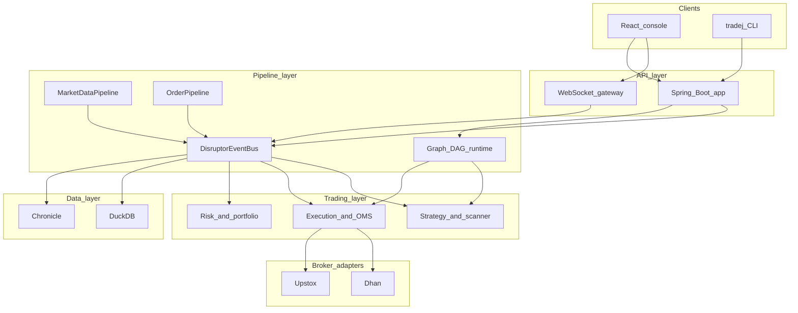

### Key runtime flows (index)

| Flow | Section | Summary |
|------|---------|---------|
| Live tick → signal → order → fill | [§9](#9-event-system--disruptor-bus), [§10](#10-trading-flow--order-lifecycle), [§11](#11-trading-flow--market-data-hot-path) | WS → `MarketDataPipeline` → **Config A** ring (`GraphPipelineDisruptorHandler`) → `AsyncDispatch` → optional `ExecutionHandler` via graph nodes |
| Order lifecycle & reconciliation | [§10](#10-trading-flow--order-lifecycle) | OMS state machine, `OrderReconciler`, fill replay |
| Strategy evaluation | [§12](#12-trading-flow--strategy-evaluation) | Plugins / graph sandbox → `PortfolioEngine` → execution queue |
| Universe & option scan | [§13](#13-scanner--scan-engine-flow) | `ScanEngine`, `OptionLiquidityScanner`, institutional ranking |
| Historical ingest & replay | [§14](#14-persistence--data-layer) | Planners → Parquet/DuckDB → `ReplayRunner` |
| Risk gate | [§22](#22-risk-management-flow) | Hot-path `PositionRisk` first; DAG `RiskNode`; portfolio capital |
| Startup wiring | [§21](#21-startup-sequence) | `BrokerStartupOrchestrator` catalog, WS, subscribers |

### Component map at a glance

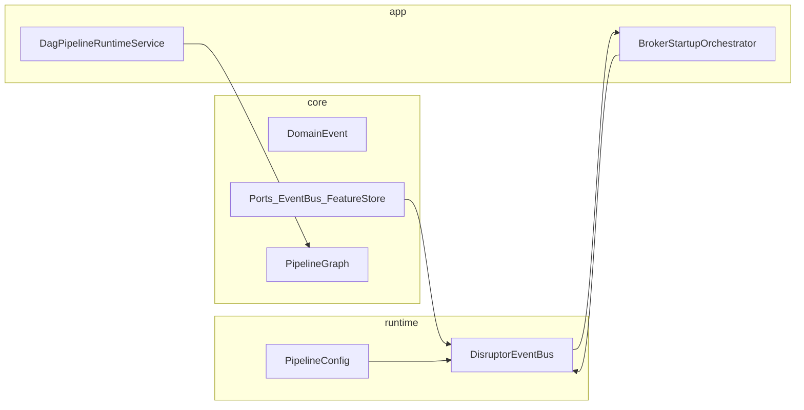

---

## Table of Contents

0. [Start Here — Diagrams, Modules & Capabilities](#0-start-here--diagrams-modules--what-trade-j-does)
1. [System Overview](#1-system-overview)
2. [Gradle Module Map](#2-gradle-module-map)
3. [Architecture Diagram](#3-high-level-architecture)
4. [Module Dependency Graph](#4-module-dependency-graph)
5. [Dual Pipeline Architecture](#5-dual-pipeline-architecture)
6. [Broker Adapter Architecture (Hexagonal)](#6-broker-adapter-architecture)
7. [Core Domain Model](#7-core-domain-model)
8. [Pipeline Graph Runtime](#8-pipeline-graph-runtime)
9. [Event System & Disruptor Bus](#9-event-system--disruptor-bus)
10. [Trading Flow — Order Lifecycle](#10-trading-flow--order-lifecycle)
11. [Trading Flow — Market Data Hot Path](#11-trading-flow--market-data-hot-path)
12. [Trading Flow — Strategy Evaluation](#12-trading-flow--strategy-evaluation)
13. [Scanner & Scan Engine Flow](#13-scanner--scan-engine-flow)
14. [Persistence & Data Layer](#14-persistence--data-layer)
15. [WebSocket Gateway Bridge](#15-websocket-gateway-bridge)
16. [CLI Architecture](#16-cli-architecture)
17. [Frontend Console Architecture](#17-frontend-console-architecture)
18. [Key Class Diagrams](#18-key-class-diagrams)
19. [Spring Bean Wiring](#19-spring-bean-wiring)
20. [Runtime Mode Decision Flow](#20-runtime-mode-decision-flow)
21. [Startup Sequence](#21-startup-sequence)
22. [Risk Management Flow](#22-risk-management-flow)
23. [Testing Architecture](#23-testing-architecture)
24. [Configuration & Profiles](#24-configuration--profiles)
25. [Open Architecture Findings](#25-open-architecture-findings)
26. [Appendix — Module File Counts & Packages](#26-appendix--module-file-counts--packages)
27. [Leaf File Index (full inventory)](#27-leaf-file-index-full-inventory)

---

## 1. System Overview

Trade-J is a **real-time algorithmic trading platform** for Indian equity and F&O markets. It provides:

- **Live market data** via broker WebSocket feeds (Dhan / Upstox)
- **Order Management System (OMS)** with deterministic state machine
- **Strategy plugin framework** with sandboxed execution
- **DAG-based composable pipeline** (graph runtime) coexisting with a legacy fixed-stage Disruptor pipeline
- **Scanner engine** for options liquidity and universe screening
- **Simulation / backtesting** with configurable slippage model
- **Event-sourced persistence** via Chronicle Queue + DuckDB
- **WebSocket bridge** for browser-based React console
- **CLI** for operator commands (picocli-based)

### Design Principles

| Principle | Implementation |
|-----------|---------------|
| Hexagonal (ports & adapters) | `IBrokerConnection` facade with pluggable Dhan/Upstox adapters |
| Event-driven | `EventBus` interface → LMAX Disruptor ring buffer implementation |
| Domain-first | `core` module has zero framework dependencies |
| Hot-path isolation | `runtime-hotpath` is pure Java, no Spring annotations |
| Sandboxed strategies | Each plugin runs in a bounded virtual thread via `StrategySandbox` |
| Runtime mode awareness | LIVE / REPLAY / BACKTEST switchable via `RuntimeMode` enum |

---

## 2. Gradle Module Map

24 subprojects in [`settings.gradle`](../settings.gradle):

```
trade-j (root)
│
├── core/                              → :core
│   └── Domain events, ports, pipeline graph, OMS state machine
│
├── broker/
│   ├── api/                           → :broker-api
│   ├── core/                          → :broker-core
│   ├── dhan/                          → :broker-dhan
│   └── upstox/                        → :broker-upstox
│
├── runtime/
│   ├── disruptor/                   → :runtime-disruptor
│   └── hotpath/                       → :runtime-hotpath
│
├── trading/
│   ├── strategy/                      → :trading-strategy
│   ├── execution/                     → :trading-execution
│   ├── scanner/                       → :trading-scanner
│   ├── institutional-scanner/         → :trading-institutional-scanner
│   ├── indicators/                    → :trading-indicators
│   └── simulation/                    → :trading-simulation
│
├── data/
│   ├── persistence/                   → :data-persistence
│   ├── feature-store/                 → :data-feature-store
│   ├── historical-ingest/             → :data-historical-ingest
│   └── analytics/                     → :data-analytics
│
├── pipeline/
│   ├── platform/trade-pipeline-platform → :trade-pipeline-platform
│   └── analytics/trade-analytics        → :trade-analytics
│
├── nodes/trade-node-library/          → :trade-node-library
│
├── research/
│
├── architecture-test/                 → :architecture-test
├── app/                               → :app (Spring Boot + React console)
├── gateway/                           → :gateway
└── cli/                               → :cli
```

| Gradle project | Path | Main · Test | Role |
|----------------|------|-------------|------|
| `:core` | `core/` | 160 · 15 | Domain, ports, pipeline graph, OMS |
| `:broker-api` | `broker/api/` | 28 · 0 | Port contracts (`IBrokerConnection`, …) |
| `:broker-core` | `broker/core/` | 14 · 0 | Auth, resilience, WebSocket supervisor |
| `:broker-dhan` | `broker/dhan/` | 69 · 19 | Dhan REST/WS, options, historical, TOTP |
| `:broker-upstox` | `broker/upstox/` | 58 · 16 | Upstox OAuth, binary feed, historical |
| `:runtime-disruptor` | `runtime/disruptor/` | 15 · 3 | `DisruptorEventBus`, 8 wired handlers + `SubscriberDispatchHandler` (unused) |
| `:runtime-hotpath` | `runtime/hotpath/` | 5 · 5 | `MarketDataPipeline`, `OrderPipeline`, `PipelineConfig` |
| `:trading-strategy` | `trading/strategy/` | 18 · 11 | Strategy engine, portfolio, candles, ML |
| `:trading-execution` | `trading/execution/` | 17 · 12 | OMS nodes, risk, execution, reconciliation |
| `:trading-scanner` | `trading/scanner/` | 41 · 4 | Criteria scan, option liquidity |
| `:trading-institutional-scanner` | `trading/institutional-scanner/` | 8 · 5 | Feature pipeline, ranking, sector scan |
| `:trading-indicators` | `trading/indicators/` | 6 · 1 | `IndicatorEngine`, CVD, HalfTrend, … |
| `:trading-simulation` | `trading/simulation/` | 3 · 1 | `MatchingEngine`, `SimulatedOrderService` |
| `:data-persistence` | `data/persistence/` | 10 · 6 | Chronicle, DuckDB stores, replay |
| `:data-feature-store` | `data/feature-store/` | 3 · 1 | DuckDB / in-memory features |
| `:data-historical-ingest` | `data/historical-ingest/` | 31 · 12 | Equity/option download, Parquet warehouse |
| `:data-analytics` | `data/analytics/` | 8 · 1 | `DuckDbAnalyticsEngine`, federated SQL |
| `:trade-pipeline-platform` | `pipeline/platform/…` | 15 · 12 | Pipeline catalog, templates |
| `:trade-analytics` | `pipeline/analytics/…` | 9 · 6 | Performance / drawdown reports |
| `:trade-node-library` | `nodes/trade-node-library/` | 12 · 4 | DAG node adapters |
| `:architecture-test` | `architecture-test/` | 0 · 1 | `ModuleBoundaryArchitectureTest` |
| `:app` | `app/` | 82 · 65 | Spring Boot, REST, pipeline orchestration |
| `:gateway` | `gateway/` | 7 · 0 | WebSocket UI bridge |
| `:cli` | `cli/` | 19 · 6 | Operator CLI (`tradej`) |

Full package → class listing: [CODEBASE_LEAF_INDEX.md](CODEBASE_LEAF_INDEX.md).

---

## 3. High-Level Architecture

> Full layer diagram with all 24 modules: [Visual HTML §1](visuals/Trade-J-Architecture-Visual.html). Module list: [§2](#2-gradle-module-map).

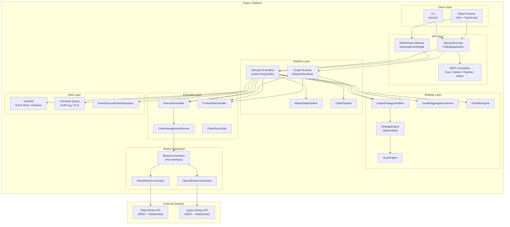

---

## 4. Module Dependency Graph

> Interactive module map: [Visual HTML §5](visuals/Trade-J-Architecture-Visual.html#modules).

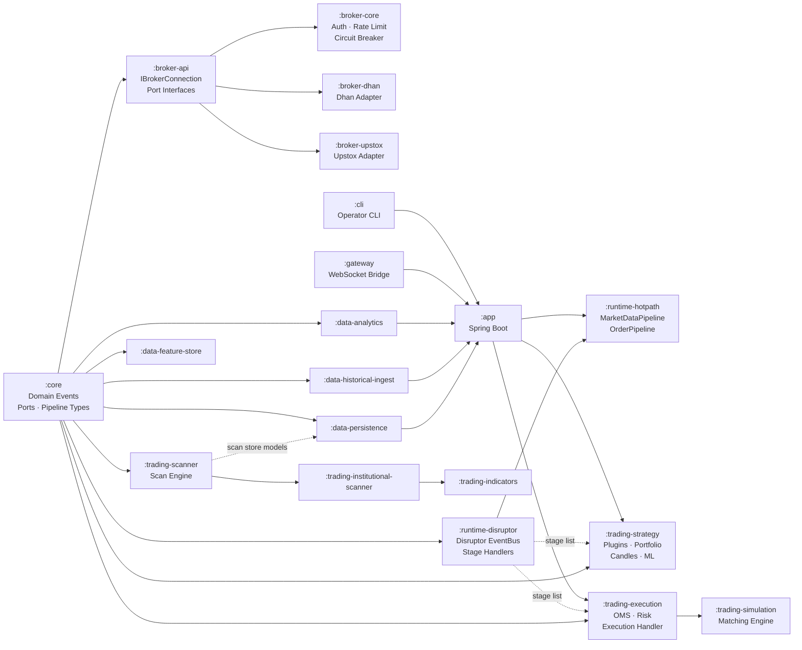

> **Known coupling (dashed):** `:data-persistence` → `:trading-scanner` (scan store models); `:runtime-disruptor` → `:trading-execution` + `:trading-strategy` (stage list).

---

## 5. Dual Pipeline Architecture

Trade-J has **three related pipeline paths** (not mutually exclusive in Spring):

### Spring Boot default — Graph on the Disruptor ring (Config A)

[`EventBusConfiguration`](../../app/src/main/java/com/tradej/app/config/EventBusConfiguration.java) calls `PipelineConfig.create(...)` with:

- `PipelineRuntimeService` (implements `PipelineRuntimeBridge`) → **Config A** in [`DisruptorEventBus`](../../runtime/disruptor/src/main/java/com/tradej/disruptor/DisruptorEventBus.java)
- `InMemoryFeatureStore` (passed but **not** used on the ring when Config A is active; features persist via `DuckDbFeatureStore` on `AsyncDispatchHandler`)
- Optional `GraphStrategySandbox` → extra `GraphStrategyDisruptorHandler` stage after graph
- `shardCount` from `trade.hot-path.shard-count` (0 = single bus, &gt;1 = `ShardedDisruptorEventBus`)

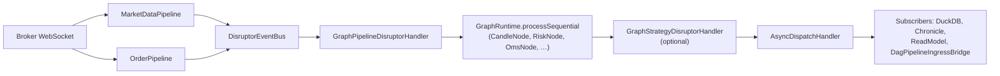

`GraphPipelineDisruptorHandler` delegates to the compiled graph inside the ring (replaces the fixed risk→candle→strategy chain for production wiring).

### Legacy fixed-stage Disruptor chain (Config B/C)

Used when `pipelineRuntimeBridge == null` (unit/component tests, minimal `PipelineConfig` overloads):

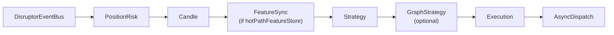

`PortfolioEngine` wraps the downstream `safePublisher` (not a ring-buffer stage). See [§9](#9-event-system--disruptor-bus).

### Studio DAG runtime (separate ingress)

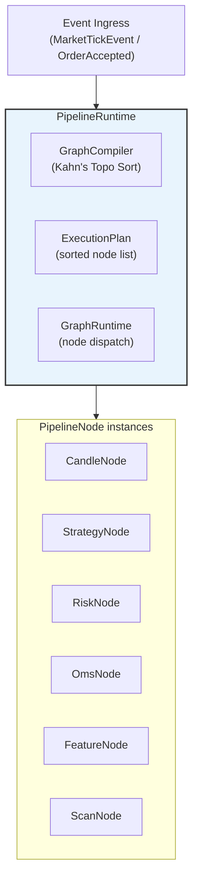

**Key classes:**

| Class | Module | Role |
|-------|--------|------|
| `PipelineGraph` | `:core` | Declarative graph record (nodes + edges) |
| `GraphCompiler` | `:core` | Compiles graph → `ExecutionPlan` via Kahn's algorithm |
| `GraphRuntime` | `:core` | Topologically dispatches events to nodes |
| `PipelineRuntime` | `:core` | Orchestrator: deploy, hot-swap, mode-aware clock |
| `PipelineNode` | `:core` | Interface: `init()`, `onEvent()`, `destroy()` |
| `BasePipelineNode` | `:core` | Abstract base with metrics, state, error counting |
| `PipelineNodeFactory` | `:app` | Creates concrete node instances from definitions |
| `PipelineRuntimeService` | `:app` | Spring service: DAG lifecycle + `PipelineRuntimeBridge` for Disruptor **Config A** |
| `DagPipelineIngressBridge` | `:app` | Cold ingress: selected events → `DagPipelineRuntimeService` (studio DAG, not HOT_PATH ring) |

---

## 6. Broker Adapter Architecture (Hexagonal)

```mermaid
classDiagram
    class IBrokerConnection {
        <<interface>>
        +marketData() MarketDataProvider
        +futures() FuturesProvider
        +options() OptionsProvider
        +orders() OrderCommand
        +orderQuery() OrderQuery
        +sliceOrders() SliceOrderCommand
        +bracketOrders() BracketOrderProvider
        +gttOrders() GttOrderProvider
        +portfolio() PortfolioProvider
        +margin() MarginProvider
        +sessionRisk() SessionRiskProvider
        +alerts() ConditionalAlertProvider
        +instruments() InstrumentResolver
        +websocket() WebSocketMultiplexer
        +connect()
        +disconnect()
        +loadInstrumentCatalog(Path)
    }

    class DhanBrokerConnection {
        -DhanClientHolder clientHolder
        -DhanInstrumentResolver instrumentResolver
        -MarketDataProvider marketDataProvider
        -OrderCommand orderCommand
        -WebSocketMultiplexer webSocketMultiplexer
    }

    class UpstoxBrokerConnection {
        -MarketDataProvider marketDataProvider
        -OrderCommand orderCommand
        -InstrumentResolver instrumentResolver
        -WebSocketMultiplexer webSocketMultiplexer
    }

    IBrokerConnection <|.. DhanBrokerConnection
    IBrokerConnection <|.. UpstoxBrokerConnection

    class MarketDataProvider {
        <<interface>>
        +getQuote(InstrumentKey) Quote
        +getHistoricalCandles(CandleHistoryRequest) List~Candle~
        +getMarketDepth(InstrumentKey, int) MarketDepth
    }

    class OrderCommand {
        <<interface>>
        +placeOrder(OrderRequest) Order
        +cancelOrder(String)
        +modifyOrder(ModifyOrderRequest)
        +setKillSwitch(boolean)
    }

    class OrderQuery {
        <<interface>>
        +getOrders() List~Order~
        +getTrades() List~Trade~
        +getPositions() List~Position~
        +getHoldings() List~Holding~
        +getBalance() Balance
        +getLivePnl() LivePnlSnapshot
    }

    class OptionsProvider {
        <<interface>>
        +getOptionChain(InstrumentKey) OptionChainSnapshot
        +getExpiries(InstrumentKey, ExchangeSegment) List~String~
        +getRollingHistory(RollingOptionHistoryRequest) List~Candle~
    }

    class WebSocketMultiplexer {
        <<interface>>
        +subscribe(MarketSubscriptionRequest)
        +unsubscribe(List~String~)
        +onOrderUpdate(OrderUpdateListener)
        +onMarketData(MarketDataListener)
        +reconnect()
    }

    IBrokerConnection --> MarketDataProvider
    IBrokerConnection --> OrderCommand
    IBrokerConnection --> OrderQuery
    IBrokerConnection --> OptionsProvider
    IBrokerConnection --> WebSocketMultiplexer
```

### Dhan Adapter Package Structure

```
broker/dhan/src/main/java/com/tradej/broker/dhan/
├── DhanBrokerConnection.java           ← IBrokerConnection facade
├── adapter/
│   ├── DhanBaseRestAdapter.java        ← Base HTTP adapter
│   ├── DhanOrderCommandAdapter.java    ← OrderCommand impl
│   ├── DhanOrderQueryAdapter.java      ← OrderQuery impl
│   ├── DhanMarketDataProvider.java     ← MarketDataProvider impl
│   ├── DhanOptionsAdapter.java         ← OptionsProvider impl
│   ├── DhanPortfolioProvider.java      ← PortfolioProvider impl
│   ├── DhanInstrumentResolver.java     ← InstrumentResolver impl
│   ├── DhanMarginProvider.java         ← MarginProvider impl
│   ├── DhanBracketOrderAdapter.java    ← BracketOrderProvider impl
│   ├── DhanGttOrderAdapter.java        ← GttOrderProvider impl
│   ├── DhanSessionRiskProvider.java    ← SessionRiskProvider impl
│   ├── DhanSliceOrderAdapter.java      ← SliceOrderCommand impl
│   └── InMemoryInstrumentResolver.java
├── auth/
│   ├── DhanTokenManager.java           ← Token lifecycle
│   ├── DhanTotpGenerator.java          ← TOTP for Dhan auth
│   └── DhanTokenProvider.java          ← Token access
├── client/
│   └── DhanClientHolder.java           ← SDK client wrapper
├── config/
│   ├── DhanConnectionSettings.java
│   ├── DhanBrokerStartup.java
│   └── DhanBrokerCapabilities.java
├── http/
│   └── DhanAuthenticatedHttpClient.java
├── websocket/
│   ├── DhanWebSocketMultiplexer.java   ← WebSocketMultiplexer impl
│   ├── DhanBinaryParser.java           ← Binary frame parser
│   └── ParsedFeedFrame.java
├── historical/
│   ├── DhanHistoricalDataClient.java
│   └── DhanHistoricalDataMapper.java
├── instrument/
│   ├── DhanInstrumentCatalog.java
│   └── DhanInstrumentLoader.java
├── mapper/
│   ├── DhanSdkMapper.java              ← SDK → domain mapping
│   └── DhanPayloadNormalizer.java
├── options/
│   ├── DhanOptionChainClient.java
│   ├── DhanRollingOptionClient.java
│   └── OptionExpiryCache.java
├── rate/
│   └── MultiBucketRateLimiter.java
└── resilience/
    └── DhanResilienceExecutor.java
```

### Upstox Adapter — Unsupported Ports Pattern

Upstox uses an **"unsupported ports"** pattern for capabilities not available in the Upstox API:

| Port | Upstox Implementation |
|------|-----------------------|
| `BracketOrderProvider` | `UpstoxUnsupportedBracketOrders` (throws `UnsupportedOperationException`) |
| `GttOrderProvider` | `UpstoxUnsupportedGttOrders` |
| `ConditionalAlertProvider` | `UpstoxUnsupportedAlerts` |
| `SliceOrderCommand` | `UpstoxUnsupportedSliceOrders` |
| `SessionRiskProvider` | `UpstoxUnsupportedSessionRisk` |

---

## 7. Core Domain Model

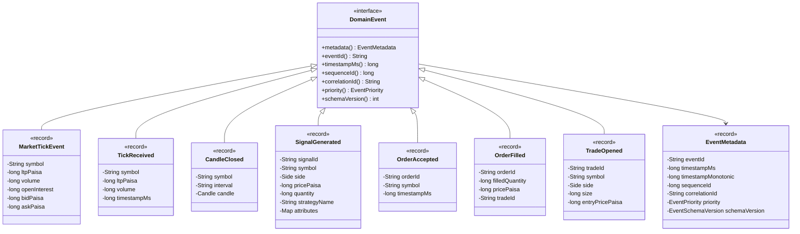

### Domain Value Objects

| Value Object | Module | Purpose |
|-------------|--------|---------|
| `ExchangeSegment` | `:core` | NSE_EQ, NSE_FNO, BSE_EQ, MCX, etc. |
| `Side` | `:core` | BUY / SELL |
| `OrderType` | `:core` | MARKET, LIMIT, SL, SL-M |
| `OrderStatus` | `:core` | NEW, SUBMITTED, ACCEPTED, FILLED, CANCELLED, REJECTED |
| `ProductType` | `:core` | CNC, MIS, NRML |
| `OptionType` | `:core` | CE, PE |
| `Validity` | `:core` | DAY, IOC |
| `FeedMode` | `:core` | TICKER, QUOTE, FULL, DEPTH_20 |
| `RuntimeMode` | `:core` | LIVE, REPLAY, BACKTEST |

### OMS State Machine

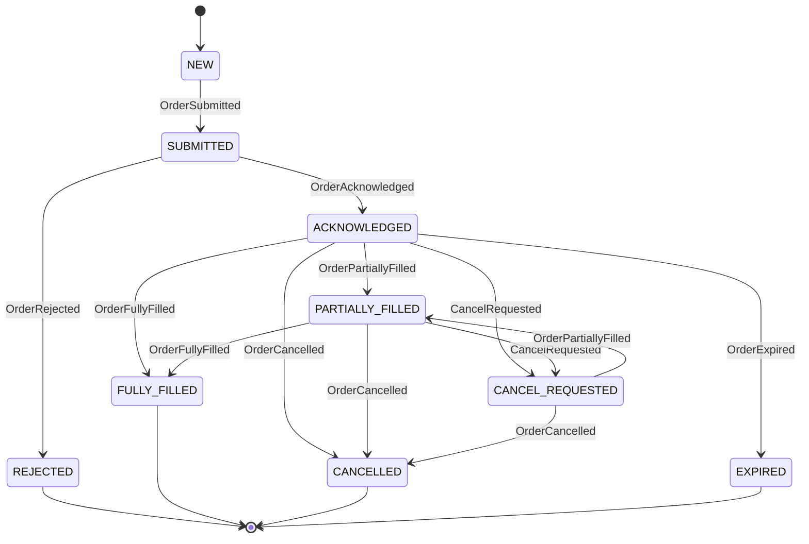

**Key class:** `OrderStateMachine` in `:core` — deterministic lookup-table state machine, tracks `filledQuantity` and `accumulatedValuePaisa` for VWAP.

---

## 8. Pipeline Graph Runtime

### Compilation Flow

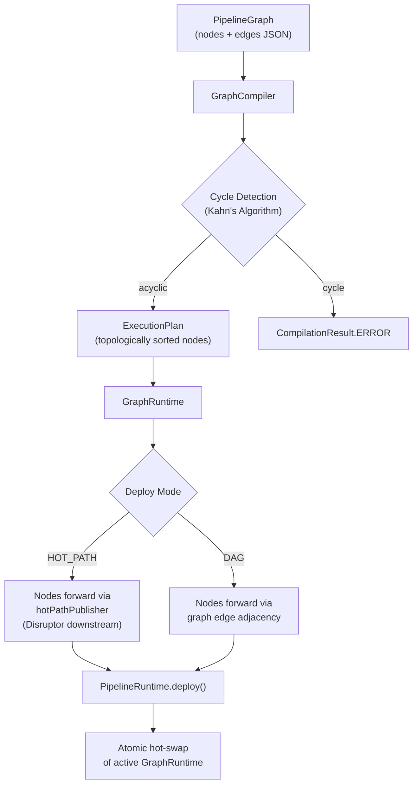

### Node Type Registry

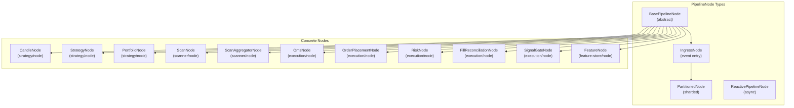

### NodeRegistry & NodeTypeDescriptor

```
NodeRegistry (thread-safe ConcurrentHashMap)
├── "candle"        → NodeTypeDescriptor(category="indicator", ...)
├── "strategy"      → NodeTypeDescriptor(category="signal", ...)
├── "portfolio"     → NodeTypeDescriptor(category="signal", ...)
├── "scan"          → NodeTypeDescriptor(category="scanner", ...)
├── "risk"          → NodeTypeDescriptor(category="risk", ...)
├── "oms"           → NodeTypeDescriptor(category="oms", ...)
├── "feature"       → NodeTypeDescriptor(category="indicator", ...)
└── ... (serves frontend palette + compiler validation)
```

---

## 9. Event System & Disruptor Bus

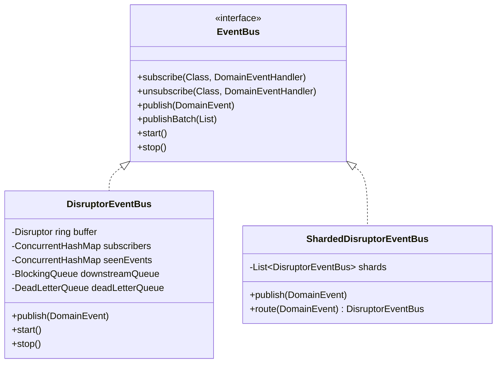

### Disruptor Ring Buffer — Three Configurations

Assembly is in [`DisruptorEventBus`](../../runtime/disruptor/src/main/java/com/tradej/disruptor/DisruptorEventBus.java) (ring buffer **8192**, `BusySpinWaitStrategy`). Stage callbacks use a **safe publisher** that `offer()`s to a bounded downstream queue (**4096**); a drainer thread re-publishes to the ring buffer (avoids re-entrant deadlock). When `PortfolioEngine` is present, it wraps that publisher: `portfolioEngine.onDomainEvent(event, safePublisher)`.

| Config | Condition | Stage chain |
|--------|-----------|-------------|
| **A — Graph runtime** | `pipelineRuntimeBridge != null` | `GraphPipelineDisruptorHandler` → optional `GraphStrategyDisruptorHandler` → `AsyncDispatchHandler` |
| **B — Legacy + feature store** | `hotPathFeatureStore != null` | `PositionRisk` → `Candle` → `FeatureSync` → `Strategy` → optional `GraphStrategy` → `Execution` → `AsyncDispatch` |
| **C — Legacy** | else | `PositionRisk` → `Candle` → `Strategy` → optional `GraphStrategy` → `Execution` → `AsyncDispatch` |

**Spring Boot (`:app`):** [`EventBusConfiguration`](../../app/src/main/java/com/tradej/app/config/EventBusConfiguration.java) always supplies `PipelineRuntimeService`, so the running app uses **Config A** unless tests construct the bus manually. Legacy B/C remain for isolated disruptor tests.

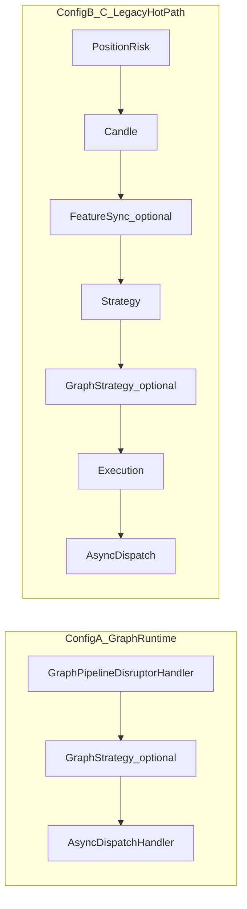

**Disruptor handler classes (8 wired in `DisruptorEventBus`):** `PositionRiskDisruptorHandler`, `CandleAggregationDisruptorHandler`, `FeatureSyncDisruptorHandler`, `StrategyDisruptorHandler`, `GraphStrategyDisruptorHandler`, `GraphPipelineDisruptorHandler`, `ExecutionDisruptorHandler`, `AsyncDispatchHandler`.  
`SubscriberDispatchHandler` remains in `:runtime-disruptor` but is **not** chained (superseded by `AsyncDispatchHandler`).

### Cold-path subscribers (`AsyncDispatchHandler`)

After the ring-buffer chain, [`BrokerStartupOrchestrator.subscribeEventHandlers`](../../app/src/main/java/com/tradej/app/startup/BrokerStartupOrchestrator.java) registers:

- `DuckDbFeatureStore`, `ChronicleAuditLogWriter`, `DuckDbEventStore`, `BrokerErrorTracker`
- Typed `ReadModelStore` updates (orders, trades, ticks, candles, signals, PnL)
- `EventSourcedNetPositionProvider` (trade open/close)
- `ReconciliationAlertLogger` (`PositionMismatch`)
- `DagPipelineIngressBridge` (`CandleClosed`, `MarketTickEvent`, `TickReceived`)

### Key Anti-Patterns Solved

| Issue | Solution |
|-------|----------|
| **Self-deadlock** (publish from handler) | `downstreamQueue` + drainer thread breaks re-entrant pattern |
| **Dedup overhead** | Bounded `seenEvents` cache with periodic pruning (every 1024 publishes) |
| **Event overflow** | `DeadLetterQueue` captures failed events |
| **Multi-broker sharding** | `ShardedDisruptorEventBus` routes by symbol hash |

---

## 10. Trading Flow — Order Lifecycle

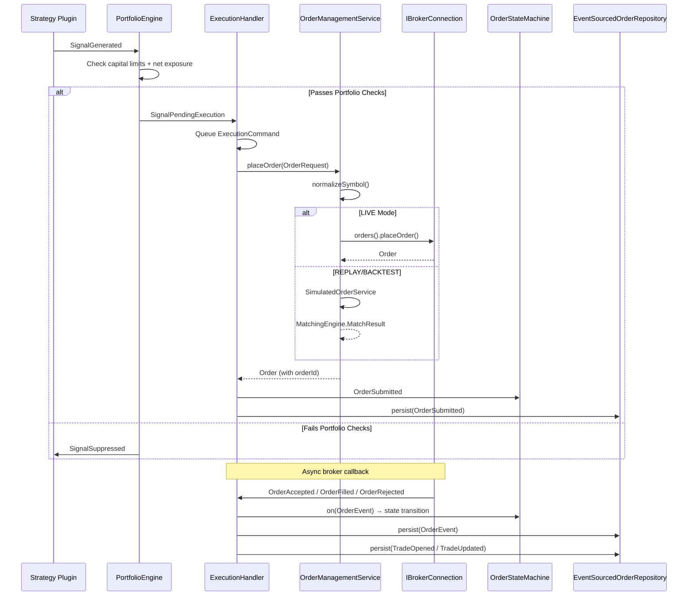

### ExecutionHandler Internal Flow

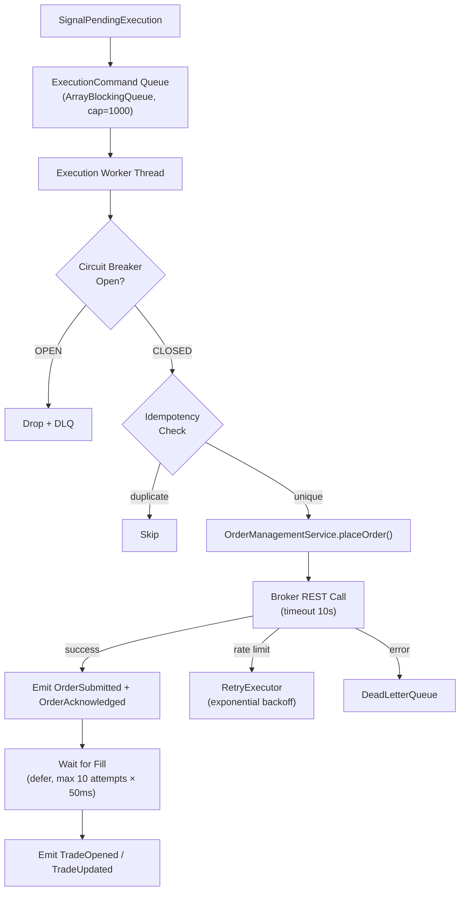

---

## 11. Trading Flow — Market Data Hot Path

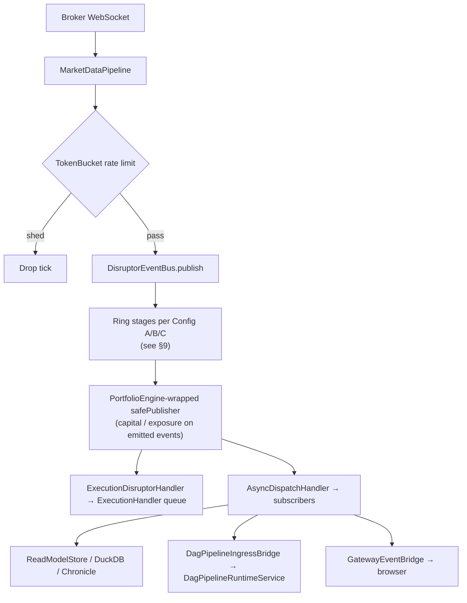

### MarketTickEvent Processing Metrics

| Metric | Source | Description |
|--------|--------|-------------|
| `totalTicksProcessed()` | `MarketDataPipeline` | Cumulative tick count |
| `tickRate()` | `MarketDataPipeline` | EMA ticks/second (α=0.3) |
| `tickRateLimitedCount()` | `MarketDataPipeline` | Ticks shed by rate limiter |
| `lastTickTimestampMs()` | `MarketDataPipeline` | Latest tick timestamp |

---

## 12. Trading Flow — Strategy Evaluation

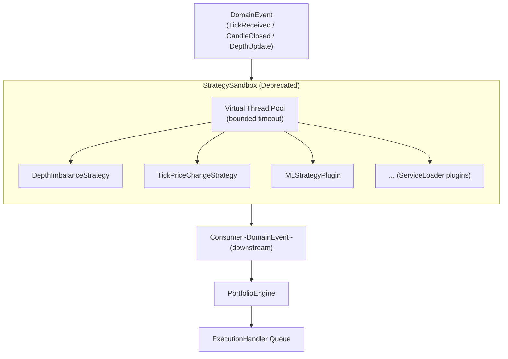

### StrategyPlugin Interface Hierarchy

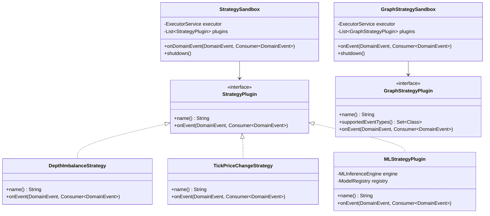

### Portfolio Engine

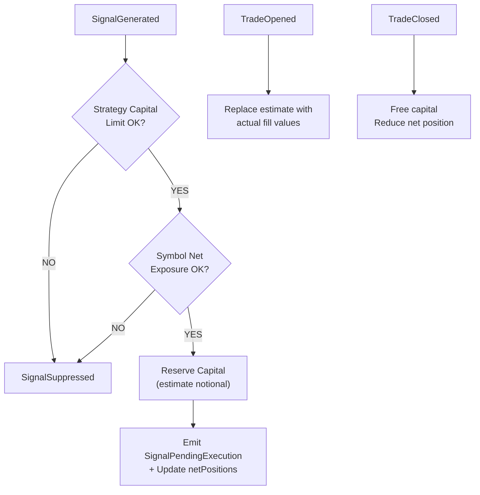

---

## 13. Scanner & Scan Engine Flow

```mermaid
flowchart TD
    PROFILE["ScanProfile<br/>(universe + criteria + mode)"] --> UNIVERSE

    subgraph UNIVERSE["Universe Resolution"]
        U1["UniverseBuilder"]
        U1 --> U2["IndexConstituentsLoader"]
        U1 --> U3["InstrumentResolver"]
    end

    UNIVERSE --> MODE{"ScanMode?"}

    MODE -->|REST| SNAPSHOT["SnapshotFetcher<br/>(batch REST market data)"]
    MODE -->|WS_LIVE| SKIP["Skip snapshot<br/>(live ticks)"]

    SNAPSHOT --> CRITERIA["ScanCriterion evaluation<br/>(per-instrument)"]
    SKIP --> CRITERIA

    CRITERIA --> NEED_OPT{"Needs Option<br/>Fine Pass?"}
    NEED_OPT -->|YES| OPT_CHAIN["OptionChainFetcher<br/>→ option chains"]
    OPT_CHAIN --> FINE["Re-evaluate with option criteria"]
    NEED_OPT -->|NO| COARSE["Coarse hits"]

    FINE --> RANK["ScanResultRanker<br/>(top N)"]
    COARSE --> RANK

    RANK --> RESULT["ScanResult<br/>(ScanRun + ranked hits)"]
```

### Scan Criterion Classes

| Criterion | Type | Purpose |
|-----------|------|---------|
| `PctChangeFromOpenCriterion` | `ScanCriterion` | % change from market open |
| `PctChangeFromPrevCloseCriterion` | `ScanCriterion` | % change from previous close |
| `VolumeSpikeCriterion` | `ScanCriterion` | Volume > N× average |
| `MaxOiStrikeCriterion` | `OptionAwareCriterion` | Max OI strike selection |
| `PcrRangeCriterion` | `OptionAwareCriterion` | Put-Call Ratio range |
| `StreamingScanCriterion` | `ScanCriterion` | WebSocket live streaming |

### Option Liquidity Scanner

```
OptionLiquidityScanner
├── OptionExpiryPolicy        → nearest / next-week / monthly
├── LiquidityScorer           → OI + volume + bid-ask spread scoring
├── OptionSideFilter          → CE-only / PE-only / both
└── OptionContractHit         → scored individual contract results
```

### Option scan REST flow

```text
POST /api/v1/options/scan?underlying=NIFTY&segment=IDX_I&top=10
  → OptionScanController.run()
  → OptionLiquidityScanner.scan(OptionScanRequest)
      → IBrokerConnection.options() (chain, greeks, expiries)
      → LiquidityScorer (OI, volume, bid-ask spread)
  → OptionScanResult (ranked OptionContractHit list)
```

CLI: `./scripts/tradej options-scan NIFTY IDX_I --top 10` (see [CLI.md](../CLI.md)).

### Institutional scan flow

```text
ScanScheduler (cron, profile-based)
  → ScanService.runScan(profile)
  → InstitutionalScanEngine  OR  ScannerNode (DAG)
      → FeaturePipeline (IndicatorEngine, CVD, HalfTrend, BollingerSqueeze, …)
      → RankingEngine / SectorRankingEngine
  → ReadModelStore / DuckDbScanStore → REST (ScanController, ReadModelController)
```

---

## 14. Persistence & Data Layer

```mermaid
flowchart TD
    subgraph "Event Persistence"
        EB["EventBus"] --> DUCKDB_STORE["DuckDbEventStore<br/>(DomainEventHandler)"]
        DUCKDB_STORE --> DUCKDB["DuckDB<br/>events table"]
    end

    subgraph "Audit / DLQ"
        EB --> CHRONICLE_DLQ["ChronicleDeadLetterQueue<br/>(Chronicle Queue)"]
        EB --> CHRONICLE_AUDIT["ChronicleAuditLogWriter<br/>(Chronicle Queue)"]
    end

    subgraph "OMS Event Sourcing"
        EXEC["ExecutionHandler"] --> OMS_REPO["EventSourcedOrderRepository<br/>(Chronicle OMS ring)"]
        OMS_REPO --> REBUILD["Rebuild OrderStateMachine<br/>from event stream"]
    end

    subgraph "Feature Store"
        FS_DUCKDB["DuckDbFeatureStore"]
        FS_MEM["InMemoryFeatureStore<br/>(hot path)"]
        FS_DUCKDB --> DUCKDB_FEAT["DuckDB<br/>features table"]
    end

    subgraph "Scan Store"
        SCAN_ENGINE["ScanEngine"] --> DUCKDB_SCAN["DuckDbScanStore<br/>(scan results)"]
    end

    subgraph "Replay / Backtest"
        REPLAY["ReplayRunner"]
        REPLAY --> HIST["HistoricalRangeService<br/>(DuckDB historical data)"]
        REPLAY --> CLOCK["ReplayClock"]
        REPLAY --> PERSIST_RTB["PipelineRuntime<br/>(BACKTEST mode)"]
    end

    subgraph "Pipeline Graph Persistence"
        GRAPH_STORE["DuckDbPipelineGraphStore"]
        GRAPH_STORE --> DUCKDB_GRAPH["DuckDB<br/>pipeline_graphs table"]
    end
```

### DuckDB Tables

| Table | Writer | Reader | Content |
|-------|--------|--------|--------|
| `events` | `DuckDbEventStore` | `HistoricalRangeService`, `ReplayRunner` | All domain events with timestamps |
| `scan_results` | `DuckDbScanStore` | `ScanService` | Scan runs and hits |
| `features` | `DuckDbFeatureStore` | `ThresholdMLInferenceEngine` | Computed feature vectors |
| `pipeline_graphs` | `DuckDbPipelineGraphStore` | `PipelineRuntimeService` | Serialized PipelineGraph definitions |

### Historical data ingest flow

```text
Universe (Nifty500UniverseFetcher, IndexConstituentsLoader)
  → Planner (EquityHistoricalDownloadPlanner, RollingOptionDownloadPlanner)
  → Download (DhanHistoricalDataClient, UpstoxHistoricalDataService)
  → Normalize (CandleResampler, DhanHistoricalDataMapper, RollingOptionWireMapper)
  → Persist (DuckDbHistoricalWarehouse, ParquetBarWriter, HiveCacheEquityImporter)
  → Query (ParquetHistoricalBarRepository, HistoricalRangeService, admin REST)
```

Admin: `HistoricalDownloadController`, `ExpiredOptionsController`.

### Analytics federation (`:data-analytics`)

```text
AnalyticsController / Studio chart APIs
  → DefaultHistoricalAnalyticsService
  → FederatedHistoricalBarRepository + DuckDbAnalyticsEngine
  → AnalyticsSqlGuard (SQL allow-list)
```

Integration: `AnalyticsFederationIntegrationTest` (`@Tag("integration")`).

### Replay / backtest (data path)

| Mode | Data source | Execution |
|------|-------------|-----------|
| `BACKTEST` | `ParquetHistoricalBarRepository` + in-memory features | `MatchingEngine` + `SimulatedOrderService` |
| `REPLAY` | `HistoricalRangeService` (DuckDB / Chronicle / broker REST) | `ReplayClock` + simulated orders |

`BrokerStartupOrchestrator` skips broker WebSocket when `BrokerRuntimeMode.expectsWebSocket()` is false (e.g. `UPSTOX_ANALYTICS_REST`). `trade.runtime.mode` (`LIVE` / `REPLAY` / `BACKTEST`) is separate and drives `VirtualClock` + `ReplayOrchestrator`. Admin replay endpoints blocked in LIVE via `rejectIfLiveReplay()`.

---

## 15. WebSocket Gateway Bridge

```mermaid
flowchart TD
    EB["EventBus"] --> BRIDGE["GatewayEventBridge<br/>(subscribes to ALL DomainEvents)"]
    BRIDGE --> ROUTER["GatewayTopicRouter"]

    subgraph TOPICS["GatewayTopic Routing"]
        T1["MARKET_TICK"]
        T2["MARKET_DEPTH"]
        T3["CANDLE_DEVELOPING"]
        T4["CANDLE_CLOSED"]
        T5["ORDER_UPDATE"]
        T6["POSITION_UPDATE"]
        T7["STRATEGY_SIGNAL"]
        T8["PNL_UPDATE"]
        T9["REPLAY_TIME"]
    end

    ROUTER --> T1 & T2 & T3 & T4 & T5 & T6 & T7 & T8 & T9

    T1 & T2 & T3 & T4 & T5 & T6 & T7 & T8 & T9 --> CODEC["GatewayBinaryCodec<br/>(JSON serialization)"]
    CODEC --> WS_HANDLER["GatewayWebSocketHandler<br/>(STOMP-like frames)"]
    WS_HANDLER --> BROWSER["Browser Client<br/>(React Console)"]
```

### Topic Mapping

| DomainEvent | GatewayTopic |
|-------------|-------------|
| `MarketTickEvent` / `TickReceived` | `MARKET_TICK` |
| `DepthUpdateEvent` | `MARKET_DEPTH` |
| `CandleDeveloping` | `CANDLE_DEVELOPING` |
| `CandleClosed` | `CANDLE_CLOSED` |
| `OrderAccepted` / `OrderRejected` / `OrderFilled` | `ORDER_UPDATE` |
| `TradeOpened` / `TradeClosed` | `POSITION_UPDATE` |
| `SignalGenerated` | `STRATEGY_SIGNAL` |
| `PnlUpdatedEvent` | `PNL_UPDATE` |
| `ReplayTimeChangedEvent` | `REPLAY_TIME` |

---

## 16. CLI Architecture

```mermaid
flowchart TD
    TRADEJ["TradeCli<br/>(picocli @Command)"]
    TRADEJ --> IC["InteractiveCmd<br/>(InteractiveShell)"]
    TRADEJ --> ATTACH["Attach to running app<br/>(AttachClient → HTTP)"]
    TRADEJ --> STANDALONE["Standalone Broker<br/>(BrokerSessionFactory)"]

    subgraph STANDALONE_FLOW["Standalone Mode"]
        BSF["BrokerSessionFactory"]
        BSF --> DHAN_SESSION["DhanBrokerSession"]
        BSF --> UPSTOX_SESSION["UpstoxBrokerSession"]
        DHAN_SESSION --> CLI_OPS["CliOperations"]
        UPSTOX_SESSION --> CLI_OPS
    end

    subgraph ATTACH_FLOW["Attach Mode"]
        AC["AttachClient"]
        AC --> HTTP["HTTP ↔ App REST API"]
    end

    CLI_OPS --> OUTPUT["OutputFormatter / TablePrinter"]
    HTTP --> OUTPUT
```

### CLI Subcommands (40+)

| Category | Commands |
|----------|----------|
| **Market Data** | `ltp`, `quote`, `depth`, `ohlc`, `candles`, `historical` |
| **Orders** | `place`, `cancel`, `modify`, `order-book`, `trades` |
| **Portfolio** | `positions`, `holdings`, `balance`, `live-pnl`, `broker-positions` |
| **Strategy** | `strategies`, `runtime`, `pipeline` |
| **Scanner** | `scan`, `options-scan`, `chain`, `expiries`, `strike` |
| **System** | `status`, `summary`, `read-model`, `token`, `catalog` |
| **Risk** | `kill-switch`, `reconcile`, `risk-config`, `margin` |
| **Replay** | `replay`, `rolling-option` |
| **Interactive** | `interactive` (menu-driven shell) |

---

## 17. Frontend Console Architecture

Source tree: [`frontend/`](../../frontend/) (29 TS/TSX/CSS files). Built with Vite 6 and synced into `:app` via `syncFrontend` → `app/src/main/resources/static/console/`.

```mermaid
flowchart TD
    subgraph frontend [frontend_src]
        MAIN[main.tsx]
        APP[App.tsx]
        API[api/client websocket sse]
        DTO[dto/types.ts]
        STORE[useStudioStore usePipelineStore]
        HOOKS[useSSE]
        CHART[charts/ChartWidget]
        COMP[components panels]
    end

    subgraph panels [components]
        LP[LeftSidebar]
        TP[TradingPanel]
        SP[ScannerPanel]
        PP[PipelinePanel]
        AP[AdminPanel]
        CP[CommandPalette]
        EB[ErrorBoundary]
    end

    MAIN --> APP
    APP --> panels
    API --> APP
    STORE --> panels
    CHART --> APP
```

### Frontend stack (from `frontend/package.json`)

| Library | Version | Purpose |
|---------|---------|---------|
| React | 19.0.1 | UI framework |
| TypeScript | 5.8.x | Type safety |
| Vite | 6.2.x | Build + dev server |
| Zustand | 5.0.x | `useStudioStore`, `usePipelineStore` |
| lightweight-charts | 5.2.x | `ChartWidget` candlesticks |
| Tailwind (Vite plugin) | 4.1.x | Styling |
| Vitest | 3.2.x | Component tests (`*.test.tsx`) |

REST base URL via `api/client.ts`; live updates via `api/websocket.ts` and `api/sse.ts` (gateway `/ws/gateway`).

---

## 18. Key Class Diagrams

> Interactive component relationships: [Visual HTML §3](visuals/Trade-J-Architecture-Visual.html#components).

### Complete Domain Model

```mermaid
classDiagram
    class Order {
        <<record>>
        -String orderId
        -String correlationId
        -String symbol
        -ExchangeSegment exchangeSegment
        -Side side
        -long quantity
        -OrderType orderType
        -long pricePaisa
        -long triggerPricePaisa
        -ProductType productType
        -Validity validity
        -OrderStatus status
    }

    class Trade {
        <<record>>
        -String tradeId
        -String orderId
        -String symbol
        -Side side
        -long quantity
        -long pricePaisa
        -long timestampMs
    }

    class Position {
        <<record>>
        -String symbol
        -long netQuantity
        -long avgEntryPricePaisa
        -long realizedPnlPaisa
        -long unrealizedPnlPaisa
    }

    class Candle {
        <<record>>
        -long openPaisa
        -long highPaisa
        -long lowPaisa
        -long closePaisa
        -long volume
        -long timestampMs
    }

    class Quote {
        <<record>>
        -String symbol
        -long ltpPaisa
        -long bidPaisa
        -long askPaisa
        -long volume
        -long openInterest
        -long openPaisa
        -long closePaisa
        -long highPaisa
        -long lowPaisa
    }

    class FeatureVector {
        <<record>>
        -String symbol
        -long timestampMs
        -Map~String, Double~ features
    }

    class OptionChainSnapshot {
        <<record>>
        -String underlying
        -List~OptionChainEntry~ entries
    }

    class RiskLimits {
        <<record>>
        -long maxDailyLossPaisa
        -long maxConsecutiveLosses
        -long maxOrderValuePaisa
        -int maxOpenPositions
    }

    class Instrument {
        <<record>>
        -String symbol
        -String tradingSymbol
        -ExchangeSegment exchangeSegment
        -String isin
        -String series
    }

    Order --> Trade
    Order --> Instrument
    Position --> Instrument
```

### Persistence Class Hierarchy

```mermaid
classDiagram
    class DeadLetterQueue {
        <<interface>>
        +enqueue(DomainEvent)
        +drainTo(Path)
        +noop() DeadLetterQueue
    }

    class ChronicleDeadLetterQueue {
        -ChronicleQueue queue
        +enqueue(DomainEvent)
        +drainTo(Path)
    }

    class ChronicleAuditLogWriter {
        -ChronicleQueue queue
        +write(DomainEvent)
    }

    class DuckDbEventStore {
        -Path databasePath
        -Connection connection
        +accept(DomainEvent)
        +queryEvents(LocalDate, LocalDate)
    }

    class EventSourcedOrderRepository {
        -ChronicleQueue omsRing
        +persist(OrderEvent)
        +rebuild(String orderId) OrderStateMachine
    }

    class ReplayRunner {
        -HistoricalRangeService histService
        -PipelineRuntime pipelineRuntime
        +run(LocalDate, LocalDate)
    }

    DeadLetterQueue <|.. ChronicleDeadLetterQueue
    DuckDbEventStore ..|> DomainEventHandler
```

---

## 19. Spring Bean Wiring

### Configuration Classes

| Config Class | Module | Key Beans |
|-------------|--------|-----------|
| `EventBusConfiguration` | `:app` | `EventBus`, `DisruptorBusMetrics`, `MarketDataPipeline`, `OrderPipeline`, `InMemoryFeatureStore` |
| `BrokerConfiguration` | `:app` | `IBrokerConnection`, `BrokerCapabilities`, `BrokerRuntimeMode` |
| `UpstoxConfiguration` | `:app` | Upstox-specific `IBrokerConnection` bean |
| `RuntimeConfiguration` | `:app` | `RuntimeModeHolder` |
| `ExecutionConfiguration` | `:app` | `ExecutionHandler`, `TradingCircuitBreaker`, `OrderIdentityRegistry` |
| `StrategyConfiguration` | `:app` | `StrategyEngine`, `GraphStrategySandbox`, `PortfolioEngine` |
| `RiskConfiguration` | `:app` | `PositionRiskHandler`, `DailyRiskResetScheduler` |
| `PersistenceConfiguration` | `:app` | `ChronicleDeadLetterQueue`, `DuckDbEventStore`, `EventSourcedOrderRepository` |
| `FeatureStoreConfiguration` | `:app` | `DuckDbFeatureStore`, `InMemoryFeatureStore` |
| `ScanConfiguration` | `:app` | `ScanEngine`, `ScanService`, `ScanScheduler` |
| `PipelineConfiguration` | `:app` | `PipelineRuntimeService`, `PipelineNodeFactory`, `NodeRegistry` |
| `ClockConfiguration` | `:app` | `VirtualClock` |
| `SchedulingConfiguration` | `:app` | `ScheduledExecutorService` pools |
| `StartupConfiguration` | `:app` | `BrokerStartupOrchestrator` |

### REST Controllers (12 in `:app`)

| Controller | Package | Purpose |
|-----------|---------|---------|
| `MarketDataController` | `api` | LTP, historical candles |
| `ScanController` | `api` | Scan runs, results, triggers |
| `OptionScanController` | `api` | Options liquidity scan |
| `PipelineController` | `api` | Pipeline CRUD, deploy, status |
| `SymbolController` | `api` | Symbol search, tabs |
| `ReadModelController` | `api` | Live read model snapshots |
| `StudioController` | `api` | Studio session / chart APIs |
| `AnalyticsController` | `api` | Federated analytics SQL |
| `ExpiredOptionsController` | `api` | Expired options metadata |
| `AdminController` | `admin` | Runtime, historical admin APIs |
| `HistoricalDownloadController` | `admin` | Historical download jobs |
| `DashboardRedirectController` | `admin` | `@Controller` — `/` redirect to console |

---

## 20. Runtime Mode Decision Flow

```mermaid
flowchart TD
    START["Application Start"] --> RESOLVER["BrokerRuntimeModeResolver"]

    RESOLVER --> CHECK1{"trade.runtime.mode<br/>property?"}
    CHECK1 -->|"LIVE (default)"| LIVE["RuntimeMode.LIVE"]
    CHECK1 -->|"REPLAY"| REPLAY["RuntimeMode.REPLAY"]
    CHECK1 -->|"BACKTEST"| BACKTEST["RuntimeMode.BACKTEST"]

    RESOLVER --> CHECK2{"spring.profiles.active?"}
    CHECK2 -->|"*-dev*"| DEV_CHECK{"trade.runtime.mode<br/>override?"}
    CHECK2 -->|"*-prod*"| LIVE
    CHECK2 -->|"upstox-analytics"| ANALYTICS["REST-only mode<br/>(no WebSocket)"]

    LIVE --> PIPELINE["Pipeline: LIVE ticks"]
    REPLAY --> CLOCK["VirtualClock.advanceVirtualTime()"]
    REPLAY --> PIPELINE_RT["PipelineRuntime.onEvent()"]
    BACKTEST --> CLOCK
    BACKTEST --> FILL_MODEL["BacktestFillModel"]
    BACKTEST --> PIPELINE_RT

    subgraph "Order Execution per Mode"
        LIVE --> REAL_BROKER["Real Broker REST Call"]
        REPLAY --> SIM["SimulatedOrderService<br/>→ MatchingEngine"]
        BACKTEST --> SIM
    end
```

---

## 21. Startup Sequence

```mermaid
sequenceDiagram
    participant SPRING as Spring Boot
    participant APP as TradingApplication
    participant CONFIG as Configurations
    participant ORCH as BrokerStartupOrchestrator
    participant BROKER as IBrokerConnection
    participant EB as EventBus
    participant MD as MarketDataPipeline
    participant OD as OrderPipeline
    participant GW as GatewayEventBridge

    SPRING->>APP: SpringApplication.run()
    APP->>CONFIG: Load all @Configuration classes

    Note over CONFIG: Creates beans:<br/>EventBus, Pipelines,<br/>Brokers, Strategies,<br/>Execution, Risk, Persistence

    CONFIG->>ORCH: @PostConstruct / ApplicationReadyEvent
    ORCH->>BROKER: loadInstrumentCatalog()
    ORCH->>EB: subscribe(eventBus)
    ORCH->>MD: Wire to EventBus
    ORCH->>OD: Wire to EventBus
    ORCH->>GW: register(eventBus)
    ORCH->>EB: start()
    alt BrokerRuntimeMode.expectsWebSocket()
        ORCH->>BROKER: connect()
        ORCH->>BROKER: websocket().subscribe(marketSubscriptionRequests)
    else UPSTOX_ANALYTICS_REST etc.
        Note over ORCH: Skip WebSocket; REST APIs only
    end
    Note over ORCH: Reconciliation scheduler,<br/>daily risk reset, scan scheduler (if enabled)
```

---

## 22. Risk Management Flow

Two paths share risk rules but differ in wiring:

| Path | Entry | Risk execution |
|------|-------|----------------|
| **Disruptor hot path (Config B/C)** | `PositionRiskDisruptorHandler` (first ring stage) | `PositionRiskHandler` → `TradingCircuitBreaker` / daily limits |
| **Disruptor hot path (Config A)** | `GraphPipelineDisruptorHandler` → graph nodes (`RiskNode`, …) | Risk inside compiled DAG, not legacy ring stages |
| **DAG graph** | `DagPipelineIngressBridge` | `RiskNode` → `OmsNode` → `OrderPlacementNode` in `DagPipelineRuntimeService` |
| **Portfolio capital** | Events via `PortfolioEngine`-wrapped publisher | `reserveSignal()` / `freeSignalCapital()` before `SignalPendingExecution` |

```mermaid
flowchart TD
    TICK["Tick / Candle / Signal events"] --> RING["PositionRiskDisruptorHandler<br/>(Config B/C ring only)"]
    RING --> PRH["PositionRiskHandler"]
    PRH --> R1{"Daily loss / consecutive losses / order value / max positions?"}
    R1 -->|breach| KILL["KillSwitchEngaged"]
    R1 -->|ok| PUB["portfolioPublisher → downstream stages"]

    PUB --> PE["PortfolioEngine.onDomainEvent"]
    PE --> CAP{"Capital & net exposure OK?"}
    CAP -->|no| SUP["SignalSuppressed"]
    CAP -->|yes| SPE["SignalPendingExecution → ExecutionHandler"]

    INGRESS["DagPipelineIngressBridge"] --> DAG["RiskNode in graph runtime"]

    SCHED["DailyRiskResetScheduler"] --> RESET["Reset daily counters"]
```

### TradingCircuitBreaker State Machine

```mermaid
stateDiagram-v2
    [*] --> CLOSED
    CLOSED --> OPEN : consecutiveFailures >= threshold
    OPEN --> HALF_OPEN : timeout elapsed
    HALF_OPEN --> CLOSED : single success
    HALF_OPEN --> OPEN : failure
    OPEN --> CLOSED : reset()
```

---

## 23. Testing Architecture

Canonical operator guide: [TESTING.md](../TESTING.md). Test → invariant map: [REGRESSION_MANIFEST.md](../REGRESSION_MANIFEST.md).

### Tag convention

Default `./gradlew test` runs all subprojects and **excludes** `@integration` ([`build.gradle`](../build.gradle)). Tagged tasks filter by JUnit 5 `@Tag`.

```mermaid
flowchart TB
  subgraph ci [CI_github_workflows]
    T[test + testFrontend]
    A[architectureTest]
    I[integrationTest conditional parquet]
  end
  subgraph local [Local_fast]
    U[unitTest]
    C[componentTest]
  end
  subgraph release [Release_gate]
    F[fullRegressionTest]
    S[run-full-regression.sh]
  end
  U --> C
  C --> F
  F --> BR[brokerRestTest]
  BR --> BW[brokerWsTest]
  BW --> BO[brokerOrderTest]
  BO --> R[runtimeE2eTest]
  BO --> X[crossLayerRegressionTest]
```

### Gradle test tasks

| Layer | Gradle task | JUnit tags | CI / when |
|-------|-------------|------------|-----------|
| Default fast | `test` | all except `@integration` | `.github/workflows/ci.yml` |
| Unit | `unitTest` | `@unit` | via `test` / `fullRegressionTest` |
| Component | `componentTest` | `@component` | via `test` / `fullRegressionTest` |
| Integration (warehouse) | `integrationTest` | `@integration` | CI if parquet warehouse present |
| Broker REST | `brokerRestTest` | `@broker-rest` (excl. `@broker-auth-drill`) | `fullRegressionTest` |
| Broker WebSocket | `brokerWsTest` | `@broker-ws` | `fullRegressionTest` |
| Broker orders (sandbox) | `brokerOrderTest` | `@broker-order` | `fullRegressionTest` |
| Auth drill (manual) | `brokerAuthDrillTest` | `@broker-auth-drill` | not in full regression |
| Regression preflight | `regressionPreflightTest` | `@regression-preflight` | `fullRegressionTest` |
| Upstox preflight | `upstoxPreflightTest` | `@upstox-preflight` | manual / opt-in |
| Runtime E2E | `runtimeE2eTest` | `@runtime-e2e` | `fullRegressionTest` |
| Cross-layer OMS+exec | `crossLayerRegressionTest` | `@cross-layer` | `fullRegressionTest` + `DHAN_CROSS_LAYER_TEST_ENABLED` |
| Dhan parity bundle | `brokerParityTest` | REST+WS+order+E2E | manual |
| Architecture boundaries | `:architecture-test:architectureTest` | `@architecture` | CI |
| API contract | (in `test`) | `@contract` | CI |
| Frontend | `:app:testFrontend` | Vitest/npm | CI `check` |
| CLI | `:cli:cliUnitTest` | — | manual |
| Full stack | `fullRegressionTest` | — | [`scripts/run-full-regression.sh`](../scripts/run-full-regression.sh) |

```bash
./gradlew test :app:testFrontend
./gradlew fullRegressionTest --no-daemon   # needs config/dhan-local + dhan-sandbox properties
./scripts/run-full-regression.sh
```

### Representative tests (by layer)

| Layer | Examples |
|-------|----------|
| Unit | `PriceMathUnitTest`, `OrderStateMachineUnitTest`, `ExecutionHandlerUnitTest`, `ModuleDependencyTest` |
| Component | `CandleAggregationServiceComponentTest`, `DisruptorTickToCandleComponentTest`, `PositionRiskHandlerComponentTest` |
| Broker REST | `DhanHistoricalDataIntegrationTest`, `DhanDerivativesIntegrationTest`, `HistoricalRangeIntegrationTest` |
| Cross-layer | `ExecutionToSandboxBrokerIntegrationTest`, `OmsToExecutionSandboxIntegrationTest` |
| Runtime E2E | `DhanRuntimeSmokeIntegrationTest`, `TradingRuntimeReconciliationIntegrationTest` |

### Test fixture patterns

- `broker/api/src/testFixtures/` — port contract tests (instrument resolver, token lifecycle, WebSocket supervisor)
- `core/src/testFixtures/` — `com.tradej.core.testing`
- `broker/dhan/src/test/resources/dhan-fixtures/` — JSON fixtures
- `broker/upstox/src/test/resources/upstox-fixtures/` — JSON fixtures

---

## 24. Configuration & Profiles

### Spring Profiles

| Profile | Broker | Mode | Description |
|---------|--------|------|-------------|
| `dev` | Dhan sandbox | LIVE | Default development |
| `dev-live` | Dhan live | LIVE | Live market data, simulated orders |
| `prod` | Dhan live | LIVE | Production |
| `upstox-dev` | Upstox | LIVE | Upstox development |
| `upstox-prod` | Upstox | LIVE | Upstox production |
| `upstox-analytics` | Upstox | LIVE (REST) | `UPSTOX_ANALYTICS_REST` — no WebSocket connect |

**Broker transport** (`BrokerRuntimeMode`, resolved by `BrokerRuntimeModeResolver`): `DHAN_LIVE_WS`, `DHAN_SANDBOX`, `UPSTOX_TRADING_WS`, `UPSTOX_ANALYTICS_REST`.

### Key Configuration Properties

```yaml
trade:
  broker-type: dhan | upstox
  runtime:
    mode: LIVE | REPLAY | BACKTEST
  risk:
    max-daily-loss-paisa: 500000        # ₹5,000
    max-consecutive-losses: 3
    max-order-value-paisa: 5000000      # ₹50,000
    max-open-positions: 3
  portfolio:
    default-capital-paisa: 1000000      # ₹10,000
    max-net-exposure-paisa: 5000000     # ₹50,000
  hot-path:
    shard-count: 0                      # 0 = no sharding
  scan:
    enabled: false
    default-profile: intraday-hybrid
    scheduler-cron: "0 15,30,45 9-15 * * MON-FRI"
  gateway:
    enabled: true
    endpoint: /ws/gateway
```

---

## 25. Open Architecture Findings

Tracked in [docs/BACKLOG.md](BACKLOG.md). Summary:

### Resolved in code (verify in regression)

| ID | Severity | Module | Status |
|----|----------|--------|--------|
| N-01 | P0 | `trading-execution` | Fixed — `EventSourcedNetPositionProvider` uses `tradeContributions` for multi-trade symbols |
| E-01 | P0 | `trading-execution` | Fixed — `ExecutionHandler` queue capacity 1000 (configurable) |

### Open — high / medium

| ID | Severity | Module | Finding |
|----|----------|--------|---------|
| RP-01 | P1 | `data-persistence` | Chronicle replay may lose event type discriminator |
| AD-02 | P1 | `app` | Replay does not reset state — live/replay mix risk |
| PE-02 | P1 | `trading-strategy` | Fragile `correlationId` between risk handler and portfolio engine |
| ST-02 | P1 | `app` | Broad `DomainEvent` subscriptions — every handler sees all events |
| UB-03 | P1 | `broker-upstox` | Unchecked cast to `UpstoxInstrumentResolver` |
| DW-03 | P1 | `broker-dhan` | Order stream drops `OrderPartiallyFilled` |
| GB-01 | P1 | `gateway` | WebSocket bridge broadcasts all ticks to all clients |
| FS-01 | P1 | `data-feature-store` | JDBC connection check on every event |
| SC-01 | P1 | `trading-scanner` | Batch-only scan — no incremental evaluation |

### Open — lower priority

| ID | Severity | Module | Finding |
|----|----------|--------|---------|
| ME-01 | P2 | `trading-simulation` | No slippage model in default `MatchingEngine` |
| ME-02 | P2 | `trading-simulation` | No partial fills / queue position |
| UB-01 | P2 | `broker-upstox` | Unsupported port sentinels untested |
| GC-01 | P2 | `runtime-hotpath` | High `CandleDeveloping` allocation rate |
| ST-01 | P2 | `app` | Large startup orchestrator (partially extracted) |

### Structural risks

| Area | Risk |
|------|------|
| **Dual pipeline** | Graph runtime not at full parity with Disruptor hot path (stage order, partial fills, feature sync) |
| **Coupling** | `:data-persistence` → `:trading-scanner`; `:runtime-disruptor` → execution + strategy |
| **Deprecation** | `StrategyEngine`, `TickReceived` — migrate to graph sandbox / `MarketTickEvent` |

### Extraction targets

1. Broker Spring config → `broker/` modules  
2. App-local broker services → `trading/` or `runtime/`  
3. Scan DTOs in `:core` to break persistence ↔ scanner coupling  

---

## 26. Appendix — Module File Counts & Packages

Audit from real `src/main/java` / `src/test/java` trees (2026-05-31, pass 3). **655** main + **214** test Java files (includes `:architecture-test`).

### `:core` (160 main) — package map

| Package | Files | Leaf classes |
|---------|-------|----------------|
| `domain/event` | 36 | All `DomainEvent` records (`MarketTickEvent`, `OrderFilled`, `SignalGenerated`, …) |
| `domain/model` | 39 | `Candle`, `Order`, `InstrumentKey`, `OptionChainSnapshot`, … |
| `domain/oms` | 13 | `OrderStateMachine`, `OrderSubmitted`, lifecycle events |
| `domain/port` | 11 | `EventBus`, `FeatureStore`, `HistoricalBarRepository`, … |
| `domain/value` | 14 | `PriceMath`, `Side`, `ExchangeSegment`, `OrderType`, … |
| `pipeline/runtime` | 15 | `GraphRuntime`, `GraphCompiler`, `PipelineNode`, `PipelineRuntimeBridge` |
| `pipeline/graph` | 6 | `PipelineGraph`, `PipelineNodeDef`, `IngressNodeConfig` |
| Other | 35 | instrument, clock, compiler, registry, state, reactor |

### `:app` (82 main) — package map

| Package | Files | Responsibility |
|---------|-------|----------------|
| `config` | 29 | Spring wiring: broker, event bus, risk, scan, persistence, Upstox |
| `api` | 9 | REST: market, scan, pipeline, studio, analytics, symbols |
| `pipeline` | 9 | `PipelineRuntimeService`, `DagPipelineRuntimeService`, `ReplayOrchestrator` |
| `scanner` | 7 | `ScanService`, `ScanScheduler`, `OptionScanService` |
| `service/broker` | 5 | Historical, depth, PnL, expired options facades |
| `startup` | 1 | `BrokerStartupOrchestrator` |
| `studio` | 1 | `StudioChartService` |
| Other | 15 | admin, health, metrics, readmodel, reactor, service |

### `:broker-dhan` (69 main) — top packages

`adapter` (15), `auth` (9), `options` (7), `mapper` (6), `config` (6), `instrument` (5), `websocket` (3), `historical` (2), `orders` (1).

### `:trading-scanner` (41 main) — top packages

`model` (13), `criterion` (11), `option` (7), `engine` (3), `node` (3), `universe` (2), `fetch` (2).

### Other modules (summary)

| Module | Main files | Key entry classes |
|--------|------------|-------------------|
| `:broker-upstox` | 58 | `UpstoxBrokerConnection`, `UpstoxBinaryParser`, `UpstoxOAuthClient` |
| `:trading-execution` | 17 | `ExecutionHandler`, `OmsNode`, `OrderManagementService` |
| `:trading-strategy` | 18 | `PortfolioEngine`, `CandleAggregationService`, `GraphStrategySandbox` |
| `:data-historical-ingest` | 31 | `EquityHistoricalDownloadPlanner`, `RollingOptionDownloadPlanner` |
| `:runtime-disruptor` | 15 | `DisruptorEventBus`, `*DisruptorHandler` |
| `:cli` | 19 | `TradeCli`, `BrokerSessionFactory` |

---

## 27. Leaf File Index (full inventory)

Every compilation unit under `src/main/java`, grouped by package with class names, is maintained in:

**[docs/CODEBASE_LEAF_INDEX.md](CODEBASE_LEAF_INDEX.md)**

Update [CODEBASE_LEAF_INDEX.md](CODEBASE_LEAF_INDEX.md) manually after structural changes.

The index includes test file names per module (where ≤30 tests) and `:architecture-test`.

---

> **End of Architecture Report**  
> Canonical path: `docs/ARCHITECTURE_REPORT.md`  
> Leaf inventory: `docs/CODEBASE_LEAF_INDEX.md`  
> Supersedes root `TRADEJ_ARCHITECTURE_CLASS_FLOWS_REPORT.md` (stub only).
