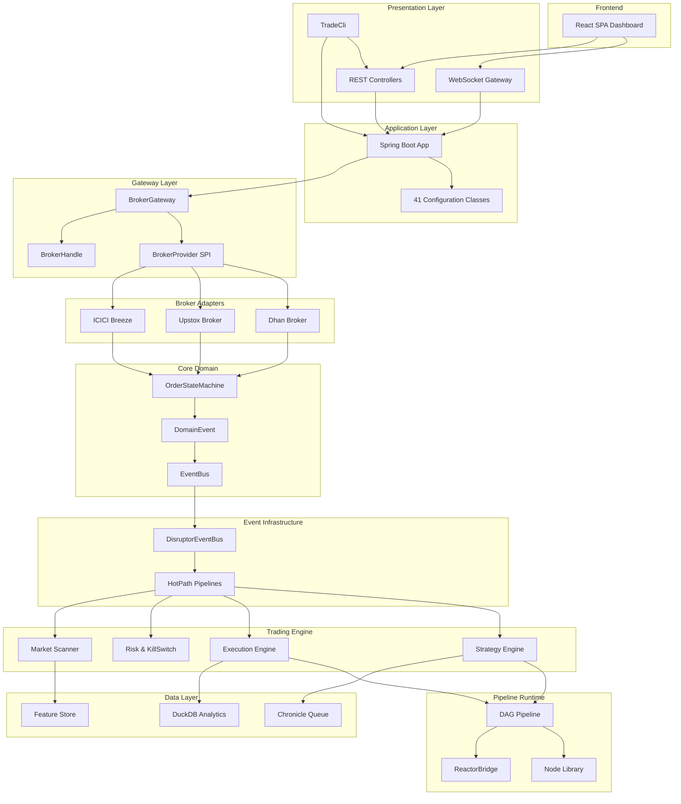
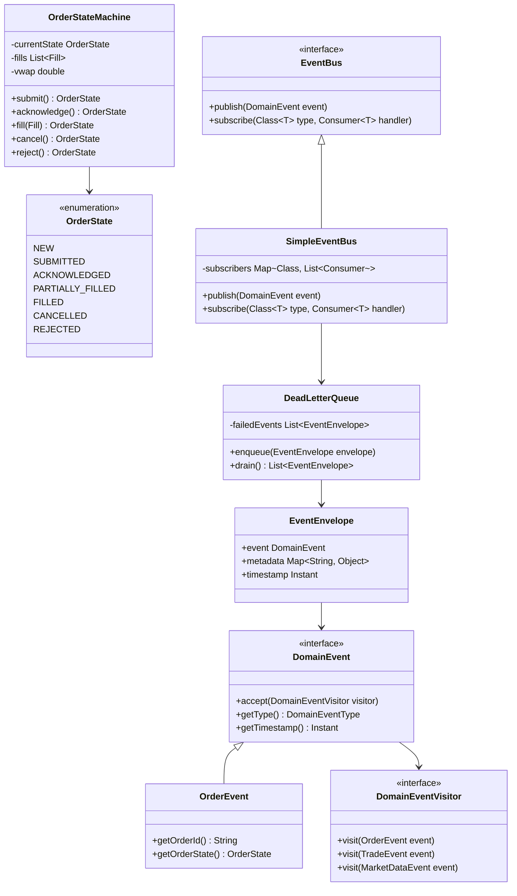
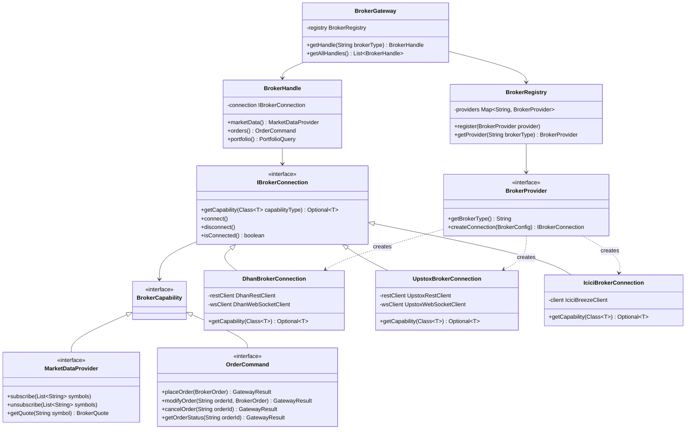
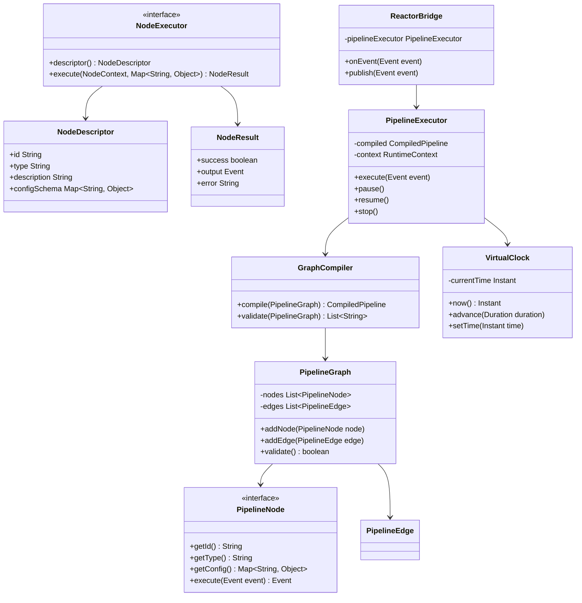
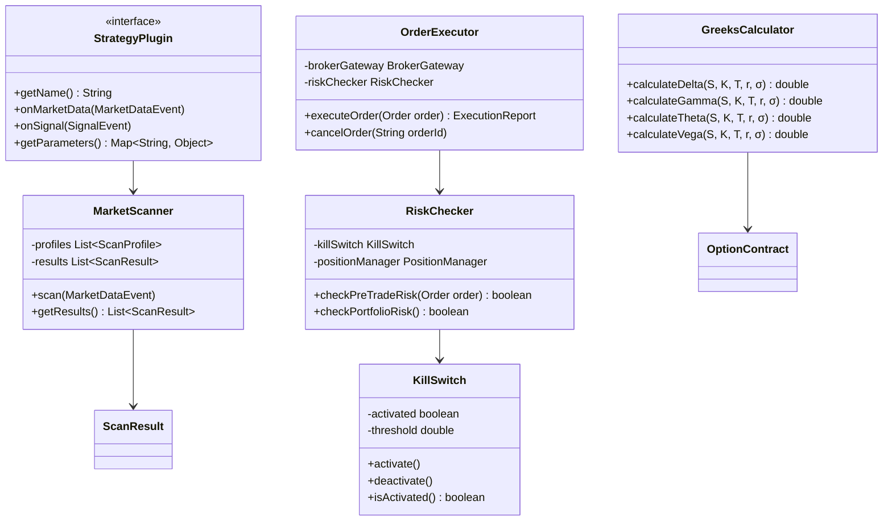
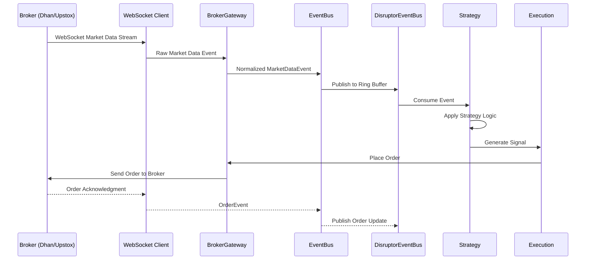
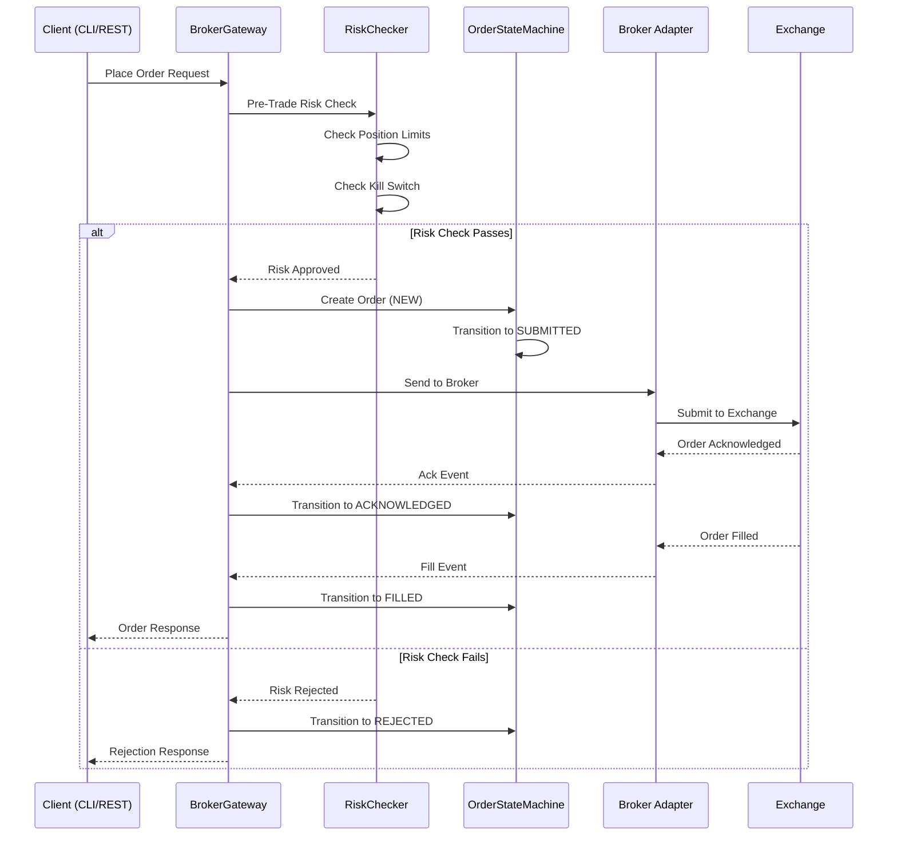
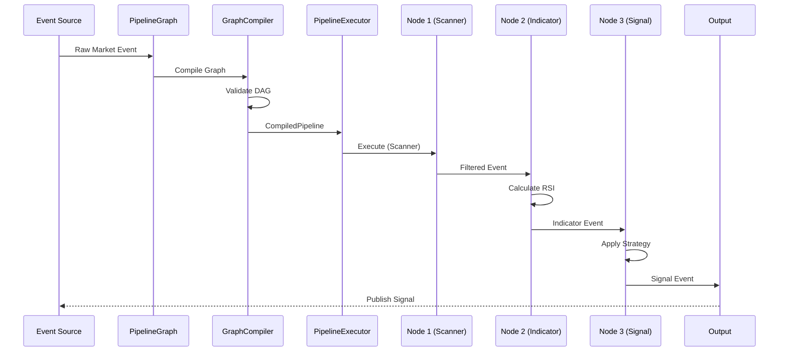
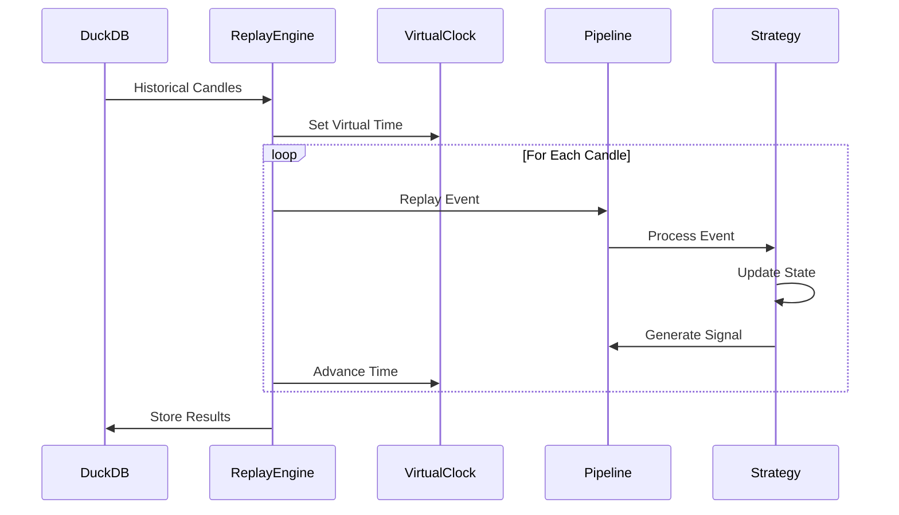

# Trade-J — Complete Project Documentation

**Version**: 0.1.0-SNAPSHOT  
**Java Version**: 21  
**Framework**: Spring Boot 3.4.13  
**Build Tool**: Gradle  
**Last Updated**: June 9, 2026

---

## Table of Contents

1. [Project Overview](#1-project-overview)
2. [System Architecture](#2-system-architecture)
3. [Component Diagram](#3-component-diagram)
4. [Module Structure & File Hierarchy](#4-module-structure--file-hierarchy)
5. [Class Diagrams](#5-class-diagrams)
6. [Flow Diagrams](#6-flow-diagrams)
7. [Test Pyramid](#7-test-pyramid)
8. [Technology Stack](#8-technology-stack)
9. [Runtime Modes](#9-runtime-modes)
10. [Development & Build Commands](#10-development--build-commands)

---

## 1. Project Overview

Trade-J is a **Java 21 algorithmic trading platform** providing:
- **Live market data** ingestion via WebSocket from multiple Indian brokers (Dhan, Upstox, ICICI)
- **Order Management System (OMS)** with deterministic state machines
- **Risk management** with pre-trade checks and kill switch
- **Strategy plugins** for algorithmic trading
- **Broker adapters** with capability-based SPI
- **Event-driven pipeline** architecture using LMAX Disruptor
- **Historical data** analytics with DuckDB
- **Real-time analytics** for options, scanners, and portfolio

### Key Capabilities
- Multi-broker integration (Dhan, Upstox, ICICI Breeze)
- NSE, BSE, MCX exchange support (Equity, F&O, Commodities)
- Real-time WebSocket market feeds
- Historical data replay & backtesting
- Options chain analytics with Greeks
- Institutional-grade market scanning
- Pipeline-based strategy execution

---

## 2. System Architecture

### 2.1 Layered Architecture

```
┌─────────────────────────────────────────────────────────────────┐
│                   Presentation Layer                             │
│  ┌──────────────┐  ┌──────────────┐  ┌───────────────────────┐ │
│  │   REST API   │  │  WebSocket   │  │        CLI            │ │
│  │ Controllers  │  │   Gateway    │  │   (TradeCli)          │ │
│  └──────────────┘  └──────────────┘  └───────────────────────┘ │
├─────────────────────────────────────────────────────────────────┤
│                   Application Layer                              │
│  ┌──────────────────────────────────────────────────────────┐  │
│  │  Spring Boot App (41 Configuration Classes)              │  │
│  │  • BrokerConfiguration  • DataConfiguration              │  │
│  │  • TradingConfiguration • PipelineConfiguration          │  │
│  │  • AdminConfiguration   • WebConfiguration               │  │
│  └──────────────────────────────────────────────────────────┘  │
├─────────────────────────────────────────────────────────────────┤
│                   Composition Layer                              │
│  ┌──────────────────────────────────────────────────────────┐  │
│  │  DI-Free Composition Roots (No Spring)                   │  │
│  │  • FullComposition → BrokerComposition                   │  │
│  │  • DataComposition → ExecutionComposition                │  │
│  │  • PipelineComposition → ClockComposition                │  │
│  └──────────────────────────────────────────────────────────┘  │
├─────────────────────────────────────────────────────────────────┤
│                   Gateway Layer                                  │
│  ┌──────────────────────────────────────────────────────────┐  │
│  │  BrokerGateway → BrokerHandle (Fluent API)               │  │
│  │  • BrokerProvider (SPI) • BrokerRegistry                 │  │
│  │  • GatewayResult • GatewayEventBridge                    │  │
│  └──────────────────────────────────────────────────────────┘  │
├─────────────────────────────────────────────────────────────────┤
│                   Pipeline Runtime                               │
│  ┌─────────────────────┐  ┌────────────────────────────────┐  │
│  │  DAG Pipeline       │  │  ReactorBridge                 │  │
│  │  • Node Registry    │  │  • VirtualClock                │  │
│  │  • Graph Compiler   │  │  • State Management            │  │
│  └─────────────────────┘  └────────────────────────────────┘  │
├─────────────────────────────────────────────────────────────────┤
│                   Event Infrastructure                           │
│  ┌─────────────────────┐  ┌────────────────────────────────┐  │
│  │  DisruptorEventBus  │  │  HotPath Pipelines             │  │
│  │  • Ring Buffer      │  │  • SimpleEventBus              │  │
│  │  • Wait Strategies  │  │  • Event Routing               │  │
│  └─────────────────────┘  └────────────────────────────────┘  │
├─────────────────────────────────────────────────────────────────┤
│                   Trading Engine                                 │
│  ┌──────────────┐  ┌──────────────┐  ┌──────────────────────┐ │
│  │  Strategy    │  │  Execution   │  │  Risk & Scanner      │ │
│  │  • Plugins   │  │  • OMS       │  │  • KillSwitch        │ │
│  │  • Sandbox   │  │  • Orders    │  │  • Market Scanner    │ │
│  └──────────────┘  └──────────────┘  └──────────────────────┘ │
├─────────────────────────────────────────────────────────────────┤
│                   Core Domain                                    │
│  ┌──────────────────────────────────────────────────────────┐  │
│  │  Domain Entities • Value Objects • Events                │  │
│  │  • OrderStateMachine • DomainEvent                       │  │
│  │  • EventBus (SimpleEventBus) • Ports                     │  │
│  └──────────────────────────────────────────────────────────┘  │
├─────────────────────────────────────────────────────────────────┤
│                   Broker Infrastructure                          │
│  ┌──────────────┐  ┌──────────────┐  ┌──────────────────────┐ │
│  │  Dhan        │  │  Upstox      │  │  ICICI Breeze        │ │
│  │  • REST API  │  │  • REST API  │  │  • REST API          │ │
│  │  • WebSocket │  │  • WebSocket │  │  • WebSocket         │ │
│  │  • Reactive  │  │  • Sandbox   │  │  • Sandbox           │ │
│  └──────────────┘  └──────────────┘  └──────────────────────┘ │
├─────────────────────────────────────────────────────────────────┤
│                   Data & Persistence                             │
│  ┌──────────────┐  ┌──────────────┐  ┌──────────────────────┐ │
│  │  DuckDB      │  │  Chronicle   │  │  Feature Store       │ │
│  │  Analytics   │  │  Queue       │  │  (Time-Series)       │ │
│  └──────────────┘  └──────────────┘  └──────────────────────┘ │
└─────────────────────────────────────────────────────────────────┘
```

### 2.2 Architecture Principles

- **Hexagonal Architecture**: Core domain isolated with ports & adapters
- **Event-Driven**: DomainEvent visitor pattern for type-safe event processing
- **Deterministic OMS**: Strict state machine (NEW → SUBMITTED → FILLED)
- **Capability-Based SPI**: Brokers expose only supported capabilities
- **DI-Free Composition**: Manual wiring without Spring for testability
- **Modular Monolith**: Strict module boundaries enforced by ArchUnit

---

## 3. Component Diagram



---

## 4. Module Structure & File Hierarchy

### 4.1 Gradle Modules (27 Modules)

> **Note:** Composition module and trade-node-library deleted in P3 simplification (June 2026).

| Module | Gradle ID | Responsibility | Package |
|--------|-----------|---------------|---------|
| Core Domain | `core` | Domain events, OMS, ports, value objects | `com.tradej.core` |
| Pipeline Core | `pipeline-core` | DAG pipeline, graph, clock, state | `com.tradej.pipeline` |
| Broker API | `broker-api` | IBrokerConnection SPI, capabilities | `com.tradej.broker.api` |
| Broker Core | `broker-core` | Resilience, circuit breakers, routing | `com.tradej.broker.core` |
| Broker Dhan | `broker-dhan` | Dhan REST & WebSocket integration | `com.tradej.broker.dhan` |
| Broker Upstox | `broker-upstox` | Upstox REST & WebSocket integration | `com.tradej.broker.upstox` |
| Broker ICICI | `broker-icici` | ICICI Breeze integration | `com.tradej.broker.icici` |
| Broker Gateway | `broker-gateway` | Unified broker facade, SPI discovery | `com.tradej.brokergateway` |
| Runtime Disruptor | `runtime-disruptor` | LMAX Disruptor event bus | `com.tradej.disruptor` |
| Runtime HotPath | `runtime-hotpath` | Low-latency event pipelines | `com.tradej.hotpath` |
| Trading Strategy | `trading-strategy` | Strategy plugins, sandbox | `com.tradej.strategy` |
| Trading Execution | `trading-execution` | Order execution, lifecycle | `com.tradej.execution` |
| Trading Scanner | `trading-scanner` | Market scanning engine | `com.tradej.scanner` |
| Trading Institutional Scanner | `trading-institutional-scanner` | Institutional-grade scanning | `com.tradej.institutional` |
| Trading Indicators | `trading-indicators` | Technical indicators (RSI, VWAP, etc.) | `com.tradej.indicators` |
| Trading Simulation | `trading-simulation` | Backtesting simulation broker | `com.tradej.simulation` |
| Trading Options Analytics | `trading-options-analytics` | Options pricing, Greeks | `com.tradej.options` |
| Data Persistence | `data-persistence` | Event sourcing, read models | `com.tradej.persistence` |
| Data Feature Store | `data-feature-store` | Time-series feature persistence | `com.tradej.featurestore` |
| Data Historical Ingest | `data-historical-ingest` | Historical data ingestion | `com.tradej.historical` |
| Data Analytics | `data-analytics` | DuckDB analytics engine | `com.tradej.analytics` |
| Trade Pipeline Platform | `trade-pipeline-platform` | Pipeline composition | `com.tradej.platform` |
| Pipeline Runtime | `pipeline-runtime` | Pipeline execution engine | `com.tradej.pipelineruntime` |
| Trade Node Library | `trade-node-library` | ✅ DELETED (P3 simplification) | — |
| Trade Analytics | `trade-analytics` | Trade performance analytics | `com.tradej.pipeline.analytics` |
| Replay Engine | `replay-engine` | Historical replay engine | `com.tradej.replay` |
| Composition | `composition` | ✅ DELETED (P3 simplification; configs → core/broker-gateway/app) | — |
| App | `app` | Spring Boot application | `com.tradej.app` |
| Gateway | `gateway` | WebSocket bridge to frontend | `com.tradej.gateway` |
| CLI | `cli` | Operator CLI tool | `com.tradej.cli` |
| Architecture Test | `architecture-test` | ArchUnit boundary tests | `com.tradej.architecture` |

### 4.2 Leaf-Level File Hierarchy

```
Trade_J/
├── core/
│   └── src/main/java/com/tradej/core/
│       ├── domain/
│       │   ├── event/
│       │   │   ├── DomainEvent.java
│       │   │   ├── DomainEventVisitor.java
│       │   │   ├── DomainEventType.java
│       │   │   └── EventEnvelope.java
│       │   ├── model/
│       │   │   ├── Order.java
│       │   │   ├── Trade.java
│       │   │   ├── Position.java
│       │   │   └── Instrument.java
│       │   ├── value/
│       │   │   ├── Side.java
│       │   │   ├── OrderType.java
│       │   │   ├── InstrumentType.java
│       │   │   ├── PriceMath.java
│       │   │   └── ExchangeSegment.java
│       │   └── oms/
│       │       ├── OrderStateMachine.java
│       │       ├── OrderState.java
│       │       └── OrderEvent.java
│       ├── port/
│       │   ├── EventBus.java
│       │   ├── MarketDataIngressPort.java
│       │   ├── OrderCommandPort.java
│       │   └── EventWriteAheadLog.java
│       ├── infrastructure/
│       │   └── SimpleEventBus.java
│       ├── routing/
│       │   └── EventRouter.java
│       ├── service/
│       │   ├── OrderService.java
│       │   └── PositionService.java
│       ├── support/
│       │   └── DeadLetterQueue.java
│       └── tracing/
│           └── EventTracer.java
│
├── broker/
│   ├── api/
│   │   └── src/main/java/com/tradej/broker/api/
│   │       ├── IBrokerConnection.java
│   │       ├── BrokerCapability.java
│   │       ├── capability/
│   │       │   ├── MarketDataProvider.java
│   │       │   ├── OrderCommand.java
│   │       │   ├── PortfolioQuery.java
│   │       │   └── HistoricalDataProvider.java
│   │       └── model/
│   │           ├── BrokerOrder.java
│   │           ├── BrokerQuote.java
│   │           └── ExchangeSegment.java
│   │
│   ├── core/
│   │   └── src/main/java/com/tradej/broker/core/
│   │       ├── resilience/
│   │       │   ├── CircuitBreaker.java
│   │       │   ├── RateLimiter.java
│   │       │   └── RetryPolicy.java
│   │       └── routing/
│   │           ├── LoadBalancer.java
│   │           └── BrokerRouter.java
│   │
│   ├── dhan/
│   │   └── src/main/java/com/tradej/broker/dhan/
│   │       ├── DhanBrokerConnection.java
│   │       ├── DhanBrokerProvider.java
│   │       ├── client/
│   │       │   ├── DhanRestClient.java
│   │       │   └── DhanWebSocketClient.java
│   │       ├── reactive/
│   │       │   ├── DhanReactiveClient.java
│   │       │   └── DhanReactiveConnectionSettings.java
│   │       ├── model/
│   │       │   ├── DhanOrder.java
│   │       │   └── DhanInstrument.java
│   │       └── usecase/
│   │           ├── DhanPlaceOrder.java
│   │           └── DhanGetMarketData.java
│   │
│   ├── upstox/
│   │   └── src/main/java/com/tradej/broker/upstox/
│   │       ├── UpstoxBrokerConnection.java
│   │       ├── UpstoxBrokerProvider.java
│   │       ├── client/
│   │       │   ├── UpstoxRestClient.java
│   │       │   └── UpstoxWebSocketClient.java
│   │       └── model/
│   │           └── UpstoxInstrument.java
│   │
│   └── icici/
│       └── src/main/java/com/tradej/broker/icici/
│           ├── IciciBrokerConnection.java
│           ├── IciciBrokerProvider.java
│           └── client/
│               └── IciciBreezeClient.java
│
├── broker-gateway/
│   └── src/main/java/com/tradej/brokergateway/
│       ├── BrokerGateway.java
│       ├── BrokerHandle.java
│       ├── BrokerProvider.java
│       ├── BrokerRegistry.java
│       ├── GatewayResult.java
│       └── GatewayEventBridge.java
│
├── runtime/
│   ├── disruptor/
│   │   └── src/main/java/com/tradej/disruptor/
│   │       ├── DisruptorEventBus.java
│   │       ├── DisruptorConfiguration.java
│   │       └── WaitStrategyFactory.java
│   │
│   └── hotpath/
│       └── src/main/java/com/tradej/hotpath/
│           ├── HotPathPipeline.java
│           ├── HotPathEvent.java
│           └── PipelineStage.java
│
├── trading/
│   ├── strategy/
│   │   └── src/main/java/com/tradej/strategy/
│   │       ├── StrategyPlugin.java
│   │       ├── StrategyContext.java
│   │       └── GraphStrategySandbox.java
│   │
│   ├── execution/
│   │   └── src/main/java/com/tradej/execution/
│   │       ├── OrderExecutor.java
│   │       ├── ExecutionReport.java
│   │       └── OrderLifecycle.java
│   │
│   ├── scanner/
│   │   └── src/main/java/com/tradej/scanner/
│   │       ├── MarketScanner.java
│   │       ├── ScanProfile.java
│   │       └── ScanResult.java
│   │
│   ├── institutional-scanner/
│   │   └── src/main/java/com/tradej/institutional/
│   │       ├── SectorRanker.java
│   │       ├── CandidateSelector.java
│   │       └── FeaturePipeline.java
│   │
│   ├── indicators/
│   │   └── src/main/java/com/tradej/indicators/
│   │       ├── RSI.java
│   │       ├── VWAP.java
│   │       ├── EMA.java
│   │       └── CandleAggregator.java
│   │
│   ├── simulation/
│   │   └── src/main/java/com/tradej/simulation/
│   │       ├── SimulationBroker.java
│   │       └── BacktestEngine.java
│   │
│   └── options-analytics/
│       └── src/main/java/com/tradej/options/
│           ├── OptionsChain.java
│           ├── GreeksCalculator.java
│           └── OptionContract.java
│
├── data/
│   ├── persistence/
│   │   └── src/main/java/com/tradej/persistence/
│   │       ├── EventStore.java
│   │       ├── ReadModelStore.java
│   │       └── ChronicleEventLog.java
│   │
│   ├── feature-store/
│   │   └── src/main/java/com/tradej/featurestore/
│   │       ├── FeatureStore.java
│   │       └── TimeSeriesStore.java
│   │
│   ├── historical-ingest/
│   │   └── src/main/java/com/tradej/historical/
│   │       ├── HistoricalIngestService.java
│   │       └── CandleDownloader.java
│   │
│   └── analytics/
│       └── src/main/java/com/tradej/analytics/
│           ├── DuckDbAnalyticsEngine.java
│           ├── QueryExecutor.java
│           └── AnalyticsSchema.java
│
├── pipeline/
│   ├── core/
│   │   └── src/main/java/com/tradej/pipeline/
│   │       ├── graph/
│   │       │   ├── PipelineGraph.java
│   │       │   ├── PipelineNode.java
│   │       │   └── PipelineEdge.java
│   │       ├── clock/
│   │       │   ├── VirtualClock.java
│   │       │   └── Clock.java
│   │       ├── compiler/
│   │       │   └── GraphCompiler.java
│   │       ├── state/
│   │       │   └── PipelineStateManager.java
│   │       ├── registry/
│   │       │   └── NodeRegistry.java
│   │       └── reactor/
│   │           └── ReactorBridge.java
│   │
│   ├── runtime/
│   │   └── src/main/java/com/tradej/pipelineruntime/
│   │       ├── PipelineExecutor.java
│   │       └── RuntimeContext.java
│   │
│   ├── platform/trade-pipeline-platform/
│   │   └── src/main/java/com/tradej/platform/
│   │       ├── PlatformConfiguration.java
│   │       └── PlatformBootstrap.java
│   │
│   └── analytics/trade-analytics/
│       └── src/main/java/com/tradej/pipeline/analytics/
│           ├── TradeRecord.java
│           ├── DrawdownReport.java
│           └── ReturnDistribution.java
│
├── nodes/trade-node-library/
│   └── src/main/java/com/tradej/node/
│       ├── NodeExecutor.java
│       ├── NodeDescriptor.java
│       ├── NodeResult.java
│       ├── NodeAdapterFactory.java
│       ├── HistoricalDataNode.java
│       ├── FeatureNode.java
│       ├── ScannerNode.java
│       └── OutputNode.java
│
├── replay/engine/
│   └── src/main/java/com/tradej/replay/
│       ├── ReplayEngine.java
│       ├── ReplayController.java
│       └── ReplayState.java
│
├── composition/
│   └── src/main/java/com/tradej/composition/
│       ├── FullComposition.java
│       ├── BrokerComposition.java
│       ├── DataComposition.java
│       ├── ExecutionComposition.java
│       ├── PipelineComposition.java
│       ├── ClockComposition.java
│       ├── BrokerProfile.java
│       └── ConfigLoader.java
│
├── app/
│   └── src/main/java/com/tradej/app/
│       ├── TradingApplication.java
│       ├── config/
│       │   ├── BrokerConfiguration.java
│       │   ├── DataConfiguration.java
│       │   ├── TradingConfiguration.java
│       │   ├── PipelineConfiguration.java
│       │   ├── AdminConfiguration.java
│       │   ├── WebConfiguration.java
│       │   └── ObservabilityConfiguration.java
│       ├── api/
│       │   ├── AnalyticsController.java
│       │   ├── OrderController.java
│       │   ├── MarketDataController.java
│       │   ├── ScanController.java
│       │   ├── OptionsAnalyticsController.java
│       │   ├── BacktestController.java
│       │   ├── PipelineController.java
│       │   └── ReplayStudioController.java
│       ├── admin/
│       │   ├── AdminController.java
│       │   ├── HistoricalDownloadController.java
│       │   └── ReconciliationController.java
│       ├── health/
│       │   ├── PlatformHealthIndicator.java
│       │   ├── BrokerHealthIndicator.java
│       │   ├── MarketDataHealthIndicator.java
│       │   └── AlertManager.java
│       ├── scanner/
│       │   ├── OptionScanService.java
│       │   └── RuntimeSubscriptionManager.java
│       ├── pipeline/
│       │   ├── PipelineConfiguration.java
│       │   └── reactor/
│       │       ├── ReactorColdPathConsumer.java
│       │       └── ReactorColdPathRegistry.java
│       └── metrics/
│           └── MetricsLoggerHarness.java
│
├── gateway/
│   └── src/main/java/com/tradej/gateway/
│       ├── GatewayEventBridge.java
│       ├── GatewayTopicRouter.java
│       ├── GatewayWebSocketHandler.java
│       └── GatewayBinaryCodec.java
│
├── cli/
│   └── src/main/java/com/tradej/cli/
│       ├── TradeCli.java
│       ├── commands/
│       │   ├── OrderCommand.java
│       │   ├── ScanCommand.java
│       │   └── MarketDataCommand.java
│       └── output/
│           └── ConsoleOutput.java
│
├── architecture-test/
│   └── src/test/java/com/tradej/architecture/
│       ├── ModulithArchitectureTest.java
│       ├── CoreModuleBoundaryTest.java
│       ├── BrokerModuleBoundaryTest.java
│       ├── SpringFreeZoneTest.java
│       ├── DesignPatternEnforcementTest.java
│       ├── LayerDependencyTest.java
│       └── ModuleDependencyGraphTest.java
│
├── research/ (optional, enabled with -Presearch)
│   ├── core/
│   │   └── src/main/java/com/tradej/research/
│   │       ├── core/
│   │       │   ├── ResearchSession.java
│   │       │   ├── StrategyConfig.java
│   │       │   └── RunResult.java
│   │       └── lab/
│   │           ├── StrategyLabService.java
│   │           ├── ScannerLabService.java
│   │           └── DuckDbResearchStore.java
│   ├── api/
│   │   └── src/main/java/com/tradej/research/api/
│   │       ├── ReplayApiController.java
│   │       └── AnalyticsController.java
│   ├── lab/
│   │   └── src/main/java/com/tradej/research/lab/
│   │       ├── ResearchExecutionEngine.java
│   │       └── BacktestRunner.java
│   └── mcp-server/
│       └── src/main/java/com/tradej/mcp/
│           └── McpServerController.java
│
├── frontend/
│   └── src/
│       ├── main.tsx
│       ├── App.tsx
│       ├── pages/
│       │   ├── Dashboard.tsx
│       │   ├── PipelineEditor.tsx
│       │   └── ScannerBuilder.tsx
│       ├── components/
│       │   ├── nodes/
│       │   ├── edges/
│       │   └── shared/
│       ├── stores/
│       │   ├── graphStore.ts
│       │   └── runtimeStore.ts
│       └── services/
│           ├── pipelineApi.ts
│           └── sseClient.ts
│
├── config/
│   ├── dhan-sandbox.properties.example
│   ├── dhan-local.properties.example
│   ├── upstox-sandbox.properties.example
│   ├── upstox-live.properties.example
│   ├── icici-local.properties.example
│   └── indices/
│       └── nifty50.json
│
└── docs/
    ├── ARCHITECTURE_ACTUAL.md
    ├── BACKLOG.md
    ├── API_DOCUMENTATION.md
    └── visuals/
        └── Trade-J-Architecture-Visual.html
```

---

## 5. Class Diagrams

### 5.1 Core Domain Class Diagram



### 5.2 Broker Integration Class Diagram



### 5.3 Pipeline Runtime Class Diagram



### 5.4 Trading Engine Class Diagram



---

## 6. Flow Diagrams

### 6.1 Market Data Flow



### 6.2 Order Lifecycle Flow



### 6.3 Pipeline Execution Flow



### 6.4 Historical Data Replay Flow



---

## 7. Test Pyramid

### 7.1 Test Pyramid Structure

```
                    ┌─────────────────────┐
                    │   E2E / Regression  │  ~50 tests
                    │   (Integration)     │  Tags: runtime-e2e, cross-layer
                    ├─────────────────────┤
                    │  Broker Integration │  ~150 tests
                    │  (REST, WS, Order)  │  Tags: broker-rest, broker-ws, broker-order
                    ├─────────────────────┤
                    │   Component Tests   │  ~200 tests
                    │   (Module-level)    │  Tag: component
                    ├─────────────────────┤
                    │   Architecture      │  ~7 test classes
                    │   (ArchUnit)        │  Tag: architecture
                    ├─────────────────────┤
              ┌─────┴─────────────────────┴─────┐
              │        Unit Tests (~1000+)       │
              │   Tag: unit (default test task)  │
              └──────────────────────────────────┘
```

### 7.2 Test Categories & Gradle Tasks

| Test Type | Gradle Task | JUnit Tag | Count | Purpose |
|-----------|-------------|-----------|-------|---------|
| **Unit Tests** | `./gradlew test` | (default, excludes integration) | ~1000+ | Fast, isolated unit tests |
| **Unit Tests (explicit)** | `./gradlew unitTest` | `unit` | Subset | Explicit unit tag |
| **Component Tests** | `./gradlew componentTest` | `component` | ~200 | Module-level integration |
| **Broker REST Tests** | `./gradlew brokerRestTest` | `broker-rest` | ~80 | Live broker REST API |
| **Broker WebSocket Tests** | `./gradlew brokerWsTest` | `broker-ws` | ~40 | Live WebSocket feeds |
| **Broker Order Tests** | `./gradlew brokerOrderTest` | `broker-order` | ~30 | Live order placement |
| **Runtime E2E Tests** | `./gradlew runtimeE2eTest` | `runtime-e2e` | ~20 | End-to-end runtime |
| **Cross-Layer Tests** | `./gradlew crossLayerRegressionTest` | `cross-layer` | ~30 | OMS + execution integration |
| **Architecture Tests** | `./gradlew architectureTest` | `architecture` | 7 classes | Module boundaries, patterns |
| **Regression Preflight** | `./gradlew regressionPreflightTest` | `regression-preflight` | ~10 | Credential validation |
| **Broker Parity** | `./gradlew brokerParityTest` | (composite) | All broker tests | Full Tradehull parity suite |
| **Full Regression** | `./gradlew fullRegressionTest` | (composite) | ~1500+ | Complete test suite |

### 7.3 Test Execution Order

```
fullRegressionTest
├── unitTest (all modules)
├── componentTest (all modules)
├── regressionPreflightTest
├── brokerRestTest
├── brokerWsTest
├── brokerOrderTest
├── runtimeE2eTest
└── crossLayerRegressionTest
```

### 7.4 Architecture Tests (ArchUnit)

The `architecture-test` module enforces:

1. **Core Module Boundary**: `core` must not depend on any outer module
2. **Broker Module Boundaries**: Broker adapters only depend on `core`, `broker-api`, `broker-core`
3. **Spring-Free Zones**: Core, pipeline, and broker modules must not use Spring
4. **Design Pattern Enforcement**: Mandatory use of Command, Strategy, State, Specification patterns
5. **Layer Dependencies**: Strict dependency direction (inner → outer only)
6. **Module Dependency Graph**: No circular dependencies
7. **SPI Contract**: Broker providers must implement `BrokerProvider` interface

### 7.5 Coverage Reporting

```bash
# Generate coverage for all modules
./gradlew coverageReportAll

# Audit coverage (fails if reports missing)
./gradlew coverageAuditAll

# Coverage audit summary
./gradlew coverageAuditSummary
```

**Output**: `build/reports/coverage-audit/`
- `uncovered-classes.csv`
- `uncovered-methods.csv`
- `uncovered-lines.csv`
- `zero-instruction-classes.csv`
- `zero-branch-classes.csv`
- `summary.txt`

---

## 8. Technology Stack

### 8.1 Core Technologies

| Category | Technology | Version |
|----------|-----------|---------|
| **Language** | Java | 21 |
| **Framework** | Spring Boot | 3.4.13 |
| **Build Tool** | Gradle | 8.x |
| **Testing** | JUnit 5 | 5.12.2 |
| **Mocking** | Mockito | 5.14.2 |
| **Architecture Testing** | ArchUnit | 1.4.0 |
| **Static Analysis** | SpotBugs | 4.9.3 |
| **Code Style** | Checkstyle | 13.4.2 |
| **Coverage** | JaCoCo | (Gradle plugin) |

### 8.2 Event & Data Infrastructure

| Technology | Purpose |
|-----------|---------|
| **LMAX Disruptor 4.0.0** | Low-latency event bus |
| **Chronicle Queue 2026.2** | Event sourcing, write-ahead log |
| **DuckDB 1.5.3.0** | Analytical queries, historical data |
| **Caffeine 3.2.4** | High-performance caching |

### 8.3 Frontend

| Technology | Purpose |
|-----------|---------|
| **React** | SPA dashboard |
| **TypeScript** | Type-safe frontend |
| **Vite** | Build tool |
| **Tailwind CSS** | Styling |
| **React Flow** | Pipeline visualization |

### 8.4 Broker Integrations

| Broker | API Type | Exchanges |
|--------|----------|-----------|
| **Dhan** | REST + WebSocket + Reactive | NSE, BSE, MCX |
| **Upstox** | REST + WebSocket | NSE, BSE |
| **ICICI Breeze** | REST + WebSocket | NSE, BSE |

### 8.5 Observability

- **Micrometer** metrics
- **Prometheus** integration
- **Health Indicators** (Spring Boot Actuator)
- **Alert Manager** (Slack, PagerDuty, Webhook)

---

## 9. Runtime Modes

### 9.1 Supported Modes

| Mode | Description | Use Case |
|------|-------------|----------|
| **LIVE** | Real-time market data & order execution | Production trading |
| **REPLAY** | Historical data replay with virtual clock | Strategy testing |
| **BACKTEST** | Full historical simulation | Backtesting strategies |

### 9.2 Spring Profiles

| Profile | Description | Command |
|---------|-------------|---------|
| `dev` | Default (Dhan sandbox) | `./gradlew :app:bootRun` |
| `dev-live` | Live market data | `--args='--spring.profiles.active=dev-live'` |
| `upstox-analytics` | Upstox REST only | `--args='--spring.profiles.active=upstox-analytics'` |

---

## 10. Development & Build Commands

### 10.1 Build Commands

```bash
# Clean build
./gradlew clean build

# Build without tests
./gradlew build -x test

# Build with specific module
./gradlew :broker-dhan:build

# Run specific module tests
./gradlew :core:test
```

### 10.2 Test Commands

```bash
# Run unit tests only
./gradlew unitTest

# Run component tests only
./gradlew componentTest

# Run broker REST tests (requires credentials)
./gradlew brokerRestTest

# Run broker WebSocket tests
./gradlew brokerWsTest

# Run broker order tests (destructive)
./gradlew brokerOrderTest

# Run full regression
./gradlew fullRegressionTest

# Run broker parity suite
./gradlew brokerParityTest

# Run architecture tests
./gradlew architectureTest
```

### 10.3 Static Analysis

```bash
# Run SpotBugs
./gradlew spotbugsMain spotbugsTest

# Run Checkstyle
./gradlew checkstyleMain checkstyleTest

# Skip static analysis in build
./gradlew build -x checkstyleMain -x checkstyleTest -x spotbugsMain -x spotbugsTest
```

### 10.4 Coverage

```bash
# Generate coverage report
./gradlew coverageReport

# Generate coverage for all modules
./gradlew coverageReportAll

# Audit coverage
./gradlew coverageAuditAll

# View coverage summary
./gradlew coverageAuditSummary
```

### 10.5 Application Startup

```bash
# Default (Dhan sandbox)
./gradlew :app:bootRun

# Live market data
./gradlew :app:bootRun --args='--spring.profiles.active=dev-live'

# Upstox analytics-only
./gradlew :app:bootRun --args='--spring.profiles.active=upstox-analytics'

# With research modules
./gradlew :app:bootRun -Presearch
```

### 10.6 CLI Tool

```bash
# Using tradej script
./scripts/tradej <command>

# Available commands
./scripts/tradej orders list
./scripts/tradej scan run
./scripts/tradej marketdata subscribe NSE:NIFTY
```

---

## Appendix A: Module Dependency Graph

```
app
├── gateway
├── cli
├── composition
│   ├── broker-dhan
│   ├── broker-upstox
│   ├── broker-icici
│   ├── broker-core
│   ├── broker-api
│   ├── data-persistence
│   ├── data-feature-store
│   ├── data-historical-ingest
│   ├── data-analytics
│   ├── trading-strategy
│   ├── trading-execution
│   ├── trading-scanner
│   └── core
├── broker-gateway → broker-api
├── trading-execution → core, broker-api, trading-strategy, data-persistence
├── trading-strategy → core
├── data-persistence → core, pipeline-core
├── pipeline-core → core
├── runtime-disruptor → core
└── core (no dependencies)
```

## Appendix B: Key Design Patterns

| Pattern | Implementation | Location |
|---------|---------------|----------|
| **Hexagonal Architecture** | Ports & Adapters | `core/port/` |
| **Event Sourcing** | DomainEvent + Chronicle Queue | `core/domain/event/`, `data/persistence/` |
| **State Machine** | OrderStateMachine | `core/domain/oms/` |
| **Strategy Pattern** | StrategyPlugin | `trading/strategy/` |
| **Command Pattern** | OrderCommand | `broker/api/capability/` |
| **SPI Pattern** | BrokerProvider | `broker-gateway/` |
| **Chain of Responsibility** | EventRouter | `core/routing/` |
| **Specification Pattern** | ScanProfile | `trading/scanner/` |
| **Adapter Pattern** | NodeAdapterFactory | `trading/strategy/` |
| **Visitor Pattern** | DomainEventVisitor | `core/domain/event/` |
| **Observer Pattern** | EventBus | `core/infrastructure/` |
| **Circuit Breaker** | CircuitBreaker | `broker/core/resilience/` |

## Appendix C: Exchange Support Matrix

| Exchange | Segment | Instruments | Brokers |
|----------|---------|-------------|---------|
| **NSE** | Equity | Stocks, ETFs | Dhan, Upstox, ICICI |
| **NSE** | F&O | Index Options, Stock Options | Dhan, Upstox |
| **BSE** | Equity | Stocks | Dhan, Upstox, ICICI |
| **MCX** | Commodities | Futures, Options | Dhan |

## Appendix D: Configuration Files

| File | Purpose | Example |
|------|---------|---------|
| `config/dhan-sandbox.properties` | Dhan sandbox credentials | `dhan-sandbox.properties.example` |
| `config/dhan-local.properties` | Dhan live credentials | `dhan-local.properties.example` |
| `config/upstox-sandbox.properties` | Upstox sandbox | `upstox-sandbox.properties.example` |
| `config/upstox-live.properties` | Upstox live | `upstox-live.properties.example` |
| `config/icici-local.properties` | ICICI Breeze | `icici-local.properties.example` |
| `app/src/main/resources/application.yml` | Spring Boot config | - |

---

**Document Generated**: June 9, 2026  
**Total Java Files**: 1,585+  
**Test Files**: 523  
**Modules**: 30 (34 with research)  
**Lines of Code**: ~150,000+ (estimated)
