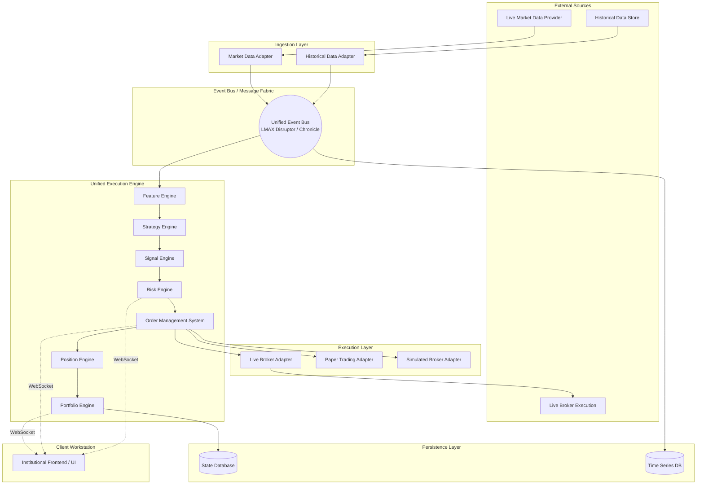
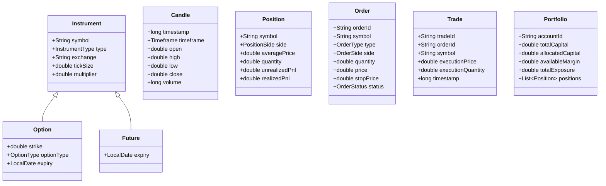

# Trade-J Institutional Algorithmic Trading Platform Architecture

## Executive Summary
Trade-J is a production-grade, institutional algorithmic trading platform designed for reliability, scalability, correctness, and maintainability. It utilizes a unified execution engine, Hexagonal Architecture, Event-Driven Design, and strict separation of concerns to support Live Trading, Paper Trading, Replay, and Backtesting without duplicating strategy or core engine logic.

---

## 1. Complete Architecture Diagram



---

## 2. Domain Model Design

### Canonical Models



---

## 3. Backend Module Hierarchy

The backend is built using Hexagonal Architecture (Ports and Adapters). Core domain logic has NO dependencies on external frameworks or infrastructure.

```text
backend/
├── trade-core/               # Pure domain models (Instrument, Position, Order)
├── trade-engine/             # Unified Execution Engine
│   ├── feature/              # Feature/Indicator generation
│   ├── strategy/             # Plug-and-play strategies
│   ├── risk/                 # Position sizing, limits, circuit breakers
│   ├── oms/                  # Order state management
│   └── portfolio/            # PnL, Drawdown, Exposure tracking
├── trade-messaging/          # Event bus abstractions (Disruptor/Chronicle ports)
├── trade-persistence/        # Database adapters (DuckDB, Postgres ports)
├── trade-adapters/           # Broker and Market Data integrations
│   ├── dhan/                 # Dhan API implementation
│   ├── zerodha/              # Zerodha API implementation
│   └── upstox/               # Upstox API implementation
├── trade-application/        # Spring Boot application context & config
├── trade-replay/             # Historical tick/candle simulator
└── trade-api/                # WebSocket/REST controllers for Frontend
```

---

## 4. Frontend Module Hierarchy

A Bloomberg-grade trading workstation focused entirely on state visualization.

```text
frontend/
├── core/                     # API client, WebSocket managers, State sync
├── state/                    # Redux/Zustand stores (Read-only from Backend)
├── components/               # Reusable UI primitives (Grid, Buttons, Modals)
├── modules/
│   ├── dashboard/            # Portfolio status, Daily PnL
│   ├── terminal/             # Watchlists, Orders, Positions, Executions
│   ├── charts/               # Advanced charting (TV Lightweight Charts / Canvas)
│   ├── strategy-studio/      # Configuration, parameters, metrics
│   ├── replay-studio/        # Historical playback controls
│   ├── backtest-studio/      # Equity curves, statistics, trade logs
│   ├── risk-monitor/         # Exposure, margin utilization
│   └── broker-monitor/       # Connection state, sync status
└── app/                      # Main layouts, routing
```

---

## 5. Event Architecture

Strict Event-Driven Design. Modules communicate via an append-only event log (e.g., LMAX Disruptor for in-memory, Chronicle Queue for persistence).

*   **MarketDataEvent**: `TickEvent`, `CandleEvent`
*   **FeatureEvent**: `IndicatorUpdatedEvent`
*   **StrategyEvent**: `SignalGeneratedEvent`
*   **RiskEvent**: `RiskValidatedEvent`, `RiskRejectedEvent`
*   **OmsEvent**: `OrderCreatedEvent`, `OrderRoutedEvent`, `ExecutionReportEvent`, `OrderCancelledEvent`
*   **PositionEvent**: `PositionOpenedEvent`, `PositionAdjustedEvent`, `PositionClosedEvent`

Flow: `TickEvent` -> Feature Engine -> `IndicatorUpdatedEvent` -> Strategy Engine -> `SignalGeneratedEvent` -> Risk Engine -> `RiskValidatedEvent` -> OMS -> `OrderRoutedEvent` -> Broker -> `ExecutionReportEvent` -> OMS -> `PositionAdjustedEvent` -> Portfolio Engine.

---

## 6. OMS (Order Management System) Design

The institutional OMS is the single source of truth for order lifecycles.
*   **State Machine**: Strictly enforces transitions (e.g., cannot transition from `Filled` to `Cancelled`).
*   States: `CREATED -> SUBMITTED -> ACCEPTED -> PARTIALLY_FILLED -> FILLED` (Terminal) / `CANCELLED` (Terminal) / `REJECTED` (Terminal).
*   **Reconciliation**: Constantly reconciles internal state against `ExecutionReportEvent` streams from the broker adapter.
*   **Modification Handling**: Manages complex `Modify` and `Cancel/Replace` flows, dealing with in-flight race conditions.

---

## 7. Risk Engine Design

Mandatory interceptor in the execution pipeline. Cannot be bypassed by strategies.
*   **Pre-Trade Risk**: Checks `SignalGeneratedEvent`. Validates Max Loss, Capital Allocation, Instrument limits, Margin available. Transforms it into a `RiskValidatedEvent` (which allows order creation) or `RiskRejectedEvent`.
*   **Post-Trade Risk**: Monitors open positions and Portfolio drawdowns.
*   **Circuit Breakers**: Global kill switches based on daily loss limits, consecutive losses, or system anomalies. Automatically flattens positions and halts trading.

---

## 8. Broker Abstraction Design

*   **Port**: `IBrokerAdapter` interfaces defined in `trade-core`. Includes `IMarketDataProvider` and `IExecutionProvider`.
*   **Adapter**: E.g., `DhanExecutionAdapter`. Transforms internal `OrderRoutedEvent` to Dhan REST API calls. Transforms Dhan Webhook/WebSocket executions into canonical `ExecutionReportEvent`.
*   **Isolation**: No Trade-J core code knows about specific broker structures. New brokers can be added by implementing the adapter layer without modifying OMS or Strategies.

---

## 9. Replay Architecture

*   **Engine Reuse**: The Unified Execution Engine is used exactly as-is.
*   **Time Virtualization**: System time is abstracted via a `TimeProvider`. In Replay, `TimeProvider` runs off the timestamp of the historical events.
*   **Simulator Adapter**: `SimulatedBrokerAdapter` implements `IExecutionProvider`. It receives orders from the OMS, calculates slippage/latency based on the historical tick stream, and emits `ExecutionReportEvent` back into the Event Bus.
*   **Playback Control**: The frontend Replay Studio controls the emission rate of the `HistoricalDataAdapter`, allowing variable speed playback without changing the engine.

---

## 10. Backtest Architecture

*   **Speed**: Runs the Replay Architecture but with `TimeProvider` operating as fast as the CPU allows (no synthetic delays).
*   **Parity**: Because it uses the exact same Event Bus, OMS, Risk Engine, and Feature Engine, Backtest parity with Live is guaranteed by design.
*   **Artifacts**: Persists trades, equity curve, and metrics at the end of the run. Does not emit WebSocket updates to the frontend during computation to maximize throughput, only sends progress/final results.

---

## 11. Database Design

*   **Time Series DB (e.g., QuestDB / DuckDB)**: High-performance storage for historical Ticks, Candles, and Order Flow features.
*   **State DB (e.g., PostgreSQL)**: Stores account configurations, risk limits, strategy parameters, and reconciled EOD portfolio states.
*   **Event Store (e.g., Chronicle Queue)**: Stores the raw append-only event stream for recovery, audit, and exact replay of live sessions.

---

## 12. State Management Architecture

*   **Backend**: CQRS pattern. State is built by folding over the Event Log. Read models are maintained in memory (e.g., concurrent HashMaps) for instant access by API/WebSocket layers.
*   **Frontend**: Ephemeral state. The frontend does not calculate PnL or manage order lifecycles. It receives pre-calculated canonical DTOs via WebSocket and renders them using high-performance grids (e.g., Ag-Grid).

---

## 13. Deployment Architecture

*   **Co-location / VPS**: Core engine deployed close to broker exchange servers (e.g., AWS AP-South-1 for Indian markets).
*   **Containers**: Deployed via Docker.
*   **Components**:
    *   `trade-engine` (High CPU priority)
    *   `market-data-relay` (Handles raw WebSocket feeds from brokers)
    *   `time-series-db` (Volume mounted to fast NVMe)
    *   `frontend-server` (Serves static React/Angular UI)

---

## 14. Folder Structure

```text
Trade_J/
├── core/
│   ├── src/main/java/com/tradej/core/domain/
│   ├── src/main/java/com/tradej/core/ports/
├── engine/
│   ├── src/main/java/com/tradej/engine/oms/
│   ├── src/main/java/com/tradej/engine/risk/
│   ├── src/main/java/com/tradej/engine/strategy/
│   ├── src/main/java/com/tradej/engine/feature/
├── adapters/
│   ├── broker-dhan/
│   ├── broker-zerodha/
├── infra/
│   ├── disruptor/
│   ├── chronicle/
├── app/
│   ├── src/main/resources/application.yml
├── frontend/
│   ├── src/modules/
│   ├── src/components/
├── docs/
│   └── architecture/
└── scripts/
    ├── deploy.sh
    └── run-backtest.sh
```

---

## 15. Implementation Roadmap

### Phase 1: Core Foundation & Domain Models (Weeks 1-2)
*   Implement unified `Instrument`, `Candle`, `Order`, `Position` models.
*   Setup Hexagonal ports.
*   Implement internal Event Bus (LMAX Disruptor).

### Phase 2: Execution Engine & OMS (Weeks 3-5)
*   Build OMS State Machine.
*   Implement Risk Engine interceptors.
*   Build `SimulatedBrokerAdapter`.
*   Create robust Unit/State Transition Tests for OMS.

### Phase 3: Market Data & Feature Engine (Weeks 6-7)
*   Implement Historical Data adapter.
*   Build Feature Engine (incremental indicators).
*   Validate multi-timeframe calculations.

### Phase 4: Backtest & Replay Parity (Weeks 8-9)
*   Construct Backtest Studio pipelines.
*   Validate strategy logic against historical data.
*   Ensure absolute parity between simulated execution and OMS state.

### Phase 5: Live Broker Integrations (Weeks 10-12)
*   Implement `DhanExecutionAdapter` and `DhanMarketDataAdapter`.
*   Implement Paper Trading environment.
*   Broker Contract tests and Live API validations.

### Phase 6: Institutional Frontend Workstation (Weeks 13-16)
*   WebSocket synchronization layer.
*   Build UI modules (Terminal, Charts, Risk Monitor).
*   Performance tuning (avoiding re-renders under heavy tick load).

### Phase 7: Observability & Hardening (Weeks 17-18)
*   Integrate tracing and metrics.
*   Simulate network partitions, broker rejections, and failure scenarios.
*   Finalize regression test suites.
