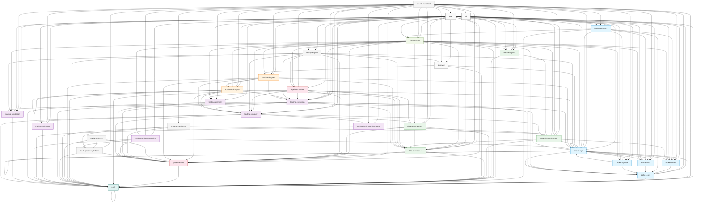

# Module Dependency Graph

Auto-generated from `settings.gradle` and subproject `build.gradle` files.

```mermaid
graph TD
    app["app"]:::entry
    architecture_test["architecture-test"]:::other
    broker_api["broker-api"]:::broker
    broker_core["broker-core"]:::broker
    broker_dhan["broker-dhan"]:::broker
    broker_gateway["broker-gateway"]:::broker
    broker_icici["broker-icici"]:::broker
    broker_upstox["broker-upstox"]:::broker
    cli["cli"]:::entry
    composition["composition"]:::composition
    core["core"]:::core
    data_analytics["data-analytics"]:::data
    data_feature_store["data-feature-store"]:::data
    data_historical_ingest["data-historical-ingest"]:::data
    data_persistence["data-persistence"]:::data
    gateway["gateway"]:::entry
    pipeline_core["pipeline-core"]:::pipeline
    pipeline_runtime["pipeline-runtime"]:::pipeline
    replay_engine["replay-engine"]:::other
    runtime_disruptor["runtime-disruptor"]:::runtime
    runtime_hotpath["runtime-hotpath"]:::runtime
    trade_analytics["trade-analytics"]:::other
    trade_node_library["trade-node-library"]:::other
    trade_pipeline_platform["trade-pipeline-platform"]:::other
    trading_execution["trading-execution"]:::trading
    trading_indicators["trading-indicators"]:::trading
    trading_institutional_scanner["trading-institutional-scanner"]:::trading
    trading_options_analytics["trading-options-analytics"]:::trading
    trading_scanner["trading-scanner"]:::trading
    trading_simulation["trading-simulation"]:::trading
    trading_strategy["trading-strategy"]:::trading
    app --> broker_api
    app --> broker_core
    app --> broker_dhan
    app --> broker_gateway
    app --> broker_icici
    app --> broker_upstox
    app --> composition
    app --> core
    app --> data_analytics
    app --> data_feature_store
    app --> data_historical_ingest
    app --> data_persistence
    app --> gateway
    app --> pipeline_core
    app --> pipeline_runtime
    app --> replay_engine
    app --> runtime_disruptor
    app --> runtime_hotpath
    app --> trading_execution
    app --> trading_indicators
    app --> trading_institutional_scanner
    app --> trading_options_analytics
    app --> trading_scanner
    app --> trading_simulation
    app --> trading_strategy
    architecture_test --> app
    architecture_test --> broker_api
    architecture_test --> broker_core
    architecture_test --> broker_dhan
    architecture_test --> broker_gateway
    architecture_test --> broker_icici
    architecture_test --> broker_upstox
    architecture_test --> cli
    architecture_test --> composition
    architecture_test --> core
    architecture_test --> data_analytics
    architecture_test --> data_feature_store
    architecture_test --> data_historical_ingest
    architecture_test --> data_persistence
    architecture_test --> gateway
    architecture_test --> pipeline_core
    architecture_test --> pipeline_runtime
    architecture_test --> runtime_disruptor
    architecture_test --> runtime_hotpath
    architecture_test --> trade_node_library
    architecture_test --> trade_pipeline_platform
    architecture_test --> trading_execution
    architecture_test --> trading_indicators
    architecture_test --> trading_institutional_scanner
    architecture_test --> trading_options_analytics
    architecture_test --> trading_scanner
    architecture_test --> trading_simulation
    architecture_test --> trading_strategy
    broker_api --> broker_api
    broker_api --> broker_dhan
    broker_api --> broker_icici
    broker_api --> broker_upstox
    broker_api --> core
    broker_core --> broker_api
    broker_core --> core
    broker_dhan --> broker_api
    broker_dhan --> broker_core
    broker_gateway --> broker_api
    broker_gateway --> broker_core
    broker_gateway --> broker_dhan
    broker_gateway --> broker_icici
    broker_gateway --> broker_upstox
    broker_gateway --> composition
    broker_gateway --> core
    broker_icici --> broker_api
    broker_icici --> broker_core
    broker_upstox --> broker_api
    broker_upstox --> broker_core
    cli --> broker_api
    cli --> broker_dhan
    cli --> broker_gateway
    cli --> broker_icici
    cli --> broker_upstox
    cli --> composition
    cli --> core
    cli --> data_analytics
    cli --> data_historical_ingest
    cli --> data_persistence
    cli --> trading_indicators
    cli --> trading_scanner
    cli --> trading_simulation
    composition --> broker_api
    composition --> broker_core
    composition --> broker_dhan
    composition --> broker_icici
    composition --> broker_upstox
    composition --> core
    composition --> data_analytics
    composition --> data_feature_store
    composition --> data_historical_ingest
    composition --> data_persistence
    composition --> pipeline_core
    composition --> pipeline_runtime
    composition --> replay_engine
    composition --> runtime_disruptor
    composition --> runtime_hotpath
    composition --> trading_execution
    composition --> trading_options_analytics
    composition --> trading_scanner
    composition --> trading_simulation
    composition --> trading_strategy
    core --> core
    data_analytics --> core
    data_analytics --> data_historical_ingest
    data_feature_store --> core
    data_feature_store --> data_persistence
    data_feature_store --> pipeline_core
    data_historical_ingest --> broker_api
    data_historical_ingest --> broker_dhan
    data_historical_ingest --> core
    data_historical_ingest --> data_persistence
    data_persistence --> core
    data_persistence --> pipeline_core
    gateway --> broker_api
    gateway --> core
    gateway --> runtime_hotpath
    pipeline_core --> core
    pipeline_runtime --> core
    pipeline_runtime --> data_feature_store
    pipeline_runtime --> data_persistence
    pipeline_runtime --> pipeline_core
    pipeline_runtime --> trading_execution
    pipeline_runtime --> trading_scanner
    pipeline_runtime --> trading_strategy
    replay_engine --> broker_api
    replay_engine --> core
    replay_engine --> data_persistence
    replay_engine --> gateway
    replay_engine --> pipeline_core
    replay_engine --> pipeline_runtime
    replay_engine --> trading_execution
    replay_engine --> trading_simulation
    replay_engine --> trading_strategy
    runtime_disruptor --> broker_api
    runtime_disruptor --> core
    runtime_disruptor --> data_persistence
    runtime_disruptor --> pipeline_core
    runtime_disruptor --> runtime_disruptor
    runtime_disruptor --> runtime_hotpath
    runtime_disruptor --> trading_execution
    runtime_disruptor --> trading_strategy
    runtime_hotpath --> broker_api
    runtime_hotpath --> core
    runtime_hotpath --> data_persistence
    runtime_hotpath --> pipeline_core
    runtime_hotpath --> runtime_disruptor
    runtime_hotpath --> trading_execution
    runtime_hotpath --> trading_strategy
    trade_analytics --> core
    trade_analytics --> pipeline_core
    trade_analytics --> trade_pipeline_platform
    trade_node_library --> core
    trade_node_library --> data_historical_ingest
    trade_node_library --> pipeline_core
    trade_node_library --> trade_pipeline_platform
    trade_pipeline_platform --> core
    trade_pipeline_platform --> pipeline_core
    trading_execution --> broker_api
    trading_execution --> broker_core
    trading_execution --> core
    trading_execution --> data_persistence
    trading_execution --> pipeline_core
    trading_execution --> trading_simulation
    trading_execution --> trading_strategy
    trading_indicators --> core
    trading_institutional_scanner --> core
    trading_institutional_scanner --> data_historical_ingest
    trading_options_analytics --> broker_api
    trading_options_analytics --> core
    trading_options_analytics --> pipeline_core
    trading_options_analytics --> trade_pipeline_platform
    trading_scanner --> broker_api
    trading_scanner --> core
    trading_scanner --> pipeline_core
    trading_simulation --> core
    trading_strategy --> core
    trading_strategy --> data_feature_store
    trading_strategy --> data_historical_ingest
    trading_strategy --> pipeline_core
    trading_strategy --> trading_indicators
    trading_strategy --> trading_institutional_scanner

    classDef broker fill:#e1f5fe,stroke:#0288d1
    classDef trading fill:#f3e5f5,stroke:#7b1fa2
    classDef data fill:#e8f5e9,stroke:#388e3c
    classDef runtime fill:#fff3e0,stroke:#f57c00
    classDef pipeline fill:#fce4ec,stroke:#c62828
    classDef entry fill:#fafafa,stroke:#424242
    classDef composition fill:#f1f8e9,stroke:#558b2f
    classDef core fill:#e0f2f1,stroke:#00695c
    classDef other fill:#f5f5f5,stroke:#9e9e9e
```
